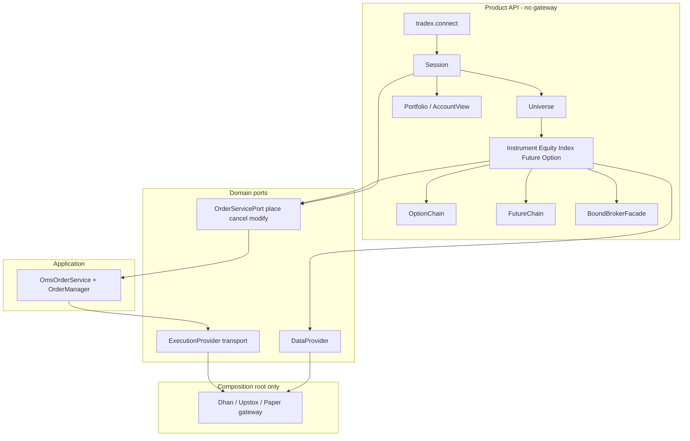

# Object-Model Capability Completion — Design & Test Pyramid

| Field | Value |
|-------|--------|
| **Title** | Complete instrument-centric product API (portfolio, order lifecycle, broker parity, extensions) |
| **Date** | 2026-07-09 |
| **Status** | **Complete** — OM-A…E + PR-5 AssetKind + extensions + L3 live pack · 2026-07-09 |
| **Parent** | `OBJECT_MODEL_COMPLETION_DESIGN.md`, `TRADEHULL_DX_REFERENCE_DESIGN.md`, `BROKER_UX_STANDARDIZATION_DESIGN.md` |
| **Non-goals** | Gateway in strategy code; god-object broker SDK; AssetKind PR-5 (ETF/crypto) this tranche |

---

## 1. Problem

Strategy authors need **objects**, not gateways:

```text
Instrument  → quote / history / subscribe / buy / cancel / modify
OptionChain → composed of Option instruments
FutureChain → composed of Future instruments
Session     → portfolio / funds / positions (domain aggregates)
            → broker extensions via instrument.broker.*
```

Gaps remaining after TH-1…5 + extension wiring:

| Gap | User impact |
|-----|-------------|
| No `instrument.cancel` / `modify` via OMS | Must drop to gateway or incomplete Session |
| `OrderServicePort` is place-only | Lifecycle incomplete |
| No `session.portfolio` / funds surface | Account state not object-model |
| Upstox DataProvider not registered | Upstox connect market ≠ paper DX for reads |
| Tests ad hoc | No pyramid / scenario IDs for regression |

---

## 2. Architecture (keep)



**Invariants**

1. Domain never imports `brokers` / `tradex` (except tests).
2. Instrument orders use **OrderServicePort only** (place/cancel/modify).
3. Live `mode=trade` requires process OMS; `mode=market` orders disabled.
4. Extensions are plugins on `instrument.broker`, never raw gateway.

---

## 3. Detailed design

### 3.1 Order lifecycle (OMS)

Extend `OrderServicePort`:

```python
class OrderServicePort(Protocol):
    def place(self, intent: OrderIntent) -> OrderResult: ...
    def cancel(self, order_id: str) -> OrderResult: ...
    def modify(self, request: ModifyOrderRequest) -> OrderResult: ...
```

`OmsOrderService` wires:

- `cancel` → `OrderManager.cancel_order(id, cancel_fn=EP.cancel_order success bool)`
- `modify` → `OrderManager.modify_order(req, modify_fn=EP.modify_order)`

Instrument / Session:

```python
result = instrument.buy(1, price=Decimal("100"))
instrument.cancel(result.order.order_id)   # or session.cancel(order_id)
instrument.modify(order_id, price=Decimal("99"), quantity=2)
```

Market mode: all three raise `ORDERS_DISABLED` (Session.place already gates; cancel/modify same).

### 3.2 Account / Portfolio object

New product surface on Session (not gateway):

```python
view = session.account          # AccountView
view.refresh()                  # pulls EP.get_positions/holdings/funds
view.portfolio                  # domain.portfolio.Portfolio aggregate
view.positions                  # list[Position]
view.holdings                   # list[Holding]
view.funds                      # Balance | None
view.portfolio.total_pnl
```

Implementation:

- `AccountView` in `domain/portfolio/account_view.py`
- Reads **ExecutionProvider** only (already has get_positions/holdings/funds)
- Builds `Portfolio` from positions
- Session property `account` lazily constructs from `execution_provider`
- If no EP: empty view with clear error on refresh

### 3.3 Upstox DataProvider parity

Mirror Dhan:

- `brokers/upstox/data_provider.py` — `get_quote`, `get_history`, batch, option_chain normalize
- `register_data_adapter("upstox", UpstoxDataProvider)` in `brokers/upstox/__init__.py`
- Extensions already register depth_30; connect path instantiates them

### 3.4 Instrument surface checklist (product)

| Method / state | Equity | Index | Future | Option | Notes |
|----------------|--------|-------|--------|--------|-------|
| refresh / ltp / bid / ask | ✅ | ✅ | ✅ | ✅ | |
| history | ✅ | ✅ | ✅ | ✅ | TF normalize |
| depth / subscribe | ✅ | ✅ | ✅ | ✅ | |
| buy/sell/limit/market | ✅ | ✅ | ✅ | ✅ | OMS |
| cancel / modify | ✅ | ✅ | ✅ | ✅ | **this tranche** |
| option_chain | — | ✅ | — | — | composition |
| future_chain | — | ✅ | — | — | composition |
| broker.depth* | ✅ | ✅ | ✅ | ✅ | capability |
| greeks / IV | — | — | — | ✅ | |
| basis / rollover | — | — | ✅ | — | |

### 3.5 Completed later in same train

- ✅ AssetKind + ETF / Commodity / Spot / Currency + `register_exchange`
- ✅ Dhan `super_order` / `forever_order` + Upstox `news` as `instrument.broker.*` extensions
- ✅ L3 live_readonly pack (skip without `.env.local` / `.env.upstox`)

Still out of scope: multi-account, GTT as OMS-native (remains extension), crypto masters.

---

## 4. Test pyramid

```text
        ╱╲
       ╱ L3╲     live_market  (opt-in @pytest.mark.live, secrets)
      ╱──────╲
     ╱   L2   ╲   e2e paper connect scenarios (CI always)
    ╱──────────╲
   ╱     L1     ╲ integration: Session + fakes + OMS bridge
  ╱──────────────╲
 ╱       L0       ╲ unit: pure domain (no I/O, fakes only)
╱──────────────────╲
```

### L0 — Unit (fast, no network)

| ID | Assert |
|----|--------|
| `U-PORTFOLIO-PNL` | Portfolio total/unrealized math |
| `U-ACCOUNT-EMPTY` | AccountView without EP |
| `U-STRIKE-ATM` | select_strikes ATM/OTM |
| `U-DISPLAY-NAME` | parse/format round-trip |
| `U-TF-MAP` | normalize_timeframe |
| `U-FACADE-BIND` | BoundBrokerFacade binds symbol |

### L1 — Integration (fakes + real OMS stack)

| ID | Assert |
|----|--------|
| `I-OMS-PLACE-CANCEL` | place then cancel via OmsOrderService |
| `I-OMS-MODIFY` | modify price via OMS + EP |
| `I-INSTR-CANCEL` | instrument.cancel after buy (paper session) |
| `I-ACCOUNT-REFRESH` | AccountView from FakeEP positions |
| `I-MODE-MARKET-BLOCK` | cancel/modify also ORDERS_DISABLED |
| `I-UPSTOX-ADAPTER` | create_data_adapter returns UpstoxDataProvider (mock gw) |

### L2 — E2E paper (CI)

| ID | Assert |
|----|--------|
| `E-PAPER-CONNECT` | status ReadyTrade, orders_enabled |
| `E-PAPER-QUOTE-HIST` | equity refresh + history |
| `E-PAPER-ORDER-CYCLE` | buy → cancel |
| `E-PAPER-ACCOUNT` | account.refresh positions/funds shape |
| `E-PAPER-CHAIN` | option_chain select_strikes (if paper chain) |

### L3 — Live (optional)

| ID | Assert |
|----|--------|
| `L-DHAN-MARKET` | connect market + ltp_many |
| `L-DHAN-CAPS` | capabilities include depth_20 |
| `L-UPSTOX-MARKET` | connect market + equity.refresh |

Markers: `@pytest.mark.live`, skip without `.env.local` / `.env.upstox`.

---

## 5. Key decisions

| # | Decision | Rationale |
|---|----------|-----------|
| D1 | Cancel/modify on OrderServicePort, not EP from Instrument | Same as place — ENG-011 |
| D2 | AccountView over raw EP lists | Object model + Portfolio aggregate reuse |
| D3 | Upstox DataProvider in brokers/upstox | ADR-007 self-register |
| D4 | Test pyramid with scenario IDs | Traceable CI, design acceptance |
| D5 | Defer AssetKind | Needs master data product input |

---

## 6. PR Plan (implementation order)

| PR | Title | Scope |
|----|-------|--------|
| **OM-A** | OrderServicePort cancel/modify + OmsOrderService | port, session_bridge, tests L1 |
| **OM-B** | Instrument/Session cancel/modify + market gate | instrument, universe, L1/L2 |
| **OM-C** | AccountView + session.account | portfolio package, L0/L1/L2 |
| **OM-D** | Upstox DataProvider registration | brokers/upstox, L1 |
| **OM-E** | Scenario pack + docs | `tests/scenarios/`, OBJECT_MODEL.md |

Dependencies: A → B; C parallel to A; D parallel; E last.

---

## 7. Acceptance

1. Paper: `buy` → `cancel` via instrument, no gateway import.
2. `session.account.refresh()` returns Portfolio with positions from paper EP.
3. `tradex.connect("upstox", mode="market")` (mocked) uses UpstoxDataProvider.
4. Market mode: cancel/modify raise ORDERS_DISABLED.
5. Pyramid tests green: all L0–L2 in CI; L3 skipped without secrets.
6. Strategy code path never references `*Gateway`.

---

## 8. Open questions

None blocking this tranche. AssetKind exchange codes remain product input for later PR-5.
