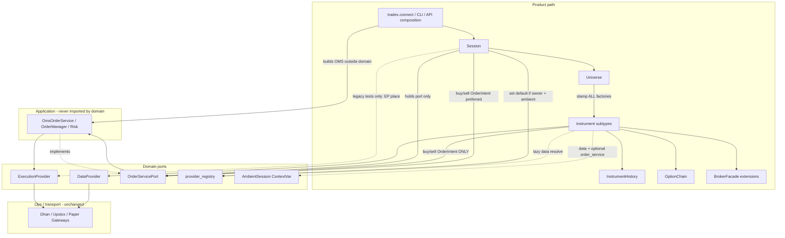
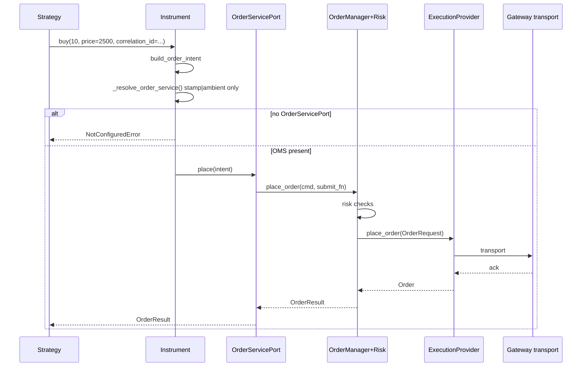
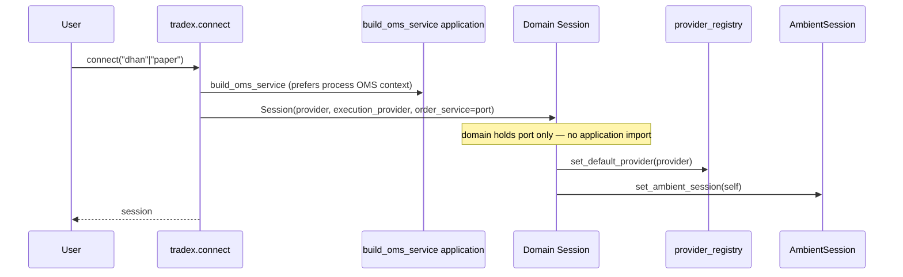
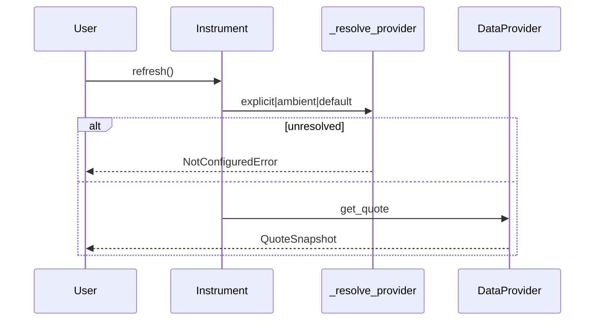
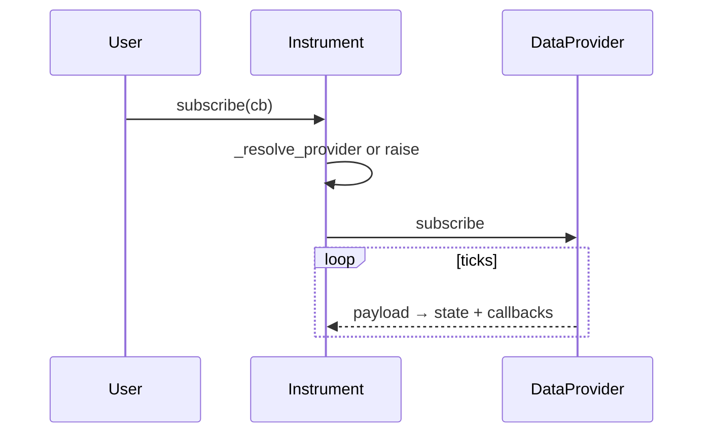
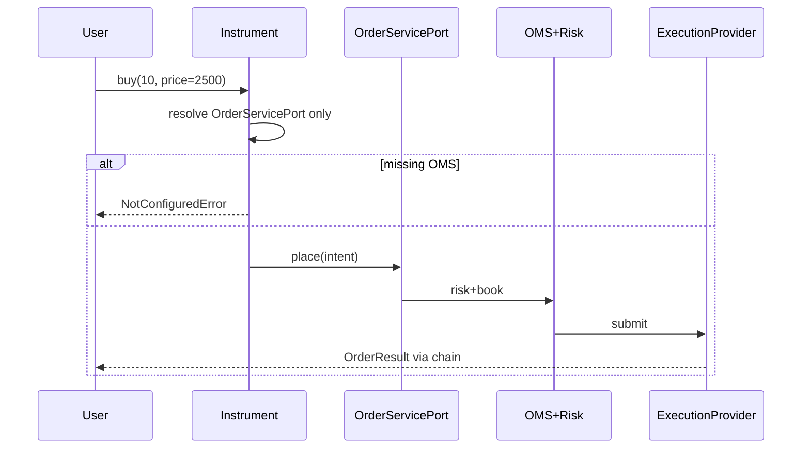
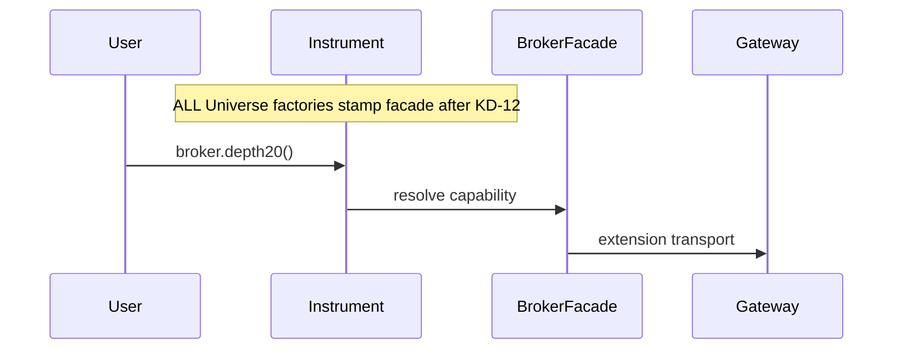

# Completing the Institutional Object-Model Trading SDK

| Field | Value |
|-------|-------|
| **Title** | Completing the Institutional Object-Model Trading SDK (Brokers / Public API) |
| **Author** | Systems Architecture (Trade_XV2) |
| **Date** | 2026-07-09 |
| **Status** | **Implemented** (PR-0…PR-4 code + PR-6 docs, 2026-07-09) · Rev 2 design |
| **Branch context** | `refactor/brokers-consolidation` |
| **Supersedes** | Residual intent of `brokers/OBJECT_MODEL_PLAN.md` / ENG-041 (plan superseded; product object model incomplete) |
| **Related** | `reports/SAFE_TO_TRADE_GATE.md` (**program P0 — blocks this design**), `reports/BROKERS_EVOLUTION_PLAN.md`, `reports/ENGINEERING_BACKLOG.md` |
| **Import-linter** | `domain ↛ analytics|application|brokers|tradex|…` (`pyproject.toml` contract “Domain independence”) |

---

## Overview

TradeX already has a viable product spine: `tradex.connect` → `Session` → `Universe` → `Instrument` (Equity / Index / Future / Option), with market-data methods on the instrument, option-chain aggregates, broker capability extensions via `BrokerFacade`, and a mandatory live OMS path (`OrderIntent` → `OrderServicePort` → `ExecutionProvider`). Gateways remain transport; the public path is ports + domain objects.

What is incomplete is the *institutional object model* that strategy authors expect: bare instruments that resolve a provider after a session is open, first-class order verbs on the instrument without bypassing OMS, a rich attached history surface, implemented Future/Option analytics, and additional asset classes. This design completes those gaps **additively**, without gateway rewrites, without merging Dhan/Upstox trees, and without weakening the live OMS guarantees from ENG-001 / ENG-011.

**Hard invariants (non-negotiable):**

1. Domain never imports `analytics`, `application`, `brokers`, or `tradex` (import-linter).
2. `Instrument` order verbs resolve **only** `OrderServicePort` — never `ExecutionProvider.place_order`.
3. Composition root (`tradex.session.open_session` / CLI / API) builds OMS and stamps it; domain objects never call `build_oms_service`.
4. Process default provider is cleared on `Session.close` **only if it still points at this session’s provider**.

---

## Background & Motivation

### Current state (keep / extend)

| Layer | Location | Role |
|-------|----------|------|
| Public factory | `tradex/session.py` (`open_session` / `connect`) | Composition root: gateway → DataProvider + ExecutionProvider + OMS |
| Domain session | `src/domain/universe.py` (`Session`, `Universe`) | Binds providers; `set_default_provider`; `session.buy/sell` |
| Instrument aggregate | `src/domain/instruments/instrument.py` | Quote/LTP/depth/subscribe/history/option_chain/statistics/snapshot/broker |
| Identity | `src/domain/instruments/instrument_id.py` | Canonical `exchange:underlying[:expiry[:strike:right]]` |
| Ports | `src/domain/ports/protocols.py`, `order_service.py`, `provider_registry.py` | DataProvider, ExecutionProvider, OrderServicePort, default provider registry |
| History VO | `src/domain/candles/historical.py` | `HistoricalSeries` with resample, indicators, export, provenance |
| Indicators facade | `src/domain/indicators/indicators.py` | Calls `instrument.history()` then `.bars` |
| Option chain | `src/domain/options/option_chain.py` | ATM/calls/puts/PCR/max_pain; builds `Option.from_leg` |
| OMS bridge | `application/oms/session_bridge.py` | `OmsOrderService`, `build_oms_service` (process OMS preferred; live refuses phantom capital) |
| Extensions | `src/domain/extensions/facade.py` | `BrokerFacade` capability forwarder (`depth20`, etc.) |
| API reference path | `api/v2/domain_endpoints.py` | Session-wired quote/history/chain/order |
| Platform tests (intent) | `src/domain/tests/markets/test_platform_api.py` | Already assumes bare Equity + `set_default_provider` — vision incomplete in production code |

**Verified true today:**

- `tradex.connect` → `build_oms_service` → domain `Session(order_service=...)`.
- `Session.__init__` calls `set_default_provider`; **Instrument never calls `get_default_provider`**.
- No order API on Instrument; Future/Option analytic methods are stubs.
- `InstrumentId.VALID_EXCHANGES == {NSE, BSE, NFO, MCX}`; index name heuristic for `asset_type`.
- `HistoricalSeries` has resample / indicators / `to_dataframe`; **no** `.empty` or DataFrame-like `.to_dict`.
- **API v2 history is a known defect:** `api/v2/domain_endpoints.py` treats `instrument.history(...)` as a pandas DataFrame (`.to_dict` / `.empty`) while production returns `HistoricalSeries`.
- Unit tests are **stale**: `tests/unit/domain/instruments/test_instrument.py` expects `history()` → `pd.DataFrame` and `refresh()` → `None` without provider, but production `refresh()` raises `NotConfiguredError` and history returns `HistoricalSeries` or empty series.
- `Universe.equity` / `index` call `_stamp` (broker facade); **`future` / `option` / `get` do not** — facade/order stamp gaps.
- CLI `BrokerService` remains gateway-centric and registers process OMS (`register_oms_context`); coexists with `build_oms_service` preference for process context.

Product path today (Session-wired instruments — **works for paper connect**):

```python
import tradex
session = tradex.connect("paper")
reliance = session.universe.equity("RELIANCE")
reliance.refresh()
series = reliance.history(timeframe="5m", days=5)  # HistoricalSeries
result = session.buy(reliance, 10, price=2500)  # Intent → OMS → Execution
```

API `/v2/history` does **not** correctly serialize that series today (defect, not a working product path).

### Pain points

1. **Bare construction is half-broken.** `Equity("RELIANCE")` is exported from `tradex` and constructs identity, but `_provider` stays `None`. `Session.__init__` already calls `set_default_provider(provider)`, yet `Instrument` never reads `get_default_provider()`. Method soft-fail is inconsistent (see behavior table). Platform tests already encode the bare+default vision as acceptance criteria for PR-1 — this program completes intended behavior, not only notebook DX.

2. **Orders only on Session.** Strategy authors want `instrument.buy(10, price=...)`. ExecutionProvider is stamped on some Universe paths, but there is **no** order API on Instrument. Live must not call `_executor.place_order` from Instrument (ENG-011).

3. **History is a one-shot method.** `Instrument.history(...)` returns `HistoricalSeries` (good VO). Missing: attached facade with download/refresh lifecycle and cache policy. Consumers: API v2 (broken), `domain/indicators/indicators.py`, unit/platform tests (stale).

4. **Future / Option methods are stubs.**

5. **Missing asset types** and identity model gaps (`asset_type` heuristic; exchange allowlist).

6. **Transport still visible in CLI/tests.** Acceptable as ops path. Process OMS registration when CLI + `tradex.connect` coexist is via `has_oms_context()` / `get_oms_context()` in `build_oms_service` — product PRs must not break that reuse.

7. **`Session.close` wipes process default provider unconditionally** — unsafe for multi-session notebooks even before AmbientSession.

### Why now

Brokers evolution Waves A–E finished transport/port cleanup. Highest leverage is **domain product completeness**.

---

## Goals & Non-Goals

### Goals

1. Resolve `DataProvider` for bare and session-built instruments consistently and safely (including registry close hygiene).
2. Add `instrument.buy` / `sell` / order helpers that use the **OMS-only** spine (shared placement helpers with Session place-intent path).
3. Introduce `InstrumentHistory` as a rich, attached history facade wrapping provider + `HistoricalSeries`.
4. Implement Future/Option domain methods with **pure domain math only** (no analytics import).
5. Extend identity + instrument subtypes for additional asset classes **after** identity/exchange decisions and at least one provider consumer path (deferred product batches).
6. Document blast radius, compatibility, rollout, and a concrete PR sequence with Definition of Done.
7. Keep CLI/API product paths on Session/Universe; transport remains ops-only.

### Non-Goals

- No gateway rewrite; no new fat methods on gateways for product features.
- No Dhan/Upstox tree merge or package layout unification.
- No deleting transport / CLI gateway usage.
- No decorator instrument stack for capabilities (keep `BrokerFacade` / extensions).
- No multi-writer HA OMS, partial-fill paper redesign, or HA order store (DEF-*).
- No forcing migration of every CLI command in Phase 1.
- No pandas as a domain dependency for core fetch paths (lazy export only).
- **No `domain → analytics` imports** (lazy or eager) — import-linter forbids it. Heavy solvers: domain-local or injected port only.
- **No `domain → application` imports** — Instrument/Session never import or call `build_oms_service` / `application.oms`.
- **Instrument cancel / modify / order-status lifecycle APIs** — out of scope for this program (place-only on Instrument; Session/OMS book remains the ops surface for cancel/modify). See KD-10.
- No multi-leg Synthetic execution in v1.

---

## Key Decisions

| # | Decision | Choice | Rationale |
|---|----------|--------|-----------|
| **KD-1** | Provider resolution | **Lazy default provider + AmbientSession ContextVar with token reset; registry cleared only if still this session’s provider** | Bare instruments work after connect; multi-session close must not blank the surviving session’s default. |
| **KD-2** | `instrument.buy` routing | **Stamp `OrderServicePort` (weak) via Universe; OMS only. No ExecutionProvider fallback on Instrument.** | EP fallback reopens live risk bypass. Session may retain legacy EP-only path for existing tests until migrated. |
| **KD-3** | History surface | **`InstrumentHistory` callable facade; transforms do not overwrite download cache by default** | Preserves call shape; typing + cache policy specified; test migrations required. |
| **KD-4** | Session vs Instrument orders | **Both public; shared `domain/orders/placement.py` is mandatory (no dual semantics)** | Single intent builder; Instrument OMS-only; Session place keeps optional EP legacy. |
| **KD-5** | New asset types | **Deferred until explicit `asset_type`/kind on identity + exchange decision + ≥1 provider path** | Hollow public types without masters are product debt. |
| **KD-6** | Future/Option analytics | **Pure domain helpers only (`derivatives_math.py`). Optional later: `OptionPricerPort` injected at composition root — never import analytics from domain.** | Import-linter: `domain ↛ analytics`. |
| **KD-7** | Compatibility | **Additive first; semantic None→Decimal on derivatives documented as break with test updates in same PR** | No multi-release deprecation for stubs that returned only None. |
| **KD-8** | Transport boundary | **Unchanged** | Product work in domain/tradex/tests/docs/thin API. |
| **KD-9** | Instrument order admission | **OMS-only on Instrument (stamp → ambient order_service). Raise if missing. Never EP.** | Money-path control; differs from Session.place dual path intentionally. |
| **KD-10** | Order lifecycle on Instrument | **Place-only (buy/sell/market/limit/stop_loss/intent). Cancel/modify/status remain Session/OMS/ExecutionProvider surfaces.** | Avoid half-built order manager on Instrument; asymmetric by design for this program. |
| **KD-11** | Data vs order ambient rules | **Data may use process default provider. Orders require stamped OMS or active ambient Session with `order_service`. Default provider alone never admits orders.** | Documentation is not a control; fail closed + metric/warning on ambient order path. |
| **KD-12** | Universe stamping | **All factories (`equity`, `index`, `future`, `option`, `get`) call unified stamp: data + execution + order_service + facade** | Today only equity/index stamp facade — gap closed in PR-3 (ports) and PR-1 if facade-only needed earlier. |
| **KD-13** | Chain-built Options as order surface | **After PR-3, `chain.atm.buy` works only via ambient OMS (or PR-3b stamp). Not the primary institutional surface until PR-3b.** | Avoid overstating DX; legs get data_provider today only. |

---

## Proposed Design

### Architecture (target)



### Layering invariant (orders)

```
tradex.session.open_session / CLI BrokerService / FastAPI create_app
    → build_oms_service(...) | register_oms_context(...)   # application
    → Session(provider, execution_provider, order_service=port)
    → Universe stamps weakref(order_service) on every Instrument factory
    → Instrument.buy → OrderServicePort.place(OrderIntent)
```

**Forbidden in `src/domain/**`:** any import of `application`, `analytics`, `brokers`, `tradex`.  
**Fitness:** architecture test that `instrument.py` / `universe.py` / `orders/placement.py` have zero edges into those packages; `lint-imports` green.

**Weakref trade-off:** If Session (and thus the only strong owner of `OrderServicePort`) is GC’d while instruments remain, order resolution fails closed (`NotConfiguredError`). Preferable to leaking OMS / accidental zombie orders. Strong refs are **not** used for order_service on Instrument.

---

### KD-1 — Provider resolution

#### Resolution order (authoritative) — data methods only

When `Instrument` needs a `DataProvider` (refresh, history, depth, subscribe, option_chain, future_chain):

1. **Explicit** `self._provider` if set at construction or stamped by Universe.
2. **AmbientSession** ContextVar: if set, use `session.provider`.
3. **Default registry** `get_default_provider()`.
4. Else: raise `NotConfiguredError` pointing to `tradex.connect(...)`.

#### Soft-fail → strict: method behavior table

| Method | Before (today) | After PR-1 |
|--------|----------------|------------|
| `refresh()` | `NotConfiguredError` if no provider | Unchanged intent: resolve then fetch; raise if unresolved |
| `history(...)` / facade download | Empty `HistoricalSeries` if no provider | **Raise** `NotConfiguredError` if unresolved |
| `depth()` | `None` if no provider | **Raise** `NotConfiguredError` if unresolved |
| `subscribe()` | Returns `None` if no provider | **Raise** `NotConfiguredError` if unresolved |
| `unsubscribe()` | No-op if no sub | Unchanged |
| `option_chain()` | `OptionChain.empty()` if no provider | **Raise** `NotConfiguredError` if unresolved |
| `future_chain()` | `FutureChain.empty()` if no provider | **Raise** `NotConfiguredError` if unresolved |
| `broker` | `None` if no provider | Unchanged (`None` if unresolved / no name) — not a data fetch |

Provider **present** but no data still returns empty series / None quote as today.

#### No env feature flag for soft-fail (Rev 2)

Drop `TRADEX_STRICT_PROVIDER`. Strict raise is the product default after PR-1. Emergency opt-out is **not** shipped; if ops need soft-empty again, that is a follow-up with explicit product approval. Rationale: dual modes multiply test matrix and hide mis-wiring.

#### Registry ownership & Session.close

```python
# Session.__init__
set_default_provider(provider)          # last writer wins (document)
set_ambient_session(self)               # ContextVar default for this task

# Session.close — MUST NOT wipe another session’s provider
def close(self) -> None:
    if get_default_provider() is self._provider:
        set_default_provider(None)
    clear_ambient_session_if_current(self)
```

#### AmbientSession API (token / stack semantics)

```python
# src/domain/ports/session_context.py
from contextlib import contextmanager
from contextvars import ContextVar, Token
from typing import Iterator, TYPE_CHECKING

if TYPE_CHECKING:
    from domain.universe import Session

_ambient: ContextVar["Session | None"] = ContextVar("ambient_session", default=None)

def get_ambient_session() -> "Session | None":
    return _ambient.get()

def set_ambient_session(session: "Session | None") -> Token:
    return _ambient.set(session)

def reset_ambient_session(token: Token) -> None:
    _ambient.reset(token)

def clear_ambient_session_if_current(session: "Session") -> None:
    if _ambient.get() is session:
        _ambient.set(None)

@contextmanager
def activate_session(session: "Session") -> Iterator["Session"]:
    """Nested-safe activation for notebooks / multi-session REPL."""
    token = set_ambient_session(session)
    # Optionally also push default provider for this scope:
    prev_default = get_default_provider()
    set_default_provider(session.provider)
    try:
        yield session
    finally:
        reset_ambient_session(token)
        # Restore default only if we still own it
        if get_default_provider() is session.provider:
            set_default_provider(prev_default)
```

`Session.activate()` is an alias method wrapping `activate_session(self)`.

#### Threading / multi-session policy

| Mode | Policy |
|------|--------|
| API / CLI single composition root | **SSOT.** One Session via DI / process OMS. Ambient is convenience mirror. |
| Notebook two Sessions | Prefer `session.universe.*`. Use `with session.activate():` for bare instruments. |
| Concurrent threads / `ThreadPoolExecutor` | ContextVars do **not** auto-propagate to workers unless `contextvars.copy_context().run(...)`. **Do not rely on ambient in worker threads.** Always Universe-stamp instruments for threaded strategies. |
| Last-writer default registry | Process-global; document. Close only clears if still this provider. |

#### Acceptance tests (PR-1)

- Platform: `set_default_provider(fake); Equity("NIFTY").history(...)` returns series with bars (migrate off `.empty` → `bar_count` / `to_dataframe().empty`).
- Multi-session: open A, open B, `A.close()`, bare instrument resolves **B’s** provider.
- Nested `activate()` restores prior ambient + default.
- Thread-pool negative: worker without copy_context does not see ambient (document + test).

---

### KD-2 / KD-9 — `instrument.buy` / OMS-only routing

#### Stamp surface (all Universe factories — KD-12)

```python
class Universe:
    def __init__(self, provider, *, event_bus=None, execution_provider=None, order_service=None):
        self._provider = provider
        self._event_bus = event_bus
        self._execution_provider = execution_provider
        self._order_service = order_service
        self._broker_facade = None

    def _stamp(self, instrument: Instrument) -> Instrument:
        instrument._bind_session_ports(
            data_provider=self._provider,
            execution_provider=self._execution_provider,
            order_service=self._order_service,
        )
        if self._broker_facade is not None:
            instrument._extensions.register(self._broker_facade.broker_id, self._broker_facade)
        return instrument

    def equity(...): return self._stamp(Equity(..., data_provider=self._provider, ...))
    def index(...):  return self._stamp(Index(...))
    def future(...): return self._stamp(Future(...))   # TODAY MISSING _stamp — fix
    def option(...): return self._stamp(Option(...))   # TODAY MISSING _stamp — fix
    def get(...):    return self._stamp(Instrument(...))  # TODAY MISSING _stamp — fix
```

#### Order resolution (Instrument only — KD-9 / KD-11)

1. Weakref `order_service` on instrument if alive.
2. Else ambient Session’s `order_service` if ambient set **and** `order_service is not None`.
3. Else: raise `NotConfiguredError` / `RuntimeError`:
   - Message: use `session.universe.*` or `with session.activate()` after `tradex.connect`; orders require OMS.
4. **Never** fall back to `ExecutionProvider`.
5. **Never** call `build_oms_service` from domain.

When ambient order path is used, emit log warning + increment metric `orders_via_ambient_session` (application metrics hook optional; domain may use logger only if metrics port not available).

#### Shared placement (mandatory — KD-4)

```python
# domain/orders/placement.py
def build_order_intent(
    instrument: Instrument,
    side: Side,
    quantity: int,
    *,
    price: Decimal | None = None,
    order_type: OrderType = OrderType.LIMIT,
    product_type: ProductType = ProductType.INTRADAY,
    trigger_price: Decimal | None = None,
    correlation_id: str | None = None,
) -> OrderIntent:
    kwargs = dict(
        symbol=instrument.symbol,
        exchange=instrument.exchange,
        side=side,
        quantity=quantity,
        price=price if price is not None else Decimal("0"),
        order_type=order_type,
        product_type=product_type,
        trigger_price=trigger_price,
    )
    if correlation_id is not None:
        kwargs["correlation_id"] = correlation_id
    return OrderIntent(**kwargs)

def place_via_order_service(order_service: OrderServicePort, intent: OrderIntent) -> OrderResult:
    return order_service.place(intent)
```

```python
# Instrument.buy — OMS only
def buy(self, quantity, price=None, order_type=..., product_type=..., *, correlation_id=None):
    intent = build_order_intent(self, Side.BUY, quantity, price=price, ..., correlation_id=correlation_id)
    osvc = self._resolve_order_service()  # stamp | ambient; never EP
    if osvc is None:
        raise NotConfiguredError(...)
    return place_via_order_service(osvc, intent)
```

```python
# Session.place — keep dual path for tests until migrated
def place(self, intent: OrderIntent) -> OrderResult:
    if self._order_service is not None:
        return place_via_order_service(self._order_service, intent)
    if self._execution_provider is not None:
        # LEGACY TEST PATH ONLY — not available on Instrument
        return self._execution_provider.place_order(OrderRequest(...))
    raise RuntimeError(...)
```

`Session.buy` / `sell` / … **must** use `build_order_intent` (required refactor in PR-3, not optional).

#### Explicitly forbidden

```python
# FORBIDDEN on Instrument order path
self._executor.place_order(...)
# FORBIDDEN in domain
from application.oms.session_bridge import build_oms_service
```

#### Required unit test (PR-3 DoD)

Instrument with `execution_provider=fake_ep`, `order_service=None`, no ambient OMS → `buy` raises; **`fake_ep.place_order` never called**.

#### Method shape

```python
def buy(self, quantity, price=None, order_type=LIMIT, product_type=INTRADAY, *, correlation_id=None) -> OrderResult: ...
def sell(...): ...
def market(self, quantity, side=BUY, *, correlation_id=None): ...
def limit(self, quantity, price, side=BUY, *, correlation_id=None): ...
def stop_loss(self, quantity, trigger_price, side=BUY, *, correlation_id=None): ...
def intent(self, side, quantity, **kwargs) -> OrderIntent: ...
# Non-goal: cancel_order, modify_order on Instrument (KD-10)
```

#### Sequence (order)



---

### KD-3 — `InstrumentHistory` facade

#### Type

New module: `src/domain/candles/instrument_history.py`

```python
class InstrumentHistory:
    """Attached history control surface.

    Cache policy (normative):
    - `_downloaded`: last series from provider download/refresh only.
    - `_view`: optional last transform result (resample); does NOT replace `_downloaded`.
    - `series` property returns `_view or _downloaded`.
    - `resample` / pure transforms return new HistoricalSeries and set `_view` only.
    - `download` / `refresh` / `__call__` set `_downloaded` and clear `_view`.
    """

    def __init__(self, owner: Instrument) -> None: ...

    def __call__(
        self,
        *,
        timeframe: str = "1D",
        days: int = 120,
        start: str | None = None,
        end: str | None = None,
    ) -> HistoricalSeries:
        """Fetch (same kwargs as today's Instrument.history method)."""
        return self.download(timeframe=timeframe, days=days, start=start, end=end)

    def download(self, **kwargs) -> HistoricalSeries: ...
    def refresh(self, **kwargs) -> HistoricalSeries: ...  # reuses last download params

    @property
    def series(self) -> HistoricalSeries | None:
        return self._view if self._view is not None else self._downloaded

    @property
    def downloaded(self) -> HistoricalSeries | None:
        return self._downloaded

    def resample(self, target_timeframe: str) -> HistoricalSeries:
        base = self.series
        if base is None:
            raise NotConfiguredError("No history loaded; call download() first")
        out = base.resample(target_timeframe)
        self._view = out
        return out

    def indicators(self) -> SeriesIndicators: ...
    def to_dataframe(self): ...
```

#### Typing (public)

```python
class InstrumentHistory(Protocol):  # or concrete class with annotations
    def __call__(
        self,
        *,
        timeframe: str = "1D",
        days: int = 120,
        start: str | None = None,
        end: str | None = None,
    ) -> HistoricalSeries: ...
    def download(self, **kwargs) -> HistoricalSeries: ...
    def refresh(self, **kwargs) -> HistoricalSeries: ...
    @property
    def series(self) -> HistoricalSeries | None: ...
```

```python
class Instrument:
    @property
    def history(self) -> InstrumentHistory:
        return self._history
```

**Typing notes:**

- `inst.history` type is `InstrumentHistory`, not `Callable` alone — checkers see `__call__` for `inst.history(...)`.
- `callable(inst.history)` is True at runtime because of type `__call__`.
- `inst.history` is **not** a bound method; `types.MethodType` checks must not be used as API probes.
- Acceptance: pyright/mypy clean on a small stub test file under `tests/typing/` if repo has checker CI; otherwise annotated public methods + unit tests suffice for this program.

#### Compatibility matrix (attribute access)

| Expression | Before | After |
|------------|--------|-------|
| `inst.history(timeframe="1D", days=5)` | method → series | facade `__call__` → series |
| `inst.history` | bound method | `InstrumentHistory` instance |
| `callable(inst.history)` | True (method) | True (`__call__`) |
| `inst.history.download()` | N/A | series |
| `inst.history.series` | N/A | cached series or None |
| Return type DataFrame | **never true in prod today** | still series; use `.to_dataframe()` |

Optional one-release: if return type of `__call__` is inspected by duck-typing for `.empty`, document migration; **no runtime DataFrame wrap**.

#### History call sites to update (PR-2 blast list)

| Location | Action |
|----------|--------|
| `api/v2/domain_endpoints.py` | `series.to_dataframe().to_dict(...)` / `bar_count` |
| `src/domain/indicators/indicators.py` | `self._inst.history()` still works via `__call__`; verify `.bars` |
| `tests/unit/domain/instruments/test_instrument.py` | Expect series / NotConfiguredError; drop DataFrame asserts |
| `src/domain/tests/markets/test_platform_api.py` | `.empty` → `bar_count == 0` or `to_dataframe().empty` |
| Any notebook docs / tradex examples | Show facade methods |

#### Escape hatch

If production break is severe: restore method `history(...)` and attach facade as `instrument.candles` / `history_book`. Prefer not to; listed for rollback only.

---

### Future / Option method completion — Formulas & edge cases (normative)

**Constraint:** all math in `src/domain/instruments/derivatives_math.py`. **No** `analytics` import. Future optional port:

```python
# domain/ports/option_pricer.py (only if pure domain IV proves insufficient later)
class OptionPricerPort(Protocol):
    def black_scholes(...) -> Decimal: ...
    def implied_volatility(...) -> Decimal | None: ...
# Implemented in application/analytics adapter; injected on Session/Instrument — not imported by domain modules at call sites beyond the Protocol.
```

v1 ships **pure domain only**; do not introduce the port until needed.

#### Future

| Method | Spec |
|--------|------|
| **Underlying resolution** | From `Future.id`: `InstrumentId(exchange=map_underlying_exchange(id.exchange), underlying=id.underlying)` — for NFO FUT, underlying cash exchange defaults to **NSE** (BSE derivatives → BSE if we add later). Spot quote = `provider.get_quote(underlying_id)` unless `spot` arg passed. |
| `basis(spot=None)` | `F - S` where `F = self.ltp or refresh().ltp`, `S = spot or underlying LTP`. Return `None` if F or S missing. |
| `cost_of_carry(rate=None)` | Continuous: `r_implied = ln(F/S) / T` if `rate is None` (return implied). If `rate` provided, return model basis `S*e^{rT} - S` or forward `S*e^{rT}` premium vs F — **normative: return `F - S*exp(r*T)` (basis vs theoretical forward)**. Day-count: **Actual/365.25**, `T = max((expiry - today).days, 0) / 365.25`. If `T==0` or S≤0 or F missing: `None`. Rate is **continuous**. |
| `rollover()` | `chain = provider.get_future_chain(underlying_or_self)`; select contracts with `expiry > self.expiry` sorted ascending; take first. Build `Future(..., expiry=next)` and **stamp same ports** as self (data/exec/order weakrefs + extensions). `None` if none. |
| `continuous()` | **v1: always return empty `HistoricalSeries` with provenance DERIVED and instrument ref**, timeframe `1D`. **Do not** pretend provider continuous support. No new DataProvider method in this program. |

#### Option

| Method | Spec |
|--------|------|
| `payoff(spot)` | CE: `max(spot - strike, 0)`; PE: `max(strike - spot, 0)`. Always `Decimal`. |
| `intrinsic_value(spot)` | Same as payoff (vanilla European exercise value). |
| `extrinsic_value(spot)` | If `ltp` known: `ltp - intrinsic`; else `None`. |
| `moneyness(spot)` | **Normative ATM band:** `band = max(tick_size, abs(spot) * Decimal("0.0005"))`. If `abs(spot - strike) <= band` → `"ATM"`; else CE: spot>strike ITM else OTM; PE inverse. Returns one of `"ITM"\|"ATM"\|"OTM"`. |
| `black_scholes(spot, rate=None, vol=None, *, t=None, dividend_yield=None)` | **European** only. `rate` default `Decimal("0")`. `dividend_yield` default `0`. `vol` default `self.iv` if set else `None` → return `None` if vol missing. `t` default from `(expiry - today)/365.25` Actual/365.25; if expiry None or t≤0: return intrinsic. Standard BS call/put. |
| `implied_volatility(market_price, spot=None, rate=None, *, t=None)` | Brent on price residual in domain; bounds vol `(1e-6, 5.0)`; max iter 100; return `None` on non-converge. `spot` default mid/ltp. |

**Semantic break:** methods that returned `None` stubs now return `Decimal`/`str` when inputs valid. No deprecation window — update tests in PR-4. Callers that used `is None` as “unimplemented” must use try/inputs checks.

---

### New instrument types (deferred productization)

#### Identity model (required before public subtypes — PR-5+)

Prefer **explicit kind** on `InstrumentId` (or parallel field) rather than name heuristics alone:

```python
class AssetKind(str, Enum):
    EQUITY = "EQUITY"
    INDEX = "INDEX"
    FUTURE = "FUTURES"
    OPTION = "OPTIONS"
    ETF = "ETF"
    CURRENCY = "CURRENCY"
    COMMODITY = "COMMODITY"
    SPOT = "SPOT"
    CRYPTO = "CRYPTO"
    BOND = "BOND"
    SYNTHETIC = "SYNTHETIC"
```

- Factories set `kind` explicitly; `asset_type` property reads `kind` with fallback to current heuristic for old IDs.
- **Commodity vs Future:** MCX commodity futures are `Future` with `kind=COMMODITY` (or `Commodity` thin subclass of `Future` sharing expiry/basis). Do **not** dual-model the same contract as unrelated types.
- **ETF / Bond:** cash-like; subclass or kind on equity-shaped IDs (`expiry/strike/right` None).

#### Exchange allowlist extension mechanism

```python
# Keep VALID_EXCHANGES as frozenset product of core + registered extras
_EXTRA_EXCHANGES: set[str] = set()

def register_exchange(code: str) -> None:
    """Composition-root / provider bootstrap only — not random user code."""
    _EXTRA_EXCHANGES.add(normalize_exchange(code))

# __post_init__:
if normalize_exchange(self.exchange) not in (VALID_EXCHANGES | _EXTRA_EXCHANGES):
    raise ValueError(...)
```

Parse of existing `NSE:RELIANCE` IDs unchanged. Crypto/CDS codes registered when a DataProvider/master actually supports them (open Q5 remains for which codes — **needs product/broker master input** before PR-5 merge to main as public API).

#### PR realism

PR-5/6 are **not** mergeable “product complete” until:

1. Explicit kind field landed.
2. Exchange codes decided for at least one non-core market **or** types limited to NSE/BSE/MCX mapping.
3. At least one read path (quote or history) works via an existing provider for that type.

Until then, treat as design-only / optional branch work.

---

### OptionChain legs & orders (KD-13)

After PR-3:

- Universe-built instruments: full stamp → `buy` works.
- `OptionChain` legs: still primarily `data_provider=...`.
- `chain.atm.buy` works **only if** ambient Session has `order_service` (KD-11).
- **PR-3b (same release train as PR-3 or immediate follow-up, not distant PR-8-only):** pass order_service into OptionChain and `Option.from_leg` so legs get weakref stamp. Promote institutional DX only after 3b.

Demote messaging: strategy authors use `session.universe.option(...)` or ambient activate for chain legs until 3b.

### Instrument.clone (normative — not deferred)

```python
def clone(self) -> Instrument:
    """Copy identity + providers + order_service weakref + metadata.
    Do NOT copy history cache or live subscription.
    """
```

Defined in PR-3 alongside order stamp (not left as open question only).

---

## API / Interface Changes

### Public product API (before → after)

| Surface | Before | After |
|---------|--------|-------|
| `Equity("RELIANCE").refresh()` | Raises if unbound | Works if default/ambient/stamped provider |
| Soft-empty history/depth/subscribe/chains | Mixed | Strict raise if no provider |
| `instrument.buy(...)` | Missing | OMS-only place |
| `instrument.history` | Method → series | Property → callable `InstrumentHistory` |
| `session.buy` | Canonical | Shared `build_order_intent`; still canonical |
| `Session.close` | Clears default always | Clears default only if still self.provider |
| Future/Option math | Stubs | Pure domain formulas |
| cancel/modify on instrument | N/A | Explicit non-goal |
| New asset types | N/A | Deferred batches |

### New modules

| Path | Purpose |
|------|---------|
| `src/domain/ports/session_context.py` | AmbientSession + activate token API |
| `src/domain/candles/instrument_history.py` | InstrumentHistory facade |
| `src/domain/orders/placement.py` | Shared intent build + place_via_order_service |
| `src/domain/instruments/derivatives_math.py` | BS / IV / moneyness / CoC pure helpers |

### Signature stability (Phase 1–3)

- `tradex.connect` kwargs unchanged.
- `Session.buy/sell/...` signatures gain optional `correlation_id` kwargs (additive).
- `Instrument.history(timeframe=..., days=..., start=..., end=...)` call shape unchanged via `__call__`.
- Protocols unchanged (no required new DataProvider methods).

---

## Data Model Changes

- `Instrument`: `_order_service_ref`, `_history`; resolve helpers; clone policy.
- `Universe`: `_order_service`; all factories `_stamp`.
- `Session`: ambient set; conditional registry clear; `activate()`.
- `InstrumentHistory`: `_downloaded` / `_view` caches (process-local).
- `InstrumentId`: kind field when asset-type PRs land; exchange registry extras.

No DB migrations.

---

## Alternatives Considered

### A1. Require Session for all Instruments
Rejected as sole strategy — breaks exports/REPL; explicit inject remains priority 1.

### A2. AmbientSession-only (delete default registry)
Rejected — larger migration; registry already used.

### A3. `instrument.buy` holds only ExecutionProvider
**Rejected (money path).**

### A4. `instrument.buy(..., session=session)` always required
Rejected for primary API; stamped/ambient preferred.

### A5. Permanent dual `bars()` + `history()` method
Rejected for DX; escape hatch only.

### A6. Move history analytics only into `analytics/`
Rejected for `HistoricalSeries` transforms already in domain; **and** domain cannot import analytics.

### A7. Instrument order path mirrors Session dual EP fallback
**Rejected.** See KD-9. Dual path on Instrument reopens OMS bypass. Session retains legacy EP-only for tests; Instrument does not.

### A8. Explicit `Session.bind(instrument)` instead of ContextVar ambient
Pros: no ContextVar thread pitfalls. Cons: more verbose REPL; does not help bare `Equity("X")` after connect without bind call. **Rejected as sole mechanism**; AmbientSession remains for data/order convenience with KD-11 fail-closed orders. Bind can be added later as sugar (`session.bind(inst)` stamps ports strongly).

### A9. Full order lifecycle on Instrument (cancel/modify)
**Deferred / non-goal** (KD-10). Place-only avoids building a second OMS façade.

---

## Security & Privacy Considerations

| Threat | Severity | Control (not docs alone) |
|--------|----------|---------------------------|
| Order placement without risk (OMS bypass) | **Critical** | Instrument **OMS-only** (KD-9); unit test forbids EP call |
| Phantom capital live OMS from bare instrument | **Critical** | Domain never builds OMS; composition root only |
| Cross-session order via wrong ambient | **High** | Orders require stamped OMS **or** ambient with order_service; log warning + `orders_via_ambient_session` metric; data-only default provider cannot place |
| Accidental order with only default provider | **High** | KD-11 fail closed |
| Default provider last-writer / close wipe | **Medium** | Conditional clear; activate token restore |
| Synthetic real orders | **Medium** | Reject until multi-leg (when type ships) |
| Credential leakage | **Low** | Unchanged |

---

## Observability

| Signal | Where |
|--------|-------|
| OMS metrics | Existing application path (instrument uses same port) |
| `correlation_id` | Optional on Instrument and Session buy helpers via shared placement |
| Ambient orders | Warning log + counter `orders_via_ambient_session` |
| NotConfiguredError | Structured log on resolve failure (symbol, method) |
| Registry clear on close | Debug log when skip clear because another provider owns default |

Latency: Instrument.buy overhead vs Session.buy &lt; 50 µs target (same spine).

---

## Rollout Plan

### Feature flags

None for soft-provider. Strict resolve is default after PR-1.

### Stages

0. Optional tiny API v2 history serialization fix (can land before facade).  
1. Provider resolve + registry close + AmbientSession tokens.  
2. InstrumentHistory + test migrations.  
3. OMS-only instrument orders + mandatory placement module + all Universe stamps + clone policy; PR-3b chain stamp.  
4. Pure derivatives math.  
5. Asset types only after identity/exchange/provider readiness.  
6. Docs / examples.

### Rollback

- Independently revertable PRs.  
- History escape hatch: method restore + `history_book`.  
- Orders: revert PR-3; `session.buy` remains.

---

## End-to-End Flows

### 1. Connect



### 2. Quote refresh



### 3. Subscribe



### 4. History

```mermaid
sequenceDiagram
  participant User
  participant IH as InstrumentHistory
  participant DP as DataProvider

  User->>IH: download / __call__
  IH->>IH: resolve provider or raise
  IH->>DP: get_history_series
  DP-->>IH: HistoricalSeries
  IH->>IH: set _downloaded; clear _view
  User->>IH: resample("1W")
  IH->>IH: set _view only; keep _downloaded
```

### 5. Option chain

```mermaid
sequenceDiagram
  participant User
  participant Inst as Index
  participant OC as OptionChain
  participant Opt as Option

  User->>Inst: option_chain(expiry)
  Inst->>Inst: resolve provider or raise
  Inst->>OC: OptionChain(vo, provider)
  User->>OC: atm
  OC->>Opt: from_leg(data_provider=...)
  Note over Opt: buy requires ambient OMS until PR-3b stamps order_service
```

### 6. Buy order (instrument)



### 7. Extension capability



---

## Blast Radius Analysis

Severity: **S0** money-path · **S1** public API · **S2** domain behavior · **S3** docs/tests.

| Component | Severity | Packages / files | Test impact | Rollback |
|-----------|----------|------------------|-------------|----------|
| Provider resolve + close hygiene | S1/S2 | `instrument.py`, `session_context.py`, `universe.py`, `provider_registry.py` | unit instruments, **platform markets tests as PR-1 acceptance**, multi-session close tests | Revert PR-1 |
| InstrumentHistory | S1 | `instrument_history.py`, `instrument.py`, **api/v2**, **domain/indicators** | unit + platform history asserts; indicators smoke | Escape hatch |
| instrument.buy OMS-only | **S0** | `placement.py`, `instrument.py`, `universe.py` (all factories stamp) | Fake OMS; **EP-not-called test**; **paper** `tradex.connect("paper")` e2e; session_bridge unchanged | Revert PR-3 |
| Session.place dual path | S2 | `universe.py` + placement | Existing session EP-only tests until migrated | Keep legacy |
| OptionChain legs | S2 | `option_chain.py` (PR-3b) | chain buy ambient vs stamped | Defer 3b |
| Future/Option math | S2 | `derivatives_math.py`, `instrument.py` | pure unit math | Revert PR-4 |
| Universe stamp gaps (future/option/get) | S1 | `universe.py` | facade + order on all types | With PR-3 |
| Instrument.clone | S2 | `instrument.py` | clone copies ports not history | With PR-3 |
| API `set_session` global | S2 | `api/v2`, `api/routers/market*.py` | Single-session DI remains SSOT; interacts with process default — document: API should use one Session; don’t mix ambient notebook patterns in-process with multi set_session | N/A code |
| CLI BrokerService / process OMS | S2 | no direct edits; composition reuse via `register_oms_context` | paper/live connect while CLI holds context | Don’t break has_oms_context |
| Paper path | S0/S2 | paper providers + open_session | **Primary vehicle for PR-3 e2e** | — |
| Gateways | — | untouched | transport tests untouched | — |
| Asset types | S1 | deferred | — | — |
| import-linter / no application import | S0 arch | fitness tests | `lint-imports` | fail CI |

---

## Adoption Plan

| Persona | After core PRs | Notes |
|---------|----------------|-------|
| Strategy authors | `session.universe` + `inst.buy` + history facade | Primary surface for Universe-built instruments; chain legs after 3b or ambient |
| Notebook REPL | Bare equity data after connect; orders need activate/stamp | Thread pools: stamp only |
| CLI ops | Gateway path remains; process OMS shared with connect | Composition-root reuse, not “optional demo only” |
| API | Session DI SSOT; fix history serializer | Avoid multi ambient |
| Tests | Explicit fakes still priority 1; migrate DataFrame/empty | Platform tests = PR-1 acceptance |
| New brokers | Ports unchanged | — |

### Phased delivery

| Phase | Ship |
|-------|------|
| **ST-0 / ST-1** | **Safe-to-trade gate first** — see [`SAFE_TO_TRADE_GATE.md`](./SAFE_TO_TRADE_GATE.md) |
| P0 | This design (Rev 2) accepted after gate green |
| P1 | Provider resolve + registry close + AmbientSession tokens + method behavior table |
| P2 | InstrumentHistory + call-site/test migrations |
| P3 | OMS-only buy + mandatory placement + all Universe stamps + clone; 3b chain OMS stamp |
| P4 | Pure derivatives math |
| P5+ | Asset types after kind/exchange/provider readiness |
| P6 | Docs / examples |

---

## Compatibility Matrix

| API | Before | After | Compat |
|-----|--------|-------|--------|
| `tradex.connect` | Session | + ambient + safer close | ✅ |
| `session.universe.future/option/get` | No facade stamp | Full stamp | ✅ fix |
| `session.buy` | OMS/EP dual | Shared intent; dual remains on Session.place | ✅ |
| `inst.buy` | N/A | OMS-only | ✅ new |
| `inst.buy` with EP only | N/A | Raises; EP not called | ✅ safe |
| Bare Equity data after connect | Broken | Works | ✅ |
| Soft-empty data methods | Mixed | Strict raise | ⚠️ intentional |
| `inst.history(...)` | method | callable facade | ✅ |
| API v2 history | Broken vs series | Fixed | ✅ fix |
| `domain/indicators` history() | works with series.bars | works via `__call__` | ✅ |
| Future/Option stubs None | None | Decimal/str when valid | ⚠️ same PR tests |
| cancel on instrument | N/A | Non-goal | ✅ |
| Gateways | — | — | ✅ |
| `use_oms=False` live | Raises | Raises | ✅ |
| import-linter domain | green | green (no analytics) | ✅ |

---

## Open Questions

1. **Exchange codes for crypto/currency** — confirm against broker instrument masters before public factories. **Needs user/product input** for PR-5.  
2. **API OpenAPI examples** for instrument.buy — same release as PR-3 or docs-only? Recommendation: docs follow-up.  
3. **Implied rate display vs basis-vs-forward** for `cost_of_carry` when rate is None — locked as implied continuous rate in formulas section; confirm if traders prefer premium form only.  
4. **Metrics port for ambient order counter** — logger-only in domain vs optional MetricsPort; recommendation: logger in domain, counter in application adapter if present.

Resolved from prior review cycle (now normative in body):

- ATM band, default rate 0, European BS, continuous futures empty v1, Instrument OMS-only, clone policy, no analytics import, no soft-provider flag.

---

## Risks

| Risk | Severity | Mitigation |
|------|----------|------------|
| Callable history typing/tests | Medium | Protocol annotations; migrate listed call sites in PR-2 |
| Wrong ambient orders | High | KD-11 fail closed + warning/metric |
| History cache confusion | Low | `_downloaded` vs `_view` policy |
| BS/IV edges | Medium | Unit tests; None on non-converge |
| Scope creep gateways / asset types | Medium | Defer hollow types |
| Weakref OMS collected early | Low | Fail closed; Session owns strong ref |
| Thread pool lost ambient | Medium | Document; stamp instruments |

---

## References

- `tradex/session.py`, `src/domain/universe.py`, `src/domain/instruments/instrument.py`
- `src/domain/ports/{protocols,order_service,provider_registry}.py`
- `src/domain/candles/historical.py`, `src/domain/indicators/indicators.py`
- `src/domain/options/option_chain.py`, `application/oms/session_bridge.py`
- `api/v2/domain_endpoints.py`, `cli/services/broker_service.py` (process OMS)
- `pyproject.toml` `[tool.importlinter]` Domain independence
- `tests/unit/domain/instruments/test_instrument.py` (stale DataFrame expectations)
- `src/domain/tests/markets/test_platform_api.py` (PR-1 acceptance intent)
- `reports/BROKERS_EVOLUTION_PLAN.md`, `reports/ENGINEERING_BACKLOG.md`

---

## PR Plan

### Prerequisite — Safe-to-trade gate (program P0)

**Blocks all object-model PRs below until green.**

Full plan + status: [`SAFE_TO_TRADE_GATE.md`](./SAFE_TO_TRADE_GATE.md)  
Source findings: `docs/INSTITUTIONAL_ARCHITECTURE_REDESIGN.md`, `docs/ARCHITECTURE_REVIEW_PART2_FULL.md`.

| Gate phase | Scope |
|------------|--------|
| **ST-0** | API boot, secrets untracked, auth deny-by-default, no client broker, admin kill-switch |
| **ST-1** | ExecutionComposer → OMS, durable trade dedup, trade-before-order buffer, connect quota kernel |

Object-model work assumes ST-0 + ST-1 money-path invariants hold (especially OMS-only placement for PR-3).

---

Each PR independently reviewable/mergeable with green tests. **Definition of Done** includes listed commands.

### PR-0 — API v2 history serialization fix (optional, can merge first)

- **Title:** `fix(api): serialize HistoricalSeries in /v2/history`
- **Files:** `api/v2/domain_endpoints.py`, API tests if any  
- **Deps:** None  
- **Description:** Use `series.to_dataframe()` / `bar_count` without waiting for facade.  
- **DoD:** endpoint returns list[dict] against Fake provider; no `.empty` on series.

### PR-1 — Lazy provider resolution + AmbientSession + registry close hygiene

- **Title:** `feat(domain): resolve DataProvider via registry/ambient; safe Session.close`
- **Files:** `session_context.py` (new), `instrument.py`, `universe.py`, provider registry docs, multi-session tests, platform markets tests  
- **Deps:** None  
- **Description:** Resolution order; method behavior table (strict raise); `close` conditional clear; `activate()` token API; thread-pool negative test.  
- **DoD:**  
  - `pytest tests/unit/domain/instruments src/domain/tests/markets -q`  
  - A then B open, A.close, bare → B provider  
  - nested activate restore  
  - `lint-imports` (or project import-linter command) green  

### PR-2 — InstrumentHistory facade + call-site migrations

- **Title:** `feat(domain): InstrumentHistory callable facade`
- **Files:** `instrument_history.py`, `instrument.py`, `api/v2/domain_endpoints.py` (if not PR-0), `domain/indicators/indicators.py` verify, unit + platform tests  
- **Deps:** PR-1  
- **Description:** Cache policy `_downloaded`/`_view`; typing annotations; migrate DataFrame/`.empty` tests.  
- **DoD:** history call sites list checked; indicators still compute; `pytest` instruments + markets + indicators tests.

### PR-3 — instrument.buy OMS-only + mandatory placement + full Universe stamp

- **Title:** `feat(domain): instrument.buy via OrderServicePort only; stamp all Universe factories`
- **Files:** `orders/placement.py`, `instrument.py`, `universe.py` (future/option/get stamp), Session.buy uses placement, clone policy, tests (EP-not-called, paper e2e), fitness no `application` import  
- **Deps:** PR-1  
- **Description:** KD-9/11/12; correlation_id kwargs; log ambient orders. **Required** shared placement (not optional).  
- **DoD:**  
  - unit: executor present, no OMS → raise, EP not called  
  - paper: `tradex.connect("paper")` → universe.equity → inst.buy  
  - live `use_oms=False` still raises in `open_session`  
  - `lint-imports` green  
  - architecture: no application import from instrument/universe/placement  

### PR-3b — OptionChain order_service stamp

- **Title:** `feat(domain): stamp OrderServicePort on OptionChain legs`
- **Files:** `option_chain.py`, instrument `from_leg`, tests  
- **Deps:** PR-3  
- **Description:** `chain.atm.buy` without relying solely on ambient.  
- **DoD:** chain leg buy with stamped session; unit test.

### PR-4 — Future/Option pure domain math

- **Title:** `feat(domain): Future/Option formulas in derivatives_math (no analytics import)`
- **Files:** `derivatives_math.py`, `instrument.py`, unit math tests  
- **Deps:** PR-1 helpful for basis spot fetch  
- **Description:** Formulas section normative; continuous() empty DERIVED; BS European; IV Brent.  
- **DoD:** put-call parity smoke; IV round-trip soft; `lint-imports` proves no analytics edge.

### PR-5+ — Asset types (gated)

- **Title:** `feat(domain): explicit AssetKind + ETF/Commodity/... when provider-ready`
- **Deps:** kind field design; exchange registration; open Q1 product input  
- **Description:** Not hollow types. Commodity as Future kind/subclass.  
- **DoD:** parse compat for existing IDs; one provider read path.

### PR-6 — Docs & examples ✅

- **Title:** `docs: object-model completion examples and backlog links`  
- **Delivered:**
  - [`docs/OBJECT_MODEL.md`](../docs/OBJECT_MODEL.md) — product guide
  - [`examples/object_model_quickstart.py`](../examples/object_model_quickstart.py)
  - `tradex/__init__.py` docstring (inst.buy + history facade)
  - `brokers/README.md` points at product docs
- **Deps:** PR-1–4  
- **DoD:** ✅

---

## Implementation checklist (for implementers)

- [x] Domain free of `brokers.*`, `application.*`, `analytics.*`, `tradex.*` imports (object-model modules)  
- [x] Live `use_oms=False` still raises in `tradex.session`  
- [x] Instrument buy covered: OMS `place` called; EP-only instrument never calls `place_order`  
- [x] Instrument never calls `build_oms_service`  
- [x] All Universe factories stamp ports + facade  
- [x] Session.close does not clear another session’s default provider  
- [x] History call sites + stale unit/platform tests migrated  
- [x] No new gateway public methods without capability justification  
- [ ] `lint-imports` / import-linter green (run in CI)  
- [x] Status → Implemented when PR-0…PR-4 + PR-6 land  

---

*End of design document (Rev 2).*
