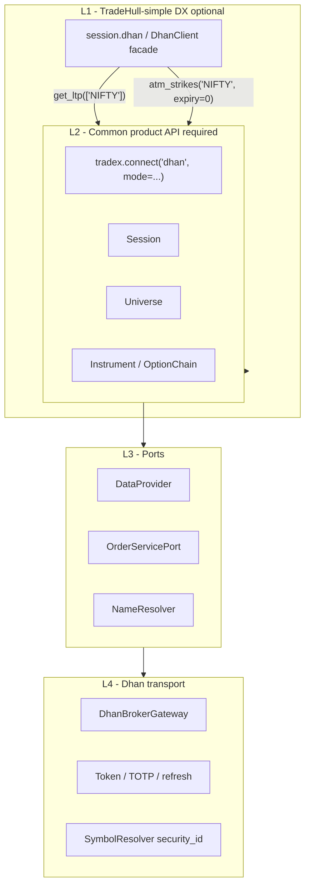
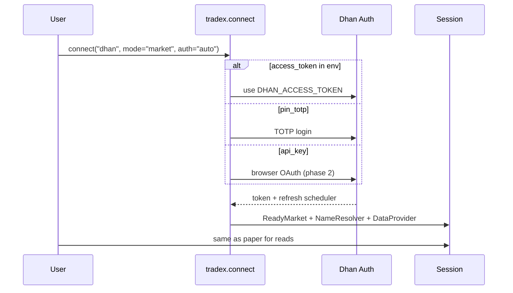

# TradeHull DX Reference → TradeX Broker Design

| Field | Value |
|-------|--------|
| **Title** | Design our broker UX using Dhan-Tradehull as reference (not a dependency) |
| **Date** | 2026-07-09 |
| **Status** | TH-1…TH-5 implemented (instrument OOP core) · 2026-07-09 |
| **Reference** | [Dhan-Tradehull 3.3.1 on PyPI](https://pypi.org/project/Dhan-Tradehull/) |
| **Parent** | [`BROKER_UX_STANDARDIZATION_DESIGN.md`](./BROKER_UX_STANDARDIZATION_DESIGN.md) |
| **Non-goal** | Vendoring or requiring `Dhan-Tradehull` as a runtime dependency |

---

## 1. Why reference TradeHull

TradeHull’s DX is what many Dhan algo users expect:

- **One object** after login: `tsl = Tradehull(...)`
- **Friendly names**: `'NIFTY'`, `'CRUDEOIL'`, `'NIFTY 21 NOV 24400 CALL'`
- **Batteries included**: LTP batch, history, ATM/ITM/OTM helpers, Greeks, orders, depth, PnL exit
- **Three auth modes** in one constructor: access_token / api_key / pin_totp

TradeX already has a stronger **institutional** core (Session, Instrument, OMS, ports).  
What we borrow is **simplicity and completeness of the Dhan-facing surface**, not the architecture.

```text
TradeHull:   Tradehull(client, token) → tsl.get_ltp_data(['NIFTY'])
TradeX:      tradex.connect("dhan", mode="market") → session.universe.index("NIFTY").refresh()
             + convenience facade: session.dhan  (TradeHull-parity helpers, optional)
```

**Decision:** Implement TradeHull-like **convenience methods** as a **Dhan capability layer** on top of our common Session/Instrument model — never replace domain ports with a third-party SDK.

---

## 2. Gap analysis (TradeHull vs TradeX today)

### 2.1 Auth

| TradeHull | TradeX Dhan today | Target |
|-----------|-------------------|--------|
| `mode="access_token"` | `DHAN_ACCESS_TOKEN` in `.env.local` | Same; explicit `auth_mode=` on connect |
| `mode="pin_totp"` | TOTP via factory when token missing | Same; first-class |
| `mode="api_key"` browser redirect | Not first-class | Optional later (capability) |
| One constructor | Factory + settings loader | `connect("dhan", auth=…)` hides factory |

### 2.2 Market data

| TradeHull API | TradeX product API | Status |
|---------------|-------------------|--------|
| `get_ltp_data(names)` | `inst.refresh()` / batch helper | Need batch convenience |
| `get_quote_data(names)` | `inst.refresh()` → QuoteSnapshot | Need batch + dict-by-name |
| `get_ohlc_data(names)` | via quote snapshot fields | Map OHLC fields |
| `get_historical_data(sym, exch, tf)` | `inst.history(timeframe=, days=)` | Normalize timeframe map |
| `get_long_term_historical_data(...)` | history with from/to | Already on facade |
| Sector indices (`sector="YES"`) | Not standardized | Optional Index/sector list |

### 2.3 Options UX (biggest DX gap)

| TradeHull | TradeX today | Target |
|-----------|--------------|--------|
| `ATM_Strike_Selection(Underlying, Expiry=0)` | `chain.atm` after `option_chain()` | **Expiry offset API** + friendly helper |
| `OTM/ITM_Strike_Selection(..., count)` | `chain.otm()` / `itm()` | Steps from ATM + expiry offset |
| `get_option_greek(strike, expiry, asset, …)` | leg greeks + `black_scholes` | Unified greeks helper |
| Friendly option name in orders | Canonical id only | **Display name ↔ InstrumentId** parser |

### 2.4 Orders

| TradeHull | TradeX | Target |
|-----------|--------|--------|
| `order_placement(tradingsymbol, exchange, …)` | `inst.buy` / session.buy → OMS | Keep OMS; add **name resolver** for TradeHull-style symbols |
| `modify_order` / `cancel_order` | OMS modify/cancel | Same |
| `cancel_all_orders` | exit_all / square-off services | Session-level convenience |
| Bracket / CO / slice | Dhan extended + capabilities | Capability, not core Instrument |
| Conditional triggers / PnL exit / kill switch | Partial OMS + risk | Capability + risk manager |

### 2.5 What we deliberately **do not** copy

| TradeHull pattern | Why not |
|-------------------|---------|
| God-object `tsl` doing everything | Breaks ports / testability |
| `"YES"/"NO"` string flags | Use `bool` |
| Stringly-typed everything | Use enums + InstrumentId |
| Orders without risk/OMS | Violates safe-to-trade gate |
| `debug="YES"` | Use log levels / `trace_id` |
| Telegram built into broker SDK | Separate notifications plugin |

---

## 3. Target UX layers



- **L2 is the standard** for multi-broker and tests.  
- **L1 is Dhan ergonomics** for users migrating from TradeHull (and only when `broker=dhan`).  
- Upstox gets `session.upstox` only for Upstox-specific extras — not a copy of TradeHull APIs.

---

## 4. Common connect flow (all brokers)

```python
# Target public API
session = tradex.connect(
    "dhan",
    mode="market",          # sim | market | trade
    auth="auto",            # auto | access_token | pin_totp | api_key
    env_path=".env.local",  # default for dhan
)

session.status.phase          # ReadyMarket | ReadyTrade | Failed
session.status.orders_enabled
session.status.trace_id

# Same for paper / upstox
session = tradex.connect("paper")                 # mode=sim
session = tradex.connect("upstox", mode="market") # .env.upstox
```

### Auth modes mapped from TradeHull

| TradeHull `mode` | TradeX connect | Env / args |
|------------------|----------------|------------|
| `access_token` | `auth="access_token"` | `DHAN_CLIENT_ID` + `DHAN_ACCESS_TOKEN` |
| `pin_totp` | `auth="pin_totp"` | `CLIENT_ID` + `PIN` + `TOTP_SECRET` |
| `api_key` | `auth="api_key"` (phase 2) | browser / redirect flow |
| (auto) | `auth="auto"` (default) | token if set else TOTP |

Internal: keep existing `AuthManager` + `TokenRefreshScheduler` (already proven with `.env.local`).

---

## 5. Instrument naming design (TradeHull-friendly + canonical)

### 5.1 Three name forms

| Form | Example | Used by |
|------|---------|---------|
| **Canonical** | `NFO:NIFTY:20261121:24400:CE` | Domain, OMS, storage, multi-broker |
| **Display / TradeHull-style** | `NIFTY 21 NOV 24400 CALL` | Humans, TradeHull migrants, CLI |
| **Wire** | Dhan `security_id` | HTTP only |

### 5.2 Display name grammar (standardize)

Inspired by TradeHull order symbols:

```text
Equity:   {SYMBOL}                         + exchange NSE|BSE
Index:    {INDEX}                          + exchange INDEX|NSE (normalize to NSE + kind=index)
Future:   {UNDERLYING} {MON} {YYYY?} FUT   + NFO|MCX|BFO
Option:   {UNDERLYING} {DD} {MON} {STRIKE} {CALL|PUT|CE|PE}
```

**Parser** (`domain.instruments.display_names`):

```python
parse_display_name("NIFTY 21 NOV 24400 CALL", default_exchange="NFO")
  → InstrumentId.option("NFO", "NIFTY", date(2026,11,21), 24400, "CE")

parse_display_name("RELIANCE", default_exchange="NSE")
  → InstrumentId.equity("NSE", "RELIANCE")

parse_display_name("CRUDEOIL", default_exchange="MCX")  # commodity underlying
  → resolve via master to nearest FUT or spot rules
```

**Formatter:**

```python
format_display_name(InstrumentId(...))
  → "NIFTY 21 NOV 24400 CALL"
```

### 5.3 Exchange aliases (TradeHull → canonical)

| TradeHull `exchange` | Canonical |
|----------------------|-----------|
| `INDEX` | Index on `NSE` (or BSE for SENSEX) + kind=index |
| `NSE` | `NSE` equity |
| `NFO` | `NFO` |
| `BFO` | Register/allow `BFO` → BSE derivatives (extend VALID_EXCHANGES) |
| `MCX` | `MCX` |

### 5.4 Expiry offset (TradeHull `Expiry=0,1,2…`)

TradeHull: `Expiry=0` current week/month, `1` next, …

```python
# Common helper on OptionChain / Universe
universe.option_expiry("NIFTY", offset=0)   # → date
chain = index.option_chain(expiry=offset(0))
# or
chain = index.option_chain(expiry="current")  # alias offset 0
```

Implementation: list unique expiries from chain/master, sort, pick `[offset]`.

### 5.5 Strike selection (TradeHull parity on common OptionChain)

```python
# Common API (all brokers that provide option_chain)
sel = chain.select_strikes(style="ATM")           # → {ce: Option, pe: Option, strike}
sel = chain.select_strikes(style="OTM", steps=5)
sel = chain.select_strikes(style="ITM", steps=1)
```

Maps to existing `chain.atm` / `otm` / `itm` plus **steps** parameter.

### 5.6 Batch LTP by friendly name (TradeHull `get_ltp_data`)

```python
# Common Session helper (broker-agnostic)
session.ltp_many(["RELIANCE", "NIFTY", "CRUDEOIL"])
  → {"RELIANCE": Decimal, "NIFTY": Decimal, ...}

# Resolves names via NameResolver → InstrumentId → DataProvider
```

Dhan implements efficient batch under the hood (`ltp_batch` on gateway).

---

## 6. Dhan-specific facade (optional L1 — TradeHull-shaped)

For users who know TradeHull, expose **thin aliases** that call L2:

```python
session = tradex.connect("dhan", mode="market")
dhan = session.broker_api  # or session.dhan — only when broker_id == dhan

# Auth already done by connect

# TradeHull-like
ltps = dhan.get_ltp_data(["CRUDEOIL", "NIFTY"])
quotes = dhan.get_quote_data("RELIANCE")
hist = dhan.get_historical_data("NIFTY", exchange="INDEX", timeframe="DAY")
ce, pe, strike = dhan.atm_strikes("NIFTY", expiry=0)
ce, pe, ce_k, pe_k = dhan.otm_strikes("NIFTY", expiry=0, steps=5)
greeks = dhan.option_greeks(strike=24400, expiry=0, asset="NIFTY", right="CE")

# Orders still go through OMS when mode=trade
order_id = dhan.place_order(
    "NIFTY 21 NOV 24400 CALL", "NFO",
    quantity=75, price=0.05, order_type="LIMIT", side="BUY", product="MIS",
)
```

### Mapping table (implement as wrappers)

| TradeHull method | TradeX implementation |
|------------------|------------------------|
| `Tradehull(code, token, mode=…)` | `connect("dhan", auth=…)` |
| `get_ltp_data(names)` | `session.ltp_many` / resolve + refresh |
| `get_quote_data` | resolve + `get_quote` → dict |
| `get_ohlc_data` | quote snapshot open/high/low/close |
| `get_historical_data(sym, exch, tf)` | parse name → Instrument → `history` + **tf map** |
| `get_long_term_historical_data` | history(start=, end=) |
| `ATM_Strike_Selection` | `option_chain` + `select_strikes("ATM")` + expiry offset |
| `OTM/ITM_Strike_Selection` | `select_strikes("OTM"\|"ITM", steps=)` |
| `get_option_greek` | Option greeks / BS helper |
| `order_placement(...)` | parse display name → Option/Equity → `buy/sell` OMS |
| `modify_order` / `cancel_order` | OMS |
| `cancel_all_orders` | square-off / exit-all capability |
| `full_market_depth_data` | depth capability / depth20 |
| `enable_pnl_based_exit` | risk manager + kill switch capability |
| Telegram | **out of broker core** (notifications plugin) |

### Timeframe map (TradeHull → ours)

| TradeHull | TradeX history |
|-----------|----------------|
| `"1"` | `"1m"` |
| `"5"` | `"5m"` |
| `"15"` | `"15m"` |
| `"25"` | `"25m"` or nearest supported |
| `"60"` | `"60m"` / `"1h"` |
| `"DAY"` | `"1D"` |

Unsupported TF → clear error listing supported set for that broker.

### Product / order type map

| TradeHull | Domain |
|-----------|--------|
| `MIS` | `ProductType.INTRADAY` |
| `CNC` | `ProductType.CNC` / DELIVERY |
| `MARGIN` / `MTF` / `CO` / `BO` | product + capability (BO → bracket extension) |
| `MARKET` / `LIMIT` / `STOPLIMIT` / `STOPMARKET` | OrderType enums |

---

## 7. Common interface additions (broker-agnostic)

These belong on **Session / Universe / OptionChain**, not only Dhan:

```python
# Session
session.ltp_many(names: list[str], *, default_exchange: str | None = None) -> dict[str, Decimal]
session.quote_many(names: list[str]) -> dict[str, QuoteSnapshot]
session.resolve_name(name: str, exchange: str | None = None) -> InstrumentId
session.instrument(name: str, exchange: str | None = None) -> Instrument  # factory by kind

# Universe (already)
universe.equity / index / future / option / get

# OptionChain
chain.select_strikes(style: Literal["ATM","ITM","OTM"], steps: int = 0)
chain.expiry_at(offset: int = 0) -> date | str
```

**NameResolver port** (common):

```python
class NameResolver(Protocol):
    def parse(self, name: str, *, exchange: str | None = None) -> InstrumentId: ...
    def display(self, id: InstrumentId) -> str: ...
    def to_wire(self, id: InstrumentId) -> WireRef: ...  # broker-private
    def from_wire(self, wire: WireRef) -> InstrumentId: ...
```

Dhan implements `to_wire` → security_id; Upstox → instrument_key.

---

## 8. Standardized flows (with TradeHull mental model)

### Flow 1 — Login (3 modes)



### Flow 2 — TradeHull-style option strategy (our way)

```python
s = tradex.connect("dhan", mode="trade")  # OMS registered
# Friendly:
ce_name, pe_name, k = s.dhan.atm_strikes("NIFTY", expiry=0)
# Or object model:
idx = s.universe.index("NIFTY")
chain = idx.option_chain(expiry=chain.expiry_at(0))
ce, pe = chain.select_strikes("ATM").ce, chain.select_strikes("ATM").pe
ce.buy(50, order_type="MARKET")  # OMS
```

### Flow 3 — Naming path

```text
"NIFTY 21 NOV 24400 CALL"
    → NameResolver.parse
    → InstrumentId NFO:NIFTY:20261121:24400:CE
    → DhanResolver.to_wire → security_id
    → place_order HTTP
```

---

## 9. E2E test scenarios (TradeHull parity pack)

Parametrize paper / dhan-market / dhan-trade:

| Id | TradeHull analogue | Assert |
|----|--------------------|--------|
| `TH-AUTH-TOKEN` | access_token login | status.authenticated |
| `TH-AUTH-TOTP` | pin_totp | token scheduler running |
| `TH-LTP-BATCH` | get_ltp_data | dict keys match names |
| `TH-HIST-DAY` | get_historical_data DAY | bar_count ≥ 1 (market hours) |
| `TH-ATM-0` | ATM_Strike_Selection(...,0) | CE/PE strikes equal |
| `TH-OTM-5` | OTM count 5 | steps from ATM |
| `TH-PARSE-OPT` | order symbol string | parse → canonical id |
| `TH-ORDER-LIMIT` | order_placement LIMIT | OMS + correlation |
| `TH-CANCEL` | cancel_order | status cancelled |
| `TH-DEPTH` | full_market_depth | bids/asks non-empty |

Paper implements the same scenarios with fakes (always CI).

---

## 10. What we keep from TradeX (non-negotiable)

1. **OMS for all live orders** — TradeHull-style `order_placement` is a **wrapper**, not a bypass.  
2. **Canonical InstrumentId** in domain/events/storage.  
3. **mode=market vs trade** — TradeHull always implies full session; we still progressive-disclose.  
4. **No Telegram / chat inside broker package.**  
5. **No dependency on `Dhan-Tradehull` package** — reimplement DX on our gateway (we already talk Dhan API).

Optional later: **interop adapter** that accepts a Tradehull instance only for migration scripts — not core path.

---

## 11. Implementation phases

| Phase | Deliverable | User-visible win |
|-------|-------------|------------------|
| **TH-0** | This design accepted | Shared map TradeHull ↔ TradeX |
| **TH-1** | ✅ `mode=` + `connect` market path for dhan | `connect("dhan")` / `mode=market` → ReadyMarket; `mode=trade` → OMS_REQUIRED without process OMS |
| **TH-2** | ✅ Display name parse/format | `domain.instruments.display_names` parse/format TradeHull-style names |
| **TH-3** | ✅ `session.ltp_many` / `quote_many` + timeframe map | Instrument-backed batch; `normalize_timeframe` on history |
| **TH-4** | ✅ `chain.select_strikes` + `expiry_at(offset)` | Returns stamped `Option` CE/PE (`StrikeSelection`) |
| **TH-5** | ✅ Thin `session.dx` aliases (not god-object) | `get_ltp_data` / `atm_strikes` → Session/OptionChain |
| **TH-6** | E2E TH-* scenarios paper + live_market | Regression pack |
| **TH-7** | Bracket/CO/slice/PnL-exit as capabilities | Advanced TradeHull features |

---

## 12. Target “day 1” experience (after TH-1…4)

```python
import tradex
from decimal import Decimal

# Same shape as paper
s = tradex.connect("dhan", mode="market")   # uses .env.local, manages tokens

# Equity
rel = s.universe.equity("RELIANCE")
print(rel.refresh().ltp)

# TradeHull-like batch
print(s.ltp_many(["RELIANCE", "NIFTY"]))

# Options like ATM_Strike_Selection
nifty = s.universe.index("NIFTY")
chain = nifty.option_chain()
atm = chain.select_strikes("ATM")
print(atm.ce.symbol, atm.pe.symbol, atm.strike)

# History like get_historical_data
bars = nifty.history(timeframe="1D", days=30)

# When ready to trade (OMS ready)
s2 = tradex.connect("dhan", mode="trade")
opt = s2.resolve_name("NIFTY 21 NOV 24400 CALL")  # → Option instrument
s2.universe.get(opt).buy(75, price=Decimal("0.05"))  # OMS
```

---

## 13. Key decisions

| # | Decision | Rationale |
|---|----------|-----------|
| T1 | Reference TradeHull DX, **do not depend** on the package | Control, OMS, multi-broker |
| T2 | L1 Dhan facade **optional**; L2 Session required | Multi-broker tests stay clean |
| T3 | Dual naming: **display (TradeHull-like) + canonical** | Familiar + institutional |
| T4 | Expiry offset `0,1,2…` on chains | Direct TradeHull parity |
| T5 | Strike selection on **common** OptionChain | Upstox benefits too |
| T6 | All TradeHull orders route **OMS** | Safe-to-trade gate |
| T7 | Auth modes mirror TradeHull | Users already know pin_totp / token |

---

## 14. Open questions

1. Support **BFO/SENSEX** display names in v1 or phase 2?  
2. Should `session.dhan` exist only for dhan, or generic `session.native` for TradeHull-like helpers per broker?  
3. Commodity short names (`CRUDEOIL` without FUT) — always resolve to front-month FUT?

---

## 15. References

- PyPI: [Dhan-Tradehull 3.3.1](https://pypi.org/project/Dhan-Tradehull/)  
- Our object model: `docs/OBJECT_MODEL.md`  
- Broker UX parent: `reports/BROKER_UX_STANDARDIZATION_DESIGN.md`  
- Dhan factory auth: `brokers/dhan/factory.py`  
- Canonical ids: `src/domain/instruments/instrument_id.py`  
- Upstox wire map: `brokers/upstox/instrument_adapter.py`  
