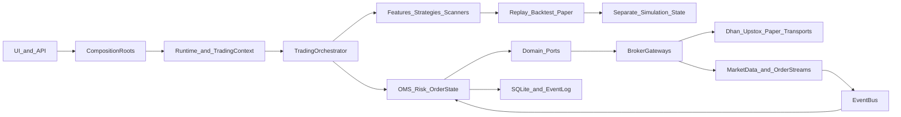
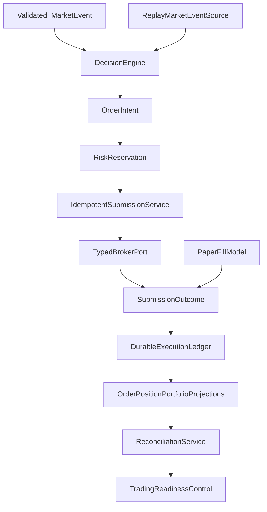

# Architecture Review

## 1. System intent

TradeXV2 is intended to support the workflow:

`Research → Scanner → Signal → Risk → Order → Execution → Position → Portfolio → Analytics → Review`

The repository is organized as a Python single-root package with `domain`, `application`, `infrastructure`, `brokers`, `analytics`, `datalake`, `interface`, `runtime`, and `tradex` packages (`pyproject.toml:59-80`). This is a reasonable Clean Architecture starting point.

## 2. Current architecture map

### Stable boundaries already present

- Domain ports and capabilities exist under `src/domain/ports` and `src/domain/capabilities`.
- Application OMS/execution is separated from analytics by import-linter contracts.
- The broker common package now contains transport policy, ACL, contracts, and use-case candidates.
- The test tree distinguishes unit, component, integration, e2e, architecture, chaos, live-readonly, and performance categories.

### Boundaries that are not operationally enforced

- `UpstoxBroker` and its gateway both compose large adapter graphs and reach private collaborators (`src/brokers/upstox/broker.py:79-154`, `src/brokers/upstox/gateway.py:78-106,230-243`).
- Dhan still has multiple reconnect and connection owners (`src/brokers/dhan/streaming/connection.py`, `src/brokers/dhan/data/depth_feed_base.py:404-422`, `src/brokers/dhan/api/reconnecting_service.py:136-184`).
- Raw dicts and broker status strings can cross the anti-corruption boundary (`src/brokers/upstox/gateway.py:239-243`, `src/brokers/upstox/adapters/tick_translator.py:47-63`).
- Analytics replay can import UI composition through a local import; the linter currently treats this as a known residual (`pyproject.toml:392-402`).
- The common kernel target is not yet the single runtime mechanism: current adoption is selective.

## 3. End-to-end execution simulation

### Expected contract

**Inputs:** timestamped, validated market events; instrument identity; strategy configuration; account/risk state; broker capability and session state.  
**Outputs:** an immutable signal decision, an idempotent order intent, broker acknowledgement, fill events, position/PnL transitions, durable audit, and reconciliation status.  
**Timing:** event-time ordering is explicit; stale data, missing features, and ambiguous broker writes block or quarantine the affected decision.  
**State:** `candidate → signal → intent → submitted/unknown → acknowledged → partially_filled/filled/cancelled/rejected → position_transition → reconciled`.  
**Failures:** typed and observable; no transport/API failure is represented as a valid empty account, zero balance, neutral feature set, or successful cancellation.

### Actual live path

1. API/UI/runtime composes broker, feature, OMS, event bus, and persistence services.
2. Scanner or feed emits a candidate.
3. `TradingOrchestrator.on_candidate` extracts symbol/score, fetches features, evaluates strategies, filters confidence/kill-switch/dry-run, then calls OMS (`src/application/trading/trading_orchestrator.py:187-245,324-377`).
4. Quantity is calculated from an explicit quantity or capital percentage; capital lookup is best-effort and can become zero (`src/application/trading/trading_orchestrator.py:407-455`).
5. OMS validates and submits. Risk checks occur before the order is inserted into the position book and outside the relevant lock (`src/application/oms/order_validator.py:79-127`).
6. Broker response and later WebSocket events update order/position state.
7. Event handlers publish downstream state, but EventBus is non-fail-fast by default (`src/infrastructure/event_bus/event_bus.py:423-517`).
8. Reconciliation later compares an incomplete projection.

### Silent divergence points

- Candidate identity is optional; idempotency may collapse independent symbols.
- Feature fetch is cached without visible TTL/bar invalidation (`src/application/trading/feature_fetcher.py:48-70`).
- A failed or stale read can be represented as empty/zero.
- Order submission can be `unknown` after a timeout, yet generic retry may submit again.
- Fill dedupe is bounded/TTL-based; delayed duplicates can reapply.
- Position/PnL state is maintained by OMS and separate simulation shadows.
- A broker can be marked connected before all required streams are actually established (`src/brokers/upstox/broker.py:425-437`).

## 4. Architectural assessment

### Bounded contexts

The strongest candidates are:

1. **Market data and instrument identity**
2. **Research/analytics**
3. **Signal and strategy evaluation**
4. **OMS/execution/risk**
5. **Broker transport and anti-corruption**
6. **Portfolio/reconciliation**
7. **Control plane and observability**
8. **Presentation**

The current package layout approximates these, but portfolio/reconciliation and execution state are duplicated across application, domain, broker, paper, replay, and account-view code.

### State machine design

Order status, fills, positions, and reconciliation are not one explicit aggregate/state machine. The system depends on event ordering, dedupe caches, and handler wiring. `OrderPositionUpdater` does not reject overfills (`src/application/oms/_internal/order_position_updater.py:44-68`), and `PositionManager.on_trade` depends on correct duplicate bookkeeping (`src/application/oms/position_manager.py:261-285`).

### Event-driven design

The event bus is useful as an in-process dispatch mechanism, but it is not a durable event log or recovery protocol. Ordering, delivery, idempotency, replay versioning, and backpressure are implicit. Synchronous dispatch makes downstream handlers part of feed latency. A durable event store plus projection checkpoints may be justified for order/fill/account events; CQRS should be applied narrowly to those economically material aggregates, not to every analytics read.

### CQRS/event sourcing recommendation

Do not introduce platform-wide event sourcing now. First define immutable order intent, broker submission outcome, fill, position transition, and reconciliation events. Persist those events transactionally with projection checkpoints. Use event replay for recovery and audit, while keeping market-data analytics in append-only time-series storage. This is smaller and safer than making all domain state event-sourced.

## 5. Target architecture

Ownership rules:

- The decision engine emits intent; it never mutates broker or position state.
- Risk reservations include pending orders and are atomic with intent acceptance.
- The broker ACL returns typed entities and an explicit `accepted/rejected/unknown` outcome.
- Unknown writes enter reconciliation; they are never blindly retried.
- One ledger/projector owns economic state for live, paper, replay, and backtest. Only the event source and fill model vary.
- Readiness is false if market-data freshness, broker stream continuity, reconciliation, or audit durability is not proven.
