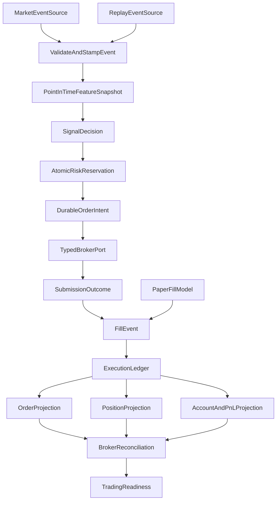
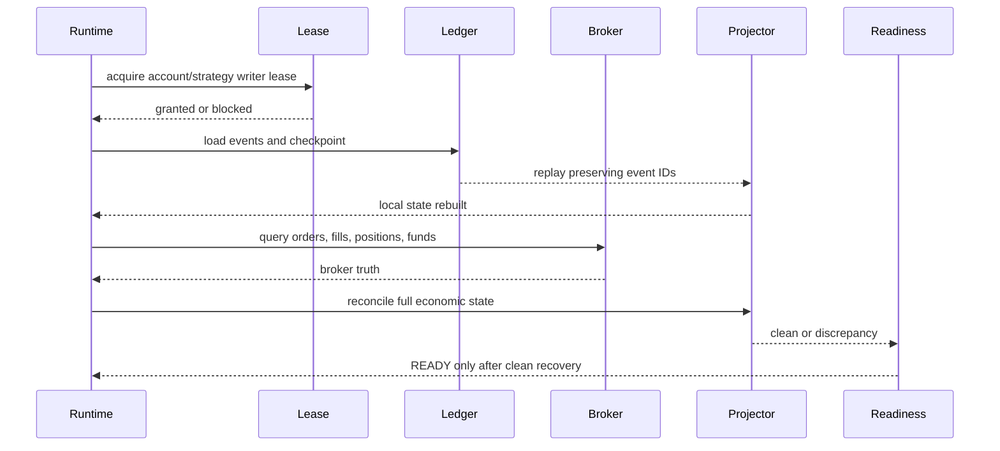

# State and Flow Specification

## Canonical flow



API/UI clients publish subscription intent and consume projections. They do not call broker gateways directly for market-data lifecycle or order state.

## Order state machine

```text
CREATED
  └─ risk accepted → INTENT_PERSISTED
       └─ broker call → SUBMITTED
            ├─ broker accepted → ACKNOWLEDGED
            ├─ broker rejected → REJECTED
            └─ transport ambiguous → UNKNOWN

ACKNOWLEDGED
  ├─ partial fill → PARTIALLY_FILLED
  ├─ complete fill → FILLED
  ├─ broker cancel confirmed → CANCELLED
  └─ broker failure/timeout → RECONCILIATION_REQUIRED

UNKNOWN
  └─ broker query/reconciliation
       ├─ found accepted → ACKNOWLEDGED
       ├─ found rejected → REJECTED
       ├─ found absent after bounded evidence → RETRY_ALLOWED
       └─ unresolved → ESCALATED
```

No transition is inferred from a local timeout. `RETRY_ALLOWED` is a reconciliation result, not a transport exception.

## Fill state rules

- Each fill has a stable broker execution ID or a deterministic fallback identity derived from order, sequence, quantity, and execution time.
- Incremental quantity is calculated from broker cumulative quantity exactly once.
- A repeated fill ID is a no-op with an observable duplicate counter.
- A cumulative decrease, overfill, negative quantity, invalid price, or inconsistent multiplier is quarantined.
- Position projection applies only committed fills.
- Replaying a historical event reconstructs projections from the event ledger; it does not re-run fill idempotency as if the event were new.

## Restart and recovery flow



The existing processed-trade idempotency repository must not be the sole replay mechanism: a replayed event must remain identifiable while projection checkpoints determine whether it has already been applied.

## Readiness state machine

```text
STARTING
  → CONFIG_INVALID
  → AUTH_FAILED
  → BROKER_UNAVAILABLE
  → MARKET_DATA_STALE
  → ORDER_STREAM_STALE
  → ACCOUNT_UNKNOWN
  → LEDGER_UNDURABLE
  → RECONCILIATION_REQUIRED
  → READY

READY → DEGRADED → one of the blocking states
```

Only `READY` enables new entries. Emergency-exit permission is an independent, audited policy and must not be accidentally disabled by a general entry kill switch.
