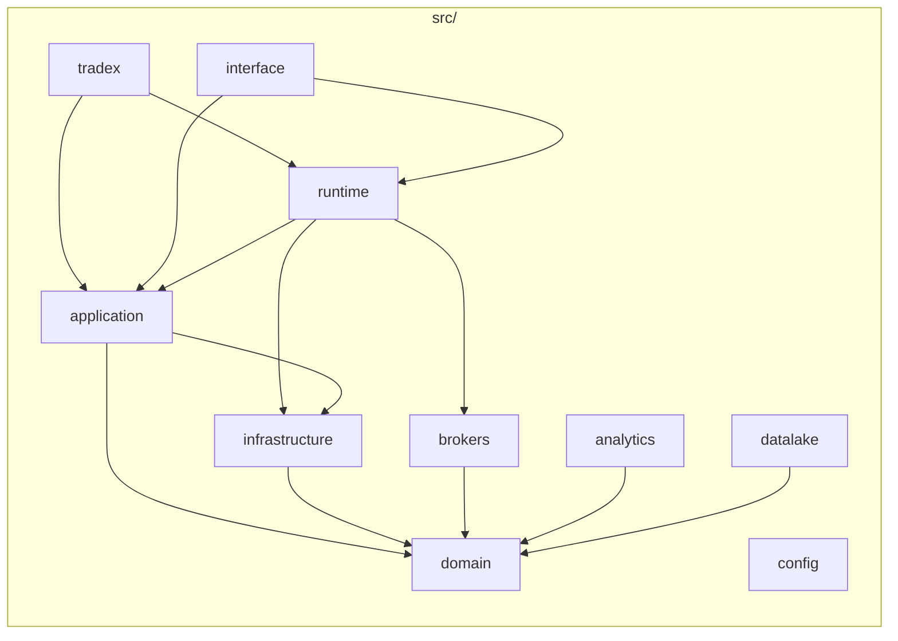

# Phase 1 — Repository and Runtime Inventory

**Evidence state:** `verified_by_static_analysis` + `verified_by_execution` (file counts, import-linter, path checks)

## Working tree baseline

| Attribute | Value | Evidence |
|-----------|-------|----------|
| Commit | `8f825b5d4be67915635123486ae76a1118573c12` | `git rev-parse HEAD` |
| Branch | `refactor/structural-cleanup` | `git branch --show-current` |
| Modified paths | ~325 | `git status --short \| wc -l` |
| Total files (excl. `.git`, caches) | ~54,594 | `find` census |
| Python source (`src/`) | 1,026 `.py` files | per-package `find` |

## File census by category

| Category | Approx. files | Notes |
|----------|---------------|-------|
| `src/domain` | 199 `.py` | Pure model + ports |
| `src/application` | 76 `.py` | OMS, execution, streaming, composer |
| `src/infrastructure` | 119 `.py` | Event bus, gateway factory, persistence |
| `src/brokers` | 298 `.py` | Dhan, Upstox, paper, common, cli, mcp |
| `src/analytics` | 97 `.py` | backtest, replay, paper, scanner, strategy |
| `src/datalake` | 57 `.py` | Historical data plane |
| `src/interface` | 156 `.py` | API, UI, agent |
| `src/runtime` | 18 `.py` | Composition root, CQRS dispatchers |
| `src/tradex` | 5 `.py` | Public SDK surface |
| `tests/` | 832 `.py` | Pyramid under `tests/{unit,component,integration,e2e,architecture,chaos}` |
| `scripts/` | 46 `.py` | verify, audit, debug, migration |
| `docs/` | 19+ review/architecture files | ADRs, RUNTIME_KERNEL |
| `.github/workflows/` | 8 YAML workflows | CI, production gate, certification |
| `web/` | 0 | No frontend package (CI comment confirms) |
| Generated/runtime | `market_data/`, `graphify-out/`, sqlite artifacts | Not distributed per `pyproject.toml` |

## Package / module map



### Ownership summary

| Package | Bounded context | Key subpackages |
|---------|-----------------|-----------------|
| `domain` | Contracts & aggregates | `entities`, `executions`, `events`, `ports`, `instruments`, `orders`, `reconciliation_engine` |
| `application` | OMS / execution / streaming | `oms`, `execution`, `trading`, `streaming`, `composer` |
| `infrastructure` | I/O adapters | `gateway`, `event_bus`, `persistence`, `observability` |
| `brokers` | Anti-corruption / wire | `dhan`, `upstox`, `paper`, `common`, `wire.py` adapters |
| `analytics` | Signal / research (D2 isolated) | `backtest`, `replay`, `paper`, `scanner`, `strategy` |
| `datalake` | Historical data | `storage`, `ingestion`, `gateway` |
| `interface` | Presentation | `api`, `ui`, `agent` |
| `runtime` | Composition kernel | `commands`, `queries`, `trading_runtime_factory` |
| `tradex` | Public SDK | `session`, `cli` |

## Entry points and composition roots

### Declared entry points (`pyproject.toml`)

| Surface | Entry | Module |
|---------|-------|--------|
| SDK CLI | `tradex` | `tradex.cli:tradex` |
| Broker CLI | `broker` | `brokers.cli.broker:broker` |
| Broker MCP | `broker-mcp` | `brokers.mcp.server:run_server` |
| Broker plugins | `tradex.brokers` entry group | `dhan`, `upstox`, `paper` packages |

### Composition roots (multiple — fragmentation risk)

| # | Root | File | Wires |
|---|------|------|-------|
| 1 | SDK session | `src/tradex/session.py` | `bootstrap_gateway`, CQRS dispatchers, OMS via `process_context` |
| 2 | CLI compose | `src/interface/ui/services/compose.py` | `BrokerService` → `TradingRuntimeFactory` |
| 3 | API bootstrap | `src/interface/api/bootstrap.py` | datalake + `build_for_api()` |
| 4 | Gateway factory | `src/infrastructure/gateway/factory.py` | `_create_dhan/upstox/paper/datalake` |
| 5 | Runtime factory | `src/runtime/trading_runtime_factory.py` | OMS, orchestrator, parity gate |
| 6 | Broker service | `src/interface/ui/services/broker_service.py` | gateways, event bus, OMS bootstrap |
| 7 | OMS singleton | `src/application/oms/process_context.py` | Process-wide `TradingContext` registry |
| 8 | API lifecycle fallback | `src/interface/api/lifecycle.py` | `build_trading_context()` if no factory ctx |

**Invariant documented but not enforced:**

```44:49:src/application/oms/process_context.py
        if _registered is not None and _registered is not ctx:
            logger.warning(
                "OMS context already registered; ignoring second registration. "
                "Multiple composition roots in one process corrupt order state."
            )
```

### Research / batch entry points

| Mode | Entry | File |
|------|-------|------|
| Backtest | API router / analytics facade | `src/interface/api/routers/backtest.py`, `src/analytics/backtest/engine.py` |
| Replay | `ReplayEngine` | `src/analytics/replay/engine.py` |
| Paper | `PaperTradingEngine` | `src/analytics/paper/engine.py` |
| Scripts | `scripts/verify/*`, `scripts/audit/*` | Certification, connectivity probes |
| CI | `.github/workflows/*.yml` | Gates (many paths stale — see Phase 4) |

## Declared vs implemented architecture

| Declaration | Source | Implementation status |
|-------------|--------|---------------------|
| Clean Architecture layers | `pyproject.toml` `[tool.setuptools.packages.find]` | **Mostly aligned** — single `src/` root |
| Domain independence | import-linter contract | **BROKEN** — `domain.market.segment_mapper` imports brokers |
| Application ↔ infrastructure separation | import-linter contract | **BROKEN** — 7 modules import `infrastructure.observability.tracing` |
| Two composition roots (SDK + runtime) | `RUNTIME_KERNEL.md` | **Confirmed** — documented, not unified |
| CQRS dispatchers | `runtime/commands/`, `runtime/queries/` | **Present** — wired in `tradex.session` |
| Broker kernel (`wire.py` not `gateway.py`) | `brokers/README.md`, git deletes | **Migration in progress** — Dhan/Upstox gateway deleted |
| Plugin discovery | `runtime/broker_discovery.py` | **Present** — `importlib.metadata.entry_points("tradex.brokers")` |

## Dependency direction (import-linter, executed)

**Command:** `PYTHONPATH=src lint-imports --config pyproject.toml`  
**Result:** 12 kept / **3 broken** (929 files, 2507 dependencies)

Broken contracts:
1. **Domain independence** — `domain.market.segment_mapper` → `brokers.dhan`, `brokers.upstox`
2. **Broker common isolation** (transitive via segment_mapper)
3. **Application infrastructure separation** — tracing imports in OMS + execution

## Traceability matrix (package → tests → docs)

| Package | Primary tests | Architecture tests | Docs |
|---------|---------------|-------------------|------|
| `domain` | `tests/unit/domain/` (386 files tree) | `test_gateway_abc_compliance` | ADR-012, ADR-013 |
| `application/oms` | `tests/component/oms/` | `test_module_boundaries_and_decomposition` | RUNTIME_KERNEL |
| `brokers/dhan` | `tests/integration/brokers/dhan/` | `test_gateway_surface_freeze` | `brokers/README.md` |
| `brokers/upstox` | `tests/integration/brokers/upstox/` | contract tests | OBJECT_MODEL_PLAN |
| `runtime` | `tests/unit/runtime/`, `tests/component/runtime/` | dispatcher isolation | RUNTIME_KERNEL |
| `analytics` | `tests/unit/analytics/` | D2 isolation contracts | CQRS_ADOPTION_STATUS |

## Deleted / migrated modules (working tree)

| Deleted | Replacement | Evidence |
|---------|-------------|----------|
| `src/brokers/dhan/gateway.py` | `src/brokers/dhan/wire.py` (`DhanWireAdapter`) | git status `D` |
| `src/brokers/upstox/gateway.py` | `src/brokers/upstox/wire.py` | git status `D` |
| `src/brokers/dhan/auth/wire_lifecycle.py` | `infrastructure/auth/` + factory | git status `D` |
| `src/interface/ui/commands/instrument_info.py` | merged elsewhere | git status `D` |