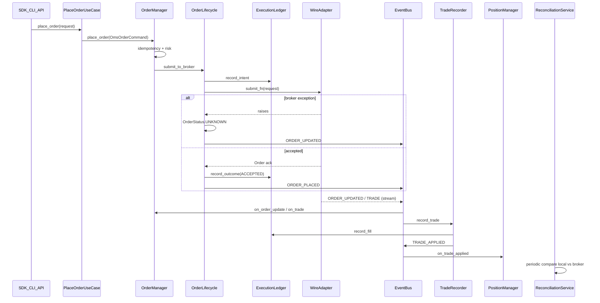

# Phase 2 — End-to-End Flow Reconstruction

**Evidence state:** `verified_by_static_analysis` (code trace); live execution `blocked_by_environment`

## Flow overview



---

## 1. Market data — Dhan

| Stage | Owner | Key symbols | Evidence |
|-------|-------|-------------|----------|
| Entry | `bootstrap_gateway` | `infrastructure/gateway/factory.py` | Auth probes L226-261 |
| Auth / token | `DhanBrokerFactory` | `TokenRefreshScheduler`, `broadcast_token` | `brokers/dhan/identity/factory.py` |
| WS connect | `DhanMarketFeed` | `start()`, `connect()` | `brokers/dhan/websocket/market_feed.py` |
| Instrument map | `_resolve_security_symbol` | security_id → symbol | `brokers/dhan/websocket/_helpers.py` |
| Normalize | `_transform_quote`, `_transform_depth` | canonical dict → domain types | `_helpers.py:137-166` |
| Publish | `MarketFeedPublisher` | `EventBus.publish("TICK"\|"DEPTH")` | `brokers/dhan/websocket/publish.py:68-76` |
| Consumer | `TradingOrchestrator`, API WS | bus subscribers | `application/trading/trading_orchestrator.py` |

### State transitions

- Connection: `STOPPED` → connected thread (`market_feed.py` health check)
- Freshness: `HEALTHY` vs `DEGRADED` (stale → reconnect watchdog)
- Reconnect: `ReconnectingServiceMixin` + gap backfill via REST

### Failure semantics

| Failure | Behavior | Silent? |
|---------|----------|---------|
| Zero/missing LTP | Tick dropped, `dropped_ticks++` | **Yes** — consumers see nothing |
| Symbol resolution fail | Falls back to `security_id` as symbol | **Partial** — downstream symbol mismatch |
| `event_bus is None` | Publish no-op | **Yes** |
| Rate-limit admission | `DEGRADED`, connect blocked | Loud |

**Risk until enforced:** tick drops are counted but not surfaced to risk/OMS as subscription failure.

---

## 2. Market data — Upstox

| Stage | Status | Evidence |
|-------|--------|----------|
| Auth | ✅ `UpstoxFeedAuthorizer` + TOTP scheduler | `brokers/upstox/factory.py` |
| Instrument map | ✅ `instrument_resolver` → `instrument_key` | `stream_manager.py:88-89` |
| Decode/normalize | ✅ `UpstoxV3Decoder`, `TickTranslatorAdapter` | `market_data_v3.py` |
| **EventBus publish** | ❌ **Not implemented** | `event_bus` stored L89-97, never used |
| Listener dispatch | ✅ callbacks only | `market_data_v3.py:356-360` |
| Order/portfolio stream | ✅ `ORDER_UPDATED` / `TRADE` | `portfolio_stream.py:165-212` |

### Critical asymmetry (A-tier)

Dhan market feed publishes canonical `TICK`/`DEPTH` events. Upstox `UpstoxMarketDataV3Multiplexer` accepts `event_bus` in constructor but **never publishes** — bus-wired consumers (orchestrator, scanners, API bridge) will not receive Upstox live ticks unless a listener bridge is registered separately.

**Risk:** Operators may believe "connected" Upstox feed feeds the same runtime as Dhan.

---

## 3. Order cycle (canonical spine)

### Entry points (all converge on `OrderManager`)

| Path | File | Lines |
|------|------|-------|
| Use case | `application/execution/place_order_use_case.py` | delegates to OMS |
| Service | `application/execution/execution_service.py` | live `gateway_submit` |
| SDK CQRS | `tradex/session.py` | `CommandDispatcher` → handler |
| Orchestrator | `runtime/trading_runtime_factory.py` | injects `PlaceOrderUseCase` |

### Phase trace

1. **Intent** — `OmsOrderCommand` requires `correlation_id` (`order_manager.py:86-95`)
2. **Idempotency** — `IdempotencyGuard`: duplicate blocked; UNKNOWN blocks retry (`idempotency_guard.py:51-57`)
3. **Risk** — `RiskManager.check_order`; placement gate until first clean reconciliation (`context.py:303-305, 416-419`)
4. **Ledger record-then-submit** — `execution_ledger.record_intent` before broker I/O (`order_lifecycle.py:112-127`)
5. **Broker submit** — `submit_fn` via `gateway_submit.make_gateway_submit_fn`
6. **UNKNOWN** — broker exception OR ledger failure after accept → `OrderStatus.UNKNOWN` (`order_lifecycle.py:135-182`)
7. **Stream fills** — `DhanOrderStream` / `UpstoxPortfolioStream` → `ORDER_UPDATED`, `TRADE`
8. **OMS handlers** — `TradingContext` wires bus → `OrderManager`, `PositionManager` (`context.py:261-274`)
9. **Trade recording** — `TradeRecorder` idempotent via `ProcessedTradeRepository`
10. **Reconciliation** — `ReconciliationService` loop → `ReconciliationEngine.compare_*`

### UNKNOWN / recovery contract (observed)

```135:157:src/application/oms/_internal/order_lifecycle.py
        except Exception as exc:
            unknown = order.with_status(OrderStatus.UNKNOWN)
            ...
            return None, OrderResult(
                success=False,
                order=unknown,
                error=str(exc),
                state=SubmissionState.UNKNOWN,
            )
```

- Retry with same `correlation_id` while UNKNOWN: **blocked** (good)
- Recovery: reconciliation + optional `auto_repair` on Dhan adapter
- Default `auto_repair=False` in many paths: **detect-only** (drift logged, not healed)

### Silent failure risks

| Risk | Evidence |
|------|----------|
| `event_bus=None` on publish | `order_manager.py:389-390` — no-op |
| Trade before order | Buffered 32 deep in `trade_recorder.py:104-116` |
| Handler exception swallowed | DLQ in `event_bus.py` — not re-raised by default |
| Reconciliation errors | Loop continues `DEGRADED` (`reconciliation_service.py:156-158`) |

---

## 4. Mode parity (live / paper / replay / backtest)

| Mode | Order path | Shares OMS spine? | Evidence |
|------|------------|-------------------|----------|
| **Live** | `PlaceOrderUseCase` → `OrderManager` → wire adapter | ✅ Full OMS | `execution_service.py` |
| **Paper** | `PaperTradingEngine` → `OmsBacktestAdapter` | ✅ Same `OrderManager` + risk | `paper/engine.py:107-118` |
| **Replay** | `ReplayEngine` → `create_oms_backtest_adapter(mode="replay")` | ✅ Documented parity | `replay/engine.py:7-9, 142-150` |
| **Backtest** | Wraps `ReplayEngine`; default `ResearchMode.PURE_SIM` | ⚠️ **Split** | `backtest/engine.py:47-119` |

### Parity gate (runtime boot)

```16:57:src/runtime/parity_gate.py
def assert_runtime_parity_or_raise() -> None:
    if os.getenv("SKIP_PARITY_GATE", "0") == "1":
        return
    ...
    replay_script = _PROJECT_ROOT / "scripts" / "verify_event_replay.py"  # WRONG PATH
    result = subprocess.run([sys.executable, "-m", "scripts.verify_event_replay"], ...)
```

**Issues:**
- Skippable via `SKIP_PARITY_GATE=1`
- Replay script path points to non-existent `scripts/verify_event_replay.py` (actual: `scripts/verify/verify_event_replay.py`)
- `-m scripts.verify_event_replay` module import fails locally

### Session modes (`tradex.connect`)

| Mode | Orders | Evidence |
|------|--------|----------|
| `market` | Disabled | `session.py:211-214` |
| `trade` | Requires process OMS | `session.py:380-391` |
| `sim` | In-memory OMS | `session.py:211` |

### Parity verdict

**Partial parity.** Paper/replay share OMS adapter with live decision logic, but:
- Backtest default `PURE_SIM` explicitly not live-equivalent
- Paper uses synthetic fills / separate slippage model
- `ORCHESTRATOR_DRY_RUN` default `1` at runtime factory prevents live order placement from orchestrator

---

## 5. Lifecycle

### Startup sequence

```
bootstrap_gateway / BrokerService
  → TradingContext (requires injected EventBus)
  → wire ORDER_UPDATED, TRADE, TRADE_APPLIED handlers
  → ReconciliationService.start + run_now (unless TRADEX_SKIP_STARTUP_RECONCILIATION)
  → lifecycle.start_all() — WS feeds, token schedulers
  → assert_runtime_parity_or_raise() (production)
```

### Token refresh

| Broker | Mechanism |
|--------|-----------|
| Dhan | `TokenRefreshScheduler` → HTTP + WS `update_token` + `.env` broadcast |
| Upstox | `TotpRefreshScheduler` on lifecycle |
| Order stream auth error | Proactive refresh before backoff (`order_stream.py:250-258`) |

### WebSocket reconnect

| Service | Pattern |
|---------|---------|
| Dhan market/order | `ReconnectingServiceMixin` + gap backfill |
| Upstox V3 | `UpstoxAutoReconnect` in read loop |
| `StreamOrchestrator` | `ReconnectController.heartbeat_loop` |

### Shutdown

```
LifecycleManager.stop_all() — reverse order
TradingContext.shutdown:
  1. kill_switch ON
  2. cancel_all_open_orders (optional)
  3. flush EventLog
  4. SYSTEM_SHUTDOWN event
```

### Lifecycle risks

| Risk | Evidence |
|------|----------|
| Reconciliation thread join timeout | `reconciliation_service.py:99-104` |
| Token scheduler without lifecycle | `atexit` fallback only |
| Session kernel wire failure swallowed | `session.py:314-319` |