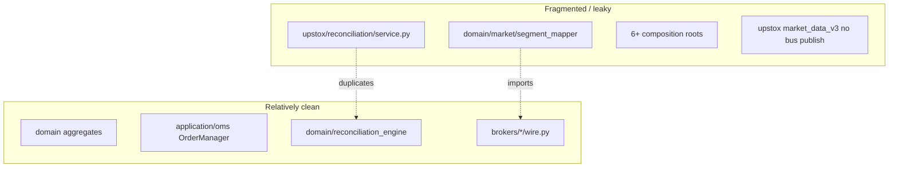

# Phase 3 — Leaf-Level Architecture Audit

**Evidence state:** `verified_by_execution` (import-linter) + `verified_by_static_analysis`

## Import-linter contract status

**Executed:** `PYTHONPATH=src lint-imports --config pyproject.toml` → **3 broken / 12 kept**

### Broken contracts (production impact)

#### 1. Domain independence

```22:31:src/domain/market/segment_mapper.py
def segment_mapper_for(broker_id: str) -> SegmentMapper:
    ...
    if broker_id == "upstox":
        from brokers.upstox.instruments.segment_mapper import UpstoxSegmentMapper
        return UpstoxSegmentMapper()
    from brokers.dhan.segments import DhanSegmentMapper
    return DhanSegmentMapper()
```

**Blast radius:** Transitive violation of Broker common isolation via `brokers.common.order_wire` → `domain.market.segment_mapper`. Adding a broker **requires editing domain**.

#### 2. Application infrastructure separation

Direct imports of `infrastructure.observability.tracing` in:
- `application.execution.{cancel_order_use_case, execution_service, gateway_submit, place_order_use_case}`
- `application.oms.{order_manager, position_manager, reconciliation_service}`

**Fix direction:** Tracing port at application boundary; infrastructure injects implementation.

### Stale `ignore_imports` (30+)

Many test-path ignores reference moved layouts (`application.oms.tests.*`, `brokers.common.tests.*`). Contracts pass with `unmatched_ignore_imports_alerting = "warn"` — **false sense of enforcement**.

## Bounded context ownership (actual vs target)



| Context | Canonical owner | Leakage / duplication |
|---------|-----------------|----------------------|
| Market Data | `brokers/*/websocket`, `application/streaming` | Upstox no EventBus ticks; Dhan-only publisher |
| Signal/Research | `analytics/*` | D2 contracts **kept** — analytics does not import OMS |
| Order Management | `application/oms` | Clean — no direct broker imports |
| Execution/Broker | `brokers/*/wire.py`, `infrastructure/gateway` | Gateway factory hardcodes 4 builders |
| Portfolio/Ledger | `application/oms/position_manager`, `trade_recorder` | Execution aggregate in domain; OMS book separate |
| Reconciliation | `domain/reconciliation_engine` + `application/oms/reconciliation_service` | **Upstox reimplements compare** |
| Analytics/Replay | `analytics/replay`, `analytics/backtest` | Replay imports `interface.ui.services.compose` (ignored exception) |
| Operations | `interface/ui/diagnostics`, `brokers/certification` | CI paths don't reach certification reliably |

## Domain richness assessment

### Order (`domain/entities/order.py`)
- Frozen dataclass, status machine helpers (`with_status`, `with_fill`)
- `OrderAck` separation from `OrderResponse` (anti-corruption)
- **Gap:** OMS `OrderManager` maintains parallel in-memory dict book — two representations

### Position (`domain/entities/position.py`)
- PnL math with multiplier, `PositionState` transitions
- Updated via `TRADE_APPLIED` events only (good boundary)

### Execution (`domain/executions/execution.py`)
- Thread-safe aggregate root for fills
- Publishes `TRADE_APPLIED` on `apply_trade`
- **Good:** closes fill ownership gap at domain level

### Reconciliation (`domain/reconciliation_engine.py`)
- Compares status + quantity (not fills, avg price, multiplier, realized PnL)
- **Shallow economics** — drift in PnL may not be detected

## Duplicate / scattered features

### Reconciliation (4 layers)

| Layer | Path | Issue |
|-------|------|-------|
| Types | `domain/reconciliation.py` | OK |
| Engine | `domain/reconciliation_engine.py` | Shared pure logic |
| OMS timer | `application/oms/reconciliation_service.py` | OK |
| Dhan impl | `brokers/dhan/portfolio/reconciliation.py` | Uses shared engine ✅ |
| Upstox impl | `brokers/upstox/reconciliation/service.py` | **Own `ReconciliationDrift` compare** ❌ |
| Gap fill | `application/composer/gap_reconciler.py` | Different concern (historical gaps) |

### Event bus paths

| Implementation | Construction sites |
|----------------|-------------------|
| `infrastructure/event_bus/event_bus.py` | `BrokerService`, `bootstrap`, `runtime/composition.py` |
| `DomainEventBus` port | Bridged by `InfrastructureEventBusAdapter` |
| `brokers/runtime/event_bus.py` | `EventBusFacade` |
| `NullEventBus` | Test / degraded paths |

**Risk:** Multiple construction sites; API has dedicated `create_api_event_bus` — mitigated partially by `build_for_api` shared bus.

### Gateway / wire / adapter (post-migration)

| Deleted | Current |
|---------|---------|
| `brokers/dhan/gateway.py` | `DhanWireAdapter` in `wire.py` |
| `brokers/upstox/gateway.py` | `UpstoxWireAdapter` in `wire.py` |

Aliases preserve compat: `DhanBrokerGateway = DhanWireAdapter`. Factory returns wire adapters directly (`identity/factory.py`).

## Broker extensibility audit

### To add broker `newbroker` — required edits today

| # | Must change | Avoidable in target? |
|---|-------------|---------------------|
| 1 | `pyproject.toml` entry point | No — registration |
| 2 | `src/brokers/newbroker/{__init__,wire,factory}.py` | No — plugin |
| 3 | `infrastructure/gateway/factory.py` builders dict | Yes — dynamic discovery |
| 4 | `domain/market/segment_mapper.py` | **Yes — P0 debt** |
| 5 | `runtime/trading_runtime_factory.py` hardcoded gateway selection | Yes |
| 6 | `interface/ui/services/broker_registry.py` + new ignore_imports | Partially |
| 7 | Certification suite | No — required |

**Verdict:** Plugin scaffolding exists; **domain and factory hardcoding** violate "add broker without editing OMS/strategy/UI" goal.

## Hidden state and coupling

| Issue | Evidence | Severity |
|-------|----------|----------|
| Process-wide OMS singleton | `process_context.py` | A — by design, but multi-root undermines it |
| `active_orders` dict in OrderManager | in-memory book + sqlite store | B — restart recovery depends on reconciliation |
| `ProcessedTradeRepository` singleton | `get_instance()` pattern | B — test isolation risk |
| SQLite single-writer assumption | `sqlite_order_store.py` header comment | A — multi-process deployment unsafe |
| Synchronous event dispatch | `event_bus.py` | B — market-data path latency |

## Application layer broker isolation

**Grep result:** `src/application/` has **zero** direct `brokers.*` imports ✅

Broker interaction flows through ports + injected `submit_fn` / gateway at composition root — **correct pattern** where used.