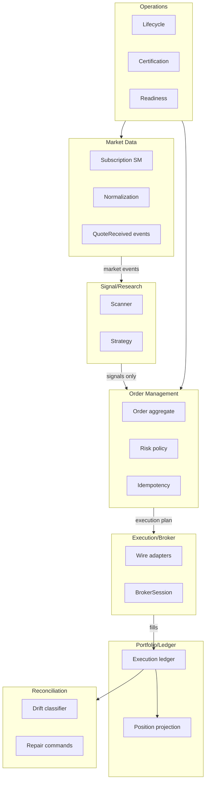
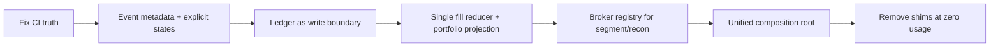

# Phase 6 — Target Architecture (Evolutionary)

**Principle:** Strangler migration — no big-bang package move. Every change has a shim + removal condition.

## Bounded contexts and ownership (target)



### Forbidden imports (enforceable)

| From | Must not import |
|------|-----------------|
| `domain` | `brokers`, `infrastructure`, `interface`, `analytics`, `application` |
| `application` | concrete `brokers.*`, `infrastructure` (except via ports/DI) |
| `analytics` | `application.oms`, `application.execution` |
| `brokers.*` | other `brokers.*` |
| `interface` | broker internals (wire/factory) — use `connect` shims |

## Shared execution spine (target)

One **execution ledger + outbox** is the authoritative write boundary:

1. Commands persist intent + outbox event atomically
2. Broker submission result persisted before returning to caller
3. Fills append idempotently to ledger
4. Portfolio is a **projection** over ledger events (not parallel book)
5. Reconciliation consumes ledger facts vs broker truth

**Compatibility shim:** Keep `OrderManager` in-memory book as shadow projection until parity tests prove ledger-only reads.

## Event envelope (target minimum fields)

```python
# Target contract (not yet implemented as single type)
event_id: str
schema_version: int
aggregate_id: str
correlation_id: str
causation_id: str
occurred_at: datetime
source: str  # live|paper|replay|backtest
mode: str
sequence: int  # monotonic per aggregate
payload: TypedDomainEvent
```

**Shim:** Add metadata to existing `TypedDomainEvent` without moving packages.

## Broker anti-corruption (target)

| Concern | Port location | Implementation |
|---------|---------------|----------------|
| Segment mapping | `domain/market/segment_mapper` protocol + registry | Broker plugin registers at import |
| Order wire | `BrokerAdapter` | `*/wire.py` |
| Status normalization | `domain/status_mapper.py` | Per-broker registry |
| Reconciliation fetch | `ReconciliationPort` | Delegates to `ReconciliationEngine` — **delete Upstox duplicate** |

## Unified developer surface (target)

| Command | SDK | CLI | MCP | Result states |
|---------|-----|-----|-----|---------------|
| Doctor | `session.doctor()` | `tradex doctor` | tool | `passed\|failed\|blocked` |
| Verify | — | `broker verify` | tool | per-check matrix |
| Certify | — | `broker certify` | tool | JSON artifact |
| Replay | `session.replay()` | `tradex replay` | — | determinism hash |
| Benchmark | — | `tradex benchmark` | — | SLO report |

**Rule:** No ad-hoc `scripts/verify/*` in CI without workflow-reference test.

## Repository structure (target — incremental)

No package rename required initially. Logical ownership map:

```
src/
  domain/           # Aggregates, commands, events, ports — ZERO broker imports
  application/
    oms/            # Order command handlers
    execution/      # Submit adapters (injected)
    ledger/         # NEW: outbox + fill ingress (extract from OMS internals)
  infrastructure/   # Event bus, persistence, tracing — implements ports
  brokers/          # Plugins only — wire, auth, certification
  runtime/          # SINGLE composition root factory (strangle duplicates)
  tradex/           # Thin SDK over runtime factory
  interface/        # Transport only — no OMS construction
```

**Removal conditions:**
- Delete `interface/ui/services/oms_bootstrap.py` when `runtime.factory` owns all OMS wiring
- Delete `segment_mapper_for` broker branches when registry populated via entry points
- Delete `OrderManager` shadow book when ledger projection certified

## Strangler migration phases



1. **Freeze ports** — document public API; add correlation/sequence metadata
2. **Ledger authority** — route OMS events through ledger/outbox
3. **Shadow projections** — old + new portfolio reducer compare in tests
4. **Broker registry** — segment mapper, reconciliation adapter via plugins
5. **Mode unification** — backtest `parity` mode default for certification; `PURE_SIM` explicit opt-in
6. **Remove duplicates** — Upstox recon, extra event bus constructors, stale CI paths