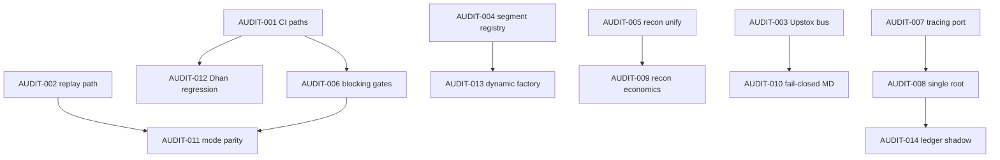

# Prioritized Migration Backlog

Items ordered by dependency. Each maps to findings in `05-findings-and-contract.md`.

---

## P0 — Truth and safety (no structural moves)

### AUDIT-001 — Repair CI workflow path drift
| Field | Value |
|-------|-------|
| **Priority** | A |
| **Category** | Integration/Release |
| **Root cause** | Test consolidation under `tests/`; scripts under `scripts/{verify,audit}/` |
| **Current** | `ci.yml` references `scripts/check_constants_placement.py`, `brokers/dhan/tests/`, `tests/stress/` |
| **Target** | All workflow commands resolve to existing paths; add `tests/architecture/test_workflow_paths.py` |
| **Affected** | `.github/workflows/*.yml`, `.pre-commit-config.yaml`, `scripts/audit/production_certification.py`, `src/runtime/parity_gate.py` |
| **Dependencies** | None |
| **Acceptance** | `ci.yml` lint job passes on clean checkout; workflow-reference test fails on intentional drift |
| **Integration test** | Architecture test greps all YAML for `scripts/`, `tests/`, `brokers/` paths |
| **Defer** | Never |
| **Maps to** | A-01, B-03, B-05, A-06 |

### AUDIT-002 — Fix `verify_event_replay` module path
| Field | Value |
|-------|-------|
| **Priority** | A |
| **Root cause** | Script moved to `scripts/verify/`; `-m` import never worked |
| **Affected** | `ci.yml` L214,277; `parity_gate.py` L30-40; `production_certification.py` |
| **Target** | `python scripts/verify/verify_event_replay.py` or proper package module |
| **Acceptance** | Parity gate passes replay check locally without `SKIP_PARITY_GATE` |
| **Maps to** | A-06 |

### AUDIT-003 — Upstox EventBus market tick publish
| Field | Value |
|-------|-------|
| **Priority** | A |
| **Category** | Market Data |
| **Root cause** | `event_bus` constructor param unused |
| **Affected** | `src/brokers/upstox/websocket/market_data_v3.py`, `MarketFeedPublisher` pattern from Dhan |
| **Target** | Publish `TICK`/`DEPTH` via same publisher abstraction as Dhan |
| **Acceptance** | Integration test: subscribe on EventBus receives Upstox tick fixture; certification check added |
| **Integration test** | Recorded protobuf fixture → bus event assertion |
| **Maps to** | A-02 |

### AUDIT-004 — Remove domain broker imports (segment mapper registry)
| Field | Value |
|-------|-------|
| **Priority** | A |
| **Category** | Domain & Contracts |
| **Root cause** | `segment_mapper_for` hardcodes dhan/upstox |
| **Affected** | `src/domain/market/segment_mapper.py`, broker `__init__.py` registration |
| **Target** | `SegmentMapperRegistry.register(broker_id, factory)` at plugin import; domain holds protocol only |
| **Acceptance** | `lint-imports` Domain independence contract passes |
| **Maps to** | A-03, B-01 |

### AUDIT-005 — Unify reconciliation compare logic
| Field | Value |
|-------|-------|
| **Priority** | A |
| **Category** | Reconciliation |
| **Root cause** | Upstox `ReconciliationDrift` duplicates engine |
| **Affected** | `brokers/upstox/reconciliation/service.py`, `domain/reconciliation_engine.py` |
| **Target** | Upstox adapter delegates to `ReconciliationEngine`; extend compare for economics |
| **Acceptance** | Cross-broker recon unit tests same inputs → same drift classification |
| **Maps to** | A-05 |

### AUDIT-006 — Make safety gates blocking in CI
| Field | Value |
|-------|-------|
| **Priority** | A |
| **Category** | Operations |
| **Root cause** | `continue-on-error`, MyPy warn-only |
| **Affected** | `ci.yml`, `production_gate.yml` |
| **Target** | Doctor/flaky/mypy either pass or fail job; document exceptions in ADR |
| **Acceptance** | No `continue-on-error` on safety steps without explicit `advisory` label in workflow |
| **Maps to** | B-06, A-01 |

---

## P1 — Execution spine and observability

### AUDIT-007 — Tracing port (fix application→infrastructure imports)
| Field | Value |
|-------|-------|
| **Priority** | B |
| **Affected** | 7 files in `application/execution`, `application/oms` |
| **Target** | `domain/ports/tracing.py` + infrastructure adapter injected at composition root |
| **Acceptance** | Application infrastructure separation contract passes |
| **Maps to** | B-02 |

### AUDIT-008 — Single composition root factory
| Field | Value |
|-------|-------|
| **Priority** | B |
| **Root cause** | 6+ independent bootstrap paths |
| **Affected** | `runtime/trading_runtime_factory.py`, `tradex/session.py`, `interface/ui/services/compose.py`, `interface/api/bootstrap.py` |
| **Target** | `runtime.factory.build(mode, transport)` called by all entry points; `process_context` registration mandatory |
| **Acceptance** | E2E test: API + CLI + SDK in same process share OMS book ID |
| **Maps to** | B-04 |

### AUDIT-009 — Deepen reconciliation economics
| Field | Value |
|-------|-------|
| **Priority** | B |
| **Target** | Compare avg price, multiplier, realized PnL, cumulative fills |
| **Affected** | `domain/reconciliation_engine.py`, broker recon adapters |
| **Acceptance** | Fixture with PnL drift detected; repair policy issues operator alert |
| **Maps to** | A-05 |

### AUDIT-010 — Fail-closed market data semantics
| Field | Value |
|-------|-------|
| **Priority** | B |
| **Target** | Tick drops emit `SubscriptionDegraded`; mapping failure raises; `event_bus=None` raises at subscribe |
| **Affected** | Dhan publisher, subscription domain object, provider adapters |
| **Acceptance** | Chaos test: null bus → subscribe fails loud |
| **Maps to** | MD-3, MD-4 (contract) |

### AUDIT-011 — Mode parity certification
| Field | Value |
|-------|-------|
| **Priority** | B |
| **Target** | CI runs `paper_replay_parity` + `live_backtest_parity` markers; backtest API defaults to explicit mode |
| **Affected** | `analytics/backtest/engine.py`, `interface/api/routers/backtest.py`, CI |
| **Acceptance** | Certification JSON includes mode parity evidence; `PURE_SIM` requires explicit flag |
| **Maps to** | A-04, MP-2 |

### AUDIT-012 — Restore Dhan regression suite
| Field | Value |
|-------|-------|
| **Priority** | B |
| **Target** | Implement or relocate `test_regression_suite.py`; fix `dhan-regression.yml` paths |
| **Affected** | `tests/integration/brokers/dhan/regression/`, `.github/workflows/dhan-regression.yml` |
| **Acceptance** | Workflow runs on self-hosted runner with `DHAN_INTEGRATION=1` |
| **Maps to** | B-03 |

---

## P2 — Extensibility and cleanup

### AUDIT-013 — Dynamic gateway factory discovery
| Field | Value |
|-------|-------|
| **Priority** | C |
| **Target** | Builders dict from `tradex.brokers` entry points |
| **Affected** | `infrastructure/gateway/factory.py`, `runtime/trading_runtime_factory.py` |
| **Acceptance** | Adding paper-like stub plugin requires zero factory edits |
| **Maps to** | Broker extensibility |

### AUDIT-014 — Ledger projection shadow mode
| Field | Value |
|-------|-------|
| **Priority** | C |
| **Target** | Portfolio read from ledger events; shadow-compare with OrderManager book |
| **Affected** | `application/oms/position_manager.py`, new `application/ledger/` |
| **Acceptance** | 24h replay fixture: shadow == book within tolerance |
| **Maps to** | A-04 |

### AUDIT-015 — Prune stale import-linter ignores
| Field | Value |
|-------|-------|
| **Priority** | C |
| **Affected** | `pyproject.toml` `[tool.importlinter]` |
| **Acceptance** | Zero unmatched ignore warnings |
| **Maps to** | C-01 |

### AUDIT-016 — Event envelope metadata
| Field | Value |
|-------|-------|
| **Priority** | C |
| **Target** | correlation_id, causation_id, sequence on all domain events |
| **Affected** | `domain/events/types.py`, publishers |
| **Acceptance** | Architecture test validates required fields |
| **Maps to** | Target architecture § Event envelope |

### AUDIT-017 — HTTP order write idempotency audit
| Field | Value |
|-------|-------|
| **Priority** | C |
| **Target** | Document and test retry policy; no retry on POST order without idempotency key |
| **Affected** | `brokers/dhan/api/http_client.py`, `brokers/upstox/auth/http.py` |
| **Acceptance** | Chaos test: timeout → single broker order |
| **Maps to** | B-07 |

---

## Backlog dependency graph

