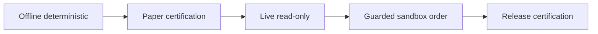

# Continuous Execution Roadmap

Each iteration is independently deployable and ends with validation + updated evidence in `docs/reviews/`.

## Iteration 0 — Audit baseline (complete)

- [x] Working-tree inventory and flow traces
- [x] Import-linter execution
- [x] CI path drift catalog
- [x] Evidence-backed report publication

**Release gate:** This document set exists with cited evidence.

---

## Iteration 1 — Validation truth (2–3 weeks)

**Goal:** CI green means paths exist and blocking gates block.

| Task | Backlog ID | Deliverable |
|------|------------|-------------|
| Fix all workflow script/test paths | AUDIT-001 | PR updating 8 workflows + pre-commit |
| Fix replay verifier invocation | AUDIT-002 | `parity_gate.py` + CI |
| Add `test_workflow_paths.py` | AUDIT-001 | Architecture regression |
| Remove `continue-on-error` on safety steps | AUDIT-006 | CI policy ADR |

**Validation:**
- `lint-imports` still documents broken contracts (not hidden)
- Full `ci.yml` dry-run script resolves every path
- `pytest tests/architecture/test_workflow_paths.py` passes

**Rollback:** Revert workflow paths; keep workflow-reference test.

**Stop criteria:** None — mechanical fixes only.

---

## Iteration 2 — Production safety paths (3–4 weeks)

**Goal:** Close silent failure paths on market data and reconciliation.

| Task | Backlog ID |
|------|------------|
| Upstox EventBus tick publish | AUDIT-003 |
| Segment mapper registry (domain purity) | AUDIT-004 |
| Unify Upstox reconciliation | AUDIT-005 |
| Fail-closed `event_bus=None` / tick drops | AUDIT-010 |

**Validation:**
- `lint-imports` Domain independence: **KEPT**
- Broker certification extended for Upstox bus ticks (fixture-based)
- Reconciliation unit tests cross-broker

**Release gate:** No live capital; paper + recorded-fixture certification only.

**Blocked by environment:** Live Upstox WS certification → `blocked_by_environment` until creds + market hours.

---

## Iteration 3 — Execution spine (4–6 weeks)

**Goal:** One authoritative ledger boundary; tracing via ports.

| Task | Backlog ID |
|------|------------|
| Tracing port | AUDIT-007 |
| Single composition root factory | AUDIT-008 |
| Deepen reconciliation economics | AUDIT-009 |
| Mode parity CI markers | AUDIT-011 |

**Validation:**
- Application infrastructure separation: **KEPT**
- `paper_replay_parity` tests in blocking CI job
- E2E: SDK + API share OMS instance in one process

**Release gate:** `SKIP_PARITY_GATE` rejected in production config validator.

---

## Iteration 4 — Extensibility and ledger projection (6–8 weeks)

**Goal:** Add broker without domain edits; shadow ledger projection.

| Task | Backlog ID |
|------|------------|
| Dynamic gateway discovery | AUDIT-013 |
| Ledger shadow projection | AUDIT-014 |
| Event envelope metadata | AUDIT-016 |
| Dhan regression workflow restored | AUDIT-012 |

**Validation:**
- Stub broker plugin in test proves zero factory edits
- Shadow projection parity report artifact
- `dhan-regression.yml` passes on self-hosted runner

---

## Iteration 5 — Cleanup (ongoing)

| Task | Backlog ID |
|------|------------|
| Prune import-linter ignores | AUDIT-015 |
| HTTP write idempotency | AUDIT-017 |
| Remove deprecated shims at zero usage | — |

---

## Release certification tiers (target)

| Tier | Requirements | Current state |
|------|--------------|---------------|
| T0 | Unit + arch + contract | **Runnable** (with collection errors) |
| T1 | `broker paper certify` | **Runnable** |
| T2 | `live_readonly` + off_market_safe | blocked_by_environment |
| T3 | `sandbox` + order lifecycle | blocked_by_environment; CI path broken |
| T4 | production_gate all phases | **failed** — stale cert script |

## Operator runbook updates (per iteration)

Each iteration must update:
1. `docs/architecture/RUNTIME_KERNEL.md` if composition changes
2. `brokers/README.md` if plugin contract changes
3. Certification artifact schema in `scripts/audit/production_certification.py`
4. This review pack with new evidence appendix entries