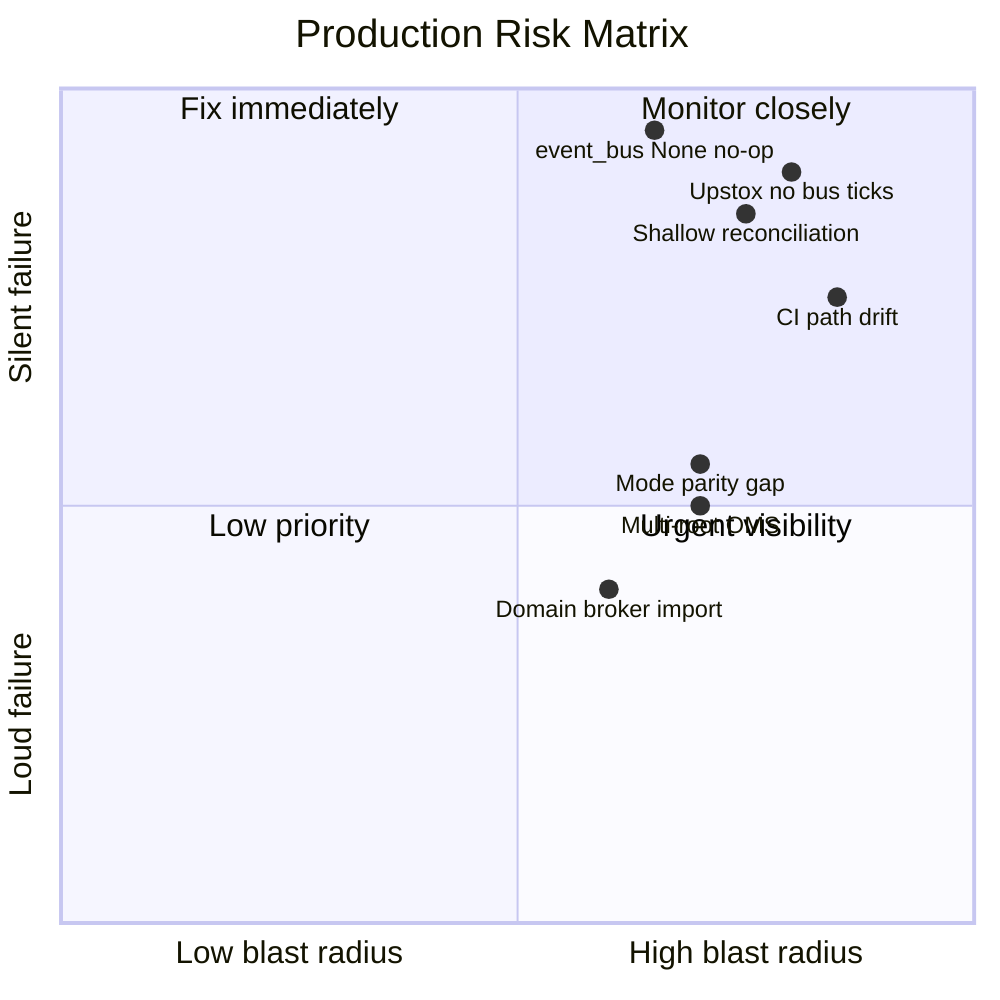
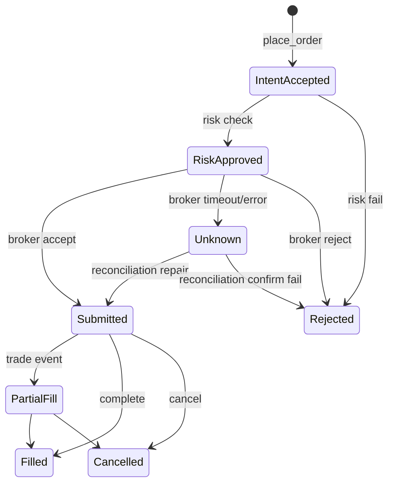
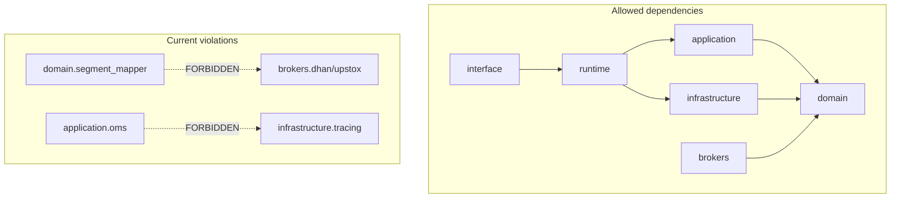
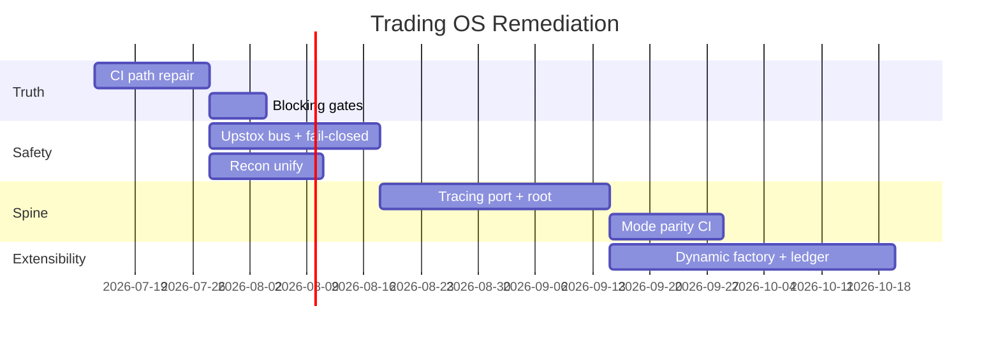
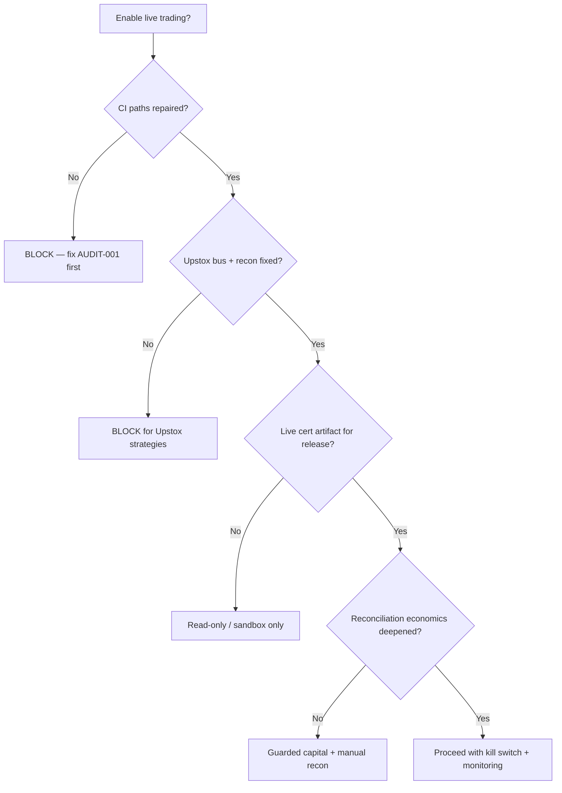

# Trading OS Audit — Executive Canvas

> Interactive summary for operators and engineering leads. Navigate by section headers. All claims link to detailed evidence in sibling documents.

---

## 1. Executive risk dashboard

### One-line verdict

**Research-grade platform; not production-certified for unattended live capital.**

### Risk heatmap

| Area | Grade | Top issue |
|------|-------|-----------|
| CI / certification | 🔴 F | 15+ broken paths |
| Market data | 🟠 D | Upstox bus gap |
| Order execution | 🟡 C+ | UNKNOWN handled; retry policy unclear |
| Reconciliation | 🟠 D | Shallow compare |
| Architecture boundaries | 🟠 D | 3 import-linter failures |
| Test pyramid | 🟢 B+ | Large but collection errors |
| Broker plugins | 🟡 C | Wire migration done; domain leak remains |

---

## 2. Flow / state map (click-through)

### Live order state machine (observed)

**Gap:** `Unknown` recovery depends on reconciliation + `auto_repair` policy (often off).

### Market data path comparison

| Step | Dhan | Upstox |
|------|------|--------|
| Auth | ✅ | ✅ |
| WS connect | ✅ | ✅ |
| Normalize | ✅ | ✅ |
| **EventBus TICK** | ✅ `MarketFeedPublisher` | ❌ listeners only |
| ORDER stream → bus | ✅ | ✅ portfolio stream |

→ Detail: [02-runtime-flows.md](./02-runtime-flows.md)

---

## 3. Architecture boundaries

### Composition roots (fragmentation)

| Root | Status |
|------|--------|
| `tradex/session.py` | Active |
| `runtime/trading_runtime_factory.py` | Active |
| `interface/ui/services/compose.py` | Active |
| `interface/api/bootstrap.py` | Active |
| `infrastructure/gateway/factory.py` | Active |
| `process_context.py` | Guard only — warn on duplicate |

→ Detail: [03-architecture-audit.md](./03-architecture-audit.md)

---

## 4. Priority backlog (top 8)

| Rank | ID | Title | Priority | Effort |
|------|-----|-------|----------|--------|
| 1 | AUDIT-001 | Repair CI workflow path drift | A | S |
| 2 | AUDIT-002 | Fix verify_event_replay invocation | A | S |
| 3 | AUDIT-003 | Upstox EventBus tick publish | A | M |
| 4 | AUDIT-004 | Segment mapper registry (domain purity) | A | M |
| 5 | AUDIT-005 | Unify reconciliation compare | A | M |
| 6 | AUDIT-006 | Make safety gates blocking | A | S |
| 7 | AUDIT-008 | Single composition root factory | B | L |
| 8 | AUDIT-009 | Deepen reconciliation economics | B | M |

**S** = days, **M** = 1–2 weeks, **L** = 3+ weeks

→ Full backlog: [07-backlog.md](./07-backlog.md)

---

## 5. Roadmap timeline

→ Detail: [08-roadmap.md](./08-roadmap.md)

---

## 6. Validation truth scorecard

| Gate | Status |
|------|--------|
| `ci.yml` lint job | ❌ failed (paths) |
| Import-linter | ❌ failed (3 contracts) |
| Pyramid unit/component/arch | ⚠️ blocked (collection errors) |
| Paper certification | ✅ runnable |
| Live certification | ⏸ blocked (secrets) |
| Dhan regression workflow | ❌ failed (missing suite) |
| Parity gate at boot | ❌ broken replay path |
| Production gate | ❌ failed (stale cert) |

→ Detail: [04-validation-audit.md](./04-validation-audit.md)

---

## 7. Decision tree for operators

---

## 8. Document map

| Need | Read |
|------|------|
| Full verdict + index | [README.md](./README.md) |
| Repo inventory | [01-repository-inventory.md](./01-repository-inventory.md) |
| Flow traces | [02-runtime-flows.md](./02-runtime-flows.md) |
| Architecture findings | [03-architecture-audit.md](./03-architecture-audit.md) |
| CI / tests | [04-validation-audit.md](./04-validation-audit.md) |
| Ranked findings + contract | [05-findings-and-contract.md](./05-findings-and-contract.md) |
| Target design | [06-target-architecture.md](./06-target-architecture.md) |
| Backlog | [07-backlog.md](./07-backlog.md) |
| Roadmap | [08-roadmap.md](./08-roadmap.md) |
| Commands + unknowns | [09-evidence-appendix.md](./09-evidence-appendix.md) |

---

*Canvas generated 2026-07-11 from working tree `8f825b5d`. No production code was modified during this audit.*