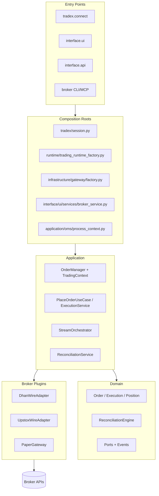

# Trading OS Comprehensive Architecture Audit

**Audit date:** 2026-07-11  
**Baseline commit:** `8f825b5d` (`refactor/structural-cleanup`)  
**Working tree:** ~361 modified paths at reconciliation (was 325 at audit start; moving target)  
**Evidence rule:** Every material claim cites file, symbol, test, workflow, or command output. Documentation and prior reviews are inputs, not truth.
**Source of truth:** This file is a Phase 0 evidence snapshot. The program-of-record is [`2026-07-11-trading-os-transformation-program/`](../2026-07-11-trading-os-transformation-program/README.md); see the [artifact index](../README.md).

## Verdict

**Do not enable unattended live trading with material capital.** Trade_XV2 has a credible Clean Architecture direction, a large test pyramid (~7k collected tests), and meaningful broker-kernel migration work (`gateway.py` → `wire.py`, `process_context` OMS singleton). However, **production correctness is not enforced end-to-end**: fragmented composition roots, asymmetric broker market-data paths, incomplete reconciliation economics, and **systematically broken CI/certification paths** mean a green build does not prove live safety.

| Dimension | Status | Confidence |
|-----------|--------|------------|
| Domain model richness | Partial — Order/Position/Execution aggregates exist; reconciliation compares shallow fields | High |
| Execution spine parity (live/paper/replay/backtest) | Partial — paper/replay share OMS adapter; backtest defaults `PURE_SIM`; live has dry-run default | High |
| Broker extensibility | Partial — plugin entry points exist; domain still imports concrete brokers | High |
| CI / certification truthfulness | **Partially repaired** — stale paths grep-clean; `test_workflow_paths.py` not yet wired into CI; `continue-on-error` remains on 4 `ci.yml` safety steps + 1 mutation step (AUDIT-006 open) | High |
| Import-linter enforcement | **Fixed** — 15/15 contracts pass (`lint-imports` exit 0, 2026-07-11) | High |
| Live broker certification | Environment-blocked without credentials/market hours | Medium |

> **Reconciled 2026-07-11 by execution:** `lint-imports` verified exit 0 (15/15); stale-workflow-path claims (AUDIT-001/002) grep-clean; Dhan regression paths valid but live run env-blocked (`DHAN_INTEGRATION=1`). Live execution log: [`transformation-program/PHASE-STATUS.md`](../2026-07-11-trading-os-transformation-program/PHASE-STATUS.md). Rows originally marked "Broken" in this snapshot predate those fixes.

## Report index

| Document | Contents |
|----------|----------|
| [01-repository-inventory.md](./01-repository-inventory.md) | File census, package map, entry points, composition roots |
| [02-runtime-flows.md](./02-runtime-flows.md) | Market data, order, fill, reconciliation, lifecycle, mode parity traces |
| [03-architecture-audit.md](./03-architecture-audit.md) | Boundaries, duplication, broker leakage, ownership |
| [04-validation-audit.md](./04-validation-audit.md) | Tests, CI, certification, gate classification |
| [05-findings-and-contract.md](./05-findings-and-contract.md) | Root causes, expected behavior contract, ranked findings |
| [06-target-architecture.md](./06-target-architecture.md) | Bounded contexts, dependency rules, strangler migration |
| [07-backlog.md](./07-backlog.md) | Dependency-ordered work items with acceptance criteria |
| [08-roadmap.md](./08-roadmap.md) | Iteration plan with release gates |
| [09-evidence-appendix.md](./09-evidence-appendix.md) | Commands run, paths reviewed, unknowns |
| [CANVAS.md](./CANVAS.md) | Executive interactive summary (risk, flows, backlog, boundaries) |

## System intent (observed)

Trade_XV2 is a **broker-agnostic algorithmic trading framework** for Indian exchanges (NSE/BSE/MCX), packaged as:

- **SDK:** `tradex.connect()` / `tradex.session` (`src/tradex/session.py`)
- **CLI/TUI:** `tradex` entry point → `src/interface/ui/`
- **API:** FastAPI under `src/interface/api/`
- **Broker tooling:** `broker` / `broker-mcp` CLIs (`pyproject.toml` scripts)
- **Research modes:** backtest, replay, paper (`src/analytics/`)

Declared architecture: Clean Architecture layers under `src/` with `runtime` as composition root (`docs/architecture/RUNTIME_KERNEL.md`, `pyproject.toml` import-linter contracts).

## Top systemic risks (A-tier)

1. **Fragmented composition roots** — SDK, CLI, API each bootstrap independently; `process_context` warns but cannot prevent double-registration (`src/application/oms/process_context.py:44-49`).
2. **No unified market-data → EventBus path for Upstox** — Dhan publishes `TICK`/`DEPTH`; Upstox multiplexer stores `event_bus` but does not publish (`src/brokers/upstox/websocket/market_data_v3.py:89-97`).
3. **CI/certification path drift** — *(reconciled 2026-07-11: stale workflow paths grep-clean, AUDIT-001/002 resolved, `lint-imports` 15/15. Open: AUDIT-006 `continue-on-error` gates.)* Originally cited pre-migration layout and lint-before-tests failure.
4. **Domain imports concrete brokers** — `segment_mapper_for` breaks Domain independence (`src/domain/market/segment_mapper.py:22-31`).
5. **Silent failure semantics** — dropped ticks, `event_bus=None` no-ops, empty datalake returns, `auto_repair=False` reconciliation detect-only.

## Architecture at a glance

## Reconciliation with prior review (2026-07-10)

The [2026-07-10 trading platform review](../2026-07-10-trading-platform-review/executive-summary.md) hypotheses are **confirmed** by this leaf-level audit:

| Prior claim | This audit |
|-------------|------------|
| No single execution spine | Confirmed — backtest `PURE_SIM` bypasses OMS; paper uses simulated fills |
| Silent stale/empty data | Confirmed — tick drop counters, datalake soft-fail |
| CI non-truthful | **Upgraded to broken** — path drift is systematic, not advisory |
| Reconciliation incomplete | Confirmed — status/qty compare; Upstox duplicates logic |
| Broker-kernel partial | Confirmed — wire migration done; domain leakage remains |

## Decision

Treat Trade_XV2 as **research and controlled integration software**. Production launch requires P0 backlog completion with **real-environment evidence** (not mock/paper-only certification). Structural cleanup on `refactor/structural-cleanup` may proceed behind feature flags and contract tests; live capital remains gated on closing AUDIT-003/004/005/006 and live certification (dhan 30/32; upstox env-blocked). Validation truth is partially repaired — see reconciled verdict above.