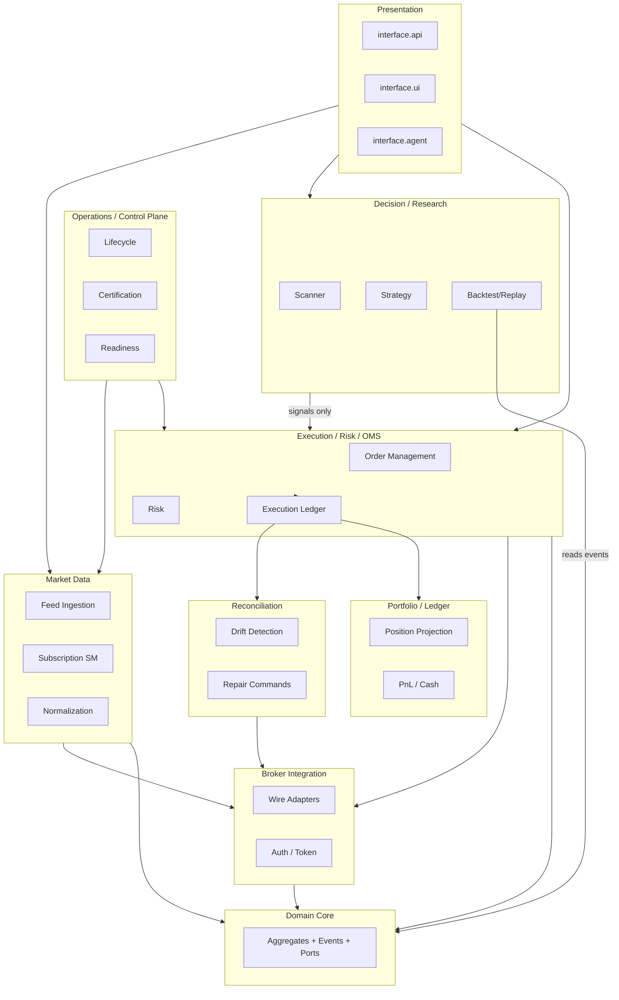
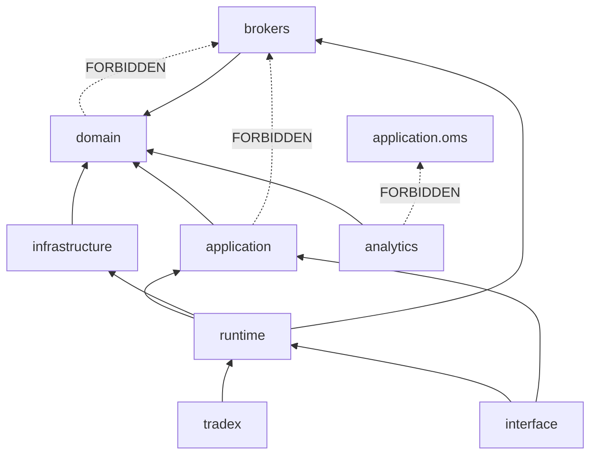
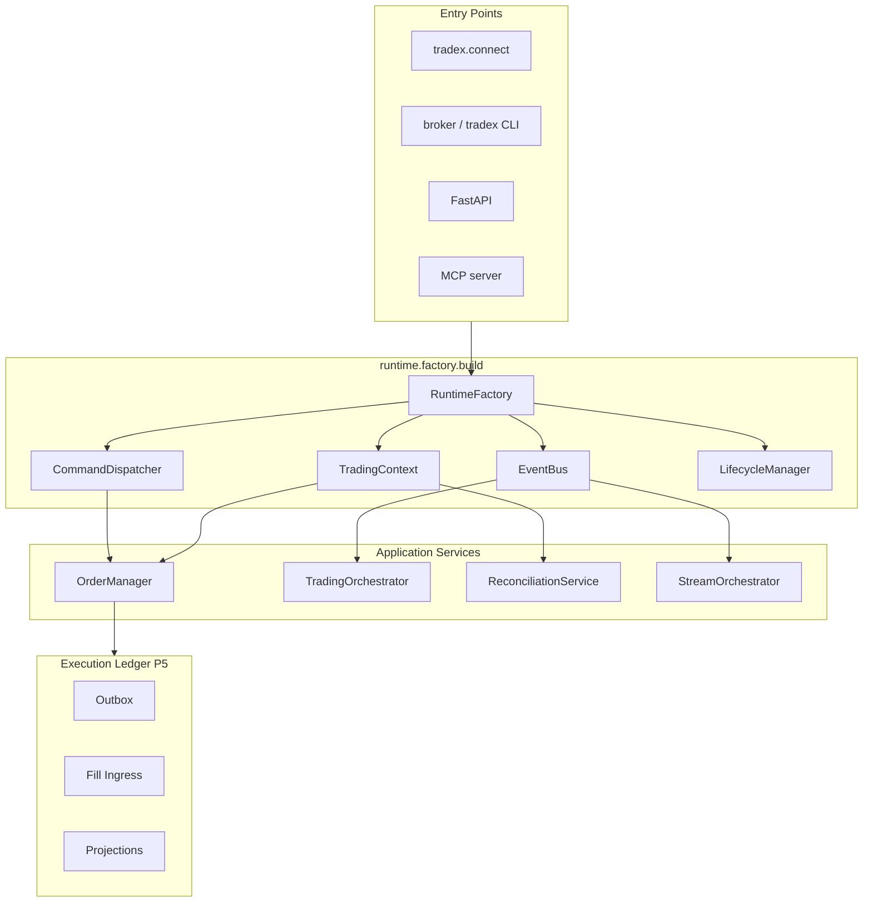
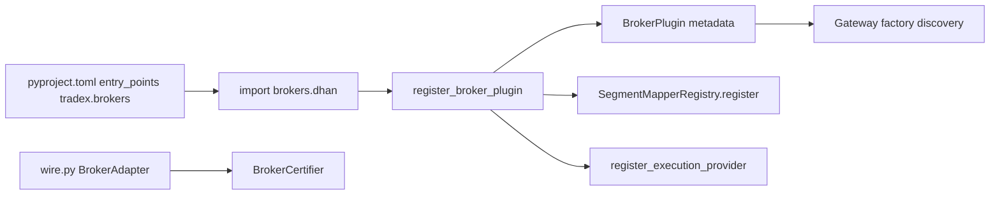
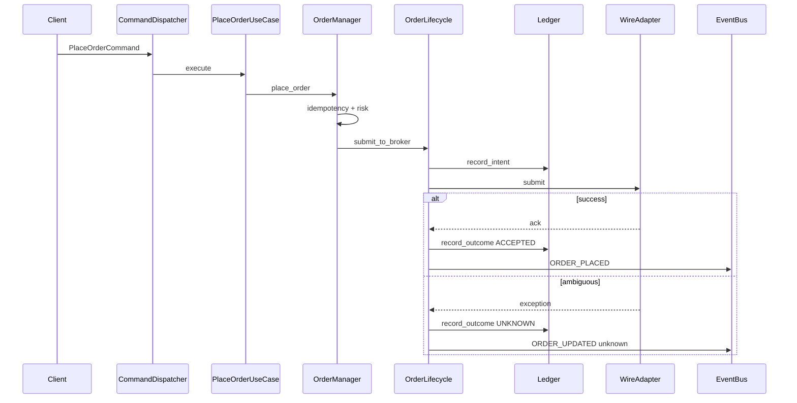

# Architecture Artifacts

Reference diagrams and models for Phase 1–2. Implementation in Phase 5.

---

## 1. Bounded context map



---

## 2. Package structure (target)

```
src/
├── domain/                 # Aggregates, VOs, commands, events, ports — ZERO outer imports
│   ├── entities/           # Order, Position, Trade, market entities
│   ├── executions/         # Execution aggregate root
│   ├── events/             # Event types, bus port
│   ├── instruments/        # Instrument, Subscription, resolver protocols
│   ├── orders/             # Intent, requests, execution plans
│   ├── market/             # SegmentMapper protocol + registry (no broker imports)
│   ├── ports/              # BrokerAdapter, TracingPort, repositories
│   └── reconciliation_engine.py
│
├── application/
│   ├── oms/                # OrderManager, TradingContext, risk, recon service
│   ├── execution/          # PlaceOrderUseCase, gateway_submit (injected)
│   ├── ledger/             # NEW P5: outbox, fill ingress, projections
│   ├── trading/            # Orchestrator (dispatcher-injected)
│   ├── streaming/          # StreamOrchestrator, tick router
│   └── composer/           # Gap reconciler, execution composer
│
├── infrastructure/         # Implements ports — no business decisions
│   ├── gateway/            # bootstrap_gateway (→ dynamic discovery P5)
│   ├── event_bus/
│   ├── persistence/
│   └── observability/      # Tracing adapter implements TracingPort
│
├── brokers/                  # Plugins: dhan, upstox, paper, common
│   ├── {broker}/wire.py    # WireAdapter implements BrokerAdapter
│   ├── certification/
│   ├── cli/ + mcp/
│   └── plugins/            # register_broker_plugin, segment mapper
│
├── runtime/                  # SINGLE composition root (target)
│   ├── factory.py          # NEW P5: build(mode, transport)
│   ├── commands/ + queries/
│   └── trading_runtime_factory.py  # → delegates to factory
│
├── tradex/                   # Thin public SDK
├── analytics/                # D2 isolated — no OMS imports
├── datalake/
└── interface/                # API, UI, agent — no broker internals
```

**Shim removal conditions:** documented per module in Handbook §5 (Phase 1 deliverable).

---

## 3. Dependency direction



Enforced by `pyproject.toml` import-linter (15 contracts). Target: **15/15 pass** after TRANS-P3-008.

---

## 4. Domain model (aggregates)

### Order

| Attribute | Type | Notes |
|-----------|------|-------|
| order_id | str | Internal |
| correlation_id | str | Idempotency key |
| status | OrderStatus | Includes UNKNOWN |
| side, qty, price | VOs | Decimal |
| filled_qty | Decimal | Cumulative |

**Invariants:** Legal transitions per state machine; UNKNOWN blocks retry until recon.

### Execution (aggregate root)

| Responsibility | Method |
|----------------|--------|
| Own fills for one order | `apply_trade(trade)` |
| Compute averages | `avg_price()`, `filled_quantity()` |
| Emit fact | `TRADE_APPLIED` event |

**Invariant:** No double-application of same trade_id.

### Position

| Responsibility | Notes |
|----------------|-------|
| Quantity, avg price | From fills only |
| Realized PnL | On reducing fills |
| State machine | `PositionState` transitions |

### Subscription

| State | Meaning |
|-------|---------|
| inactive | Created, not attached |
| active | Receiving ticks |
| degraded | Stale or dropping |
| ended | Unsubscribed |

**Invariant:** `is_active()` false when degraded (target — Phase 5).

### BrokerSession

| State | Meaning |
|-------|---------|
| authenticated | Token valid |
| read_only | Data only |
| trading_enabled | Orders allowed |
| degraded | Partial capabilities |
| closed | Shutdown |

### TradingAccount (risk)

| Attribute | Notes |
|-----------|-------|
| available_capital | Reservations subtract |
| daily_pnl | Boundary reset |
| kill_switch | Blocks new orders |

---

## 5. Event model (catalog summary)

### Commands (intent, synchronous boundary)

| Command | Handler owner | Response |
|---------|---------------|----------|
| PlaceOrder | OMS | ACCEPTED / REJECTED / UNKNOWN |
| CancelOrder | OMS | Same |
| ReconcileAccount | Reconciliation | DriftReport |
| StartSubscription | Market Data | Subscription handle |
| StopSubscription | Market Data | Ack |
| RunStrategy | Orchestrator | Signal batch (no direct order) |

### Domain events (facts)

| Event | Producer | Consumers |
|-------|----------|-----------|
| OrderIntentAccepted | OMS | Audit, ledger |
| RiskApproved / RiskRejected | Risk | OMS |
| OrderSubmitted | OMS | Ledger, recon |
| OrderSubmissionUnknown | OMS | Recon (expedited) |
| OrderPartiallyFilled / OrderFilled | OMS / stream | Portfolio |
| TradeApplied | Execution | Position |
| QuoteReceived / DepthUpdated | Market Data | Analytics, UI |
| SubscriptionDegraded | Market Data | Readiness |
| ReconciliationDriftDetected | Reconciliation | Control plane |
| PositionChanged | Portfolio | Risk |

### Event envelope (target — TRANS-P5-034)

```
event_id, schema_version, aggregate_id, correlation_id, causation_id,
occurred_at, source, mode, sequence, payload
```

---

## 6. Runtime architecture



**Current state:** 6+ roots → **target:** all entry points call `runtime.factory.build()`.

---

## 7. Plugin architecture



**Adding broker `foo` (target):**
1. `pyproject.toml` entry point
2. `brokers/foo/{__init__,wire,factory}.py`
3. Certification suite pass
4. **Zero** edits to `domain/`, `application/oms/`

---

## 8. Key flow sequence — PlaceOrder



---

## 9. ADR plan

| ADR | Title | Phase | Status |
|-----|-------|-------|--------|
| ADR-012 | CQRS dispatchers | Done | Accepted |
| ADR-013 | Broker set | Done | Accepted |
| ADR-014 | Persistence | Done | Accepted |
| ADR-014-brokers | Trading OS mini-OS | Done | Accepted |
| ADR-015 | Execution ledger authority | P1 | **To write** |
| ADR-016 | Market data EventBus canonical path | P1 | **To write** |
| ADR-017 | Single composition root | P1 | **To write** |
| ADR-018 | Certification truth tiers | P1 | **To write** |
| ADR-019 | CI gate semantics | P3 | **To write** |
| ADR-020 | Deployment topology (single-writer) | P7 | Planned |
| ADR-021 | Event envelope versioning | P5 | Planned |

Existing: `docs/architecture/adrs/`