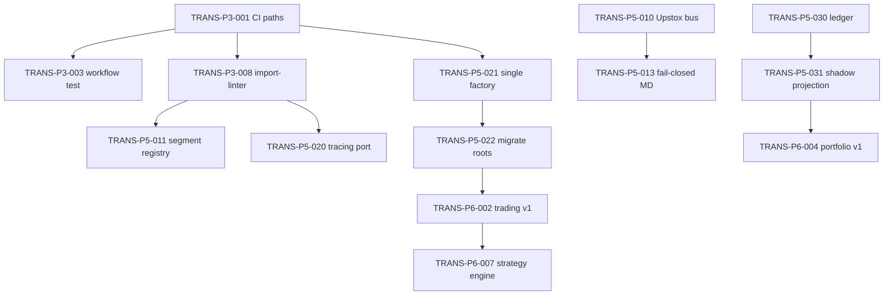

# Engineering Backlog

Task format for AI agents and engineers:

```
TRANS-P{phase}-{seq} | Lane | Complexity | Dependencies | Acceptance one-liner
```

**Complexity:** S (1–3 days), M (1–2 weeks), L (3+ weeks)

---

## Phase 0 — Complete ✅

| ID | Lane | Cx | Description | Acceptance |
|----|------|-----|-------------|------------|
| TRANS-P0-001 | All | M | Repository file census | Inventory doc published |
| TRANS-P0-002 | Integration | S | Run import-linter + graphify | Results in audit appendix |
| TRANS-P0-003 | Integration | M | CI path drift catalog | 15+ paths documented |
| TRANS-P0-004 | All | L | E2E flow reconstruction | Flow doc with line refs |
| TRANS-P0-005 | Chief Architect | M | Risk register seed | A/B/C findings ranked |

---

## Phase 1 — Architecture Foundation

| ID | Lane | Cx | Deps | Description | Acceptance |
|----|------|-----|------|-------------|------------|
| TRANS-P1-001 | Domain | M | P0 | Architecture Handbook v1 | Merged `docs/architecture/HANDBOOK.md` |
| TRANS-P1-002 | Domain | S | P0 | Ubiquitous language glossary | 50+ terms in `GLOSSARY.md` |
| TRANS-P1-003 | Domain | S | P1-001 | Bounded context ownership table | No overlap with TEAM-OWNERSHIP |
| TRANS-P1-004 | Domain | M | P1-003 | Event catalog v1 | Commands + events + integration DTOs |
| TRANS-P1-005 | Domain | M | P1-004 | Object model spec | Aggregates + invariants documented |
| TRANS-P1-006 | Runtime | M | P1-003 | Package structure + shim conditions | Handbook §5 |
| TRANS-P1-007 | Runtime | S | P1-006 | Dependency rules matrix | Aligns with pyproject import-linter |
| TRANS-P1-008 | Broker | M | ADR-014 | Plugin contract spec | Entry point + cert requirements |
| TRANS-P1-009 | Runtime | S | KERNEL | Public SDK contract | Session modes documented |
| TRANS-P1-010 | Chief Architect | M | P1-004–009 | ADR-015–018 drafts | Four ADRs in repo |
| TRANS-P1-011 | Chief Architect | S | P1-006 | Context + package mermaid | In ARCHITECTURE-ARTIFACTS.md |
| TRANS-P1-012 | Chief Architect | S | P1-001 | Architecture review checklist | Handbook §9 |

---

## Phase 2 — Runtime & Flow Design

| ID | Lane | Cx | Deps | Description | Acceptance |
|----|------|-----|------|-------------|------------|
| TRANS-P2-001 | Runtime | M | P1 | Startup → readiness flow | FLOWS.md §1 |
| TRANS-P2-002 | Runtime | S | P2-001 | Shutdown + kill-switch | FLOWS.md §2 |
| TRANS-P2-003 | OMS | M | P2-001 | Recovery (restart, UNKNOWN) | FLOWS.md §3 |
| TRANS-P2-004 | Broker | M | audit | Auth + token refresh flows | Per-broker sequence diagrams |
| TRANS-P2-005 | Domain | M | P1-005 | Instrument + security mapping | FLOWS.md §4 |
| TRANS-P2-006 | Market Data | S | P2-005 | Historical data flow | FLOWS.md §5 |
| TRANS-P2-007 | Market Data | M | ADR-016 | Quote + subscription (canonical bus) | FLOWS.md §6 |
| TRANS-P2-008 | OMS | M | P1-005 | Order lifecycle state machine | STATE_MACHINES.md §Order |
| TRANS-P2-009 | OMS | M | ADR-015 | Fill ingress → projection | FLOWS.md §7 |
| TRANS-P2-010 | OMS | S | P2-009 | Portfolio + PnL flow | FLOWS.md §8 |
| TRANS-P2-011 | OMS | M | audit | Reconciliation + repair | FLOWS.md §9 |
| TRANS-P2-012 | Quant | S | CQRS | Replay determinism flow | FLOWS.md §10 |
| TRANS-P2-013 | Runtime | M | audit | Mode routing matrix | FLOWS.md §11 |
| TRANS-P2-014 | All | M | contract | Error taxonomy (loud/silent) | ERROR_TAXONOMY.md |
| TRANS-P2-015 | Integration | M | P2-001–014 | Flow contract test stubs | `test_flow_contracts.py` committed |

---

## Phase 3 — Engineering Standards (CRITICAL PATH)

| ID | Lane | Cx | Deps | Description | Acceptance | Audit map |
|----|------|-----|------|-------------|------------|-----------|
| TRANS-P3-001 | Integration | M | P0 | Repair CI workflow paths | `ci.yml` lint passes | AUDIT-001 |
| TRANS-P3-002 | Integration | S | P0 | Fix replay verifier + parity_gate | Replay passes locally | AUDIT-002 |
| TRANS-P3-003 | Integration | S | P3-001 | `test_workflow_paths.py` | Fails on drift | AUDIT-001 |
| TRANS-P3-004 | Integration | S | P3-001 | Blocking safety gates + ADR-019 | No silent continue-on-error | AUDIT-006 |
| TRANS-P3-005 | Integration | S | P3-001 | Fix pre-commit paths | pre-commit run passes | AUDIT-001 |
| TRANS-P3-006 | Integration | M | P3-001 | Fix production_certification.py | Script runs green | AUDIT-001 |
| TRANS-P3-007 | Integration | M | P3-001 | Dhan regression workflow paths | Workflow valid on paper | AUDIT-012 |
| TRANS-P3-008 | Domain+OMS | L | P1-007 | Fix 3 import-linter contracts | 15/15 pass | AUDIT-004,007 |
| TRANS-P3-009 | All | M | P1 | Publish STANDARDS.md | Naming, logging, errors | — |
| TRANS-P3-010 | Integration | S | P3-008 | Arch test: no domain broker imports | Test fails on regression | AUDIT-004 |
| TRANS-P3-011 | Integration | S | P3-008 | Arch test: app no infra imports | Test fails on regression | AUDIT-007 |
| TRANS-P3-012 | Integration | S | P3-004 | Gate semantics in workflows | passed/failed/blocked only | ADR-018 |

### TRANS-P3-008 subtasks

| Sub | Description | Lane |
|-----|-------------|------|
| P3-008a | `SegmentMapperRegistry` + remove domain imports | Domain |
| P3-008b | `TracingPort` + remove app→infra tracing | OMS |
| P3-008c | Prune stale `ignore_imports` in pyproject.toml | Integration |

---

## Phase 4 — Developer Platform

| ID | Lane | Cx | Deps | Description | Acceptance |
|----|------|-----|------|-------------|------------|
| TRANS-P4-001 | Runtime | M | P1,P2 | Developer platform spec | DEVELOPER-PLATFORM.md |
| TRANS-P4-002 | Broker | L | P3 | Unified doctor (SDK/CLI/MCP) | Same core module |
| TRANS-P4-003 | Broker | M | P3 | verify + cert JSON schema v2 | Schema validated in CI |
| TRANS-P4-004 | Broker | M | P3 | Certification tiers | 4 tiers documented |
| TRANS-P4-005 | Runtime | M | P2-001 | API /health /ready | 503 when not ready |
| TRANS-P4-006 | Broker | M | P4-002 | MCP tool parity | Arch test |
| TRANS-P4-007 | Integration | M | P2 | Golden datasets (real recordings) | CI runnable offline |
| TRANS-P4-008 | Runtime | S | P4-001 | Sample app + notebook | `examples/minimal_session/` |
| TRANS-P4-009 | Integration | S | P4-001 | Script deprecation schedule | Dates in DEVELOPER-PLATFORM |
| TRANS-P4-010 | Integration | S | P4-003 | Arch test: cert path unity | Single BrokerCertifier |

---

## Phase 5 — Core Platform Refactoring

| ID | Lane | Cx | Deps | Description | Acceptance | Audit map |
|----|------|-----|------|-------------|------------|-----------|
| TRANS-P5-010 | Market Data | M | P3,ADR-016 | Upstox EventBus tick publish | Golden fixture test | AUDIT-003 |
| TRANS-P5-011 | Broker | M | P3-008a | Segment registry at plugin import | lint-imports domain OK | AUDIT-004 |
| TRANS-P5-012 | Broker | M | P2-011 | Upstox recon → shared engine | Cross-broker unit tests | AUDIT-005 |
| TRANS-P5-013 | Market Data | M | P5-010 | Fail-closed MD semantics | SubscriptionDegraded on drop | AUDIT-010 |
| TRANS-P5-020 | OMS | M | P3-008b | Tracing port wired at factory | App infra contract OK | AUDIT-007 |
| TRANS-P5-021 | Runtime | L | ADR-017 | `runtime.factory.build()` | Single entry API | AUDIT-008 |
| TRANS-P5-022 | Runtime | L | P5-021 | Migrate SDK/CLI/API to factory | E2E shared OMS test | AUDIT-008 |
| TRANS-P5-030 | OMS | L | ADR-015 | Ledger outbox write boundary | Intent durable before submit | AUDIT-014 |
| TRANS-P5-031 | OMS | L | P5-030 | Shadow portfolio projection | 24h fixture parity | AUDIT-014 |
| TRANS-P5-032 | OMS | M | P5-012 | Reconciliation economics | PnL drift detected | AUDIT-009 |
| TRANS-P5-033 | Broker | M | P5-011 | Dynamic gateway from entry points | Stub broker zero factory edits | AUDIT-013 |
| TRANS-P5-034 | Domain | M | P1-004 | Event envelope metadata | Arch test fields present | AUDIT-016 |
| TRANS-P5-035 | Quant | S | P2-013 | Backtest explicit mode default | API requires mode param | AUDIT-011 |
| TRANS-P5-040 | All | M | P5-022,031 | Remove shims at zero usage | Grep + arch test | — |

---

## Phase 6 — Feature Delivery

| ID | Lane | Cx | Deps | Description | Acceptance |
|----|------|-----|------|-------------|------------|
| TRANS-P6-001 | Market Data | L | P5 | Market Access v1 | CAP_MARKET_ACCESS ADR + tests |
| TRANS-P6-002 | OMS | L | P5 | Trading v1 (command-only) | CAP_TRADING ADR + cert |
| TRANS-P6-003 | Domain | L | P6-001 | Options v1 single-leg | CAP_OPTIONS ADR |
| TRANS-P6-004 | OMS | M | P5-031 | Portfolio v1 reads | Projection-only reads |
| TRANS-P6-005 | Quant | M | P5-035 | Analytics scanner determinism | `@scanner_determinism` CI |
| TRANS-P6-006 | Quant | M | P5 | Replay v1 API+CLI | Determinism hash in cert |
| TRANS-P6-007 | Quant | L | P6-002 | Strategy engine v1 | Orchestrator via dispatcher |
| TRANS-P6-008 | Agent | M | P6-002,P4 | AI agents v1 tools | Tools call commands only |

---

## Phase 7 — Production Hardening

| ID | Lane | Cx | Deps | Description | Acceptance |
|----|------|-----|------|-------------|------------|
| TRANS-P7-001 | Ops | M | P5 | SLO document + metrics | SLO.md + dashboards |
| TRANS-P7-002 | Ops | M | P5-020 | OTel end-to-end tracing | Trace spans on PlaceOrder |
| TRANS-P7-003 | Integration | L | P5 | Chaos suite expansion | production_gate passes |
| TRANS-P7-004 | Integration | M | P5-010 | Load test 1000 symbols paper | load-test.yml blocking |
| TRANS-P7-005 | Ops | M | P2 | Recovery runbooks | 3 runbooks reviewed |
| TRANS-P7-006 | Security | M | P3 | Security audit blocking | 0 HIGH bandit |
| TRANS-P7-007 | Integration | M | P4,P6 | Production gate v2 | All phases blocking |
| TRANS-P7-008 | Ops | S | P5-030 | Deployment topology ADR | Single-writer explicit |
| TRANS-P7-009 | Integration | S | ADR-018 | Live cert for release/** | Artifact required |

---

## Dependency graph (tasks)



---

## Parallel lanes (who can work simultaneously)

| Week | Lane A (Integration) | Lane B (Domain/Docs) | Lane C (Broker/MD) |
|------|----------------------|----------------------|---------------------|
| 1–2 | P3-001,002,003,004 | P1-001,002,003 | — |
| 3–4 | P3-005–012 | P1-004–012, P2-001–007 | — |
| 5–8 | P4-001–010 | P2-008–015 | P5-010,011 (after P3-008) |
| 9–16 | P4 cert tiers | P5-021,022 | P5-012,013,033 |
| 17–24 | P6 epics | P5-030,031,032 | P7 chaos/load |