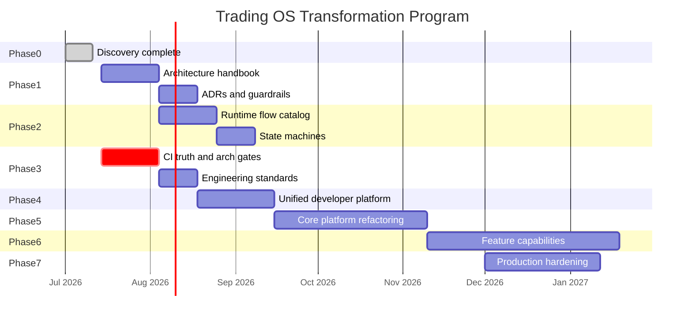
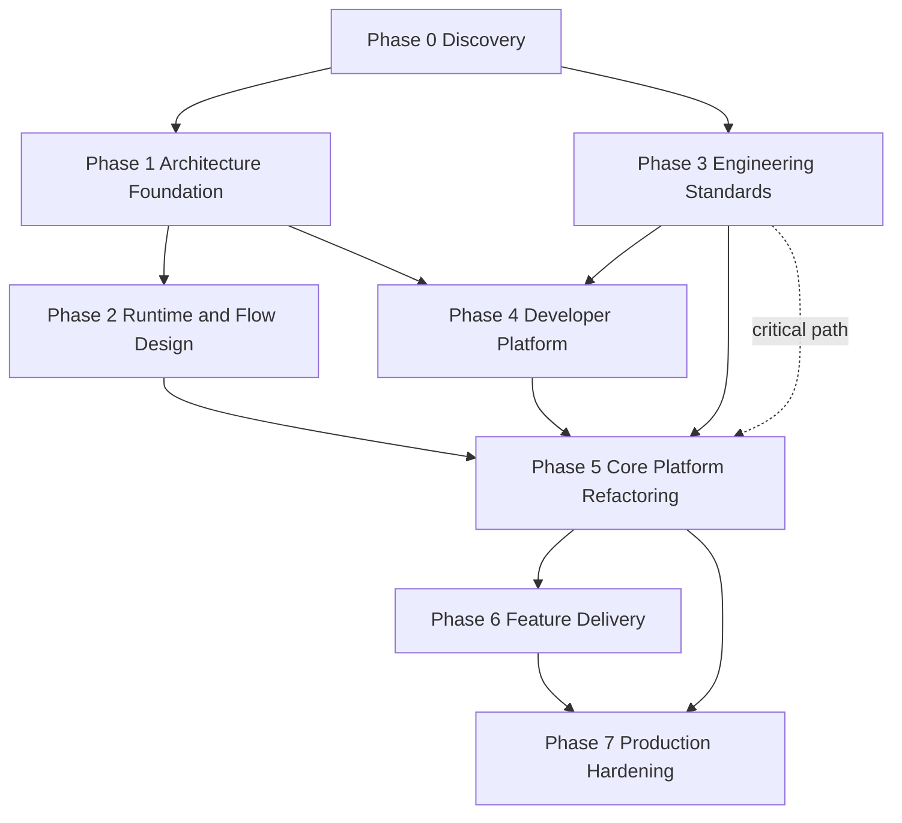

# Trading OS Transformation Program

**Program owner:** Chief Architect / Principal Engineer  
**Baseline:** commit `8f825b5d`, branch `refactor/structural-cleanup`  
**Inputs:** [2026-07-11 architecture audit](../2026-07-11-trading-os-architecture-audit/README.md), ADR-012–014, `RUNTIME_KERNEL.md`  
**Status:** Phase 0 complete · Phase 1 in progress · Phase 3 CI truth partially executed

See [PHASE-STATUS.md](./PHASE-STATUS.md) for live execution log.

---

## Mission

Evolve Trade_XV2 from a research-capable trading framework into an **institutional-grade Trading Operating System** that is:

| Property | Meaning |
|----------|---------|
| Domain-Driven | Bounded contexts with explicit ownership and ubiquitous language |
| Object-Oriented | Rich aggregates (Order, Execution, Position, Subscription, BrokerSession) |
| Event-Driven | Commands mutate state; domain events are facts; integration at boundaries |
| Broker-agnostic | Plugins via `tradex.brokers` entry points + wire adapters |
| Exchange-agnostic | Segment/security mapping behind registries, not domain imports |
| Plugin-based | Add broker = plugin + certification, not OMS edits |
| Production-ready | Fail-closed semantics, truthful CI, live certification tiers |
| AI-friendly | Stable contracts, doctor/verify/certify surfaces, architecture tests |
| Highly testable | Pyramid + contract + replay fixtures from real recordings |
| Continuously deployable | Every milestone shippable; strangler migration only |

**This is not a one-time review.** It is a multi-quarter execution program with parallel workstreams, measurable milestones, and deployable increments.

---

## Executive roadmap (milestones)

**Critical path:** Phase 3 (CI truth) runs **in parallel with Phase 1** — validation truth is a prerequisite for trusting any later refactor.

### Milestone value summary

| Milestone | Business value | Engineering value | Deployable? |
|-----------|----------------|-------------------|-------------|
| M0 — Baseline | Risk visibility | Evidence-backed backlog | Yes |
| M1 — Architecture foundation | Shared language for teams/agents | Enforceable boundaries | Yes (docs only) |
| M2 — Runtime design | Operator runbooks | Flow/state contract | Yes (docs + tests) |
| M3 — Engineering standards | Release confidence | CI green = real | Yes |
| M4 — Developer platform | Faster onboarding | No ad-hoc scripts | Yes |
| M5 — Core refactor | Live safety | Single execution spine | Yes (feature flags) |
| M6 — Capabilities | Product features | Independent releases | Yes |
| M7 — Hardening | Production SLA | SLOs, chaos, security | Yes |

---

## Program structure

| Document | Purpose |
|----------|---------|
| [EXECUTION-PLAN.md](./EXECUTION-PLAN.md) | Phases 0–7: objectives, scope, tasks, acceptance, exit criteria |
| [ENGINEERING-BACKLOG.md](./ENGINEERING-BACKLOG.md) | Task IDs, dependencies, complexity, parallel lanes |
| [ARCHITECTURE-ARTIFACTS.md](./ARCHITECTURE-ARTIFACTS.md) | Domain model, package map, diagrams, ADR plan |
| [TESTING-STRATEGY.md](./TESTING-STRATEGY.md) | Pyramid, certification tiers, parity gates |
| [DEVELOPER-PLATFORM.md](./DEVELOPER-PLATFORM.md) | SDK, CLI, MCP, doctor/verify/certify |
| [RISK-REGISTER.md](./RISK-REGISTER.md) | Program risks and mitigations |
| [TEAM-OWNERSHIP.md](./TEAM-OWNERSHIP.md) | Parallel workstreams and forbidden overlaps |

---

## Dependency graph (phases)

**Rule:** No Phase 5 production refactor merges without Phase 3 CI truth on `main`.

---

## Continuous improvement loop (every phase after 0)

Each iteration ends with:
1. Updated evidence in `docs/reviews/`
2. `lint-imports` + `tests/architecture` green
3. Certification artifact (paper minimum)
4. ADR if boundary changed

---

## Parallel workstreams (team boundaries)

| Stream | Owns | Phase focus | Must not own |
|--------|------|-------------|--------------|
| **Domain & Contracts** | Aggregates, events, ports | P1, P5 ledger contracts | Broker wire |
| **Market Data** | Feeds, subscriptions, normalization | P2, P5 AUDIT-003 | Order placement |
| **OMS / Execution** | Order lifecycle, risk, fills | P2, P5 spine | Broker auth |
| **Broker Platform** | Wire adapters, certification | P4, P5 plugins | Domain types |
| **Runtime / Platform** | Composition root, event transport | P1, P5 single factory | UI presentation |
| **Integration / Release** | CI, gates, certification tiers | P3, P7 | Feature logic |
| **Quant / Research** | Scanner, strategy, backtest | P6 | OMS mutation |

Detail: [TEAM-OWNERSHIP.md](./TEAM-OWNERSHIP.md)

---

## Success criteria (program-level)

The program succeeds when:

1. **Every milestone delivers measurable value** — not "refactor for refactor's sake"
2. **System remains deployable** after each merge to `main`
3. **Teams/agents work in parallel** with clear ownership and forbidden imports
4. **Architecture evolves incrementally** — no big-bang package move
5. **Every phase has** inputs, outputs, dependencies, risks, acceptance, exit criteria
6. **A senior engineer or AI agent** can pick up any `TRANS-*` task and execute with minimal ambiguity
7. **Live certification** produces immutable artifacts linked to releases
8. **Import-linter:** 15/15 contracts pass; zero stale ignores
9. **Mode parity:** live/paper/replay/backtest share command handlers; mode diff only at I/O
10. **Adding a broker** requires plugin + certification only — zero domain/OMS edits

---

## Immediate next actions (Week 1)

| Priority | Task ID | Owner stream | Description |
|----------|---------|--------------|-------------|
| P0 | TRANS-P3-001 | Integration/Release | Repair all CI workflow paths |
| P0 | TRANS-P3-002 | Integration/Release | Fix replay verifier + parity_gate |
| P0 | TRANS-P3-003 | Integration/Release | Add `test_workflow_paths.py` |
| P1 | TRANS-P1-001 | Domain & Contracts | Publish Architecture Handbook v1 |
| P1 | TRANS-P1-002 | Domain & Contracts | Ubiquitous language glossary |
| P2 | TRANS-P3-004 | Integration/Release | Remove warn-only safety gates (ADR) |

Start Phase 1 documentation in parallel with Phase 3 CI repairs — they do not conflict.

---

## Relationship to audit backlog

Audit items `AUDIT-001` … `AUDIT-017` are **absorbed** into `TRANS-*` tasks in [ENGINEERING-BACKLOG.md](./ENGINEERING-BACKLOG.md). No duplicate tracking.

| Audit ID | Program task |
|----------|----------------|
| AUDIT-001 | TRANS-P3-001, TRANS-P3-003 |
| AUDIT-002 | TRANS-P3-002 |
| AUDIT-003 | TRANS-P5-010 |
| AUDIT-004 | TRANS-P5-011 |
| AUDIT-008 | TRANS-P5-020 |
| AUDIT-014 | TRANS-P5-030 |