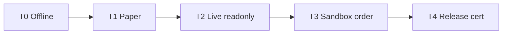

# Testing Strategy

Aligns with Phase 3 standards and Phase 7 hardening.

---

## Pyramid (current → target)

> **Methodology:** "tests" = `def test_` / `async def test_` functions (re-measured 2026-07-11
> via AST walk: `def test_`/`async def test_` definitions per layer; file count = files containing
> ≥1 such function). `pytest --collect-only` expands parametrized fixtures to **8,246 collected
> items** — that is NOT the "test function" count below.
> Totals: **7,279 test functions across 732 test files**.

| Layer | Current (functions / files) | Target | Gate |
|-------|------------------------------|--------|------|
| Unit | 4,181 / 398 | Maintain + fill gaps | Blocking CI |
| Component | 1,044 / 95 | OMS, execution, registry | Blocking CI |
| Architecture | 224 / 46 | + workflow paths, flow contracts, boundaries | Blocking CI |
| Integration | 1,335 / 148 | Env-gated live/sandbox | Tiered |
| E2E | 320 / 33 | Real spine, fewer mocks over time | Blocking subset |
| Chaos | 175 / 12 | Expand P7 | production_gate |
| Contract | broker contract tests | Per-plugin mandatory | Blocking |

**Prior discrepancy (corrected 2026-07-11):** earlier drafts stated Architecture = 469 and
Integration = ~1,600; prior measured values were 222 / 1,343. Re-measurement (AST) gives
Architecture = 224 / 46 and Integration = 1,335 / 148 (drift from newly-added tests). Unit
4,181/398, Component 1,044/95. E2E (320/33) and Chaos (175/12) confirmed unchanged.

**Collection errors: 0** (verified 2026-07-11 via `pytest --collect-only` + grep for
`error collecting`; enforced to stay 0 by the DR-T4 "Pytest collection check" step in `ci.yml`).

---

## Certification tiers

| Tier | Command | Env | CI policy |
|------|---------|-----|-----------|
| T0 | `pytest tests/unit tests/architecture` + golden fixtures | None | **Blocking** on every PR |
| T1 | `broker --broker paper verify` + `certify --json` | None | **Blocking** on `main` |
| T2 | `broker verify --live` + `@off_market_safe` | `DHAN_*` / `UPSTOX_*` | Nightly; `blocked` without secrets |
| T3 | `@sandbox` order lifecycle | `DHAN_INTEGRATION=1` | `main` push only; path-fixed |
| T4 | `production_certification.py --verbose` | Full | `release/**` only; all blocking |

**Rule:** `blocked_by_environment` ≠ `passed`. Workflow summary must show ⚠️ blocked, not ✅ pass.

---

## Architecture tests (expand in Phase 3)

| Test | Purpose | Task |
|------|---------|------|
| `test_workflow_paths.py` | CI YAML paths exist | TRANS-P3-003 |
| `test_flow_contracts.py` | Flow spec ↔ code | TRANS-P2-015 → P5 |
| `test_domain_no_broker_imports.py` | Domain independence | TRANS-P3-010 |
| `test_application_no_infra_imports.py` | App/infra separation | TRANS-P3-011 |
| `test_gateway_surface_freeze.py` | Broker port stability | Existing |
| `test_public_sdk_surface_invariants.py` | tradex API freeze | Existing |
| `test_cert_path_unity.py` | CLI/MCP/SDK same certifier | TRANS-P4-010 |

---

## Parity testing

| Marker | Meaning | When blocking |
|--------|---------|---------------|
| `paper_replay_parity` | Paper ↔ Replay OMS | Phase 5+ CI |
| `live_backtest_parity` | Live ↔ Backtest | Phase 6+ optional |
| `cross_broker_parity` | Dhan vs Upstox data shape | Phase 5 after bus fix |
| `scanner_determinism` | Scanner reproducibility | Phase 6 |

**Parity gate at boot:** `runtime/parity_gate.py` — must pass after TRANS-P3-002; `SKIP_PARITY_GATE` rejected in production config (Phase 7).

---

## Golden datasets (Phase 4)

| Dataset | Source | Use |
|---------|--------|-----|
| `fixtures/golden/dhan_ticks.jsonl` | Recorded live (anonymized) | Bus publish tests |
| `fixtures/golden/upstox_v3_tick.pb` | Recorded protobuf | Upstox decoder + bus |
| `fixtures/golden/order_lifecycle.jsonl` | Sandbox recording | Replay determinism |
| `fixtures/golden/recon_drift.json` | Synthetic **from real shapes only** | Recon economics |

**Zero-mock rule:** Parity claims use recorded real data; mocks labeled `component` tier only.

---

## Mode testing matrix

| Mode | Order path test | Market data test |
|------|-----------------|------------------|
| Live | `test_live_order_lifecycle` (gated) | `test_live_streaming` (market_hours) |
| Paper | `test_paper.py` + OMS adapter | Paper provider |
| Replay | `test_replay.py` + parity | CSV/dataframe provider |
| Backtest | `test_backtest.py` + explicit mode | Historical only |

**Default trap:** `PURE_SIM` must be `@pytest.mark.non_parity` until explicitly selected.

---

## Test ownership by lane

| Lane | Primary test dirs |
|------|-------------------|
| Domain | `tests/unit/domain/` |
| OMS | `tests/component/oms/`, `tests/e2e/test_*_flow.py` |
| Broker | `tests/unit/brokers/`, `tests/integration/brokers/` |
| Runtime | `tests/unit/runtime/`, `tests/component/runtime/` |
| Integration/Release | `tests/architecture/`, workflow tests |
| Quant | `tests/unit/analytics/`, `tests/integration/quant/` |

---

## CI quality gates (target — ADR-019)

| Gate | Blocking? | Advisory? |
|------|-----------|-----------|
| import-linter | ✅ | — |
| ruff check/format | ✅ | — |
| pyramid unit/component/arch | ✅ | — |
| coverage ≥80% | ✅ | — |
| mypy (domain + OMS core) | ✅ (now, scoped) | ERROR on clean submodules; expand to P7 |
| mypy (brokers) | — | warn until P7 (tracked) |
| bandit HIGH | ✅ | — |
| safety CVE | ✅ (Phase 7) | warn until P7 |
| paper certify | ✅ | — |
| broker doctor | — | ✅ until P4 |
| mutation | — | nightly advisory |
| live certify | blocked without secrets | — |