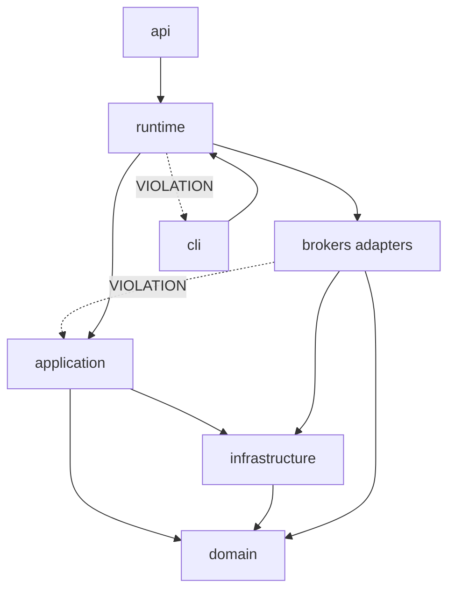

# Architecture Audit — Trade_XV2

**Agent:** architecture-reviewer  
**Date:** 2026-06-23  
**Scope:** Full repository (code-only evidence)

---

## Executive Summary

Trade_XV2 is mid-migration from a monolithic `brokers/common/*` package toward a layered hexagonal structure (`domain` → `infrastructure` → `application` → entry points). The target architecture is sound and partially enforced via import-linter and architecture tests. However, **150+ files still import `brokers.common.*` shims**, the **API runtime bootstraps through CLI-owned services**, **broker adapters import upward into `application`**, and a **stale event_bus import breaks API bootstrap**. These are structural blockers for production certification.

---

## Phase 1: Folder Structure Analysis

| Finding | Severity | Location |
|---------|----------|----------|
| Top-level reveals mixed domain + technical layers | Medium | `analytics/`, `brokers/`, `application/`, `domain/`, `infrastructure/`, `cli/`, `api/`, `runtime/`, `datalake/`, `frontend/` |
| Migration shims coexist with canonical modules | High | `brokers/common/oms/`, `brokers/common/execution/`, `brokers/common/orchestrator/` re-export `application/*` |
| Duplicate test suites at shim and canonical paths | Medium | `brokers/common/oms/tests/` (11 files) vs `application/oms/tests/` (14 files) |
| `brokers/common/` still contains 112 files including real logic | High | `brokers/common/intelligent_gateway.py` (578 lines), `gateway.py`, `resilience/` |
| Frontend is isolated bounded context | Low | `frontend/` — no Python import violations observed |

**Verdict:** Structure communicates intent but dual-path imports create shotgun-surgery risk.

---

## Phase 2: Module Boundary Assessment

| Module | Responsibility | Boundary Status |
|--------|---------------|-----------------|
| `domain/` | Entities, ports, events, enums | Clean — no upward imports in prod code |
| `infrastructure/` | Event bus, lifecycle, observability, state machine | Clean — no brokers/application imports |
| `application/` | OMS, execution, trading orchestration | Clean prod code; test ignores for broker imports |
| `brokers/*` | External adapters | **Leaks** — imports `application.oms` in prod |
| `runtime/` | Composition root | **Leaks** — imports `cli.services.broker_service` |
| `cli/` | Composition + TUI | Owns BrokerService — should not be depended on by runtime |
| `analytics/` | Backtest, replay, scanner | Isolated from brokers (import-linter enforced) |
| `datalake/` | Data storage/gateway | Isolated from cli (import-linter enforced) |

---

## Phase 3: Dependency Direction Verification

### Enforced (passing import-linter)

- `domain` must not import brokers/application/infrastructure/cli/api
- `infrastructure` must not import brokers/application
- `application` must not import brokers (prod; test ignores listed)
- `analytics` must not import broker adapters
- Dhan/Upstox cross-import forbidden

### Violations NOT enforced

| Violation | Severity | Evidence |
|-----------|----------|----------|
| Brokers import application layer | Critical | `brokers/paper/paper_gateway.py:25-26`, `brokers/dhan/connection.py`, `brokers/upstox/factory.py:18,33`, `brokers/upstox/broker.py:237` |
| Runtime imports CLI | High | `runtime/trading_runtime_factory.py:78,94` → `cli.services.broker_service.BrokerService` |
| Stale event_bus path in runtime | Critical | `runtime/trading_runtime_factory.py:77` → `brokers.common.event_bus.factory` (module deleted; canonical: `infrastructure/event_bus/factory.py`) |
| Domain port doc references infrastructure | Low | `domain/ports/event_publisher.py:19` — docstring example imports `infrastructure.event_bus.DomainEvent` (not runtime violation) |
| No import-linter contract for `runtime` or `api` layers | Medium | `.import-linter.ini` — no `[importlinter:contract:runtime-independence]` |

---

## Phase 4: Shared Library Evaluation

| Library | Location | Status |
|---------|----------|--------|
| Event bus | `infrastructure/event_bus/` (canonical) | Stable; shims removed from brokers/common |
| Lifecycle | `infrastructure/lifecycle/` | Shim at `brokers/common/lifecycle/` |
| Observability | `infrastructure/observability/` | Shims at `brokers/common/observability/` |
| Resilience (CB, retry) | `brokers/common/resilience/` | **Not migrated** — still in brokers.common |
| Gateway abstraction | `brokers/common/gateway.py` | **Not migrated** — 296+ lines, central coupling hub |
| Intelligent gateway | `brokers/common/intelligent_gateway.py` | 578 lines — multi-broker failover |

**Risk:** Shared resilience and gateway code lives in `brokers.common` rather than `infrastructure`, violating intended dependency direction.

---

## Phase 5: Duplicate Functionality Audit

| Concept | Canonical | Duplicate/Shim |
|---------|-----------|----------------|
| OMS | `application/oms/` | `brokers/common/oms/__init__.py` (re-export) |
| Execution | `application/execution/` | `brokers/common/execution/__init__.py` |
| Orchestrator | `application/trading/` | `brokers/common/orchestrator/__init__.py` |
| Event log | `infrastructure/event_log.py` | `brokers/common/event_log.py` (shim) |
| State machine | `infrastructure/state_machine.py` | `brokers/common/state_machine.py` (shim) |
| Correlation | `infrastructure/correlation.py` | `brokers/common/correlation.py` (shim) |
| OMS tests | `application/oms/tests/` | `brokers/common/oms/tests/` (mirror) |
| Execution tests | `application/execution/tests/` | `brokers/common/execution/tests/` (mirror) |

---

## Phase 6: Module Ownership Audit

- No `CODEOWNERS` file found at repository root
- `application/oms/order_manager.py` documents orchestration contract (verified by `tests/architecture/test_deepening_enforcement.py:50-53`)
- Single-writer invariant documented in `application/oms/context.py:54-58` but not enforced at runtime

---

## Phase 7: Configuration & Environment Separation

| Aspect | Status | Location |
|--------|--------|----------|
| Env loading | Centralized | `brokers/common/env_loader.py`, `brokers/common/settings.py` |
| Broker-specific config | Separated | `brokers/dhan/settings.py`, `brokers/upstox/auth/config.py` |
| Production config | Dedicated module | `runtime/production_config.py` |
| Feature flags via env | Present | `ENABLE_INTELLIGENT_GATEWAY`, `ORCHESTRATOR_DRY_RUN`, `TRADEX_SKIP_STARTUP_RECONCILIATION` |

---

## Phase 8: Proposed Clean Structure

```
Trade_XV2/
├── domain/           # Entities, ports, events — zero external deps
├── infrastructure/   # Event bus, lifecycle, observability, resilience, persistence
├── application/      # OMS, execution, trading — depends on domain + infrastructure
├── brokers/          # Pure adapters implementing domain ports — NO application imports
├── runtime/          # Neutral composition root — NO cli imports
├── api/              # HTTP interface — depends on runtime/application
├── cli/              # CLI/TUI — depends on runtime/application
├── analytics/        # Backtest, replay, scanner — depends on domain + application ports
├── datalake/         # Data layer
└── frontend/         # UI
```

**Key rule:** `brokers/*` must depend only on `domain` + `infrastructure`. Composition happens exclusively in `runtime/`.

---

## Phase 9: Migration Plan

| Step | Action | Effort |
|------|--------|--------|
| M1 | Fix `runtime/trading_runtime_factory.py:77` → `infrastructure.event_bus.factory` | 1h |
| M2 | Extract neutral `runtime/composition.py` from `cli/services/broker_service.py` | 2d |
| M3 | Remove broker→application imports; inject OMS via ports/DI at composition root | 3d |
| M4 | Migrate `brokers/common/resilience/` → `infrastructure/resilience/` | 2d |
| M5 | Migrate `brokers/common/gateway.py` → `infrastructure/gateway/` or keep as broker port impl | 2d |
| M6 | Delete shim re-exports; run `scripts/migrate_shim_imports.py` | 1d |
| M7 | Consolidate duplicate test suites | 1d |
| M8 | Add import-linter contracts for `runtime` and `api` | 4h |

---

## Dependency Graph



---

## Top Findings (for downstream agents)

1. **Critical** — `runtime/trading_runtime_factory.py:77` imports deleted `brokers.common.event_bus.factory`
2. **Critical** — Broker adapters import `application.oms` directly (`brokers/paper/paper_gateway.py:25-26`)
3. **High** — API bootstrap depends on CLI `BrokerService` (`runtime/trading_runtime_factory.py:78,94`)
4. **High** — 150+ files still use `brokers.common.*` shim paths
5. **High** — `OrderManager` (631 lines) + `TradingContext` (516 lines) are monolithic state hubs

---

## Remediation Roadmap Priority

| ID | Fix | Severity | Files |
|----|-----|----------|-------|
| AR-1 | Fix stale event_bus import | Critical | `runtime/trading_runtime_factory.py:77` |
| AR-2 | Neutral composition root (decouple runtime from cli) | High | `runtime/`, `cli/services/broker_service.py` |
| AR-3 | Invert broker→application dependency | Critical | `brokers/paper/`, `brokers/dhan/`, `brokers/upstox/` |
| AR-4 | Complete shim migration | High | `brokers/common/*` shims |
| AR-5 | Add runtime/api import-linter contracts | Medium | `.import-linter.ini` |
| AR-6 | Decompose OrderManager/TradingContext | Medium | `application/oms/` |

**Architecture Score (internal): 5/10** — Sound target design, incomplete migration, enforced boundaries have gaps.
