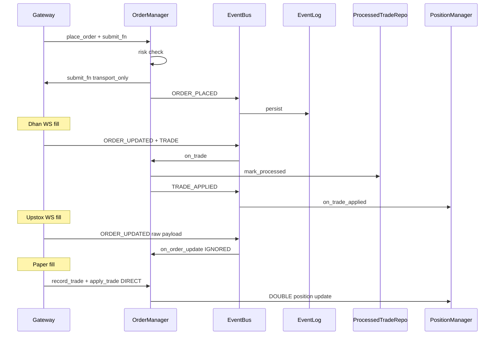

# EDA Audit — Trade_XV2

**Agent:** eda-auditor  
**Date:** 2026-06-23  
**Context from Architecture:** Stale event_bus import (AR-1), broker→application leaks (AR-3), monolithic OMS hubs (AR-5)

---

## Executive Summary

The event-driven architecture has a well-designed core: immutable `DomainEvent`, persist-then-dispatch in `EventBus`, `TRADE_APPLIED` gating for position updates, and `ProcessedTradeRepository` for trade deduplication. However, **broker adapters violate event contracts** (Upstox raw payloads, Dhan cumulative fill quantities), **paper trading double-applies positions**, and **processed trade ledger is not persisted on default CLI path** — creating silent state corruption on restart and live trading paths.

---

## Phase 1: Event Model Integrity

| Check | Status | Evidence |
|-------|--------|----------|
| Events are immutable value objects | Pass | `infrastructure/event_bus/event_bus.py:43-59` — `@dataclass(frozen=True) DomainEvent` |
| Past-tense naming | Pass | `domain/events/types.py` — `ORDER_PLACED`, `TRADE_APPLIED`, etc. |
| Canonical payload contracts | Partial | `domain/events/types.py` defines types; runtime validation is opt-in |
| Sequence numbers for replay ordering | Pass | `DomainEvent.sequence_number` at `event_bus.py:59` |

| Finding | Severity | Location |
|---------|----------|----------|
| Upstox WS publishes non-canonical ORDER_UPDATED payload | Critical | `brokers/upstox/websocket/portfolio_stream.py:134-138` — `{"update_type", "payload": raw_dict}` not `{"order": Order}` |
| Upstox adapter publishes ORDER_PLACED independently of OMS | High | `brokers/upstox/orders/order_command_adapter.py:247-254` — duplicate event when OMS path used |
| Stringly-typed event_type field | Medium | `DomainEvent.event_type: str` — no compile-time enforcement |

---

## Phase 2: State Mutation Analysis

### Canonical mutation path

```
ORDER_UPDATED → OrderManager.on_order_update → upsert_order
TRADE → OrderManager.on_trade → record_trade → TRADE_APPLIED → PositionManager.on_trade_applied
```

Wiring: `application/oms/context.py:169-177`

| Finding | Severity | Location |
|---------|----------|----------|
| Paper broker bypasses TRADE_APPLIED-only contract | Critical | `brokers/paper/paper_orders.py:189-191` — calls `record_trade()` AND `position_manager.apply_trade()` directly |
| Paper gateway constructs full OMS inside adapter | Critical | `brokers/paper/paper_gateway.py:25-26` — imports `TradingContext`, `RiskConfig` |
| Broker publishes events outside OMS handler chain | High | Upstox `order_command_adapter.py:247-254`, Dhan WS `websocket.py:986-1007` |
| OMS state mutated via direct method calls from brokers | Critical | `brokers/paper/paper_orders.py:189-191` |

---

## Phase 3: Idempotency and Deduplication

### Present mechanisms

| Layer | Mechanism | Location |
|-------|-----------|----------|
| Order placement | `correlation_id` + `_pending_correlation` | `application/oms/order_manager.py:250-257` |
| Trade processing | `ProcessedTradeRepository` keyed by `TradeIdKey` | `infrastructure/event_bus/processed_trade_repository.py` |
| Unknown-order retry | Returns False without marking ledger | `application/oms/order_manager.py:426-434` |
| Event persistence | Append-before-dispatch | `infrastructure/event_bus/event_bus.py:328-332` |
| Crash recovery replay | EventLog → OMS handlers | `application/oms/context.py:492-516` |
| Re-entrancy guard | `_ReentrancyGuard` on handlers | `application/oms/order_manager.py:568-594` |

### Missing or weak

| Finding | Severity | Location |
|---------|----------|----------|
| Processed trade ledger defaults to in-memory | Critical | `application/oms/context.py:71-73` — "When omitted, an in-memory ledger is created (lost on restart)" |
| CLI oms_setup does not pass persistence path | Critical | `cli/services/oms_setup.py:150-157` — no `processed_trade_repository` persistence |
| 24h in-memory eviction window | High | `domain/constants/__init__.py` — `PROCESSED_TRADE_RETENTION_SECONDS = 86400` |
| Broker idempotency caches in-memory only | High | `brokers/dhan/orders.py:226-229`, `brokers/upstox/orders/order_command_adapter.py:56-59` |
| attach_lifecycle stops trade cleanup at attach, not shutdown | Medium | `application/oms/context.py:218-220` — `stop_auto_cleanup()` called in attach, not as shutdown hook |

---

## Phase 4: Event Boundary Compliance

| Finding | Severity | Location |
|---------|----------|----------|
| Dhan WS sends cumulative fill qty as incremental trade | Critical | `brokers/dhan/websocket.py:991-1001` — `quantity=filled` where `filled` is cumulative `filled_quantity` |
| Upstox live fill path produces no TRADE events | Critical | Grep: zero `TRADE` publishes under `brokers/upstox/` |
| Upstox ORDER_UPDATED silently ignored by OMS | Critical | `application/oms/order_manager.py:578-580` requires `isinstance(order, Order)`; Upstox sends raw dict |
| Analytics replay shares EventBus with live OMS | Medium | `analytics/replay/orchestrator.py` imports event infrastructure |

---

## Phase 5: Async Message Handler Failure Modes

| Mechanism | Status | Location |
|-----------|--------|----------|
| Handler failures → DLQ | Pass | `infrastructure/event_bus/event_bus.py:11-17` |
| Handler failures logged + metrics | Pass | `event_bus.py:328-332` |
| DLQ monitor on lifecycle | Pass | `application/oms/context.py:480-490` |
| AsyncEventBus migration path | Partial | `infrastructure/event_bus/async_event_bus.py`, factory at `infrastructure/event_bus/factory.py` |
| Stale AsyncEventBusFactory import in runtime | Critical | `runtime/trading_runtime_factory.py:77` — broken bootstrap path |

---

## Phase 6: Event Sourcing Consistency

| Aspect | Status | Evidence |
|--------|--------|----------|
| EventLog append-only | Pass | `infrastructure/event_log.py` |
| Replay disables re-logging | Pass | `application/oms/context.py:505-506` — `_logging_enabled = False` during replay |
| Replay replays TRADE into on_trade | Risk | `context.py:511-512` — if ledger empty after restart, trades re-applied |
| Sequence number ordering | Pass | `DomainEvent.sequence_number` |

---

## Phase 7: Event Store Reliability

| Finding | Severity | Location |
|---------|----------|----------|
| EventLog wired on CLI path | Pass | `cli/services/oms_setup.py:146-156` |
| ProcessedTradeRepository not persisted alongside EventLog | Critical | `cli/services/oms_setup.py:150-157` |
| Single-writer invariant documented but not enforced | High | `application/oms/context.py:54-58` |
| SQLite OMS store + in-memory ledger mismatch on restart | Critical | Combined effect of above |

---

## Event Flow Diagram



---

## Top Findings (for downstream agents)

1. **Critical** — Dhan cumulative fill qty as incremental trade (`brokers/dhan/websocket.py:991-1001`)
2. **Critical** — Upstox WS incompatible with OMS + no TRADE events (`brokers/upstox/websocket/portfolio_stream.py:127-138`)
3. **Critical** — Paper double-applies positions (`brokers/paper/paper_orders.py:189-191`)
4. **Critical** — Processed trade ledger not persisted on CLI path (`cli/services/oms_setup.py:150-157`)
5. **High** — Upstox duplicate ORDER_PLACED outside OMS (`brokers/upstox/orders/order_command_adapter.py:247-254`)

**EDA Score (internal): 4/10** — Core design sound; broker boundary violations cause silent state corruption on live paths.
