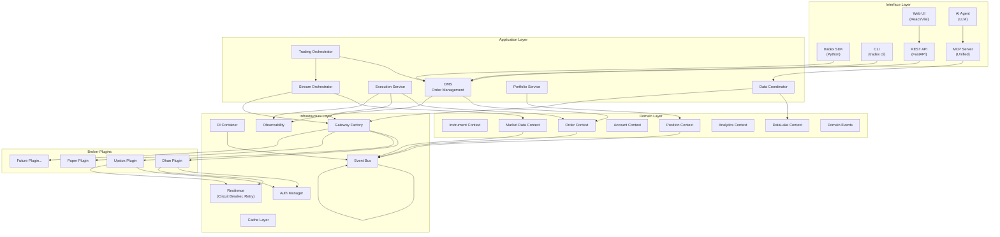
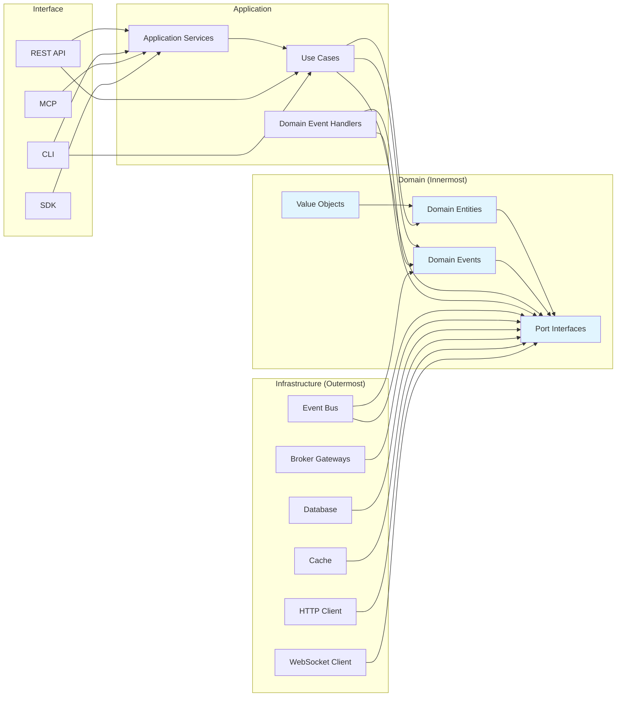
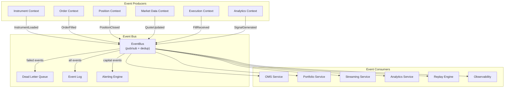
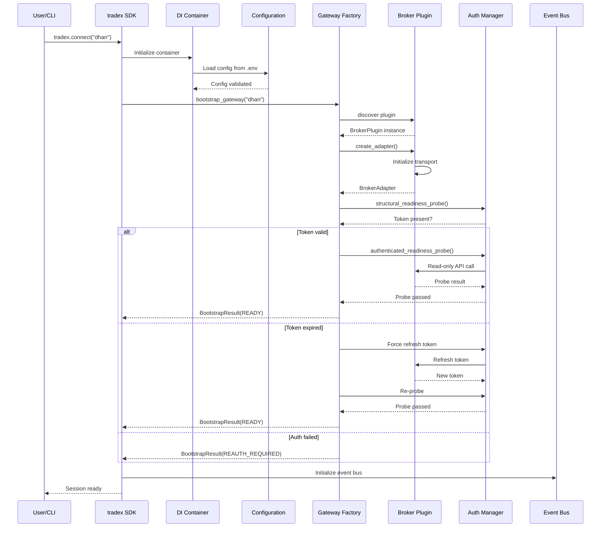
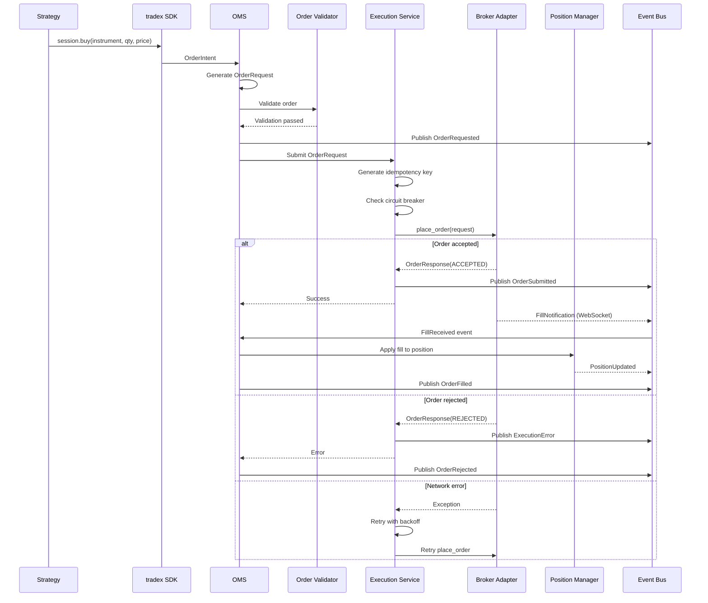
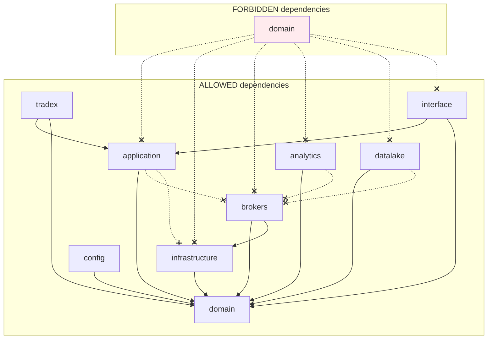
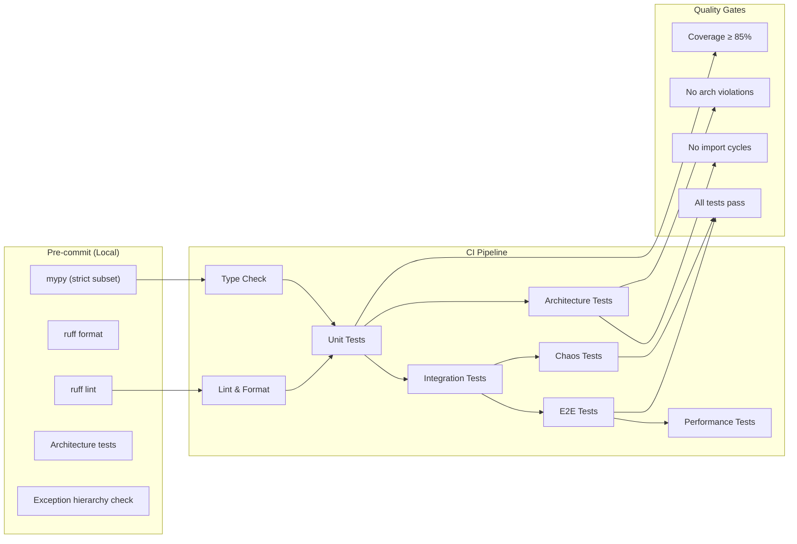

# Architecture Diagrams — TradeXV2 Trading OS

## 1. High-Level Architecture

## 2. Dependency Flow (Hexagonal Architecture)

**Dependency Rule:** Arrows point inward only. Domain never imports Application, Infrastructure, or Interface.

## 3. Broker Plugin Architecture

```mermaid
graph TB
    subgraph "Broker Plugin System"
        REG["Plugin Registry<br/>(entry_points)"]
        
        subgraph "Dhan Plugin"
            DH_CORE["DhanBrokerPlugin"]
            DH_AUTH["DhanAuth"]
            DH_DATA["DhanDataProvider"]
            DH_EXEC["DhanExecutionProvider"]
            DH_STREAM["DhanStreamManager"]
        end
        
        subgraph "Upstox Plugin"
            UP_CORE["UpstoxBrokerPlugin"]
            UP_AUTH["UpstoxAuth"]
            UP_DATA["UpstoxDataProvider"]
            UP_EXEC["UpstoxExecutionProvider"]
            UP_STREAM["UpstoxStreamManager"]
        end
        
        subgraph "Paper Plugin"
            PA_CORE["PaperBrokerPlugin"]
            PA_DATA["PaperDataProvider"]
            PA_EXEC["PaperExecutionProvider"]
        end
    end
    
    subgraph "Common Contracts"
        BA["BrokerAdapter Protocol"]
        DP["DataProvider Protocol"]
        EP["ExecutionProvider Protocol"]
        LIFECYCLE["Lifecycle Hooks"]
    end
    
    REG --> DH_CORE
    REG --> UP_CORE
    REG --> PA_CORE
    
    DH_CORE --> BA
    DH_DATA --> DP
    DH_EXEC --> EP
    DH_CORE --> LIFECYCLE
    
    UP_CORE --> BA
    UP_DATA --> DP
    UP_EXEC --> EP
    UP_CORE --> LIFECYCLE
    
    PA_CORE --> BA
    PA_DATA --> DP
    PA_EXEC --> EP
    PA_CORE --> LIFECYCLE
```

## 4. Event Flow Architecture

## 5. Startup Flow

## 6. Order Lifecycle Flow

## 7. Package Dependency Rules

**Import Linter Rules:**
1. `domain` never imports `application`, `infrastructure`, `brokers`, `analytics`, `datalake`, `interface`, `tradex`
2. `application` never imports `infrastructure`, `brokers`
3. `analytics` never imports `brokers`
4. `datalake` never imports `brokers`
5. `brokers` never imports `application`, `tradex`
6. All cross-context communication goes through ports and events

## 8. CI Pipeline Architecture

