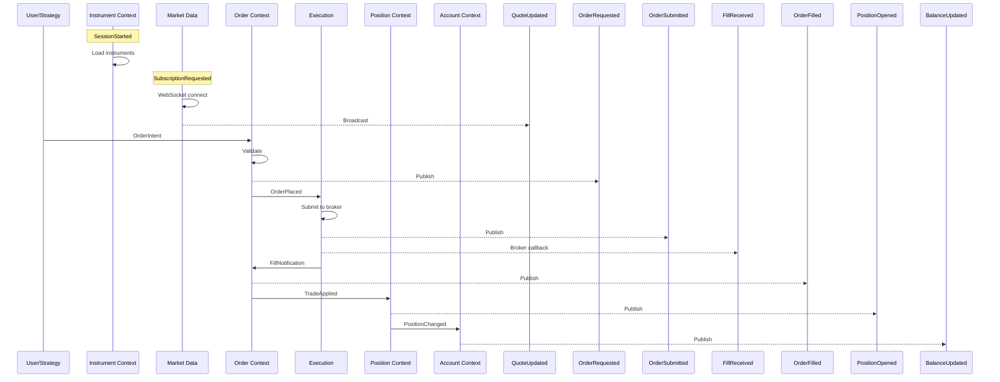
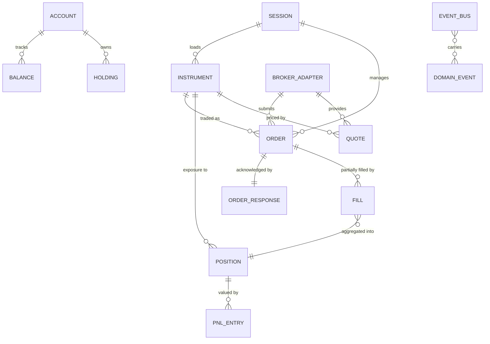

# Domain Model — TradeXV2 Trading OS

## Bounded Contexts

### 1. Instrument Context

**Responsibility:** Managing the lifecycle, metadata, and resolution of all tradeable instruments.

**Aggregate Root:** `Instrument` (with subtypes: Equity, ETF, Spot, Currency, Index, Future, Commodity, Option)

**Key Value Objects:**
- `InstrumentId` — Composite key (symbol + exchange)
- `AssetKind` — Enumeration of asset types
- `ExchangeSegment` — Market segment (NSE_EQ, NSE_FO, BSE_EQ, MCX_FO)

**Invariants:**
- Symbol + Exchange must be unique
- lot_size > 0
- tick_size > 0
- Option instruments must have strike, expiry, and right

**Published Events:**
- `InstrumentLoaded` — When instruments are loaded from broker
- `InstrumentRefreshed` — When instrument data is updated
- `InstrumentResolutionFailed` — When symbol cannot be resolved

**Consumed Events:**
- `SessionStarted` — Trigger instrument loading
- `MarketDataUpdated` — Update instrument LTP

---

### 2. Order Context

**Responsibility:** Managing order lifecycle from intent to settlement.

**Aggregate Root:** `Order`

**Key Value Objects:**
- `OrderIntent` — High-level trading intent
- `OrderRequest` — Validated order ready for submission
- `OrderResponse` — Broker acknowledgment
- `OrderStatus` — State enum (CREATED, VALIDATED, SUBMITTED, ACCEPTED, PARTIAL_FILL, FILLED, CANCELLED, REJECTED, CLOSED)

**Invariants:**
- Order follows state machine (no invalid transitions)
- quantity > 0
- price >= 0 (for limit orders)
- One order per correlation_id (idempotency)

**State Machine:**
```
CREATED → VALIDATED → SUBMITTED → ACCEPTED → FILLED → CLOSED
                                    ↓           ↓
                              PARTIAL_FILL   CANCELLED → CLOSED
                                    ↓
                              CANCELLED → CLOSED
```

**Published Events:**
- `OrderRequested` — When intent is submitted to OMS
- `OrderPlaced` — When order is sent to broker
- `OrderFilled` — When order is fully filled
- `OrderCancelled` — When order is cancelled
- `OrderRejected` — When broker rejects order

**Consumed Events:**
- `QuoteUpdated` — For market orders, triggers fill estimation
- `SessionStarted` — For order recovery

---

### 3. Position Context

**Responsibility:** Tracking market exposure from fills.

**Aggregate Root:** `Position`

**Key Value Objects:**
- `PositionSide` — LONG, SHORT, FLAT
- `AveragePrice` — Volume-weighted average price
- `UnrealizedPnL` — Mark-to-market profit/loss

**Invariants:**
- Position quantity = sum(fill quantities) - sum(close quantities)
- Position is FLAT when quantity = 0
- Average price is recalculated on every fill

**Published Events:**
- `PositionOpened` — When first fill creates exposure
- `PositionUpdated` — When fill changes exposure
- `PositionClosed` — When position returns to FLAT

**Consumed Events:**
- `TradeApplied` — Fill applied to position
- `QuoteUpdated` — For mark-to-market valuation

---

### 4. Account Context

**Responsibility:** Managing account balance, holdings, and margin.

**Aggregate Root:** `Account`

**Key Value Objects:**
- `Balance` — Available margin, used margin, cash
- `Holding` — Long-term equity holdings

**Invariants:**
- Available margin >= 0
- Used margin + available margin = total margin
- Holdings are non-negative

**Published Events:**
- `BalanceUpdated` — When margin changes
- `HoldingChanged` — When holdings change

**Consumed Events:**
- `OrderFilled` — Deduct/add margin
- `SessionStarted` — Refresh balance from broker

---

### 5. Market Data Context

**Responsibility:** Receiving, parsing, and distributing real-time market data.

**Key Concepts:**
- `QuoteSnapshot` — Point-in-time bid/ask/last
- `MarketDepth` — Order book levels
- `HistoricalBar` — OHLCV candle
- `Tick` — Raw tick data

**Invariants:**
- Quotes are monotonically timestamped per instrument
- Depth levels are sorted by price
- Historical bars are non-overlapping

**Published Events:**
- `QuoteUpdated` — New quote received
- `DepthUpdated` — New depth snapshot
- `TickReceived` — Raw tick from WebSocket

**Consumed Events:**
- `SubscriptionRequested` — Start receiving data
- `SubscriptionCancelled` — Stop receiving data

---

### 6. Execution Context

**Responsibility:** Translating order requests into broker API calls and tracking results.

**Key Concepts:**
- `BrokerTransport` — HTTP/WebSocket connection to broker
- `OrderSubmission` — Wire-format order payload
- `FillNotification` — Broker fill callback

**Invariants:**
- Every submission must be idempotent (idempotency key)
- Every submission must be retried on transient failure
- Circuit breaker opens after N consecutive failures

**Published Events:**
- `OrderSubmitted` — Confirmed submission to broker
- `FillReceived` — Fill notification from broker
- `ExecutionError` — Broker error during execution

**Consumed Events:**
- `OrderPlaced` — Trigger broker submission

---

### 7. Analytics Context

**Responsibility:** Computing derived market intelligence.

**Key Concepts:**
- `Indicator` — Technical indicator (RSI, MACD, ATR, VWAP, etc.)
- `Scanner` — Pattern/rule scanner
- `Strategy` — Trading strategy with signals
- `Feature` — Computed feature for ML/quant

**Invariants:**
- Indicators are computed from historical bars
- Scanner results are score-ranked
- Strategy signals are deterministic for same input

**Published Events:**
- `SignalGenerated` — Strategy produces a signal
- `ScanCompleted` — Scanner finishes a scan

**Consumed Events:**
- `HistoricalDataLoaded` — Trigger indicator computation
- `QuoteUpdated` — Trigger real-time indicator update

---

### 8. DataLake Context

**Responsibility:** Persistent storage, quality monitoring, and research data access.

**Key Concepts:**
- `DuckDBCatalog` — DuckDB-based data catalog
- `ParquetStore` — Parquet file storage
- `DataQuality` — Data validation and monitoring
- `ResearchDataset` — Pre-computed datasets for analysis

**Invariants:**
- Data is immutable once written
- Quality checks run on ingestion
- All queries go through the catalog interface

**Published Events:**
- `DataIngested` — New data available
- `DataQualityAlert` — Quality check failure

**Consumed Events:**
- `HistoricalDataRequested` — Serve data from lake
- `InstrumentLoaded` — Update instrument catalog

---

## Cross-Context Event Flow



---

## Aggregate Relationship Map


