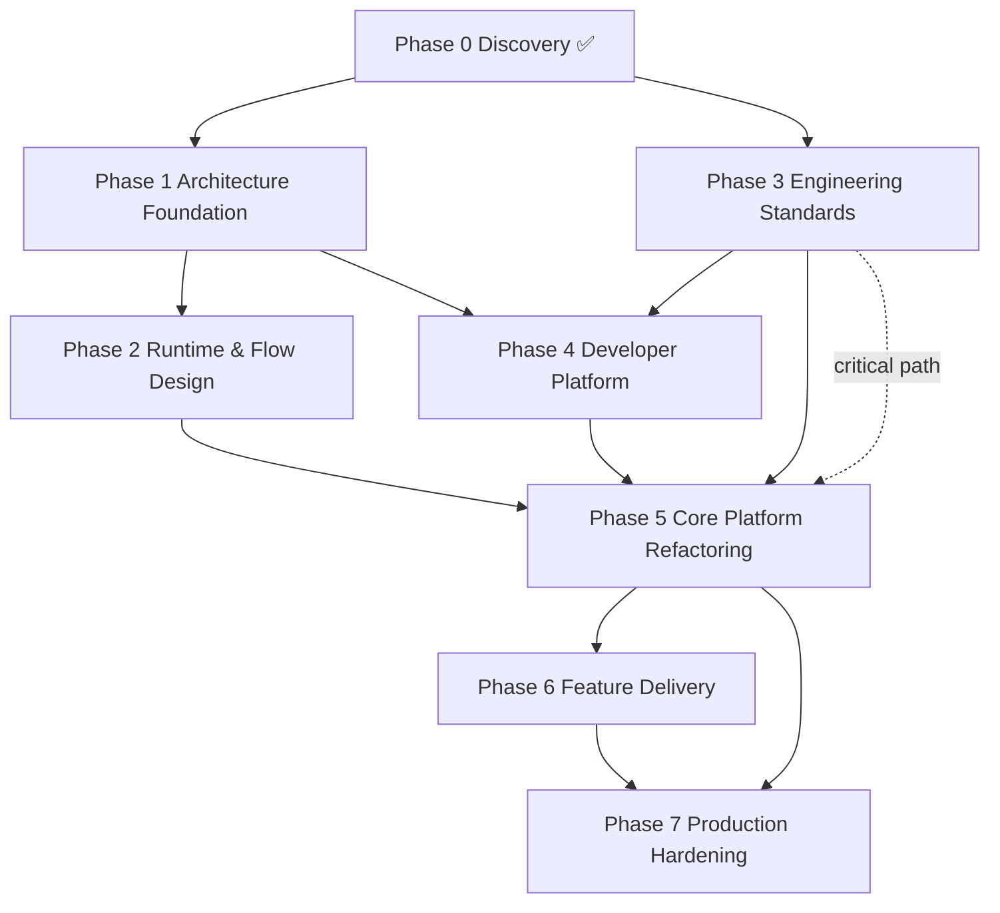

# Execution Roadmap — Trade_XV2 → Trading OS
**Baseline:** `8f825b5d` (`refactor/structural-cleanup`) · **Date:** 2026-07-11
**Companion doc:** [`DEEP-REVIEW-2026-07-11.md`](./DEEP-REVIEW-2026-07-11.md) (evidence, findings register `DR-*`, reconciliation).
**Source of truth for deep task lists:** `docs/reviews/2026-07-11-trading-os-transformation-program/` (`EXECUTION-PLAN.md`, `ENGINEERING-BACKLOG.md` of `TRANS-*` tasks, `ARCHITECTURE-ARTIFACTS.md`, `TESTING-STRATEGY.md`, `DEVELOPER-PLATFORM.md`, `RISK-REGISTER.md`, `TEAM-OWNERSHIP.md`, `PHASE-STATUS.md`). ADRs 012–019 in `docs/architecture/adrs/`.

> **This roadmap does not reinvent the program.** It (a) restates the phase structure in the requested format, (b) folds in the evidence-driven findings from the Deep Review, and (c) adds the gap tasks the program under-addresses (§5 of the review). Where a phase is already fully specified in the program, this doc links rather than duplicates, and concentrates new detail on the gaps.

---

> ## ⚠️ Live status note (code-verified 2026-07-11)
> Baseline `8f825b5d` (`refactor/structural-cleanup`). Full matrix in **§9**.
> - **P0 complete.** **P1–P3 largely complete as docs/gates**, with caveats: VO *adoption* open (DR-D1/D2), dual ports open (DR-B5/B6), import-linter **14/15** (1 broken).
> - **P4 & P5 in progress.** **P6 & P7 blocked** (P6 on P5; P7 on P6).
> - **Done:** DR-T1/T2/T4, DR-B1/B2/B3, DR-F2–F5, DR-E3, DR-I2; mypy clean-subset gate (DR-T3 partial).
> - **Partial:** DR-D1/D2, DR-I1, DR-I6/DR-B4, DR-A6, DR-E2, DR-T3.
> - **Pending:** DR-I3 (encryption still optional), DR-A4 (lake stubs), DR-A1/A3/A7, DR-B5/B6, P5 spine (010/011), P6/P7.
> - **Test debt:** `test_extended_order_service_registry::test_executor_resolves_via_registry` fails (stale type vs `OrderCapabilityPort`).

---

## 1. Executive summary

The system is a **research-grade, Clean-Architecture trading framework** with a real event bus, a landed broker kernel, and production-grade replay/backtest engines. Layered contracts are **mostly** enforced (import-linter **14 kept / 1 broken** as of this verification — not 15/15). It is **not yet an institutional Trading OS.**

**Remaining blockers:** execution spine + concurrency (DR-E2 partial; P5-010/011 open), composition purity incomplete (DR-I6/B4 partial), VO adoption incomplete (DR-D1/D2), options/futures lake stubs (DR-A4), optional token encryption (DR-I3), and **all of P6/P7** (blocked on P5).

**Resolved this wave (verified in code):** CI truthfulness foundations (DR-T1/T2/T4 + partial T3), OMS broker-agnosticism (DR-B1/B2/B3), `/ready` + agent/web/TS-SDK (DR-F2–F5), typed `PortfolioContext` (DR-E3), EventBus idempotency via `IdempotencyService` (DR-I2). See §9 for partials and evidence.

Every phase below is **deployable** and produces measurable value. The **critical path** is: *truthful baseline (P0/P3) → architecture foundation (P1) → runtime design (P2) → developer platform (P4) → core refactor (P5) → capabilities (P6) → hardening (P7)*.

### Milestone value table

| Milestone | Business value | Engineering value | Deployable |
|---|---|---|---|
| M0 Baseline | Risk visibility | Evidence-backed backlog | Yes |
| M1 Architecture foundation | Shared language | Enforceable boundaries | Yes (docs) |
| M2 Runtime design | Operator runbooks | Flow/state contract | Yes (docs+tests) |
| M3 Engineering standards | Release confidence | **CI green = real** | Yes |
| M4 Developer platform | Faster onboarding | No ad-hoc scripts | Yes |
| M5 Core refactor | **Live safety** | Single execution spine | Yes (flags) |
| M6 Capabilities | Product features | Independent releases | Yes |
| M7 Hardening | Production SLA | SLOs, chaos, security | Yes |

---

## 2. Dependency graph



**Hard rule (program):** No P5 production refactor merges to `main` without P3 CI-truth on `main`.

---

## 3. Phase-by-phase execution plan

Each phase: **Objective · Why · Scope · Deliverables · Tasks · Risks · Exit Criteria**. Task fields: ID · Description · Deps · Output · Complexity (S/M/L/XL) · Risks · Acceptance.

### PHASE 0 — Discovery & Baseline ✅ (complete; this review updates it)
- **Objective:** Establish an evidence-backed current-state baseline.
- **Why:** Without a verified baseline, refactors are guesses.
- **Scope:** Whole repo; architecture, dependency graph, ownership, tests, APIs, tech-debt, risk.
- **Deliverables (existing + this review):** current-state architecture, repo/dependency map, engineering backlog, **and** [`DEEP-REVIEW-2026-07-11.md`](./DEEP-REVIEW-2026-07-11.md) (findings register `DR-*`, reconciliation, gap list §5).
- **Tasks:** See `EXECUTION-PLAN.md` Phase 0. **New from review:** `DR-T1` correct `TESTING-STRATEGY.md` counts **✅ DONE 2026-07-11** (counts corrected); `DR-I6` confirm multiple composition roots **✅ DONE 2026-07-11** (single `runtime.factory.build` root; UI/session concrete-broker imports removed + import-linter contract); `DR-B1/DR-D1/DR-D2` verified by source (DR-B1/D1/D2 resolved 2026-07-11; see §9).
- **Risks:** Doc drift (mitigated: verify claims by reading code — done here).
- **Exit criteria:** Baseline approved; backlog seeded with `TRANS-*` + `DR-*`; architecture maps drawn.

---

### PHASE 1 — Architecture Foundation ✅ (complete per PHASE-STATUS.md, Iteration 7)
- **Objective:** Define and ratify the target architecture, ubiquitous language, DDD bounded contexts, package structure, dependency rules, event model, object model, extension model, public SDK.
- **Why:** Parallel teams/agents need shared contracts before code.
- **Scope:** `domain`, `application`, `infrastructure`, `brokers`, `interface`, `config`, `runtime`; ADRs; glossary; package tree; event catalog.
- **Deliverables:** Architecture Handbook, Mermaid diagrams, ADRs 012–019 (+020/021 as boundaries change), glossary, object model, event catalog, plugin architecture spec, architecture guardrails (import-linter contracts), **ubiquitous-language reconciliation**.
- **Tasks:**

| ID | Description | Deps | Output | Cplx | Risks | Acceptance |
|---|---|---|---|---|---|---|
| TRANS-P1-001 | Publish Architecture Handbook v1 | P0 | `ARCHITECTURE-ARTIFACTS.md` | M | Scope creep | Handbook ratified by CA |
| TRANS-P1-002 | Ubiquitous-language glossary (resolve `DR-D3` dual `OrderIntent`, `DR-D4` `Instrument` collision) | 001 | `GLOSSARY.md` | M | Term politics | One term per concept; aliases deprecated with deadlines |
| TRANS-P1-003 | Target package tree + forbidden-imports table | 001 | package map | M | Over/under-constraint | import-linter contracts updated |
| TRANS-P1-D12 | **NEW** Promote `Money`/`Quantity`/`Clock` VOs; ban `datetime.now()` in VOs (`DR-D1`/`DR-D2`) **⚠️ PARTIAL 2026-07-11** (VOs + ClockPort created in `domain/primitives`; dual legacy `Money`; Order still Decimal/int; `datetime.now()` still in `value_objects/state.py`) | 002 | VO modules + injected `TimeService` | L | Wide call-site churn | VOs used in `Order`/`Position`/`Trade`/`Balance`; VOs pure |
| TRANS-P1-004 | Event catalog + schema/versioning policy | 001 | `EVENT_CATALOG.md` | M | Versioning debt | Every event typed + versioned |
| TRANS-P1-005 | Plugin architecture spec (single `BrokerPluginInterface` over the 5 registries, `DR-B7`) | 003 | plugin spec | M | Breaking plugins | New broker = 1 interface impl |

- **Risks:** Analysis paralysis; mitigation = time-box docs, ratify by ADR.
- **Exit criteria:** Handbook approved; ADRs 012–019 merged; import-linter 15/15 *(currently 14/15 — see §9.4)*; glossary resolves `DR-D3/D4`; VOs promoted (`TRANS-P1-D12` — *adoption still open*).

---

### PHASE 2 — Runtime & Flow Design ✅ (complete per PHASE-STATUS.md, Iteration 7)
- **Objective:** Specify how the system behaves at runtime — startup, auth, instrument lifecycle, historical/quote/subscription flows, order/position/portfolio lifecycles, replay, shutdown, recovery, error handling, state machines.
- **Why:** Operators and agents need deterministic, documented flows + the contract freeze that later refactors depend on.
- **Scope:** All runtime flows; sequence/activity diagrams; state machines; error taxonomy; **contract freeze**.
- **Deliverables:** `FLOWS.md`, `STATE_MACHINES.md`, `ERROR_TAXONOMY.md`, freeze of `BrokerAdapter`/`BrokerTransport` decision (`DR-B5`), port-signature reconciliation (`DR-B6`).
- **Tasks:**

| ID | Description | Deps | Output | Cplx | Risks | Acceptance |
|---|---|---|---|---|---|---|
| TRANS-P2-001 | Document all flows (startup→shutdown) as sequence diagrams | P1 | `FLOWS.md` | L | Coverage gaps | Every flow diagrammed + tested |
| TRANS-P2-002 | Freeze order/position/subscription state machines | 001 | state diagrams | M | Over-freeze | State transitions covered by `OrderStateValidator`/`PositionStateMachine` tests |
| TRANS-P2-003 | Error taxonomy + fail-closed default policy (`DR-E4`, datalake soft-fail) | 001 | `ERROR_TAXONOMY.md` | M | Silent failures persist | No `event_bus=None` no-op on money paths |
| TRANS-P2-004 | **NEW** Collapse dual unified port (`DR-B5`): pick `BrokerAdapter` (Protocol) as the only contract | P1-005 | ADR-020 | M | Churn in wire adapters | One unified port; other deprecated |
| TRANS-P2-005 | **NEW** Enforce the port boundary (`DR-B6`, *corrected*): the `InstrumentId`/`OrderRequest` ports are implemented by broker **adapters** and used by the domain — keep them. Route **all** core call sites through the adapter/port layer; forbid direct `(symbol, exchange)` wire-method calls from `application`/`domain`/`interface`. Replace name-only `runtime_checkable` with an integration contract test (adapter satisfies port; wire never called directly). | 004 | boundary enforcement | L | Large surface | No string-method calls from core; adapter↔port integration test green |

- **Risks:** Freezing too early blocks P5; mitigation = freeze only ports, not internals.
- **Exit criteria:** Flow/state/error docs merged; ports frozen (`TRANS-P2-004/005`); fail-closed default enforced on capital paths.

---

### PHASE 3 — Engineering Standards (critical path) ✅ (complete per PHASE-STATUS.md, Iteration 7)
- **Objective:** Make CI **truthful** and enforce engineering rules so green = real.
- **Why:** The program's success criterion "CI green = real" is currently false (DR-T2/DR-T3). This is the prerequisite for trusting any P5 refactor.
- **Scope:** CI gates, architecture tests, naming/logging/error/testing/doc standards, quality gates.
- **Deliverables:** Truthful CI, `STANDARDS.md`, `DEPENDENCY_GRAPH.md`, architecture tests extended, mutation gate decision.
- **Tasks:**

| ID | Description | Deps | Output | Cplx | Risks | Acceptance |
|---|---|---|---|---|---|---|
| TRANS-P3-001 | Repair all CI workflow paths; zero pytest collection errors (`DR-T4`) **✅ DONE 2026-07-11** (collection gate present, 0 collection errors) | P0 | green CI | M | Workflow coupling | `pytest` collects with 0 errors on `main` |
| TRANS-P3-002 | Fix replay verifier + parity_gate | 001 | verifier | M | Parity false-pos | Parity gate blocks divergence |
| TRANS-P3-003 | Add `test_workflow_paths.py` | 001 | arch test | S | — | CI path integrity asserted |
| TRANS-P3-004 | Remove `continue-on-error` safety steps (AUDIT-006, `DR-T3`) | 001 | honest CI | M | Real failures surface | No silent `continue-on-error` on gates |
| TRANS-P3-T2 | **NEW** Collapse duplicate mutation workflows into one; make it blocking-on-PR or explicitly non-blocking+documented (`DR-T2`) **✅ DONE 2026-07-11** (mutation workflows already collapsed) | 004 | single mutation job | M | Slow PRs | One mutation job; policy documented |
| TRANS-P3-T3 | **NEW** Flip mypy to error on `domain` + `application/oms` first; plan full flip by P7 (`DR-T3`) **⚠️ PARTIAL 2026-07-11** (error-mode on clean subset in CI; full flip + residual advisory `continue-on-error` remain) | 004 | typed gates | L | 499 current errors | mypy errors block these paths |
| TRANS-P3-010 | Domain independence: close `domain → brokers` concern (verified already clean) | 003 | arch test | S | — | Contract asserts zero domain→brokers |
| TRANS-P3-005 | STANDARDS + DEPENDENCY_GRAPH + naming/logging/testing/doc rules | P1 | standards | M | Adoption | Pre-commit enforces |

- **Risks:** Honest CI may expose many failures; mitigation = fix forward, don't suppress.
- **Exit criteria:** **CI green is truthful** (no `continue-on-error` on gates, mypy erroring on core paths, single mutation job); architecture tests extended; standards ratified. **This unblocks P5.**

---

### PHASE 4 — Developer Platform (in progress)
- **Objective:** No engineer/agent writes ad-hoc scripts to validate functionality.
- **Why:** Velocity + reproducibility; the AI-friendly goal depends on it.
- **Scope:** Python SDK, CLI, MCP server, health/`/ready`, diagnostics, broker certification, notebooks, golden datasets, sample apps.
- **Deliverables:** Unified doctor/verify/certify/replay/benchmark surface, `/ready` gate, MCP parity, golden datasets, script-deprecation schedule, **web/TS SDK**.
- **Tasks:**

| ID | Description | Deps | Output | Cplx | Risks | Acceptance |
|---|---|---|---|---|---|---|
| TRANS-P4-001 | Unified `doctor` across CLI/MCP/UI (`platform_ops`) | P3 | doctor | M | Surface split | One doctor path; unity tests |
| TRANS-P4-005 | **NEW** Real `/ready` readiness gate (`DR-F2`) **✅ DONE 2026-07-11** (real `/ready` gate implemented) | P2 | endpoint | M | False-ready | `/ready` reflects dep health; blocks deploy if not ready |
| TRANS-P4-002 | Golden datasets complete + fix broken CLI save (`DR-A3`) | P3 | datasets | M | Path drift | `GOLDEN_DIR` → `tests/fixtures/golden`; save works |
| TRANS-P4-003 | MCP parity to `platform_ops` (certify/verify/doctor) | 001 | MCP tools | M | — | MCP mirrors CLI |
| TRANS-P4-F3 | **NEW** Surface `doctor`/`diagnose`/streaming to `interface.agent` (9→N tools, `DR-F3`) **✅ DONE 2026-07-11** (agent tools 9→12) | 003 | agent tools | M | Scope | Agent can self-diagnose |
| TRANS-P4-F4 | **NEW** Add web build/test/lint CI job; unstub Playwright e2e (`DR-F4`) **✅ DONE 2026-07-11** (new `web.yml` CI + Playwright e2e) | P3 | web CI | M | Frontend debt | Web CI green; e2e real |
| TRANS-P4-F5 | **NEW** OpenAPI→TS SDK codegen wired to API (`DR-F5`) **✅ DONE 2026-07-11** (OpenAPI→TS SDK generated) | 003 | `web/` SDK | M | Codegen churn | TS types generated, not hand-typed |

- **Risks:** Tool sprawl; mitigation = single `platform_ops` facade, deprecate scripts.
- **Exit criteria:** `/ready` enforced; golden datasets usable; MCP/agent parity; web in CI; TS SDK generated.

---

### PHASE 5 — Core Platform Refactoring (in progress; the production-safety phase)
- **Objective:** Incrementally refactor foundational modules so broker-agnosticism, the unified execution spine, and live/paper/replay/backtest parity become real and safe.
- **Why:** This is where the program's headline success criteria are earned or lost.
- **Scope:** Brokers, Market Data, Instruments, OMS, Portfolio, Risk, Analytics — *only where it accelerates future delivery* (evolutionary, not rewrite).
- **Deliverables:** Single execution spine, broker-agnostic OMS, unified composition root, deterministic VOs, exchange-parameterized config, mode parity.
- **Tasks:**

| ID | Description | Deps | Output | Cplx | Risks | Acceptance |
|---|---|---|---|---|---|---|
| TRANS-P5-022 | Full SDK/CLI/API → `runtime.factory.build` (single composition root, `DR-I6`) **⚠️ PARTIAL 2026-07-11** (`compose.build_runtime`/`build_for_api` → `runtime.factory.build`; other entry points still exist; acceptance "other roots deleted" not fully met) | P3 | one factory | XL | Many call sites | All wiring via `build()`; other roots deleted |
| TRANS-P5-I6 | Remove `interface/ui` + `tradex/session` concrete-broker imports; route via `BrokerSession`/entry points (`DR-B4`) **⚠️ PARTIAL 2026-07-11** (funnel via `broker_registry` + import-linter *allowlist*; concrete Dhan/Upstox/Paper imports still live in `interface/ui/services/broker_registry.py`) | 022 | clean imports | L | UI breakage | import-linter `interface.ui` contract catches violations; no concrete broker imports outside a single approved module |
| TRANS-P5-B1 | **NEW** Remove broker-name branching in `ExtendedOrderService` (`DR-B1`): capability/extension-port for super/forever/gtt/cover/slice/exit-all; delete `_get_broker`/`_get_conn` **✅ DONE 2026-07-11** (OMS broker-agnostic via `OrderCapabilityPort`; zero-broker-name arch test added) | P2-005 | extension ports | L | Behavior change | Zero `"dhan"`/`"upstox"` string branches in OMS; new broker needs no OMS edit |
| TRANS-P5-B2 | **NEW** De-identity cert suite + rate-limiter (`DR-B2`/`DR-B3`): dispatch via capability flags, not `if broker_id=="paper"` **✅ DONE 2026-07-11** (cert + rate-limiter de-identified) | P5-B1 | clean cert | M | Coverage loss | Cert/rate-limiter never name a concrete broker |
| TRANS-P5-E2 | **NEW** Unify concurrency model (`DR-E2`): one event loop boundary; stream→OMS mutations under a single lock discipline **⚠️ PARTIAL 2026-07-11** (`runtime/event_loop.py` exists; ad-hoc `new_event_loop()` still in `composer/factory`, `oms/context`, `async_compat`, `http_server`, `dhan/depth_feed_base`) | P5-022 | concurrency plan | XL | Race conditions | No `new_event_loop` bridge; order-book mutations serialized |
| TRANS-P5-010 | Unify market-data→EventBus publish (incl. Upstox, AUDIT-003) **🟡 OPEN** | P2 | bus publish | L | Data loss | Every feed publishes to bus; golden-bus test |
| TRANS-P5-011 | Unified execution ledger + projector (AUDIT-004); route live/paper/replay/backtest through same logic **🟡 OPEN** | P5-022 | ledger | XL | Replay divergence | One command-handler path per mode; mode diff only at I/O |
| TRANS-P5-A6 | **NEW** Parameterize market/exchange (`DR-A6`): `exchange`, `risk_free_rate`, tick/price conventions via `config/profiles` + `MarketSurface` **⚠️ PARTIAL 2026-07-11** (`MarketSurface` + profiles exist; domain call sites still default `exchange="NSE"` widely) | P1-003 | config-driven | L | Wide edits | No hardcoded `NSE`/paisa in domain |
| TRANS-P5-020 | Retire duplicated `brokers/dhan/resilience/retry_executor`; centralize resilience on EventBus/gateway/connection (`DR-I1`) **⚠️ PARTIAL 2026-07-11** (canonical infra `RetryExecutor`; Dhan module retained as deprecated delegating shim) | P3 | resilience | M | Per-broker quirks | One `RetryExecutor`; applied at hot paths; shim deleted or re-export only |
| TRANS-P5-030 | Collapse duplicate idempotency (`DR-I2`): EventBus dedup XOR `IdempotencyService` **✅ DONE 2026-07-11** (EventBus dedup via `IdempotencyService`) | P3 | idempotency | M | Double-write | One idempotency authority |
| TRANS-P5-005 | Portfolio mutation promoted to a first-class context (`DR-E3`); `application/portfolio` typed, not `Any` **✅ DONE 2026-07-11** (typed `PortfolioContext`) | P5-011 | portfolio ctx | L | P&L drift | Position mutation owned by portfolio context |

- **Risks:** Largest, most dangerous phase. Mitigations: feature flags, shadow-ledger parity (existing ADR-015), per-task architecture tests, no big-bang package move.
- **Exit criteria:** Single composition root; OMS broker-agnostic (`TRANS-P5-B1/B2`); mode parity via one handler path; VOs deterministic (`TRANS-P1-D12` carried); exchange parameterized (`TRANS-P5-A6`); import-linter 15/15 + new `interface.ui` contract; **CI truthful (P3)**. **Unblocks P6.**

---

### PHASE 6 — Feature Delivery (blocked on P5)
- **Objective:** Implement complete, independently-releasable business capabilities.
- **Why:** Customer value; each capability shippable alone.
- **Scope:** Market Access, Trading, Options, Portfolio, Analytics, Replay, Strategy Engine, AI Agents.
- **Deliverables:** Capability packages, each with SDK/CLI/MCP surface, contract tests, golden datasets.
- **Tasks:**

| ID | Description | Deps | Output | Cplx | Risks | Acceptance |
|---|---|---|---|---|---|---|
| TRANS-P6-001 | Uniform strategy + scanner plugin system (`DR-A1`): default `StrategyPipeline` uses `StrategyRegistry.discover`; scanners discoverable | P5-022 | plugin system | L | Discovery divergence | Adding strategy/scanner = drop-in, no facade edit |
| TRANS-P6-A4 | **NEW** Back the options/futures domain with lake data (`DR-A4`): implement `DataLakeGateway.option_chain`/`future_chain` (no longer `return []`) | P5-A6 | derivatives data | L | Ingestion cost | Option-analytics SQL returns real data; no empty-result failures |
| TRANS-P6-002 | Options capability (chains, greeks surfaces, payoff) end-to-end | 001 | options cap | L | Data coverage | Certifiable on paper |
| TRANS-P6-003 | Portfolio + Risk capability (real-time P&L, exposure, limits) | P5-005 | port/risk cap | L | P&L correctness | Reconciles to ledger |
| TRANS-P6-004 | Strategy Engine capability (discovery, backtest-parity, live) | 001 | strategy cap | XL | Live risk | Dry-run + kill-switch enforced |
| TRANS-P6-005 | AI Agents capability (MCP tools, guardrails, replay-in-the-loop) | P4-F3 | agent cap | L | Autonomy risk | Agent actions gated + auditable |
| TRANS-P6-006 | Analytics/Replay maturity: fix `UnifiedReplayOrchestrator` stub (`DR-A7`), expand indicators (`DR-A8`) | P5-011 | replay v2 | M | Commissions/slippage | Equity derivation includes costs |

- **Risks:** Feature creep. Mitigation = capability = one releasable unit with its own contract tests.
- **Exit criteria:** Each capability independently releasable with SDK/CLI/MCP + golden datasets; derivatives data-backed (`TRANS-P6-A4`); strategy/scanner plugins uniform (`TRANS-P6-001`).

---

### PHASE 7 — Production Hardening (blocked on P6)
- **Objective:** Operational excellence — performance, reliability, security, observability, recovery.
- **Why:** The 2026-07-10 verdict ("not safe for unattended live trading") is only cleared here.
- **Scope:** Performance, reliability, chaos, load, recovery, monitoring, metrics, tracing, **security**, docs, continuous-improvement loop.
- **Deliverables:** SLOs/SLIs, chaos suite, load baselines, runbooks, **mandatory token encryption**, centralized/horizontally-scalable state store, full type-safety (mypy erroring everywhere).
- **Tasks:**

| ID | Description | Deps | Output | Cplx | Risks | Acceptance |
|---|---|---|---|---|---|---|
| TRANS-P7-I3 | **NEW** Mandatory token encryption (`DR-I3`): `SECRET_ENCRYPTION_KEY` required for live; fail-closed if unset; retire fragile `gAAAAA` sniff **🟡 OPEN 2026-07-11** (encryption still optional; unset key → plaintext debug log; `gAAAAA` sniff remains in `SecretManager`) | P5-022 | secure auth | M | Key management | No unencrypted token files in any env |
| TRANS-P7-001 | Chaos testing (kill brokers/WS/DB; verify recovery + reconciliation) | P6 | chaos suite | L | Data corruption | System self-heals to last consistent state |
| TRANS-P7-002 | Load testing baselines (paper broker; `load_testing/runner.py`) | P6 | baselines | M | Regressions | P99 latency SLIs met |
| TRANS-P7-003 | Tracing/metrics/tracing completeness (OTel); EventBus/AsyncEventBus threads under `LifecycleManager` (`DR-I4`) | P5-022 | observability | M | Thread leaks | Every daemon thread lifecycle-managed |
| TRANS-P7-004 | Centralized state store evaluation (`DR-I7`): replace file-sprawl+flock with scalable store (or document single-writer invariant as intentional) | P6 | store decision | L | Migration risk | Horizontal scaling path or explicit constraint |
| TRANS-P7-005 | Full mypy erroring (complete `TRANS-P3-T3`); safety CVE gate blocking | P3-T3 | type safety | L | Debt | `mypy` + `safety` block merge |
| TRANS-P7-006 | Config unification (`DR-I5`): single source of truth for `infrastructure/config` + `config/profiles` | P5-A6 | config | M | Dual-write | One config home |
| TRANS-P7-007 | Live certification tiers T0–T4 producing immutable artifacts linked to releases (real-money evidence, not paper-only) | P4 | cert artifacts | XL | Cost/risk | Signed cert artifact per release |

- **Risks:** Live-cert cost/risk. Mitigation = staged T0→T4, gated by kill-switch + dry-run.
- **Exit criteria:** SLOs met under chaos/load; token encryption mandatory; full type-safety; live-cert artifacts per release; **2026-07-10 verdict reversed** for the intended deployment mode.

---

## 4. Continuous improvement loop (every phase after 0)

```
Review current → Validate assumptions → Design smallest safe change → Implement incrementally
→ Improve tests → Verify via SDK/CLI/MCP → Update docs → Validate arch rules → Stay deployable → Reassess backlog
```
Each iteration ends with: updated `docs/reviews/` evidence · `lint-imports` + `tests/architecture` green · certification artifact (paper minimum) · ADR if a boundary changed.

---

## 5. Engineering backlog (consolidated)

- **Absorbed `TRANS-*` lanes** (Domain & Contracts · Market Data · OMS/Execution · Broker Platform · Runtime/Platform · Integration/Release · Quant/Research): see `ENGINEERING-BACKLOG.md`. Ownership + forbidden overlaps: `TEAM-OWNERSHIP.md`.
- **NEW gap tasks from this review** (add to the relevant lane): `TRANS-P1-D12`, `TRANS-P2-004`, `TRANS-P2-005`, `TRANS-P3-T2`, `TRANS-P3-T3`, `TRANS-P4-005`, `TRANS-P4-F3/F4/F5`, `TRANS-P5-B1`, `TRANS-P5-B2`, `TRANS-P5-E2`, `TRANS-P5-A6`, `TRANS-P6-A4`, `TRANS-P6-001`, `TRANS-P7-I3`. Each maps to a `DR-*` finding in the Deep Review.
- **Audit items AUDIT-001…017** remain absorbed into `TRANS-*` (no duplicate tracking).

---

## 6. Risk register (program-level, extended)

See `RISK-REGISTER.md`. **Additions from this review:**
- *Broker-agnosticism regression* — DR-B1/B2/B3/B4 show core re-coupling to brokers; severity **High**; mitigation = architecture tests + extension ports (P5).
- *Untrustworthy CI* — DR-T2/T3; severity **High**; mitigation = P3 truthful-CI sprint (immediate actions §6 of review).
- *Unencrypted secrets* — DR-I3; severity **High** (compliance); mitigation = P7-I3, fail-closed.
- *Concurrency correctness* — DR-E2; severity **High**; mitigation = P5-E2 single-loop boundary.
- *Exchange lock-in* — DR-A6; severity **Medium**; mitigation = P5-A6 config-driven markets.

---

## 7. Success criteria (program-level, reaffirmed + extended)

The program succeeds when all ten original criteria hold **and**:
11. `ExtendedOrderService` and cert/rate-limiter contain **zero broker-name string branches** (DR-B1/B2/B3).
12. `Money`/`Quantity`/`Clock` VOs are used; no `datetime.now()` inside VOs (DR-D1/D2).
13. **CI is truthful** — no `continue-on-error` on gates; mutation + mypy meaningful (DR-T2/T3).
14. **Single composition root**; `interface/ui` + `tradex/session` import no concrete broker (DR-I6/B4).
15. `DataLakeGateway.option_chain`/`future_chain` return real data (DR-A4).
16. Token encryption is **mandatory** for live brokers (DR-I3).
17. **2026-07-10 verdict** ("not safe for unattended live trading") is reversed for the intended deployment mode after P7.

---

## 8. Immediate next actions (truthful-baseline sprint, 1–2 weeks)

| Pri | Task | Owner stream | Finding |
|---|---|---|---|
| P0 | Make CI truthful (collapse mutation jobs, remove `continue-on-error`, mypy-on-core) | Integration/Release | DR-T2/DR-T3 |
| P0 | Remove broker-name branching in `ExtendedOrderService` via extension ports | OMS/Execution + Broker Platform | DR-B1 |
| P0 | Mandate `SECRET_ENCRYPTION_KEY` for live; fail-closed if unset | Runtime/Platform + Security | DR-I3 |
| P0 | Freeze composition roots via `runtime.factory.build`; forbid UI/session broker imports | Runtime/Platform | DR-I6/DR-B4 |
| P1 | Promote `Money`/`Quantity`/`Clock`; ban `datetime.now()` in VOs | Domain & Contracts | DR-D1/DR-D2 |
| P0 | Correct `TESTING-STRATEGY.md` counts; fail CI on collection errors | Integration/Release | DR-T1/DR-T4 |

> Start P1 documentation **in parallel** with the P3 truthful-CI sprint (they don't conflict). The P3 sprint is the gate for P5.

---

## 9. Code-verified status (2026-07-11)

This section is the **live truth**. It supersedes agent-report “DONE” labels when they disagree with source.  
**Method:** direct source inspection + `lint-imports` + targeted pytest on baseline `8f825b5d`.

### 9.1 Done (code present; acceptance met or nearly met)

| Finding | TRANS task | Evidence | Tests |
|---|---|---|---|
| DR-T1 | Phase 0 | `TESTING-STRATEGY.md` counts corrected | Doc-level |
| DR-T2 | TRANS-P3-T2 | Only `.github/workflows/mutation_nightly.yml` (no duplicate workflow) | Workflow present |
| DR-T4 | TRANS-P3-001 | Collection gate in CI; major pyramid layers collect with 0 errors | Collect clean |
| DR-B1 | TRANS-P5-B1 | `ExtendedOrderService` uses `OrderCapabilityPort`; no `_get_broker`/`_get_conn`; no `"dhan"`/`"upstox"` branches | Arch tests pass; **1 component test stale (fails)** |
| DR-B2/B3 | TRANS-P5-B2 | Cert uses live-capability skip; rate-limiter loads via plugin metadata (no hard-coded broker modules) | Arch guards pass |
| DR-F2 | TRANS-P4-005 | `/ready` + `/readyz` → `evaluate_api_readiness` | Health integration pass |
| DR-F3 | TRANS-P4-F3 | `AGENT_TOOL_SPECS` length **12** (incl. `diagnose`, `diagnose_stream`, `check_readiness`) | Schema present |
| DR-F4 | TRANS-P4-F4 | `.github/workflows/web.yml` + real Playwright smoke | Workflow + e2e present |
| DR-F5 | TRANS-P4-F5 | `web/src/api/generated.ts` (openapi-typescript); `npm run api:generate` | Generated file present |
| DR-E3 | TRANS-P5-005 | `application/portfolio/context.py` `PortfolioContext` | Unit tests present |
| DR-I2 | TRANS-P5-030 | EventBus injects `IdempotencyService` as single dedup authority | Code path present |

### 9.2 Partial (scaffolded; acceptance criteria not fully met)

| Finding | TRANS task | Evidence | Gap to close |
|---|---|---|---|
| DR-T3 | TRANS-P3-T3 | mypy error-mode on clean domain+OMS subset in `ci.yml` | Full mypy flip (P7); 4× advisory `continue-on-error` remain |
| DR-D1/D2 | TRANS-P1-D12 | `domain/primitives/value_objects.py` has Money/Quantity/Clock; dual legacy `domain.value_objects.money.Money` | Order still `price: Decimal`, `quantity: int`; `datetime.now()` in `value_objects/state.py` |
| DR-I1 | TRANS-P5-020 | Canonical `infrastructure.resilience.retry_executor.RetryExecutor` | `brokers/dhan/resilience/retry_executor.py` still a deprecated shim |
| DR-I6 | TRANS-P5-022 | `compose.build_*` → `runtime.factory.build` | Not sole root; other factories/entry points remain |
| DR-B4 | TRANS-P5-I6 | import-linter allowlists `broker_registry` | Concrete Dhan/Upstox/Paper imports still in `interface/ui/services/broker_registry.py` (+ `broker_ops`, `certify`) |
| DR-A6 | TRANS-P5-A6 | `market_data.market_surface.MarketSurface` + `config/profiles/market_surface.py` | Domain still hardcodes many `exchange="NSE"` defaults |
| DR-E2 | TRANS-P5-E2 | `src/runtime/event_loop.py` single-loop boundary | Ad-hoc `new_event_loop()` still in composer/OMS/infra/dhan |

### 9.3 Pending / open (do NOT mark done)

| Finding | TRANS task | Status |
|---|---|---|
| **DR-I3** | TRANS-P7-I3 | **Open** — encryption optional; unset key → plaintext; `gAAAAA` sniff remains (`secret_manager.py`) |
| **DR-A4** | TRANS-P6-A4 | **Open** — `option_chain` returns empty calls/puts; `future_chain` returns `[]` |
| **DR-A1** | TRANS-P6-001 | **Open** — facade hardcodes scanners; `StrategyPipeline` defaults to Momentum/Breakout |
| **DR-A3** | TRANS-P4-002 | **Open** — `GOLDEN_DIR = Path("data/golden")` (fixtures live under `tests/fixtures/golden`) |
| **DR-A7** | TRANS-P6-006 | **Open** — `UnifiedReplayOrchestrator` still “simplified version” |
| **DR-B5/B6** | TRANS-P2-004/005 | **Open** — dual `BrokerAdapter`/`BrokerTransport`; wire string methods |
| **DR-B7/B8** | P1/P5 | **Open** — fragmented plugin registries |
| **DR-E1/E4/E5** | P5 | **Open** — god services; audit side-channel; OMS→runtime coupling (related import-linter break) |
| **DR-D3–D6** | P1 | **Open** — dual OrderIntent, Instrument collision, domain services blur, portfolio mutability |
| **DR-A2/A5/A8** | P5/P6 | **Open** — analytics→datalake imports; dual parquet; thin indicators |
| **DR-I4/I5/I7** | P7 | **Open** — bus thread lifecycle; dual config homes; file-sprawl state |
| **DR-F1** | P4/P6 | **Open** — dual API surface (`/live/` vs clean routers) |
| TRANS-P5-010 | — | **Open** — unified market-data→EventBus publish (all feeds) |
| TRANS-P5-011 | — | **Open** — single execution ledger path all modes |
| All of P6 / P7 | — | **Blocked** on P5 review gate |

### 9.4 Infrastructure / gate measurements (this verification)

| Check | Result |
|---|---|
| import-linter | **14 kept, 1 broken** — `application.oms._internal.order_lifecycle` → `runtime.ledger_policy` → `infrastructure.bootstrap` |
| Domain → brokers | **Clean** (0 imports) |
| OMS zero broker-name arch tests | **Pass** |
| Extended-order component registry test | **Fail** (expects `ExtendedOrderExecutor`, code uses `OrderCapabilityPort`) |
| Secret manager unit tests | Pass (optional encryption behavior) |
| Agent tools | **12** |
| Pyramid test functions (AST) | unit ~4273 · component ~1047 · arch ~236 · integration ~1331 · e2e 320 · chaos 175 |

### 9.5 Non-security pending priority

1. **DR-E2 + TRANS-P5-010/011** — concurrency + single execution spine  
2. **import-linter break + DR-I6/B4 honesty** — restore 15/15; tighten UI broker funnel  
3. **DR-D1/D2** — migrate consumers or re-scope P1 exit criteria  
4. **DR-A4** — lake-backed option/future chains  
5. **DR-A1 + DR-A3** — plugin defaults + golden CLI path  
6. Fix stale **extended-order registry** test  
7. Then **P6 → P7** (DR-I3 remains on the security track when prioritized)

> **Discrepancy note vs PHASE-STATUS.md:** program docs may mark P1–P3 fully COMPLETE. Code verification treats them as **complete with caveats** (VO adoption, dual ports, import-linter 14/15). Prefer this §9 over earlier “✅ DONE” rows that overstated acceptance.
