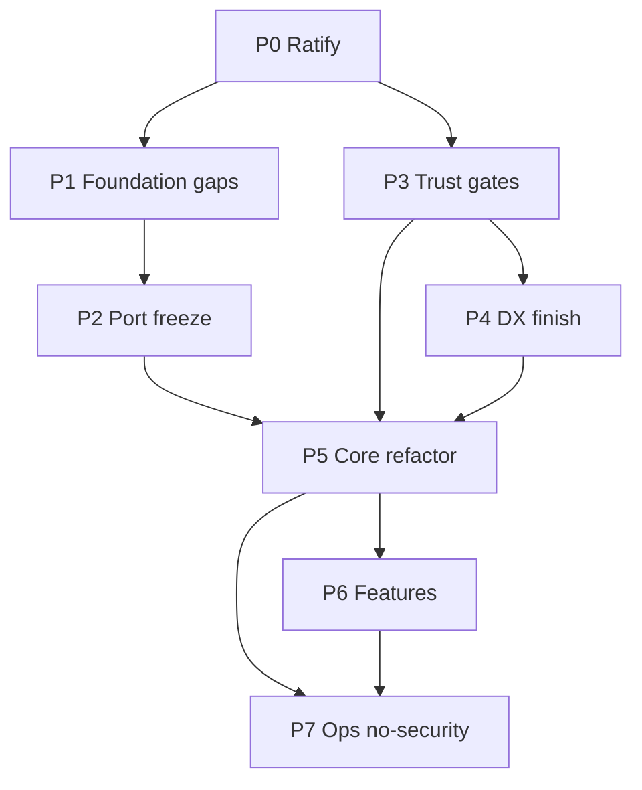

# Trading OS Transformation — Execution Roadmap (code-verified)

**Role:** Chief Architect / Principal Engineer  
**Branch:** `refactor/structural-cleanup` @ `8f825b5d` (+ dirty multi-agent working tree)  
**Workflow:** **Direct commits only** (no PRs)  
**Security:** **Deferred** — do not touch `src/infrastructure/security/**`, DR-I3, safety/CVE gates  
**Ground truth date:** 2026-07-12 deep re-verification  

### Progress log

| Date | Series | Result |
|---|---|---|
| 2026-07-12 | **A — Trust** | TOS-P3-002 test fixed; TOS-P3-001 `application.oms.ledger_authority` → import-linter **15/15**; TOS-P3-003 architecture marker registered; roadmap materialized |
| 2026-07-12 | **B — Composition/concurrency** | factory.build, broker_accessors, event_loop boundary (0 baseline) |
| 2026-07-12 | **C — Spine/golden** | bus goldens, order spine, portfolio mirror, GOLDEN_DIR |
| 2026-07-12 | **D — Close core TOS-*** | VOs, ADRs 021–023, plugins, strategy discover, lake chains, equity costs, MarketSurface defaults, wire/lock arch tests |

---

## 1. Deep code audit (current truth)

### 1.1 What is already solid (do not redo)

| Area | Evidence | Tests |
|---|---|---|
| Domain ↛ brokers | 0 broker imports in `src/domain/` | `test_domain_no_broker_imports` |
| OMS broker-agnostic (DR-B1) | `ExtendedOrderService` → `OrderCapabilityPort` via extension registry; no `"dhan"`/`"upstox"` branches | Arch broker-name tests **pass**; 1 stale component test **fails** |
| Cert / rate-limiter de-identity (DR-B2/B3) | Capability/plugin dispatch | Arch tests pass |
| `/ready` (DR-F2) | `evaluate_api_readiness` on `/ready` + `/readyz` | Health integration |
| Agent tools 12 (DR-F3) | `AGENT_TOOL_SPECS` length 12 | Schema |
| Web CI + TS SDK (DR-F4/F5) | `web.yml`, `web/src/api/generated.ts` | Present |
| PortfolioContext (DR-E3) | `application/portfolio/context.py` | Unit tests |
| EventBus idempotency (DR-I2) | Bus delegates to `IdempotencyService` | Code path |
| MarketSurface scaffold (DR-A6 partial) | `market_data/market_surface.py` + `config/profiles/market_surface.py` | Unit tests |
| Upstox+Dhan tick→EventBus (P5-010 partial) | Upstox `_publish_tick_to_bus`; Dhan market_feed/polling `_publish_tick`; `MARKET_DATA_DEGRADED` | Unit + golden exist for Upstox |
| Ledger outbox | `persist_intent_then_submit` in `ledger_outbox.py` | Unit + arch boundary tests |
| Concurrency **guard** (DR-E2 partial) | `runtime/event_loop.py` + frozen baseline arch test | **7/7 pass** |
| Mutation workflow collapse (DR-T2) | Only `mutation_nightly.yml` | Workflow |
| Docs foundation | HANDBOOK, FLOWS, STATE_MACHINES, ERROR_TAXONOMY, ADRs 012–020, STANDARDS | Present |
| Test pyramid (AST) | unit 4274/417 · component 1047/95 · arch 236/48 · integration 1331/151 · e2e 320/33 · chaos 175/12 | Collect clean on major layers |

### 1.2 Broken / partial / open (actionable)

#### Broken now

| ID | Finding | Exact evidence |
|---|---|---|
| ~~**IL-1**~~ | ~~import-linter 14/15~~ | **Fixed Series A** — pure `application.oms.ledger_authority`; **15/15** |
| ~~**TEST-1**~~ | ~~Stale component test~~ | **Fixed Series A** — expects `OrderCapabilityPort` |
| ~~**MARK-1**~~ | ~~architecture mark unregistered~~ | **Fixed Series A** — marker in `pyproject.toml` |

#### Partial (scaffolded; acceptance incomplete)

| ID | Finding | Exact evidence | Gap |
|---|---|---|---|
| **DR-E2** | Single-loop boundary | 5 baseline files, 6 `new_event_loop(` lines frozen | Migrate baseline to `get_runtime_loop` |
| **DR-I6** | Composition spine | `compose.build_*` → `runtime.factory.build`; `tradex.open_session` still dual path | Sole root; delete/deprecate alternates |
| **DR-B4** | UI broker imports | **18** matches under `interface/ui` (mostly `broker_registry.py`) | Move concrete imports to one non-UI module; tighten linter |
| **DR-I1** | RetryExecutor | Infra canonical; `brokers/dhan/resilience/retry_executor.py` is deprecated **shim still present** | Delete or pure re-export after call-site migrate |
| **DR-D1/D2** | Money/Clock | Dual `Money` (primitives ≠ value_objects); Order `price: Decimal`, `quantity: int`; `datetime.now` ×4 in `value_objects/state.py` | Unify + inject Clock + adopt on aggregates |
| **DR-A6** | Exchange-agnostic | MarketSurface exists; **~17** domain `exchange="NSE"` defaults | Composition-edge defaults only |
| **DR-T3** | CI truth | Clean-subset mypy error-mode; **4×** `continue-on-error: true` in `ci.yml` | Expand mypy; document/remove advisories |
| **P5-010** | Bus publish | Dhan+Upstox tick publish **implemented** | Golden coverage both; ensure no silent `event_bus=None` on live path |
| **P5-011** | Single ledger path | Outbox + shadow + flag exist | One command-handler path all modes; parity gate |

#### Open (no implementation)

| ID | Evidence |
|---|---|
| **DR-A4** | `DataLakeGateway.option_chain` empty dict; `future_chain` → `[]` |
| **DR-A1** | `StrategyPipeline` `default_factory=[Momentum, Breakout]`; facade hardcodes scanners |
| **DR-A3** | `GOLDEN_DIR = Path("data/golden")` (fixtures under `tests/fixtures/golden`) |
| **DR-A7** | Replay orchestrator “simplified version” ~L247 |
| **DR-B5/B6** | Both `BrokerAdapter` + `BrokerTransport` live; wire string methods remain |
| **DR-B7/B8** | Parallel `register_data_adapter` / `register_execution_provider` / `register_broker_extensions` + `ensure_core_plugins` metadata duplicate |
| **DR-D3/D4** | Dual `class OrderIntent` (`orders/intent.py` vs `execution_contracts.py`); Instrument collision (deprecated aggregate warning still fires) |
| **DR-E1** | God services: OrderManager 404, TradingOrchestrator 807, RiskManager 678, ExtendedOrderService 359 |
| **DR-A2/A5/A8** | Analytics→datalake direct imports; migrate stub/NotImplemented; thin indicators |
| **DR-I4/I5/I7** | Bus threads lifecycle; dual config homes; file-sprawl state |
| **DR-F1** | Dual API surface `/live/` vs clean routers |
| **DR-I3** | Encryption optional (plaintext debug log); `gAAAAA` sniff — **DEFERRED / do not implement** |

### 1.3 Concurrency baseline (migrate list)

Frozen by `tests/architecture/test_concurrency_boundary.py` (`EXPECTED_LEGACY_LINE_COUNT = 6`):

| File | Lines |
|---|---|
| `src/application/composer/factory.py` | 1 |
| `src/application/oms/context.py` | 1 |
| `src/infrastructure/io/async_compat.py` | 2 |
| `src/infrastructure/observability/http_server.py` | 1 |
| `src/brokers/dhan/data/depth_feed_base.py` | 1 |

**Reuse:** `runtime.event_loop.ensure_runtime_loop` / `get_runtime_loop` / `set_runtime_loop`.  
After each migration: shrink `BASELINE_FILES` and `EXPECTED_LEGACY_LINE_COUNT` in the same commit.

### 1.4 import-linter fix design (precise)

**Problem:** `runtime.ledger_policy.resolve_execution_ledger` imports `infrastructure.bootstrap.build_execution_ledger`. Application imports pure flags via `runtime.ledger_policy` → transitively infrastructure.

**Fix (smallest):**
1. Create pure module e.g. `domain/ledger_authority.py` or `application/oms/ledger_authority.py` with only:
   - `ledger_authority_enabled() -> bool` (reads env)
   - `require_execution_ledger(ledger) -> None`
2. Keep `resolve_execution_ledger` (builder) in `runtime/ledger_policy.py` for composition roots only (`interface/api/lifecycle.py`, `oms_bootstrap.py`, `oms_setup.py`).
3. Change application imports:
   - `application/oms/ledger_shadow.py` L11
   - `application/oms/_internal/order_lifecycle.py` L146–151  
   → pure module only.

**Acceptance:** `lint-imports` → **Contracts: 15 kept, 0 broken.**

---

## 2. Mission & principles

Transform Trade_XV2 into an institutional **Trading OS**:

Domain-Driven · OO · Event-Driven · Broker-agnostic · Exchange-agnostic · Plugin-based · Production-ready · AI-friendly · Testable · Continuously deployable  

**Without** claiming security certification (DR-I3 deferred).

### Binding principles

1. Architecture / contracts before wide implementation  
2. Business capabilities before module vanity  
3. Evolutionary refactor; **deployable after every commit series**  
4. DDD/Clean/SOLID/EDA only where value is clear  
5. Parallel agents: one ownership lane per series; no shared-file fights  
6. **Direct commits only** — no PRs, no stacks  
7. **No security-track edits**  
8. Continuous improvement loop after every phase  

```text
Review → Validate → Smallest safe design → Implement → Tests
→ SDK/CLI/MCP verify → Docs → Arch rules → Deployable → Reassess
```

---

## 3. Milestones & critical path

| M | Phase | Value | Status now |
|---|---|---|---|
| M0 | P0 Baseline | Risk visibility | ✅ Ratify only |
| M1 | P1 Architecture | Shared contracts + VOs | ⚠️ Docs exist; VO adoption open |
| M2 | P2 Runtime freeze | Operator certainty | ⚠️ Docs exist; port enforce open |
| M3 | P3 CI truth | **CI green = real** | ⚠️ 14/15 linter; stale test |
| M4 | P4 Dev platform | No ad-hoc scripts | 🟡 Core tools done; golden path broken |
| M5 | P5 Core spine | Live-path correctness | 🟡 Critical path |
| M6 | P6 Capabilities | Product features | ⏸ Blocked on M5 |
| M7 | P7 Ops hardening | SLA / chaos / load *(no security)* | ⏸ Blocked on M6 |



**Hard rule:** No spine (P5) commits until P3 import-linter 15/15 + architecture suite green.

---

## 4. Ownership lanes

| Lane | Owns | Forbidden |
|---|---|---|
| Domain & Contracts | `domain/`, VOs, ports, ADRs | brokers wire, UI |
| Broker Platform | `brokers/`, plugins, cert | OMS internals |
| OMS / Execution | `application/oms`, ledger | concrete brokers |
| Market Data & Lake | feeds→bus, `datalake/` | order placement |
| Runtime / Platform | `runtime/`, event loop, compose | domain rules |
| Analytics / Quant | `analytics/`, strategy, replay | live order path |
| Interface / DX | api, ui, agent, CLI, web | pure domain |
| Integration | CI, arch tests, import-linter | feature logic |

---

## 5. Package structure (keep; evolutionary)

```text
src/{domain,application,infrastructure,brokers,datalake,analytics,
     interface,runtime,config,market_data,tradex}
```

Dependency: domain ← application ← infrastructure/brokers/interface; `runtime` wires. Enforced by import-linter + arch tests.

---

## 6. Phase plan (tasks = direct commits)

### PHASE 0 — Discovery & Baseline (ratify) — 0.5 d

**Objective:** Freeze verified baseline so agents do not reopen fixed work.  
**Exit:** §9 / this audit matches repo.

| ID | Description | Deps | Output | Cplx | Acceptance |
|---|---|---|---|---|---|
| TOS-P0-001 | Publish code-verified status into `docs/roadmap` | — | README + EXECUTION §9 | S | Matches lint + pytest |
| TOS-P0-002 | Backlog = open/partial only (ex-security) | 001 | ENGINEERING-BACKLOG-TOS | S | No DR-B1/F2 as open |
| TOS-P0-003 | Lane ownership for agents | 001 | ownership note | S | Path → lane map |

---

### PHASE 1 — Architecture Foundation (close gaps) — 3–5 d

**Objective:** Ubiquitous language, VO purity/adoption, port freeze ADR, plugin completeness design.  
**Exists:** HANDBOOK, ADRs 012–020, GLOSSARY, OBJECT_MODEL, EVENT_CATALOG.

| ID | Description | Deps | Output | Cplx | Acceptance |
|---|---|---|---|---|---|
| TOS-P1-001 | ADR-021: BrokerAdapter (app) vs BrokerTransport (wire) | P0 | `docs/architecture/adrs/adr-021-*.md` | M | ADR merged; one app-facing port |
| TOS-P1-002 | Glossary: dual OrderIntent + Instrument aliases with deprecation | P0 | GLOSSARY + renames/aliases | M | One canonical name; deprecations warned |
| TOS-P1-003 | Unify Money to `domain.primitives`; Clock inject; remove wall-clock from VOs | 002 | VO modules | L | No dual Money; no `datetime.now` in domain VOs |
| TOS-P1-004 | Adopt Money/Quantity on Order (then Position/Trade) or transitional arch test | 003 | aggregates + serializers | L | Arch forbids new raw Decimal money fields |
| TOS-P1-005 | Design BrokerPluginInterface (wrap 5 registries) | 001 | plugin spec + skeleton | M | New broker checklist = 1 interface |

**Reuse:** `domain/primitives/value_objects.py`, `domain/ports/time_service.py`, `domain/extensions/order_capability.py`.

---

### PHASE 2 — Runtime & Flow Design (close gaps) — 2–4 d

**Exists:** FLOWS, STATE_MACHINES, ERROR_TAXONOMY, RUNTIME_KERNEL.

| ID | Description | Deps | Output | Cplx | Acceptance |
|---|---|---|---|---|---|
| TOS-P2-001 | Reconcile FLOWS vs code (capital paths) | P1 | FLOWS.md | M | Every capital flow has test hook |
| TOS-P2-002 | Arch test: no application/domain → wire `(symbol,exchange)` | P1-001 | arch test | L | Boundary green |
| TOS-P2-003 | Fail-closed on money-path event publish failures | 001 | code + tests | M | No silent drop on capital events |

---

### PHASE 3 — Engineering Standards (**critical path**) — 1–2 d

**Objective:** Trustworthy gates before spine.

| ID | Description | Deps | Output | Cplx | Acceptance |
|---|---|---|---|---|---|
| TOS-P3-001 | Split ledger authority pure module; fix IL-1 | — | pure policy + import rewires | M | import-linter **15/15** |
| TOS-P3-002 | Fix TEST-1 OrderCapabilityPort expectation | — | component test | S | Component suite green |
| TOS-P3-003 | Register `architecture` pytest marker | — | pyproject.toml | S | No unknown-mark for architecture |
| TOS-P3-004 | Expand mypy clean set (non-security) | 001 | ci.yml | M | More packages error-mode |
| TOS-P3-005 | Document residual `continue-on-error` as advisory-only | 001 | ci comments | S | No silent gate failures |

**Critical files:**  
`src/application/oms/ledger_shadow.py`, `src/application/oms/_internal/order_lifecycle.py`, `src/runtime/ledger_policy.py`, `tests/component/oms/test_extended_order_service_registry.py`, `pyproject.toml`

**Exit:** 15/15 linter · arch suite green · TEST-1 fixed. **Unblocks P5.**

---

### PHASE 4 — Developer Platform (finish) — 2–3 d

**Already done:** ready, doctor, cert v2, agent 12 tools, web CI, TS SDK, minimal_session example.

| ID | Description | Deps | Output | Cplx | Acceptance |
|---|---|---|---|---|---|
| TOS-P4-001 | Fix `GOLDEN_DIR` → fixtures path / env override | P3 | `golden_dataset.py` | S | CLI save usable with tests |
| TOS-P4-002 | Close MCP/CLI/doctor parity holes | P3 | platform_ops | M | Unity tests green |
| TOS-P4-003 | Canonical vs deprecated scripts list | 002 | docs | S | No new ad-hoc scripts without list update |

---

### PHASE 5 — Core Platform Refactor (**production correctness**) — 1.5–2.5 w

#### 5A Composition

| ID | Description | Deps | Output | Cplx | Acceptance |
|---|---|---|---|---|---|
| TOS-P5-001 | Enforce `runtime.factory.build` as sole trade spine | P3 | factory + arch test | L | Arch greps alternate roots |
| TOS-P5-002 | Move UI concrete broker imports out of `interface/ui` | 001 | gateway/discovery module | L | ≤1 approved module; 0 UI direct Dhan/Upstox |
| TOS-P5-003 | Remove Dhan RetryExecutor shim after call-site migrate | P3 | delete/reexport | M | Single RetryExecutor implementation |

#### 5B Concurrency (DR-E2)

| ID | Description | Deps | Output | Cplx | Acceptance |
|---|---|---|---|---|---|
| TOS-P5-010a | Migrate `composer/factory.py` | P5-001 | code | M | Baseline −1 |
| TOS-P5-010b | Migrate `oms/context.py` | 010a | code | M | Baseline −1 |
| TOS-P5-010c | Migrate `async_compat.py` (2 sites) | 010b | code | L | Baseline −2 |
| TOS-P5-010d | Migrate `http_server.py` | 010c | code | M | Baseline −1 |
| TOS-P5-010e | Migrate `dhan/depth_feed_base.py` | 010d | code | M | Baseline empty; only central module |
| TOS-P5-011 | Stream→OMS lock discipline tests | 010e | tests | M | Mutations serialized under RLock |

#### 5C Bus + ledger spine

| ID | Description | Deps | Output | Cplx | Acceptance |
|---|---|---|---|---|---|
| TOS-P5-020 | Golden-bus both brokers; live path requires bus wired | P2 | tests | M | No silent None bus on live cert path |
| TOS-P5-021 | Single place-order handler path all modes | P5-001 | OMS/runtime | XL | Shadow parity gate green; paper+replay share handler |
| TOS-P5-022 | Portfolio mutations only via PortfolioContext | 021 | portfolio | M | No dual writers |

#### 5D Market conventions

| ID | Description | Deps | Output | Cplx | Acceptance |
|---|---|---|---|---|---|
| TOS-P5-030 | MarketSurface defaults at composition edges | P1-003 | config edges | M | New domain code: no hardcoded NSE/paisa |
| TOS-P5-031 | God-service split only if 021 forces it | 021 | extractions | L | Optional |

**P5 exit:** Baseline loops = 0 outside `event_loop.py` · composition pure · one ledger path · MarketSurface at edges · 15/15 · **P6 unblocked**.

---

### PHASE 6 — Feature Delivery — 1.5–2.5 w

| ID | Description | Deps | Output | Cplx | Acceptance |
|---|---|---|---|---|---|
| TOS-P6-001 | Strategy/scanner default via registry.discover | P5 | facade + pipeline | L | Drop-in without facade edit |
| TOS-P6-002 | Lake option_chain / future_chain real data | P5-030 | datalake gateway | L | Non-empty when data present |
| TOS-P6-003 | Options capability E2E (paper) | 002 | package | L | Certifiable paper |
| TOS-P6-004 | Portfolio+Risk capability | P5-022 | package | L | Reconciles to ledger |
| TOS-P6-005 | Strategy engine dry-run + kill-switch | 001 | package | XL | Kill-switch enforced |
| TOS-P6-006 | Replay equity with commissions/slippage | P5-021 | orchestrator | M | Costs in equity |
| TOS-P6-007 | Agent MCP guardrails + replay-in-loop | P4 | agent | L | Gated actions |
| TOS-P6-008 | Rationalize dual API `/live/` | P4 | routers | M | Deprecate or merge |
| TOS-P6-009 | Analytics hot paths via MarketDataPort | 002 | ports | M | Less direct lake |
| TOS-P6-010 | Parquet migrate stub: implement or delete | 002 | datalake | M | No dead NotImplemented in migration API |

---

### PHASE 7 — Ops hardening (no security) — 1–1.5 w

| ID | Description | Deps | Output | Cplx | Acceptance |
|---|---|---|---|---|---|
| TOS-P7-001 | Chaos kill WS/broker/DB + recovery | P6 | chaos suite | L | Self-heal |
| TOS-P7-002 | Paper load baselines | P6 | baselines | M | P99 recorded |
| TOS-P7-003 | EventBus daemons under LifecycleManager | P5 | lifecycle | M | No unmanaged daemons |
| TOS-P7-004 | Config SSOT (profiles vs infra) | P5-030 | config | M | One home |
| TOS-P7-005 | State store ADR (flock vs scalable) | P6 | ADR-022 | L | Explicit decision |
| TOS-P7-006 | Full mypy expansion | P3-004 | CI | L | Core packages block |
| TOS-P7-007 | Functional cert artifacts T0–T4 | P4 | certs | XL | Per-release artifact |

**Deferred forever under this program:** DR-I3 encryption, secret_manager fail-closed, safety CVE gate, any `src/infrastructure/security/**` change.

---

## 7. Commit workflow (no PRs)

1. Work on `refactor/structural-cleanup` (or one working branch).  
2. Implement smallest unit.  
3. Gates:
   ```bash
   PYTHONPATH=src lint-imports --config pyproject.toml
   PYTHONPATH=src pytest tests/architecture/ -q
   # + wave-specific tests
   ```
4. **Direct commit** with complete-sentence message (what + why).  
5. Update `docs/roadmap` §9 when status changes.  
6. Push only if user requests.  

**Granularity:** one logical unit per commit. Prefer many small commits.

---

## 8. First commit series (start immediately after approval)

**Series A — Trust (½–1 day) — blocking**

| Commit | Task | Verify |
|---|---|---|
| 1 | TOS-P3-002 fix extended-order registry test | component test pass |
| 2 | TOS-P3-001 pure ledger authority + rewires | `lint-imports` 15/15 |
| 3 | TOS-P3-003 register `architecture` marker | no unknown-mark |
| 4 | TOS-P0-001 refresh roadmap status from this audit | docs match code |

**Series B — Composition**  
TOS-P5-001 → 002 → 003  

**Series C — Concurrency (one file per commit)**  
TOS-P5-010a … 010e  

**Series D — Spine**  
TOS-P5-020 → 021 → 022  

Then P1 VO, P4 golden, P6, P7 ops.

---

## 9. Testing strategy

| Layer | Gate |
|---|---|
| Unit | Blocking |
| Component | Blocking |
| Architecture + import-linter | **Blocking always** |
| Integration | Env-tiered |
| E2E / production_gate | Blocking for spine |
| Chaos | P7 |
| Golden replay | Blocking for analytics |

Every phase exit requires **SDK or CLI or MCP** verification, not only unit tests.

---

## 10. Risk register (ex-security)

| Risk | Sev | Mitigation |
|---|---|---|
| Order-book races during loop migration | High | One file per commit; keep RLock; run stream tests |
| Ledger mode divergence | High | Shadow parity; flag default off |
| import-linter fix breaks bootstrap | Med | Pure module only env+assert; builder stays runtime |
| VO migration API break | Med | Aliases + boundary serializers |
| Dirty working tree conflicts | Med | Commit series A first on known files; avoid unrelated dirt |
| Agents claim “done” without gates | High | §1 audit table + 15/15 + arch suite required |
| Over-claim live safety | High | No security; no unattended-live claim until P7 ops + product sign-off |

---

## 11. ADRs

| ADR | Action |
|---|---|
| 012–020 | Keep; enforce |
| **021** Port freeze Adapter vs Transport | New in P1 |
| **022** State store invariant | New in P7 |
| **023** Security deferred (optional) | Record DR-I3 out of scope |

---

## 12. Deliverables on approval (materialize then execute)

1. Write `docs/roadmap/TRADING-OS-EXECUTION-ROADMAP.md` from this plan  
2. Update `docs/roadmap/README.md` + EXECUTION §9 with §1 audit table  
3. Write `docs/roadmap/ENGINEERING-BACKLOG-TOS.md` (TOS-* IDs only)  
4. Begin Series A commits immediately  

---

## 13. Success criteria (ex-security)

- [ ] import-linter 15/15  
- [ ] Zero ad-hoc `new_event_loop` outside `runtime/event_loop.py`  
- [ ] OMS/cert/rate-limiter still broker-name free  
- [ ] UI concrete broker imports only in one approved module  
- [ ] Money/Quantity/Clock pure + adopted or arch-enforced transitional  
- [ ] Lake option/future chains real  
- [ ] Strategy/scanner drop-in plugins  
- [ ] Single execution path; shadow parity green  
- [ ] Chaos + load + lifecycle + config SSOT  
- [ ] Roadmap §9 always matches code  
- [ ] **DR-I3 not implemented; no security claims**

---

## 14. Effort

| Phase | Effort | Risk |
|---|---|---|
| P0 | 0.5 d | Low |
| P1 | 3–5 d | Med |
| P2 | 2–4 d | Med |
| P3 | 1–2 d | Med |
| P4 | 2–3 d | Low |
| P5 | 1.5–2.5 w | **High** |
| P6 | 1.5–2.5 w | Med |
| P7 | 1–1.5 w | Med |
| **Total** | **~5–8 weeks** | |

---

## 15. Do not touch

- `src/infrastructure/security/**`  
- Encryption fail-closed / SECRET_ENCRYPTION_KEY mandates  
- safety/CVE blocking gates  
- Re-opening completed DR-B1/B2/B3/F2–F5/E3/I2 without a regression  
