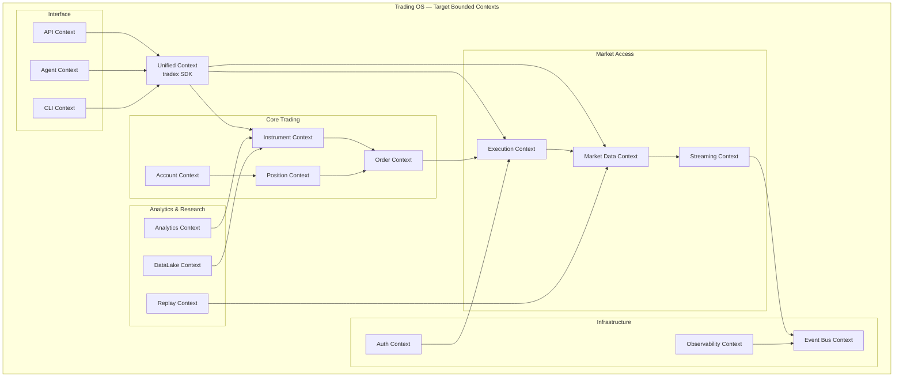
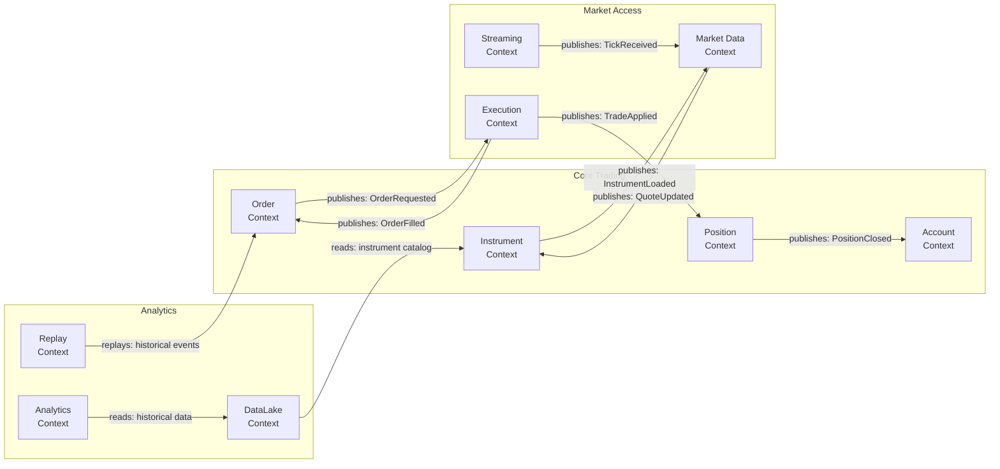
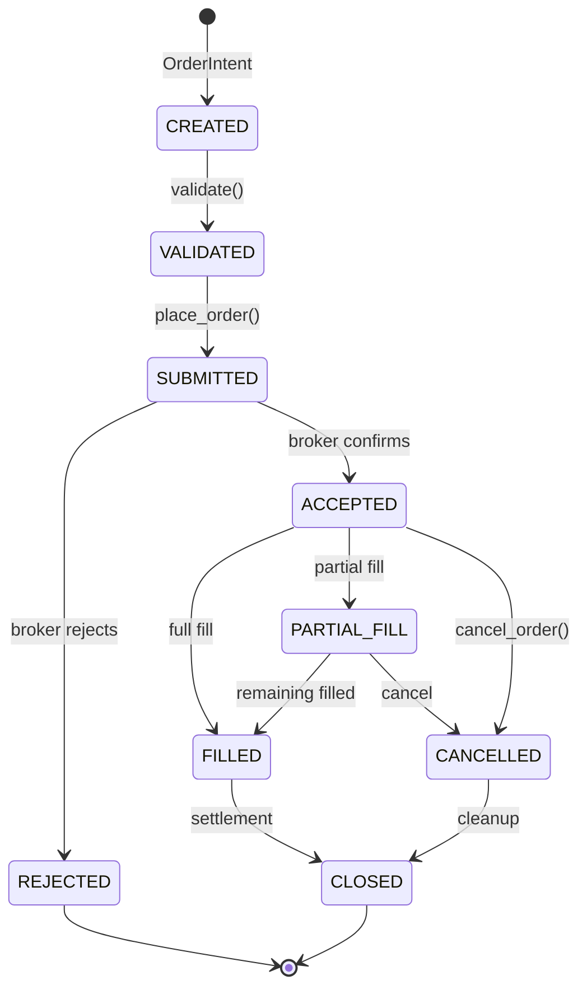
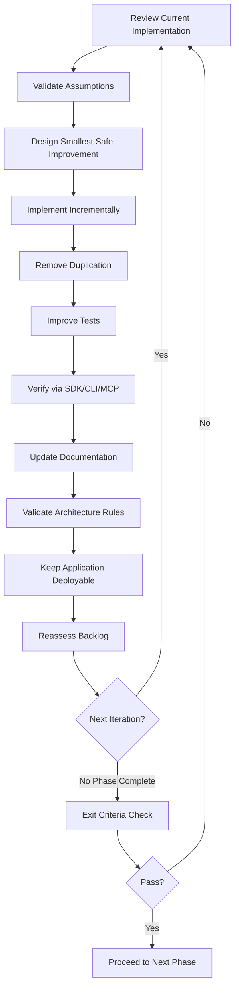
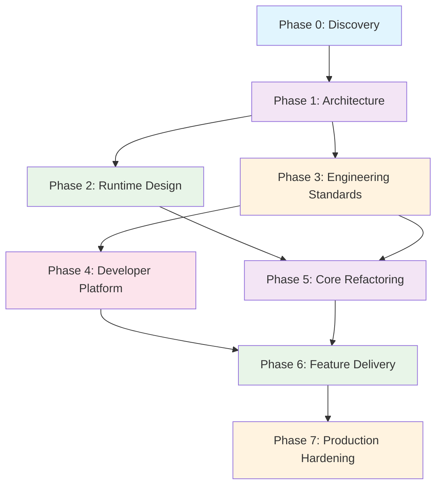

# Trading OS Transformation Roadmap

> **Version:** 1.0 — 2026-07-12  
> **Status:** EXECUTION-READY  
> **Audience:** Chief Architect, Principal Engineers, AI Coding Agents  
> **Methodology:** Top-down domain modeling → incremental architecture evolution

---

## Table of Contents

1. [Executive Summary](#executive-summary)
2. [Baseline Assessment](#baseline-assessment)
3. [Target Architecture Vision](#target-architecture-vision)
4. [Domain Model](#domain-model)
5. [Phase 0 — Discovery & Baseline](#phase-0--discovery--baseline)
6. [Phase 1 — Architecture Foundation](#phase-1--architecture-foundation)
7. [Phase 2 — Runtime & Flow Design](#phase-2--runtime--flow-design)
8. [Phase 3 — Engineering Standards](#phase-3--engineering-standards)
9. [Phase 4 — Developer Platform](#phase-4--developer-platform)
10. [Phase 5 — Core Platform Refactoring](#phase-5--core-platform-refactoring)
11. [Phase 6 — Feature Delivery](#phase-6--feature-delivery)
12. [Phase 7 — Production Hardening](#phase-7--production-hardening)
13. [Continuous Improvement Loop](#continuous-improvement-loop)
14. [Dependency Graph](#dependency-graph)
15. [Risk Register](#risk-register)
16. [Milestone Plan](#milestone-plan)
17. [Appendix A — Architecture Decision Records](#appendix-a--architecture-decision-records)
18. [Appendix B — Glossary](#appendix-b--glossary)

---

## Executive Summary

TradeXV2 is an institutional-grade algorithmic trading platform for Indian markets (NSE/BSE/MCX) with Dhan and Upstox broker integrations, a paper trading engine, real-time market data streaming, an OMS, analytics/backtesting, a datalake, a web UI, a REST API, an MCP server, and an AI agent interface. The codebase has **1,068 Python source files (~153K LOC)**, **890 test files (~136K LOC)**, and **8 CI workflows**.

The system already demonstrates significant architectural maturity:
- Domain-Driven Design with bounded contexts
- Port & Adapter architecture with 28+ protocol ports
- Plugin/extension system with entry points
- Event bus with dead-letter queue
- 50+ architecture fitness tests
- 15+ import linter contracts
- Broker certification suites
- Chaos and mutation testing

**However**, the system has accumulated structural debt that limits scaling to a multi-engineer, multi-broker, multi-exchange Trading OS. This roadmap addresses that debt through **7 phases of incremental, production-safe transformation**.

---

## Baseline Assessment

### Quantitative Baseline

| Metric | Current | Target |
|--------|---------|--------|
| Source files | 1,068 | ~800 (after consolidation) |
| Source LOC | 152,746 | ~120,000 (eliminate duplication) |
| Test files | 890 | ~950 (more targeted) |
| Test LOC | 135,884 | ~120,000 |
| Domain protocols | 28+ | 15 (consolidated) |
| Architecture tests | 50+ | 60+ (stricter) |
| Import lint rules | 15+ | 20+ (complete coverage) |
| CI workflows | 8 | 6 (consolidated) |
| Broker adapters | 3 (Dhan, Upstox, Paper) | 3+ (plugin-based) |
| Bounded contexts | ~6 (implicit) | 8 (explicit, bounded) |

### Structural Inventory

#### Current Package Architecture

```
src/
├── domain/           # DDD domain (aggregates, entities, events, ports, services, ...)
├── application/      # Application services (OMS, execution, streaming, trading)
├── infrastructure/   # Cross-cutting (DI, event bus, gateway factory, auth, cache)
├── brokers/          # Broker implementations (common, dhan, upstox, paper, CLI, MCP)
├── analytics/        # Analytics engine (backtest, scanners, indicators, replay, ...)
├── datalake/         # Data storage (DuckDB, parquet, ingestion, quality, research)
├── config/           # Configuration (schema, profiles, secrets, feature flags)
├── interface/        # Interfaces (REST API, agent/LLM, UI)
├── runtime/          # Runtime composition and lifecycle
├── tradex/           # Public SDK entry point
```

#### Top 20 Largest Files (by LOC)

| File | Lines | Concern |
|------|-------|---------|
| `analytics/replay/engine.py` | 1,125 | Replay engine |
| `domain/events/types.py` | 1,008 | Event type definitions |
| `domain/capability_manifest/catalog.py` | 905 | Capability catalog |
| `domain/instruments/instrument.py` | 819 | Instrument hierarchy |
| `application/oms/context.py` | 809 | OMS context |
| `domain/universe.py` | 808 | Universe/instrument collection |
| `application/trading/trading_orchestrator.py` | 807 | Trading orchestration |
| `domain/candles/historical.py` | 789 | Historical bar types |
| `analytics/precompute_features.py` | 753 | Feature precompute |
| `brokers/dhan/data/depth_feed_base.py` | 721 | Depth feed |
| `application/data/historical_coordinator.py` | 703 | Historical coordination |
| `brokers/services/core.py` | 683 | Broker services |
| `analytics/paper/engine.py` | 679 | Paper trading analytics |
| `interface/api/schemas.py` | 678 | API schemas |
| `application/oms/_internal/risk_manager.py` | 678 | Risk management |
| `analytics/replay/orchestrator.py` | 670 | Replay orchestration |
| `brokers/upstox/auth/token_manager.py` | 650 | Upstox auth |
| `brokers/dhan/api/http_client.py` | 631 | Dhan HTTP client |
| `tradex/session.py` | 621 | SDK session |

#### Identified Structural Issues

1. **Dual Gateway Pattern**: `CommonBrokerGateway` is aliased to `BrokerAdapter` but concrete gateway classes under `brokers/{dhan,upstox}/` still exist as transport facades. Migration is incomplete.
2. **Orphaned Top-Level Directory**: `/brokers/dhan/` (outside `src/`) contains `gateway.py` and `orders.py` — appears to be legacy.
3. **Scattered MCP Servers**: `src/brokers/mcp/` and `src/datalake/mcp/` are separate rather than unified.
4. **Analytics Isolation**: `src/analytics/` is a large standalone module (90+ files) that doesn't participate in the domain/application/infrastructure layering.
5. **DataLake Isolation**: `src/datalake/` similarly stands apart with its own gateway, ingestion pipeline, and MCP server.
6. **Runtime Duplication**: `src/runtime/` has composition/factory logic that overlaps with `src/infrastructure/di.py` and `src/infrastructure/gateway/factory.py`.
7. **Event Types Monolith**: `domain/events/types.py` at 1,008 lines contains all event types in one file.
8. **Large God Objects**: Several domain objects (Instrument, Universe, OMS Context) have too many responsibilities.
9. **Verification Scripts**: `scripts/verify/` contains 15+ ad-hoc scripts that duplicate test coverage.
10. **Import Linter Gaps**: Several import rules have `unmatched_ignore_imports_alerting = false`, hiding violations.

### What Works Well (Preserve These)

- Port & Adapter architecture with `runtime_checkable` Protocols
- Plugin system via `entry_points` and `register_broker_plugin()`
- Broker certification suites
- Architecture fitness tests enforcing domain isolation
- Event bus with DLQ and deduplication
- DI container with proper scoping
- Quota scheduler for API rate limiting
- Circuit breaker patterns
- Rich domain model on Instrument hierarchy (basis, cost of carry, Greeks, moneyness)
- Bootstrap/auth probe flow with token refresh
- Import linter contracts

---

## Target Architecture Vision

### Architectural Principles

1. **Domain Purity**: Domain layer has zero infrastructure imports. Dependencies flow inward.
2. **Protocol First**: Every boundary is defined by a Protocol. Implementations are swappable.
3. **Event-First Communication**: Cross-context communication uses domain events. Direct calls only within a bounded context.
4. **Plugin by Default**: Every broker, exchange, analytics engine, and strategy is a plugin.
5. **Evolutionary Architecture**: No big-bang rewrites. Each change is backward-compatible.
6. **Observable by Default**: Every operation produces structured events. No silent failures.
7. **Testable by Construction**: Dependencies are injected. Behavior is verifiable without infrastructure.
8. **Broker-Agnostic Core**: Strategy and OMS code never imports broker-specific modules.

### Target Bounded Contexts



### Target Package Structure

```
src/
├── tradex/                    # Public SDK (stable API surface)
│   ├── __init__.py            # tradex.connect(), instrument types
│   ├── session.py             # Session factory
│   ├── cli.py                 # CLI entry point
│   └── _compat.py             # Backward compatibility shims
│
├── domain/                    # Domain layer (zero dependencies)
│   ├── instruments/           # Instrument bounded context
│   ├── orders/                # Order bounded context
│   ├── positions/             # Position bounded context (from aggregates/)
│   ├── accounts/              # Account bounded context
│   ├── market_data/           # Market data domain concepts
│   ├── events/                # Domain events (typed, per-context)
│   ├── ports/                 # Port interfaces (consolidated)
│   ├── value_objects/         # Shared value objects
│   ├── extensions/            # Plugin contracts
│   └── capabilities/          # Capability manifests
│
├── application/               # Application services
│   ├── oms/                   # Order management
│   ├── execution/             # Order execution
│   ├── streaming/             # Real-time data
│   ├── portfolio/             # Portfolio management
│   ├── trading/               # Trading orchestration
│   ├── data/                  # Data coordination
│   └── services/              # Shared application services
│
├── infrastructure/            # Infrastructure implementations
│   ├── event_bus/             # Event bus implementation
│   ├── gateway/               # Gateway factory & base
│   ├── di/                    # Dependency injection
│   ├── auth/                  # Authentication infrastructure
│   ├── persistence/           # Data persistence
│   ├── resilience/            # Circuit breakers, retry
│   ├── metrics/               # Observability
│   └── lifecycle/             # Service lifecycle
│
├── brokers/                   # Broker plugins
│   ├── common/                # Shared broker infrastructure
│   ├── dhan/                  # Dhan plugin
│   ├── upstox/                # Upstox plugin
│   ├── paper/                 # Paper trading plugin
│   └── certification/         # Broker certification suites
│
├── analytics/                 # Analytics engine (bounded)
│   ├── indicators/            # Technical indicators
│   ├── scanners/              # Pattern scanners
│   ├── backtest/              # Backtesting engine
│   ├── strategy/              # Strategy framework
│   └── views/                 # Computed views
│
├── datalake/                  # Data lake (bounded)
│   ├── core/                  # Storage core
│   ├── ingestion/             # Data ingestion
│   ├── quality/               # Data quality
│   └── research/              # Research tools
│
├── interface/                 # Interface adapters
│   ├── api/                   # REST/WebSocket API
│   ├── agent/                 # LLM agent interface
│   └── mcp/                   # Unified MCP server
│
└── config/                    # Configuration
```

---

## Domain Model

### Bounded Context Map



### Key Aggregate Roots

| Aggregate | Root Entity | Key Value Objects | Invariants |
|-----------|-------------|-------------------|------------|
| Instrument | `Instrument` | `InstrumentId`, `AssetKind`, `ExchangeSegment` | Symbol+Exchange unique; lot_size > 0 |
| Order | `Order` | `OrderRequest`, `OrderResponse`, `OrderIntent` | State machine: PENDING→PLACED→FILLED/CANCELLED/REJECTED |
| Position | `Position` | `PositionSide`, `AveragePrice` | qty = sum(fills); closed when qty = 0 |
| Account | `Account` | `Balance`, `Holding` | funds >= 0; margin reserved atomically |
| OptionChain | `OptionChain` | `Strike`, `Expiry`, `Greeks` | strikes sorted; expiry within valid range |
| Event | `DomainEvent` | `EventType`, `CorrelationId` | Monotonically increasing timestamp; unique event_id |

### Order Lifecycle State Machine



### Ubiquitous Language Glossary

| Term | Definition |
|------|-----------|
| **Instrument** | A tradeable financial instrument (equity, option, future, index, etc.) |
| **Exchange Segment** | A specific market segment (NSE_EQ, NSE_FO, BSE_EQ, MCX_FO) |
| **Quote** | A point-in-time bid/ask/last price snapshot for an instrument |
| **OrderIntent** | A high-level expression of trading intent before OMS validation |
| **OrderRequest** | A validated, OMS-approved order ready for broker submission |
| **OrderResponse** | The broker's acknowledgment of an order placement/modification |
| **Fill** | A partial or complete execution of an order at a specific price |
| **Position** | An aggregate of fills representing current market exposure |
| **Ledger** | An append-only log of all order state transitions |
| **Capability** | A broker-specific feature (e.g., GTT orders, depth feeds, IPO) |
| **Extension** | A broker-specific behavior plugin that adds capabilities |
| **Stream** | A real-time WebSocket connection delivering market data or order updates |
| **Replay** | Replaying historical events to reconstruct state |
| **Bootstrap** | The startup sequence: config → transport → auth probe → ready |
| **Reconciliation** | Comparing local state with broker state and healing discrepancies |

---

## Phase 0 — Discovery & Baseline

### Objective

Produce a definitive, machine-readable inventory of the current system that enables every subsequent phase to make decisions based on facts, not assumptions.

### Scope

Entire repository: `src/`, `tests/`, `scripts/`, `web/`, `.github/`, configuration files, dependencies.

### Deliverables

| ID | Artifact | Description |
|----|----------|-------------|
| D0.1 | Repository Map | File-level inventory with ownership tags |
| D0.2 | Dependency Graph | Module-to-module import graph (import-linter output) |
| D0.3 | Architecture Diagram | Current-state Mermaid diagrams |
| D0.4 | Test Inventory | Test file → module coverage matrix |
| D0.5 | Technical Debt Register | Prioritized list of structural issues |
| D0.6 | API Surface Audit | All public entry points (tradex, CLI, API, MCP) |
| D0.7 | CI Pipeline Map | Workflow → trigger → gate mapping |
| D0.8 | Risk Register | Technical and operational risks |

### Tasks

| Task ID | Description | Dependencies | Complexity | Risks | Acceptance Criteria |
|---------|-------------|--------------|------------|-------|---------------------|
| T0.1 | Generate complete file inventory with LOC, ownership, and module tags | None | Low | Stale cache | Inventory covers all 1,068+ source files |
| T0.2 | Run `import-linter` and capture full dependency graph | T0.1 | Low | Linter config gaps | Dependency graph shows all module relationships |
| T0.3 | Map all `domain.ports/` protocols to their implementations | T0.2 | Medium | Unimplemented ports | Every protocol has ≥1 implementation; unimplemented ports flagged |
| T0.4 | Identify all public API surfaces (tradex SDK, CLI, REST, MCP, agent) | T0.1 | Medium | Hidden entry points | Complete list of user-facing APIs |
| T0.5 | Map test files to source modules | T0.1 | Medium | Test name ambiguity | Coverage gaps identified; orphaned tests flagged |
| T0.6 | Catalog all event types and their producers/consumers | T0.2 | Medium | Events in non-standard locations | Event catalog with producer/consumer map |
| T0.7 | Audit CI workflows: triggers, gates, timing, failures | T0.1 | Low | Workflow YAML complexity | Complete CI pipeline map |
| T0.8 | Identify orphaned/duplicate code (scripts/, top-level brokers/) | T0.1 | Low | Historical context needed | Orphan list with recommended action per item |
| T0.9 | Run architecture tests and catalog pass/fail/violations | None | Low | Test flakiness | Baseline architecture test results |
| T0.10 | Produce Technical Debt Register with severity/priority | T0.1-T0.9 | Medium | Subjective prioritization | Debt register with ≥20 items, each with severity/priority |

### Completion Criteria

- [ ] All 1,068+ source files inventoried
- [ ] Complete dependency graph generated
- [ ] Every protocol port mapped to implementations
- [ ] All public API surfaces documented
- [ ] Test coverage gaps identified
- [ ] Event catalog complete
- [ ] CI pipeline fully mapped
- [ ] Technical debt register produced
- [ ] Architecture baseline tests pass (current state)
- [ ] Risk register populated

### Exit Criteria

**Phase 0 is complete when:** The Discovery Document is reviewed and approved by the Chief Architect. All artifacts are versioned in `docs/roadmap/discovery/`. No code changes in this phase.

---

## Phase 1 — Architecture Foundation

### Objective

Define the target architecture as a set of stable contracts, diagrams, and decision records that guide all subsequent implementation work.

### Scope

Architecture documents, ADRs, domain model, package structure, dependency rules, event model.

### Deliverables

| ID | Artifact | Description |
|----|----------|-------------|
| D1.1 | Architecture Handbook | Complete architecture documentation |
| D1.2 | ADR-001 through ADR-010 | Architecture Decision Records |
| D1.3 | Domain Model Diagrams | Aggregate, entity, VO, relationship diagrams |
| D1.4 | Bounded Context Map | Context map with upstream/downstream relationships |
| D1.5 | Package Structure Specification | Target package layout with dependency rules |
| D1.6 | Dependency Rules | Import linter contracts for new structure |
| D1.7 | Event Model | Domain event catalog with producers, consumers, schemas |
| D1.8 | Extension Model | Plugin architecture specification |
| D1.9 | Port Consolidation Plan | Plan to reduce 28+ ports to ~15 essential ports |

### Tasks

| Task ID | Description | Dependencies | Complexity | Risks | Acceptance Criteria |
|---------|-------------|--------------|------------|-------|---------------------|
| T1.1 | Define 8 bounded contexts with clear boundaries | D0.2 | High | Over-granularity | Each context has clear inputs/outputs/own data |
| T1.2 | Define ubiquitous language for each bounded context | T1.1 | High | Terminology conflicts | Language glossary approved; no ambiguous terms |
| T1.3 | Design aggregate roots and their invariants | T1.1 | High | Over-engineering | Each aggregate has ≤7 invariants; consistency boundaries clear |
| T1.4 | Consolidate 28+ port protocols to ~15 essential ports | T0.3 | High | Breaking changes | Each port maps to ≥1 implementation; backward-compat aliases |
| T1.5 | Define event schema and routing rules | T1.1 | Medium | Event explosion | Event types per context ≤ 20; schema versioned |
| T1.6 | Design plugin architecture with lifecycle hooks | T1.4 | Medium | Over-abstraction | Plugin can be loaded/unloaded without restart |
| T1.7 | Write ADR-001: Event-Driven Communication | T1.1 | Low | — | ADR approved |
| T1.8 | Write ADR-002: Port & Adapter Architecture | T1.4 | Low | — | ADR approved |
| T1.9 | Write ADR-003: Broker Plugin Model | T1.6 | Low | — | ADR approved |
| T1.10 | Write ADR-004: Dependency Injection Strategy | T1.4 | Low | — | ADR approved |
| T1.11 | Write ADR-005: Domain Event Schema Evolution | T1.5 | Low | — | ADR approved |
| T1.12 | Write ADR-006: Analytics Engine Integration | T1.1 | Low | — | ADR approved |
| T1.13 | Write ADR-007: DataLake Integration | T1.1 | Low | — | ADR approved |
| T1.14 | Write ADR-008: MCP Server Consolidation | T1.6 | Low | — | ADR approved |
| T1.15 | Write ADR-009: Public SDK Surface Stability | T1.4 | Low | — | ADR approved |
| T1.16 | Write ADR-010: Testing Strategy | T1.4 | Low | — | ADR approved |
| T1.17 | Generate Mermaid diagrams for all architecture views | T1.1 | Medium | Diagram drift | All diagrams render correctly |
| T1.18 | Update `pyproject.toml` import-linter contracts for target structure | T1.6 | Medium | Linter false positives | All contracts pass on current code (with compatibility shims) |

### Completion Criteria

- [ ] Architecture Handbook complete and reviewed
- [ ] 10 ADRs written and approved
- [ ] Domain model diagrams complete
- [ ] Bounded context map with relationships
- [ ] Target package structure defined
- [ ] Import linter contracts updated
- [ ] Event model documented
- [ ] Extension model specified
- [ ] Port consolidation plan approved

### Exit Criteria

**Phase 1 is complete when:** Architecture Handbook is approved. All ADRs are approved. Import linter contracts pass on current codebase (no regressions). A PR merge is possible without breaking any existing tests.

---

## Phase 2 — Runtime & Flow Design

### Objective

Define how the system behaves at runtime through sequence diagrams, state machines, and flow specifications for every critical path.

### Scope

All runtime flows: startup, authentication, market data, order lifecycle, position management, portfolio, replay, shutdown, recovery.

### Deliverables

| ID | Artifact | Description |
|----|----------|-------------|
| D2.1 | Startup Flow | Complete system initialization sequence |
| D2.2 | Broker Connection Flow | Authentication, probe, ready sequence |
| D2.3 | Instrument Lifecycle | Load, resolve, cache, refresh |
| D2.4 | Market Data Flow | Subscribe, receive, parse, publish |
| D2.5 | Order Lifecycle Flow | Intent → validate → place → fill → reconcile |
| D2.6 | Position Lifecycle | Open → update → close |
| D2.7 | Portfolio Lifecycle | Aggregate → project → report |
| D2.8 | Replay Flow | Record → store → replay → verify |
| D2.9 | Shutdown Flow | Drain → flush → close → cleanup |
| D2.10 | Recovery Flow | Detect → diagnose → heal → resume |
| D2.11 | Error Handling Model | Exception hierarchy, DLQ, circuit breaker |
| D2.12 | State Machine Diagrams | For all key entities |

### Tasks

| Task ID | Description | Dependencies | Complexity | Risks | Acceptance Criteria |
|---------|-------------|--------------|------------|-------|---------------------|
| T2.1 | Document startup flow (config → DI → broker → auth → ready) | D1.1 | Medium | Hidden init steps | Flow covers all 8 startup phases |
| T2.2 | Document broker connection flow with retry/refresh | T2.1 | Medium | Token edge cases | Flow handles 401, timeout, network failure |
| T2.3 | Document instrument lifecycle (load → resolve → subscribe) | D1.1 | Medium | Stale instrument data | Flow covers live + paper + datalake |
| T2.4 | Document market data flow (subscribe → websocket → parse → event) | D1.5 | High | Binary protocols | Flow covers tick + depth + L2 |
| T2.5 | Document order lifecycle flow with state transitions | T1.3 | High | Race conditions | Flow covers all 8 order states + transitions |
| T2.6 | Document position lifecycle flow | T2.5 | Medium | Partial fills | Flow covers open → partial → close |
| T2.7 | Document portfolio aggregation flow | T2.6 | Medium | Stale positions | Flow covers real-time + EOD |
| T2.8 | Document replay flow for backtesting | D1.1 | High | Determinism | Replay is deterministic given same input |
| T2.9 | Document shutdown flow (graceful → force) | T2.1 | Low | Resource leaks | All resources released on shutdown |
| T2.10 | Document recovery flow (crash → restart → resume) | T2.1 | High | State corruption | State recoverable from event log |
| T2.11 | Define exception hierarchy and error handling model | T1.1 | Medium | Error masking | Every exception has an error code and severity |
| T2.12 | Define state machines for Order, Position, Session, Stream | T1.3 | Medium | Invalid transitions | All transitions are guarded and logged |
| T2.13 | Produce sequence diagrams for top-10 critical paths | T2.1-T2.8 | Medium | Diagram staleness | All diagrams in `docs/architecture/flows/` |
| T2.14 | Validate all flows against current implementation | T2.13 | High | Undocumented behavior | Discrepancies documented |

### Completion Criteria

- [ ] All 12 flows documented with sequence/activity diagrams
- [ ] State machines defined for Order, Position, Session, Stream
- [ ] Exception hierarchy documented
- [ ] Top-10 critical path sequence diagrams produced
- [ ] All flows validated against current implementation
- [ ] Discrepancies between design and implementation documented

### Exit Criteria

**Phase 2 is complete when:** All runtime flows are documented. Every flow has been validated against current code. Discrepancies are cataloged and prioritized. Phase 3 can begin without ambiguity about system behavior.

---

## Phase 3 — Engineering Standards

### Objective

Define and enforce engineering rules that maintain architectural consistency as multiple engineers/AI agents work on the codebase.

### Scope

Coding standards, testing standards, documentation standards, CI gates, architecture enforcement.

### Deliverables

| ID | Artifact | Description |
|----|----------|-------------|
| D3.1 | Coding Standards | Naming, structure, patterns, anti-patterns |
| D3.2 | Testing Standards | Test categories, naming, fixtures, assertions |
| D3.3 | Documentation Standards | Module docstrings, ADR format, flow docs |
| D3.4 | Architecture Enforcement Rules | Import linter, architecture tests, CI gates |
| D3.5 | CI Quality Gates | What must pass before merge |
| D3.6 | Module Ownership Matrix | Who owns what |
| D3.7 | Code Review Checklist | Architecture-aware review guide |

### Tasks

| Task ID | Description | Dependencies | Complexity | Risks | Acceptance Criteria |
|---------|-------------|--------------|------------|-------|---------------------|
| T3.1 | Define coding standards document | D1.1 | Low | Over-prescriptive | Standards are actionable, not aspirational |
| T3.2 | Define testing standards (unit/integration/e2e/chaos/architecture) | D1.16 | Low | Overhead | Standards match current best practices |
| T3.3 | Define documentation standards for modules, ADRs, flows | D1.1 | Low | Staleness | Templates provided |
| T3.4 | Update import-linter contracts for target architecture | T1.18 | Medium | False positives | All contracts pass |
| T3.5 | Add architecture fitness tests for new bounded contexts | T1.1 | Medium | Test fragility | Tests are stable and meaningful |
| T3.6 | Define CI quality gates (lint, type-check, test, architecture) | T3.4 | Low | CI time | Gates complete in <10 minutes |
| T3.7 | Create module ownership matrix | D0.1 | Low | Ownership gaps | Every module has an owner |
| T3.8 | Create code review checklist | T3.1 | Low | — | Checklist covers top-10 common issues |
| T3.9 | Update `pyproject.toml` ruff/mypy/coverage rules | T3.1 | Low | Over-strict | All rules pass on current code |
| T3.10 | Update pre-commit hooks for new standards | T3.4 | Low | Hook failures | Hooks pass on current code |

### Completion Criteria

- [ ] Coding standards documented
- [ ] Testing standards documented
- [ ] Documentation standards documented
- [ ] Import linter contracts updated and passing
- [ ] Architecture fitness tests for all bounded contexts
- [ ] CI quality gates defined and tested
- [ ] Module ownership matrix complete
- [ ] Code review checklist produced

### Exit Criteria

**Phase 3 is complete when:** All engineering standards are documented. All enforcement tools (import linter, architecture tests, CI gates) pass on the current codebase. No engineer should have ambiguity about "how to do things here."

---

## Phase 4 — Developer Platform

### Objective

Build the developer experience layer so that no engineer or AI agent needs to write ad-hoc scripts to validate functionality.

### Scope

Python SDK, CLI, MCP server, health checks, diagnostics, notebooks, golden datasets, sample apps.

### Deliverables

| ID | Artifact | Description |
|----|----------|-------------|
| D4.1 | Python SDK (`tradex`) | Stable public API for programmatic trading |
| D4.2 | CLI | Command-line interface for all operations |
| D4.3 | Unified MCP Server | Single MCP server for all capabilities |
| D4.4 | Health Check System | Readiness/liveness probes |
| D4.5 | Diagnostics System | `tradex doctor` for system validation |
| D4.6 | Startup Validation | Pre-flight checks before going live |
| D4.7 | Broker Certification CLI | Automated broker capability testing |
| D4.8 | Interactive Notebooks | Jupyter notebooks for exploration |
| D4.9 | Golden Datasets | Known-good data for regression testing |
| D4.10 | Sample Applications | Reference implementations |

### Tasks

| Task ID | Description | Dependencies | Complexity | Risks | Acceptance Criteria |
|---------|-------------|--------------|------------|-------|---------------------|
| T4.1 | Consolidate `tradex` SDK as the single public entry point | D1.9 | Medium | Breaking changes | `tradex.connect()` works for all brokers |
| T4.2 | Consolidate CLI commands under `tradex` namespace | T4.1 | Medium | Command naming | All CLI commands documented |
| T4.3 | Merge broker MCP + datalake MCP into unified server | D1.8 | Medium | Tool naming | Single MCP server exposes all tools |
| T4.4 | Implement health check endpoints (ready/live/detailed) | D1.1 | Low | Stale health data | Health checks complete in <100ms |
| T4.5 | Implement `tradex doctor` diagnostic command | D1.1 | Medium | Slow diagnostics | Doctor covers 20+ checks |
| T4.6 | Implement startup validation (config, auth, connectivity) | T2.1 | Medium | False positives | Validation catches all known failure modes |
| T4.7 | Automate broker certification in CI | D1.8 | Medium | Live API dependency | Certification runs in sandbox |
| T4.8 | Create golden datasets for regression testing | D0.5 | Low | Data staleness | Datasets cover all asset classes |
| T4.9 | Create sample applications (strategy, analytics, portfolio) | T4.1 | Medium | Outdated examples | All samples run without errors |
| T4.10 | Generate OpenAPI spec from API code | D1.1 | Low | Spec drift | Spec auto-generated in CI |
| T4.11 | Create developer quickstart guide | T4.1 | Low | — | New developer productive in <30 minutes |
| T4.12 | Migrate verification scripts to SDK/CLI tests | T0.8 | Medium | Coverage gaps | All scripts replaced by automated tests |

### Completion Criteria

- [ ] `tradex` SDK works for all brokers
- [ ] CLI covers all operations
- [ ] Unified MCP server operational
- [ ] Health checks implemented
- [ ] `tradex doctor` covers 20+ checks
- [ ] Startup validation complete
- [ ] Broker certification automated
- [ ] Golden datasets available
- [ ] Sample applications run without errors
- [ ] Verification scripts migrated

### Exit Criteria

**Phase 4 is complete when:** A developer can: (1) `pip install tradexv2`, (2) `tradex connect paper`, (3) run a sample strategy, (4) run `tradex doctor`, and (5) use MCP tools — all without writing any ad-hoc code.

---

## Phase 5 — Core Platform Refactoring

### Objective

Transform foundational modules incrementally to align with the target architecture. Each refactoring step is backward-compatible and independently releasable.

### Scope

Brokers, Market Data, Instruments, OMS, Portfolio, Risk, Analytics, DataLake.

### Deliverables

| ID | Artifact | Description |
|----|----------|-------------|
| D5.1 | Broker Plugin Standard | Standardized broker plugin interface |
| D5.2 | Event Type Consolidation | Split 1,008-line event types into per-context modules |
| D5.3 | Instrument Context Refactoring | Split Instrument god object |
| D5.4 | OMS Refactoring | Clean OMS boundaries |
| D5.5 | Market Data Integration | Analytics uses standard ports |
| D5.6 | DataLake Integration | DataLake participates in bounded contexts |
| D5.7 | Runtime Cleanup | Remove duplication between runtime/ and infrastructure/ |
| D5.8 | Analytics Boundary | Analytics has clear context boundary |

### Tasks

| Task ID | Description | Dependencies | Complexity | Risks | Acceptance Criteria |
|---------|-------------|--------------|------------|-------|---------------------|
| T5.1 | Standardize broker plugin interface with lifecycle hooks | D1.6, D1.8 | High | Breaking broker integrations | Dhan, Upstox, Paper all implement new interface |
| T5.2 | Split `domain/events/types.py` into per-context event modules | D1.5 | Medium | Import breakage | Each context has its own events module; backward-compat aliases |
| T5.3 | Extract `Instrument` methods into focused services | D1.3 | High | God object resistance | Instrument delegates to HistoryService, OptionService, etc. |
| T5.4 | Define clear OMS boundaries (separate order validation, routing, settlement) | D1.3 | High | Tightly coupled OMS | Each OMS component has clear responsibility |
| T5.5 | Refactor Analytics to use domain ports exclusively | D1.4 | Medium | Analytics imports infrastructure | Analytics depends only on domain + ports |
| T5.6 | Integrate DataLake as a bounded context with domain ports | D1.1 | Medium | DataLake isolation | DataLake implements standard ports |
| T5.7 | Eliminate orphaned `brokers/` top-level directory | T0.8 | Low | Code loss | Orphaned code deleted; functionality preserved |
| T5.8 | Consolidate `runtime/` into `infrastructure/` | T0.8 | Medium | Import changes | Runtime composition lives in infrastructure |
| T5.9 | Clean up compatibility aliases (CommonBrokerGateway, etc.) | D1.4 | Medium | Breaking changes | All aliases deprecated with warnings |
| T5.10 | Reduce OMS Context (809 LOC) to ≤400 LOC | D1.3 | High | Over-decomposition | Context delegates to focused services |
| T5.11 | Reduce `Universe` (808 LOC) to ≤400 LOC | D1.3 | High | Over-decomposition | Universe uses instrument collection services |
| T5.12 | Consolidate duplicate MCP servers | D1.8 | Medium | Tool naming conflicts | Single MCP server, all tools accessible |
| T5.13 | Add comprehensive tests for all refactored modules | T5.1-T5.12 | Medium | Test flakiness | All refactored modules have ≥90% coverage |
| T5.14 | Update import linter contracts for refactored structure | T5.1-T5.12 | Low | Contract violations | All contracts pass |

### Completion Criteria

- [ ] Broker plugin standard implemented by all 3 brokers
- [ ] Event types split by context
- [ ] Instrument god object decomposed
- [ ] OMS boundaries clean
- [ ] Analytics uses domain ports only
- [ ] DataLake integrated as bounded context
- [ ] Orphaned code removed
- [ ] Runtime duplication eliminated
- [ ] Compatibility aliases deprecated
- [ ] All refactored modules have ≥90% test coverage
- [ ] Import linter contracts pass

### Exit Criteria

**Phase 5 is complete when:** All core modules align with the target architecture. No module violates dependency rules. Test coverage is ≥90% for all refactored code. The system is fully deployable and all CI gates pass.

---

## Phase 6 — Feature Delivery

### Objective

Implement complete, independently releasable business capabilities using the refactored foundation.

### Scope

Market Access, Trading, Options, Portfolio, Analytics, Replay, Strategy Engine, AI Agents.

### Deliverables

| ID | Artifact | Description |
|----|----------|-------------|
| D6.1 | Market Access Capability | Real-time + historical market data |
| D6.2 | Trading Capability | Order placement, modification, cancellation |
| D6.3 | Options Capability | Option chains, Greeks, strategy builders |
| D6.4 | Portfolio Capability | Position tracking, P&L, risk metrics |
| D6.5 | Analytics Capability | Indicators, scanners, scoring |
| D6.6 | Replay Capability | Historical replay for backtesting |
| D6.7 | Strategy Engine | Multi-strategy runtime with isolation |
| D6.8 | AI Agent Capability | LLM-powered trading assistant |

### Tasks

| Task ID | Description | Dependencies | Complexity | Risks | Acceptance Criteria |
|---------|-------------|--------------|------------|-------|---------------------|
| T6.1 | Deliver Market Access with plugin-based data providers | D5.1-D5.8 | Medium | Data latency | Latency <50ms for quote retrieval |
| T6.2 | Deliver Trading with OMS + execution + reconciliation | D5.4 | High | Order errors | All order states handled correctly |
| T6.3 | Deliver Options with chain, Greeks, strategy builder | D5.3 | High | Greeks accuracy | Black-Scholes matches reference within 0.01% |
| T6.4 | Deliver Portfolio with real-time P&L and risk metrics | D5.4 | Medium | Stale data | P&L updates within 100ms of trade |
| T6.5 | Deliver Analytics with indicator pipeline | D5.5 | Medium | Performance | Indicators compute in <10ms per bar |
| T6.6 | Deliver Replay with deterministic event replay | D5.6 | High | Non-determinism | Replay is bit-for-bit deterministic |
| T6.7 | Deliver Strategy Engine with multi-strategy isolation | D6.2 | High | Strategy interference | Strategies cannot interfere with each other |
| T6.8 | Deliver AI Agent with MCP tool integration | D6.1-D6.6 | Medium | LLM hallucination | All tool outputs validated |
| T6.9 | Integration tests for each capability | T6.1-T6.8 | Medium | Test complexity | Each capability has ≥10 integration tests |
| T6.10 | Performance benchmarks for each capability | T6.1-T6.8 | Low | Benchmark flakiness | Benchmarks establish baseline performance |

### Completion Criteria

- [ ] Each capability independently deployable
- [ ] Each capability has integration tests
- [ ] Each capability has performance benchmarks
- [ ] No capability depends on broker-specific code
- [ ] All capabilities work with Paper, Dhan, and Upstox

### Exit Criteria

**Phase 6 is complete when:** All 8 capabilities are implemented, tested, and benchmarked. Each can be released independently. The system supports end-to-end trading flows through any broker.

---

## Phase 7 — Production Hardening

### Objective

Achieve operational excellence: performance, reliability, security, monitoring, and continuous improvement.

### Scope

Performance optimization, reliability engineering, chaos testing, load testing, monitoring, security, documentation.

### Deliverables

| ID | Artifact | Description |
|----|----------|-------------|
| D7.1 | Performance Profile | Benchmarks for all critical paths |
| D7.2 | Reliability Plan | Failure modes, recovery procedures |
| D7.3 | Chaos Test Suite | Automated failure injection |
| D7.4 | Load Test Suite | Performance under load |
| D7.5 | Monitoring Dashboard | Metrics, alerts, dashboards |
| D7.6 | Security Audit | Vulnerability assessment |
| D7.7 | Operational Runbook | Incident response procedures |
| D7.8 | Production Checklist | Go-live readiness |

### Tasks

| Task ID | Description | Dependencies | Complexity | Risks | Acceptance Criteria |
|---------|-------------|--------------|------------|-------|---------------------|
| T7.1 | Profile and optimize critical paths (order placement, quote retrieval) | D6.1-D6.8 | High | Over-optimization | Order placement <100ms end-to-end |
| T7.2 | Implement comprehensive chaos test suite | D7.2 | Medium | Test stability | Chaos tests run in CI without flakiness |
| T7.3 | Implement load test suite for order throughput | D7.1 | Medium | Broker rate limits | Load tests use mock brokers |
| T7.4 | Implement structured logging with correlation IDs | D3.1 | Medium | Log verbosity | Every operation traceable by correlation ID |
| T7.5 | Implement metrics collection (Prometheus/OTLP) | D7.4 | Medium | Performance overhead | Metrics collection adds <1% overhead |
| T7.6 | Implement distributed tracing | D7.4 | Medium | Complexity | Traces cover all critical paths |
| T7.7 | Security audit: credential handling, injection, DoS | D6.1-D6.8 | High | Security scope | All high-severity findings fixed |
| T7.8 | Write operational runbook for common incidents | D7.2 | Low | Staleness | Runbook covers top-10 incidents |
| T7.9 | Create production readiness checklist | D7.1-D7.8 | Low | — | Checklist covers all operational concerns |
| T7.10 | Performance regression tests in CI | D7.1 | Medium | Benchmark flakiness | Performance regressions blocked by CI |
| T7.11 | End-to-end stress test (1000 orders, 100 instruments) | D7.3 | Medium | Resource exhaustion | Test completes in <5 minutes |
| T7.12 | Documentation finalization | D1.1-D7.8 | Low | Staleness | All docs match implementation |

### Completion Criteria

- [ ] Performance benchmarks established and passing
- [ ] Chaos tests run in CI
- [ ] Load tests demonstrate target throughput
- [ ] Structured logging with correlation IDs
- [ ] Metrics collection operational
- [ ] Distributed tracing covers critical paths
- [ ] Security audit complete
- [ ] Operational runbook complete
- [ ] Production readiness checklist signed off

### Exit Criteria

**Phase 7 is complete when:** The system meets all production readiness criteria. Performance, reliability, and security benchmarks are met. The system is ready for live trading with real capital.

---

## Continuous Improvement Loop

After Phase 0, every phase executes using this loop:



**Rules of the loop:**
1. Every iteration must leave the system deployable.
2. Every iteration must pass all CI gates.
3. No iteration may break backward compatibility without a deprecation path.
4. Every iteration must include test changes proportional to code changes.
5. Architecture fitness tests must pass after every iteration.

---

## Dependency Graph



**Parallelism opportunities:**
- Phase 2 and Phase 3 can run in parallel after Phase 1.
- Phase 4 can run in parallel with Phase 5.
- Within Phase 6, capabilities can be delivered in parallel.

---

## Risk Register

| Risk ID | Risk | Probability | Impact | Mitigation |
|---------|------|------------|--------|------------|
| R1 | Broker API breaking changes during refactoring | Medium | High | Compatibility shims; pin broker SDK versions |
| R2 | Event schema migration causes data loss | Low | High | Schema versioning; backward-compatible events |
| R3 | Import linter false positives block progress | Medium | Medium | Phased contract rollout; `ignore_imports` for transition |
| R4 | God object decomposition creates too many small files | Medium | Medium | Decompose only when complexity is demonstrable |
| R5 | Architecture tests become flaky | Medium | Medium | Deterministic test data; no network in arch tests |
| R6 | AI coding agents introduce architectural violations | High | High | Architecture fitness tests in pre-commit; code review |
| R7 | Performance regression during refactoring | Medium | High | Performance benchmarks in CI; monitor latency |
| R8 | Breaking backward compatibility of `tradex` SDK | Low | High | Deprecation warnings; `_compat.py` shim layer |
| R9 | Scope creep delays milestones | High | Medium | Strict phase exit criteria; no gold-plating |
| R10 | Loss of institutional knowledge during refactoring | Medium | Medium | Architecture docs, ADRs, flow diagrams preserved |
| R11 | Analytics/DataLake integration creates circular deps | Medium | High | Strict port-based communication; import linter |
| R12 | Paper trading diverges from live broker behavior | Medium | High | Broker certification suite; contract tests |
| R13 | MCP tool naming conflicts during consolidation | Low | Low | Versioned tool namespaces; backward-compat aliases |
| R14 | Test suite becomes too slow for rapid iteration | Medium | Medium | Test tiers; parallel execution; selective test runs |

---

## Milestone Plan

| Milestone | Phase | Target | Key Deliverable | Business Value |
|-----------|-------|--------|-----------------|----------------|
| M0.1 | Phase 0 | Week 1-2 | Discovery complete | Informed decision-making |
| M1.1 | Phase 1 | Week 3-5 | Architecture Handbook | Team alignment |
| M1.2 | Phase 1 | Week 5-6 | ADRs approved | Decision traceability |
| M2.1 | Phase 2 | Week 6-9 | Runtime flows documented | Behavioral clarity |
| M3.1 | Phase 3 | Week 8-10 | Standards enforced | Consistent quality |
| M4.1 | Phase 4 | Week 10-14 | Developer platform v1 | Developer productivity |
| M5.1 | Phase 5 | Week 12-18 | Core refactoring complete | Architectural integrity |
| M6.1 | Phase 6 | Week 16-24 | All capabilities delivered | Business capability |
| M7.1 | Phase 7 | Week 22-28 | Production ready | Operational excellence |

**Total estimated duration: 28 weeks (7 months)**

---

## Appendix A — Architecture Decision Records

### ADR-001: Event-Driven Communication

**Status:** Proposed  
**Context:** Cross-context communication currently uses direct method calls in many places, creating tight coupling.  
**Decision:** All cross-bounded-context communication will use domain events via the event bus. Direct calls are permitted only within a bounded context.  
**Consequences:** Increased async complexity; eventual consistency; better decoupling.

### ADR-002: Port & Adapter Architecture

**Status:** Proposed  
**Context:** Multiple interface patterns exist (ABC, Protocol, naming conventions).  
**Decision:** All boundary interfaces use `runtime_checkable` Protocol from `typing`. ABCs are used only for shared implementation.  
**Consequences:** Structural typing; easier mocking; runtime verification.

### ADR-003: Broker Plugin Model

**Status:** Proposed  
**Context:** Broker implementations have grown organically with varying interfaces.  
**Decision:** All brokers implement `BrokerAdapter` protocol with lifecycle hooks (`start`, `stop`, `health`). Registration via `entry_points`.  
**Consequences:** Standardized broker integration; easier testing; new broker addition is formulaic.

### ADR-004: Dependency Injection Strategy

**Status:** Proposed  
**Context:** DI container exists but is used inconsistently. Some modules create dependencies directly.  
**Decision:** All cross-context dependencies are injected via the DI container. Within-context dependencies use constructor injection.  
**Consequences:** Testable components; explicit dependency graph; initial refactoring overhead.

### ADR-005: Domain Event Schema Evolution

**Status:** Proposed  
**Context:** Event types are defined in a single 1,008-line file with no versioning.  
**Decision:** Event schemas are versioned. New fields are always optional. Old fields are deprecated over 2 versions. Events are split per bounded context.  
**Consequences:** Schema migration tooling needed; backward compatibility guaranteed.

### ADR-006: Analytics Engine Integration

**Status:** Proposed  
**Context:** Analytics is a standalone 90+ file module that doesn't participate in the domain/application/infrastructure layering.  
**Decision:** Analytics becomes a bounded context with its own domain (indicators, scanners, strategies), application services, and infrastructure adapters. It communicates with other contexts only via domain ports.  
**Consequences:** Analytics is pluggable; can be replaced or extended independently.

### ADR-007: DataLake Integration

**Status:** Proposed  
**Context:** DataLake is isolated with its own gateway, ingestion, and MCP server.  
**Decision:** DataLake becomes a bounded context that implements standard domain ports (DataCatalogPort). It is consumed by other contexts through ports only.  
**Consequences:** DataLake is swappable; storage implementation is hidden.

### ADR-008: MCP Server Consolidation

**Status:** Proposed  
**Context:** Two MCP servers exist (broker MCP, datalake MCP) with separate tool sets.  
**Decision:** A single unified MCP server exposes all tools. Tools are namespaced by capability (`broker.*`, `datalake.*`, `analytics.*`).  
**Consequences:** Single connection for AI agents; cleaner tool discovery.

### ADR-009: Public SDK Surface Stability

**Status:** Proposed  
**Context:** The `tradex` SDK API may change during refactoring.  
**Decision:** The public SDK surface (`tradex.connect()`, `tradex.Equity`, etc.) is frozen during Phase 5-6. Changes require ADR and 2-version deprecation.  
**Consequences:** User code is stable; internal refactoring is decoupled.

### ADR-010: Testing Strategy

**Status:** Proposed  
**Context:** Test tiers exist (unit, integration, e2e, chaos, architecture) but coverage gaps and overlapping concerns exist.  
**Decision:** Tests are organized by: (1) Domain unit tests — fast, no I/O; (2) Integration tests — real broker sandbox; (3) Architecture tests — dependency enforcement; (4) Chaos tests — failure injection; (5) E2E tests — full flows. Each tier has clear ownership and CI trigger.  
**Consequences:** Clear test ownership; faster CI; targeted testing.

---

## Appendix B — Glossary

| Term | Definition |
|------|-----------|
| **ADRs** | Architecture Decision Records — documents capturing key architectural decisions |
| **Bounded Context** | A semantic boundary within which a particular domain model applies |
| **DDD** | Domain-Driven Design — an approach to software development focusing on the business domain |
| **DLQ** | Dead Letter Queue — storage for events that could not be processed |
| **DI** | Dependency Injection — technique for achieving loose coupling |
| **God Object** | An object that knows too much or does too much — a design anti-pattern |
| **OMS** | Order Management System — manages order lifecycle |
| **Protocol** | Python's structural typing mechanism for defining interfaces |
| **runtime_checkable** | A Protocol decorator enabling isinstance() checks at runtime |
| **State Machine** | A model of computation where the system transitions between discrete states |
| **UBIQUITOUS LANGUAGE** | A shared language developed by all team members for describing domain models |
| **Value Object** | An immutable object defined by its attributes, not identity |
