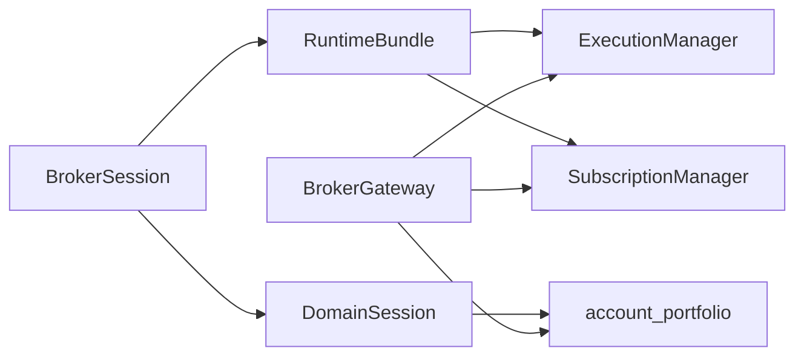

# Broker Hybrid Facade — Implementation Plan

Using writing-plans against the approved design (Option 3 hybrid + facade-first + domain-centric API).

**Goal:** Make `BrokerSession → Instrument | Gateway` the only public mental model, without relocating infrastructure or rewriting providers.

**Architecture:** Thin `brokers.BrokerGateway` wraps existing `RuntimeBundle` (execution + subscriptions) and portfolio surfaces. Instruments keep market data. Trading/subscribe on instrument/session become deprecated wrappers. Generic resilience/auth stay in `infrastructure/`. Providers stay plugins; physical `providers/` move is Phase 3 only.

**Tech stack:** Existing Python ports (`BrokerExecutionPort`, `DataProvider`), `RuntimeBundle`, paper/dhan/upstox plugins, pytest.

## Global constraints

- Every phase leaves the tree releasable (tests green, no broken imports).
- No file moves in Phase 1–2.
- No relocating rate-limit/retry into `brokers/` (reuse `infrastructure/resilience/`).
- No `domain/brokers/` package without Phase 5 ADR.
- ADR-0012 preserved: operator live money remains paper-only; `gateway.place_order` uses the existing OMS/`RuntimeBundle.execution` path (same as today’s `session.buy`).
- Prefer deletion over new abstractions; one public path per action.
- After `src/` changes: `graphify update src` + update `context/progress-tracker.md`.

## Locked public API

```python
from brokers import BrokerSession

session = BrokerSession.connect("dhan")
reliance = session.stock("RELIANCE")
reliance.quote()                          # Instrument
session.gateway.place_order(...)          # Gateway
session.gateway.subscribe([reliance])     # Gateway
session.extension(SomeExtension)          # broker-specific only
session.close()
```

| Owner | Public methods |
|---|---|
| Session | `connect`, instrument factories, `.gateway`, `.extension()`, `close`, lifecycle/status |
| Instrument | `quote`, `history`, `market_depth`, `option_chain`, metadata |
| Gateway | `place_order`, `modify_order`, `cancel_order`, `orders`, `positions`, `holdings`, `funds`, `margin`, `subscribe`, `unsubscribe` |

No `gateway.quote` / `stock.buy` as equal APIs long-term.

## Current wiring to reuse (do not reinvent)



- Connect already exists: [`src/brokers/session/broker_session.py`](src/brokers/session/broker_session.py) → `get_session_opener()` / plugins.
- Execution: [`src/brokers/runtime/execution_manager.py`](src/brokers/runtime/execution_manager.py)
- Subscribe: [`src/brokers/runtime/subscription_manager.py`](src/brokers/runtime/subscription_manager.py)
- Portfolio: `session.account` + provider `positions`/`holdings`/`funds` via [`BrokerExecutionPort`](src/domain/ports/broker_execution_port.py)
- Extensions today: [`domain.extensions.facade.BrokerFacade`](src/domain/extensions/facade.py) / instrument `.broker` — Phase 1 adds typed `session.extension(cls)` over the same catalog

## Files (Phase 1)

| File | Role |
|---|---|
| **Create** [`src/brokers/gateway.py`](src/brokers/gateway.py) | Public `BrokerGateway` thin facade |
| **Edit** [`src/brokers/session/broker_session.py`](src/brokers/session/broker_session.py) | `.gateway`, `.extension()`, deprecate buy/sell/cancel/modify/subscribe |
| **Edit** [`src/brokers/__init__.py`](src/brokers/__init__.py) | Document domain-centric API; export if needed |
| **Edit** [`src/domain/instruments/instrument_trading.py`](src/domain/instruments/instrument_trading.py) | Deprecate buy/cancel/modify → warn + keep behavior |
| **Edit** [`src/domain/instruments/instrument_streaming.py`](src/domain/instruments/instrument_streaming.py) | Deprecate subscribe → warn + keep behavior |
| **Create** `tests/unit/brokers/test_public_gateway_api.py` | Contract + deprecation tests (paper) |
| **Create** `docs/superpowers/specs/2026-07-21-broker-hybrid-facade-design.md` | Approved design record |
| **Create** `docs/superpowers/plans/2026-07-21-broker-hybrid-facade.md` | This plan (repo copy) |

---

## Phase 1 — Public API (execute first; no moves)

### Task 1: Design + plan docs
- Write design spec from approved brainstorm (hybrid, facade-first, domain-centric, phases 1–5).
- Copy this plan under `docs/superpowers/plans/`.

### Task 2: `BrokerGateway` thin facade
- Implement class taking `RuntimeBundle` + domain `Session` (or minimal ports).
- Methods: `place_order` / `modify_order` / `cancel_order` / `orders` / `positions` / `holdings` / `funds` / `margin` / `subscribe` / `unsubscribe`.
- `place_order`: accept canonical `OrderRequest` (or thin kwargs that build it); route through `RuntimeBundle.execution` / same spine as `session.buy` — **never** return SDK models or security IDs.
- `subscribe([instruments], ...)`: batch over `SubscriptionManager` (list API; single-instrument OK).
- `positions`/`holdings`/`funds`/`margin`: from account/provider; map to domain `Position`/`Holding`/`Balance`.
- No quote/history on gateway.

### Task 3: Attach to `BrokerSession`
- `@property gateway` → lazy `BrokerGateway(self._runtime, self._session)`.
- `extension(ext_type)` → resolve from session extension catalog / `BrokerFacade`; raise clear error if missing.
- Update package docstring in [`src/brokers/__init__.py`](src/brokers/__init__.py) to domain-centric examples (replace gateway-as-private messaging where it conflicts).

### Task 4: Deprecations
- `BrokerSession.buy/sell/cancel/modify/subscribe/unsubscribe`: `DeprecationWarning`, delegate to gateway (or keep orders() as thin deprecated alias if desired — prefer gateway-only docs).
- `InstrumentTradingMixin.buy/cancel/modify` and `InstrumentStreamingMixin.subscribe`: warn; keep OMS/provider behavior for one release.
- Do **not** remove yet (Phase 4).

### Task 5: Tests + sync
- Paper session: `connect("paper")` → stock quote still works; `gateway.orders/positions/funds/subscribe` callable; place/cancel round-trip via paper path.
- Assert deprecation warnings on `instrument.buy` and `session.subscribe`.
- Assert no `gateway.quote` attribute.
- `graphify update src`; update `context/progress-tracker.md`.

**Phase 1 exit:** Public API usable; internals unchanged; suite green.

---

## Phase 2 — Internal cleanup (separate PR wave)

Focus areas (delete/merge only; no mass renames):

- Collapse dead/forwarding layers in `brokers/common/` and `brokers/services/` left after purity delete.
- Shared rate-limit **config tables** per provider feeding existing `MultiBucketRateLimiter` (algorithm stays in infrastructure).
- Tighten transport → canonical exception mapping (ratchet already in [`tests/unit/brokers/common/test_gateway_error_surface_contracts.py`](tests/unit/brokers/common/test_gateway_error_surface_contracts.py)).
- Simplify auth lifecycle behind session (automatic refresh remains session-owned).
- Optional: soft-deprecate `session.quote(instrument)` in favor of `instrument.quote()` only (market-data consistency).
- Contract suite: same behavioral tests across paper/dhan/upstox where sandboxed.

**Phase 2 exit:** Fewer concepts; same public API; measurable file/CC reduction.

---

## Phase 3 — Provider layout (mechanical)

Move (update entry points + imports; public API unchanged):

```text
src/brokers/providers/dhan/   → src/brokers/providers/dhan/
src/brokers/providers/upstox/ → src/brokers/providers/upstox/
src/brokers/providers/paper/  → src/brokers/providers/paper/
```

- Replay: only if a real replay **broker plugin** exists or is explicitly added; do not invent a stub. Otherwise document replay as analytics/runtime execution target (ADR-0012), not a fake provider.
- Update `pyproject.toml` `tradex.brokers` entry points.
- Compatibility shims at old paths **only if** needed for one release; prefer updating imports in-repo.

**Phase 3 exit:** Layout matches target `providers/`; `from brokers import BrokerSession` unchanged.

---

## Phase 4 — Delete

- Remove deprecated instrument/session trading & subscribe methods.
- Remove temporary import shims from Phase 3.
- Remove obsolete aliases / unused `brokers/services` facades / tiny packages proven unused.
- Grep ratchet: no `instrument.buy` / `session.buy` in `src/` product code.

**Phase 4 exit:** One public path per action; no compatibility debt.

---

## Phase 5 — Domain contracts ADR (decision only)

- Separate ADR: keep ports in `domain/ports/` vs introduce `domain/brokers/`.
- Default recommendation: **keep** current ports (already mapped in constitution §09); only move if glossary/onboarding pain justifies ADR.

---

## Out of scope

- Rewriting Dhan/Upstox HTTP/WS stacks.
- Restoring `brokers/cli|certification|diagnostics`.
- Monolithic `brokers/rate_limit.py` owning infrastructure concerns.
- Live ADR-0012 lift.

## Verification (each phase)

- Targeted: `pytest tests/unit/brokers/test_public_gateway_api.py` (+ broker unit subset).
- Architecture: `tests/architecture -k broker` still green.
- import-linter contracts 1–4 green.
- No new provider→provider imports.
