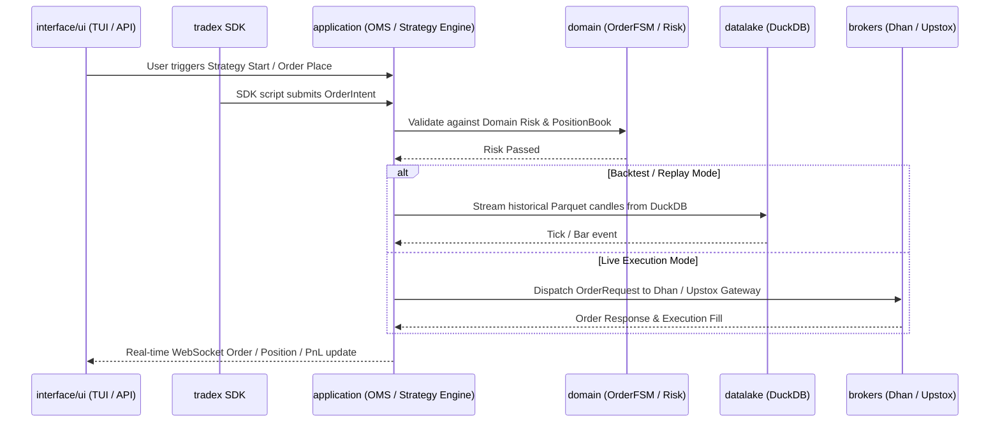

# Production Architecture Specification: Trade_XV2 (Full 11-Module Blueprint)

**Date:** 2026-07-22  
**Target:** Trade_XV2 Enterprise Algorithmic Trading System  
**Architecture Model:** Unified Event-Driven Architecture (Nautilus-Style Execution Parity across all 11 Modules)

---

## 1. Complete 11-Module Architecture Inventory & Target Structure

```mermaid
graph TD
    subgraph Presentation & Client SDK (L4)
        TRADEX["tradex (Public SDK)"]
        API["interface/api (FastAPI REST & WebSockets)"]
        UI["interface/ui (Textual TUI & CLI)"]
    end

    subgraph Application & Execution Core (L3)
        APP["application (OMS, Streaming, Use Cases)"]
        ANALYTICS["analytics (Strategy, Scanners, Indicators, Walk-Forward)"]
    end

    subgraph Composition & Config Root
        RUNTIME["runtime (Composition Root & Service Registry)"]
        CONFIG["config (Central Pydantic AppConfig Authority)"]
    end

    subgraph Pure Domain Layer (L2 - 0.0% Coupling)
        DOMAIN["domain (Entities, Value Objects, Ports, FSM, Risk Policies)"]
    end

    subgraph Infrastructure & Integrations (L1)
        BROKERS["brokers (Dhan, Upstox, Paper Sim Adapters)"]
        DATALAKE["datalake (DuckDB + Parquet Data Lake & MCP Server)"]
        INFRA["infrastructure (Event Bus, Resilience, Auth, Metrics)"]
        PLUGINS["plugins (NSE Calendars & Exchange Plugins)"]
    end

    TRADEX --> RUNTIME
    API --> APP
    UI --> APP

    RUNTIME --> APP
    RUNTIME --> BROKERS
    RUNTIME --> INFRA
    CONFIG --> RUNTIME

    APP --> DOMAIN
    ANALYTICS --> DOMAIN
    
    BROKERS --> DOMAIN
    DATALAKE --> DOMAIN
    INFRA --> DOMAIN
    PLUGINS --> DOMAIN
```

---

## 2. Comprehensive Deep Dive Across All 11 Modules

### Module 1: `domain/` (Core Business Models & Contracts — Pure 0.0% Coupling)
* **Current State:** 220 files. Cleanest layer in system (0.0% cross-module coupling).
* **Target Responsibility:** Immutable business entities, value objects, ports (protocols), domain events, order lifecycle state machine (`OrderFSM`), and risk contracts.
* **Refactoring Actions:**
  * Elevate `PositionSide` enum to `domain/enums.py`.
  * Unify `domain/exceptions.py` and `domain/errors.py` into a single canonical exception hierarchy under `TradeXV2Error`.
  * Enforce `Money` and `Quantity` value objects across all calculations.

---

### Module 2: `analytics/` (Quantitative Analytics, Scanners & Strategy Framework)
* **Current State:** 115 files. Contains duplicated simulation logic between `analytics/replay/` and `analytics/paper/`.
* **Target Responsibility:**
  * `analytics/strategy/`: Unified `Strategy` base class and signal generation algorithms.
  * `analytics/indicators/`: High-performance technical indicators (EMA, RSI, ATR, Option Greeks: Delta, Gamma, Theta, Vega).
  * `analytics/scanner/`: Dynamic market screeners querying Data Lake and live tick snapshots for candidate selection (e.g., top volume/momentum option strikes).
  * `analytics/walk_forward/`: Strategy parameter optimization and walk-forward analysis.
* **Refactoring Actions:**
  * **Consolidate Simulation Engines:** Merge duplicate simulation models (`SimulatedTrade` / `PaperTrade`) and duplicate signal processors into a single unified `application/simulation/` execution module.

---

### Module 3: `application/` (OMS, Orchestration & Portfolio Management)
* **Current State:** 99 files (45 OMS files). Owns execution, streaming, and portfolio services.
* **Target Responsibility:**
  * `application/oms/`: Order Management System handling `OrderIntent` validation, slice decomposition, and execution tracking.
  * `application/data/`: `HistoricalDataCoordinator` and `BatchQuoteCoordinator` for federated multi-broker data routing.
  * `application/portfolio/`: Real-time position lot tracking, capital pool allocation, and pre-trade margin verification.
  * `application/streaming/`: `StreamOrchestrator` managing WebSocket connections and stream reconnection logic.

---

### Module 4: `brokers/` (Broker Infrastructure & Provider Adapters)
* **Current State:** 313 files across Dhan (95), Upstox (126), and Paper (9).
* **Target Responsibility:** Encapsulating broker-specific HTTP, REST, and WebSocket wire protocols behind standard `CommonBrokerGateway` ports.
* **Structure:**
  * `brokers/providers/dhan/`: Certified Dhan API wire adapters, OAuth token management, and option chain parsing.
  * `brokers/providers/upstox/`: Upstox V2 API integration and proto WebSocket decoder.
  * `brokers/providers/paper/`: Deterministic paper trading broker gateway with configurable latency and queue slippage models.
  * `brokers/common/`: Common gateway base classes and certification test suites.

---

### Module 5: `datalake/` (DuckDB + Parquet Market Data Infrastructure)
* **Current State:** 60 files. High-performance historical ingestion and research data lake.
* **Target Responsibility:**
  * `datalake/storage/`: Parquet file storage partitioned by `exchange/symbol/year/month.parquet`.
  * `datalake/engine/`: Embedded DuckDB query engine executing fast analytical SQL queries over historical option ticks and candles.
  * `datalake/ingestion/`: Automated market data downloader fetching data via `HistoricalDataCoordinator` and persisting into Parquet.
  * `datalake/mcp/`: Model Context Protocol server allowing AI assistants and quantitative notebooks to query market data via standard JSON-RPC.

---

### Module 6: `infrastructure/` (Cross-Cutting Concerns)
* **Current State:** 104 files.
* **Target Responsibility:**
  * `infrastructure/event_bus/`: Async lock-free event bus delivering market data ticks, bar completions, and order lifecycle events.
  * `infrastructure/resilience/`: Circuit breakers, retry decorators with exponential backoff, and rate limiters.
  * `infrastructure/observability/`: Structured logging, OpenTelemetry tracing, and Prometheus performance metrics export.
  * `infrastructure/auth/`: JWT token authentication and API key encryption services.

---

### Module 7: `interface/` (Presentation Layer: REST, WebSockets & Textual TUI)
* **Current State:** 148 files (FastAPI REST 53 files, Textual TUI 94 files).
* **Target Responsibility:**
  * `interface/api/`: OpenAPI compliant REST endpoints (`/orders`, `/positions`, `/strategies`, `/data`) and WebSocket streaming servers (`/ws/ticks`, `/ws/orders`).
  * `interface/ui/`: Interactive Terminal User Interface (TUI) built with Textual, featuring real-time option chain dashboards, OMS order books, and PnL monitors.
* **Refactoring Actions:**
  * Decouple TUI widgets from direct broker/runtime references by delegating strictly to `ApplicationService` facades.

---

### Module 8: `runtime/` (Composition Root & Service Registry)
* **Current State:** 28 files.
* **Target Responsibility:** System composition root that wires application services, instantiates broker gateways, injects dependencies, and manages lifecycle startup/shutdown.
* **Refactoring Actions:**
  * Eliminate circular dependencies with `application` and `infrastructure` by moving `production_config` into `config/`.

---

### Module 9: `config/` (Central Configuration Authority)
* **Current State:** 11 files.
* **Target Responsibility:** Single source of configuration truth backed by Pydantic `AppConfig`. Loads environment profiles (`.env.local`, `.env.dhan.sandbox`), validates endpoints, and exposes validated configuration objects across the application.

---

### Module 10: `tradex/` (Public Python SDK)
* **Current State:** 8 files.
* **Target Responsibility:** Lightweight client library (`import tradex`) enabling programmatic user control:
  ```python
  session = tradex.connect(broker="dhan", env="sandbox")
  bars = session.history("RELIANCE", timeframe="1m", days=30)
  session.submit_order(symbol="NIFTY26JUL24500CE", quantity=50, side="BUY")
  ```

---

### Module 11: `plugins/` (Exchange Extensions & Calendars)
* **Current State:** 5 files.
* **Target Responsibility:** Exchange-specific plugins (e.g. `plugins/nse`) providing trading session hours, market holidays, settlement rules, and special session calendars (e.g., Muhurat trading).

---

## 3. Layer Interactions & Execution Flow



---

## 4. Summary of Architecture Alignment

| Module | Primary Responsibility | Refactoring Goal |
| :--- | :--- | :--- |
| `domain` | Core Entities & FSM | Pure 0.0% coupling; standardize enums & exceptions |
| `analytics` | Strategy & Indicators | Remove simulation code duplication; unify `Strategy` API |
| `application` | OMS & Coordinators | High-throughput order routing & federated data fetching |
| `brokers` | Broker Wire Adapters | Standardize `CommonBrokerGateway` across Dhan/Upstox/Paper |
| `datalake` | Data Storage & Querying | DuckDB + Parquet tick storage & MCP AI querying |
| `infrastructure` | Event Bus & Resilience | Lock-free event bus, structured logging, metrics |
| `interface` | REST, WS, Textual TUI | Clean separation via Application Services |
| `runtime` | Composition Root | Dependency Injection; eliminate circular imports |
| `config` | Config Authority | Pydantic validation & single config source |
| `tradex` | Public Python SDK | Simple, intuitive developer SDK API |
| `plugins` | Exchange Calendars | NSE/MCX holiday & trading session calendars |

---

This document updates [`docs/superpowers/specs/2026-07-22-production-platform-design.md`](file:///Users/apple/Downloads/Trade_XV2/docs/superpowers/specs/2026-07-22-production-platform-design.md) with the full 11-module blueprint.
