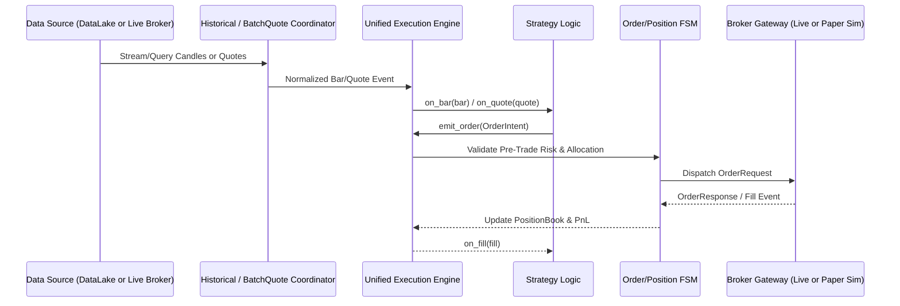
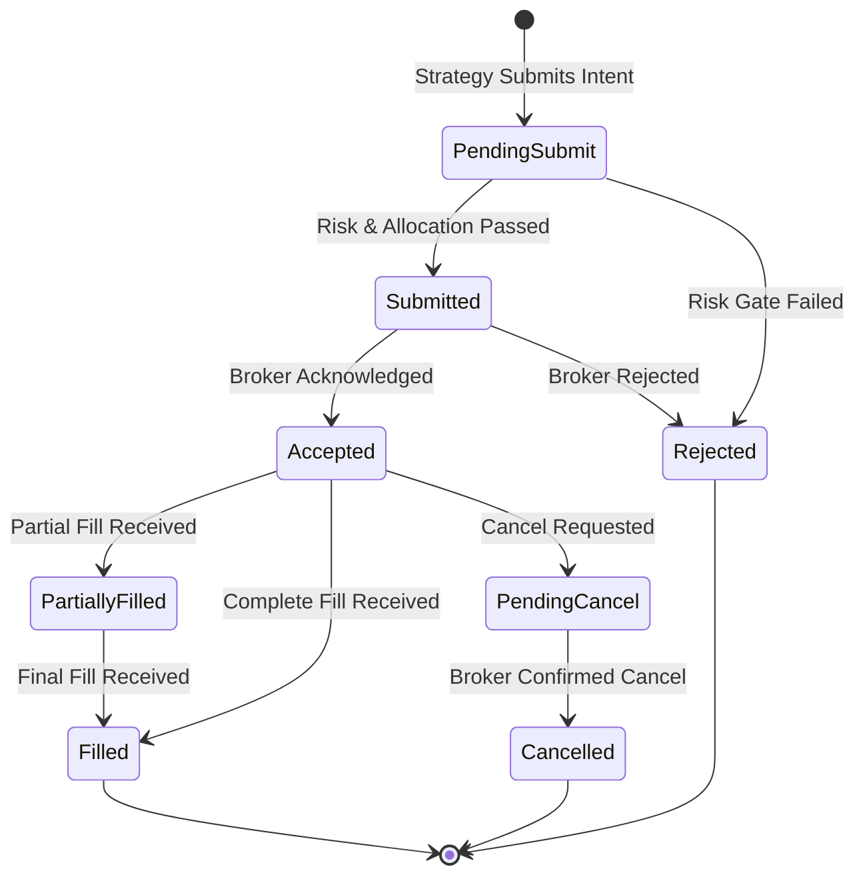

# Production Architecture Specification: Trade_XV2 (Option 1 - Unified Engine)

**Date:** 2026-07-22  
**Target:** Trade_XV2 Enterprise Algorithmic Trading System  
**Architecture Model:** Unified Event-Driven Architecture (Nautilus-Style Execution Parity)

---

## 1. Executive Summary & Core Principles

The primary objective of this architecture design is to evolve **Trade_XV2** from a multi-engine prototype into a standardized, production-ready algorithmic trading platform. 

### Core Principles
1. **Zero Backtest-to-Live Parity Drift:** A single, unified `Strategy` base class and `ExecutionEngine` logic run identically across **Backtest**, **Historical Replay**, **Paper Trading**, and **Live Execution**.
2. **Data Lake as First-Class Authority:** The **DuckDB + Parquet Data Lake** (`src/datalake/`) serves as the single source of truth for historical market data, tick replay, scanner screening, and offline quantitative analysis.
3. **Deterministic State Machine (FSM):** All order and position lifecycles are governed by lock-free, audit-logged Finite State Machines (`OrderFSM` and `PositionBook`).
4. **Explicit Domain Boundaries:** Clean Hexagonal Architecture where `src/domain/` remains 100% pure (0.0% cross-module coupling), surrounded by Application Use-Cases, Infrastructure Adapters, and Presentation APIs.
5. **Business-Value Testing:** Testing strategies focus on empirical financial correctness (PnL calculation accuracy, fill/slippage verification, margin boundary checks) rather than redundant structural tests.

---

## 2. System Architecture & Module Boundaries

```mermaid
graph TD
    subgraph Layer 4: Presentation & Consumers
        API["FastAPI REST / WebSocket Gateway<br/>(src/interface/api)"]
        TUI["Textual TUI / CLI<br/>(src/interface/ui)"]
        SDK["Python Public SDK<br/>(src/tradex)"]
    end

    subgraph Layer 3: Application & Strategy Core
        STRAT["Strategy Base Class<br/>(on_bar, on_quote, on_order, on_fill)"]
        ENGINE["Unified Execution Engine<br/>(EngineContext & Event Dispatcher)"]
        SCANNER["Market Scanner & Dynamic Universe"]
        ALLOC["Portfolio & Fund Allocator<br/>(Capital Pools & Margin Rules)"]
    end

    subgraph Layer 2: Domain Layer (Pure 0.0% Coupling)
        DOM_MODEL["Domain Entities<br/>(Order, Position, Instrument, Quote, Bar)"]
        FSM["Order & Position FSM<br/>(State Transitions & Validations)"]
        RISK["Pre-Trade Risk Policies<br/>(Drawdown, Max Order Size, Slicing)"]
    end

    subgraph Layer 1: Infrastructure & Data
        DL["Data Lake Engine<br/>(DuckDB + Parquet + Ingestion API)"]
        COORDINATOR["Federated Data Coordinators<br/>(Historical & Batch Quote Coordinators)"]
        BROKERS["Broker Gateways<br/>(Dhan, Upstox, Paper Sim)"]
    end

    API --> ENGINE
    TUI --> ENGINE
    SDK --> ENGINE

    ENGINE --> STRAT
    ENGINE --> ALLOC
    ENGINE --> SCANNER

    STRAT --> DOM_MODEL
    ENGINE --> FSM
    ALLOC --> RISK

    ENGINE --> COORDINATOR
    COORDINATOR --> DL
    COORDINATOR --> BROKERS
```

---

## 3. Data Lake Integration & Market Data Ingestion Pipeline

The **Data Lake** (`src/datalake/`) provides high-throughput query capabilities and tick/bar replay:

```
src/datalake/
├── storage/            # Parquet files partitioned by exchange/symbol/date
├── engine/             # DuckDB embedded analytics engine
├── ingestion/          # Automatic broker tick & bar downloader
└── mcp/                # Model Context Protocol server for AI/LLM querying
```

### Data Flow Across Execution Modes



1. **Backtesting & Historical Replay Mode:**
   * The `EngineContext` attaches a `DataLakeReader` that streams historical Parquet candles from DuckDB in chronological order.
   * Timestamps are driven by a simulated `DeterministicClock`.
2. **Live Execution & Paper Mode:**
   * The `EngineContext` attaches a `StreamOrchestrator` listening to live WebSocket tick feeds (Dhan/Upstox).
   * Missing historical bars (e.g. at startup or after network disconnects) are automatically fetched via `HistoricalDataCoordinator` from the Data Lake or Broker APIs to fill data gaps.

---

## 4. Strategy & Scanner Engine: Zero-Parity Framework

Strategies inherit from a single canonical base class:

```python
class Strategy(ABC):
    """Canonical Strategy base class running in Backtest, Replay, Paper, and Live modes."""
    
    def __init__(self, config: StrategyConfig, context: EngineContext) -> None:
        self.config = config
        self.context = context
        self.portfolio = context.portfolio
        self.risk = context.risk

    @abstractmethod
    async def on_bar(self, bar: HistoricalBar) -> None:
        """Called on every candle completion."""
        ...

    @abstractmethod
    async def on_quote(self, quote: Quote) -> None:
        """Called on every tick / quote snapshot."""
        ...

    @abstractmethod
    async def on_fill(self, fill: ExecutionContract) -> None:
        """Called on every order fill."""
        ...

    def submit_order(self, intent: OrderIntent) -> OrderId:
        """Submits an order through the unified execution engine."""
        return self.context.submit_order(intent)
```

### Scanner & Dynamic Universe
* **Dynamic Scanners (`analytics/scanner/`):** Periodically execute SQL queries over the DuckDB Data Lake or live quote snapshots to screen top momentum candidates (e.g. top 5 MCX commodity options or NIFTY strike spikes).
* **Dynamic Subscription:** When a scanner identifies a candidate, it requests the `EngineContext` to dynamically subscribe to that symbol's quote stream without restarting the strategy engine.

---

## 5. State Management, Order FSM & Position Book

Order and Position state transitions are strictly governed by explicit Finite State Machines.



* **Position Book (`PositionBook`):** Real-time aggregation of fills into position lots, calculating exact Realized PnL, Unrealized PnL, Average Entry Price, and Total Exposure.
* **Idempotency & Reconciliation:** Every order contains an immutable `client_order_id` (UUIDv4). The engine reconciles local FSM state against broker order books asynchronously.

---

## 6. Portfolio & Fund Allocation Engine

To prevent strategy over-leveraging and manage capital safety:

1. **Strategy Capital Pools:** Each strategy instance is allocated a fixed or percentage-based capital allocation (e.g., ₹5,00,000 for MCX Crude Oil Scalper).
2. **Pre-Trade Margin Gate:** Before an `OrderIntent` transitions to `Submitted`, the `FundAllocator` calculates required initial margin against available broker balance.
3. **Global Portfolio Risk Policy:**
   * **Max Daily Loss Limit:** Automatically halts trading if total daily loss exceeds ₹25,000.
   * **Max Open Position Cap:** Limits max simultaneous option lots.
   * **Order Slicing:** Automatically splits order quantities exceeding NSE/MCX freeze limits (e.g., > 1,800 contracts for NIFTY options).

---

## 7. Testing & Business-Value Verification Strategy

Testing moves away from testing internal structural implementation details and focuses strictly on **Financial & Business Correctness**:

```
tests/
├── unit/
│   ├── domain/         # Domain entity & FSM state transition correctness
│   └── data/           # Chunk planning, merging, and gap detection accuracy
├── integration/
│   ├── execution/      # Zero-parity test (same strategy output in Backtest vs Paper)
│   ├── risk/           # Pre-trade margin exhaustion & daily max loss triggering
│   └── datalake/       # DuckDB analytical query accuracy & Parquet ingestion
└── performance/
    └── latency/        # Order placement FSM overhead (<5ms) & batch quote throughput
```

### Verification Criteria Before Production Release
1. **Zero-Parity Verification Test:** Run a test strategy over 30 days of historical MCX data in **Backtest mode** and **Replay mode**. Assert that executed trades, fill prices, and final PnL match with 100% precision.
2. **SLA & Latency Benchmark:** Order FSM state transition overhead must be **< 5ms** per order.
3. **Data Parity:** DuckDB Data Lake queries for candles match live broker HTTP responses exactly.

---

## 8. Code Organization Cleanup Roadmap

To eliminate identified technical debt (ref: `ARCHITECTURAL_AUDIT_PHASES_3-5.md`):

1. **Delete Duplicated Simulation Code:** Merge `analytics/paper/` and `analytics/replay/` into a single `application/simulation/` module.
2. **Clean Domain Types:** Standardize all `Side` enums to `domain.enums.Side` and elevate `PositionSide` to `domain/enums.py`.
3. **Decouple Runtime Circular Dependencies:** Move `runtime.production_config` into `config/schema.py` and enforce Dependency Injection via `src/runtime/` composition root.

---

## 9. Next Action

This design spec has been written to `docs/superpowers/specs/2026-07-22-production-platform-design.md`.

Please review this design specification. Once approved, we will invoke `writing-plans` to generate the step-by-step implementation plan.
