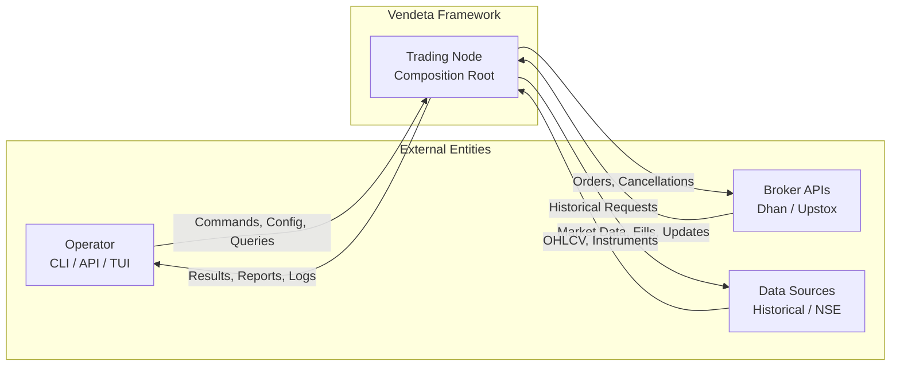

# 01 — Introduction & Vision

**Version:** 1.0  
**Status:** Draft  
**Last Updated:** 2026-07-22  
**Related:** [02-Architecture](./02-architecture-overview.md), [23-Framework vs Application](./23-framework-vs-application.md)

---

## 1. Overview

### Purpose

Vendeta is a **professional, high-performance, event-driven trading framework** designed for algorithmic trading on Indian exchanges (NSE, BSE, MCX). It is inspired by [NautilusTrader](https://github.com/nautechsystems/nautilus_trader)'s architecture but tailored for:

- **Single-trader/personal use** — not institutional multi-tenant
- **Indian market microstructure** — NSE/BSE equities, F&O, MCX commodities
- **Rust implementation** — memory safety, zero-cost abstractions, no GC pauses
- **Modular monolith** — single binary deployment with clear crate boundaries

### Scope

This document defines:
- The framework's philosophical foundation
- Seven core design principles
- Target users and use cases
- Comparison with NautilusTrader
- High-level system context
- Success criteria

### What Vendeta Is

| Aspect | Description |
|--------|-------------|
| **Type** | Trading *framework* (not application) — users plug in strategies |
| **Language** | Rust (core), Python bindings via PyO3 (future) |
| **Markets** | NSE, BSE, MCX (extensible to any market) |
| **Modes** | Live trading, paper trading, backtesting, replay |
| **Deployment** | Single binary, Docker container, systemd service |
| **Brokers** | Dhan, Upstox (pluggable adapter architecture) |

### What Vendeta Is NOT

- Not a microservices platform
- Not a multi-tenant SaaS
- Not a GUI application (API-first, headless)
- Not a high-frequency trading system (millisecond, not microsecond)
- Not a general-purpose event processing framework

---

## 2. Design Principles

### The Seven Pillars

#### 1. Message-Driven Everything

All communication between components flows through a **typed message bus**. No direct method calls between subsystems.

```rust
// Components publish events
bus.publish(MarketEvent::Quote { at: timestamp, quote });

// Components subscribe to events
bus.subscribe(|event: &MarketEvent| {
    // handle event
});
```

**Rationale:**
- Easy testing (inject fake bus)
- Easy parallelism (components run independently)
- Easy replay (replay message log to rebuild state)
- Easy monitoring (bus is the single observability point)
- Loose coupling (components don't know about each other)

#### 2. Component Model

Every processing node (DataEngine, ExecutionEngine, Portfolio, Risk) is a **Component** with a well-defined lifecycle interface.

```rust
pub trait Component: Send {
    fn id(&self) -> ComponentId;
    fn name(&self) -> &str;
    fn init(&mut self, ctx: &mut ComponentContext);
    fn start(&mut self, ctx: &mut ComponentContext);
    fn stop(&mut self, ctx: &mut ComponentContext);
    fn reset(&mut self, ctx: &mut ComponentContext);
}
```

**Rationale:**
- Testable in isolation
- Composable (mix and match components)
- Reusable across modes (live, backtest, paper)
- Observable (health checks, metrics)

#### 3. Deterministic Replay

Backtest is a **first-class citizen**, not an afterthought. Every event is timestamped and reproducible.

```rust
// Same strategy, same data → same results, every time
let result_1 = backtest_engine.run(&strategy, &data);
let result_2 = backtest_engine.run(&strategy, &data);
assert_eq!(result_1.pnl, result_2.pnl); // Guaranteed
```

**Rationale:**
- Debug production issues by replaying exact market conditions
- Validate strategy changes against historical data
- Build confidence before deploying to live

#### 4. Zero-Allocation Hot Paths

Critical paths (order placement, fill processing, tick handling) minimize heap allocation.

```rust
// Price is Copy (stack-only, no heap)
#[derive(Clone, Copy)]
pub struct Price(i64); // Fixed-point: value × 10_000

// Bar is Copy (7 fields, all stack)
#[derive(Clone, Copy)]
pub struct Bar {
    pub instrument: InstrumentId,
    pub timeframe: Timeframe,
    pub open_time: Timestamp,
    pub open: Price,
    pub high: Price,
    pub low: Price,
    pub close: Price,
    pub volume: u64,
}
```

**Rationale:**
- Predictable latency (no GC pauses)
- Cache-friendly (contiguous memory)
- Suitable for real-time trading

#### 5. Multi-Asset, Multi-Market

Not limited to Indian equities. The framework supports:
- Equities (NSE, BSE)
- Futures & Options (NSE F&O)
- Commodities (MCX)
- Extensible to Forex, US markets, crypto

```rust
pub enum Exchange { Nse, Bse, Mcx, /* extensible */ }
pub enum Segment { Equity, Fno, Commodity, Currency, /* extensible */ }
pub enum InstrumentType { Stock, Index, Future, Option, /* extensible */ }
```

#### 6. Type Safety First

Rust's type system eliminates entire categories of bugs at compile time:
- No null pointer exceptions (`Option<T>`)
- No data races (`Send + Sync` bounds)
- No use-after-free (ownership system)
- No invalid states (enum + pattern matching)

```rust
// Invalid prices are rejected at construction
impl Price {
    pub fn from_f64(value: f64) -> Result<Self, PriceError> {
        if value.is_nan() || value.is_infinite() || value < 0.0 {
            return Err(PriceError::Invalid(value));
        }
        Ok(Price((value * 10_000.0) as i64))
    }
}
```

#### 7. Observability Built-In

Metrics, tracing, and audit are **structural**, not added later.

```rust
// Every message is traced
#[tracing::instrument(skip(bus))]
fn publish(&self, bus: &MessageBus, event: MarketEvent) {
    tracing::info!(?event, "publishing market event");
    bus.publish(event);
}
```

---

## 3. Requirements

### Functional Requirements

| ID | Requirement | Priority |
|----|-------------|----------|
| FR-01 | Support live trading via broker adapters (Dhan, Upstox) | P0 |
| FR-02 | Support paper trading with simulated fills | P0 |
| FR-03 | Support deterministic backtesting with historical data | P0 |
| FR-04 | Same strategy code runs in all modes (zero-parity) | P0 |
| FR-05 | Pre-trade risk checks (position limits, loss limits) | P0 |
| FR-06 | Real-time market data via WebSocket | P0 |
| FR-07 | Historical data fetch and local caching | P1 |
| FR-08 | Bar aggregation (1m, 5m, 15m, 1h, 1d) | P1 |
| FR-09 | REST API for monitoring and control | P1 |
| FR-10 | WebSocket API for real-time updates | P1 |
| FR-11 | Scanner/screener for multi-symbol analysis | P2 |
| FR-12 | Execution algorithms (TWAP, VWAP, Iceberg) | P2 |
| FR-13 | Python bindings via PyO3 | P3 |

### Non-Functional Requirements

| ID | Requirement | Target |
|----|-------------|--------|
| NFR-01 | Order submission latency | < 5ms (framework overhead) |
| NFR-02 | Tick-to-strategy latency | < 1ms |
| NFR-03 | Memory footprint (idle) | < 100MB |
| NFR-04 | Startup time | < 2s |
| NFR-05 | Crash recovery | < 5s (state reconstruction) |
| NFR-06 | Uptime | 99.9% during market hours |
| NFR-07 | Test coverage | > 85% |

---

## 4. NautilusTrader Comparison

| Aspect | NautilusTrader | Vendeta |
|--------|---------------|---------|
| **Language** | Python + Cython/Rust core | Pure Rust |
| **Target** | Institutional, multi-asset | Personal, Indian markets |
| **Complexity** | Very high (100k+ LOC) | Moderate (focused) |
| **Backtest** | First-class, event-driven | First-class, event-driven |
| **Live** | Multi-broker, multi-venue | Dhan, Upstox (pluggable) |
| **Data** | Multiple vendors | Broker APIs + local cache |
| **Deployment** | Complex (Docker, Redis) | Simple (single binary) |
| **Learning curve** | Steep | Moderate |
| **Philosophy** | Maximum flexibility | Focused simplicity |

### What We Adopt from NautilusTrader

1. **Component-based architecture** — Every processing node is a Component
2. **Message bus** — All communication via typed messages
3. **Clock abstraction** — Time is injected, not global
4. **Zero-parity** — Same code in backtest and live
5. **Event sourcing** — State reconstructed from events
6. **Capability model** — Brokers declare supported features

### What We Simplify

1. **No multi-venue routing** — Single broker per session
2. **No portfolio-level optimization** — Strategy-level decisions
3. **No distributed deployment** — Single machine
4. **No custom serialization** — Standard serde
5. **No actor framework** — Simple component model

---

## 5. System Context

### Context Diagram



### Key Interactions

| Interaction | Protocol | Direction | Frequency |
|-------------|----------|-----------|-----------|
| Market data | WebSocket | Broker → Vendeta | Continuous (ticks) |
| Order placement | REST/HTTP | Vendeta → Broker | On signal |
| Order updates | WebSocket | Broker → Vendeta | On state change |
| Position sync | REST/HTTP | Vendeta → Broker | Periodic / on-demand |
| Historical data | REST/HTTP | Vendeta → Broker | On-demand |
| Operator control | REST + WS | Bidirectional | On-demand |

---

## 6. Target Users

### Primary: Algorithmic Trader (Personal)

- Trades own capital on NSE/BSE
- Develops strategies in Rust (or Python via bindings)
- Runs backtests before going live
- Monitors positions via API/dashboard
- Values reliability over speed

### Secondary: Strategy Developer

- Writes strategy logic without framework internals knowledge
- Uses simple trait interface: `on_bar()`, `on_quote()`, `signal()`
- Tests strategies in backtest mode
- Deploys to paper trading before live

### Tertiary: Adapter Developer

- Adds new broker support
- Implements `BrokerGateway` trait
- Handles broker-specific authentication, message formats
- Tests against broker sandbox

---

## 7. Use Cases

### UC-01: Run a Backtest

```
Actor: Strategy Developer
Precondition: Historical data available in Parquet
Flow:
  1. Developer writes strategy implementing Strategy trait
  2. Developer configures backtest (instruments, date range, capital)
  3. Framework loads historical data
  4. Framework replays data through BacktestClock
  5. Strategy receives bars/quotes, emits signals
  6. ExecutionEngine processes signals (simulated fills)
  7. Framework produces analytics (PnL, Sharpe, drawdown)
Postcondition: BacktestResult with full trade log
```

### UC-02: Live Trading Session

```
Actor: Algorithmic Trader
Precondition: Broker credentials configured
Flow:
  1. Trader starts TradingNode with live config
  2. Framework authenticates with broker
  3. Framework connects to market data WebSocket
  4. Framework subscribes to configured instruments
  5. Strategy receives real-time data, emits signals
  6. RiskEngine validates signals
  7. ExecutionEngine routes orders to broker
  8. Framework tracks positions, P&L in real-time
  9. Trader monitors via REST API
Postcondition: Clean shutdown, state persisted
```

### UC-03: Paper Trading

```
Actor: Strategy Developer
Precondition: Strategy tested in backtest
Flow:
  1. Developer starts TradingNode with paper config
  2. Framework connects to live market data (real quotes)
  3. Strategy receives real-time data
  4. Signals processed by PaperGateway (simulated fills)
  5. Developer validates strategy behavior in real-time
Postcondition: Confidence to deploy live
```

---

## 8. Success Criteria

| Metric | Target | Measurement |
|--------|--------|-------------|
| Strategy parity | 100% identical signals in backtest/live | Parity tests |
| Order reliability | 0 lost orders | Idempotency + reconciliation |
| Risk enforcement | 100% pre-trade checks | No bypass path |
| Crash recovery | Full state reconstruction | Event sourcing |
| Test coverage | > 85% line coverage | CI enforcement |
| Documentation | All public APIs documented | rustdoc |

---

## 9. Implementation Status

| Component | Status | Crate |
|-----------|--------|-------|
| Core domain types | ✅ Implemented | `vendeta-core` |
| Message bus | ✅ Implemented | `vendeta-bus` |
| Clock abstraction | ✅ Implemented | `vendeta-bus` |
| Component lifecycle | ✅ Implemented | `vendeta-engine` |
| TradingNode | ✅ Implemented | `vendeta-engine` |
| BrokerGateway trait | ✅ Implemented | `vendeta-gateway` |
| Dhan adapter | ✅ Implemented | `vendeta-adapters/dhan` |
| Upstox adapter | ✅ Implemented | `vendeta-adapters/upstox` |
| Paper trading | ✅ Implemented | `vendeta-paper` |
| Risk controls | ✅ Implemented | `vendeta-engine` |
| Strategy framework | ✅ Implemented | `vendeta-engine` |
| Backtest engine | ✅ Implemented | `vendeta-backtest` |
| REST/WS API | ✅ Implemented | `vendeta-api` |
| Storage layer | ✅ Implemented | `vendeta-store` |
| Scanner | ✅ Implemented | `vendeta-scanner` |
| Indicators | ✅ Implemented | `vendeta-indicators` |
| Python bindings | 🔲 Planned | `vendeta-py` |

---

## 10. Cross-References

- [02-Architecture Overview](./02-architecture-overview.md) — Detailed component architecture
- [03-Project Structure](./03-project-structure.md) — Crate organization
- [23-Framework vs Application](./23-framework-vs-application.md) — Why framework, not application
- [24-Migration Path](./24-migration-path.md) — Evolution from current codebase
