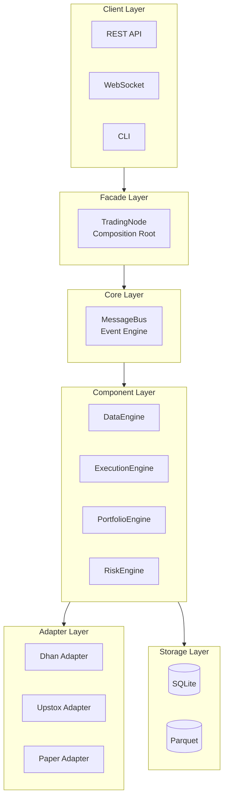
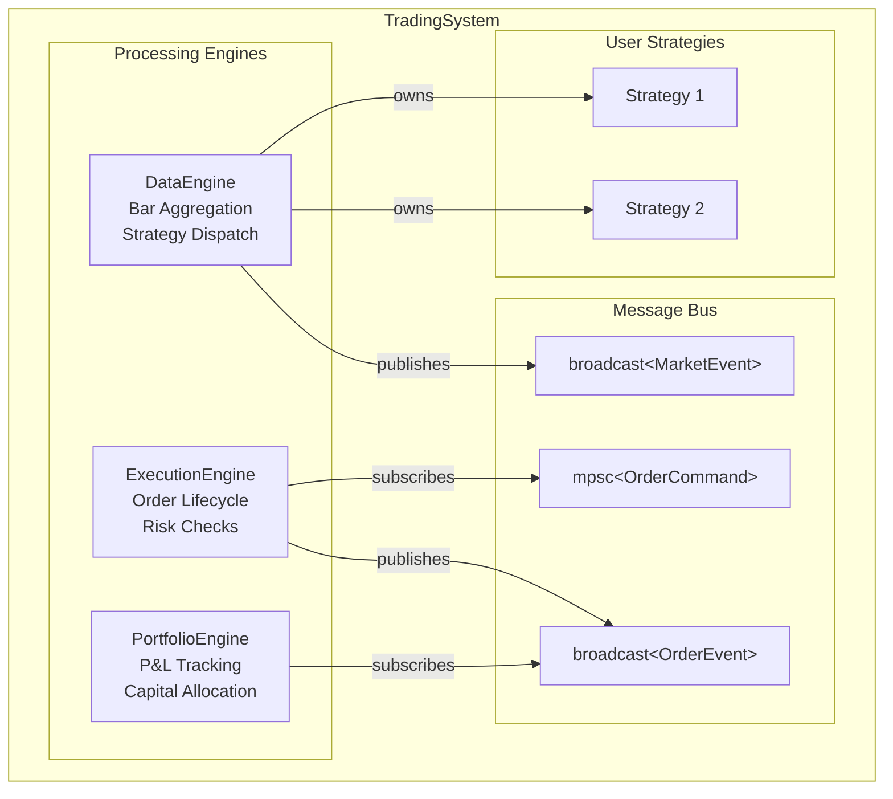
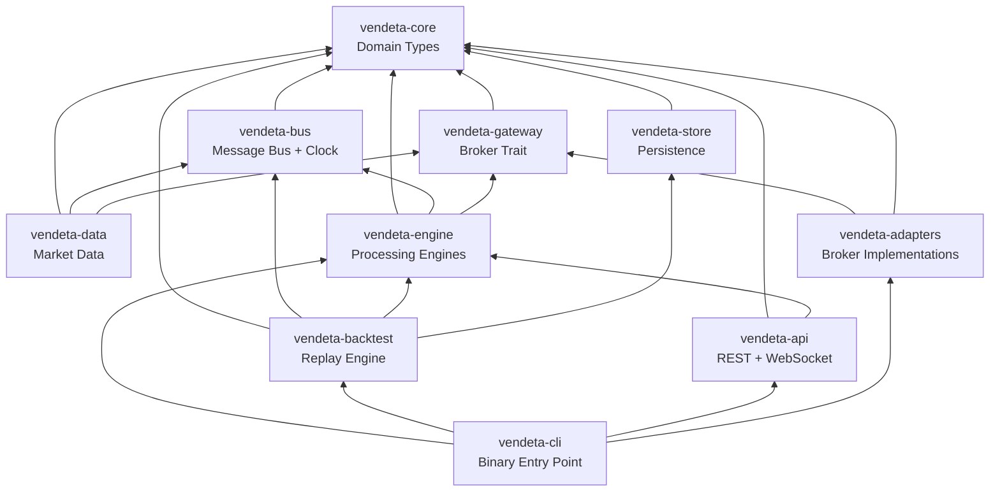
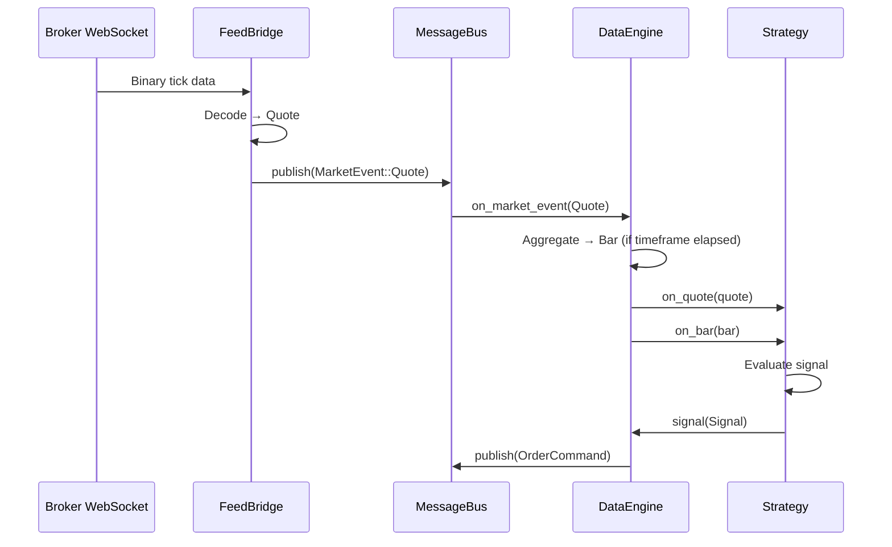
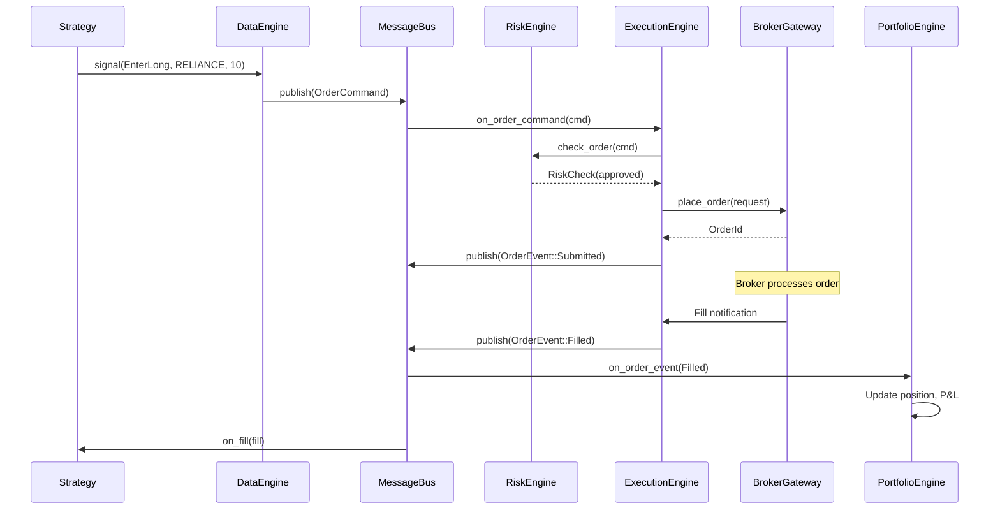

# 02 — Architecture Overview

**Version:** 1.0  
**Status:** Draft  
**Last Updated:** 2026-07-22  
**Related:** [01-Introduction](./01-introduction-vision.md), [03-Project Structure](./03-project-structure.md), [04-Message Bus](./04-message-driven-architecture.md)

---

## 1. Overview

### Purpose

This document defines the high-level architecture of the Vendeta trading framework. It establishes the component-based, event-driven design that enables zero-parity between backtest and live trading.

### Architectural Style

Vendeta follows a **component-based event-driven architecture** with these characteristics:

| Characteristic | Implementation |
|----------------|----------------|
| **Communication** | Typed message bus (no direct calls between components) |
| **Composition** | Components wired at startup via TradingNode |
| **State** | Event-sourced (all changes are events) |
| **Time** | Injected via Clock trait (real or simulated) |
| **Concurrency** | Async (tokio) for I/O, sync for hot paths |
| **Deployment** | Modular monolith (single binary) |

### Key Architectural Decisions

| Decision | Rationale |
|----------|-----------|
| Modular monolith over microservices | Single trader, single machine — microservices add complexity without benefit |
| Message bus over direct calls | Enables replay, testing, monitoring, loose coupling |
| Clock injection over system time | Enables deterministic backtesting |
| Fixed-point over floating-point | Eliminates rounding errors in financial calculations |
| Event sourcing over CRUD | Enables state reconstruction, audit trail, replay |
| Rust over Python | Memory safety, zero-cost abstractions, no GC pauses |

---

## 2. Requirements

### Functional

- All components communicate via message bus
- Components have well-defined lifecycle (init → start → stop → reset)
- Same components run in live and backtest modes
- State can be reconstructed from event log
- New brokers can be added without modifying core

### Non-Functional

- Sub-millisecond tick-to-strategy latency
- Zero heap allocation in hot paths
- Single binary deployment
- < 2s startup time
- Graceful degradation on component failure

---

## 3. High-Level Architecture

### System Layers



### Component Composition



---

## 4. Core Principles

### 4.1 Component-Based Design

Every processing node is a **Component** with:
- Unique identifier
- Well-defined lifecycle
- Message handlers (on_market_event, on_order_event)
- Health check capability

```rust
pub trait Component: Send {
    fn id(&self) -> ComponentId;
    fn name(&self) -> &str;
    fn init(&mut self, ctx: &mut ComponentContext);
    fn start(&mut self, ctx: &mut ComponentContext);
    fn stop(&mut self, ctx: &mut ComponentContext);
    fn reset(&mut self, ctx: &mut ComponentContext);
    
    fn on_market_event(&mut self, event: &MarketEvent, ctx: &mut ComponentContext) {}
    fn on_order_event(&mut self, event: &OrderEvent, ctx: &mut ComponentContext) {}
}
```

**Important:** Strategies are NOT Components. They implement the `Strategy` trait and are owned by DataEngine. This keeps strategies simple and focused on alpha logic.

### 4.2 Event-Driven Communication

All state changes are events. Components publish events to the bus and subscribe to events they care about.

```rust
// Market events (fan-out via broadcast)
pub enum MarketEvent {
    Quote { at: Timestamp, quote: Quote },
    Bar { at: Timestamp, bar: Bar },
    Depth { at: Timestamp, depth: Depth },
}

// Order events (commands via mpsc, updates via broadcast)
pub enum OrderEvent {
    Submitted { at: Timestamp, symbol: Symbol, side: Side, quantity: Quantity },
    Accepted { at: Timestamp, order_id: OrderId, symbol: Symbol },
    Rejected { at: Timestamp, order_id: OrderId, reason: String },
    Filled { at: Timestamp, order_id: OrderId, symbol: Symbol, side: Side, quantity: Quantity, price: Price },
    Cancelled { at: Timestamp, order_id: OrderId, reason: String },
}
```

### 4.3 Clock Abstraction

Time is injected, not global. This enables deterministic backtesting.

```rust
pub trait Clock: Send + Sync {
    fn now_nanos(&self) -> i64;
    fn now(&self) -> Timestamp {
        Timestamp::from_nanos(self.now_nanos())
    }
}

// Live: real time
pub struct LiveClock;

// Backtest: simulated time
pub struct BacktestClock {
    current: AtomicI64,
}
```

### 4.4 Source-Agnostic Data

Data and execution are behind traits. This enables:
- Multiple brokers (Dhan, Upstox)
- Test doubles (Paper, Simulated)
- Future vendors (add without modifying core)

```rust
pub trait BrokerGateway: Send + Sync {
    fn name(&self) -> &str;
    fn capabilities(&self) -> &BrokerCapabilities;
    fn place_order(&self, request: &OrderRequest) -> GatewayResult<OrderId>;
    fn cancel_order(&self, order_id: &OrderId) -> GatewayResult<()>;
    fn positions(&self) -> GatewayResult<Vec<Position>>;
    // ... more methods
}
```

---

## 5. Anti-Principles

What we deliberately **avoid**:

| Anti-Principle | Rationale |
|----------------|-----------|
| **No microservices** | Single trader, single machine. Adds complexity without benefit. |
| **No speculative abstractions** | Only abstract when we have 2+ concrete implementations. |
| **No global state** | All state owned by Components, accessed via messages. |
| **No hidden I/O** | All I/O explicit and injectable. No surprise network calls in strategy code. |
| **No floating-point prices** | Fixed-point i64 only. No `f64` for money. |
| **No inheritance hierarchies** | Composition over inheritance. Traits, not base classes. |
| **No premature optimization** | Measure first, optimize second. Except hot paths (those are designed for performance from the start). |

---

## 6. Dependency Rules

### Crate Dependency Graph



### Dependency Rules Table

| Crate | May Depend On | Must NOT Depend On |
|-------|---------------|-------------------|
| `vendeta-core` | (none) | Everything else |
| `vendeta-bus` | core | engine, adapters, api |
| `vendeta-gateway` | core | bus, engine, adapters |
| `vendeta-store` | core | bus, engine, adapters |
| `vendeta-data` | core, bus, gateway | engine, adapters |
| `vendeta-engine` | core, bus, gateway | adapters, api |
| `vendeta-adapters` | gateway, core | engine, bus, api |
| `vendeta-backtest` | core, bus, engine, store | adapters, api |
| `vendeta-api` | core, engine | adapters, backtest |
| `vendeta-cli` | (all) | — |

### Enforcement

The `vendeta-arch` crate contains compile-time tests that verify these rules:

```rust
// crates/vendeta-arch/tests/dependency_rules.rs
#[test]
fn core_has_no_vendeta_dependencies() {
    // Verify vendeta-core Cargo.toml has no path dependencies
}

#[test]
fn engine_does_not_depend_on_adapters() {
    // Verify vendeta-engine cannot import vendeta-adapters
}
```

---

## 7. Data Flow

### Market Data Flow



### Order Flow



---

## 8. Configuration

### Architecture Configuration Schema

```yaml
# config/architecture.yaml
architecture:
  # Message bus configuration
  bus:
    broadcast_capacity: 256
    command_capacity: 128
    
  # Component lifecycle
  lifecycle:
    startup_timeout_secs: 30
    shutdown_timeout_secs: 10
    health_check_interval_secs: 5
    
  # Clock configuration
  clock:
    type: "live"  # "live" | "backtest"
    
  # Storage configuration
  storage:
    sqlite_path: "./data/vendeta.db"
    parquet_path: "./data/market_data/"
```

---

## 9. Error Handling

### Error Hierarchy

```rust
/// Top-level framework error
pub enum FrameworkError {
    /// Component lifecycle error
    Lifecycle(ComponentError),
    /// Message bus error
    Bus(BusError),
    /// Configuration error
    Config(ConfigError),
    /// Gateway/broker error
    Gateway(GatewayError),
    /// Storage error
    Storage(StorageError),
}

/// Component-specific errors
pub enum ComponentError {
    /// Component failed to initialize
    InitFailed { component: String, reason: String },
    /// Component failed to start
    StartFailed { component: String, reason: String },
    /// Component health check failed
    Unhealthy { component: String, reason: String },
}
```

### Error Handling Strategy

| Error Type | Strategy | Recovery |
|------------|----------|----------|
| Configuration | Fail fast at startup | Fix config, restart |
| Broker connection | Retry with backoff | Automatic reconnect |
| Order rejection | Log + notify strategy | Strategy decides |
| Component failure | Stop component, alert | Manual intervention |
| Data gap | Log + continue | Fetch historical |

---

## 10. Testing Requirements

### Architecture Tests

```rust
// Verify dependency rules
#[test]
fn verify_crate_dependencies() {
    // Parse Cargo.toml files
    // Assert no forbidden dependencies
}

// Verify component isolation
#[test]
fn components_communicate_only_via_bus() {
    // Static analysis: no direct component-to-component imports
}
```

### Integration Tests

```rust
// Verify message flow
#[tokio::test]
async fn market_data_flows_to_strategies() {
    let bus = MessageBus::new(256);
    let data_engine = DataEngine::new(bus.clone());
    let strategy = TestStrategy::new();
    
    // Publish quote
    bus.publish(MarketEvent::Quote { at: ts, quote });
    
    // Verify strategy received it
    assert!(strategy.received_quote());
}
```

---

## 11. Implementation Notes

### Patterns Used

| Pattern | Where | Why |
|---------|-------|-----|
| **Observer** | MessageBus pub/sub | Loose coupling |
| **Strategy** | BrokerGateway trait | Pluggable brokers |
| **Factory** | ComponentFactory | Config-driven construction |
| **State Machine** | Order lifecycle | Well-defined transitions |
| **Repository** | EventLog, PositionStore | Persistence abstraction |
| **Adapter** | Dhan/Upstox adapters | Broker-specific translation |

### Conventions

1. **Naming**: Components end with `Engine` (DataEngine, ExecutionEngine)
2. **Error types**: Each crate has its own error enum in `errors.rs`
3. **Async**: Use `#[async_trait]` for async trait methods
4. **Testing**: Each module has `#[cfg(test)] mod tests`
5. **Documentation**: All public items have `///` doc comments

---

## 12. Cross-References

- [01-Introduction](./01-introduction-vision.md) — Vision and principles
- [03-Project Structure](./03-project-structure.md) — Detailed crate layout
- [04-Message Bus](./04-message-driven-architecture.md) — Bus implementation
- [05-Component Lifecycle](./05-component-lifecycle.md) — Component model details
