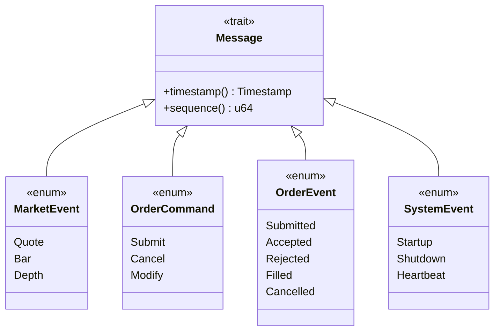
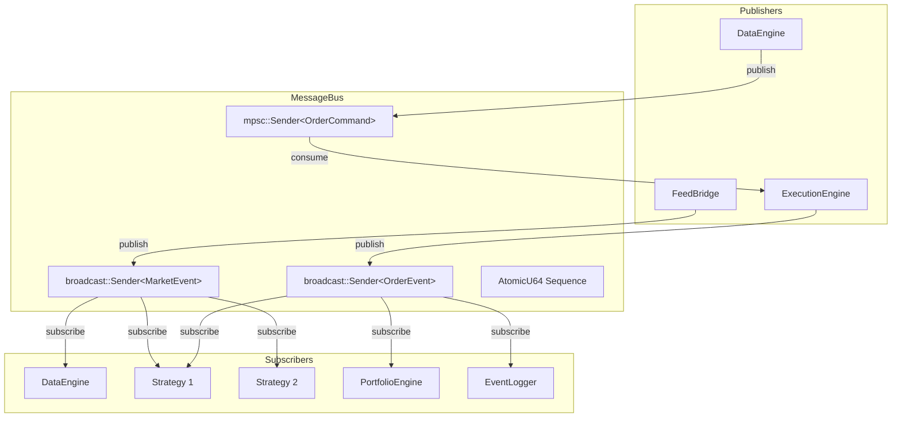
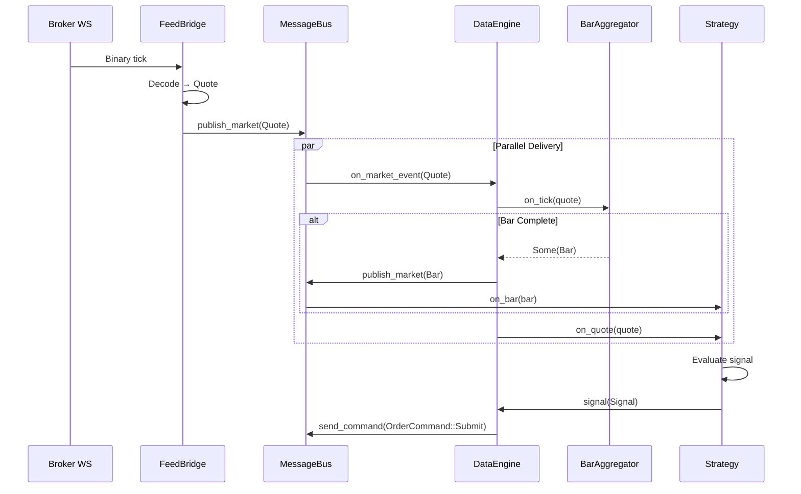
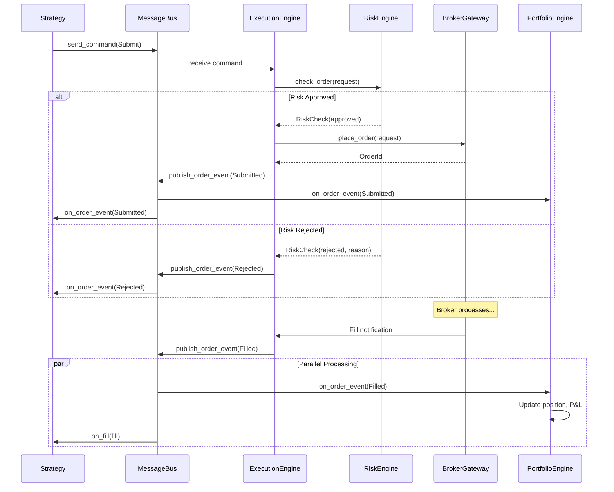

# 04 — Message-Driven Architecture

**Version:** 1.0  
**Status:** Draft  
**Last Updated:** 2026-07-22  
**Related:** [02-Architecture](./02-architecture-overview.md), [05-Component Lifecycle](./05-component-lifecycle.md), [06-Execution Engine](./06-execution-engine.md)

---

## 1. Overview

### Purpose

The message bus is the **spinal cord** of the Vendeta framework. Every component publishes and subscribes to messages through it. No direct method calls between subsystems.

### Design Principles

| Principle | Implementation |
|-----------|----------------|
| **Typed messages** | All messages are Rust enums/structs, compile-time checked |
| **Async by default** | Subscribers run concurrently via tokio |
| **Backpressure** | Bounded channels prevent memory exhaustion |
| **Replay capable** | Message log can be replayed for backtesting |
| **Observable** | All messages can be traced/logged |
| **Ordered** | Global sequence numbering for ordering |

---

## 2. Requirements

### Functional

| ID | Requirement |
|----|-------------|
| FR-01 | Publish market events to multiple subscribers (fan-out) |
| FR-02 | Route order commands to single consumer (execution engine) |
| FR-03 | Broadcast order updates to multiple subscribers |
| FR-04 | Support message filtering by instrument/strategy |
| FR-05 | Maintain global sequence numbering |
| FR-06 | Support replay from persistent log |

### Non-Functional

| ID | Requirement | Target |
|----|-------------|--------|
| NFR-01 | Publish latency | < 10μs |
| NFR-02 | Delivery latency | < 100μs |
| NFR-03 | Throughput | > 100k messages/sec |
| NFR-04 | Memory per message | < 1KB |

---

## 3. Message Types

### Message Hierarchy



### Market Events (Fan-out via Broadcast)

```rust
/// Market data events — broadcast to all subscribers
#[derive(Clone, Debug)]
pub enum MarketEvent {
    /// Top-of-book quote update
    Quote {
        at: Timestamp,
        quote: Quote,
    },
    /// Completed OHLCV bar
    Bar {
        at: Timestamp,
        bar: Bar,
    },
    /// Order book depth update
    Depth {
        at: Timestamp,
        depth: Depth,
    },
}

/// Quote structure
#[derive(Clone, Copy, Debug)]
pub struct Quote {
    pub instrument: InstrumentId,
    pub ltp: Price,           // Last traded price
    pub open: Price,
    pub high: Price,
    pub low: Price,
    pub close: Price,         // Previous close
    pub volume: u64,
    pub oi: u64,              // Open interest
    pub bid: Option<Price>,
    pub ask: Option<Price>,
    pub at: Timestamp,
}

/// OHLCV bar
#[derive(Clone, Copy, Debug)]
pub struct Bar {
    pub instrument: InstrumentId,
    pub timeframe: Timeframe,
    pub open_time: Timestamp,
    pub open: Price,
    pub high: Price,
    pub low: Price,
    pub close: Price,
    pub volume: u64,
}
```

### Order Commands (Single Consumer via MPSC)

```rust
/// Order commands — routed to ExecutionEngine only
#[derive(Clone, Debug)]
pub enum OrderCommand {
    /// Submit a new order
    Submit {
        at: Timestamp,
        request: OrderRequest,
        strategy_id: StrategyId,
    },
    /// Cancel an existing order
    Cancel {
        at: Timestamp,
        order_id: OrderId,
        reason: String,
    },
    /// Modify an existing order
    Modify {
        at: Timestamp,
        order_id: OrderId,
        new_price: Option<Price>,
        new_quantity: Option<Quantity>,
    },
}

/// Order request from strategy
#[derive(Clone, Debug)]
pub struct OrderRequest {
    pub symbol: Symbol,
    pub side: Side,
    pub quantity: Quantity,
    pub order_type: OrderType,
    pub price: Option<Price>,
    pub trigger: Option<Price>,
    pub validity: TimeInForce,
    pub tag: String,
}
```

### Order Events (Fan-out via Broadcast)

```rust
/// Order lifecycle events — broadcast to portfolio, strategies, loggers
#[derive(Clone, Debug)]
pub enum OrderEvent {
    /// Order submitted to broker
    Submitted {
        at: Timestamp,
        order_id: OrderId,
        symbol: Symbol,
        side: Side,
        quantity: Quantity,
    },
    /// Order accepted by broker
    Accepted {
        at: Timestamp,
        order_id: OrderId,
        symbol: Symbol,
    },
    /// Order rejected
    Rejected {
        at: Timestamp,
        order_id: OrderId,
        reason: String,
    },
    /// Order filled (partial or full)
    Filled {
        at: Timestamp,
        order_id: OrderId,
        symbol: Symbol,
        side: Side,
        quantity: Quantity,
        price: Price,
        is_full: bool,
    },
    /// Order cancelled
    Cancelled {
        at: Timestamp,
        order_id: OrderId,
        reason: String,
    },
}
```

---

## 4. MessageBus Implementation

### Architecture



### Core Implementation

```rust
use std::sync::atomic::{AtomicU64, Ordering};
use std::sync::Arc;
use tokio::sync::{broadcast, mpsc};

/// Central message dispatcher for the framework.
///
/// All inter-component communication flows through the MessageBus.
/// - Market events: broadcast (fan-out to multiple subscribers)
/// - Order commands: mpsc (single consumer: ExecutionEngine)
/// - Order events: broadcast (fan-out to portfolio, strategies, loggers)
pub struct MessageBus {
    /// Market data event broadcaster
    market_tx: broadcast::Sender<MarketEvent>,
    /// Order command channel (single consumer)
    order_cmd_tx: mpsc::Sender<OrderCommand>,
    order_cmd_rx: Option<mpsc::Receiver<OrderCommand>>,
    /// Order event broadcaster
    order_evt_tx: broadcast::Sender<OrderEvent>,
    /// Global sequence counter
    sequence: AtomicU64,
}

impl MessageBus {
    /// Create a new MessageBus with specified channel capacities.
    pub fn new(broadcast_capacity: usize) -> Self {
        let (market_tx, _) = broadcast::channel(broadcast_capacity);
        let (order_cmd_tx, order_cmd_rx) = mpsc::channel(broadcast_capacity);
        let (order_evt_tx, _) = broadcast::channel(broadcast_capacity);
        
        MessageBus {
            market_tx,
            order_cmd_tx,
            order_cmd_rx: Some(order_cmd_rx),
            order_evt_tx,
            sequence: AtomicU64::new(0),
        }
    }

    /// Get next sequence number (monotonically increasing).
    pub fn next_sequence(&self) -> u64 {
        self.sequence.fetch_add(1, Ordering::Relaxed)
    }

    /// Publish a market event to all subscribers.
    pub fn publish_market(&self, event: MarketEvent) {
        // Ignore error if no receivers (backtest mode)
        let _ = self.market_tx.send(event);
    }

    /// Publish an order event to all subscribers.
    pub fn publish_order_event(&self, event: OrderEvent) {
        let _ = self.order_evt_tx.send(event);
    }

    /// Send an order command to the execution engine.
    pub async fn send_command(&self, cmd: OrderCommand) -> Result<(), BusError> {
        self.order_cmd_tx
            .send(cmd)
            .await
            .map_err(|_| BusError::CommandChannelClosed)
    }

    /// Subscribe to market events.
    pub fn subscribe_market(&self) -> broadcast::Receiver<MarketEvent> {
        self.market_tx.subscribe()
    }

    /// Subscribe to order events.
    pub fn subscribe_order_events(&self) -> broadcast::Receiver<OrderEvent> {
        self.order_evt_tx.subscribe()
    }

    /// Take the command receiver (only ExecutionEngine should call this).
    pub fn take_command_receiver(&mut self) -> Option<mpsc::Receiver<OrderCommand>> {
        self.order_cmd_rx.take()
    }
}
```

---

## 5. Message Routing

### Routing with Filters

```rust
/// Filtered message handler
pub struct FilteredHandler<F> {
    handler: Box<dyn Fn(&MarketEvent) + Send>,
    filter: F,
}

/// Route builder for selective subscription
pub struct RouteBuilder<'a> {
    bus: &'a MessageBus,
    instrument: Option<InstrumentId>,
    strategy: Option<StrategyId>,
}

impl<'a> RouteBuilder<'a> {
    /// Filter by instrument
    pub fn instrument(mut self, id: InstrumentId) -> Self {
        self.instrument = Some(id);
        self
    }

    /// Filter by strategy
    pub fn strategy(mut self, id: StrategyId) -> Self {
        self.strategy = Some(id);
        self
    }

    /// Complete the route registration
    pub fn to<F>(self, handler: F)
    where
        F: Fn(&MarketEvent) + Send + 'static,
    {
        let instrument = self.instrument;
        let mut rx = self.bus.subscribe_market();
        
        tokio::spawn(async move {
            while let Ok(event) = rx.recv().await {
                if let Some(ref inst) = instrument {
                    if event.instrument() != *inst {
                        continue;
                    }
                }
                handler(&event);
            }
        });
    }
}
```

### Routing Examples

```rust
// Route all market events to DataEngine
let mut rx = bus.subscribe_market();
tokio::spawn(async move {
    while let Ok(event) = rx.recv().await {
        data_engine.on_market_event(&event, &mut ctx).await;
    }
});

// Route fills for specific instrument to specific strategy
RouteBuilder::new(&bus)
    .instrument(InstrumentId::nse("RELIANCE"))
    .to(|event| strategy.on_fill(event));

// Route all order events to portfolio
let mut rx = bus.subscribe_order_events();
tokio::spawn(async move {
    while let Ok(event) = rx.recv().await {
        portfolio.on_order_event(&event, &mut ctx).await;
    }
});
```

---

## 6. Sequence Diagrams

### Market Data Flow



### Order Lifecycle Flow



---

## 7. Backpressure & Flow Control

### Channel Capacity

```rust
/// Recommended channel capacities
pub struct BusConfig {
    /// Market event broadcast capacity
    pub market_capacity: usize,    // Default: 256
    /// Order command channel capacity
    pub command_capacity: usize,   // Default: 128
    /// Order event broadcast capacity
    pub order_event_capacity: usize, // Default: 256
}
```

### Backpressure Strategy

| Channel Type | When Full | Strategy |
|--------------|-----------|----------|
| `broadcast<MarketEvent>` | Slow subscriber | Drop oldest (lagged receiver) |
| `mpsc<OrderCommand>` | ExecutionEngine busy | Block sender (backpressure) |
| `broadcast<OrderEvent>` | Slow subscriber | Drop oldest (lagged receiver) |

### Handling Lagged Receivers

```rust
// In subscriber loop
while let Ok(event) = rx.recv().await {
    match event {
        Ok(event) => process(event),
        Err(broadcast::error::RecvError::Lagged(n)) => {
            tracing::warn!(lagged = n, "subscriber lagged, dropped messages");
            // Continue processing
        }
        Err(broadcast::error::RecvError::Closed) => {
            tracing::error!("bus closed");
            break;
        }
    }
}
```

---

## 8. Replay & Persistence

### Event Log Interface

```rust
/// Persistent event log for replay
pub trait EventLog: Send + Sync {
    /// Append an event to the log
    fn append(&self, event: &dyn StorableEvent) -> Result<(), StoreError>;
    
    /// Read events in time range
    fn read_range(
        &self,
        start: Timestamp,
        end: Timestamp,
    ) -> Result<Vec<StoredEvent>, StoreError>;
    
    /// Replay events through a handler
    fn replay<F>(&self, start: Timestamp, end: Timestamp, handler: F)
    where
        F: FnMut(StoredEvent);
}

/// Storable event trait
pub trait StorableEvent {
    fn timestamp(&self) -> Timestamp;
    fn event_type(&self) -> EventType;
    fn serialize(&self) -> Vec<u8>;
}
```

### Replay Bus (Backtest Mode)

```rust
/// Synchronous message bus for deterministic backtesting
pub struct ReplayBus {
    events: Vec<StoredEvent>,
    handlers: HashMap<EventType, Vec<Box<dyn FnMut(&StoredEvent)>>>,
}

impl ReplayBus {
    /// Process all events in timestamp order
    pub fn replay(&mut self) {
        // Sort by timestamp (should already be sorted)
        self.events.sort_by_key(|e| e.timestamp());
        
        for event in &self.events {
            if let Some(handlers) = self.handlers.get_mut(&event.event_type()) {
                for handler in handlers {
                    handler(event);
                }
            }
        }
    }
}
```

---

## 9. Configuration

```yaml
# config/bus.yaml
bus:
  # Channel capacities
  market_capacity: 256
  command_capacity: 128
  order_event_capacity: 256
  
  # Event logging
  event_log:
    enabled: true
    path: "./data/events/"
    rotation: "daily"  # daily | hourly | size
    
  # Metrics
  metrics:
    enabled: true
    publish_interval_secs: 10
```

---

## 10. Error Handling

```rust
/// Message bus errors
#[derive(Debug, thiserror::Error)]
pub enum BusError {
    /// Command channel closed (ExecutionEngine stopped)
    #[error("command channel closed")]
    CommandChannelClosed,
    
    /// Broadcast failed (no receivers)
    #[error("no receivers for broadcast")]
    NoReceivers,
    
    /// Subscriber lagged (messages dropped)
    #[error("subscriber lagged by {0} messages")]
    Lagged(u64),
    
    /// Event log write failed
    #[error("event log write failed: {0}")]
    EventLogWrite(String),
}
```

---

## 11. Testing Requirements

### Unit Tests

```rust
#[tokio::test]
async fn publish_market_event_delivers_to_subscribers() {
    let bus = MessageBus::new(16);
    let mut rx1 = bus.subscribe_market();
    let mut rx2 = bus.subscribe_market();
    
    let quote = test_quote();
    bus.publish_market(MarketEvent::Quote { at: ts(), quote });
    
    assert!(matches!(rx1.recv().await, Ok(MarketEvent::Quote { .. })));
    assert!(matches!(rx2.recv().await, Ok(MarketEvent::Quote { .. })));
}

#[tokio::test]
async fn command_channel_delivers_to_single_consumer() {
    let mut bus = MessageBus::new(16);
    let mut rx = bus.take_command_receiver().unwrap();
    
    let cmd = test_order_command();
    bus.send_command(cmd).await.unwrap();
    
    assert!(rx.recv().await.is_some());
}
```

### Property Tests

```rust
proptest! {
    #[test]
    fn sequence_numbers_are_monotonic(count in 1..1000u64) {
        let bus = MessageBus::new(16);
        let mut prev = 0;
        for _ in 0..count {
            let seq = bus.next_sequence();
            prop_assert!(seq > prev);
            prev = seq;
        }
    }
}
```

---

## 12. Implementation Notes

### Performance Considerations

1. **Use `broadcast` for fan-out**: Multiple subscribers, non-blocking publish
2. **Use `mpsc` for commands**: Single consumer, backpressure support
3. **Avoid cloning**: Market events are `Clone`, but prefer references where possible
4. **Sequence numbering**: `AtomicU64` with `Relaxed` ordering (sufficient for ordering)

### Gotchas

1. **Broadcast lag**: If subscriber is slow, messages are dropped. Monitor lag metrics.
2. **Channel closure**: Check for closed channels in subscriber loops.
3. **Backtest mode**: Use `ReplayBus` (synchronous) instead of async `MessageBus`.

---

## 13. Cross-References

- [02-Architecture Overview](./02-architecture-overview.md) — System context
- [05-Component Lifecycle](./05-component-lifecycle.md) — Components use the bus
- [06-Execution Engine](./06-execution-engine.md) — Primary command consumer
- [12-Zero-Parity Engine](./12-zero-parity-engine.md) — Replay bus for backtest
