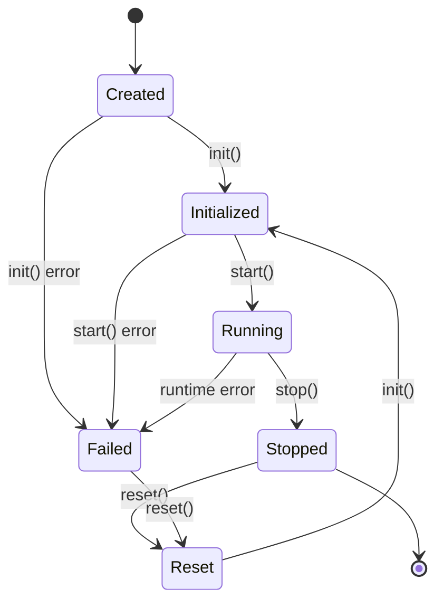
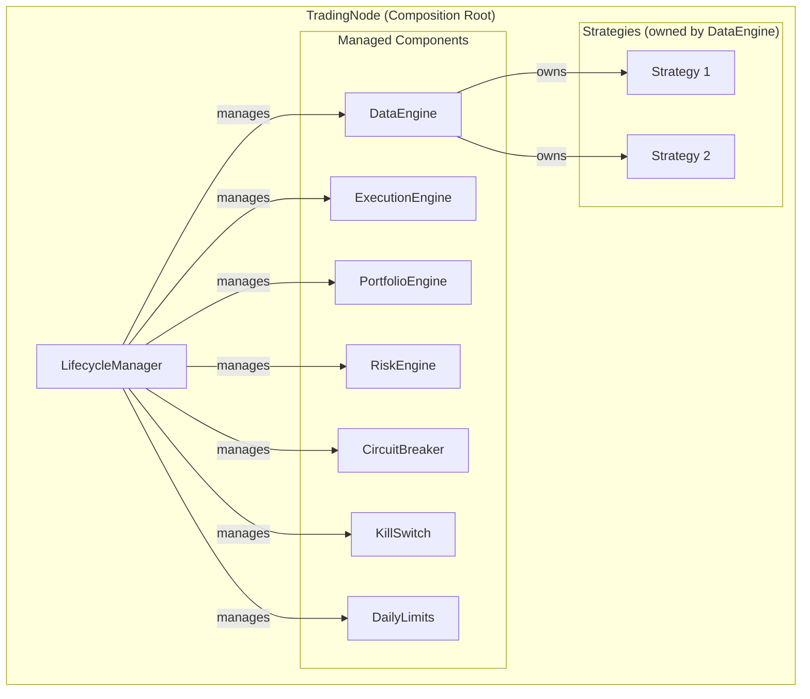
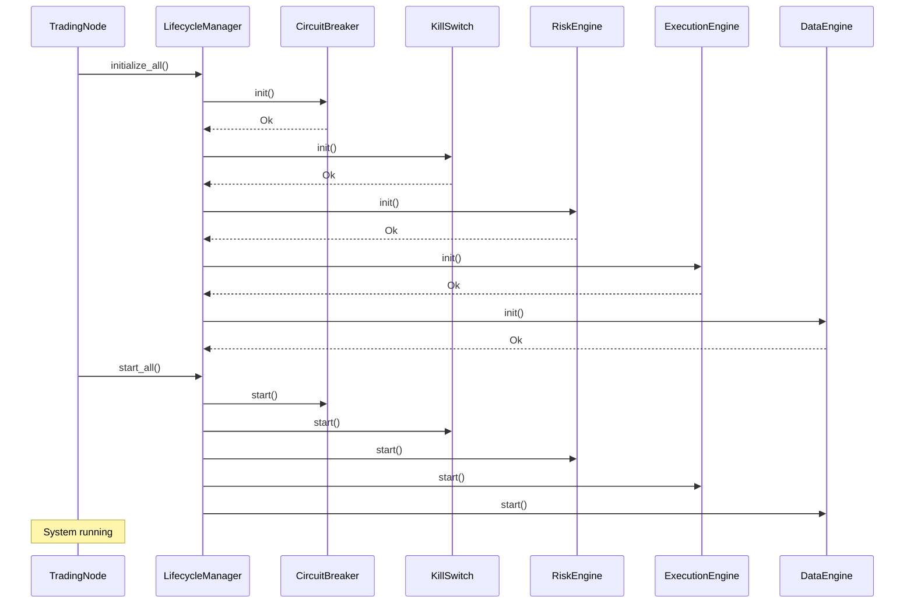
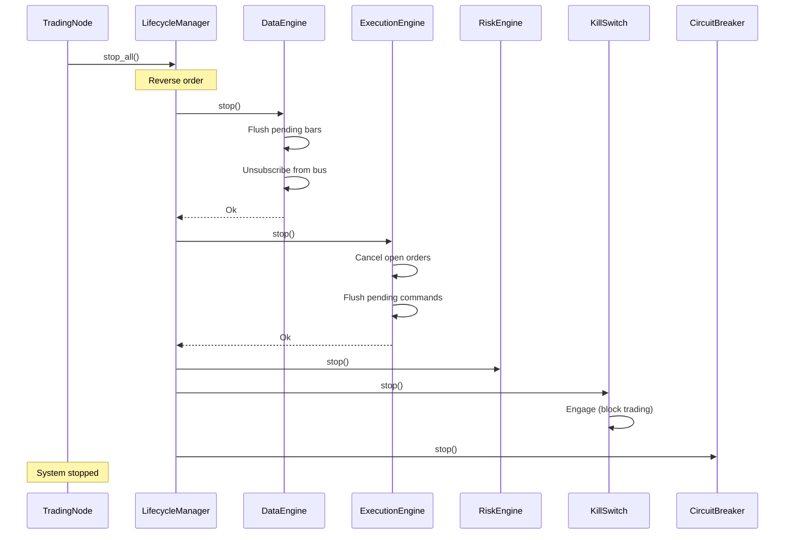

# 05 — Component Lifecycle

**Version:** 1.0  
**Status:** Draft  
**Last Updated:** 2026-07-22  
**Related:** [02-Architecture](./02-architecture-overview.md), [04-Message Bus](./04-message-driven-architecture.md), [06-Execution Engine](./06-execution-engine.md)

---

## 1. Overview

### Purpose

Every infrastructure-level processing node in Vendeta is a **Component** with a well-defined lifecycle. This enables:
- Predictable startup/shutdown ordering
- Health monitoring
- State reset for testing/reuse
- Graceful degradation on failure

### Key Distinction

**Components vs Strategies:**

| Aspect | Component | Strategy |
|--------|-----------|----------|
| **Purpose** | Infrastructure processing | User alpha logic |
| **Lifecycle** | Full (init/start/stop/reset) | Simple (on_start/on_stop) |
| **Bus access** | Direct (publish/subscribe) | Via StrategyContext |
| **Examples** | DataEngine, ExecutionEngine | MomentumStrategy, MeanReversion |
| **Owner** | TradingNode | DataEngine |

Strategies are NOT Components. They implement the `Strategy` trait and are owned by DataEngine. This keeps strategies simple and focused on trading logic.

---

## 2. Requirements

### Functional

| ID | Requirement |
|----|-------------|
| FR-01 | Components have unique identifiers |
| FR-02 | Components follow init → start → stop → reset lifecycle |
| FR-03 | LifecycleManager orchestrates multiple components |
| FR-04 | Components report health status |
| FR-05 | Components handle market and order events |
| FR-06 | Startup/shutdown in defined order |

### Non-Functional

| ID | Requirement | Target |
|----|-------------|--------|
| NFR-01 | Startup time (all components) | < 2s |
| NFR-02 | Shutdown time (graceful) | < 5s |
| NFR-03 | Health check interval | 5s |

---

## 3. Component Trait

### Definition

```rust
use std::sync::Arc;
use vendeta_bus::{Clock, MessageBus};

/// Unique identifier for a component instance
#[derive(Clone, Debug, PartialEq, Eq, Hash)]
pub struct ComponentId(pub String);

/// Component lifecycle states
#[derive(Clone, Copy, Debug, PartialEq, Eq)]
pub enum ComponentState {
    /// Created but not initialized
    Created,
    /// Initialized (config loaded, subscriptions set up)
    Initialized,
    /// Running (processing messages)
    Running,
    /// Stopped (flushed state, unsubscribed)
    Stopped,
    /// Reset (state cleared, ready for reuse)
    Reset,
    /// Failed (error occurred)
    Failed,
}

/// Context injected into components during lifecycle operations
pub struct ComponentContext {
    /// Clock for time access (real or simulated)
    pub clock: Arc<dyn Clock>,
    /// Message bus for publishing events
    pub bus: Arc<MessageBus>,
    /// Logger for this component
    pub log: tracing::Span,
}

/// Core component trait — all infrastructure nodes implement this.
///
/// Lifecycle: Created → Initialized → Running → Stopped → Reset
pub trait Component: Send {
    /// Unique identifier for this component instance.
    fn id(&self) -> ComponentId;
    
    /// Human-readable name (for logging/metrics).
    fn name(&self) -> &str;
    
    /// Current lifecycle state.
    fn state(&self) -> ComponentState;
    
    /// Initialize the component.
    /// - Load configuration
    /// - Set up subscriptions
    /// - Allocate resources
    fn init(&mut self, ctx: &mut ComponentContext) -> Result<(), ComponentError>;
    
    /// Start the component.
    /// - Begin processing messages
    /// - Start background tasks
    fn start(&mut self, ctx: &mut ComponentContext) -> Result<(), ComponentError>;
    
    /// Stop the component.
    /// - Flush pending work
    /// - Close connections
    /// - Unsubscribe from bus
    fn stop(&mut self, ctx: &mut ComponentContext) -> Result<(), ComponentError>;
    
    /// Reset the component (clear state for reuse).
    /// - Clear internal state
    /// - Prepare for re-initialization
    fn reset(&mut self, ctx: &mut ComponentContext) -> Result<(), ComponentError>;
    
    /// Handle a market event (optional override).
    fn on_market_event(&mut self, event: &MarketEvent, ctx: &mut ComponentContext) {
        let _ = (event, ctx); // Default: no-op
    }
    
    /// Handle an order event (optional override).
    fn on_order_event(&mut self, event: &OrderEvent, ctx: &mut ComponentContext) {
        let _ = (event, ctx); // Default: no-op
    }
    
    /// Health check — return current health status.
    fn health(&self) -> ComponentHealth {
        ComponentHealth::healthy(self.name())
    }
}
```

### Component Health

```rust
/// Health status of a component
#[derive(Clone, Debug)]
pub struct ComponentHealth {
    /// Component name
    pub name: String,
    /// Whether component is healthy
    pub healthy: bool,
    /// Current state
    pub state: ComponentState,
    /// Optional message (error details, warnings)
    pub message: Option<String>,
    /// Metrics snapshot
    pub metrics: ComponentMetrics,
}

impl ComponentHealth {
    pub fn healthy(name: &str) -> Self {
        ComponentHealth {
            name: name.to_string(),
            healthy: true,
            state: ComponentState::Running,
            message: None,
            metrics: ComponentMetrics::default(),
        }
    }
    
    pub fn unhealthy(name: &str, reason: &str) -> Self {
        ComponentHealth {
            name: name.to_string(),
            healthy: false,
            state: ComponentState::Failed,
            message: Some(reason.to_string()),
            metrics: ComponentMetrics::default(),
        }
    }
}

/// Component metrics snapshot
#[derive(Clone, Debug, Default)]
pub struct ComponentMetrics {
    pub messages_processed: u64,
    pub errors_count: u64,
    pub uptime_secs: u64,
}
```

---

## 4. Lifecycle State Machine



### State Transitions

| From | To | Trigger | Actions |
|------|-----|---------|---------|
| Created | Initialized | `init()` | Load config, subscribe to bus |
| Initialized | Running | `start()` | Begin processing, start tasks |
| Running | Stopped | `stop()` | Flush state, unsubscribe |
| Stopped | Reset | `reset()` | Clear state |
| Reset | Initialized | `init()` | Re-initialize |
| Any | Failed | Error | Log error, alert |

---

## 5. LifecycleManager

### Purpose

The `LifecycleManager` orchestrates multiple components:
- Registers components in dependency order
- Initializes/starts in registration order
- Stops in **reverse** order (dependents first)
- Aggregates health status

### Implementation

```rust
/// Manages the lifecycle of all framework components.
pub struct LifecycleManager {
    components: Vec<Box<dyn Component>>,
    ctx: ComponentContext,
}

impl LifecycleManager {
    pub fn new(ctx: ComponentContext) -> Self {
        LifecycleManager {
            components: Vec::new(),
            ctx,
        }
    }
    
    /// Register a component (order matters for startup/shutdown).
    pub fn register(&mut self, component: Box<dyn Component>) {
        tracing::info!(component = component.name(), "registering component");
        self.components.push(component);
    }
    
    /// Initialize all components in registration order.
    pub fn initialize_all(&mut self) -> Result<(), ComponentError> {
        for component in &mut self.components {
            tracing::info!(component = component.name(), "initializing");
            component.init(&mut self.ctx)?;
        }
        Ok(())
    }
    
    /// Start all components in registration order.
    pub fn start_all(&mut self) -> Result<(), ComponentError> {
        for component in &mut self.components {
            tracing::info!(component = component.name(), "starting");
            component.start(&mut self.ctx)?;
        }
        Ok(())
    }
    
    /// Stop all components in REVERSE order.
    pub fn stop_all(&mut self) -> Result<(), ComponentError> {
        for component in self.components.iter_mut().rev() {
            tracing::info!(component = component.name(), "stopping");
            if let Err(e) = component.stop(&mut self.ctx) {
                tracing::error!(component = component.name(), error = %e, "stop failed");
                // Continue stopping others
            }
        }
        Ok(())
    }
    
    /// Reset all components.
    pub fn reset_all(&mut self) -> Result<(), ComponentError> {
        for component in &mut self.components {
            component.reset(&mut self.ctx)?;
        }
        Ok(())
    }
    
    /// Get health status of all components.
    pub fn health(&self) -> Vec<ComponentHealth> {
        self.components.iter().map(|c| c.health()).collect()
    }
    
    /// Check if all components are healthy.
    pub fn all_healthy(&self) -> bool {
        self.components.iter().all(|c| c.health().healthy)
    }
}
```

---

## 6. Component Composition

### TradingNode as Composition Root



### Registration Order

```rust
impl TradingNode {
    pub fn new(config: TradingNodeConfig) -> Self {
        let bus = Arc::new(MessageBus::new(256));
        let ctx = ComponentContext {
            clock: Arc::new(LiveClock),
            bus: bus.clone(),
            log: tracing::info_span!("trading_node"),
        };
        
        let mut lifecycle = LifecycleManager::new(ctx);
        
        // Register in dependency order
        // 1. Risk controls (must be ready before execution)
        lifecycle.register(Box::new(CircuitBreaker::new(config.circuit_breaker_threshold)));
        lifecycle.register(Box::new(KillSwitch::new()));
        lifecycle.register(Box::new(DailyLimits::new(
            config.max_daily_orders,
            config.max_daily_trades,
            config.max_daily_loss,
        )));
        
        // 2. Core engines
        lifecycle.register(Box::new(RiskEngine::new()));
        lifecycle.register(Box::new(ExecutionEngine::new()));
        lifecycle.register(Box::new(PortfolioEngine::new()));
        lifecycle.register(Box::new(DataEngine::new()));
        
        TradingNode { lifecycle, bus, config, running: false }
    }
    
    pub fn start(&mut self) -> Result<(), ComponentError> {
        self.lifecycle.initialize_all()?;
        self.lifecycle.start_all()?;
        self.running = true;
        Ok(())
    }
    
    pub fn stop(&mut self) -> Result<(), ComponentError> {
        self.lifecycle.stop_all()?;
        self.running = false;
        Ok(())
    }
}
```

---

## 7. ManagedComponent Wrapper

For components that don't naturally implement `Component`, use a wrapper:

```rust
/// Wrapper to make any type implement ManagedComponent
pub struct ManagedComponent<T> {
    inner: T,
    name: String,
    state: ComponentState,
}

/// Simplified component interface for wrappers
pub trait ManagedComponent {
    fn name(&self) -> &str;
    fn initialize(&mut self) -> Result<(), String>;
    fn start(&mut self) -> Result<(), String>;
    fn stop(&mut self) -> Result<(), String>;
    fn health(&self) -> ComponentHealth;
}

// Example: Wrapping CircuitBreaker
struct ManagedCircuitBreaker(CircuitBreaker);

impl ManagedComponent for ManagedCircuitBreaker {
    fn name(&self) -> &str {
        "circuit_breaker"
    }
    
    fn initialize(&mut self) -> Result<(), String> {
        Ok(())
    }
    
    fn start(&mut self) -> Result<(), String> {
        Ok(())
    }
    
    fn stop(&mut self) -> Result<(), String> {
        Ok(())
    }
    
    fn health(&self) -> ComponentHealth {
        if self.0.is_allowed() {
            ComponentHealth::healthy("circuit_breaker")
        } else {
            ComponentHealth::unhealthy("circuit_breaker", "tripped")
        }
    }
}
```

---

## 8. Sequence Diagrams

### Startup Sequence



### Shutdown Sequence



---

## 9. Configuration

```yaml
# config/lifecycle.yaml
lifecycle:
  # Timeouts
  startup_timeout_secs: 30
  shutdown_timeout_secs: 10
  
  # Health monitoring
  health_check:
    enabled: true
    interval_secs: 5
    unhealthy_threshold: 3  # consecutive failures before alert
    
  # Component registration order
  components:
    - circuit_breaker
    - kill_switch
    - daily_limits
    - risk_engine
    - execution_engine
    - portfolio_engine
    - data_engine
```

---

## 10. Error Handling

```rust
/// Component lifecycle errors
#[derive(Debug, thiserror::Error)]
pub enum ComponentError {
    /// Component failed to initialize
    #[error("component '{component}' failed to initialize: {reason}")]
    InitFailed { component: String, reason: String },
    
    /// Component failed to start
    #[error("component '{component}' failed to start: {reason}")]
    StartFailed { component: String, reason: String },
    
    /// Component failed to stop
    #[error("component '{component}' failed to stop: {reason}")]
    StopFailed { component: String, reason: String },
    
    /// Component is in invalid state for operation
    #[error("component '{component}' in invalid state: expected {expected}, got {actual}")]
    InvalidState {
        component: String,
        expected: ComponentState,
        actual: ComponentState,
    },
    
    /// Component health check failed
    #[error("component '{component}' unhealthy: {reason}")]
    Unhealthy { component: String, reason: String },
}
```

### Error Recovery Strategy

| Error | Recovery |
|-------|----------|
| InitFailed | Abort startup, log error, require manual fix |
| StartFailed | Stop initialized components, abort |
| StopFailed | Log error, continue stopping others |
| InvalidState | Log error, skip operation |
| Unhealthy | Alert operator, optionally restart component |

---

## 11. Testing Requirements

### Unit Tests

```rust
#[test]
fn component_lifecycle_transitions() {
    let mut component = TestComponent::new();
    let mut ctx = test_context();
    
    assert_eq!(component.state(), ComponentState::Created);
    
    component.init(&mut ctx).unwrap();
    assert_eq!(component.state(), ComponentState::Initialized);
    
    component.start(&mut ctx).unwrap();
    assert_eq!(component.state(), ComponentState::Running);
    
    component.stop(&mut ctx).unwrap();
    assert_eq!(component.state(), ComponentState::Stopped);
    
    component.reset(&mut ctx).unwrap();
    assert_eq!(component.state(), ComponentState::Reset);
}

#[test]
fn lifecycle_manager_stops_in_reverse_order() {
    let mut lm = LifecycleManager::new(test_context());
    let order = Arc::new(Mutex::new(Vec::new()));
    
    lm.register(Box::new(OrderTrackingComponent::new("first", order.clone())));
    lm.register(Box::new(OrderTrackingComponent::new("second", order.clone())));
    lm.register(Box::new(OrderTrackingComponent::new("third", order.clone())));
    
    lm.initialize_all().unwrap();
    lm.start_all().unwrap();
    lm.stop_all().unwrap();
    
    let stop_order = order.lock().unwrap();
    assert_eq!(*stop_order, vec!["third", "second", "first"]);
}
```

### Integration Tests

```rust
#[tokio::test]
async fn trading_node_full_lifecycle() {
    let mut node = TradingNode::new(TradingNodeConfig::default());
    
    assert!(!node.is_running());
    
    node.start().unwrap();
    assert!(node.is_running());
    assert!(node.health().iter().all(|h| h.healthy));
    
    node.stop().unwrap();
    assert!(!node.is_running());
}
```

---

## 12. Implementation Notes

### Best Practices

1. **Idempotent operations**: `stop()` on already-stopped component should succeed
2. **Graceful degradation**: If one component fails to stop, continue with others
3. **Resource cleanup**: Always release resources in `stop()`, even on error
4. **State validation**: Check state before transitions, return `InvalidState` error

### Patterns

```rust
// Guard pattern for state transitions
fn start(&mut self, ctx: &mut ComponentContext) -> Result<(), ComponentError> {
    if self.state != ComponentState::Initialized {
        return Err(ComponentError::InvalidState {
            component: self.name().to_string(),
            expected: ComponentState::Initialized,
            actual: self.state,
        });
    }
    
    // Do startup work...
    
    self.state = ComponentState::Running;
    Ok(())
}
```

---

## 13. Cross-References

- [02-Architecture Overview](./02-architecture-overview.md) — Component model context
- [04-Message Bus](./04-message-driven-architecture.md) — Components use the bus
- [06-Execution Engine](./06-execution-engine.md) — Example component
- [09-Risk Management](./09-risk-management.md) — Risk components
