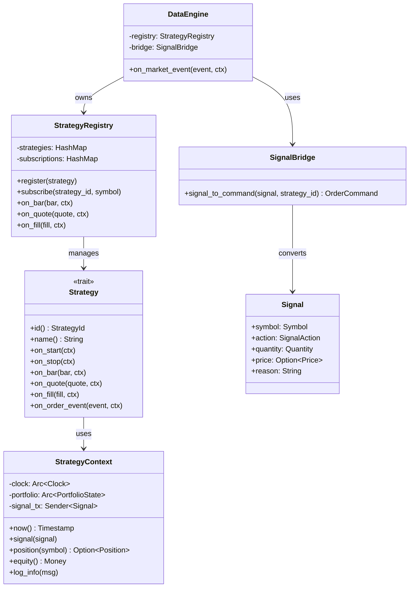
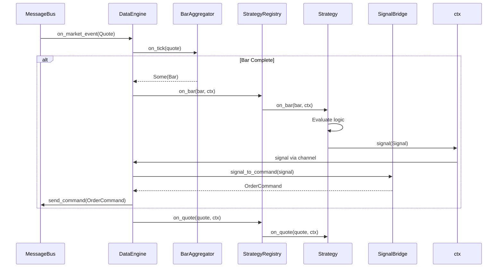
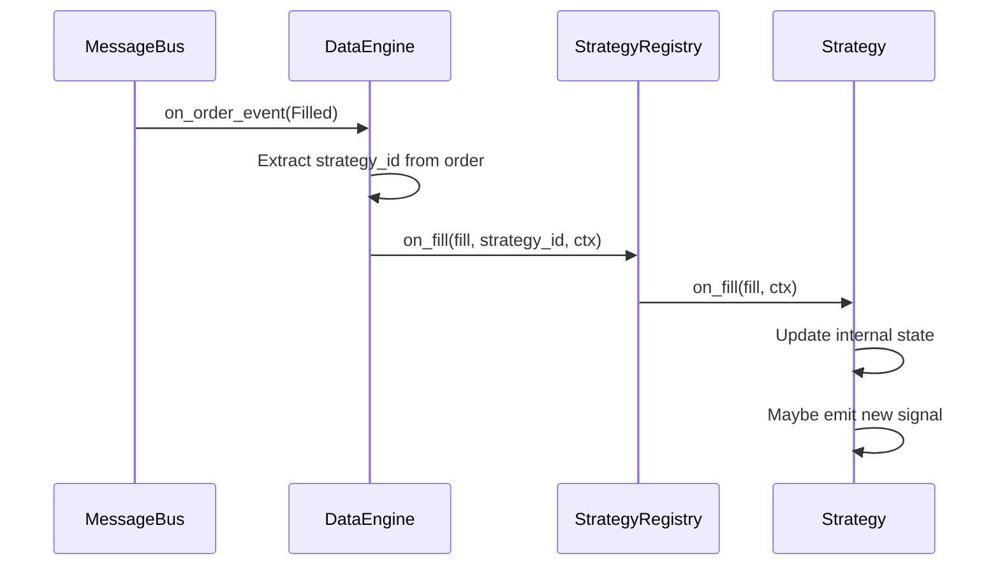

# 07 — Strategy System

**Version:** 1.0  
**Status:** Draft  
**Last Updated:** 2026-07-22  
**Related:** [04-Message Bus](./04-message-driven-architecture.md), [06-Execution Engine](./06-execution-engine.md), [12-Zero-Parity Engine](./12-zero-parity-engine.md)

---

## 1. Overview

### Purpose

The Strategy System is the **user-facing API** of the framework. Strategy developers write trading logic without needing to understand framework internals. The framework calls the strategy (Inversion of Control), not the other way around.

### Key Principle

> **Strategies are NOT Components.** They don't implement the Component trait. They are owned and dispatched by the DataEngine. This keeps strategies simple and focused on alpha logic.

### Design Goals

| Goal | Implementation |
|------|----------------|
| **Simple API** | `on_bar()`, `on_quote()`, `on_fill()`, `signal()` |
| **No framework knowledge** | Strategy only sees market data and portfolio state |
| **Zero-parity** | Same code runs in backtest and live |
| **Testable** | Strategies can be unit tested with mock context |
| **Stateless option** | Strategies can be pure functions of market data |

---

## 2. Requirements

### Functional

| ID | Requirement |
|----|-------------|
| FR-01 | Strategy receives bar updates via `on_bar()` |
| FR-02 | Strategy receives quote updates via `on_quote()` |
| FR-03 | Strategy receives fill notifications via `on_fill()` |
| FR-04 | Strategy emits trading signals via `signal()` |
| FR-05 | Strategy has lifecycle hooks (`on_start`, `on_stop`) |
| FR-06 | Strategy can query portfolio state via context |
| FR-07 | Strategy can access clock (real or simulated) |
| FR-08 | Multiple strategies can run concurrently |
| FR-09 | Strategies are isolated (one strategy's error doesn't affect others) |

### Non-Functional

| ID | Requirement | Target |
|----|-------------|--------|
| NFR-01 | `on_bar()` latency | < 100μs (framework overhead) |
| NFR-02 | Signal-to-order latency | < 1ms |
| NFR-03 | Strategy isolation | Error in one doesn't crash others |

---

## 3. Strategy Trait

### Definition

```rust
/// Unique strategy identifier
#[derive(Clone, Debug, PartialEq, Eq, Hash)]
pub struct StrategyId(pub String);

/// User-facing strategy trait.
///
/// Implement this trait to create a trading strategy.
/// The framework calls your methods when market data arrives.
///
/// # Example
///
/// ```rust
/// struct MomentumStrategy {
///     lookback: usize,
///     prices: Vec<Price>,
/// }
///
/// impl Strategy for MomentumStrategy {
///     fn id(&self) -> StrategyId {
///         StrategyId("momentum".into())
///     }
///
///     fn on_bar(&mut self, bar: &Bar, ctx: &mut StrategyContext) {
///         self.prices.push(bar.close);
///         if self.prices.len() < self.lookback {
///             return;
///         }
///         let avg = self.average();
///         if bar.close > avg {
///             ctx.signal(Signal::enter_long(bar.instrument.symbol, Quantity(10)));
///         }
///     }
/// }
/// ```
pub trait Strategy: Send {
    /// Unique identifier for this strategy.
    fn id(&self) -> StrategyId;
    
    /// Human-readable name (for logging).
    fn name(&self) -> &str {
        "strategy"
    }
    
    /// Called when strategy is started.
    /// Use this to subscribe to instruments, initialize state.
    fn on_start(&mut self, ctx: &mut StrategyContext) {
        let _ = ctx;
    }
    
    /// Called when strategy is stopped.
    /// Use this to clean up resources, flatten positions.
    fn on_stop(&mut self, ctx: &mut StrategyContext) {
        let _ = ctx;
    }
    
    /// Called when a new bar is completed.
    /// This is the primary entry point for most strategies.
    fn on_bar(&mut self, bar: &Bar, ctx: &mut StrategyContext) {
        let _ = (bar, ctx);
    }
    
    /// Called when a quote update arrives.
    /// Use for tick-level strategies.
    fn on_quote(&mut self, quote: &Quote, ctx: &mut StrategyContext) {
        let _ = (quote, ctx);
    }
    
    /// Called when an order is filled.
    /// Use to track execution, adjust logic.
    fn on_fill(&mut self, fill: &Fill, ctx: &mut StrategyContext) {
        let _ = (fill, ctx);
    }
    
    /// Called when an order event occurs (submitted, rejected, cancelled).
    fn on_order_event(&mut self, event: &OrderEvent, ctx: &mut StrategyContext) {
        let _ = (event, ctx);
    }
}
```

### Signal Types

```rust
/// Trading signal emitted by strategy
#[derive(Clone, Debug)]
pub struct Signal {
    /// Instrument
    pub symbol: Symbol,
    /// Action to take
    pub action: SignalAction,
    /// Quantity
    pub quantity: Quantity,
    /// Optional limit price (None = market order)
    pub price: Option<Price>,
    /// Reason for logging/audit
    pub reason: String,
    /// Timestamp
    pub at: Timestamp,
}

/// Signal action types
#[derive(Clone, Copy, Debug, PartialEq, Eq)]
pub enum SignalAction {
    /// Open or add to long position
    EnterLong,
    /// Close or reduce long position
    ExitLong,
    /// Open or add to short position
    EnterShort,
    /// Close or reduce short position
    ExitShort,
    /// Flatten all positions in this instrument
    Flat,
}

impl Signal {
    /// Create an enter-long signal
    pub fn enter_long(symbol: Symbol, quantity: Quantity) -> Self {
        Signal {
            symbol,
            action: SignalAction::EnterLong,
            quantity,
            price: None,
            reason: String::new(),
            at: Timestamp(0), // Set by framework
        }
    }
    
    /// Create an exit-long signal
    pub fn exit_long(symbol: Symbol, quantity: Quantity) -> Self {
        Signal {
            symbol,
            action: SignalAction::ExitLong,
            quantity,
            price: None,
            reason: String::new(),
            at: Timestamp(0),
        }
    }
    
    /// Add a reason
    pub fn with_reason(mut self, reason: impl Into<String>) -> Self {
        self.reason = reason.into();
        self
    }
    
    /// Add a limit price
    pub fn with_price(mut self, price: Price) -> Self {
        self.price = Some(price);
        self
    }
}
```

---

## 4. StrategyContext

### Purpose

The `StrategyContext` provides controlled access to framework services. Strategies cannot access the message bus or other components directly — only through this context.

### Definition

```rust
/// Context injected into strategy methods.
///
/// Provides controlled access to:
/// - Clock (time)
/// - Portfolio state (positions, P&L)
/// - Signal emission
/// - Logging
pub struct StrategyContext {
    /// Clock (real or simulated)
    clock: Arc<dyn Clock>,
    /// Portfolio state (read-only)
    portfolio: Arc<PortfolioState>,
    /// Signal sender (to DataEngine)
    signal_tx: mpsc::Sender<Signal>,
    /// Logger span
    log: tracing::Span,
    /// Strategy ID
    strategy_id: StrategyId,
}

impl StrategyContext {
    /// Get current time
    pub fn now(&self) -> Timestamp {
        self.clock.now()
    }
    
    /// Emit a trading signal
    pub fn signal(&mut self, mut signal: Signal) {
        signal.at = self.now();
        // Non-blocking send (drop if channel full)
        let _ = self.signal_tx.try_send(signal);
    }
    
    /// Get current position for an instrument
    pub fn position(&self, symbol: &Symbol) -> Option<&Position> {
        self.portfolio.get_position(symbol)
    }
    
    /// Get all positions
    pub fn positions(&self) -> impl Iterator<Item = &Position> {
        self.portfolio.positions()
    }
    
    /// Get unrealized P&L for an instrument
    pub fn unrealized_pnl(&self, symbol: &Symbol) -> Money {
        self.portfolio
            .get_position(symbol)
            .map(|p| p.unrealized_pnl)
            .unwrap_or(Money(0))
    }
    
    /// Get total portfolio equity
    pub fn equity(&self) -> Money {
        self.portfolio.equity()
    }
    
    /// Get available capital
    pub fn available_capital(&self) -> Money {
        self.portfolio.available_capital()
    }
    
    /// Log at info level
    pub fn log_info(&self, msg: &str) {
        tracing::info!(parent: &self.log, strategy = %self.strategy_id.0, "{}", msg);
    }
    
    /// Log at warn level
    pub fn log_warn(&self, msg: &str) {
        tracing::warn!(parent: &self.log, strategy = %self.strategy_id.0, "{}", msg);
    }
    
    /// Log at error level
    pub fn log_error(&self, msg: &str) {
        tracing::error!(parent: &self.log, strategy = %self.strategy_id.0, "{}", msg);
    }
}
```

---

## 5. StrategyRegistry

### Purpose

The `StrategyRegistry` manages multiple strategies and routes market data to them.

```rust
/// Registry of active strategies
pub struct StrategyRegistry {
    strategies: HashMap<StrategyId, Box<dyn Strategy>>,
    /// Instrument → Strategy subscriptions
    subscriptions: HashMap<Symbol, Vec<StrategyId>>,
}

impl StrategyRegistry {
    pub fn new() -> Self {
        StrategyRegistry {
            strategies: HashMap::new(),
            subscriptions: HashMap::new(),
        }
    }
    
    /// Register a strategy
    pub fn register(&mut self, strategy: Box<dyn Strategy>) {
        let id = strategy.id();
        tracing::info!(strategy = %id.0, "registering strategy");
        self.strategies.insert(id, strategy);
    }
    
    /// Subscribe a strategy to an instrument
    pub fn subscribe(&mut self, strategy_id: &StrategyId, symbol: Symbol) {
        self.subscriptions
            .entry(symbol)
            .or_default()
            .push(strategy_id.clone());
    }
    
    /// Dispatch a bar to subscribed strategies
    pub fn on_bar(&mut self, bar: &Bar, ctx: &mut StrategyContext) {
        let symbol = &bar.instrument.symbol;
        if let Some(strategy_ids) = self.subscriptions.get(symbol) {
            for id in strategy_ids {
                if let Some(strategy) = self.strategies.get_mut(id) {
                    // Isolate strategy errors
                    let result = std::panic::catch_unwind(std::panic::AssertUnwindSafe(|| {
                        strategy.on_bar(bar, ctx);
                    }));
                    if let Err(e) = result {
                        tracing::error!(
                            strategy = %id.0,
                            "strategy panicked in on_bar: {:?}",
                            e
                        );
                    }
                }
            }
        }
    }
    
    /// Dispatch a quote to subscribed strategies
    pub fn on_quote(&mut self, quote: &Quote, ctx: &mut StrategyContext) {
        let symbol = &quote.instrument.symbol;
        if let Some(strategy_ids) = self.subscriptions.get(symbol) {
            for id in strategy_ids {
                if let Some(strategy) = self.strategies.get_mut(id) {
                    strategy.on_quote(quote, ctx);
                }
            }
        }
    }
    
    /// Dispatch a fill to the owning strategy
    pub fn on_fill(&mut self, fill: &Fill, strategy_id: &StrategyId, ctx: &mut StrategyContext) {
        if let Some(strategy) = self.strategies.get_mut(strategy_id) {
            strategy.on_fill(fill, ctx);
        }
    }
    
    /// Start all strategies
    pub fn start_all(&mut self, ctx: &mut StrategyContext) {
        for strategy in self.strategies.values_mut() {
            strategy.on_start(ctx);
        }
    }
    
    /// Stop all strategies
    pub fn stop_all(&mut self, ctx: &mut StrategyContext) {
        for strategy in self.strategies.values_mut() {
            strategy.on_stop(ctx);
        }
    }
}
```

---

## 6. Signal-to-Order Bridge

### Purpose

Converts strategy signals into order commands. This separation keeps strategies simple (they emit intent, not orders).

```rust
/// Converts signals to order commands
pub struct SignalBridge {
    /// Current positions (for exit logic)
    positions: Arc<PortfolioState>,
}

impl SignalBridge {
    /// Convert a signal to an order command
    pub fn signal_to_command(&self, signal: Signal, strategy_id: StrategyId) -> Option<OrderCommand> {
        let current_position = self.positions.get_position(&signal.symbol);
        
        let (side, quantity) = match signal.action {
            SignalAction::EnterLong => {
                (Side::Buy, signal.quantity)
            }
            SignalAction::ExitLong => {
                let pos_qty = current_position
                    .filter(|p| p.side == Side::Buy)
                    .map(|p| p.quantity)
                    .unwrap_or(Quantity(0));
                let exit_qty = signal.quantity.min(pos_qty);
                if exit_qty.0 == 0 {
                    return None; // Nothing to exit
                }
                (Side::Sell, exit_qty)
            }
            SignalAction::EnterShort => {
                (Side::Sell, signal.quantity)
            }
            SignalAction::ExitShort => {
                let pos_qty = current_position
                    .filter(|p| p.side == Side::Sell)
                    .map(|p| p.quantity)
                    .unwrap_or(Quantity(0));
                let exit_qty = signal.quantity.min(pos_qty);
                if exit_qty.0 == 0 {
                    return None;
                }
                (Side::Buy, exit_qty)
            }
            SignalAction::Flat => {
                if let Some(pos) = current_position {
                    let side = if pos.side == Side::Buy { Side::Sell } else { Side::Buy };
                    (side, pos.quantity)
                } else {
                    return None;
                }
            }
        };
        
        let request = OrderRequest {
            symbol: signal.symbol,
            side,
            quantity,
            order_type: if signal.price.is_some() {
                OrderType::Limit
            } else {
                OrderType::Market
            },
            price: signal.price,
            trigger: None,
            validity: TimeInForce::Day,
            tag: signal.reason,
        };
        
        Some(OrderCommand::Submit {
            at: signal.at,
            request,
            strategy_id,
        })
    }
}
```

---

## 7. Class Diagram



---

## 8. Sequence Diagrams

### Strategy Dispatch Flow



### Fill Notification Flow



---

## 9. Example Strategy

### Momentum Strategy

```rust
/// Simple momentum strategy
///
/// Buys when price crosses above lookback average.
/// Sells when price crosses below.
pub struct MomentumStrategy {
    id: StrategyId,
    lookback: usize,
    threshold: f64,
    prices: HashMap<Symbol, Vec<Price>>,
}

impl MomentumStrategy {
    pub fn new(id: &str, lookback: usize, threshold: f64) -> Self {
        MomentumStrategy {
            id: StrategyId(id.to_string()),
            lookback,
            threshold,
            prices: HashMap::new(),
        }
    }
    
    fn average(&self, symbol: &Symbol) -> Option<Price> {
        let prices = self.prices.get(symbol)?;
        if prices.len() < self.lookback {
            return None;
        }
        let sum: i64 = prices.iter().rev().take(self.lookback).map(|p| p.0).sum();
        Some(Price(sum / self.lookback as i64))
    }
}

impl Strategy for MomentumStrategy {
    fn id(&self) -> StrategyId {
        self.id.clone()
    }
    
    fn name(&self) -> &str {
        "momentum"
    }
    
    fn on_start(&mut self, ctx: &mut StrategyContext) {
        ctx.log_info("Momentum strategy started");
    }
    
    fn on_bar(&mut self, bar: &Bar, ctx: &mut StrategyContext) {
        let symbol = &bar.instrument.symbol;
        
        // Update price history
        self.prices
            .entry(symbol.clone())
            .or_default()
            .push(bar.close);
        
        // Need enough data
        let avg = match self.average(symbol) {
            Some(avg) => avg,
            None => return,
        };
        
        let position = ctx.position(symbol);
        
        // Entry: price > avg * (1 + threshold)
        let upper = Price((avg.0 as f64 * (1.0 + self.threshold)) as i64);
        if bar.close > upper && position.is_none() {
            ctx.log_info(&format!("BUY signal: {} > {}", bar.close, upper));
            ctx.signal(
                Signal::enter_long(symbol.clone(), Quantity(10))
                    .with_reason("momentum crossover")
            );
        }
        
        // Exit: price < avg
        if bar.close < avg {
            if let Some(pos) = position {
                if pos.side == Side::Buy {
                    ctx.log_info(&format!("SELL signal: {} < {}", bar.close, avg));
                    ctx.signal(
                        Signal::exit_long(symbol.clone(), pos.quantity)
                            .with_reason("momentum exit")
                    );
                }
            }
        }
    }
    
    fn on_fill(&mut self, fill: &Fill, ctx: &mut StrategyContext) {
        ctx.log_info(&format!(
            "FILLED: {} {} @ {}",
            fill.side, fill.quantity, fill.price
        ));
    }
    
    fn on_stop(&mut self, ctx: &mut StrategyContext) {
        ctx.log_info("Momentum strategy stopped");
    }
}
```

---

## 10. Configuration

```yaml
# config/strategies.yaml
strategies:
  - id: "momentum_1"
    type: "momentum"
    instruments:
      - "NSE:RELIANCE"
      - "NSE:TCS"
      - "NSE:INFY"
    params:
      lookback: 20
      threshold: 0.02
      
  - id: "mean_reversion_1"
    type: "mean_reversion"
    instruments:
      - "NSE:NIFTY"
    params:
      window: 50
      entry_z: 2.0
      exit_z: 0.5
```

---

## 11. Error Handling

```rust
/// Strategy errors (isolated per strategy)
#[derive(Debug, thiserror::Error)]
pub enum StrategyError {
    /// Strategy panicked
    #[error("strategy '{0}' panicked")]
    Panicked(String),
    
    /// Strategy returned error
    #[error("strategy '{strategy}' error: {reason}")]
    Runtime { strategy: String, reason: String },
    
    /// Invalid signal
    #[error("invalid signal: {0}")]
    InvalidSignal(String),
}
```

### Isolation Strategy

```rust
// In StrategyRegistry::on_bar
for strategy in strategies {
    let result = std::panic::catch_unwind(AssertUnwindSafe(|| {
        strategy.on_bar(bar, ctx);
    }));
    
    if let Err(panic) = result {
        tracing::error!(
            strategy = %strategy.id().0,
            "strategy panicked, isolating error"
        );
        // Strategy continues to exist but error is logged
        // Could optionally disable the strategy
    }
}
```

---

## 12. Testing Requirements

### Unit Tests

```rust
#[test]
fn momentum_strategy_emits_signal_on_crossover() {
    let mut strategy = MomentumStrategy::new("test", 5, 0.01);
    let mut ctx = mock_context();
    
    // Feed prices below average
    for i in 0..5 {
        let bar = test_bar(Price(1000 + i));
        strategy.on_bar(&bar, &mut ctx);
    }
    
    // No signal yet
    assert!(ctx.signals().is_empty());
    
    // Price crosses above average
    let bar = test_bar(Price(1100));
    strategy.on_bar(&bar, &mut ctx);
    
    // Should have signal
    assert_eq!(ctx.signals().len(), 1);
    assert_eq!(ctx.signals()[0].action, SignalAction::EnterLong);
}
```

### Integration Tests

```rust
#[tokio::test]
async fn strategy_receives_bars_and_emits_orders() {
    let bus = Arc::new(MessageBus::new(16));
    let mut data_engine = DataEngine::new(bus.clone());
    
    let strategy = MomentumStrategy::new("test", 5, 0.01);
    data_engine.register_strategy(Box::new(strategy));
    
    // Simulate market data
    for i in 0..10 {
        let quote = test_quote(Price(1000 + i * 10));
        data_engine.on_market_event(&MarketEvent::Quote { at: ts(), quote }, &mut ctx).await;
    }
    
    // Check that order command was sent
    let mut cmd_rx = bus.take_command_receiver().unwrap();
    assert!(cmd_rx.try_recv().is_ok());
}
```

---

## 13. Implementation Notes

### Best Practices

1. **Keep strategies simple**: Focus on alpha logic, not framework mechanics
2. **Use context for state**: Don't access global state
3. **Handle errors gracefully**: Don't panic in strategy code
4. **Log important decisions**: Use `ctx.log_info()` for audit trail

### Gotchas

1. **Strategy vs Component**: Strategies don't implement Component
2. **Signal vs Order**: Strategies emit Signals, framework converts to Orders
3. **Clock access**: Always use `ctx.now()`, never `SystemTime::now()`
4. **Position queries**: Use `ctx.position()`, don't track positions manually

---

## 14. Cross-References

- [04-Message Bus](./04-message-driven-architecture.md) — Event delivery
- [06-Execution Engine](./06-execution-engine.md) — Order processing
- [10-Portfolio Construction](./10-portfolio-construction.md) — Position state
- [12-Zero-Parity Engine](./12-zero-parity-engine.md) — Backtest/live parity
