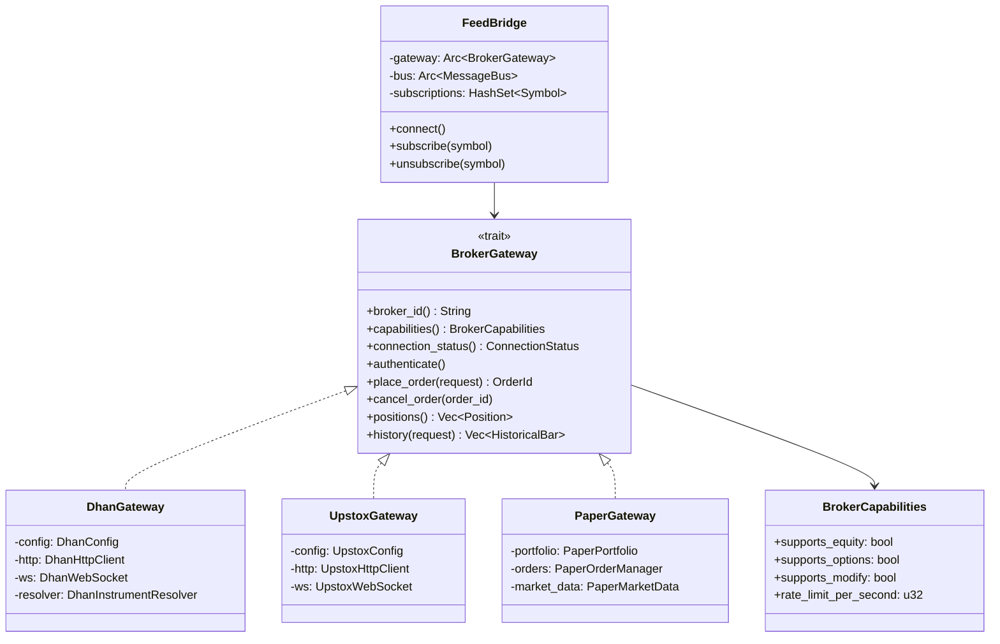
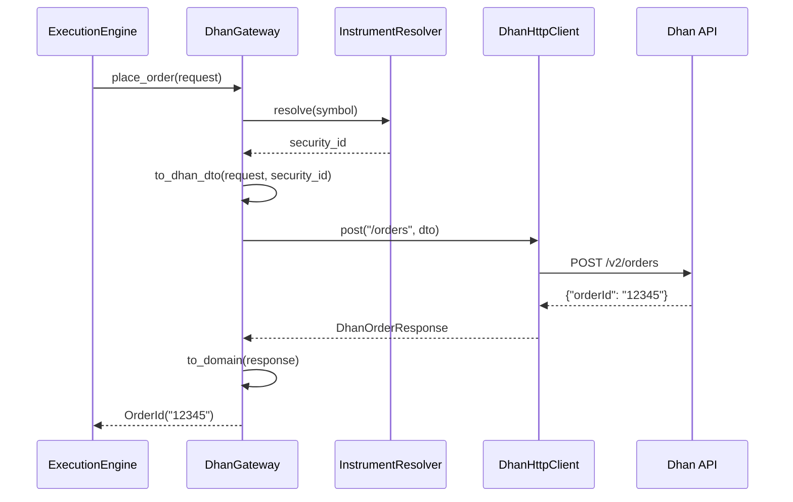
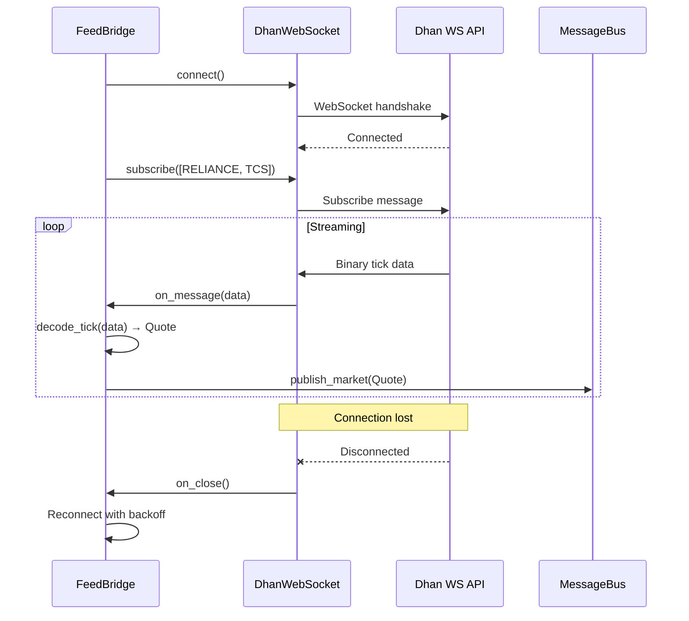

# 08 — Adapter System

**Version:** 1.0  
**Status:** Draft  
**Last Updated:** 2026-07-22  
**Related:** [02-Architecture](./02-architecture-overview.md), [06-Execution Engine](./06-execution-engine.md), [11-Data Infrastructure](./11-data-infrastructure.md)

---

## 1. Overview

### Purpose

The Adapter System provides **pluggable broker connectivity**. Each broker (Dhan, Upstox, Paper) implements the `BrokerGateway` trait, allowing the framework to work with any broker without modifying core code.

### Design Principles

| Principle | Implementation |
|-----------|----------------|
| **Trait-based abstraction** | `BrokerGateway` trait defines the interface |
| **Capability model** | Brokers declare supported features |
| **Anti-corruption layer** | Broker DTOs converted to domain types |
| **Resilience** | Reconnection, retry, rate limiting built-in |
| **Testability** | Contract tests verify adapter behavior |

---

## 2. Requirements

### Functional

| ID | Requirement |
|----|-------------|
| FR-01 | Place orders via broker API |
| FR-02 | Cancel and modify orders |
| FR-03 | Fetch positions, holdings, funds |
| FR-04 | Stream real-time market data via WebSocket |
| FR-05 | Fetch historical data |
| FR-06 | Handle broker-specific authentication |
| FR-07 | Declare supported capabilities |
| FR-08 | Resolve symbols to broker-specific IDs |

### Non-Functional

| ID | Requirement | Target |
|----|-------------|--------|
| NFR-01 | Order submission latency | < 100ms (network) |
| NFR-02 | Reconnection time | < 5s |
| NFR-03 | Rate limit compliance | 100% |
| NFR-04 | Data normalization | Zero loss |

---

## 3. BrokerGateway Trait

### Definition

```rust
use async_trait::async_trait;

/// Broker gateway trait — the interface for broker connectivity.
///
/// Each broker adapter implements this trait. The framework interacts
/// only with this interface, never with broker-specific code.
///
/// # Object Safety
///
/// This trait is object-safe (can be used as `dyn BrokerGateway`).
#[async_trait]
pub trait BrokerGateway: Send + Sync {
    /// Broker identifier (e.g., "dhan", "upstox", "paper")
    fn broker_id(&self) -> &str;
    
    /// Broker capabilities
    fn capabilities(&self) -> &BrokerCapabilities;
    
    /// Current connection status
    fn connection_status(&self) -> ConnectionStatus;
    
    // === Authentication ===
    
    /// Authenticate with the broker
    async fn authenticate(&self) -> GatewayResult<()>;
    
    /// Close connection
    async fn close(&self) -> GatewayResult<()>;
    
    // === Market Data ===
    
    /// Get last traded price
    async fn ltp(&self, symbol: &Symbol) -> GatewayResult<Price>;
    
    /// Get full quote
    async fn quote(&self, symbol: &Symbol) -> GatewayResult<Quote>;
    
    /// Get order book depth
    async fn depth(&self, symbol: &Symbol) -> GatewayResult<Depth>;
    
    /// Get multiple quotes (batch)
    async fn quotes_batch(&self, symbols: &[Symbol]) -> GatewayResult<Vec<Quote>>;
    
    /// Get historical bars
    async fn history(&self, request: &HistoryRequest) -> GatewayResult<Vec<HistoricalBar>>;
    
    /// Get option chain
    async fn option_chain(&self, symbol: &Symbol) -> GatewayResult<OptionChain>;
    
    /// Get future chain
    async fn future_chain(&self, symbol: &Symbol) -> GatewayResult<FutureChain>;
    
    // === Orders ===
    
    /// Place a new order
    async fn place_order(&self, request: &OrderRequest) -> GatewayResult<OrderId>;
    
    /// Cancel an order
    async fn cancel_order(&self, order_id: &OrderId) -> GatewayResult<()>;
    
    /// Modify an order
    async fn modify_order(&self, order_id: &OrderId, request: &OrderRequest) -> GatewayResult<()>;
    
    /// Get order book
    async fn order_book(&self) -> GatewayResult<Vec<Order>>;
    
    /// Get trade history
    async fn trades(&self) -> GatewayResult<Vec<Trade>>;
    
    // === Portfolio ===
    
    /// Get current positions
    async fn positions(&self) -> GatewayResult<Vec<Position>>;
    
    /// Get holdings
    async fn holdings(&self) -> GatewayResult<Vec<Holding>>;
    
    /// Get funds/margin
    async fn funds(&self) -> GatewayResult<Funds>;
}
```

### Supporting Types

```rust
/// Connection status
#[derive(Clone, Copy, Debug, PartialEq, Eq)]
pub enum ConnectionStatus {
    Disconnected,
    Connecting,
    Connected,
    Reconnecting,
    Error,
}

/// Historical data request
#[derive(Clone, Debug)]
pub struct HistoryRequest {
    pub symbol: Symbol,
    pub timeframe: Timeframe,
    pub start: Timestamp,
    pub end: Timestamp,
}

/// Historical bar (from broker API)
#[derive(Clone, Debug)]
pub struct HistoricalBar {
    pub timestamp: Timestamp,
    pub open: Price,
    pub high: Price,
    pub low: Price,
    pub close: Price,
    pub volume: u64,
}

/// Option chain data
#[derive(Clone, Debug)]
pub struct OptionChain {
    pub underlying: Symbol,
    pub expiry: Timestamp,
    pub strikes: Vec<StrikeData>,
}

/// Strike data
#[derive(Clone, Debug)]
pub struct StrikeData {
    pub strike: Price,
    pub call: Option<OptionQuote>,
    pub put: Option<OptionQuote>,
}

/// Option quote
#[derive(Clone, Debug)]
pub struct OptionQuote {
    pub ltp: Price,
    pub bid: Price,
    pub ask: Price,
    pub volume: u64,
    pub oi: u64,
    pub iv: f64,  // Implied volatility
    pub delta: f64,
    pub theta: f64,
    pub gamma: f64,
    pub vega: f64,
}

/// Funds/margin information
#[derive(Clone, Debug)]
pub struct Funds {
    pub available: Money,
    pub used: Money,
    pub total: Money,
    pub collateral: Money,
}
```

---

## 4. Capability Model

### Definition

```rust
/// Broker capabilities — what features the broker supports
#[derive(Clone, Debug)]
pub struct BrokerCapabilities {
    /// Supports equity trading
    pub supports_equity: bool,
    /// Supports futures
    pub supports_futures: bool,
    /// Supports options
    pub supports_options: bool,
    /// Supports commodity trading
    pub supports_commodity: bool,
    /// Supports order modification
    pub supports_modify: bool,
    /// Supports OCO (One-Cancels-Other) orders
    pub supports_oco: bool,
    /// Supports bracket orders
    pub supports_bracket: bool,
    /// Supports cover orders
    pub supports_cover: bool,
    /// Maximum order size
    pub max_order_size: u64,
    /// Maximum positions per instrument
    pub max_positions: u32,
    /// Rate limit (requests per second)
    pub rate_limit_per_second: u32,
    /// Supported order types
    pub supported_order_types: Vec<OrderType>,
    /// Supported exchanges
    pub supported_exchanges: Vec<Exchange>,
}

impl Default for BrokerCapabilities {
    fn default() -> Self {
        BrokerCapabilities {
            supports_equity: true,
            supports_futures: false,
            supports_options: false,
            supports_commodity: false,
            supports_modify: true,
            supports_oco: false,
            supports_bracket: false,
            supports_cover: false,
            max_order_size: 100_000,
            max_positions: 100,
            rate_limit_per_second: 10,
            supported_order_types: vec![OrderType::Market, OrderType::Limit],
            supported_exchanges: vec![Exchange::Nse],
        }
    }
}
```

### Capability Guard

```rust
/// Guards operations based on broker capabilities
pub struct CapabilityGuard<'a> {
    capabilities: &'a BrokerCapabilities,
}

impl<'a> CapabilityGuard<'a> {
    pub fn new(capabilities: &'a BrokerCapabilities) -> Self {
        CapabilityGuard { capabilities }
    }
    
    /// Check if order type is supported
    pub fn check_order_type(&self, order_type: OrderType) -> GatewayResult<()> {
        if !self.capabilities.supported_order_types.contains(&order_type) {
            return Err(GatewayError::UnsupportedFeature(
                format!("order type {:?}", order_type)
            ));
        }
        Ok(())
    }
    
    /// Check if exchange is supported
    pub fn check_exchange(&self, exchange: Exchange) -> GatewayResult<()> {
        if !self.capabilities.supported_exchanges.contains(&exchange) {
            return Err(GatewayError::UnsupportedFeature(
                format!("exchange {:?}", exchange)
            ));
        }
        Ok(())
    }
    
    /// Check if options are supported
    pub fn check_options(&self) -> GatewayResult<()> {
        if !self.capabilities.supports_options {
            return Err(GatewayError::UnsupportedFeature("options".into()));
        }
        Ok(())
    }
}
```

---

## 5. Adapter Structure

### Dhan Adapter Example

```
vendeta-adapters/dhan/
├── src/
│   ├── lib.rs              # Public API, DhanGateway
│   ├── gateway.rs          # BrokerGateway implementation
│   ├── auth.rs             # TOTP, token management
│   ├── streaming.rs        # WebSocket feed
│   ├── dto.rs              # Dhan JSON structures
│   ├── map.rs              # DTO → domain conversion
│   ├── capabilities.rs     # Dhan capabilities
│   └── resolver.rs         # Symbol → Dhan security ID
├── examples/
│   ├── place_order.rs
│   └── stream_quotes.rs
├── tests/
│   └── contract.rs         # Contract tests
└── Cargo.toml
```

### Gateway Implementation

```rust
/// Dhan broker gateway
pub struct DhanGateway {
    config: DhanConfig,
    http: DhanHttpClient,
    ws: Option<DhanWebSocket>,
    capabilities: BrokerCapabilities,
    resolver: DhanInstrumentResolver,
    status: AtomicU8, // ConnectionStatus
}

#[async_trait]
impl BrokerGateway for DhanGateway {
    fn broker_id(&self) -> &str {
        "dhan"
    }
    
    fn capabilities(&self) -> &BrokerCapabilities {
        &self.capabilities
    }
    
    fn connection_status(&self) -> ConnectionStatus {
        ConnectionStatus::from_u8(self.status.load(Ordering::Relaxed))
    }
    
    async fn authenticate(&self) -> GatewayResult<()> {
        // TOTP generation + token refresh
        self.http.authenticate().await
    }
    
    async fn place_order(&self, request: &OrderRequest) -> GatewayResult<OrderId> {
        // 1. Resolve symbol to Dhan security ID
        let security_id = self.resolver.resolve(&request.symbol)?;
        
        // 2. Convert to Dhan DTO
        let dto = DhanOrderRequest::from_domain(request, security_id);
        
        // 3. Call Dhan API
        let response = self.http.place_order(&dto).await?;
        
        // 4. Convert response
        Ok(OrderId(response.order_id))
    }
    
    async fn positions(&self) -> GatewayResult<Vec<Position>> {
        let dto = self.http.get_positions().await?;
        Ok(dto.into_iter().map(Position::from_dhan).collect())
    }
    
    // ... other methods
}
```

---

## 6. Feed Bridge

### Purpose

The FeedBridge connects broker WebSocket feeds to the message bus.

```rust
/// Bridges broker WebSocket to MessageBus
pub struct FeedBridge {
    gateway: Arc<dyn BrokerGateway>,
    bus: Arc<MessageBus>,
    subscriptions: Arc<Mutex<HashSet<Symbol>>>,
    reconnect: ReconnectPolicy,
}

impl FeedBridge {
    pub fn new(gateway: Arc<dyn BrokerGateway>, bus: Arc<MessageBus>) -> Self {
        FeedBridge {
            gateway,
            bus,
            subscriptions: Arc::new(Mutex::new(HashSet::new())),
            reconnect: ReconnectPolicy::exponential(
                Duration::from_secs(1),
                Duration::from_secs(30),
            ),
        }
    }
    
    /// Connect and start streaming
    pub async fn connect(&self) -> Result<(), FeedError> {
        loop {
            match self.try_connect().await {
                Ok(()) => {
                    self.reconnect.reset();
                    // Stream until disconnected
                    self.stream_loop().await?;
                }
                Err(e) => {
                    tracing::warn!(error = %e, "connection failed, retrying");
                }
            }
            
            // Wait before reconnect
            let delay = self.reconnect.next_delay();
            tracing::info!(delay_ms = delay.as_millis(), "reconnecting");
            tokio::time::sleep(delay).await;
        }
    }
    
    async fn stream_loop(&self) -> Result<(), FeedError> {
        let mut ws = self.gateway.connect_websocket().await?;
        
        // Subscribe to all symbols
        let symbols = self.subscriptions.lock().unwrap().clone();
        ws.subscribe(&symbols).await?;
        
        // Process messages
        while let Some(msg) = ws.next().await {
            match msg {
                Ok(WsMessage::Binary(data)) => {
                    if let Some(quote) = self.decode_tick(&data) {
                        self.bus.publish_market(MarketEvent::Quote {
                            at: Timestamp::now(),
                            quote,
                        });
                    }
                }
                Ok(WsMessage::Close(_)) => {
                    return Err(FeedError::ConnectionClosed);
                }
                Err(e) => {
                    return Err(FeedError::WebSocket(e.to_string()));
                }
                _ => {}
            }
        }
        
        Ok(())
    }
    
    /// Subscribe to a symbol
    pub fn subscribe(&self, symbol: Symbol) {
        self.subscriptions.lock().unwrap().insert(symbol);
    }
    
    /// Unsubscribe from a symbol
    pub fn unsubscribe(&self, symbol: &Symbol) {
        self.subscriptions.lock().unwrap().remove(symbol);
    }
}
```

---

## 7. Reconnection Policy

```rust
/// Reconnection policy with exponential backoff
pub struct ReconnectPolicy {
    base_delay: Duration,
    max_delay: Duration,
    current_delay: Duration,
    max_retries: Option<u32>,
    retries: u32,
}

impl ReconnectPolicy {
    /// Create exponential backoff policy
    pub fn exponential(base: Duration, max: Duration) -> Self {
        ReconnectPolicy {
            base_delay: base,
            max_delay: max,
            current_delay: base,
            max_retries: None,
            retries: 0,
        }
    }
    
    /// Get next delay (with jitter)
    pub fn next_delay(&mut self) -> Duration {
        let jitter = rand::random::<f64>() * 0.3; // 30% jitter
        let delay = self.current_delay.mul_f64(1.0 + jitter);
        
        // Increase for next time
        self.current_delay = (self.current_delay * 2).min(self.max_delay);
        self.retries += 1;
        
        delay
    }
    
    /// Reset after successful connection
    pub fn reset(&mut self) {
        self.current_delay = self.base_delay;
        self.retries = 0;
    }
    
    /// Check if max retries exceeded
    pub fn exhausted(&self) -> bool {
        self.max_retries.map_or(false, |max| self.retries >= max)
    }
}
```

---

## 8. Class Diagram



---

## 9. Sequence Diagrams

### Order Placement Flow



### Market Data Flow



---

## 10. Configuration

```yaml
# config/adapters.yaml
adapters:
  dhan:
    enabled: true
    api_key: "${DHAN_API_KEY}"
    access_token: "${DHAN_ACCESS_TOKEN}"
    client_id: "${DHAN_CLIENT_ID}"
    totp_secret: "${DHAN_TOTP_SECRET}"
    
    # Rate limiting
    rate_limit:
      requests_per_second: 10
      burst: 20
      
    # Reconnection
    reconnect:
      base_delay_secs: 1
      max_delay_secs: 30
      max_retries: null  # unlimited
      
  upstox:
    enabled: false
    api_key: "${UPSTOX_API_KEY}"
    api_secret: "${UPSTOX_API_SECRET}"
    access_token: "${UPSTOX_ACCESS_TOKEN}"
    
  paper:
    enabled: true
    initial_capital: 1000000
    slippage_bps: 5
    commission_bps: 3
```

---

## 11. Error Handling

```rust
/// Gateway errors
#[derive(Debug, thiserror::Error)]
pub enum GatewayError {
    /// Authentication failed
    #[error("authentication failed: {0}")]
    AuthFailed(String),
    
    /// Connection error
    #[error("connection error: {0}")]
    Connection(String),
    
    /// Order rejected by broker
    #[error("order rejected: {0}")]
    OrderRejected(String),
    
    /// Insufficient funds
    #[error("insufficient funds")]
    InsufficientFunds,
    
    /// Unsupported feature
    #[error("unsupported feature: {0}")]
    UnsupportedFeature(String),
    
    /// Rate limit exceeded
    #[error("rate limit exceeded")]
    RateLimited,
    
    /// Invalid symbol
    #[error("invalid symbol: {0}")]
    InvalidSymbol(String),
    
    /// Network error
    #[error("network error: {0}")]
    Network(String),
    
    /// Timeout
    #[error("request timeout")]
    Timeout,
}

pub type GatewayResult<T> = Result<T, GatewayError>;
```

---

## 12. Testing Requirements

### Contract Tests

```rust
/// Contract tests verify adapter behavior
/// Run against broker sandbox or mock server
#[tokio::test]
async fn contract_place_order() {
    let gateway = test_gateway();
    
    let request = OrderRequest {
        symbol: Symbol::new("RELIANCE"),
        side: Side::Buy,
        quantity: Quantity(10),
        order_type: OrderType::Market,
        price: None,
        trigger: None,
        validity: TimeInForce::Day,
        tag: "test".into(),
    };
    
    let order_id = gateway.place_order(&request).await.unwrap();
    assert!(!order_id.0.is_empty());
}

#[tokio::test]
async fn contract_fetch_positions() {
    let gateway = test_gateway();
    let positions = gateway.positions().await.unwrap();
    // Positions may be empty, but call should succeed
}
```

### Unit Tests

```rust
#[test]
fn capability_guard_rejects_unsupported_order_type() {
    let caps = BrokerCapabilities {
        supported_order_types: vec![OrderType::Market],
        ..Default::default()
    };
    let guard = CapabilityGuard::new(&caps);
    
    assert!(guard.check_order_type(OrderType::Market).is_ok());
    assert!(guard.check_order_type(OrderType::Limit).is_err());
}
```

---

## 13. Implementation Notes

### Best Practices

1. **Anti-corruption layer**: Always convert broker DTOs to domain types
2. **Rate limiting**: Respect broker rate limits (use `Quota` from common)
3. **Idempotency**: Include client-side order ID for deduplication
4. **Logging**: Log all broker interactions for debugging

### Gotchas

1. **Symbol resolution**: Brokers use different IDs (Dhan: security_id, Upstox: instrument_token)
2. **Time zones**: Broker APIs may return local time; convert to UTC
3. **Precision**: Brokers may use different price precision
4. **WebSocket auth**: Some brokers require re-auth on reconnect

---

## 14. Cross-References

- [02-Architecture Overview](./02-architecture-overview.md) — System context
- [06-Execution Engine](./06-execution-engine.md) — Uses gateway for orders
- [11-Data Infrastructure](./11-data-infrastructure.md) — Uses gateway for data
- [14-Plugin System](./14-plugin-system.md) — Adapter registration
