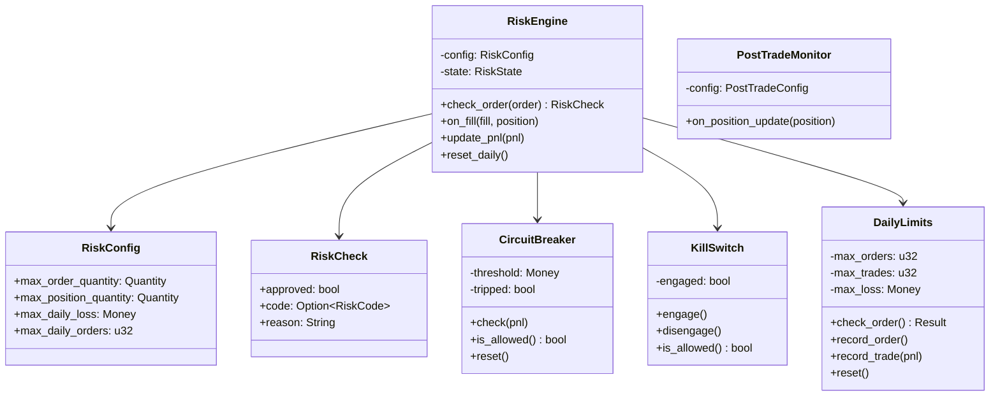
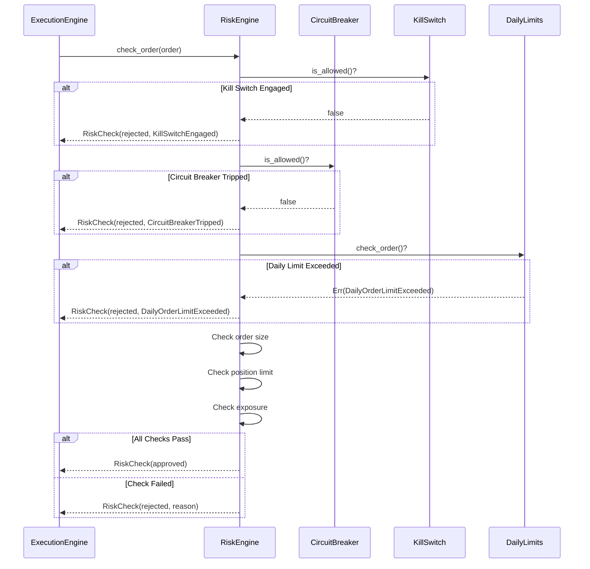

# 09 — Risk Management

**Version:** 1.0  
**Status:** Draft  
**Last Updated:** 2026-07-22  
**Related:** [06-Execution Engine](./06-execution-engine.md), [10-Portfolio Construction](./10-portfolio-construction.md)

---

## 1. Overview

### Purpose

The Risk Management system provides **multi-layer protection** against excessive losses and rogue trading. Risk checks are mandatory and cannot be bypassed — every order passes through pre-trade validation.

### Risk Layers

| Layer | Timing | Purpose |
|-------|--------|---------|
| **Pre-Trade** | Before order submission | Validate order against limits |
| **Post-Trade** | After fill | Monitor positions, trigger alerts |
| **Circuit Breaker** | Continuous | Halt trading on excessive loss |
| **Kill Switch** | Manual/Auto | Emergency stop all trading |
| **Daily Limits** | Per session | Cap daily orders, trades, loss |

### Key Principle

> Risk checks are **structural**, not optional. There is no code path that bypasses the RiskEngine.

---

## 2. Requirements

### Functional

| ID | Requirement |
|----|-------------|
| FR-01 | Pre-trade order validation (size, position, exposure) |
| FR-02 | Daily loss limit enforcement |
| FR-03 | Daily order count limit |
| FR-04 | Daily trade count limit |
| FR-05 | Position size limits per instrument |
| FR-06 | Total exposure limits |
| FR-07 | Circuit breaker on P&L threshold |
| FR-08 | Manual kill switch |
| FR-09 | Post-trade position monitoring |
| FR-10 | Auto-flatten on threshold breach |

### Non-Functional

| ID | Requirement | Target |
|----|-------------|--------|
| NFR-01 | Pre-trade check latency | < 100μs |
| NFR-02 | Zero bypass | Guaranteed (no code path skips risk) |
| NFR-03 | Audit trail | All rejections logged |

---

## 3. RiskEngine

### Definition

```rust
/// Risk engine — validates orders before submission.
///
/// This is a mandatory checkpoint in the order flow.
/// Orders that fail risk checks are rejected immediately.
pub struct RiskEngine {
    /// Risk configuration
    config: RiskConfig,
    /// Current state
    state: RiskState,
}

/// Risk configuration
#[derive(Clone, Debug)]
pub struct RiskConfig {
    /// Maximum order quantity
    pub max_order_quantity: Quantity,
    /// Maximum order value (notional)
    pub max_order_value: Money,
    /// Maximum position quantity per instrument
    pub max_position_quantity: Quantity,
    /// Maximum position value per instrument
    pub max_position_value: Money,
    /// Maximum total exposure
    pub max_total_exposure: Money,
    /// Maximum daily loss
    pub max_daily_loss: Money,
    /// Maximum orders per day
    pub max_daily_orders: u32,
    /// Maximum trades per day
    pub max_daily_trades: u32,
}

impl Default for RiskConfig {
    fn default() -> Self {
        RiskConfig {
            max_order_quantity: Quantity(10_000),
            max_order_value: Money::from_f64(1_000_000.0),
            max_position_quantity: Quantity(50_000),
            max_position_value: Money::from_f64(5_000_000.0),
            max_total_exposure: Money::from_f64(10_000_000.0),
            max_daily_loss: Money::from_f64(50_000.0),
            max_daily_orders: 100,
            max_daily_trades: 50,
        }
    }
}

/// Current risk state
#[derive(Clone, Debug, Default)]
pub struct RiskState {
    /// Orders placed today
    pub daily_order_count: u32,
    /// Trades executed today
    pub daily_trade_count: u32,
    /// Realized P&L today
    pub daily_pnl: Money,
    /// Current positions by symbol
    pub positions: HashMap<Symbol, Position>,
    /// Total exposure
    pub total_exposure: Money,
}
```

### Pre-Trade Check

```rust
impl RiskEngine {
    pub fn new(config: RiskConfig) -> Self {
        RiskEngine {
            config,
            state: RiskState::default(),
        }
    }
    
    /// Check if order passes all risk limits.
    ///
    /// This is called BEFORE order submission to broker.
    /// Returns RiskCheck with approval status and reason.
    pub fn check_order(&self, order: &Order) -> RiskCheck {
        // 1. Check daily order limit
        if self.state.daily_order_count >= self.config.max_daily_orders {
            return RiskCheck::rejected(
                RiskCode::DailyOrderLimitExceeded,
                format!(
                    "Daily order limit exceeded: {} >= {}",
                    self.state.daily_order_count,
                    self.config.max_daily_orders
                ),
            );
        }
        
        // 2. Check order quantity
        if order.quantity > self.config.max_order_quantity {
            return RiskCheck::rejected(
                RiskCode::OrderSizeExceeded,
                format!(
                    "Order quantity {} exceeds max {}",
                    order.quantity,
                    self.config.max_order_quantity
                ),
            );
        }
        
        // 3. Check order value (notional)
        if let Some(price) = order.price {
            let notional = Money(price.0 * order.quantity.0 as i64);
            if notional > self.config.max_order_value {
                return RiskCheck::rejected(
                    RiskCode::OrderValueExceeded,
                    format!("Order value {} exceeds max {}", notional, self.config.max_order_value),
                );
            }
        }
        
        // 4. Check position limit (projected)
        let current_qty = self.state.positions
            .get(&order.symbol)
            .map(|p| p.quantity.0 as i64)
            .unwrap_or(0);
        
        let projected_qty = if order.side == Side::Buy {
            current_qty + order.quantity.0 as i64
        } else {
            current_qty - order.quantity.0 as i64
        };
        
        if projected_qty.abs() as u64 > self.config.max_position_quantity.0 {
            return RiskCheck::rejected(
                RiskCode::PositionLimitExceeded,
                format!(
                    "Projected position {} exceeds max {}",
                    projected_qty,
                    self.config.max_position_quantity
                ),
            );
        }
        
        // 5. Check daily loss limit
        if self.state.daily_pnl < Money(-self.config.max_daily_loss.0) {
            return RiskCheck::rejected(
                RiskCode::DailyLossLimitExceeded,
                format!(
                    "Daily loss {} exceeds max {}",
                    self.state.daily_pnl,
                    self.config.max_daily_loss
                ),
            );
        }
        
        // 6. Check total exposure
        if self.state.total_exposure > self.config.max_total_exposure {
            return RiskCheck::rejected(
                RiskCode::ExposureLimitExceeded,
                "Total exposure limit exceeded".into(),
            );
        }
        
        // All checks passed
        RiskCheck::approved()
    }
    
    /// Update state after fill
    pub fn on_fill(&mut self, fill: &Fill, position: &Position) {
        self.state.daily_trade_count += 1;
        self.state.positions.insert(fill.symbol.clone(), position.clone());
        // Recalculate exposure
        self.recalculate_exposure();
    }
    
    /// Update daily P&L
    pub fn update_pnl(&mut self, pnl: Money) {
        self.state.daily_pnl = pnl;
    }
    
    /// Reset daily counters (at start of new session)
    pub fn reset_daily(&mut self) {
        self.state.daily_order_count = 0;
        self.state.daily_trade_count = 0;
        self.state.daily_pnl = Money(0);
    }
    
    fn recalculate_exposure(&mut self) {
        self.state.total_exposure = self.state.positions
            .values()
            .map(|p| Money(p.avg_price.0 * p.quantity.0 as i64))
            .sum();
    }
}
```

### RiskCheck Result

```rust
/// Result of a risk check
#[derive(Clone, Debug)]
pub struct RiskCheck {
    /// Whether the order is approved
    pub approved: bool,
    /// Rejection code (if rejected)
    pub code: Option<RiskCode>,
    /// Human-readable reason
    pub reason: String,
}

impl RiskCheck {
    pub fn approved() -> Self {
        RiskCheck {
            approved: true,
            code: None,
            reason: String::new(),
        }
    }
    
    pub fn rejected(code: RiskCode, reason: String) -> Self {
        RiskCheck {
            approved: false,
            code: Some(code),
            reason,
        }
    }
}

/// Risk rejection codes
#[derive(Clone, Copy, Debug, PartialEq, Eq)]
pub enum RiskCode {
    /// Daily order limit exceeded
    DailyOrderLimitExceeded,
    /// Daily trade limit exceeded
    DailyTradeLimitExceeded,
    /// Daily loss limit exceeded
    DailyLossLimitExceeded,
    /// Order size exceeds limit
    OrderSizeExceeded,
    /// Order value exceeds limit
    OrderValueExceeded,
    /// Position limit exceeded
    PositionLimitExceeded,
    /// Total exposure exceeded
    ExposureLimitExceeded,
    /// Circuit breaker tripped
    CircuitBreakerTripped,
    /// Kill switch engaged
    KillSwitchEngaged,
}
```

---

## 4. Circuit Breaker

### Purpose

Automatically halts trading when losses exceed a threshold.

```rust
/// Circuit breaker — trips when P&L exceeds threshold
pub struct CircuitBreaker {
    /// Loss threshold (negative value)
    threshold: Money,
    /// Whether breaker is tripped
    tripped: bool,
    /// When it tripped
    tripped_at: Option<Timestamp>,
}

impl CircuitBreaker {
    pub fn new(threshold: Money) -> Self {
        CircuitBreaker {
            threshold,
            tripped: false,
            tripped_at: None,
        }
    }
    
    /// Check P&L and trip if threshold exceeded
    pub fn check(&mut self, pnl: Money) {
        if !self.tripped && pnl < self.threshold {
            tracing::error!(
                pnl = %pnl,
                threshold = %self.threshold,
                "CIRCUIT BREAKER TRIPPED"
            );
            self.tripped = true;
            self.tripped_at = Some(Timestamp::now());
        }
    }
    
    /// Check if trading is allowed
    pub fn is_allowed(&self) -> bool {
        !self.tripped
    }
    
    /// Reset the breaker (manual intervention required)
    pub fn reset(&mut self) {
        tracing::warn!("Circuit breaker reset");
        self.tripped = false;
        self.tripped_at = None;
    }
}
```

---

## 5. Kill Switch

### Purpose

Manual emergency stop for all trading.

```rust
/// Kill switch — manual emergency stop
pub struct KillSwitch {
    /// Whether kill switch is engaged
    engaged: bool,
    /// When it was engaged
    engaged_at: Option<Timestamp>,
    /// Reason for engagement
    reason: Option<String>,
}

impl KillSwitch {
    pub fn new() -> Self {
        KillSwitch {
            engaged: false,
            engaged_at: None,
            reason: None,
        }
    }
    
    /// Engage the kill switch (stop all trading)
    pub fn engage(&mut self) {
        self.engage_with_reason("manual".into());
    }
    
    /// Engage with a reason
    pub fn engage_with_reason(&mut self, reason: String) {
        tracing::error!(reason = %reason, "KILL SWITCH ENGAGED");
        self.engaged = true;
        self.engaged_at = Some(Timestamp::now());
        self.reason = Some(reason);
    }
    
    /// Disengage the kill switch
    pub fn disengage(&mut self) {
        tracing::warn!("Kill switch disengaged");
        self.engaged = false;
        self.engaged_at = None;
        self.reason = None;
    }
    
    /// Check if trading is allowed
    pub fn is_allowed(&self) -> bool {
        !self.engaged
    }
}
```

---

## 6. Daily Limits

### Purpose

Track and enforce daily trading limits.

```rust
/// Daily trading limits
pub struct DailyLimits {
    /// Maximum orders per day
    max_orders: u32,
    /// Maximum trades per day
    max_trades: u32,
    /// Maximum daily loss
    max_loss: Money,
    /// Current counts
    order_count: u32,
    trade_count: u32,
    daily_pnl: Money,
}

impl DailyLimits {
    pub fn new(max_orders: u32, max_trades: u32, max_loss: Money) -> Self {
        DailyLimits {
            max_orders,
            max_trades,
            max_loss,
            order_count: 0,
            trade_count: 0,
            daily_pnl: Money(0),
        }
    }
    
    /// Check if order is allowed
    pub fn check_order(&self) -> Result<(), RiskCode> {
        if self.order_count >= self.max_orders {
            return Err(RiskCode::DailyOrderLimitExceeded);
        }
        if self.daily_pnl < Money(-self.max_loss.0) {
            return Err(RiskCode::DailyLossLimitExceeded);
        }
        Ok(())
    }
    
    /// Record an order
    pub fn record_order(&mut self) {
        self.order_count += 1;
    }
    
    /// Record a trade
    pub fn record_trade(&mut self, pnl: Money) {
        self.trade_count += 1;
        self.daily_pnl = Money(self.daily_pnl.0 + pnl.0);
    }
    
    /// Reset for new day
    pub fn reset(&mut self) {
        self.order_count = 0;
        self.trade_count = 0;
        self.daily_pnl = Money(0);
    }
}
```

---

## 7. Post-Trade Monitor

### Purpose

Monitor positions after fills and trigger risk actions.

```rust
/// Post-trade risk monitor
pub struct PostTradeMonitor {
    /// Configuration
    config: PostTradeConfig,
    /// Message bus for alerts
    bus: Arc<MessageBus>,
}

/// Post-trade configuration
#[derive(Clone, Debug)]
pub struct PostTradeConfig {
    /// Maximum unrealized loss per position
    pub max_unrealized_loss: Money,
    /// Maximum drawdown from peak
    pub max_drawdown: Money,
    /// Auto-flatten threshold
    pub auto_flatten_loss: Money,
}

impl PostTradeMonitor {
    pub fn new(config: PostTradeConfig, bus: Arc<MessageBus>) -> Self {
        PostTradeMonitor { config, bus }
    }
    
    /// Check position after update
    pub fn on_position_update(&self, position: &Position) {
        // Check unrealized loss
        if position.unrealized_pnl < Money(-self.config.max_unrealized_loss.0) {
            tracing::warn!(
                symbol = %position.symbol,
                pnl = %position.unrealized_pnl,
                "Position loss exceeds threshold"
            );
            
            // Publish risk alert
            self.bus.publish_order_event(OrderEvent::Rejected {
                at: Timestamp::now(),
                order_id: OrderId("risk_alert".into()),
                reason: format!(
                    "Position {} loss {} exceeds threshold",
                    position.symbol,
                    position.unrealized_pnl
                ),
            });
        }
        
        // Auto-flatten check
        if position.unrealized_pnl < Money(-self.config.auto_flatten_loss.0) {
            tracing::error!(
                symbol = %position.symbol,
                pnl = %position.unrealized_pnl,
                "AUTO-FLATTEN TRIGGERED"
            );
            // Would emit flatten order here
        }
    }
}
```

---

## 8. Class Diagram



---

## 9. Sequence Diagrams

### Pre-Trade Risk Check



---

## 10. Configuration

```yaml
# config/risk.yaml
risk:
  # Pre-trade limits
  max_order_quantity: 10000
  max_order_value: 1000000
  max_position_quantity: 50000
  max_position_value: 5000000
  max_total_exposure: 10000000
  
  # Daily limits
  max_daily_loss: 50000
  max_daily_orders: 100
  max_daily_trades: 50
  
  # Circuit breaker
  circuit_breaker:
    threshold: -50000  # Trip at 50k loss
    
  # Post-trade monitoring
  post_trade:
    max_unrealized_loss: 25000
    max_drawdown: 100000
    auto_flatten_loss: 50000
```

---

## 11. Error Handling

```rust
/// Risk errors
#[derive(Debug, thiserror::Error)]
pub enum RiskError {
    /// Order rejected by risk check
    #[error("order rejected: {code} - {reason}")]
    OrderRejected { code: RiskCode, reason: String },
    
    /// Circuit breaker tripped
    #[error("circuit breaker tripped at P&L {0}")]
    CircuitBreakerTripped(Money),
    
    /// Kill switch engaged
    #[error("kill switch engaged: {0}")]
    KillSwitchEngaged(String),
    
    /// Daily limit exceeded
    #[error("daily limit exceeded: {0}")]
    DailyLimitExceeded(String),
}
```

---

## 12. Testing Requirements

### Unit Tests

```rust
#[test]
fn risk_engine_rejects_oversized_order() {
    let config = RiskConfig {
        max_order_quantity: Quantity(100),
        ..Default::default()
    };
    let engine = RiskEngine::new(config);
    
    let order = Order::with_quantity(Quantity(200));
    let check = engine.check_order(&order);
    
    assert!(!check.approved);
    assert_eq!(check.code, Some(RiskCode::OrderSizeExceeded));
}

#[test]
fn circuit_breaker_trips_on_loss() {
    let mut cb = CircuitBreaker::new(Money(-50_000));
    
    assert!(cb.is_allowed());
    
    cb.check(Money(-60_000));
    
    assert!(!cb.is_allowed());
}

#[test]
fn daily_limits_enforce_order_count() {
    let mut limits = DailyLimits::new(2, 10, Money(100_000));
    
    assert!(limits.check_order().is_ok());
    limits.record_order();
    
    assert!(limits.check_order().is_ok());
    limits.record_order();
    
    assert!(matches!(
        limits.check_order(),
        Err(RiskCode::DailyOrderLimitExceeded)
    ));
}
```

---

## 13. Implementation Notes

### Best Practices

1. **Fail closed**: If risk check errors, reject the order
2. **Audit all rejections**: Log every rejected order with reason
3. **No bypass**: RiskEngine is in the only code path to broker
4. **Reset daily**: Clear counters at market open

### Gotchas

1. **Race conditions**: Use atomic operations for counters
2. **Time zones**: Reset daily limits at market open (IST 9:15 AM)
3. **Partial fills**: Count trades, not orders, for trade limits

---

## 14. Cross-References

- [06-Execution Engine](./06-execution-engine.md) — Uses RiskEngine
- [10-Portfolio Construction](./10-portfolio-construction.md) — Position state
- [13-Observability](./13-observability.md) — Risk metrics
