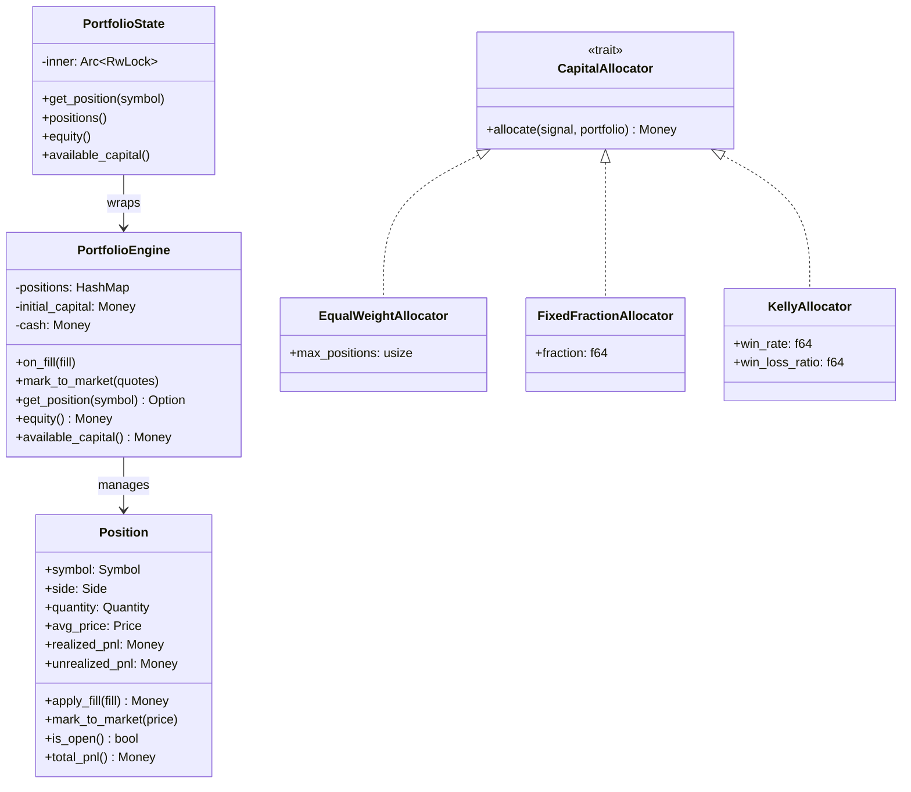
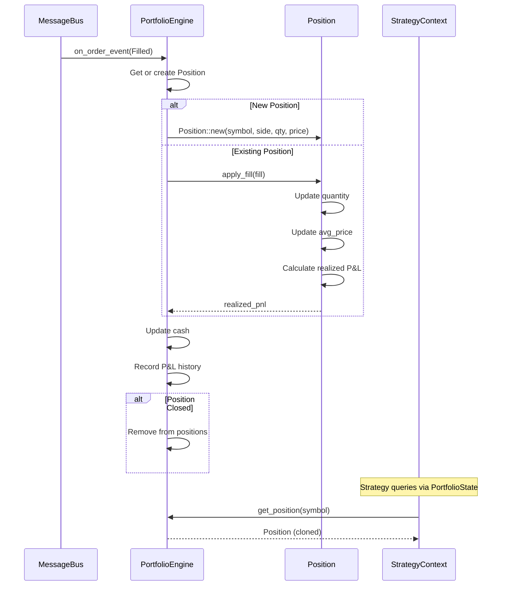

# 10 — Portfolio Construction

**Version:** 1.0  
**Status:** Draft  
**Last Updated:** 2026-07-22  
**Related:** [06-Execution Engine](./06-execution-engine.md), [09-Risk Management](./09-risk-management.md)

---

## 1. Overview

### Purpose

The Portfolio Construction system tracks positions, calculates P&L, manages capital allocation, and provides portfolio state to strategies. It is the **single source of truth** for "what do I own and what is it worth?"

### Responsibilities

| Responsibility | Description |
|----------------|-------------|
| **Position Tracking** | Maintain open positions per instrument |
| **P&L Calculation** | Realized and unrealized profit/loss |
| **Capital Allocation** | Determine how much capital per trade |
| **Exposure Tracking** | Total portfolio exposure |
| **State Provision** | Provide portfolio state to strategies |

---

## 2. Requirements

### Functional

| ID | Requirement |
|----|-------------|
| FR-01 | Track positions per instrument |
| FR-02 | Calculate average entry price |
| FR-03 | Calculate realized P&L on position close |
| FR-04 | Calculate unrealized P&L from market prices |
| FR-05 | Track total portfolio equity |
| FR-06 | Provide available capital for new trades |
| FR-07 | Support multiple allocation models |
| FR-08 | Update positions on fills |

### Non-Functional

| ID | Requirement | Target |
|----|-------------|--------|
| NFR-01 | Position update latency | < 100μs |
| NFR-02 | P&L calculation | < 10μs per position |
| NFR-03 | Memory per position | < 200 bytes |

---

## 3. Position Model

### Definition

```rust
/// A position in a single instrument
#[derive(Clone, Debug)]
pub struct Position {
    /// Instrument symbol
    pub symbol: Symbol,
    /// Long or Short
    pub side: Side,
    /// Current quantity
    pub quantity: Quantity,
    /// Average entry price
    pub avg_price: Price,
    /// Realized P&L (from closed portions)
    pub realized_pnl: Money,
    /// Unrealized P&L (from current market price)
    pub unrealized_pnl: Money,
    /// Last update timestamp
    pub updated_at: Timestamp,
}

impl Position {
    /// Create a new position from initial fill
    pub fn new(symbol: Symbol, side: Side, quantity: Quantity, price: Price) -> Self {
        Position {
            symbol,
            side,
            quantity,
            avg_price: price,
            realized_pnl: Money(0),
            unrealized_pnl: Money(0),
            updated_at: Timestamp::now(),
        }
    }
    
    /// Check if position is open
    pub fn is_open(&self) -> bool {
        self.quantity.0 > 0
    }
    
    /// Check if position is long
    pub fn is_long(&self) -> bool {
        self.side == Side::Buy
    }
    
    /// Check if position is short
    pub fn is_short(&self) -> bool {
        self.side == Side::Sell
    }
    
    /// Total P&L (realized + unrealized)
    pub fn total_pnl(&self) -> Money {
        Money(self.realized_pnl.0 + self.unrealized_pnl.0)
    }
    
    /// Notional value (quantity * avg_price)
    pub fn notional(&self) -> Money {
        Money(self.avg_price.0 * self.quantity.0 as i64)
    }
    
    /// Market value (quantity * current price)
    pub fn market_value(&self, current_price: Price) -> Money {
        Money(current_price.0 * self.quantity.0 as i64)
    }
}
```

### Position Updates

```rust
impl Position {
    /// Apply a fill to this position.
    ///
    /// Returns the realized P&L from this fill (if closing/reducing).
    pub fn apply_fill(&mut self, fill: &Fill) -> Money {
        let fill_qty = fill.quantity.0 as i64;
        let current_qty = self.quantity.0 as i64;
        
        // Same direction: increase position
        if (self.side == Side::Buy && fill.side == Side::Buy) ||
           (self.side == Side::Sell && fill.side == Side::Sell) {
            // Update average price
            let total_cost = self.avg_price.0 * current_qty + fill.price.0 * fill_qty;
            let new_qty = current_qty + fill_qty;
            self.avg_price = Price(total_cost / new_qty);
            self.quantity = Quantity(new_qty as u64);
            Money(0) // No realized P&L
        } else {
            // Opposite direction: reduce/close position
            let close_qty = fill_qty.min(current_qty);
            
            // Calculate realized P&L
            let pnl = if self.side == Side::Buy {
                // Long: sell at fill price, bought at avg
                (fill.price.0 - self.avg_price.0) * close_qty
            } else {
                // Short: buy at fill price, sold at avg
                (self.avg_price.0 - fill.price.0) * close_qty
            };
            
            self.realized_pnl = Money(self.realized_pnl.0 + pnl);
            self.quantity = Quantity((current_qty - close_qty) as u64);
            
            Money(pnl)
        }
    }
    
    /// Update unrealized P&L from current market price
    pub fn mark_to_market(&mut self, current_price: Price) {
        self.unrealized_pnl = if self.side == Side::Buy {
            Money((current_price.0 - self.avg_price.0) * self.quantity.0 as i64)
        } else {
            Money((self.avg_price.0 - current_price.0) * self.quantity.0 as i64)
        };
        self.updated_at = Timestamp::now();
    }
}
```

---

## 4. PortfolioEngine

### Definition

```rust
/// Portfolio engine — tracks positions and P&L.
///
/// This is a Component that subscribes to OrderEvent::Filled
/// and updates positions accordingly.
pub struct PortfolioEngine {
    /// Open positions by symbol
    positions: HashMap<Symbol, Position>,
    /// Initial capital
    initial_capital: Money,
    /// Current cash (available for trading)
    cash: Money,
    /// Realized P&L history
    realized_history: Vec<(Timestamp, Money)>,
    /// Clock
    clock: Arc<dyn Clock>,
}

impl PortfolioEngine {
    pub fn new(initial_capital: Money, clock: Arc<dyn Clock>) -> Self {
        PortfolioEngine {
            positions: HashMap::new(),
            initial_capital,
            cash: initial_capital,
            realized_history: Vec::new(),
            clock,
        }
    }
    
    /// Handle a fill event
    pub fn on_fill(&mut self, fill: &Fill) {
        let position = self.positions
            .entry(fill.symbol.clone())
            .or_insert_with(|| Position::new(
                fill.symbol.clone(),
                fill.side,
                Quantity(0),
                fill.price,
            ));
        
        let realized = position.apply_fill(fill);
        
        // Update cash
        let fill_value = Money(fill.price.0 * fill.quantity.0 as i64);
        if fill.side == Side::Buy {
            self.cash = Money(self.cash.0 - fill_value.0);
        } else {
            self.cash = Money(self.cash.0 + fill_value.0);
        }
        
        // Record realized P&L
        if realized.0 != 0 {
            self.realized_history.push((self.clock.now(), realized));
        }
        
        // Remove closed positions
        if !position.is_open() {
            self.positions.remove(&fill.symbol);
        }
    }
    
    /// Update unrealized P&L for all positions
    pub fn mark_to_market(&mut self, quotes: &HashMap<Symbol, Price>) {
        for (symbol, position) in &mut self.positions {
            if let Some(price) = quotes.get(symbol) {
                position.mark_to_market(*price);
            }
        }
    }
    
    /// Get position for a symbol
    pub fn get_position(&self, symbol: &Symbol) -> Option<&Position> {
        self.positions.get(symbol)
    }
    
    /// Get all positions
    pub fn positions(&self) -> impl Iterator<Item = &Position> {
        self.positions.values()
    }
    
    /// Total unrealized P&L
    pub fn total_unrealized(&self) -> Money {
        Money(self.positions.values().map(|p| p.unrealized_pnl.0).sum())
    }
    
    /// Total realized P&L
    pub fn total_realized(&self) -> Money {
        Money(self.positions.values().map(|p| p.realized_pnl.0).sum())
    }
    
    /// Total equity (cash + unrealized)
    pub fn equity(&self) -> Money {
        Money(self.cash.0 + self.total_unrealized().0)
    }
    
    /// Available capital for new trades
    pub fn available_capital(&self) -> Money {
        // Simple: cash minus margin requirements
        // Could be more sophisticated with margin calculations
        self.cash
    }
    
    /// Total exposure (sum of position notionals)
    pub fn total_exposure(&self) -> Money {
        Money(self.positions.values().map(|p| p.notional().0).sum())
    }
}
```

---

## 5. PortfolioState (Read-Only View)

### Purpose

Strategies access portfolio state through a read-only view.

```rust
/// Read-only view of portfolio state for strategies
pub struct PortfolioState {
    inner: Arc<RwLock<PortfolioEngine>>,
}

impl PortfolioState {
    pub fn new(engine: Arc<RwLock<PortfolioEngine>>) -> Self {
        PortfolioState { inner: engine }
    }
    
    /// Get position for a symbol
    pub fn get_position(&self, symbol: &Symbol) -> Option<Position> {
        self.inner.read().unwrap().get_position(symbol).cloned()
    }
    
    /// Get all positions
    pub fn positions(&self) -> Vec<Position> {
        self.inner.read().unwrap().positions().cloned().collect()
    }
    
    /// Get total equity
    pub fn equity(&self) -> Money {
        self.inner.read().unwrap().equity()
    }
    
    /// Get available capital
    pub fn available_capital(&self) -> Money {
        self.inner.read().unwrap().available_capital()
    }
}
```

---

## 6. Capital Allocation

### Allocation Models

```rust
/// Capital allocation strategy
pub trait CapitalAllocator: Send + Sync {
    /// Calculate capital to allocate for a signal
    fn allocate(
        &self,
        signal: &Signal,
        portfolio: &PortfolioState,
    ) -> Money;
}

/// Equal-weight allocation
///
/// Splits available capital equally across all active signals.
pub struct EqualWeightAllocator {
    /// Maximum positions
    pub max_positions: usize,
}

impl CapitalAllocator for EqualWeightAllocator {
    fn allocate(&self, signal: &Signal, portfolio: &PortfolioState) -> Money {
        let available = portfolio.available_capital();
        let per_position = Money(available.0 / self.max_positions as i64);
        per_position
    }
}

/// Fixed-fraction allocation
///
/// Allocates a fixed fraction of equity per trade.
pub struct FixedFractionAllocator {
    /// Fraction of equity (e.g., 0.02 = 2%)
    pub fraction: f64,
}

impl CapitalAllocator for FixedFractionAllocator {
    fn allocate(&self, signal: &Signal, portfolio: &PortfolioState) -> Money {
        let equity = portfolio.equity();
        Money((equity.0 as f64 * self.fraction) as i64)
    }
}

/// Kelly criterion allocation
///
/// Uses Kelly formula for optimal bet sizing.
pub struct KellyAllocator {
    /// Win rate (0-1)
    pub win_rate: f64,
    /// Win/loss ratio
    pub win_loss_ratio: f64,
    /// Kelly fraction (usually half-Kelly for safety)
    pub fraction: f64,
}

impl CapitalAllocator for KellyAllocator {
    fn allocate(&self, signal: &Signal, portfolio: &PortfolioState) -> Money {
        // Kelly % = W - (1-W)/R
        // W = win rate, R = win/loss ratio
        let kelly = self.win_rate - (1.0 - self.win_rate) / self.win_loss_ratio;
        let kelly = kelly.max(0.0) * self.fraction; // Half-Kelly
        
        let equity = portfolio.equity();
        Money((equity.0 as f64 * kelly) as i64)
    }
}
```

---

## 7. Class Diagram



---

## 8. Sequence Diagrams

### Fill Processing Flow



---

## 9. Configuration

```yaml
# config/portfolio.yaml
portfolio:
  initial_capital: 1000000
  
  # Capital allocation
  allocation:
    model: "equal_weight"  # equal_weight | fixed_fraction | kelly
    params:
      # For equal_weight
      max_positions: 10
      
      # For fixed_fraction
      # fraction: 0.02
      
      # For kelly
      # win_rate: 0.55
      # win_loss_ratio: 1.5
      # fraction: 0.5  # half-Kelly
      
  # Margin requirements (simplified)
  margin:
    equity_multiplier: 1.0  # No leverage
    fno_multiplier: 5.0     # 5x for F&O
```

---

## 10. Error Handling

```rust
/// Portfolio errors
#[derive(Debug, thiserror::Error)]
pub enum PortfolioError {
    /// Position not found
    #[error("position not found: {0}")]
    PositionNotFound(Symbol),
    
    /// Insufficient capital
    #[error("insufficient capital: required {required}, available {available}")]
    InsufficientCapital { required: Money, available: Money },
    
    /// Invalid fill (negative quantity, etc.)
    #[error("invalid fill: {0}")]
    InvalidFill(String),
}
```

---

## 11. Testing Requirements

### Unit Tests

```rust
#[test]
fn position_apply_fill_increases_quantity() {
    let mut pos = Position::new(
        Symbol::new("RELIANCE"),
        Side::Buy,
        Quantity(10),
        Price(1000),
    );
    
    let fill = Fill {
        fill_id: "1".into(),
        order_id: OrderId("1".into()),
        symbol: Symbol::new("RELIANCE"),
        side: Side::Buy,
        quantity: Quantity(5),
        price: Price(1100),
        at: ts(),
        liquidity: LiquidityFlag::Taker,
    };
    
    let realized = pos.apply_fill(&fill);
    
    assert_eq!(pos.quantity, Quantity(15));
    assert_eq!(pos.avg_price, Price(1033)); // (1000*10 + 1100*5) / 15
    assert_eq!(realized, Money(0)); // No realized P&L for increase
}

#[test]
fn position_apply_fill_calculates_realized_pnl() {
    let mut pos = Position::new(
        Symbol::new("RELIANCE"),
        Side::Buy,
        Quantity(10),
        Price(1000),
    );
    
    let fill = Fill {
        fill_id: "1".into(),
        order_id: OrderId("1".into()),
        symbol: Symbol::new("RELIANCE"),
        side: Side::Sell,
        quantity: Quantity(10),
        price: Price(1100),
        at: ts(),
        liquidity: LiquidityFlag::Taker,
    };
    
    let realized = pos.apply_fill(&fill);
    
    assert_eq!(pos.quantity, Quantity(0));
    assert!(!pos.is_open());
    assert_eq!(realized, Money(1000)); // (1100 - 1000) * 10
}

#[test]
fn portfolio_equity_calculation() {
    let mut pe = PortfolioEngine::new(Money(1_000_000), Arc::new(LiveClock));
    
    // Buy 10 shares at 1000
    let fill = test_fill(Symbol::new("RELIANCE"), Side::Buy, Quantity(10), Price(1000));
    pe.on_fill(&fill);
    
    // Cash reduced
    assert_eq!(pe.cash, Money(990_000));
    
    // Mark to market at 1100
    let mut quotes = HashMap::new();
    quotes.insert(Symbol::new("RELIANCE"), Price(1100));
    pe.mark_to_market(&quotes);
    
    // Equity = cash + unrealized = 990_000 + 1000 = 991_000
    assert_eq!(pe.equity(), Money(991_000));
}
```

---

## 12. Implementation Notes

### Best Practices

1. **Clone for strategies**: Return cloned Position to strategies (avoid lock contention)
2. **Mark-to-market**: Update unrealized P&L on every quote (or periodically)
3. **Persist state**: Save positions to SQLite for crash recovery
4. **Audit trail**: Log all position changes

### Gotchas

1. **Average price**: Use weighted average, not simple average
2. **Short positions**: P&L calculation is inverted
3. **Partial closes**: Track realized P&L separately
4. **Currency**: All values in paise (1/100 INR) for precision

---

## 13. Cross-References

- [06-Execution Engine](./06-execution-engine.md) — Fills update positions
- [07-Strategy System](./07-strategy-system.md) — Strategies query portfolio
- [09-Risk Management](./09-risk-management.md) — Uses position state
