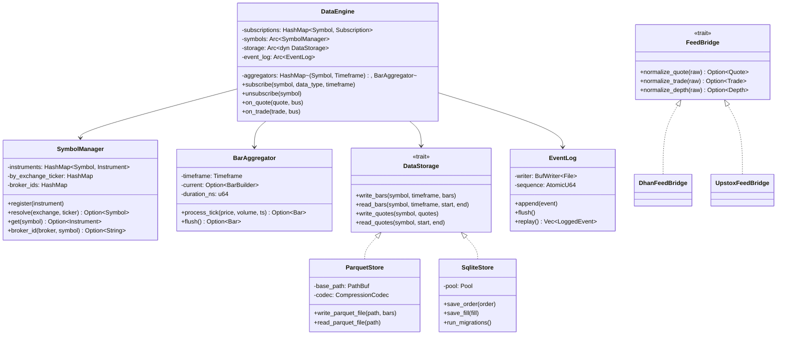
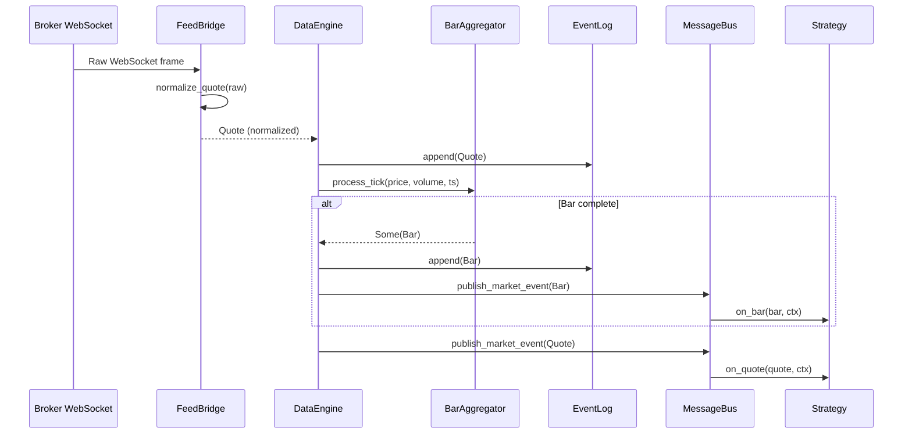
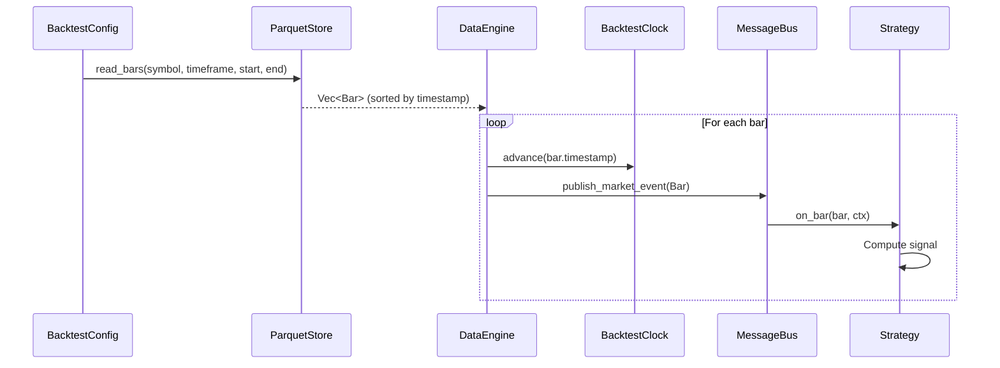
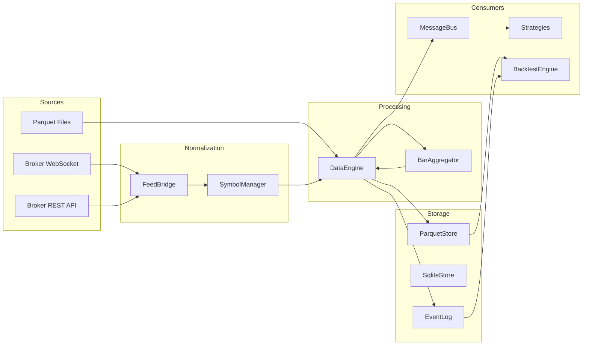

# 11 — Data Infrastructure

**Version:** 1.0  
**Status:** Draft  
**Last Updated:** 2026-07-22  
**Related:** [04-Message Bus](./04-message-driven-architecture.md), [08-Adapter System](./08-adapter-system.md), [12-Zero-Parity Engine](./12-zero-parity-engine.md)

---

## 1. Overview

### Purpose

The Data Infrastructure provides the **market data pipeline** — from broker WebSocket feeds through normalization, aggregation, storage, and delivery to strategies. It is the framework's sensory system, responsible for turning raw broker data into clean, typed domain events.

### Responsibilities

| Responsibility | Description |
|----------------|-------------|
| **Feed Bridge** | Normalize broker-specific data into domain events |
| **Symbol Manager** | Resolve symbols across exchanges and brokers |
| **Bar Aggregation** | Build OHLCV bars from tick data |
| **Storage** | Persist time-series (Parquet) and relational (SQLite) data |
| **Event Log** | Append-only log for replay and audit |
| **Data Quality** | Validate, gap-check, and clean data |

### Design Principles

| Principle | Implementation |
|-----------|----------------|
| **Zero-copy hot path** | Market events flow without allocation |
| **Broker-agnostic** | All consumers see normalized domain types |
| **Deterministic replay** | Same data → same results (zero-parity) |
| **Storage separation** | Time-series in Parquet, relational in SQLite |
| **Gap detection** | Automatic detection of missing data |

---

## 2. Requirements

### Functional

| ID | Requirement |
|----|-------------|
| FR-01 | Normalize broker quotes into `Quote` domain type |
| FR-02 | Normalize broker trades into `Trade` domain type |
| FR-03 | Aggregate ticks into configurable timeframe bars |
| FR-04 | Resolve symbols to broker-specific instrument IDs |
| FR-05 | Persist bars to Parquet (columnar, compressed) |
| FR-06 | Persist orders/positions to SQLite (relational) |
| FR-07 | Maintain append-only event log for replay |
| FR-08 | Detect and report data gaps |
| FR-09 | Support multiple simultaneous data subscriptions |
| FR-10 | Provide historical data for backtesting |

### Non-Functional

| ID | Requirement | Target |
|----|-------------|--------|
| NFR-01 | Quote normalization latency | < 1μs |
| NFR-02 | Bar aggregation latency | < 5μs per tick |
| NFR-03 | Parquet write throughput | > 100K bars/sec |
| NFR-04 | Event log append latency | < 10μs |
| NFR-05 | Memory per subscription | < 1KB |
| NFR-06 | Storage compression | > 5:1 ratio |

---

## 3. DataEngine

### Definition

```rust
/// Data engine — orchestrates the market data pipeline.
///
/// This is a Component that manages subscriptions, normalization,
/// aggregation, and storage of market data.
pub struct DataEngine {
    /// Active subscriptions
    subscriptions: HashMap<Symbol, Subscription>,
    /// Bar aggregators per (symbol, timeframe)
    aggregators: HashMap<(Symbol, Timeframe), BarAggregator>,
    /// Symbol manager
    symbols: Arc<SymbolManager>,
    /// Storage backend
    storage: Arc<dyn DataStorage>,
    /// Event log
    event_log: Arc<EventLog>,
    /// Clock
    clock: Arc<dyn Clock>,
}

/// A data subscription
#[derive(Clone, Debug)]
pub struct Subscription {
    /// Symbol being subscribed
    pub symbol: Symbol,
    /// Data type (Quote, Trade, Bar)
    pub data_type: DataType,
    /// Timeframe (for bar subscriptions)
    pub timeframe: Option<Timeframe>,
    /// When subscription started
    pub started_at: Timestamp,
}

/// Types of market data
#[derive(Clone, Copy, Debug, PartialEq, Eq, Hash)]
pub enum DataType {
    /// Quote ticks (bid/ask)
    Quote,
    /// Trade ticks (last price)
    Trade,
    /// Aggregated bars
    Bar,
    /// Order book depth
    Depth,
}

impl DataEngine {
    pub fn new(
        symbols: Arc<SymbolManager>,
        storage: Arc<dyn DataStorage>,
        event_log: Arc<EventLog>,
        clock: Arc<dyn Clock>,
    ) -> Self {
        DataEngine {
            subscriptions: HashMap::new(),
            aggregators: HashMap::new(),
            symbols,
            storage,
            event_log,
            clock,
        }
    }

    /// Subscribe to market data for a symbol
    pub fn subscribe(&mut self, symbol: Symbol, data_type: DataType, timeframe: Option<Timeframe>) {
        let sub = Subscription {
            symbol: symbol.clone(),
            data_type,
            timeframe,
            started_at: self.clock.now(),
        };
        self.subscriptions.insert(symbol.clone(), sub);

        // Create aggregator if bar subscription
        if data_type == DataType::Bar {
            if let Some(tf) = timeframe {
                let agg = BarAggregator::new(tf);
                self.aggregators.insert((symbol, tf), agg);
            }
        }
    }

    /// Unsubscribe from market data
    pub fn unsubscribe(&mut self, symbol: &Symbol) {
        self.subscriptions.remove(symbol);
        self.aggregators.retain(|(s, _), _| s != symbol);
    }

    /// Process an incoming quote tick
    pub fn on_quote(&mut self, quote: &Quote, bus: &MessageBus) {
        // 1. Log to event log
        self.event_log.append(MarketEvent::Quote(quote.clone()));

        // 2. Feed bar aggregators
        for ((sym, _tf), agg) in &mut self.aggregators {
            if *sym == quote.symbol {
                if let Some(bar) = agg.process_tick(quote.last_price, quote.volume, quote.timestamp) {
                    let market_event = MarketEvent::Bar(bar.clone());
                    self.event_log.append(market_event.clone());
                    bus.publish_market_event(market_event);
                }
            }
        }

        // 3. Publish quote to bus
        bus.publish_market_event(MarketEvent::Quote(quote.clone()));
    }

    /// Process an incoming trade tick
    pub fn on_trade(&mut self, trade: &Trade, bus: &MessageBus) {
        self.event_log.append(MarketEvent::Trade(trade.clone()));

        // Feed aggregators
        for ((sym, _tf), agg) in &mut self.aggregators {
            if *sym == trade.symbol {
                if let Some(bar) = agg.process_tick(trade.price, trade.quantity, trade.timestamp) {
                    bus.publish_market_event(MarketEvent::Bar(bar));
                }
            }
        }

        bus.publish_market_event(MarketEvent::Trade(trade.clone()));
    }
}
```

---

## 4. FeedBridge

### Purpose

The FeedBridge is the **anti-corruption layer** between broker-specific data formats and the framework's domain types. Each adapter has its own FeedBridge implementation.

### Definition

```rust
/// Feed bridge — converts raw broker data to domain events.
///
/// Lives inside each adapter. Transforms broker-specific wire formats
/// into normalized Quote, Trade, and Bar types.
pub trait FeedBridge: Send + Sync {
    /// Convert a raw broker message into a Quote
    fn normalize_quote(&self, raw: &RawMessage) -> Option<Quote>;

    /// Convert a raw broker message into a Trade
    fn normalize_trade(&self, raw: &RawMessage) -> Option<Trade>;

    /// Convert a raw broker message into depth data
    fn normalize_depth(&self, raw: &RawMessage) -> Option<Depth>;
}

/// Raw message from broker WebSocket
#[derive(Clone, Debug)]
pub struct RawMessage {
    /// Broker identifier
    pub broker: &'static str,
    /// Raw payload (JSON bytes)
    pub payload: Vec<u8>,
    /// Receive timestamp
    pub received_at: Timestamp,
}

/// Normalized quote
#[derive(Clone, Debug)]
pub struct Quote {
    /// Instrument symbol
    pub symbol: Symbol,
    /// Best bid price
    pub bid: Price,
    /// Best ask price
    pub ask: Price,
    /// Bid quantity
    pub bid_qty: u64,
    /// Ask quantity
    pub ask_qty: u64,
    /// Last traded price
    pub last_price: Price,
    /// Volume traded today
    pub volume: u64,
    /// Exchange timestamp
    pub timestamp: Timestamp,
}

/// Normalized trade
#[derive(Clone, Debug)]
pub struct Trade {
    /// Instrument symbol
    pub symbol: Symbol,
    /// Trade price
    pub price: Price,
    /// Trade quantity
    pub quantity: u64,
    /// Trade direction (buy/sell initiated)
    pub side: Side,
    /// Exchange timestamp
    pub timestamp: Timestamp,
}

/// Order book depth
#[derive(Clone, Debug)]
pub struct Depth {
    /// Instrument symbol
    pub symbol: Symbol,
    /// Bid levels (price, quantity) — sorted descending by price
    pub bids: Vec<(Price, u64)>,
    /// Ask levels (price, quantity) — sorted ascending by price
    pub asks: Vec<(Price, u64)>,
    /// Timestamp
    pub timestamp: Timestamp,
}
```

### Dhan FeedBridge Example

```rust
/// Dhan-specific feed bridge
pub struct DhanFeedBridge {
    resolver: Arc<DhanInstrumentResolver>,
}

impl FeedBridge for DhanFeedBridge {
    fn normalize_quote(&self, raw: &RawMessage) -> Option<Quote> {
        // Parse Dhan JSON format
        let dhan_quote: DhanQuoteDto = serde_json::from_slice(&raw.payload).ok()?;

        // Resolve Dhan security_id → Symbol
        let symbol = self.resolver.resolve_by_id(dhan_quote.security_id)?;

        Some(Quote {
            symbol,
            bid: Price::from_paise(dhan_quote.bid_price),
            ask: Price::from_paise(dhan_quote.ask_price),
            bid_qty: dhan_quote.bid_qty as u64,
            ask_qty: dhan_quote.ask_qty as u64,
            last_price: Price::from_paise(dhan_quote.ltp),
            volume: dhan_quote.volume as u64,
            timestamp: Timestamp::from_epoch_millis(dhan_quote.exchange_ts),
        })
    }

    fn normalize_trade(&self, raw: &RawMessage) -> Option<Trade> {
        let dhan_trade: DhanTradeDto = serde_json::from_slice(&raw.payload).ok()?;
        let symbol = self.resolver.resolve_by_id(dhan_trade.security_id)?;

        Some(Trade {
            symbol,
            price: Price::from_paise(dhan_trade.price),
            quantity: dhan_trade.qty as u64,
            side: if dhan_trade.is_buy { Side::Buy } else { Side::Sell },
            timestamp: Timestamp::from_epoch_millis(dhan_trade.exchange_ts),
        })
    }

    fn normalize_depth(&self, raw: &RawMessage) -> Option<Depth> {
        let dhan_depth: DhanDepthDto = serde_json::from_slice(&raw.payload).ok()?;
        let symbol = self.resolver.resolve_by_id(dhan_depth.security_id)?;

        let bids = dhan_depth.bids.iter()
            .map(|b| (Price::from_paise(b.price), b.qty as u64))
            .collect();
        let asks = dhan_depth.asks.iter()
            .map(|a| (Price::from_paise(a.price), a.qty as u64))
            .collect();

        Some(Depth {
            symbol,
            bids,
            asks,
            timestamp: Timestamp::from_epoch_millis(dhan_depth.exchange_ts),
        })
    }
}
```

---

## 5. SymbolManager

### Purpose

Central registry for instrument resolution across exchanges and brokers.

```rust
/// Symbol manager — resolves symbols across exchanges and brokers.
pub struct SymbolManager {
    /// Instruments by symbol
    instruments: HashMap<Symbol, Instrument>,
    /// Symbol lookup by exchange + ticker
    by_exchange_ticker: HashMap<(Exchange, String), Symbol>,
    /// Broker-specific ID mappings
    broker_ids: HashMap<(&'static str, Symbol), String>,
}

/// A financial instrument
#[derive(Clone, Debug)]
pub struct Instrument {
    /// Canonical symbol (e.g., "RELIANCE")
    pub symbol: Symbol,
    /// Exchange
    pub exchange: Exchange,
    /// Asset class
    pub asset_class: AssetClass,
    /// Instrument type
    pub instrument_type: InstrumentType,
    /// Currency
    pub currency: Currency,
    /// Tick size (minimum price increment)
    pub tick_size: Price,
    /// Lot size (for F&O)
    pub lot_size: u64,
    /// Expiry (for derivatives)
    pub expiry: Option<Timestamp>,
    /// Strike price (for options)
    pub strike: Option<Price>,
    /// Option type (Call/Put)
    pub option_type: Option<OptionType>,
}

/// Supported exchanges
#[derive(Clone, Copy, Debug, PartialEq, Eq, Hash)]
pub enum Exchange {
    Nse,
    Bse,
    Mcx,
    Nfo,
    Bfo,
}

/// Asset classes
#[derive(Clone, Copy, Debug, PartialEq, Eq, Hash)]
pub enum AssetClass {
    Equity,
    Index,
    Future,
    Option,
    Commodity,
    Currency,
}

/// Instrument types
#[derive(Clone, Copy, Debug, PartialEq, Eq, Hash)]
pub enum InstrumentType {
    Stock,
    IndexFuture,
    IndexOption,
    StockFuture,
    StockOption,
    Commodity,
}

impl SymbolManager {
    pub fn new() -> Self {
        SymbolManager {
            instruments: HashMap::new(),
            by_exchange_ticker: HashMap::new(),
            broker_ids: HashMap::new(),
        }
    }

    /// Register an instrument
    pub fn register(&mut self, instrument: Instrument) {
        let ticker = instrument.symbol.as_str().to_string();
        let exchange = instrument.exchange;
        self.by_exchange_ticker.insert((exchange, ticker), instrument.symbol.clone());
        self.instruments.insert(instrument.symbol.clone(), instrument);
    }

    /// Register a broker-specific ID mapping
    pub fn register_broker_id(&mut self, broker: &'static str, symbol: Symbol, broker_id: String) {
        self.broker_ids.insert((broker, symbol), broker_id);
    }

    /// Resolve a symbol from exchange + ticker
    pub fn resolve(&self, exchange: Exchange, ticker: &str) -> Option<&Symbol> {
        self.by_exchange_ticker.get(&(exchange, ticker.to_string()))
    }

    /// Get instrument details
    pub fn get(&self, symbol: &Symbol) -> Option<&Instrument> {
        self.instruments.get(symbol)
    }

    /// Get broker-specific ID
    pub fn broker_id(&self, broker: &str, symbol: &Symbol) -> Option<&String> {
        self.broker_ids.get(&(broker, symbol.clone()))
    }
}
```

---

## 6. BarAggregator

### Purpose

Aggregates tick data into OHLCV bars at configurable timeframes.

```rust
/// Bar aggregator — builds OHLCV bars from tick data.
pub struct BarAggregator {
    /// Target timeframe
    timeframe: Timeframe,
    /// Current bar being built
    current: Option<BarBuilder>,
    /// Timeframe duration in nanoseconds
    duration_ns: u64,
}

/// Bar under construction
struct BarBuilder {
    symbol: Symbol,
    timestamp: Timestamp,
    open: Price,
    high: Price,
    low: Price,
    close: Price,
    volume: u64,
}

/// Completed OHLCV bar
#[derive(Clone, Debug)]
pub struct Bar {
    /// Instrument symbol
    pub symbol: Symbol,
    /// Bar open timestamp
    pub timestamp: Timestamp,
    /// Open price
    pub open: Price,
    /// High price
    pub high: Price,
    /// Low price
    pub low: Price,
    /// Close price
    pub close: Price,
    /// Volume
    pub volume: u64,
}

/// Timeframe for bar aggregation
#[derive(Clone, Copy, Debug, PartialEq, Eq, Hash)]
pub enum Timeframe {
    Tick,
    Second,
    Minute,
    Minute5,
    Minute15,
    Minute30,
    Hour,
    Day,
    Week,
}

impl Timeframe {
    /// Duration in nanoseconds
    pub fn duration_ns(&self) -> u64 {
        match self {
            Timeframe::Tick => 0,
            Timeframe::Second => 1_000_000_000,
            Timeframe::Minute => 60_000_000_000,
            Timeframe::Minute5 => 300_000_000_000,
            Timeframe::Minute15 => 900_000_000_000,
            Timeframe::Minute30 => 1_800_000_000_000,
            Timeframe::Hour => 3_600_000_000_000,
            Timeframe::Day => 86_400_000_000_000,
            Timeframe::Week => 604_800_000_000_000,
        }
    }
}

impl BarAggregator {
    pub fn new(timeframe: Timeframe) -> Self {
        BarAggregator {
            timeframe,
            current: None,
            duration_ns: timeframe.duration_ns(),
        }
    }

    /// Process a tick. Returns a completed bar if the timeframe elapsed.
    pub fn process_tick(
        &mut self,
        price: Price,
        volume: u64,
        timestamp: Timestamp,
    ) -> Option<Bar> {
        let bar_start = timestamp.floor_to(self.duration_ns);

        match &mut self.current {
            None => {
                // First tick — start new bar
                self.current = Some(BarBuilder {
                    symbol: Symbol::default(),
                    timestamp: bar_start,
                    open: price,
                    high: price,
                    low: price,
                    close: price,
                    volume,
                });
                None
            }
            Some(builder) => {
                let bar_end = Timestamp::from_nanos(builder.timestamp.as_nanos() + self.duration_ns);

                if timestamp < bar_end {
                    // Same bar — update
                    if price > builder.high { builder.high = price; }
                    if price < builder.low { builder.low = price; }
                    builder.close = price;
                    builder.volume += volume;
                    None
                } else {
                    // Bar complete — emit and start new
                    let completed = Bar {
                        symbol: builder.symbol.clone(),
                        timestamp: builder.timestamp,
                        open: builder.open,
                        high: builder.high,
                        low: builder.low,
                        close: builder.close,
                        volume: builder.volume,
                    };

                    // Start new bar
                    *builder = BarBuilder {
                        symbol: completed.symbol.clone(),
                        timestamp: bar_start,
                        open: price,
                        high: price,
                        low: price,
                        close: price,
                        volume,
                    };

                    Some(completed)
                }
            }
        }
    }

    /// Flush the current incomplete bar (e.g., at end of session)
    pub fn flush(&mut self) -> Option<Bar> {
        self.current.take().map(|b| Bar {
            symbol: b.symbol,
            timestamp: b.timestamp,
            open: b.open,
            high: b.high,
            low: b.low,
            close: b.close,
            volume: b.volume,
        })
    }
}
```

---

## 7. Storage Layer

### Architecture

```
┌─────────────────────────────────────────────────────────┐
│                    DataStorage Trait                      │
├─────────────────────────┬───────────────────────────────┤
│   ParquetStore          │       SqliteStore             │
│   (Time-Series)         │       (Relational)            │
│                         │                               │
│   • Bars (OHLCV)        │   • Orders                    │
│   • Quotes              │   • Positions                 │
│   • Trades              │   • Fills                     │
│   • Depth snapshots     │   • Configuration             │
│                         │   • Instrument master         │
└─────────────────────────┴───────────────────────────────┘
```

### Storage Trait

```rust
/// Data storage trait — abstraction over persistence backends.
pub trait DataStorage: Send + Sync {
    /// Write bars to storage
    fn write_bars(&self, symbol: &Symbol, timeframe: Timeframe, bars: &[Bar]) -> StorageResult<()>;

    /// Read bars from storage
    fn read_bars(
        &self,
        symbol: &Symbol,
        timeframe: Timeframe,
        start: Timestamp,
        end: Timestamp,
    ) -> StorageResult<Vec<Bar>>;

    /// Write quotes to storage
    fn write_quotes(&self, symbol: &Symbol, quotes: &[Quote]) -> StorageResult<()>;

    /// Read quotes from storage
    fn read_quotes(
        &self,
        symbol: &Symbol,
        start: Timestamp,
        end: Timestamp,
    ) -> StorageResult<Vec<Quote>>;
}
```

### Parquet Store

```rust
/// Parquet-based time-series storage.
///
/// Directory layout (Hive-partitioned):
///   data/
///   ├── bars/
///   │   ├── symbol=RELIANCE/
///   │   │   ├── timeframe=1m/
///   │   │   │   ├── 2024-01-15.parquet
///   │   │   │   └── 2024-01-16.parquet
///   │   │   └── timeframe=5m/
///   │   └── symbol=TCS/
///   ├── quotes/
│   │   └── symbol=RELIANCE/
│   └── trades/
pub struct ParquetStore {
    /// Base directory
    base_path: PathBuf,
    /// Compression codec
    codec: CompressionCodec,
    /// Row group size
    row_group_size: usize,
}

/// Compression codecs for Parquet
#[derive(Clone, Copy, Debug)]
pub enum CompressionCodec {
    /// No compression (fastest write)
    None,
    /// Snappy (good balance)
    Snappy,
    /// Zstd (best compression)
    Zstd,
}

impl ParquetStore {
    pub fn new(base_path: PathBuf) -> Self {
        ParquetStore {
            base_path,
            codec: CompressionCodec::Zstd,
            row_group_size: 64 * 1024,
        }
    }

    /// Build the file path for a symbol/timeframe/date
    fn bar_path(&self, symbol: &Symbol, timeframe: Timeframe, date: &str) -> PathBuf {
        self.base_path
            .join("bars")
            .join(format!("symbol={}", symbol.as_str()))
            .join(format!("timeframe={}", timeframe.as_str()))
            .join(format!("{}.parquet", date))
    }
}

impl DataStorage for ParquetStore {
    fn write_bars(&self, symbol: &Symbol, timeframe: Timeframe, bars: &[Bar]) -> StorageResult<()> {
        if bars.is_empty() {
            return Ok(());
        }

        // Group bars by date
        let by_date: HashMap<String, Vec<&Bar>> = bars.iter()
            .into_group_map_by(|b| b.timestamp.date_string());

        for (date, date_bars) in by_date {
            let path = self.bar_path(symbol, timeframe, &date);

            // Ensure parent directory exists
            if let Some(parent) = path.parent() {
                std::fs::create_dir_all(parent)?;
            }

            // Write atomically (write to temp, then rename)
            let temp_path = path.with_extension("parquet.tmp");
            self.write_parquet_file(&temp_path, &date_bars)?;
            std::fs::rename(&temp_path, &path)?;
        }

        Ok(())
    }

    fn read_bars(
        &self,
        symbol: &Symbol,
        timeframe: Timeframe,
        start: Timestamp,
        end: Timestamp,
    ) -> StorageResult<Vec<Bar>> {
        let mut bars = Vec::new();

        // Iterate over date range
        let mut current = start.date_string();
        let end_date = end.date_string();

        while current <= end_date {
            let path = self.bar_path(symbol, timeframe, &current);
            if path.exists() {
                let file_bars = self.read_parquet_file(&path)?;
                bars.extend(file_bars.into_iter()
                    .filter(|b| b.timestamp >= start && b.timestamp <= end));
            }
            current = next_date(&current);
        }

        Ok(bars)
    }

    fn write_quotes(&self, _symbol: &Symbol, _quotes: &[Quote]) -> StorageResult<()> {
        // Similar to write_bars but for quotes
        Ok(())
    }

    fn read_quotes(
        &self,
        _symbol: &Symbol,
        _start: Timestamp,
        _end: Timestamp,
    ) -> StorageResult<Vec<Quote>> {
        Ok(Vec::new())
    }
}
```

### SQLite Store

```rust
/// SQLite-based relational storage.
///
/// Stores: orders, positions, fills, configuration, instruments.
pub struct SqliteStore {
    /// Connection pool
    pool: r2d2::Pool<SqliteConnectionManager>,
}

impl SqliteStore {
    pub fn new(path: &Path) -> StorageResult<Self> {
        let manager = SqliteConnectionManager::file(path);
        let pool = r2d2::Pool::builder()
            .max_size(4)
            .build(manager)?;

        let store = SqliteStore { pool };
        store.run_migrations()?;
        Ok(store)
    }

    /// Run schema migrations
    fn run_migrations(&self) -> StorageResult<()> {
        let conn = self.pool.get()?;
        conn.execute_batch(
            "CREATE TABLE IF NOT EXISTS orders (
                order_id TEXT PRIMARY KEY,
                symbol TEXT NOT NULL,
                side TEXT NOT NULL,
                quantity INTEGER NOT NULL,
                price INTEGER,
                order_type TEXT NOT NULL,
                status TEXT NOT NULL,
                created_at INTEGER NOT NULL,
                updated_at INTEGER NOT NULL
            );

            CREATE TABLE IF NOT EXISTS fills (
                fill_id TEXT PRIMARY KEY,
                order_id TEXT NOT NULL,
                symbol TEXT NOT NULL,
                side TEXT NOT NULL,
                quantity INTEGER NOT NULL,
                price INTEGER NOT NULL,
                commission INTEGER NOT NULL DEFAULT 0,
                filled_at INTEGER NOT NULL,
                FOREIGN KEY (order_id) REFERENCES orders(order_id)
            );

            CREATE TABLE IF NOT EXISTS positions (
                symbol TEXT PRIMARY KEY,
                side TEXT NOT NULL,
                quantity INTEGER NOT NULL,
                avg_price INTEGER NOT NULL,
                realized_pnl INTEGER NOT NULL DEFAULT 0,
                updated_at INTEGER NOT NULL
            );

            CREATE TABLE IF NOT EXISTS instruments (
                symbol TEXT PRIMARY KEY,
                exchange TEXT NOT NULL,
                asset_class TEXT NOT NULL,
                instrument_type TEXT NOT NULL,
                tick_size INTEGER NOT NULL,
                lot_size INTEGER NOT NULL DEFAULT 1
            );

            CREATE INDEX IF NOT EXISTS idx_fills_order ON fills(order_id);
            CREATE INDEX IF NOT EXISTS idx_fills_symbol ON fills(symbol);
            CREATE INDEX IF NOT EXISTS idx_orders_status ON orders(status);
            "
        )?;
        Ok(())
    }

    /// Save an order
    pub fn save_order(&self, order: &Order) -> StorageResult<()> {
        let conn = self.pool.get()?;
        conn.execute(
            "INSERT OR REPLACE INTO orders (order_id, symbol, side, quantity, price, order_type, status, created_at, updated_at)
             VALUES (?1, ?2, ?3, ?4, ?5, ?6, ?7, ?8, ?9)",
            params![
                order.id.as_str(),
                order.symbol.as_str(),
                order.side.as_str(),
                order.quantity.0,
                order.price.map(|p| p.0),
                order.order_type.as_str(),
                order.status.as_str(),
                order.created_at.as_nanos(),
                order.updated_at.as_nanos(),
            ],
        )?;
        Ok(())
    }

    /// Save a fill
    pub fn save_fill(&self, fill: &Fill) -> StorageResult<()> {
        let conn = self.pool.get()?;
        conn.execute(
            "INSERT OR REPLACE INTO fills (fill_id, order_id, symbol, side, quantity, price, commission, filled_at)
             VALUES (?1, ?2, ?3, ?4, ?5, ?6, ?7, ?8)",
            params![
                fill.id.as_str(),
                fill.order_id.as_str(),
                fill.symbol.as_str(),
                fill.side.as_str(),
                fill.quantity.0,
                fill.price.0,
                fill.commission.0,
                fill.timestamp.as_nanos(),
            ],
        )?;
        Ok(())
    }
}
```

---

## 8. Event Log

### Purpose

Append-only log of all market events for deterministic replay.

```rust
/// Event log — append-only log for replay and audit.
///
/// Events are serialized and appended to a binary file.
/// During replay, events are read back in order.
pub struct EventLog {
    /// Writer (append mode)
    writer: BufWriter<File>,
    /// Sequence number
    sequence: AtomicU64,
    /// Path
    path: PathBuf,
}

/// A logged market event
#[derive(Clone, Debug)]
pub struct LoggedEvent {
    /// Monotonically increasing sequence number
    pub sequence: u64,
    /// Timestamp
    pub timestamp: Timestamp,
    /// Event payload
    pub event: MarketEvent,
}

impl EventLog {
    pub fn open(path: &Path) -> std::io::Result<Self> {
        let file = OpenOptions::new()
            .create(true)
            .append(true)
            .open(path)?;

        EventLog {
            writer: BufWriter::new(file),
            sequence: AtomicU64::new(0),
            path: path.to_path_buf(),
        }
    }

    /// Append an event to the log
    pub fn append(&self, event: MarketEvent) {
        let seq = self.sequence.fetch_add(1, Ordering::Relaxed);
        let logged = LoggedEvent {
            sequence: seq,
            timestamp: Timestamp::now(),
            event,
        };

        // Serialize and write (bincode for speed)
        let bytes = bincode::serialize(&logged).expect("serialization cannot fail");
        let len = bytes.len() as u32;

        // Write length-prefixed frame
        let writer = unsafe { &mut *(&self.writer as *const _ as *mut BufWriter<File>) };
        let _ = writer.write_all(&len.to_le_bytes());
        let _ = writer.write_all(&bytes);
    }

    /// Flush buffered writes
    pub fn flush(&mut self) -> std::io::Result<()> {
        self.writer.flush()
    }

    /// Read all events for replay
    pub fn replay(&self) -> StorageResult<Vec<LoggedEvent>> {
        let data = std::fs::read(&self.path)?;
        let mut events = Vec::new();
        let mut offset = 0;

        while offset + 4 <= data.len() {
            let len = u32::from_le_bytes([
                data[offset], data[offset + 1], data[offset + 2], data[offset + 3],
            ]) as usize;
            offset += 4;

            if offset + len > data.len() {
                break; // Truncated frame
            }

            let event: LoggedEvent = bincode::deserialize(&data[offset..offset + len])?;
            events.push(event);
            offset += len;
        }

        Ok(events)
    }
}
```

---

## 9. Class Diagram



---

## 10. Sequence Diagrams

### Market Data Flow (Live)



### Historical Data Replay (Backtest)



---

## 11. Data Flow



---

## 12. Configuration

```yaml
# config/data.yaml
data:
  # Storage paths
  storage:
    parquet_path: "./data/parquet"
    sqlite_path: "./data/vendeta.db"
    event_log_path: "./data/events.log"

  # Parquet settings
  parquet:
    codec: "zstd"           # none | snappy | zstd
    row_group_size: 65536
    compression_level: 3    # 1-21 for zstd

  # Bar aggregation
  aggregation:
    default_timeframe: "1m"
    supported_timeframes:
      - "1s"
      - "1m"
      - "5m"
      - "15m"
      - "1h"
      - "1d"

  # Subscriptions (auto-subscribe on start)
  subscriptions:
    - symbol: "RELIANCE"
      exchange: "NSE"
      data_type: "bar"
      timeframe: "5m"
    - symbol: "NIFTY"
      exchange: "NSE"
      data_type: "quote"

  # Data quality
  quality:
    gap_detection: true
    max_gap_bars: 5          # Alert if > 5 bars missing
    validation: true         # Validate OHLC consistency

  # Event log
  event_log:
    enabled: true
    flush_interval_ms: 1000  # Flush every 1s
    max_file_size_mb: 100    # Rotate at 100MB
```

---

## 13. Error Handling

```rust
/// Data infrastructure errors
#[derive(Debug, thiserror::Error)]
pub enum DataError {
    /// Symbol not found in registry
    #[error("symbol not found: {0}")]
    SymbolNotFound(String),

    /// Storage I/O error
    #[error("storage error: {0}")]
    Storage(#[from] std::io::Error),

    /// Parquet read/write error
    #[error("parquet error: {0}")]
    Parquet(String),

    /// SQLite error
    #[error("sqlite error: {0}")]
    Sqlite(String),

    /// Data gap detected
    #[error("data gap: {symbol} missing {count} bars from {start} to {end}")]
    DataGap {
        symbol: String,
        count: u64,
        start: String,
        end: String,
    },

    /// Invalid bar data (OHLC violation)
    #[error("invalid bar: high < low at {0}")]
    InvalidBar(String),

    /// Serialization error
    #[error("serialization error: {0}")]
    Serialization(String),

    /// Event log corruption
    #[error("event log corrupted at offset {0}")]
    LogCorrupted(u64),
}

pub type DataResult<T> = Result<T, DataError>;
pub type StorageResult<T> = Result<T, DataError>;
```

### Recovery Strategies

| Error | Recovery |
|-------|----------|
| `SymbolNotFound` | Log warning, skip event, alert operator |
| `Storage` | Retry with backoff, fall back to in-memory |
| `DataGap` | Request historical backfill from broker |
| `InvalidBar` | Discard bar, log for investigation |
| `LogCorrupted` | Truncate at corruption point, rebuild from storage |

---

## 14. Testing Requirements

### Unit Tests

```rust
#[cfg(test)]
mod tests {
    use super::*;

    #[test]
    fn test_bar_aggregator_basic() {
        let mut agg = BarAggregator::new(Timeframe::Minute);
        let base = Timestamp::from_nanos(60_000_000_000); // 1 minute

        // First tick starts bar
        assert!(agg.process_tick(Price(100_0000), 10, base).is_none());

        // Same minute — updates bar
        assert!(agg.process_tick(Price(101_0000), 5, base + 30_000_000_000).is_none());

        // Next minute — completes bar
        let bar = agg.process_tick(Price(102_0000), 3, base + 60_000_000_000);
        assert!(bar.is_some());

        let bar = bar.unwrap();
        assert_eq!(bar.open, Price(100_0000));
        assert_eq!(bar.high, Price(101_0000));
        assert_eq!(bar.low, Price(100_0000));
        assert_eq!(bar.close, Price(101_0000));
        assert_eq!(bar.volume, 15);
    }

    #[test]
    fn test_symbol_manager_resolution() {
        let mut mgr = SymbolManager::new();
        mgr.register(Instrument {
            symbol: Symbol::new("RELIANCE"),
            exchange: Exchange::Nse,
            asset_class: AssetClass::Equity,
            instrument_type: InstrumentType::Stock,
            currency: Currency::Inr,
            tick_size: Price(1),
            lot_size: 1,
            expiry: None,
            strike: None,
            option_type: None,
        });

        assert!(mgr.resolve(Exchange::Nse, "RELIANCE").is_some());
        assert!(mgr.resolve(Exchange::Bse, "RELIANCE").is_none());
    }

    #[test]
    fn test_event_log_append_replay() {
        let dir = tempfile::tempdir().unwrap();
        let path = dir.path().join("test.log");

        {
            let log = EventLog::open(&path).unwrap();
            log.append(MarketEvent::Quote(Quote::default()));
            log.append(MarketEvent::Quote(Quote::default()));
        }

        let log = EventLog::open(&path).unwrap();
        let events = log.replay().unwrap();
        assert_eq!(events.len(), 2);
        assert_eq!(events[0].sequence, 0);
        assert_eq!(events[1].sequence, 1);
    }
}
```

### Integration Tests

| Test | Description |
|------|-------------|
| `test_parquet_roundtrip` | Write bars → read bars → verify equality |
| `test_sqlite_order_lifecycle` | Save order → update → query by status |
| `test_gap_detection` | Inject gap → verify alert |
| `test_multi_symbol_aggregation` | Multiple symbols → independent bars |
| `test_replay_determinism` | Same log → same sequence on replay |

### Property-Based Tests

```rust
proptest! {
    #[test]
    fn bar_ohlc_invariant(prices in prop::collection::vec(1000i64..100000, 2..100)) {
        let mut agg = BarAggregator::new(Timeframe::Minute);
        let base = Timestamp::from_nanos(0);

        for (i, p) in prices.iter().enumerate() {
            let ts = base + (i as u64 * 1_000_000_000); // 1s apart
            if let Some(bar) = agg.process_tick(Price(*p), 1, ts) {
                // OHLC invariant: low <= open,close <= high
                prop_assert!(bar.low <= bar.open);
                prop_assert!(bar.low <= bar.close);
                prop_assert!(bar.high >= bar.open);
                prop_assert!(bar.high >= bar.close);
            }
        }
    }
}
```

---

## 15. Implementation Notes

### Patterns

1. **Anti-corruption layer**: FeedBridge isolates broker-specific formats. If Dhan changes their API, only `DhanFeedBridge` changes.
2. **Hive partitioning**: Parquet files partitioned by `symbol/timeframe/date` for efficient range scans.
3. **Atomic writes**: Write to `.tmp` then rename — prevents corruption on crash.
4. **Length-prefixed frames**: Event log uses 4-byte length prefix for fast sequential reads.
5. **Copy types on hot path**: `Price`, `Quantity`, `Timestamp` are all `Copy` — no allocation in normalization.

### Gotchas

- **Timezone handling**: NSE timestamps are IST (UTC+5:30). Normalize to UTC nanos internally.
- **Bar boundary**: A bar at timestamp T covers [T, T + duration). The close is the last tick before T + duration.
- **Volume semantics**: Bar volume is the sum of tick volumes within the bar period, not cumulative.
- **Parquet schema evolution**: Use optional columns and schema versioning for forward compatibility.
- **SQLite WAL mode**: Enable WAL for concurrent read/write access.

### Performance Considerations

- BarAggregator is allocation-free on the hot path (only emits on bar close)
- EventLog uses `BufWriter` with periodic flush (not per-event)
- ParquetStore batches writes by date to minimize file handles
- SymbolManager uses pre-computed hash maps (O(1) lookup)

---

## 16. Cross-References

| Document | Relevance |
|----------|-----------|
| [04-Message Bus](./04-message-driven-architecture.md) | DataEngine publishes MarketEvents to bus |
| [08-Adapter System](./08-adapter-system.md) | FeedBridge lives inside adapters |
| [12-Zero-Parity Engine](./12-zero-parity-engine.md) | Event log enables deterministic replay |
| [07-Strategy System](./07-strategy-system.md) | Strategies consume bars/quotes from bus |
| [16-Performance](./16-performance.md) | Zero-alloc hot path requirements |
| [03-Project Structure](./03-project-structure.md) | `vendeta-data` and `vendeta-store` crates |
