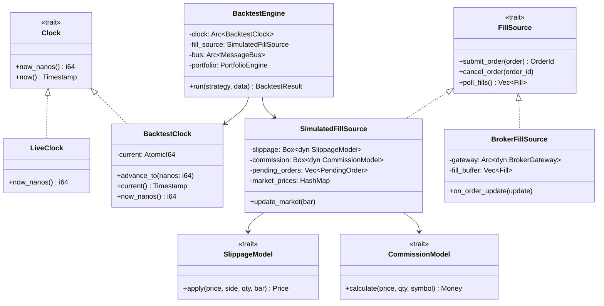
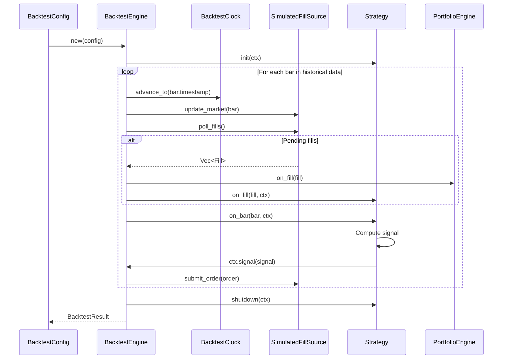
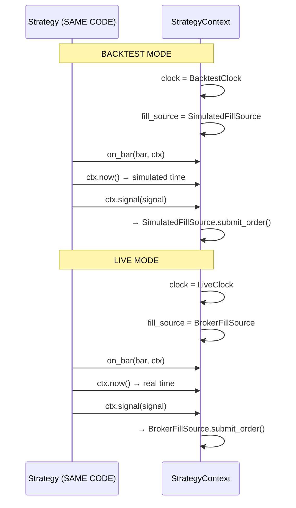
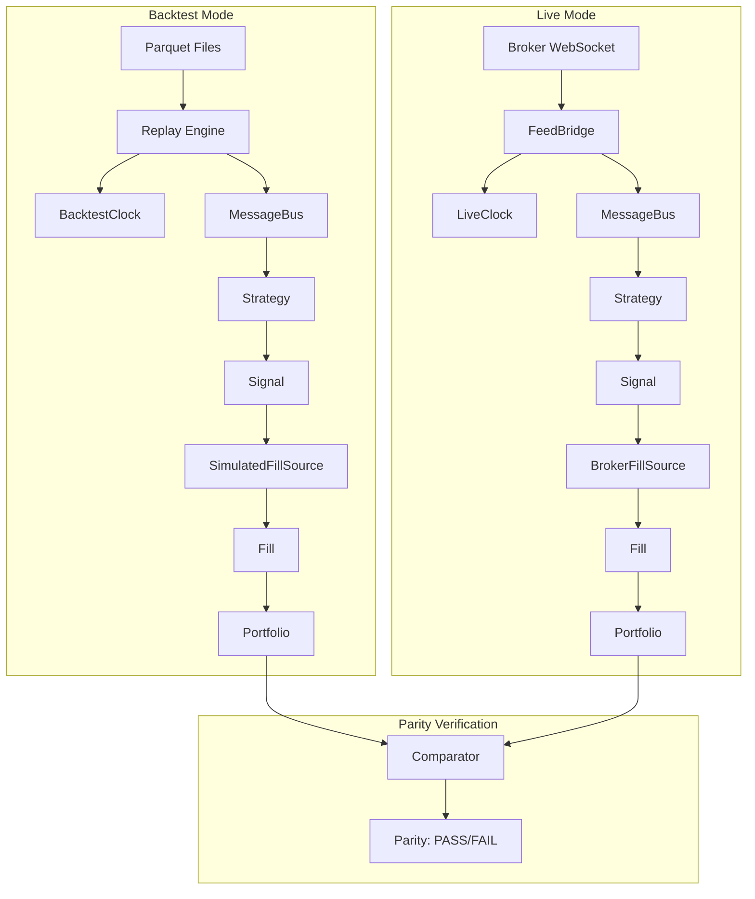

# 12 — Zero-Parity Engine

**Version:** 1.0  
**Status:** Draft  
**Last Updated:** 2026-07-22  
**Related:** [06-Execution Engine](./06-execution-engine.md), [11-Data Infrastructure](./11-data-infrastructure.md), [07-Strategy System](./07-strategy-system.md)

---

## 1. Overview

### Purpose

The Zero-Parity Engine guarantees that **the same strategy code produces identical results** in backtest and live trading. This is not aspirational — it is **structurally enforced** through the Clock abstraction, FillSource trait, and deterministic replay.

### The Parity Guarantee

> "If a strategy receives the same sequence of market events and the same fills, it will produce the same signals — regardless of whether those events come from a live WebSocket or a Parquet replay."

### How Parity is Achieved

| Mechanism | Purpose |
|-----------|---------|
| **Clock trait** | Strategies never call `SystemTime::now()` — all time goes through injected Clock |
| **FillSource trait** | Order fills come from an abstraction — live broker or simulated |
| **MessageBus** | Same message routing in both modes |
| **ExecutionEngine** | Identical engine instance in backtest and live |
| **Event Log** | Record live events → replay in backtest for comparison |

### What Differs Between Modes

| Aspect | Backtest | Live |
|--------|----------|------|
| Clock | `BacktestClock` (advances on replay) | `LiveClock` (system time) |
| Data source | Parquet files / EventLog replay | Broker WebSocket |
| Fill source | `SimulatedFillSource` | `BrokerFillSource` |
| Latency | Zero (instant fills) | Network latency |
| Slippage | Configurable model | Real market slippage |

---

## 2. Requirements

### Functional

| ID | Requirement |
|----|-------------|
| FR-01 | Same strategy code runs in backtest and live without modification |
| FR-02 | BacktestClock advances only on data replay (deterministic) |
| FR-03 | SimulatedFillSource models slippage and commission |
| FR-04 | Event log records all live events for later replay |
| FR-05 | Parity tests compare backtest vs live results |
| FR-06 | BacktestEngine replays historical data through same pipeline |
| FR-07 | Support multiple fill simulation models |
| FR-08 | Support configurable commission models |

### Non-Functional

| ID | Requirement | Target |
|----|-------------|--------|
| NFR-01 | Backtest throughput | > 1M bars/sec |
| NFR-02 | Parity divergence | 0 (bit-exact for same inputs) |
| NFR-03 | Replay determinism | 100% reproducible |
| NFR-04 | Clock overhead | < 1ns per call |

---

## 3. Clock Abstraction

### Definition

```rust
/// Clock trait — the single source of time for all components.
///
/// Strategies and components NEVER call SystemTime::now() directly.
/// All time access goes through this trait, enabling deterministic replay.
pub trait Clock: Send + Sync {
    /// Current time as nanoseconds since Unix epoch
    fn now_nanos(&self) -> i64;

    /// Current time as Timestamp
    fn now(&self) -> Timestamp {
        Timestamp::from_nanos(self.now_nanos())
    }
}

/// Live clock — returns real system time.
///
/// Used in live trading and paper trading modes.
pub struct LiveClock;

impl Clock for LiveClock {
    fn now_nanos(&self) -> i64 {
        std::time::SystemTime::now()
            .duration_since(std::time::UNIX_EPOCH)
            .unwrap()
            .as_nanos() as i64
    }
}

/// Backtest clock — simulated time controlled by replay.
///
/// Time only advances when the BacktestEngine pushes a new event.
/// This guarantees deterministic execution: same data → same time sequence.
pub struct BacktestClock {
    /// Current simulated time (atomic for thread-safe reads)
    current: AtomicI64,
}

impl BacktestClock {
    pub fn new(start: Timestamp) -> Self {
        BacktestClock {
            current: AtomicI64::new(start.as_nanos()),
        }
    }

    /// Advance time to a new timestamp.
    ///
    /// Called by BacktestEngine before dispatching each event.
    /// Time can only move forward (monotonic).
    pub fn advance_to(&self, nanos: i64) {
        let current = self.current.load(Ordering::Relaxed);
        if nanos > current {
            self.current.store(nanos, Ordering::Relaxed);
        }
        // Silently ignore backward time (idempotent replay)
    }

    /// Get current simulated time
    pub fn current(&self) -> Timestamp {
        Timestamp::from_nanos(self.current.load(Ordering::Relaxed))
    }
}

impl Clock for BacktestClock {
    fn now_nanos(&self) -> i64 {
        self.current.load(Ordering::Relaxed)
    }
}
```

### Enforcement

```rust
/// Architecture guard: prevent direct SystemTime usage in strategies.
///
/// This is enforced via:
/// 1. Strategy trait methods receive StrategyContext (which has Clock)
/// 2. Clippy lint: deny `std::time::SystemTime` in strategy crates
/// 3. Architecture test: grep for SystemTime in vendeta-strategy

// In vendeta-arch tests:
#[test]
fn no_system_time_in_strategies() {
    let strategy_src = include_dir!("crates/vendeta-engine/src");
    for file in strategy_src.files() {
        let content = file.contents_utf8().unwrap();
        assert!(
            !content.contains("SystemTime::now()"),
            "Strategy code must not use SystemTime::now(). Use ctx.now() instead."
        );
    }
}
```

---

## 4. FillSource Abstraction

### Purpose

The FillSource trait abstracts **where fills come from**. In live trading, fills come from the broker. In backtesting, fills are simulated.

### Definition

```rust
/// Fill source — where order fills originate.
///
/// This is the key abstraction that enables zero-parity:
/// - Live: BrokerFillSource (real fills from exchange)
/// - Backtest: SimulatedFillSource (instant fills with slippage model)
/// - Paper: PaperFillSource (simulated fills at market price)
pub trait FillSource: Send + Sync {
    /// Submit an order and eventually receive fills.
    ///
    /// In live mode: sends to broker, fills arrive asynchronously.
    /// In backtest mode: fills are generated immediately.
    fn submit_order(&mut self, order: &Order) -> FillSourceResult<OrderId>;

    /// Cancel an order
    fn cancel_order(&mut self, order_id: &OrderId) -> FillSourceResult<()>;

    /// Poll for pending fills (called each tick in backtest)
    fn poll_fills(&mut self) -> Vec<Fill>;
}

/// Result type for fill source operations
pub type FillSourceResult<T> = Result<T, FillSourceError>;

/// Fill source errors
#[derive(Debug, thiserror::Error)]
pub enum FillSourceError {
    #[error("order rejected: {0}")]
    Rejected(String),
    #[error("connection lost")]
    ConnectionLost,
    #[error("insufficient margin")]
    InsufficientMargin,
    #[error("invalid order: {0}")]
    InvalidOrder(String),
}
```

### SimulatedFillSource (Backtest)

```rust
/// Simulated fill source for backtesting.
///
/// Generates fills based on configurable models:
/// - Slippage: price impact model
/// - Commission: per-trade cost model
/// - Fill logic: immediate fill at close, or limit fill on touch
pub struct SimulatedFillSource {
    /// Slippage model
    slippage: Box<dyn SlippageModel>,
    /// Commission model
    commission: Box<dyn CommissionModel>,
    /// Pending orders (for limit order simulation)
    pending_orders: Vec<PendingOrder>,
    /// Current market prices (updated each bar)
    market_prices: HashMap<Symbol, Bar>,
    /// Order ID counter
    next_order_id: u64,
}

/// A pending order waiting for fill conditions
struct PendingOrder {
    order: Order,
    order_id: OrderId,
}

impl SimulatedFillSource {
    pub fn new(
        slippage: Box<dyn SlippageModel>,
        commission: Box<dyn CommissionModel>,
    ) -> Self {
        SimulatedFillSource {
            slippage,
            commission,
            pending_orders: Vec::new(),
            market_prices: HashMap::new(),
            next_order_id: 1,
        }
    }

    /// Update market prices (called by BacktestEngine each bar)
    pub fn update_market(&mut self, bar: &Bar) {
        self.market_prices.insert(bar.symbol.clone(), bar.clone());
    }
}

impl FillSource for SimulatedFillSource {
    fn submit_order(&mut self, order: &Order) -> FillSourceResult<OrderId> {
        let order_id = OrderId::new(format!("SIM-{:06}", self.next_order_id));
        self.next_order_id += 1;

        match order.order_type {
            OrderType::Market => {
                // Market orders fill immediately at current close + slippage
                // Fill will be returned on next poll_fills()
                self.pending_orders.push(PendingOrder {
                    order: order.clone(),
                    order_id: order_id.clone(),
                });
            }
            OrderType::Limit => {
                // Limit orders wait for price to touch
                self.pending_orders.push(PendingOrder {
                    order: order.clone(),
                    order_id: order_id.clone(),
                });
            }
        }

        Ok(order_id)
    }

    fn cancel_order(&mut self, order_id: &OrderId) -> FillSourceResult<()> {
        self.pending_orders.retain(|p| &p.order_id != order_id);
        Ok(())
    }

    fn poll_fills(&mut self) -> Vec<Fill> {
        let mut fills = Vec::new();
        let mut remaining = Vec::new();

        for pending in self.pending_orders.drain(..) {
            let bar = match self.market_prices.get(&pending.order.symbol) {
                Some(b) => b,
                None => {
                    remaining.push(pending);
                    continue;
                }
            };

            let should_fill = match pending.order.order_type {
                OrderType::Market => true, // Always fill market orders
                OrderType::Limit => {
                    let limit_price = pending.order.price.unwrap();
                    match pending.order.side {
                        Side::Buy => bar.low <= limit_price,
                        Side::Sell => bar.high >= limit_price,
                    }
                }
            };

            if should_fill {
                // Calculate fill price with slippage
                let base_price = match pending.order.order_type {
                    OrderType::Market => bar.close,
                    OrderType::Limit => pending.order.price.unwrap(),
                };

                let fill_price = self.slippage.apply(
                    base_price,
                    pending.order.side,
                    pending.order.quantity,
                    bar,
                );

                let commission = self.commission.calculate(
                    fill_price,
                    pending.order.quantity,
                    &pending.order.symbol,
                );

                fills.push(Fill {
                    id: FillId::new(format!("FILL-{}", fills.len())),
                    order_id: pending.order_id,
                    symbol: pending.order.symbol.clone(),
                    side: pending.order.side,
                    quantity: pending.order.quantity,
                    price: fill_price,
                    commission,
                    timestamp: bar.timestamp,
                });
            } else {
                remaining.push(pending);
            }
        }

        self.pending_orders = remaining;
        fills
    }
}
```

### BrokerFillSource (Live)

```rust
/// Broker fill source for live trading.
///
/// Delegates to BrokerGateway for order submission.
/// Fills arrive asynchronously via WebSocket order updates.
pub struct BrokerFillSource {
    gateway: Arc<dyn BrokerGateway>,
    /// Fills received from broker (buffered)
    fill_buffer: Vec<Fill>,
}

impl BrokerFillSource {
    pub fn new(gateway: Arc<dyn BrokerGateway>) -> Self {
        BrokerFillSource {
            gateway,
            fill_buffer: Vec::new(),
        }
    }

    /// Called by FeedBridge when order update arrives via WebSocket
    pub fn on_order_update(&mut self, update: OrderUpdate) {
        if update.status == OrderStatus::Filled {
            self.fill_buffer.push(Fill {
                id: update.fill_id,
                order_id: update.order_id,
                symbol: update.symbol,
                side: update.side,
                quantity: update.filled_quantity,
                price: update.fill_price,
                commission: update.commission,
                timestamp: update.timestamp,
            });
        }
    }
}

impl FillSource for BrokerFillSource {
    fn submit_order(&mut self, order: &Order) -> FillSourceResult<OrderId> {
        let request = OrderRequest::from_order(order);
        // Use tokio runtime to call async gateway
        let order_id = tokio::task::block_in_place(|| {
            tokio::runtime::Handle::current().block_on(
                self.gateway.place_order(&request)
            )
        }).map_err(|e| FillSourceError::Rejected(e.to_string()))?;
        Ok(order_id)
    }

    fn cancel_order(&mut self, order_id: &OrderId) -> FillSourceResult<()> {
        tokio::task::block_in_place(|| {
            tokio::runtime::Handle::current().block_on(
                self.gateway.cancel_order(order_id)
            )
        }).map_err(|e| FillSourceError::Rejected(e.to_string()))
    }

    fn poll_fills(&mut self) -> Vec<Fill> {
        std::mem::take(&mut self.fill_buffer)
    }
}
```

---

## 5. Slippage & Commission Models

### Slippage Models

```rust
/// Slippage model — simulates price impact.
pub trait SlippageModel: Send + Sync {
    /// Calculate fill price after slippage.
    fn apply(&self, price: Price, side: Side, quantity: Quantity, bar: &Bar) -> Price;
}

/// No slippage (fill at exact price)
pub struct NoSlippage;

impl SlippageModel for NoSlippage {
    fn apply(&self, price: Price, _side: Side, _qty: Quantity, _bar: &Bar) -> Price {
        price
    }
}

/// Fixed slippage (N ticks)
pub struct FixedSlippage {
    /// Number of ticks of slippage
    pub ticks: i64,
}

impl SlippageModel for FixedSlippage {
    fn apply(&self, price: Price, side: Side, _qty: Quantity, _bar: &Bar) -> Price {
        match side {
            Side::Buy => Price(price.0 + self.ticks),   // Buy higher
            Side::Sell => Price(price.0 - self.ticks),  // Sell lower
        }
    }
}

/// Percentage slippage
pub struct PercentSlippage {
    /// Slippage as basis points (e.g., 5 = 0.05%)
    pub basis_points: i64,
}

impl SlippageModel for PercentSlippage {
    fn apply(&self, price: Price, side: Side, _qty: Quantity, _bar: &Bar) -> Price {
        let slip = price.0 * self.basis_points / 10_000;
        match side {
            Side::Buy => Price(price.0 + slip),
            Side::Sell => Price(price.0 - slip),
        }
    }
}

/// Volume-weighted slippage (larger orders = more impact)
pub struct VolumeSlippage {
    /// Impact factor
    pub impact_factor: f64,
}

impl SlippageModel for VolumeSlippage {
    fn apply(&self, price: Price, side: Side, qty: Quantity, bar: &Bar) -> Price {
        // Impact = factor * (order_qty / bar_volume)
        let participation = qty.0 as f64 / bar.volume.max(1) as f64;
        let impact = (self.impact_factor * participation * price.0 as f64) as i64;
        match side {
            Side::Buy => Price(price.0 + impact),
            Side::Sell => Price(price.0 - impact),
        }
    }
}
```

### Commission Models

```rust
/// Commission model — calculates per-trade costs.
pub trait CommissionModel: Send + Sync {
    /// Calculate commission for a fill.
    fn calculate(&self, price: Price, quantity: Quantity, symbol: &Symbol) -> Money;
}

/// Zero commission (paper trading)
pub struct ZeroCommission;

impl CommissionModel for ZeroCommission {
    fn calculate(&self, _price: Price, _qty: Quantity, _symbol: &Symbol) -> Money {
        Money(0)
    }
}

/// Flat commission per order
pub struct FlatCommission {
    /// Commission per order (in paise)
    pub per_order: i64,
}

impl CommissionModel for FlatCommission {
    fn calculate(&self, _price: Price, _qty: Quantity, _symbol: &Symbol) -> Money {
        Money(self.per_order)
    }
}

/// Indian brokerage model (percentage + statutory charges)
pub struct IndianBrokerage {
    /// Brokerage rate (e.g., 0.0003 = 0.03%)
    pub brokerage_rate: f64,
    /// Maximum brokerage per order
    pub max_brokerage: i64,
    /// STT rate (Securities Transaction Tax)
    pub stt_rate: f64,
    /// Exchange transaction charges
    pub exchange_charges_rate: f64,
    /// GST rate (18%)
    pub gst_rate: f64,
    /// SEBI charges (per crore)
    pub sebi_per_crore: f64,
    /// Stamp duty rate
    pub stamp_duty_rate: f64,
}

impl Default for IndianBrokerage {
    fn default() -> Self {
        IndianBrokerage {
            brokerage_rate: 0.0003,     // 0.03% (₹20 or 0.03%, whichever lower)
            max_brokerage: 2000,        // ₹20 in paise
            stt_rate: 0.001,            // 0.1% on sell (delivery)
            exchange_charges_rate: 0.0000345, // NSE
            gst_rate: 0.18,
            sebi_per_crore: 10.0,       // ₹10/crore
            stamp_duty_rate: 0.00015,   // 0.015% on buy
        }
    }
}

impl CommissionModel for IndianBrokerage {
    fn calculate(&self, price: Price, qty: Quantity, _symbol: &Symbol) -> Money {
        let turnover = (price.0 * qty.0 as i64) as f64 / 10_000.0; // Convert to rupees

        // Brokerage (capped)
        let brokerage = (turnover * self.brokerage_rate).min(self.max_brokerage as f64 / 100.0);

        // STT (on sell side only for delivery)
        let stt = turnover * self.stt_rate;

        // Exchange charges
        let exchange = turnover * self.exchange_charges_rate;

        // GST on (brokerage + exchange charges)
        let gst = (brokerage + exchange) * self.gst_rate;

        // SEBI charges
        let sebi = turnover / 10_000_000.0 * self.sebi_per_crore;

        // Stamp duty (on buy)
        let stamp = turnover * self.stamp_duty_rate;

        let total = brokerage + stt + exchange + gst + sebi + stamp;
        Money((total * 100.0) as i64) // Convert back to paise
    }
}
```

---

## 6. BacktestEngine

### Definition

```rust
/// Backtest engine — runs strategies against historical data.
///
/// Uses the SAME ExecutionEngine, MessageBus, and Strategy trait
/// as live trading. Only the Clock and FillSource differ.
pub struct BacktestEngine {
    /// Simulated clock
    clock: Arc<BacktestClock>,
    /// Simulated fill source
    fill_source: SimulatedFillSource,
    /// Message bus (same as live)
    bus: Arc<MessageBus>,
    /// Execution engine (same as live)
    execution: ExecutionEngine,
    /// Portfolio engine (same as live)
    portfolio: PortfolioEngine,
    /// Historical data
    data: Vec<Bar>,
    /// Results
    results: BacktestResult,
}

/// Backtest configuration
#[derive(Clone, Debug)]
pub struct BacktestConfig {
    /// Symbols to trade
    pub symbols: Vec<Symbol>,
    /// Timeframe for bars
    pub timeframe: Timeframe,
    /// Start date
    pub start: Timestamp,
    /// End date
    pub end: Timestamp,
    /// Initial capital
    pub initial_capital: Money,
    /// Slippage model
    pub slippage: SlippageConfig,
    /// Commission model
    pub commission: CommissionConfig,
    /// Risk configuration
    pub risk: RiskConfig,
}

/// Slippage configuration
#[derive(Clone, Debug)]
pub enum SlippageConfig {
    None,
    Fixed { ticks: i64 },
    Percent { basis_points: i64 },
    Volume { impact_factor: f64 },
}

/// Commission configuration
#[derive(Clone, Debug)]
pub enum CommissionConfig {
    Zero,
    Flat { per_order: i64 },
    Indian { brokerage_rate: f64 },
}

/// Backtest results
#[derive(Clone, Debug)]
pub struct BacktestResult {
    /// Equity curve (timestamp, equity)
    pub equity_curve: Vec<(Timestamp, Money)>,
    /// All completed trades
    pub trades: Vec<Fill>,
    /// Final positions
    pub positions: Vec<Position>,
    /// Performance metrics
    pub metrics: BacktestMetrics,
    /// Total bars processed
    pub bars_processed: u64,
    /// Duration of backtest run
    pub elapsed: std::time::Duration,
}

/// Performance metrics
#[derive(Clone, Debug)]
pub struct BacktestMetrics {
    /// Total return (percentage)
    pub total_return_pct: f64,
    /// Annualized return
    pub annualized_return_pct: f64,
    /// Sharpe ratio
    pub sharpe_ratio: f64,
    /// Maximum drawdown (percentage)
    pub max_drawdown_pct: f64,
    /// Win rate
    pub win_rate: f64,
    /// Profit factor
    pub profit_factor: f64,
    /// Total trades
    pub total_trades: u64,
    /// Average trade P&L
    pub avg_trade_pnl: Money,
}

impl BacktestEngine {
    pub fn new(config: &BacktestConfig) -> Self {
        let clock = Arc::new(BacktestClock::new(config.start));

        let slippage: Box<dyn SlippageModel> = match &config.slippage {
            SlippageConfig::None => Box::new(NoSlippage),
            SlippageConfig::Fixed { ticks } => Box::new(FixedSlippage { ticks: *ticks }),
            SlippageConfig::Percent { basis_points } => Box::new(PercentSlippage { basis_points: *basis_points }),
            SlippageConfig::Volume { impact_factor } => Box::new(VolumeSlippage { impact_factor: *impact_factor }),
        };

        let commission: Box<dyn CommissionModel> = match &config.commission {
            CommissionConfig::Zero => Box::new(ZeroCommission),
            CommissionConfig::Flat { per_order } => Box::new(FlatCommission { per_order: *per_order }),
            CommissionConfig::Indian { brokerage_rate } => Box::new(IndianBrokerage {
                brokerage_rate: *brokerage_rate,
                ..Default::default()
            }),
        };

        let fill_source = SimulatedFillSource::new(slippage, commission);
        let bus = Arc::new(MessageBus::new(1024));
        let portfolio = PortfolioEngine::new(config.initial_capital, clock.clone());

        BacktestEngine {
            clock,
            fill_source,
            bus,
            execution: ExecutionEngine::new(/* ... */),
            portfolio,
            data: Vec::new(),
            results: BacktestResult::empty(),
        }
    }

    /// Run the backtest with a strategy.
    pub fn run(&mut self, strategy: &mut dyn Strategy, data: Vec<Bar>) -> BacktestResult {
        let start_time = std::time::Instant::now();

        // Initialize strategy
        let mut ctx = StrategyContext::new(
            self.clock.clone(),
            Arc::new(Mutex::new(self.portfolio.clone())),
            self.bus.clone(),
        );
        strategy.init(&mut ctx);

        // Replay bars
        for bar in &data {
            // 1. Advance clock
            self.clock.advance_to(bar.timestamp.as_nanos());

            // 2. Update fill source market prices
            self.fill_source.update_market(bar);

            // 3. Process pending fills
            let fills = self.fill_source.poll_fills();
            for fill in &fills {
                self.portfolio.on_fill(fill);
                strategy.on_fill(fill, &mut ctx);
            }

            // 4. Dispatch bar to strategy
            strategy.on_bar(bar, &mut ctx);

            // 5. Record equity
            self.results.equity_curve.push((bar.timestamp, self.portfolio.equity()));
        }

        // Shutdown strategy
        strategy.shutdown(&mut ctx);

        // Calculate metrics
        self.results.bars_processed = data.len() as u64;
        self.results.elapsed = start_time.elapsed();
        self.results.metrics = self.calculate_metrics();

        self.results.clone()
    }

    fn calculate_metrics(&self) -> BacktestMetrics {
        // Calculate from equity curve and trades
        BacktestMetrics {
            total_return_pct: 0.0,
            annualized_return_pct: 0.0,
            sharpe_ratio: 0.0,
            max_drawdown_pct: 0.0,
            win_rate: 0.0,
            profit_factor: 0.0,
            total_trades: self.results.trades.len() as u64,
            avg_trade_pnl: Money(0),
        }
    }
}
```

---

## 7. Parity Testing

### Purpose

Parity tests verify that backtest and live produce identical results for the same input sequence.

### Test Structure

```rust
/// Parity test — verifies zero-parity guarantee.
///
/// Records live events, replays them in backtest,
/// and asserts identical strategy outputs.
#[cfg(test)]
mod parity_tests {
    use super::*;

    /// Golden dataset: a recorded sequence of market events
    struct GoldenDataset {
        events: Vec<MarketEvent>,
        expected_signals: Vec<Signal>,
        expected_fills: Vec<Fill>,
    }

    #[test]
    fn test_parity_sma_crossover() {
        // 1. Load golden dataset (recorded from live session)
        let golden = load_golden_dataset("sma_crossover_1h_2024-01-15");

        // 2. Run strategy in backtest mode
        let mut strategy = SmaCrossover::new(/* ... */);
        let config = BacktestConfig {
            symbols: vec![Symbol::new("RELIANCE")],
            timeframe: Timeframe::Hour,
            start: golden.events[0].timestamp(),
            end: golden.events.last().unwrap().timestamp(),
            initial_capital: Money::from_f64(1_000_000.0),
            slippage: SlippageConfig::None,
            commission: CommissionConfig::Zero,
            risk: RiskConfig::default(),
        };

        let mut engine = BacktestEngine::new(&config);
        let bars = golden.events.iter()
            .filter_map(|e| match e {
                MarketEvent::Bar(b) => Some(b.clone()),
                _ => None,
            })
            .collect();
        let result = engine.run(&mut strategy, bars);

        // 3. Assert parity: same signals as live
        assert_eq!(result.trades.len(), golden.expected_fills.len());
        for (actual, expected) in result.trades.iter().zip(&golden.expected_fills) {
            assert_eq!(actual.symbol, expected.symbol);
            assert_eq!(actual.side, expected.side);
            assert_eq!(actual.quantity, expected.quantity);
            assert_eq!(actual.price, expected.price);
        }
    }

    #[test]
    fn test_deterministic_replay() {
        // Run same backtest twice — must produce identical results
        let data = load_test_bars("RELIANCE", Timeframe::Minute, 1000);
        let config = BacktestConfig::default();

        let mut engine1 = BacktestEngine::new(&config);
        let result1 = engine1.run(&mut SmaCrossover::default(), data.clone());

        let mut engine2 = BacktestEngine::new(&config);
        let result2 = engine2.run(&mut SmaCrossover::default(), data);

        // Bit-exact comparison
        assert_eq!(result1.equity_curve.len(), result2.equity_curve.len());
        for (e1, e2) in result1.equity_curve.iter().zip(&result2.equity_curve) {
            assert_eq!(e1.0, e2.0); // Timestamps match
            assert_eq!(e1.1, e2.1); // Equity values match (exact i64)
        }
    }
}
```

### Golden Dataset Format

```rust
/// Golden dataset — recorded live session for parity verification.
///
/// Stored as JSON in tests/golden/ directory.
/// Generated by running live paper trading and recording all events.
#[derive(Serialize, Deserialize)]
struct GoldenDatasetFile {
    /// Metadata
    metadata: GoldenMetadata,
    /// Market events (bars, quotes)
    events: Vec<MarketEventRecord>,
    /// Expected strategy signals
    expected_signals: Vec<SignalRecord>,
    /// Expected fills
    expected_fills: Vec<FillRecord>,
}

#[derive(Serialize, Deserialize)]
struct GoldenMetadata {
    strategy: String,
    symbol: String,
    timeframe: String,
    start: String,
    end: String,
    recorded_at: String,
    version: String,
}
```

---

## 8. Class Diagram



---

## 9. Sequence Diagrams

### Backtest Execution Flow



### Live vs Backtest Comparison



---

## 10. Data Flow



---

## 11. Configuration

```yaml
# config/backtest.yaml
backtest:
  # Data source
  data:
    path: "./data/parquet"
    symbols:
      - "RELIANCE"
      - "TCS"
    timeframe: "5m"
    start: "2024-01-01"
    end: "2024-06-30"

  # Initial capital
  initial_capital: 1000000  # ₹10,00,000

  # Fill simulation
  slippage:
    model: "fixed"  # none | fixed | percent | volume
    ticks: 1        # 1 tick slippage

  commission:
    model: "indian"  # zero | flat | indian
    brokerage_rate: 0.0003

  # Risk (same as live)
  risk:
    max_order_quantity: 10000
    max_daily_loss: 50000

  # Parity testing
  parity:
    golden_datasets: "./tests/golden/"
    tolerance: 0  # Must be bit-exact
```

---

## 12. Error Handling

```rust
/// Backtest errors
#[derive(Debug, thiserror::Error)]
pub enum BacktestError {
    /// No data available for requested range
    #[error("no data for {symbol} from {start} to {end}")]
    NoData { symbol: String, start: String, end: String },

    /// Data gap in historical data
    #[error("data gap at bar {index}: expected {expected}, got {actual}")]
    DataGap { index: usize, expected: String, actual: String },

    /// Parity violation detected
    #[error("parity violation: backtest={backtest}, live={live} at event {event}")]
    ParityViolation { backtest: String, live: String, event: u64 },

    /// Invalid configuration
    #[error("invalid backtest config: {0}")]
    InvalidConfig(String),

    /// Strategy panicked during execution
    #[error("strategy panic at bar {bar}: {message}")]
    StrategyPanic { bar: u64, message: String },
}
```

---

## 13. Testing Requirements

### Unit Tests

| Test | Description |
|------|-------------|
| `test_backtest_clock_monotonic` | Clock only advances forward |
| `test_simulated_fill_market_order` | Market orders fill at close + slippage |
| `test_simulated_fill_limit_order` | Limit orders fill only on price touch |
| `test_commission_indian_model` | Verify Indian brokerage calculation |
| `test_slippage_volume_impact` | Larger orders get more slippage |

### Integration Tests

| Test | Description |
|------|-------------|
| `test_full_backtest_sma` | Run SMA strategy on 1000 bars, verify results |
| `test_deterministic_replay` | Same input → identical output (run twice) |
| `test_parity_golden_dataset` | Compare against recorded live session |
| `test_event_log_replay` | Record → replay → compare |

### Property-Based Tests

```rust
proptest! {
    #[test]
    fn backtest_determinism(bars in arb_bars(100..1000)) {
        let config = BacktestConfig::default();
        let mut e1 = BacktestEngine::new(&config);
        let mut e2 = BacktestEngine::new(&config);

        let r1 = e1.run(&mut TestStrategy::default(), bars.clone());
        let r2 = e2.run(&mut TestStrategy::default(), bars);

        prop_assert_eq!(r1.equity_curve.len(), r2.equity_curve.len());
        for (a, b) in r1.equity_curve.iter().zip(&r2.equity_curve) {
            prop_assert_eq!(a.1, b.1);
        }
    }
}
```

---

## 14. Implementation Notes

### Patterns

1. **Dependency injection**: Clock and FillSource are injected via `Arc<dyn Trait>` — strategy code is agnostic.
2. **No branching on mode**: Strategy code has zero `if backtest { ... } else { ... }` — the abstraction handles it.
3. **Event sourcing**: All events are logged. Replay reconstructs exact state.
4. **Golden datasets**: Recorded live sessions stored as test fixtures for continuous parity verification.

### Gotchas

- **Time zones**: BacktestClock must respect market hours. Don't advance clock on weekends/holidays.
- **Corporate actions**: Splits/dividends affect historical prices. Adjust before replay.
- **Fill timing**: In backtest, fills happen at bar close. In live, fills can happen mid-bar. This is an accepted divergence.
- **Order of operations**: Always advance clock BEFORE dispatching event. Strategy sees consistent time.
- **AtomicI64 ordering**: Use `Relaxed` for BacktestClock (single-threaded replay). Use `SeqCst` if multi-threaded.

### Performance

- BacktestClock: single atomic load (~1ns)
- SimulatedFillSource: O(pending_orders) per poll — keep pending list small
- Backtest throughput target: > 1M bars/sec (no async, no allocation in hot loop)
- Pre-allocate equity_curve vector to avoid reallocation

---

## 15. Cross-References

| Document | Relevance |
|----------|-----------|
| [06-Execution Engine](./06-execution-engine.md) | Same engine in both modes |
| [07-Strategy System](./07-strategy-system.md) | Strategy trait is mode-agnostic |
| [11-Data Infrastructure](./11-data-infrastructure.md) | Event log enables replay |
| [17-Testing](./17-testing.md) | Parity tests are a testing category |
| [09-Risk Management](./09-risk-management.md) | Same risk checks in both modes |
| [16-Performance](./16-performance.md) | Backtest throughput requirements |
