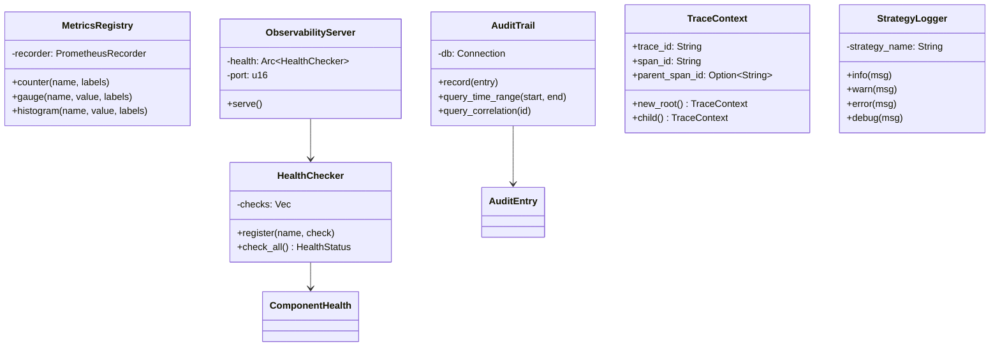
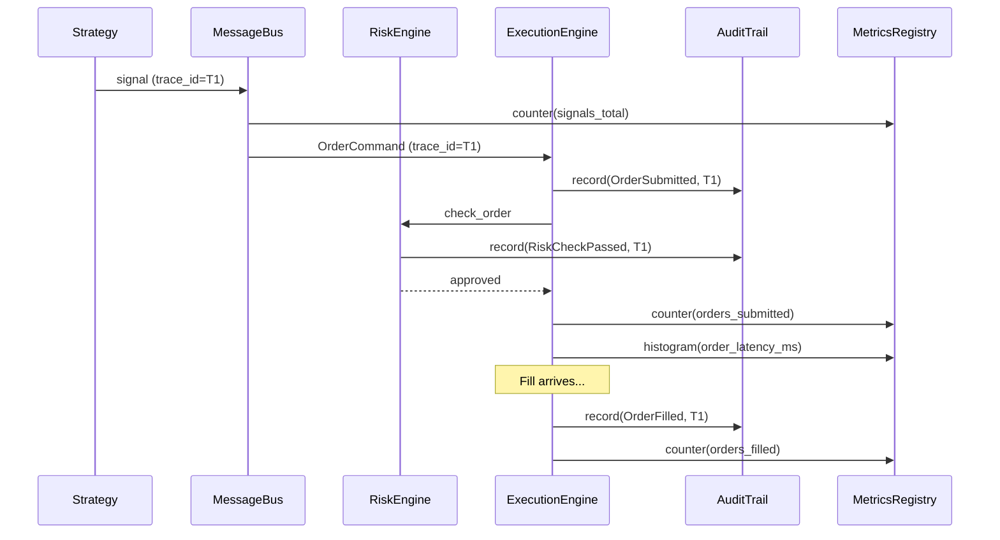
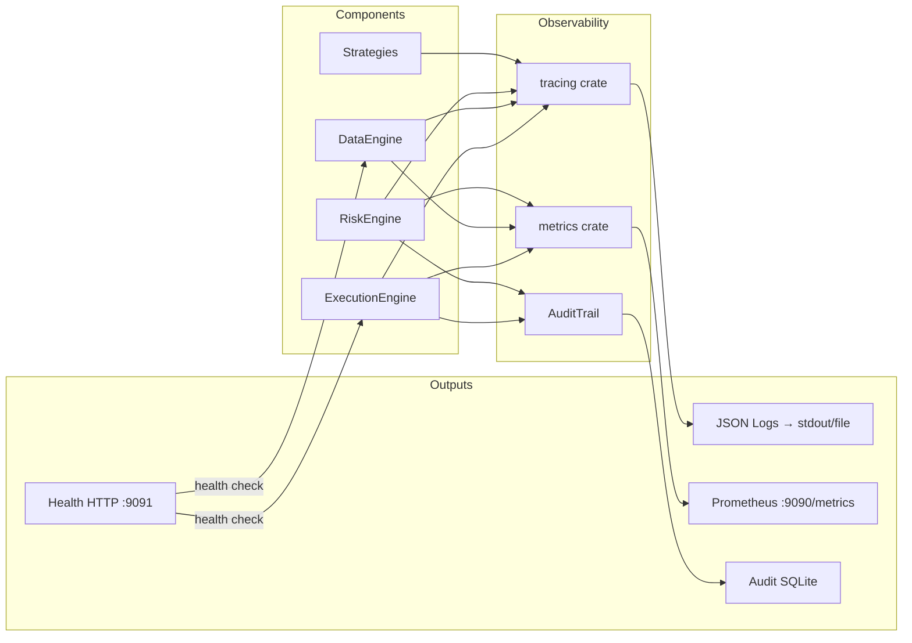

# 13 — Observability

**Version:** 1.0  
**Status:** Draft  
**Last Updated:** 2026-07-22  
**Related:** [05-Component Lifecycle](./05-component-lifecycle.md), [04-Message Bus](./04-message-driven-architecture.md), [16-Performance](./16-performance.md)

---

## 1. Overview

### Purpose

Observability is **built-in, not bolted-on**. Every component emits structured logs, metrics, and traces as part of its normal operation. There is no "enable observability" flag — it is always on.

### Three Pillars

| Pillar | Tool | Purpose |
|--------|------|---------|
| **Logs** | `tracing` crate | Structured, leveled, contextual events |
| **Metrics** | `prometheus` / `metrics` | Counters, gauges, histograms |
| **Traces** | `tracing` spans | Request flow through the system |

### Key Principle

> "If you can't observe it, you can't operate it. Every message is traced, every order is logged, every fill is metriced."

---

## 2. Requirements

### Functional

| ID | Requirement |
|----|-------------|
| FR-01 | Structured JSON logging with component context |
| FR-02 | Prometheus-compatible metrics endpoint |
| FR-03 | Distributed tracing across message bus |
| FR-04 | Audit trail for all order lifecycle events |
| FR-05 | Health check endpoint (liveness + readiness) |
| FR-06 | Configurable log levels per component |
| FR-07 | Metric recording for latency, throughput, errors |
| FR-08 | Correlation IDs across message chains |

### Non-Functional

| ID | Requirement | Target |
|----|-------------|--------|
| NFR-01 | Logging overhead | < 1% CPU |
| NFR-02 | Metrics overhead | < 0.5% CPU |
| NFR-03 | Trace sampling | Configurable (default 100% in dev, 10% in prod) |
| NFR-04 | Metrics scrape interval | 15s (Prometheus default) |

---

## 3. Structured Logging

### Architecture

```rust
/// Logging is built on the `tracing` crate.
///
/// Each component gets a named span. All log events within that span
/// automatically include the component name and ID.

use tracing::{info, warn, error, debug, instrument};

/// Initialize the logging subsystem.
///
/// Called once at startup by TradingNode.
pub fn init_logging(config: &LogConfig) {
    use tracing_subscriber::{fmt, EnvFilter, layer::SubscriberExt, util::SubscriberInitExt};

    let filter = EnvFilter::try_from_default_env()
        .unwrap_or_else(|_| EnvFilter::new(&config.default_level));

    let fmt_layer = fmt::layer()
        .json()                          // JSON output for production
        .with_target(true)              // Include module path
        .with_thread_ids(false)         // Single-threaded hot path
        .with_timer(fmt::time::UtcTime::rfc_3339());

    tracing_subscriber::registry()
        .with(filter)
        .with(fmt_layer)
        .init();
}

/// Log configuration
#[derive(Clone, Debug)]
pub struct LogConfig {
    /// Default log level (e.g., "info", "debug")
    pub default_level: String,
    /// Per-component overrides
    pub component_levels: HashMap<String, String>,
    /// Output format
    pub format: LogFormat,
    /// Output destination
    pub output: LogOutput,
}

/// Log output format
#[derive(Clone, Copy, Debug)]
pub enum LogFormat {
    /// JSON (production)
    Json,
    /// Pretty (development)
    Pretty,
    /// Compact (minimal)
    Compact,
}

/// Log output destination
#[derive(Clone, Debug)]
pub enum LogOutput {
    /// Stdout
    Stdout,
    /// File
    File(PathBuf),
    /// Both
    Both(PathBuf),
}
```

### Component Logging Pattern

```rust
/// Every component logs within a named span.
///
/// Example from ExecutionEngine:
impl ExecutionEngine {
    #[instrument(skip(self, ctx), fields(component = "execution_engine"))]
    pub fn on_order_command(&mut self, cmd: &OrderCommand, ctx: &mut ComponentContext) {
        info!(
            order_id = %cmd.order_id,
            symbol = %cmd.symbol,
            side = ?cmd.side,
            quantity = cmd.quantity.0,
            "Order command received"
        );

        match self.process_order(cmd, ctx) {
            Ok(order_id) => {
                info!(order_id = %order_id, "Order submitted successfully");
            }
            Err(e) => {
                error!(
                    order_id = %cmd.order_id,
                    error = %e,
                    "Order submission failed"
                );
            }
        }
    }
}

/// Strategy logging via StrategyContext:
impl StrategyContext {
    /// Get a logger scoped to this strategy
    pub fn log(&self) -> StrategyLogger {
        StrategyLogger {
            strategy_name: self.strategy_name.clone(),
        }
    }
}

/// Strategy-scoped logger
pub struct StrategyLogger {
    strategy_name: String,
}

impl StrategyLogger {
    pub fn info(&self, msg: &str) {
        tracing::info!(strategy = %self.strategy_name, "{}", msg);
    }

    pub fn warn(&self, msg: &str) {
        tracing::warn!(strategy = %self.strategy_name, "{}", msg);
    }

    pub fn error(&self, msg: &str) {
        tracing::error!(strategy = %self.strategy_name, "{}", msg);
    }

    pub fn debug(&self, msg: &str) {
        tracing::debug!(strategy = %self.strategy_name, "{}", msg);
    }
}
```

---

## 4. Metrics

### Metric Registry

```rust
/// Framework metrics — collected and exposed via Prometheus endpoint.
///
/// Uses the `metrics` crate with `metrics-exporter-prometheus` backend.
pub struct MetricsRegistry {
    /// Prometheus recorder
    recorder: PrometheusRecorder,
}

impl MetricsRegistry {
    pub fn new() -> Self {
        let (recorder, exporter) = PrometheusBuilder::new()
            .with_http_listener(([0, 0, 0, 0], 9090))
            .build()
            .expect("failed to build prometheus recorder");

        MetricsRegistry { recorder }
    }
}
```

### Built-in Metrics

```rust
/// All framework metrics follow naming convention:
///   vendeta_{subsystem}_{metric_name}_{unit}

// === Message Bus Metrics ===
// vendeta_bus_messages_published_total (counter)
// vendeta_bus_messages_dropped_total (counter)
// vendeta_bus_queue_depth (gauge)
// vendeta_bus_publish_latency_ns (histogram)

// === Execution Engine Metrics ===
// vendeta_orders_submitted_total (counter, labels: strategy, symbol)
// vendeta_orders_filled_total (counter, labels: strategy, symbol)
// vendeta_orders_rejected_total (counter, labels: reason)
// vendeta_orders_cancelled_total (counter)
// vendeta_order_latency_ms (histogram)
// vendeta_fill_latency_ms (histogram)

// === Portfolio Metrics ===
// vendeta_portfolio_equity (gauge)
// vendeta_portfolio_cash (gauge)
// vendeta_portfolio_positions_count (gauge)
// vendeta_portfolio_unrealized_pnl (gauge)
// vendeta_portfolio_realized_pnl (gauge)

// === Risk Engine Metrics ===
// vendeta_risk_checks_total (counter)
// vendeta_risk_rejections_total (counter, labels: code)
// vendeta_risk_circuit_breaker_tripped (counter)

// === Data Engine Metrics ===
// vendeta_data_quotes_received_total (counter, labels: symbol)
// vendeta_data_bars_emitted_total (counter, labels: symbol, timeframe)
// vendeta_data_gaps_detected_total (counter)

// === Adapter Metrics ===
// vendeta_adapter_connection_status (gauge, labels: broker)
// vendeta_adapter_reconnect_total (counter, labels: broker)
// vendeta_adapter_api_latency_ms (histogram, labels: broker, endpoint)
// vendeta_adapter_rate_limit_hits_total (counter, labels: broker)

/// Helper macros for recording metrics
macro_rules! metric_counter {
    ($name:expr, $($label:expr),*) => {
        metrics::counter!($name, $($label),*).increment(1)
    };
}

macro_rules! metric_gauge {
    ($name:expr, $value:expr, $($label:expr),*) => {
        metrics::gauge!($name, $($label),*).set($value)
    };
}

macro_rules! metric_histogram {
    ($name:expr, $value:expr, $($label:expr),*) => {
        metrics::histogram!($name, $($label),*).record($value)
    };
}
```

### Usage in Components

```rust
/// Example: metrics in ExecutionEngine
impl ExecutionEngine {
    fn process_order(&mut self, cmd: &OrderCommand, ctx: &mut ComponentContext) -> Result<OrderId, EngineError> {
        let start = std::time::Instant::now();

        // Risk check
        let risk_result = self.risk_engine.check_order(&order);
        if !risk_result.approved {
            metric_counter!(
                "vendeta_orders_rejected_total",
                "reason" => risk_result.code.unwrap().as_str().to_string()
            );
            return Err(EngineError::RiskRejected(risk_result.reason));
        }

        // Submit to fill source
        let order_id = self.fill_source.submit_order(&order)?;

        let elapsed_ms = start.elapsed().as_millis() as f64;
        metric_counter!(
            "vendeta_orders_submitted_total",
            "strategy" => cmd.strategy_tag.clone(),
            "symbol" => cmd.symbol.as_str().to_string()
        );
        metric_histogram!(
            "vendeta_order_latency_ms",
            elapsed_ms,
            "symbol" => cmd.symbol.as_str().to_string()
        );

        Ok(order_id)
    }
}
```

---

## 5. Distributed Tracing

### Correlation IDs

```rust
/// Every message carries a correlation ID for tracing.
///
/// When a strategy emits a signal, the correlation ID flows through:
/// Signal → OrderCommand → OrderEvent::Submitted → Fill → PositionUpdate

/// Trace context attached to messages
#[derive(Clone, Debug)]
pub struct TraceContext {
    /// Unique trace ID (UUID)
    pub trace_id: String,
    /// Span ID within the trace
    pub span_id: String,
    /// Parent span ID (for nesting)
    pub parent_span_id: Option<String>,
}

impl TraceContext {
    /// Create a new root trace
    pub fn new_root() -> Self {
        TraceContext {
            trace_id: uuid::Uuid::new_v4().to_string(),
            span_id: uuid::Uuid::new_v4().to_string(),
            parent_span_id: None,
        }
    }

    /// Create a child span
    pub fn child(&self) -> Self {
        TraceContext {
            trace_id: self.trace_id.clone(),
            span_id: uuid::Uuid::new_v4().to_string(),
            parent_span_id: Some(self.span_id.clone()),
        }
    }
}

/// Tracing a message through the system:
impl MessageBus {
    pub fn publish_order_command(&self, cmd: OrderCommand) {
        let span = tracing::info_span!(
            "order_flow",
            trace_id = %cmd.trace.trace_id,
            order_id = %cmd.order_id,
            symbol = %cmd.symbol,
        );
        let _guard = span.enter();

        tracing::info!("Publishing order command");
        self.command_tx.send(cmd).ok();
    }
}
```

---

## 6. Audit Trail

### Purpose

The audit trail is an **immutable, append-only record** of all order lifecycle events. Required for regulatory compliance and debugging.

```rust
/// Audit trail — immutable record of all trading activity.
pub struct AuditTrail {
    /// SQLite connection (WAL mode for concurrent access)
    db: rusqlite::Connection,
}

/// An audit entry
#[derive(Clone, Debug, Serialize)]
pub struct AuditEntry {
    /// Monotonic sequence number
    pub sequence: u64,
    /// Timestamp
    pub timestamp: Timestamp,
    /// Event type
    pub event_type: AuditEventType,
    /// Component that generated the event
    pub component: String,
    /// Event details (JSON)
    pub details: serde_json::Value,
    /// Correlation ID
    pub correlation_id: String,
}

/// Audit event types
#[derive(Clone, Copy, Debug, Serialize)]
pub enum AuditEventType {
    OrderSubmitted,
    OrderAccepted,
    OrderRejected,
    OrderCancelled,
    OrderFilled,
    RiskCheckPassed,
    RiskCheckFailed,
    CircuitBreakerTripped,
    KillSwitchEngaged,
    PositionOpened,
    PositionClosed,
    ComponentStarted,
    ComponentStopped,
}

impl AuditTrail {
    pub fn new(path: &Path) -> Result<Self, AuditError> {
        let db = rusqlite::Connection::open(path)?;
        db.execute_batch(
            "PRAGMA journal_mode=WAL;
             CREATE TABLE IF NOT EXISTS audit (
                 sequence INTEGER PRIMARY KEY AUTOINCREMENT,
                 timestamp INTEGER NOT NULL,
                 event_type TEXT NOT NULL,
                 component TEXT NOT NULL,
                 details TEXT NOT NULL,
                 correlation_id TEXT NOT NULL
             );
             CREATE INDEX IF NOT EXISTS idx_audit_time ON audit(timestamp);
             CREATE INDEX IF NOT EXISTS idx_audit_type ON audit(event_type);
             CREATE INDEX IF NOT EXISTS idx_audit_corr ON audit(correlation_id);"
        )?;
        Ok(AuditTrail { db })
    }

    /// Record an audit entry
    pub fn record(&mut self, entry: &AuditEntry) -> Result<(), AuditError> {
        self.db.execute(
            "INSERT INTO audit (timestamp, event_type, component, details, correlation_id)
             VALUES (?1, ?2, ?3, ?4, ?5)",
            rusqlite::params![
                entry.timestamp.as_nanos(),
                format!("{:?}", entry.event_type),
                entry.component,
                serde_json::to_string(&entry.details)?,
                entry.correlation_id,
            ],
        )?;
        Ok(())
    }

    /// Query audit trail by time range
    pub fn query_time_range(
        &self,
        start: Timestamp,
        end: Timestamp,
    ) -> Result<Vec<AuditEntry>, AuditError> {
        let mut stmt = self.db.prepare(
            "SELECT sequence, timestamp, event_type, component, details, correlation_id
             FROM audit WHERE timestamp >= ?1 AND timestamp <= ?2 ORDER BY sequence"
        )?;
        // ... map rows to AuditEntry
        Ok(Vec::new())
    }

    /// Query by correlation ID (trace a single order's lifecycle)
    pub fn query_correlation(&self, correlation_id: &str) -> Result<Vec<AuditEntry>, AuditError> {
        let mut stmt = self.db.prepare(
            "SELECT sequence, timestamp, event_type, component, details, correlation_id
             FROM audit WHERE correlation_id = ?1 ORDER BY sequence"
        )?;
        // ... map rows
        Ok(Vec::new())
    }
}
```

---

## 7. Health Checks

### Definition

```rust
/// Health check system — reports component health for monitoring.
pub struct HealthChecker {
    /// Registered health checks
    checks: Vec<(String, Box<dyn Fn() -> HealthStatus + Send + Sync>)>,
}

/// Health status
#[derive(Clone, Debug, Serialize)]
pub struct HealthStatus {
    /// Overall status
    pub status: HealthLevel,
    /// Timestamp
    pub timestamp: Timestamp,
    /// Per-component status
    pub components: HashMap<String, ComponentHealth>,
}

/// Health levels
#[derive(Clone, Copy, Debug, PartialEq, Eq, Serialize)]
pub enum HealthLevel {
    /// All systems operational
    Healthy,
    /// Some degradation but functional
    Degraded,
    /// System not functional
    Unhealthy,
}

/// Per-component health
#[derive(Clone, Debug, Serialize)]
pub struct ComponentHealth {
    /// Component name
    pub name: String,
    /// Health level
    pub status: HealthLevel,
    /// Human-readable message
    pub message: String,
    /// Last successful operation
    pub last_healthy: Option<Timestamp>,
}

impl HealthChecker {
    pub fn new() -> Self {
        HealthChecker { checks: Vec::new() }
    }

    /// Register a health check
    pub fn register<F>(&mut self, name: &str, check: F)
    where
        F: Fn() -> HealthStatus + Send + Sync + 'static,
    {
        self.checks.push((name.to_string(), Box::new(check)));
    }

    /// Run all health checks
    pub fn check_all(&self) -> HealthStatus {
        let mut components = HashMap::new();
        let mut overall = HealthLevel::Healthy;

        for (name, check) in &self.checks {
            let status = check();
            if status.status == HealthLevel::Unhealthy {
                overall = HealthLevel::Unhealthy;
            } else if status.status == HealthLevel::Degraded && overall == HealthLevel::Healthy {
                overall = HealthLevel::Degraded;
            }
            components.insert(name.clone(), ComponentHealth {
                name: name.clone(),
                status: status.status,
                message: String::new(),
                last_healthy: None,
            });
        }

        HealthStatus {
            status: overall,
            timestamp: Timestamp::now(),
            components,
        }
    }
}

/// Built-in health checks registered at startup:
/// - message_bus: Can publish/receive messages
/// - data_feed: WebSocket connected, receiving ticks
/// - execution: Broker gateway connected
/// - risk_engine: Risk checks operational
/// - storage: Can write to disk
```

### HTTP Health Endpoint

```rust
/// Health HTTP server (lightweight, for orchestrator probes)
///
/// Endpoints:
///   GET /health/live  → 200 if process is alive
///   GET /health/ready → 200 if all components healthy
///   GET /metrics      → Prometheus metrics

pub struct ObservabilityServer {
    health: Arc<HealthChecker>,
    port: u16,
}

impl ObservabilityServer {
    pub async fn serve(&self) -> std::io::Result<()> {
        use axum::{Router, routing::get, Json};

        let health = self.health.clone();

        let app = Router::new()
            .route("/health/live", get(|| async { "OK" }))
            .route("/health/ready", get(move || {
                let health = health.clone();
                async move {
                    let status = health.check_all();
                    match status.status {
                        HealthLevel::Healthy => (StatusCode::OK, Json(status)),
                        HealthLevel::Degraded => (StatusCode::OK, Json(status)),
                        HealthLevel::Unhealthy => (StatusCode::SERVICE_UNAVAILABLE, Json(status)),
                    }
                }
            }));

        let listener = tokio::net::TcpListener::bind(
            format!("0.0.0.0:{}", self.port)
        ).await?;

        axum::serve(listener, app).await
    }
}
```

---

## 8. Class Diagram



---

## 9. Sequence Diagrams

### Order Flow Tracing



---

## 10. Data Flow



---

## 11. Configuration

```yaml
# config/observability.yaml
observability:
  # Logging
  logging:
    level: "info"              # trace | debug | info | warn | error
    format: "json"             # json | pretty | compact
    output: "stdout"           # stdout | file | both
    file_path: "./logs/vendeta.log"
    component_levels:
      execution_engine: "debug"
      data_engine: "info"
      risk_engine: "warn"

  # Metrics
  metrics:
    enabled: true
    port: 9090
    path: "/metrics"
    # Custom buckets for latency histograms
    latency_buckets_ms: [0.1, 0.5, 1, 5, 10, 50, 100, 500, 1000]

  # Tracing
  tracing:
    enabled: true
    sample_rate: 1.0           # 1.0 = 100% (dev), 0.1 = 10% (prod)

  # Audit trail
  audit:
    enabled: true
    path: "./data/audit.db"
    retention_days: 365        # Keep audit for 1 year

  # Health checks
  health:
    port: 9091
    interval_secs: 10          # Check every 10s
    timeout_secs: 5
```

---

## 12. Error Handling

```rust
/// Observability errors (non-fatal — never crash the system)
#[derive(Debug, thiserror::Error)]
pub enum ObservabilityError {
    #[error("failed to write audit entry: {0}")]
    AuditWrite(String),

    #[error("metrics recorder not initialized")]
    MetricsNotInitialized,

    #[error("health check timeout: {0}")]
    HealthTimeout(String),

    #[error("log flush failed: {0}")]
    LogFlush(String),
}

/// Key principle: observability failures are NON-FATAL.
/// If metrics can't be recorded, log a warning and continue trading.
/// If audit trail fails, log to stderr as fallback.
```

---

## 13. Testing Requirements

### Unit Tests

| Test | Description |
|------|-------------|
| `test_audit_trail_append_query` | Record entries, query by time/correlation |
| `test_health_checker_all_healthy` | All checks pass → Healthy |
| `test_health_checker_degraded` | One check fails → Degraded |
| `test_trace_context_child` | Child inherits trace_id |
| `test_metrics_naming_convention` | All metrics follow vendeta_* pattern |

### Integration Tests

| Test | Description |
|------|-------------|
| `test_prometheus_endpoint` | Scrape /metrics, verify format |
| `test_health_endpoint` | GET /health/ready returns 200 |
| `test_audit_order_lifecycle` | Full order flow → audit has all events |
| `test_structured_log_format` | Verify JSON log structure |

---

## 14. Implementation Notes

### Patterns

1. **Zero-cost abstraction**: `tracing` compiles away disabled levels. `debug!()` in production = no-op.
2. **Structured fields**: Always use key=value pairs, never string interpolation in logs.
3. **Span-based context**: Component name, order ID, symbol — all in span, not repeated in every log.
4. **Non-blocking metrics**: Metrics recording is lock-free (atomic counters). Never blocks hot path.
5. **Audit is append-only**: Never UPDATE or DELETE audit entries. Immutable by design.

### Gotchas

- **Don't log secrets**: Never log API keys, tokens, or passwords. Mask sensitive fields.
- **Cardinality explosion**: Don't use high-cardinality labels (e.g., order_id) in Prometheus metrics. Use audit trail for per-order tracking.
- **Log rotation**: Use external log rotation (logrotate) or implement size-based rotation.
- **WAL mode**: SQLite audit trail must use WAL for concurrent read/write.
- **Clock in logs**: Use UTC timestamps. IST conversion is a display concern.

---

## 15. Cross-References

| Document | Relevance |
|----------|-----------|
| [05-Component Lifecycle](./05-component-lifecycle.md) | Health checks tied to lifecycle |
| [06-Execution Engine](./06-execution-engine.md) | Order flow tracing |
| [09-Risk Management](./09-risk-management.md) | Risk rejections audited |
| [16-Performance](./16-performance.md) | Observability overhead budget |
| [18-CI/CD](./18-ci-cd.md) | Metrics in CI pipeline |
| [03-Project Structure](./03-project-structure.md) | `vendeta-core` observability module |
