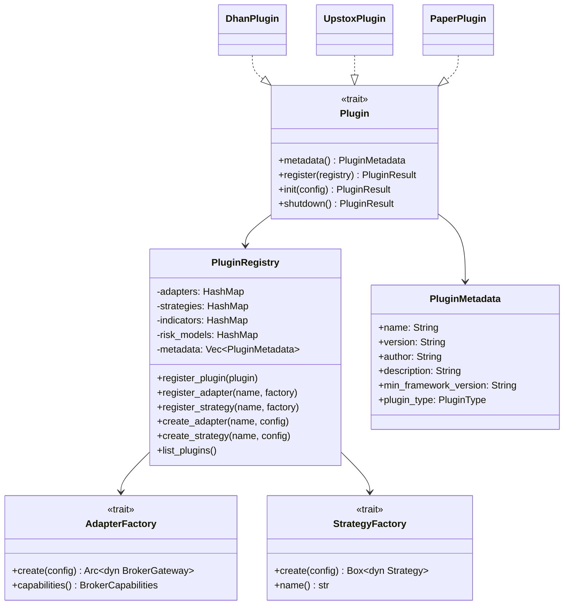
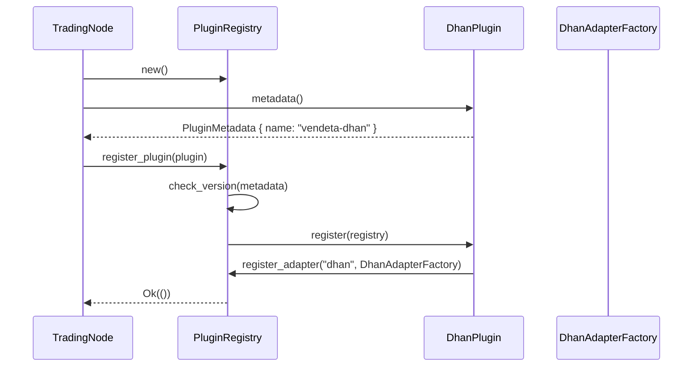
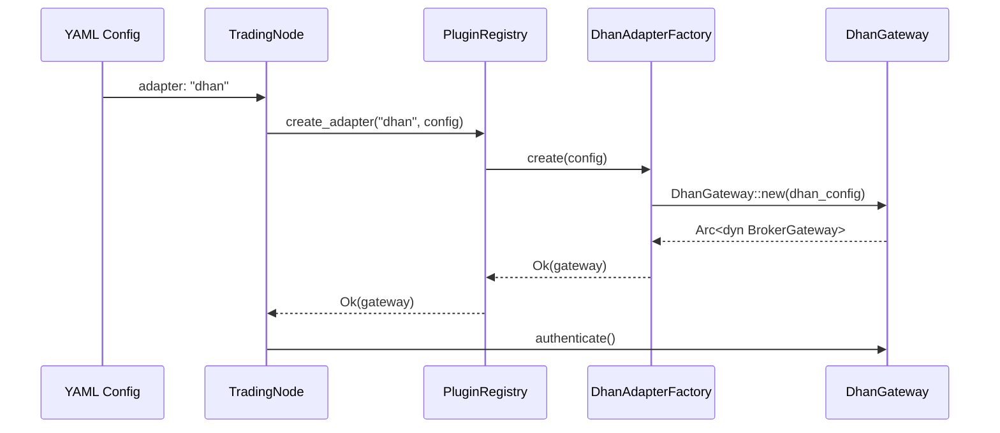
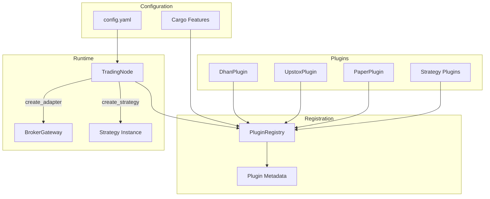

# 14 — Plugin System

**Version:** 1.0  
**Status:** Draft  
**Last Updated:** 2026-07-22  
**Related:** [08-Adapter System](./08-adapter-system.md), [07-Strategy System](./07-strategy-system.md), [15-Configuration](./15-configuration.md)

---

## 1. Overview

### Purpose

The Plugin System enables **third-party extensibility** without modifying framework core code. Plugins can add new broker adapters, strategies, indicators, and risk models. Registration is compile-time (Rust trait objects) with runtime discovery via a plugin registry.

### Plugin Types

| Type | Trait | Example |
|------|-------|---------|
| **Adapter Plugin** | `BrokerGateway` | New broker connectivity |
| **Strategy Plugin** | `Strategy` | Custom trading strategies |
| **Indicator Plugin** | `Indicator` | Technical analysis indicators |
| **Risk Model Plugin** | `RiskModel` | Custom risk checks |
| **Data Source Plugin** | `DataStorage` | Alternative storage backends |

### Design Principles

| Principle | Implementation |
|-----------|----------------|
| **Trait-based** | Plugins implement well-defined traits |
| **No core modification** | Plugins never modify framework source |
| **Compile-time safety** | Rust type system validates plugin contracts |
| **Runtime registration** | Plugins register via `PluginRegistry` |
| **Configuration-driven** | Plugins activated via YAML config |

---

## 2. Requirements

### Functional

| ID | Requirement |
|----|-------------|
| FR-01 | Register adapter plugins at startup |
| FR-02 | Register strategy plugins at startup |
| FR-03 | Discover plugins from configuration |
| FR-04 | Validate plugin compatibility (version check) |
| FR-05 | Support plugin metadata (name, version, author) |
| FR-06 | List all registered plugins |
| FR-07 | Graceful error on plugin load failure |
| FR-08 | Support plugin-specific configuration |

### Non-Functional

| ID | Requirement | Target |
|----|-------------|--------|
| NFR-01 | Plugin registration time | < 1ms per plugin |
| NFR-02 | Zero overhead when unused | No cost for unregistered plugins |
| NFR-03 | Binary compatibility | Same Rust toolchain version |

---

## 3. Plugin Trait

### Definition

```rust
/// Plugin trait — the interface for all framework plugins.
///
/// A plugin is a self-contained unit that registers one or more
/// capabilities with the framework.
pub trait Plugin: Send + Sync {
    /// Plugin metadata
    fn metadata(&self) -> PluginMetadata;

    /// Register this plugin's capabilities with the registry.
    ///
    /// Called once at startup. The plugin registers its adapters,
    /// strategies, indicators, etc.
    fn register(&self, registry: &mut PluginRegistry) -> PluginResult<()>;

    /// Plugin-specific initialization (after registration).
    fn init(&mut self, config: &PluginConfig) -> PluginResult<()> {
        let _ = config;
        Ok(())
    }

    /// Plugin shutdown (cleanup resources).
    fn shutdown(&mut self) -> PluginResult<()> {
        Ok(())
    }
}

/// Plugin metadata
#[derive(Clone, Debug)]
pub struct PluginMetadata {
    /// Unique plugin name (e.g., "vendeta-dhan")
    pub name: String,
    /// Semantic version
    pub version: String,
    /// Author
    pub author: String,
    /// Description
    pub description: String,
    /// Minimum framework version required
    pub min_framework_version: String,
    /// Plugin type
    pub plugin_type: PluginType,
}

/// Plugin types
#[derive(Clone, Copy, Debug, PartialEq, Eq)]
pub enum PluginType {
    /// Broker adapter
    Adapter,
    /// Trading strategy
    Strategy,
    /// Technical indicator
    Indicator,
    /// Risk model
    RiskModel,
    /// Data source
    DataSource,
    /// Composite (multiple capabilities)
    Composite,
}

/// Plugin-specific configuration (from YAML)
#[derive(Clone, Debug)]
pub struct PluginConfig {
    /// Raw configuration values
    pub values: HashMap<String, serde_yaml::Value>,
}

impl PluginConfig {
    /// Get a string value
    pub fn get_str(&self, key: &str) -> Option<&str> {
        self.values.get(key).and_then(|v| v.as_str())
    }

    /// Get an integer value
    pub fn get_i64(&self, key: &str) -> Option<i64> {
        self.values.get(key).and_then(|v| v.as_i64())
    }

    /// Get a boolean value
    pub fn get_bool(&self, key: &str) -> Option<bool> {
        self.values.get(key).and_then(|v| v.as_bool())
    }
}

/// Plugin result type
pub type PluginResult<T> = Result<T, PluginError>;

/// Plugin errors
#[derive(Debug, thiserror::Error)]
pub enum PluginError {
    #[error("plugin registration failed: {0}")]
    RegistrationFailed(String),

    #[error("version incompatible: plugin requires {required}, framework is {actual}")]
    VersionIncompatible { required: String, actual: String },

    #[error("plugin initialization failed: {0}")]
    InitFailed(String),

    #[error("plugin not found: {0}")]
    NotFound(String),

    #[error("duplicate plugin: {0}")]
    Duplicate(String),

    #[error("configuration error: {0}")]
    ConfigError(String),
}
```

---

## 4. PluginRegistry

### Definition

```rust
/// Plugin registry — central catalog of all registered plugins.
///
/// The TradingNode consults this registry when building components
/// from configuration.
pub struct PluginRegistry {
    /// Registered adapter factories
    adapters: HashMap<String, Box<dyn AdapterFactory>>,
    /// Registered strategy factories
    strategies: HashMap<String, Box<dyn StrategyFactory>>,
    /// Registered indicator factories
    indicators: HashMap<String, Box<dyn IndicatorFactory>>,
    /// Registered risk model factories
    risk_models: HashMap<String, Box<dyn RiskModelFactory>>,
    /// Plugin metadata (all registered plugins)
    metadata: Vec<PluginMetadata>,
}

/// Factory for creating adapter instances
pub trait AdapterFactory: Send + Sync {
    /// Create a new adapter instance from configuration
    fn create(&self, config: &AdapterConfig) -> PluginResult<Arc<dyn BrokerGateway>>;

    /// Adapter capabilities
    fn capabilities(&self) -> BrokerCapabilities;
}

/// Factory for creating strategy instances
pub trait StrategyFactory: Send + Sync {
    /// Create a new strategy instance from configuration
    fn create(&self, config: &StrategyConfig) -> PluginResult<Box<dyn Strategy>>;

    /// Strategy name
    fn name(&self) -> &str;
}

/// Factory for creating indicator instances
pub trait IndicatorFactory: Send + Sync {
    /// Create a new indicator instance
    fn create(&self, params: &IndicatorParams) -> PluginResult<Box<dyn Indicator>>;

    /// Indicator name
    fn name(&self) -> &str;
}

/// Factory for creating risk model instances
pub trait RiskModelFactory: Send + Sync {
    /// Create a new risk model
    fn create(&self, config: &RiskConfig) -> PluginResult<Box<dyn RiskModel>>;

    /// Model name
    fn name(&self) -> &str;
}

impl PluginRegistry {
    pub fn new() -> Self {
        PluginRegistry {
            adapters: HashMap::new(),
            strategies: HashMap::new(),
            indicators: HashMap::new(),
            risk_models: HashMap::new(),
            metadata: Vec::new(),
        }
    }

    /// Register a plugin
    pub fn register_plugin(&mut self, plugin: &dyn Plugin) -> PluginResult<()> {
        let meta = plugin.metadata();

        // Check for duplicates
        if self.metadata.iter().any(|m| m.name == meta.name) {
            return Err(PluginError::Duplicate(meta.name));
        }

        // Version compatibility check
        self.check_version(&meta)?;

        // Let the plugin register its capabilities
        plugin.register(self)?;

        // Record metadata
        self.metadata.push(meta);
        Ok(())
    }

    /// Register an adapter factory
    pub fn register_adapter(&mut self, name: &str, factory: Box<dyn AdapterFactory>) {
        self.adapters.insert(name.to_string(), factory);
    }

    /// Register a strategy factory
    pub fn register_strategy(&mut self, name: &str, factory: Box<dyn StrategyFactory>) {
        self.strategies.insert(name.to_string(), factory);
    }

    /// Register an indicator factory
    pub fn register_indicator(&mut self, name: &str, factory: Box<dyn IndicatorFactory>) {
        self.indicators.insert(name.to_string(), factory);
    }

    /// Register a risk model factory
    pub fn register_risk_model(&mut self, name: &str, factory: Box<dyn RiskModelFactory>) {
        self.risk_models.insert(name.to_string(), factory);
    }

    /// Create an adapter by name
    pub fn create_adapter(&self, name: &str, config: &AdapterConfig) -> PluginResult<Arc<dyn BrokerGateway>> {
        let factory = self.adapters.get(name)
            .ok_or_else(|| PluginError::NotFound(format!("adapter: {}", name)))?;
        factory.create(config)
    }

    /// Create a strategy by name
    pub fn create_strategy(&self, name: &str, config: &StrategyConfig) -> PluginResult<Box<dyn Strategy>> {
        let factory = self.strategies.get(name)
            .ok_or_else(|| PluginError::NotFound(format!("strategy: {}", name)))?;
        factory.create(config)
    }

    /// List all registered plugins
    pub fn list_plugins(&self) -> &[PluginMetadata] {
        &self.metadata
    }

    /// List available adapters
    pub fn list_adapters(&self) -> Vec<&str> {
        self.adapters.keys().map(|s| s.as_str()).collect()
    }

    /// List available strategies
    pub fn list_strategies(&self) -> Vec<&str> {
        self.strategies.keys().map(|s| s.as_str()).collect()
    }

    fn check_version(&self, meta: &PluginMetadata) -> PluginResult<()> {
        let framework_version = env!("CARGO_PKG_VERSION");
        // Simple semver comparison
        if semver::VersionReq::parse(&format!(">={}", meta.min_framework_version))
            .map(|req| !req.matches(&semver::Version::parse(framework_version).unwrap()))
            .unwrap_or(false)
        {
            return Err(PluginError::VersionIncompatible {
                required: meta.min_framework_version.clone(),
                actual: framework_version.to_string(),
            });
        }
        Ok(())
    }
}
```

---

## 5. Example Plugins

### Adapter Plugin (Dhan)

```rust
/// Dhan adapter plugin
pub struct DhanPlugin;

impl Plugin for DhanPlugin {
    fn metadata(&self) -> PluginMetadata {
        PluginMetadata {
            name: "vendeta-dhan".to_string(),
            version: env!("CARGO_PKG_VERSION").to_string(),
            author: "Vendeta Team".to_string(),
            description: "Dhan broker adapter for NSE/BSE/MCX".to_string(),
            min_framework_version: "0.1.0".to_string(),
            plugin_type: PluginType::Adapter,
        }
    }

    fn register(&self, registry: &mut PluginRegistry) -> PluginResult<()> {
        registry.register_adapter("dhan", Box::new(DhanAdapterFactory));
        Ok(())
    }
}

/// Factory for Dhan gateway instances
struct DhanAdapterFactory;

impl AdapterFactory for DhanAdapterFactory {
    fn create(&self, config: &AdapterConfig) -> PluginResult<Arc<dyn BrokerGateway>> {
        let dhan_config = DhanConfig {
            client_id: config.get_str("client_id")
                .ok_or(PluginError::ConfigError("missing client_id".into()))?
                .to_string(),
            access_token: config.get_str("access_token")
                .ok_or(PluginError::ConfigError("missing access_token".into()))?
                .to_string(),
        };
        Ok(Arc::new(DhanGateway::new(dhan_config)))
    }

    fn capabilities(&self) -> BrokerCapabilities {
        BrokerCapabilities {
            supports_equity: true,
            supports_futures: true,
            supports_options: true,
            supports_commodity: true,
            supports_modify: true,
            supports_oco: false,
            supports_bracket: true,
            supports_cover: true,
            max_order_size: 100_000,
            max_positions: 500,
            rate_limit_per_second: 25,
            supported_order_types: vec![
                OrderType::Market, OrderType::Limit,
                OrderType::Sl, OrderType::Slm,
            ],
            supported_exchanges: vec![
                Exchange::Nse, Exchange::Bse, Exchange::Mcx,
                Exchange::Nfo, Exchange::Bfo,
            ],
        }
    }
}
```

### Strategy Plugin

```rust
/// Example: RSI Mean Reversion strategy plugin
pub struct RsiPlugin;

impl Plugin for RsiPlugin {
    fn metadata(&self) -> PluginMetadata {
        PluginMetadata {
            name: "vendeta-strategy-rsi".to_string(),
            version: "0.1.0".to_string(),
            author: "Community".to_string(),
            description: "RSI mean reversion strategy".to_string(),
            min_framework_version: "0.1.0".to_string(),
            plugin_type: PluginType::Strategy,
        }
    }

    fn register(&self, registry: &mut PluginRegistry) -> PluginResult<()> {
        registry.register_strategy("rsi_mean_reversion", Box::new(RsiStrategyFactory));
        Ok(())
    }
}

struct RsiStrategyFactory;

impl StrategyFactory for RsiStrategyFactory {
    fn create(&self, config: &StrategyConfig) -> PluginResult<Box<dyn Strategy>> {
        let rsi_period = config.params.get("rsi_period")
            .and_then(|v| v.as_u64())
            .unwrap_or(14) as usize;
        let oversold = config.params.get("oversold")
            .and_then(|v| v.as_f64())
            .unwrap_or(30.0);
        let overbought = config.params.get("overbought")
            .and_then(|v| v.as_f64())
            .unwrap_or(70.0);

        Ok(Box::new(RsiMeanReversion::new(rsi_period, oversold, overbought)))
    }

    fn name(&self) -> &str {
        "rsi_mean_reversion"
    }
}
```

---

## 6. Plugin Discovery

### Registration at Startup

```rust
/// TradingNode startup — register all plugins.
///
/// Plugins are registered in order:
/// 1. Built-in plugins (always available)
/// 2. Configured plugins (from YAML)
/// 3. Feature-flagged plugins (compile-time)
impl TradingNode {
    fn build_registry(config: &TradingNodeConfig) -> PluginResult<PluginRegistry> {
        let mut registry = PluginRegistry::new();

        // 1. Built-in plugins
        registry.register_plugin(&PaperPlugin)?;

        // 2. Feature-flagged plugins
        #[cfg(feature = "dhan")]
        registry.register_plugin(&DhanPlugin)?;

        #[cfg(feature = "upstox")]
        registry.register_plugin(&UpstoxPlugin)?;

        // 3. Built-in strategies
        registry.register_plugin(&SmaCrossoverPlugin)?;

        // 4. Config-specified plugins
        for plugin_config in &config.plugins {
            // Dynamic plugin loading (future: dynamic library loading)
            tracing::info!(plugin = %plugin_config.name, "Loading plugin");
        }

        Ok(registry)
    }
}
```

### Cargo Feature Flags

```toml
# Cargo.toml — plugin features
[features]
default = ["paper"]
paper = []
dhan = ["vendeta-adapters/dhan"]
upstox = ["vendeta-adapters/upstox"]
all-adapters = ["dhan", "upstox", "paper"]

# Users enable plugins via features:
# vendeta = { version = "0.1", features = ["dhan", "upstox"] }
```

---

## 7. Class Diagram



---

## 8. Sequence Diagrams

### Plugin Registration



### Plugin Usage (Adapter Creation)



---

## 9. Data Flow



---

## 10. Configuration

```yaml
# config/plugins.yaml
plugins:
  # Adapter plugins
  adapters:
    - name: "dhan"
      enabled: true
      config:
        client_id: "${DHAN_CLIENT_ID}"
        access_token: "${DHAN_ACCESS_TOKEN}"

    - name: "upstox"
      enabled: false
      config:
        api_key: "${UPSTOX_API_KEY}"
        api_secret: "${UPSTOX_API_SECRET}"

    - name: "paper"
      enabled: true
      config:
        initial_capital: 1000000

  # Strategy plugins
  strategies:
    - name: "sma_crossover"
      enabled: true
      params:
        fast_period: 9
        slow_period: 21
        symbol: "RELIANCE"
        quantity: 10

    - name: "rsi_mean_reversion"
      enabled: false
      params:
        rsi_period: 14
        oversold: 30.0
        overbought: 70.0

  # Plugin discovery
  discovery:
    # Future: dynamic library path
    # plugin_dir: "./plugins/"
    # Future: remote plugin registry
    # registry_url: "https://plugins.vendeta.dev"
```

---

## 11. Error Handling

```rust
/// Plugin error recovery strategies:
///
/// | Error | Recovery |
/// |-------|----------|
/// | VersionIncompatible | Skip plugin, log error, continue startup |
/// | NotFound | Fail if required, warn if optional |
/// | Duplicate | Skip duplicate, log warning |
/// | ConfigError | Fail startup with clear error message |
/// | InitFailed | Skip plugin, log error, continue |
/// | RegistrationFailed | Fail startup (critical) |

impl TradingNode {
    fn register_plugins_safe(&mut self, plugins: Vec<Box<dyn Plugin>>) {
        for plugin in plugins {
            let name = plugin.metadata().name;
            match self.registry.register_plugin(plugin.as_ref()) {
                Ok(()) => {
                    tracing::info!(plugin = %name, "Plugin registered");
                }
                Err(PluginError::VersionIncompatible { required, actual }) => {
                    tracing::error!(
                        plugin = %name,
                        required = %required,
                        actual = %actual,
                        "Plugin version incompatible, skipping"
                    );
                }
                Err(e) => {
                    tracing::error!(plugin = %name, error = %e, "Plugin registration failed");
                }
            }
        }
    }
}
```

---

## 12. Testing Requirements

### Unit Tests

| Test | Description |
|------|-------------|
| `test_register_adapter_plugin` | Register Dhan plugin, verify adapter available |
| `test_register_strategy_plugin` | Register strategy, verify factory works |
| `test_duplicate_plugin_rejected` | Same name twice → error |
| `test_version_check` | Incompatible version → error |
| `test_create_adapter_from_config` | Create gateway from YAML config |
| `test_plugin_config_parsing` | Verify config values parsed correctly |

### Integration Tests

| Test | Description |
|------|-------------|
| `test_full_plugin_lifecycle` | Register → init → use → shutdown |
| `test_feature_flag_compilation` | Compile with/without features |
| `test_all_builtin_plugins_register` | All built-in plugins register without error |

### Contract Tests

```rust
/// Contract test: every adapter plugin must satisfy BrokerGateway contract
#[test]
fn adapter_plugin_contract() {
    let registry = build_test_registry();

    for name in registry.list_adapters() {
        let config = AdapterConfig::test_defaults();
        let gateway = registry.create_adapter(name, &config).unwrap();

        // Contract: broker_id is non-empty
        assert!(!gateway.broker_id().is_empty());

        // Contract: capabilities are valid
        let caps = gateway.capabilities();
        assert!(!caps.supported_exchanges.is_empty());
        assert!(!caps.supported_order_types.is_empty());
        assert!(caps.rate_limit_per_second > 0);
    }
}
```

---

## 13. Implementation Notes

### Patterns

1. **Factory pattern**: Plugins register factories, not instances. Instances created on demand from config.
2. **Feature flags**: Compile-time plugin selection via Cargo features. No runtime cost for disabled plugins.
3. **Trait objects**: `Box<dyn Strategy>`, `Arc<dyn BrokerGateway>` — dynamic dispatch for plugin types.
4. **Metadata-first**: Plugin metadata checked before registration (version, duplicates).

### Future: Dynamic Loading

```rust
/// Future: load plugins from shared libraries (.so/.dylib)
///
/// This would use libloading or abi_stable for safe dynamic loading.
/// Not in initial release — compile-time plugins are sufficient.
///
/// ```rust
/// // Future API:
/// let lib = unsafe { libloading::Library::new("./plugins/my_broker.so") }?;
/// let create: Symbol<fn() -> Box<dyn Plugin>> = unsafe { lib.get(b"create_plugin")? };
/// let plugin = create();
/// registry.register_plugin(plugin.as_ref())?;
/// ```
```

### Gotchas

- **Object safety**: All plugin traits must be object-safe (no generics, no Self by value).
- **Thread safety**: Plugins must be `Send + Sync` (shared across threads).
- **No global state**: Plugins must not use global mutable state. All state in the plugin struct.
- **Version pinning**: Plugin API is unstable before 1.0. Pin exact versions.
- **Config validation**: Validate plugin config at registration time, not at first use.

---

## 14. Cross-References

| Document | Relevance |
|----------|-----------|
| [08-Adapter System](./08-adapter-system.md) | Adapter plugins implement BrokerGateway |
| [07-Strategy System](./07-strategy-system.md) | Strategy plugins implement Strategy trait |
| [15-Configuration](./15-configuration.md) | Plugin config in YAML |
| [03-Project Structure](./03-project-structure.md) | Plugin crates in workspace |
| [22-Community](./22-community.md) | Third-party plugin ecosystem |
| [21-Versioning](./21-versioning.md) | Plugin version compatibility |
