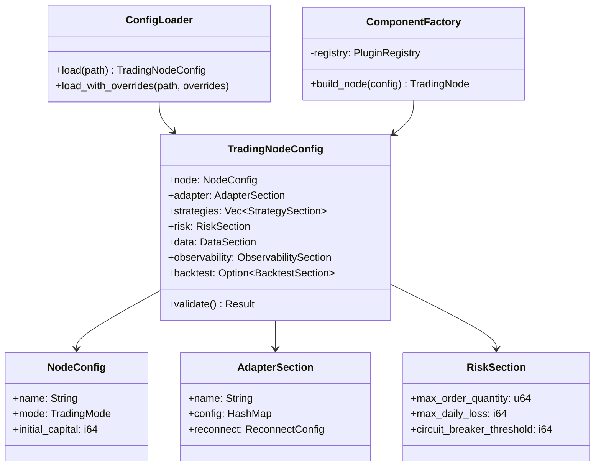
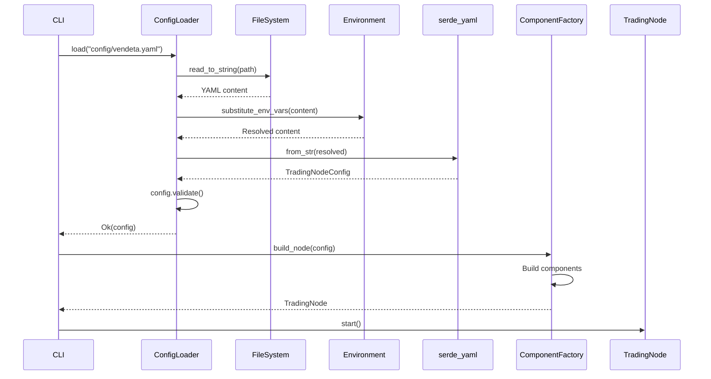
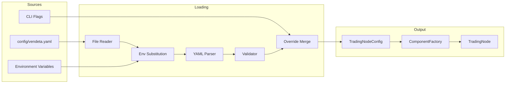

# 15 — Configuration

**Version:** 1.0  
**Status:** Draft  
**Last Updated:** 2026-07-22  
**Related:** [14-Plugin System](./14-plugin-system.md), [05-Component Lifecycle](./05-component-lifecycle.md), [03-Project Structure](./03-project-structure.md)

---

## 1. Overview

### Purpose

The Configuration system provides **declarative, YAML-based configuration** for the entire framework. Users describe *what* they want (strategies, adapters, risk limits), and the `ComponentFactory` builds the runtime graph. No imperative wiring code needed.

### Design Principles

| Principle | Implementation |
|-----------|----------------|
| **Declarative** | YAML describes desired state, not steps |
| **Environment-aware** | `${ENV_VAR}` substitution for secrets |
| **Validated** | Serde deserialization + custom validation |
| **Layered** | Defaults → file → env vars → CLI flags |
| **Type-safe** | Rust structs with serde derive |

---

## 2. Requirements

### Functional

| ID | Requirement |
|----|-------------|
| FR-01 | Load configuration from YAML file |
| FR-02 | Environment variable substitution (`${VAR}`) |
| FR-03 | Validate configuration at startup |
| FR-04 | Provide defaults for all optional fields |
| FR-05 | Support per-component configuration sections |
| FR-06 | ComponentFactory builds runtime from config |
| FR-07 | Support multiple config files (merge) |
| FR-08 | CLI flags override file config |

### Non-Functional

| ID | Requirement | Target |
|----|-------------|--------|
| NFR-01 | Config load time | < 10ms |
| NFR-02 | Validation errors | Clear, actionable messages |
| NFR-03 | No secrets in files | Env var substitution mandatory for credentials |

---

## 3. Configuration Schema

### Top-Level Structure

```rust
/// Root configuration for the trading node.
///
/// Deserialized from `config/vendeta.yaml`.
#[derive(Clone, Debug, Deserialize)]
#[serde(deny_unknown_fields)]
pub struct TradingNodeConfig {
    /// Node identity
    #[serde(default)]
    pub node: NodeConfig,

    /// Adapter configuration
    #[serde(default)]
    pub adapter: AdapterSection,

    /// Strategy configuration
    #[serde(default)]
    pub strategies: Vec<StrategySection>,

    /// Risk management configuration
    #[serde(default)]
    pub risk: RiskSection,

    /// Data infrastructure configuration
    #[serde(default)]
    pub data: DataSection,

    /// Observability configuration
    #[serde(default)]
    pub observability: ObservabilitySection,

    /// Backtest configuration (only for backtest mode)
    pub backtest: Option<BacktestSection>,

    /// Plugin configuration
    #[serde(default)]
    pub plugins: PluginsSection,
}

/// Node identity configuration
#[derive(Clone, Debug, Deserialize)]
pub struct NodeConfig {
    /// Node name (for logging)
    #[serde(default = "default_node_name")]
    pub name: String,

    /// Trading mode
    #[serde(default)]
    pub mode: TradingMode,

    /// Initial capital (in paise)
    #[serde(default = "default_capital")]
    pub initial_capital: i64,
}

fn default_node_name() -> String { "vendeta-node".to_string() }
fn default_capital() -> i64 { 1_000_000_00 } // ₹10,00,000

/// Trading mode
#[derive(Clone, Copy, Debug, Deserialize, PartialEq, Eq)]
#[serde(rename_all = "lowercase")]
pub enum TradingMode {
    /// Live trading (real money)
    Live,
    /// Paper trading (simulated fills, real data)
    Paper,
    /// Backtest (historical data, simulated fills)
    Backtest,
}

impl Default for TradingMode {
    fn default() -> Self { TradingMode::Paper }
}
```

### Adapter Section

```rust
/// Adapter configuration
#[derive(Clone, Debug, Deserialize)]
pub struct AdapterSection {
    /// Broker adapter name (e.g., "dhan", "upstox", "paper")
    pub name: String,

    /// Adapter-specific configuration
    #[serde(default)]
    pub config: HashMap<String, serde_yaml::Value>,

    /// WebSocket reconnection settings
    #[serde(default)]
    pub reconnect: ReconnectConfig,
}

/// Reconnection configuration
#[derive(Clone, Debug, Deserialize)]
pub struct ReconnectConfig {
    /// Maximum reconnection attempts (0 = infinite)
    #[serde(default = "default_max_retries")]
    pub max_retries: u32,

    /// Initial backoff delay (ms)
    #[serde(default = "default_initial_backoff")]
    pub initial_backoff_ms: u64,

    /// Maximum backoff delay (ms)
    #[serde(default = "default_max_backoff")]
    pub max_backoff_ms: u64,

    /// Backoff multiplier
    #[serde(default = "default_multiplier")]
    pub multiplier: f64,
}

fn default_max_retries() -> u32 { 0 }
fn default_initial_backoff() -> u64 { 1000 }
fn default_max_backoff() -> u64 { 30000 }
fn default_multiplier() -> f64 { 2.0 }

impl Default for ReconnectConfig {
    fn default() -> Self {
        ReconnectConfig {
            max_retries: default_max_retries(),
            initial_backoff_ms: default_initial_backoff(),
            max_backoff_ms: default_max_backoff(),
            multiplier: default_multiplier(),
        }
    }
}
```

### Strategy Section

```rust
/// Strategy configuration
#[derive(Clone, Debug, Deserialize)]
pub struct StrategySection {
    /// Strategy name (must match registered plugin)
    pub name: String,

    /// Whether strategy is enabled
    #[serde(default = "default_true")]
    pub enabled: bool,

    /// Strategy parameters (passed to factory)
    #[serde(default)]
    pub params: HashMap<String, serde_yaml::Value>,

    /// Symbols this strategy trades
    #[serde(default)]
    pub symbols: Vec<String>,

    /// Timeframe
    #[serde(default = "default_timeframe")]
    pub timeframe: String,
}

fn default_true() -> bool { true }
fn default_timeframe() -> String { "5m".to_string() }
```

### Risk Section

```rust
/// Risk configuration
#[derive(Clone, Debug, Deserialize)]
pub struct RiskSection {
    /// Maximum order quantity
    #[serde(default = "default_max_order_qty")]
    pub max_order_quantity: u64,

    /// Maximum order value (paise)
    #[serde(default = "default_max_order_value")]
    pub max_order_value: i64,

    /// Maximum position per instrument
    #[serde(default = "default_max_position")]
    pub max_position_quantity: u64,

    /// Maximum total exposure (paise)
    #[serde(default = "default_max_exposure")]
    pub max_total_exposure: i64,

    /// Maximum daily loss (paise)
    #[serde(default = "default_max_daily_loss")]
    pub max_daily_loss: i64,

    /// Maximum orders per day
    #[serde(default = "default_max_daily_orders")]
    pub max_daily_orders: u32,

    /// Circuit breaker threshold (paise, negative)
    #[serde(default = "default_circuit_breaker")]
    pub circuit_breaker_threshold: i64,

    /// Enable kill switch
    #[serde(default = "default_true")]
    pub kill_switch_enabled: bool,
}

fn default_max_order_qty() -> u64 { 10_000 }
fn default_max_order_value() -> i64 { 100_000_00 } // ₹1,00,000
fn default_max_position() -> u64 { 50_000 }
fn default_max_exposure() -> i64 { 1000_000_00 } // ₹10,00,000
fn default_max_daily_loss() -> i64 { 50_000_00 } // ₹50,000
fn default_max_daily_orders() -> u32 { 100 }
fn default_circuit_breaker() -> i64 { -100_000_00 } // -₹1,00,000

impl Default for RiskSection {
    fn default() -> Self {
        RiskSection {
            max_order_quantity: default_max_order_qty(),
            max_order_value: default_max_order_value(),
            max_position_quantity: default_max_position(),
            max_total_exposure: default_max_exposure(),
            max_daily_loss: default_max_daily_loss(),
            max_daily_orders: default_max_daily_orders(),
            circuit_breaker_threshold: default_circuit_breaker(),
            kill_switch_enabled: true,
        }
    }
}
```

### Data Section

```rust
/// Data infrastructure configuration
#[derive(Clone, Debug, Deserialize)]
pub struct DataSection {
    /// Parquet storage path
    #[serde(default = "default_parquet_path")]
    pub parquet_path: String,

    /// SQLite database path
    #[serde(default = "default_sqlite_path")]
    pub sqlite_path: String,

    /// Event log path
    #[serde(default = "default_event_log_path")]
    pub event_log_path: String,

    /// Bar aggregation settings
    #[serde(default)]
    pub aggregation: AggregationConfig,
}

fn default_parquet_path() -> String { "./data/parquet".to_string() }
fn default_sqlite_path() -> String { "./data/vendeta.db".to_string() }
fn default_event_log_path() -> String { "./data/events.log".to_string() }

/// Aggregation configuration
#[derive(Clone, Debug, Deserialize)]
pub struct AggregationConfig {
    /// Default timeframe
    #[serde(default = "default_timeframe")]
    pub default_timeframe: String,

    /// Supported timeframes
    #[serde(default = "default_timeframes")]
    pub supported_timeframes: Vec<String>,
}

fn default_timeframes() -> Vec<String> {
    vec!["1s".into(), "1m".into(), "5m".into(), "15m".into(), "1h".into(), "1d".into()]
}

impl Default for DataSection {
    fn default() -> Self {
        DataSection {
            parquet_path: default_parquet_path(),
            sqlite_path: default_sqlite_path(),
            event_log_path: default_event_log_path(),
            aggregation: AggregationConfig {
                default_timeframe: default_timeframe(),
                supported_timeframes: default_timeframes(),
            },
        }
    }
}
```

---

## 4. Environment Variable Substitution

### Implementation

```rust
/// Substitute environment variables in YAML content.
///
/// Pattern: ${VAR_NAME} or ${VAR_NAME:-default}
///
/// Examples:
///   client_id: "${DHAN_CLIENT_ID}"
///   port: "${METRICS_PORT:-9090}"
pub fn substitute_env_vars(content: &str) -> Result<String, ConfigError> {
    let mut result = String::with_capacity(content.len());
    let mut chars = content.chars().peekable();

    while let Some(c) = chars.next() {
        if c == '$' && chars.peek() == Some(&'{') {
            chars.next(); // consume '{'
            let mut var_expr = String::new();
            while let Some(&c) = chars.peek() {
                if c == '}' {
                    chars.next();
                    break;
                }
                var_expr.push(c);
                chars.next();
            }

            // Parse VAR_NAME or VAR_NAME:-default
            let (var_name, default) = if let Some(idx) = var_expr.find(":-") {
                (&var_expr[..idx], Some(&var_expr[idx + 2..]))
            } else {
                (var_expr.as_str(), None)
            };

            // Resolve
            match std::env::var(var_name) {
                Ok(value) => result.push_str(&value),
                Err(_) => {
                    if let Some(default_val) = default {
                        result.push_str(default_val);
                    } else {
                        return Err(ConfigError::MissingEnvVar(var_name.to_string()));
                    }
                }
            }
        } else {
            result.push(c);
        }
    }

    Ok(result)
}
```

---

## 5. Configuration Loading

### Loader

```rust
/// Configuration loader — reads, substitutes, validates.
pub struct ConfigLoader;

impl ConfigLoader {
    /// Load configuration from a YAML file.
    ///
    /// Steps:
    /// 1. Read file content
    /// 2. Substitute environment variables
    /// 3. Deserialize to TradingNodeConfig
    /// 4. Validate
    pub fn load(path: &Path) -> Result<TradingNodeConfig, ConfigError> {
        // 1. Read file
        let content = std::fs::read_to_string(path)
            .map_err(|e| ConfigError::IoError(path.to_path_buf(), e))?;

        // 2. Substitute env vars
        let substituted = substitute_env_vars(&content)?;

        // 3. Deserialize
        let config: TradingNodeConfig = serde_yaml::from_str(&substituted)
            .map_err(|e| ConfigError::ParseError(e.to_string()))?;

        // 4. Validate
        config.validate()?;

        Ok(config)
    }

    /// Load with CLI overrides
    pub fn load_with_overrides(
        path: &Path,
        overrides: &[(&str, &str)],
    ) -> Result<TradingNodeConfig, ConfigError> {
        let mut config = Self::load(path)?;

        // Apply overrides (dot-notation paths)
        for (key, value) in overrides {
            config.apply_override(key, value)?;
        }

        config.validate()?;
        Ok(config)
    }
}

impl TradingNodeConfig {
    /// Validate the configuration
    pub fn validate(&self) -> Result<(), ConfigError> {
        // Node validation
        if self.node.initial_capital <= 0 {
            return Err(ConfigError::Validation(
                "initial_capital must be positive".into()
            ));
        }

        // Adapter validation
        if self.adapter.name.is_empty() {
            return Err(ConfigError::Validation(
                "adapter.name cannot be empty".into()
            ));
        }

        // Risk validation
        if self.risk.max_daily_loss >= 0 {
            return Err(ConfigError::Validation(
                "risk.max_daily_loss must be positive (represents maximum loss amount)".into()
            ));
        }

        // Strategy validation
        for (i, strategy) in self.strategies.iter().enumerate() {
            if strategy.name.is_empty() {
                return Err(ConfigError::Validation(
                    format!("strategies[{}].name cannot be empty", i)
                ));
            }
        }

        Ok(())
    }

    /// Apply a CLI override (dot-notation)
    fn apply_override(&mut self, key: &str, value: &str) -> Result<(), ConfigError> {
        match key {
            "node.mode" => {
                self.node.mode = serde_yaml::from_str(value)
                    .map_err(|_| ConfigError::Validation(format!("invalid mode: {}", value)))?;
            }
            "node.initial_capital" => {
                self.node.initial_capital = value.parse()
                    .map_err(|_| ConfigError::Validation(format!("invalid capital: {}", value)))?;
            }
            "adapter.name" => {
                self.adapter.name = value.to_string();
            }
            _ => {
                return Err(ConfigError::Validation(
                    format!("unknown config key: {}", key)
                ));
            }
        }
        Ok(())
    }
}
```

---

## 6. ComponentFactory

### Purpose

The ComponentFactory builds the runtime component graph from configuration.

```rust
/// Component factory — builds runtime from configuration.
///
/// This is the composition root: it reads config and creates
/// all components, wiring them together.
pub struct ComponentFactory {
    registry: PluginRegistry,
}

impl ComponentFactory {
    pub fn new(registry: PluginRegistry) -> Self {
        ComponentFactory { registry }
    }

    /// Build a complete TradingNode from configuration.
    pub fn build_node(&self, config: &TradingNodeConfig) -> Result<TradingNode, ConfigError> {
        // 1. Build clock
        let clock: Arc<dyn Clock> = match config.node.mode {
            TradingMode::Live | TradingMode::Paper => Arc::new(LiveClock),
            TradingMode::Backtest => Arc::new(BacktestClock::new(Timestamp::ZERO)),
        };

        // 2. Build message bus
        let bus = Arc::new(MessageBus::new(4096));

        // 3. Build adapter (from plugin registry)
        let adapter_config = AdapterConfig::from_section(&config.adapter);
        let gateway = self.registry.create_adapter(&config.adapter.name, &adapter_config)
            .map_err(|e| ConfigError::PluginError(e.to_string()))?;

        // 4. Build risk engine
        let risk_config = RiskConfig::from_section(&config.risk);
        let risk_engine = RiskEngine::new(risk_config);

        // 5. Build execution engine
        let execution = ExecutionEngine::new(gateway, risk_engine, bus.clone());

        // 6. Build portfolio engine
        let portfolio = PortfolioEngine::new(
            Money(config.node.initial_capital),
            clock.clone(),
        );

        // 7. Build strategies
        let mut strategies: Vec<Box<dyn Strategy>> = Vec::new();
        for strategy_section in &config.strategies {
            if !strategy_section.enabled {
                continue;
            }
            let strategy_config = StrategyConfig::from_section(strategy_section);
            let strategy = self.registry.create_strategy(&strategy_section.name, &strategy_config)
                .map_err(|e| ConfigError::PluginError(e.to_string()))?;
            strategies.push(strategy);
        }

        // 8. Build data engine
        let storage = Arc::new(ParquetStore::new(PathBuf::from(&config.data.parquet_path)));
        let event_log = Arc::new(EventLog::open(Path::new(&config.data.event_log_path))?);
        let symbols = Arc::new(SymbolManager::new());
        let data_engine = DataEngine::new(symbols, storage, event_log, clock.clone());

        // 9. Assemble TradingNode
        Ok(TradingNode::new(
            config.node.name.clone(),
            bus,
            execution,
            portfolio,
            data_engine,
            strategies,
            clock,
        ))
    }
}
```

---

## 7. Example Configuration

### Full Example (config/vendeta.yaml)

```yaml
# Vendeta Trading Framework Configuration
# ==========================================

node:
  name: "my-trading-node"
  mode: "paper"              # live | paper | backtest
  initial_capital: 100000000  # ₹10,00,000 in paise

adapter:
  name: "dhan"
  config:
    client_id: "${DHAN_CLIENT_ID}"
    access_token: "${DHAN_ACCESS_TOKEN}"
  reconnect:
    max_retries: 0           # infinite
    initial_backoff_ms: 1000
    max_backoff_ms: 30000
    multiplier: 2.0

strategies:
  - name: "sma_crossover"
    enabled: true
    symbols:
      - "RELIANCE"
      - "TCS"
    timeframe: "5m"
    params:
      fast_period: 9
      slow_period: 21
      quantity: 10

  - name: "rsi_mean_reversion"
    enabled: false
    symbols:
      - "NIFTY"
    timeframe: "15m"
    params:
      rsi_period: 14
      oversold: 30.0
      overbought: 70.0

risk:
  max_order_quantity: 10000
  max_order_value: 100000000       # ₹1,00,000
  max_position_quantity: 50000
  max_total_exposure: 1000000000   # ₹10,00,000
  max_daily_loss: 5000000          # ₹50,000
  max_daily_orders: 100
  circuit_breaker_threshold: -10000000  # -₹1,00,000
  kill_switch_enabled: true

data:
  parquet_path: "./data/parquet"
  sqlite_path: "./data/vendeta.db"
  event_log_path: "./data/events.log"
  aggregation:
    default_timeframe: "5m"
    supported_timeframes:
      - "1m"
      - "5m"
      - "15m"
      - "1h"
      - "1d"

observability:
  logging:
    level: "info"
    format: "json"
  metrics:
    enabled: true
    port: 9090
  audit:
    enabled: true
    path: "./data/audit.db"

plugins:
  adapters:
    - name: "dhan"
      enabled: true
    - name: "paper"
      enabled: true
```

### Backtest Override (config/backtest.yaml)

```yaml
# Extends base config for backtesting
node:
  mode: "backtest"

backtest:
  symbols:
    - "RELIANCE"
  timeframe: "5m"
  start: "2024-01-01"
  end: "2024-06-30"
  slippage:
    model: "fixed"
    ticks: 1
  commission:
    model: "indian"
    brokerage_rate: 0.0003
```

---

## 8. Class Diagram



---

## 9. Sequence Diagrams

### Configuration Loading



---

## 10. Data Flow



---

## 11. Error Handling

```rust
/// Configuration errors
#[derive(Debug, thiserror::Error)]
pub enum ConfigError {
    /// File not found or unreadable
    #[error("cannot read config file {0}: {1}")]
    IoError(PathBuf, std::io::Error),

    /// YAML parse error
    #[error("config parse error: {0}")]
    ParseError(String),

    /// Missing environment variable
    #[error("missing environment variable: {0}")]
    MissingEnvVar(String),

    /// Validation failure
    #[error("config validation failed: {0}")]
    Validation(String),

    /// Plugin creation error
    #[error("plugin error: {0}")]
    PluginError(String),

    /// Unknown override key
    #[error("unknown config key: {0}")]
    UnknownKey(String),
}
```

### Error Message Quality

```
ERROR: config validation failed: risk.max_daily_loss must be positive (represents maximum loss amount)
  --> config/vendeta.yaml:42:3
   |
42 |   max_daily_loss: -50000
   |   ^^^^^^^^^^^^^^^^^^^^^^ expected positive value
   |
   = help: max_daily_loss represents the maximum loss amount. Use 5000000 for ₹50,000.
```

---

## 12. Testing Requirements

### Unit Tests

| Test | Description |
|------|-------------|
| `test_load_minimal_config` | Minimal YAML → valid config with defaults |
| `test_env_var_substitution` | `${VAR}` replaced correctly |
| `test_env_var_default` | `${VAR:-default}` uses default |
| `test_missing_env_var_error` | Missing required var → clear error |
| `test_validation_negative_capital` | Negative capital → validation error |
| `test_cli_override` | Override mode via CLI |
| `test_deny_unknown_fields` | Unknown field → parse error |

### Integration Tests

| Test | Description |
|------|-------------|
| `test_full_config_load` | Load example.yaml → build node |
| `test_config_roundtrip` | Serialize → deserialize → equal |
| `test_component_factory_build` | Config → TradingNode with all components |

---

## 13. Implementation Notes

### Patterns

1. **Serde defaults**: Every optional field has `#[serde(default)]` with a named function.
2. **Deny unknown fields**: `#[serde(deny_unknown_fields)]` catches typos early.
3. **Env vars for secrets**: Credentials NEVER in YAML files. Always `${ENV_VAR}`.
4. **Layered config**: `default → file → env → CLI`. Later layers override earlier.
5. **Fail fast**: Validate at startup. Never discover config errors at runtime.

### Gotchas

- **Paise not rupees**: All money values in config are in paise (1/100 rupee). Document clearly.
- **YAML anchors**: Support YAML anchors (`&` / `*`) for DRY config.
- **File watching**: Future: watch config file for hot-reload of non-critical settings.
- **Config diff**: Log effective config at startup (with secrets masked) for debugging.
- **Mode-specific validation**: Backtest mode requires `backtest` section. Live mode requires adapter credentials.

---

## 14. Cross-References

| Document | Relevance |
|----------|-----------|
| [14-Plugin System](./14-plugin-system.md) | Plugins configured via YAML |
| [05-Component Lifecycle](./05-component-lifecycle.md) | Components built from config |
| [09-Risk Management](./09-risk-management.md) | Risk limits from config |
| [08-Adapter System](./08-adapter-system.md) | Adapter selection from config |
| [19-Developer Experience](./19-developer-experience.md) | CLI config commands |
| [03-Project Structure](./03-project-structure.md) | `vendeta-config` crate |
