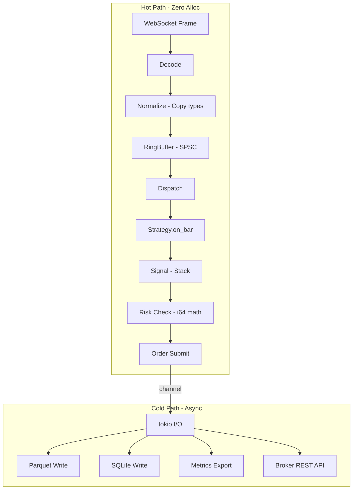

# 16 — Performance

**Version:** 1.0  
**Status:** Draft  
**Last Updated:** 2026-07-22  
**Related:** [04-Message Bus](./04-message-driven-architecture.md), [11-Data Infrastructure](./11-data-infrastructure.md), [12-Zero-Parity Engine](./12-zero-parity-engine.md)

---

## 1. Overview

### Purpose

Vendeta targets **sub-millisecond order processing** and **microsecond-level market data handling**. Performance is achieved through zero-allocation hot paths, fixed-point arithmetic, Copy types, and careful memory layout — not through unsafe hacks.

### Performance Budget

| Operation | Target | Critical Path |
|-----------|--------|---------------|
| Quote normalization | < 1μs | Yes |
| Bar aggregation (per tick) | < 5μs | Yes |
| Strategy `on_bar` dispatch | < 10μs | Yes |
| Risk check (all rules) | < 100μs | Yes |
| Order submission (internal) | < 50μs | Yes |
| Message bus publish | < 5μs | Yes |
| Position update | < 10μs | Yes |
| Backtest throughput | > 1M bars/sec | No |

### Design Principles

| Principle | Implementation |
|-----------|----------------|
| **Zero allocation** | Hot paths use stack-only operations |
| **Fixed-point** | i64 arithmetic, no floating-point in hot path |
| **Copy types** | Price, Quantity, Money, Timestamp are Copy |
| **Batch processing** | Coalesce events where latency allows |
| **Async I/O** | Network I/O is async, computation is sync |
| **Cache-friendly** | Contiguous memory, avoid pointer chasing |

---

## 2. Requirements

### Functional

| ID | Requirement |
|----|-------------|
| FR-01 | Zero heap allocation in market data hot path |
| FR-02 | Fixed-point arithmetic for all prices |
| FR-03 | Lock-free message passing (SPSC channels) |
| FR-04 | Batch processing for non-critical paths |
| FR-05 | Configurable buffer sizes |
| FR-06 | Benchmark suite with regression detection |

### Non-Functional

| ID | Requirement | Target |
|----|-------------|--------|
| NFR-01 | End-to-end latency (quote → signal) | < 100μs |
| NFR-02 | Memory footprint (idle) | < 50MB |
| NFR-03 | CPU usage (idle, no data) | < 1% |
| NFR-04 | Startup time | < 500ms |
| NFR-05 | Backtest 1M bars | < 1 second |

---

## 3. Fixed-Point Arithmetic

### Design

```rust
/// All prices use fixed-point i64 representation.
///
/// PRECISION = 10_000 (4 decimal places)
/// Example: ₹1234.56 → Price(12_345_600)
///
/// This avoids floating-point non-determinism and is faster
/// than Decimal for the operations we need (add, sub, mul, cmp).

/// Price precision (4 decimal places)
pub const PRICE_PRECISION: i64 = 10_000;

/// A price in fixed-point representation.
///
/// Internally: price_in_rupees * 10_000
/// Example: ₹100.50 → Price(1_005_000)
#[derive(Clone, Copy, Debug, PartialEq, Eq, PartialOrd, Ord, Hash)]
pub struct Price(pub i64);

impl Price {
    /// Zero price
    pub const ZERO: Price = Price(0);

    /// Create from rupee float (for configuration only, not hot path)
    pub fn from_f64(rupees: f64) -> Self {
        Price((rupees * PRICE_PRECISION as f64).round() as i64)
    }

    /// Create from paise (broker format)
    pub fn from_paise(paise: i64) -> Self {
        Price(paise * 100) // paise has 2 decimals, we need 4
    }

    /// Convert to rupee float (for display only)
    pub fn to_f64(&self) -> f64 {
        self.0 as f64 / PRICE_PRECISION as f64
    }

    /// Add two prices
    pub fn checked_add(self, other: Price) -> Option<Price> {
        self.0.checked_add(other.0).map(Price)
    }

    /// Subtract
    pub fn checked_sub(self, other: Price) -> Option<Price> {
        self.0.checked_sub(other.0).map(Price)
    }

    /// Multiply by quantity → Money
    pub fn mul_qty(self, qty: Quantity) -> Money {
        Money(self.0 * qty.0 as i64)
    }
}

/// Quantity (always positive, u64)
#[derive(Clone, Copy, Debug, PartialEq, Eq, PartialOrd, Ord, Hash)]
pub struct Quantity(pub u64);

/// Money value (can be negative for P&L)
#[derive(Clone, Copy, Debug, PartialEq, Eq, PartialOrd, Ord, Hash)]
pub struct Money(pub i64);

impl Money {
    pub const ZERO: Money = Money(0);

    pub fn from_f64(rupees: f64) -> Self {
        Money((rupees * PRICE_PRECISION as f64).round() as i64)
    }

    pub fn to_f64(&self) -> f64 {
        self.0 as f64 / PRICE_PRECISION as f64
    }
}

/// Timestamp (nanoseconds since Unix epoch)
#[derive(Clone, Copy, Debug, PartialEq, Eq, PartialOrd, Ord, Hash)]
pub struct Timestamp(i64);

impl Timestamp {
    pub fn from_nanos(nanos: i64) -> Self {
        Timestamp(nanos)
    }

    pub fn as_nanos(&self) -> i64 {
        self.0
    }

    pub fn now() -> Self {
        Timestamp(
            std::time::SystemTime::now()
                .duration_since(std::time::UNIX_EPOCH)
                .unwrap()
                .as_nanos() as i64
        )
    }

    /// Floor to a boundary (for bar alignment)
    pub fn floor_to(&self, boundary_ns: u64) -> Self {
        if boundary_ns == 0 { return *self; }
        Timestamp(self.0 - (self.0 % boundary_ns as i64))
    }
}
```

### Why Fixed-Point?

| Aspect | f64 | Decimal | Fixed-Point i64 |
|--------|-----|---------|-----------------|
| Speed | Fast | Slow | Fast |
| Determinism | Non-deterministic | Deterministic | Deterministic |
| Precision | ~15 digits | Arbitrary | 4 decimal places |
| Memory | 8 bytes | 16+ bytes | 8 bytes |
| Copy | Yes | No (usually) | Yes |
| Overflow | Silent (inf/nan) | No | Panic (debug) / wrap (release) |

For Indian markets (max price ~₹1,00,000, precision 0.0001), i64 gives range of ±922 trillion — more than sufficient.

---

## 4. Zero-Allocation Hot Path

### Market Data Path

```rust
/// The hot path: Broker WebSocket → FeedBridge → MessageBus → Strategy
///
/// ZERO allocations in this path:
/// 1. FeedBridge normalizes into stack-allocated Quote (Copy type)
/// 2. MessageBus sends via pre-allocated ring buffer
/// 3. Strategy receives &Quote (borrowed, no clone)

/// Quote is Copy — passed by value, lives on stack
#[derive(Clone, Copy, Debug)]
pub struct Quote {
    pub symbol: SymbolId,  // u32 index, not String
    pub bid: Price,        // i64
    pub ask: Price,        // i64
    pub bid_qty: u64,
    pub ask_qty: u64,
    pub last_price: Price, // i64
    pub volume: u64,
    pub timestamp: Timestamp, // i64
}
// Size: 56 bytes — fits in a cache line

/// SymbolId — interned symbol reference (no String allocation)
#[derive(Clone, Copy, Debug, PartialEq, Eq, Hash)]
pub struct SymbolId(pub u32);

/// Symbol interner — maps strings to IDs at startup
pub struct SymbolInterner {
    /// String → ID
    map: HashMap<String, SymbolId>,
    /// ID → String (for display)
    names: Vec<String>,
}

impl SymbolInterner {
    /// Intern a symbol (called at startup, not hot path)
    pub fn intern(&mut self, name: &str) -> SymbolId {
        if let Some(&id) = self.map.get(name) {
            return id;
        }
        let id = SymbolId(self.names.len() as u32);
        self.map.insert(name.to_string(), id);
        self.names.push(name.to_string());
        id
    }

    /// Resolve ID to name (for logging/display)
    pub fn name(&self, id: SymbolId) -> &str {
        &self.names[id.0 as usize]
    }
}
```

### Ring Buffer (SPSC)

```rust
/// Lock-free single-producer single-consumer ring buffer.
///
/// Used for the message bus hot path. Pre-allocated, no dynamic growth.
pub struct RingBuffer<T: Copy, const N: usize> {
    /// Pre-allocated storage
    buffer: [MaybeUninit<T>; N],
    /// Write position (producer)
    write_pos: AtomicUsize,
    /// Read position (consumer)
    read_pos: AtomicUsize,
}

impl<T: Copy, const N: usize> RingBuffer<T, N> {
    /// Try to push an item (non-blocking).
    /// Returns false if buffer is full.
    pub fn try_push(&self, item: T) -> bool {
        let write = self.write_pos.load(Ordering::Relaxed);
        let read = self.read_pos.load(Ordering::Acquire);
        let next_write = (write + 1) % N;

        if next_write == read {
            return false; // Full
        }

        unsafe {
            (self.buffer.as_ptr() as *mut MaybeUninit<T>)
                .add(write)
                .write(MaybeUninit::new(item));
        }
        self.write_pos.store(next_write, Ordering::Release);
        true
    }

    /// Try to pop an item (non-blocking).
    /// Returns None if buffer is empty.
    pub fn try_pop(&self) -> Option<T> {
        let read = self.read_pos.load(Ordering::Relaxed);
        let write = self.write_pos.load(Ordering::Acquire);

        if read == write {
            return None; // Empty
        }

        let item = unsafe {
            (self.buffer.as_ptr() as *const MaybeUninit<T>)
                .add(read)
                .read()
                .assume_init()
        };
        self.read_pos.store((read + 1) % N, Ordering::Release);
        Some(item)
    }

    /// Number of items in buffer
    pub fn len(&self) -> usize {
        let write = self.write_pos.load(Ordering::Acquire);
        let read = self.read_pos.load(Ordering::Acquire);
        if write >= read { write - read } else { N - read + write }
    }

    /// Is buffer empty?
    pub fn is_empty(&self) -> bool {
        self.len() == 0
    }
}
```

---

## 5. Batch Processing

### Purpose

For non-critical paths (storage writes, metrics), batch operations to amortize overhead.

```rust
/// Batch processor — coalesces events for efficient processing.
///
/// Used for:
/// - Parquet writes (batch bars before writing)
/// - Metrics export (batch counters)
/// - Audit trail (batch inserts)
pub struct BatchProcessor<T> {
    /// Buffered items
    buffer: Vec<T>,
    /// Maximum batch size
    max_size: usize,
    /// Maximum age before flush (ms)
    max_age_ms: u64,
    /// Last flush time
    last_flush: Instant,
    /// Flush callback
    flush_fn: Box<dyn FnMut(&[T]) + Send>,
}

impl<T> BatchProcessor<T> {
    pub fn new(
        max_size: usize,
        max_age_ms: u64,
        flush_fn: Box<dyn FnMut(&[T]) + Send>,
    ) -> Self {
        BatchProcessor {
            buffer: Vec::with_capacity(max_size),
            max_size,
            max_age_ms,
            last_flush: Instant::now(),
            flush_fn,
        }
    }

    /// Add an item to the batch
    pub fn push(&mut self, item: T) {
        self.buffer.push(item);
        if self.should_flush() {
            self.flush();
        }
    }

    /// Check if batch should be flushed
    fn should_flush(&self) -> bool {
        self.buffer.len() >= self.max_size
            || self.last_flush.elapsed().as_millis() >= self.max_age_ms as u128
    }

    /// Flush the batch
    pub fn flush(&mut self) {
        if !self.buffer.is_empty() {
            (self.flush_fn)(&self.buffer);
            self.buffer.clear();
            self.last_flush = Instant::now();
        }
    }
}
```

---

## 6. Async I/O Architecture

### Separation of Concerns

```
┌─────────────────────────────────────────────────────────┐
│                    HOT PATH (sync)                        │
│                                                          │
│  WebSocket recv → decode → normalize → bus → strategy    │
│                                                          │
│  • No .await                                             │
│  • No allocation                                         │
│  • No syscalls (except recv)                             │
│  • All Copy types                                        │
└─────────────────────────────────────────────────────────┘
                         │
                         │ (channel)
                         ▼
┌─────────────────────────────────────────────────────────┐
│                 COLD PATH (async)                         │
│                                                          │
│  • Parquet writes (tokio::fs)                            │
│  • SQLite writes (spawn_blocking)                        │
│  • REST API calls (reqwest)                              │
│  • Metrics export (HTTP server)                          │
│  • Health checks                                         │
└─────────────────────────────────────────────────────────┘
```

### Tokio Runtime Configuration

```rust
/// Configure tokio runtime for trading workload.
pub fn build_runtime() -> tokio::runtime::Runtime {
    tokio::runtime::Builder::new_multi_thread()
        .worker_threads(2)              // Minimal threads (I/O only)
        .max_blocking_threads(4)        // For SQLite, file I/O
        .thread_name("vendeta-io")
        .enable_all()
        .build()
        .expect("failed to build tokio runtime")
}

/// The hot path runs on a dedicated thread (not tokio).
///
/// ```rust
/// // Main thread: hot path (sync, no async)
/// std::thread::Builder::new()
///     .name("vendeta-hot".to_string())
///     .spawn(|| {
///         // Event loop: recv → process → dispatch
///         loop {
///             let msg = channel.recv(); // blocking recv
///             process_message(msg);   // sync processing
///         }
///     })
///     .unwrap();
/// ```
```

---

## 7. Memory Layout

### Cache-Line Optimization

```rust
/// Key data structures are sized to fit in cache lines (64 bytes).
///
/// Quote: 56 bytes ✓ (one cache line)
/// Bar:   48 bytes ✓ (one cache line)
/// Order: 64 bytes ✓ (one cache line)

/// Bar — optimized layout
#[derive(Clone, Copy, Debug)]
#[repr(C)]
pub struct Bar {
    pub timestamp: Timestamp,  // 8 bytes
    pub open: Price,           // 8 bytes
    pub high: Price,           // 8 bytes
    pub low: Price,            // 8 bytes
    pub close: Price,          // 8 bytes
    pub volume: u64,           // 8 bytes
    pub symbol: SymbolId,      // 4 bytes
    pub _padding: u32,         // 4 bytes (alignment)
}
// Total: 56 bytes — fits in one cache line

/// Compile-time size assertions
const _: () = assert!(std::mem::size_of::<Quote>() <= 64);
const _: () = assert!(std::mem::size_of::<Bar>() <= 64);
```

---

## 8. Benchmark Suite

### Criterion Benchmarks

```rust
/// benchmarks/hot_path.rs
use criterion::{criterion_group, criterion_main, Criterion, black_box};

fn bench_quote_normalization(c: &mut Criterion) {
    let raw = create_test_raw_message();
    let bridge = DhanFeedBridge::new(test_resolver());

    c.bench_function("quote_normalization", |b| {
        b.iter(|| {
            let quote = bridge.normalize_quote(black_box(&raw));
            black_box(quote);
        })
    });
}

fn bench_bar_aggregation(c: &mut Criterion) {
    let mut agg = BarAggregator::new(Timeframe::Minute);
    let price = Price(100_0000);
    let ts = Timestamp::from_nanos(60_000_000_000);

    c.bench_function("bar_aggregation_tick", |b| {
        b.iter(|| {
            let result = agg.process_tick(black_box(price), 10, black_box(ts));
            black_box(result);
        })
    });
}

fn bench_risk_check(c: &mut Criterion) {
    let engine = RiskEngine::new(RiskConfig::default());
    let order = create_test_order();

    c.bench_function("risk_check_all_rules", |b| {
        b.iter(|| {
            let result = engine.check_order(black_box(&order));
            black_box(result);
        })
    });
}

fn bench_message_bus_publish(c: &mut Criterion) {
    let bus = MessageBus::new(4096);
    let event = MarketEvent::Quote(Quote::default());

    c.bench_function("bus_publish", |b| {
        b.iter(|| {
            bus.publish_market_event(black_box(event.clone()));
        })
    });
}

fn bench_backtest_throughput(c: &mut Criterion) {
    let bars = generate_bars(1_000_000);
    let config = BacktestConfig::default();

    c.bench_function("backtest_1m_bars", |b| {
        b.iter(|| {
            let mut engine = BacktestEngine::new(&config);
            let result = engine.run(&mut NoopStrategy, black_box(bars.clone()));
            black_box(result);
        })
    });
}

criterion_group!(
    benches,
    bench_quote_normalization,
    bench_bar_aggregation,
    bench_risk_check,
    bench_message_bus_publish,
    bench_backtest_throughput,
);
criterion_main!(benches);
```

### Benchmark Targets

| Benchmark | Target | Regression Threshold |
|-----------|--------|---------------------|
| `quote_normalization` | < 500ns | > 1μs |
| `bar_aggregation_tick` | < 200ns | > 500ns |
| `risk_check_all_rules` | < 50μs | > 100μs |
| `bus_publish` | < 200ns | > 500ns |
| `backtest_1m_bars` | < 1s | > 2s |

---

## 9. Class Diagram

```mermaid
classDiagram
    class Price {
        +0: i64
        +from_f64(rupees) Price
        +from_paise(paise) Price
        +to_f64() f64
        +mul_qty(qty) Money
    }

    class Quantity {
        +0: u64
    }

    class Money {
        +0: i64
        +from_f64(rupees) Money
        +to_f64() f64
    }

    class Timestamp {
        -0: i64
        +from_nanos(nanos) Timestamp
        +as_nanos() i64
        +floor_to(boundary) Timestamp
    }

    class SymbolId {
        +0: u32
    }

    class RingBuffer~T, N~ {
        -buffer: [MaybeUninit~T~; N]
        -write_pos: AtomicUsize
        -read_pos: AtomicUsize
        +try_push(item) bool
        +try_pop() Option~T~
        +len() usize
    }

    class BatchProcessor~T~ {
        -buffer: Vec~T~
        -max_size: usize
        -max_age_ms: u64
        +push(item)
        +flush()
    }

    class SymbolInterner {
        -map: HashMap
        -names: Vec~String~
        +intern(name) SymbolId
        +name(id) str
    }

    Note for Price "Copy type, 8 bytes\nNo heap allocation"
    Note for RingBuffer "Lock-free SPSC\nPre-allocated"
```

---

## 10. Data Flow



---

## 11. Configuration

```yaml
# config/performance.yaml
performance:
  # Ring buffer sizes
  bus:
    market_channel_size: 4096    # Must be power of 2
    command_channel_size: 1024
    event_channel_size: 2048

  # Batch settings
  batch:
    parquet_write_size: 1000     # Bars per write
    parquet_flush_ms: 5000       # Max age before flush
    metrics_flush_ms: 15000      # Prometheus scrape interval
    audit_batch_size: 100        # Audit entries per insert

  # Thread configuration
  threads:
    io_workers: 2                # tokio worker threads
    blocking_threads: 4          # For file/DB I/O

  # Backtest
  backtest:
    preallocate_equity: true     # Pre-allocate equity curve vector
    chunk_size: 10000            # Bars per processing chunk
```

---

## 12. Error Handling

Performance-critical code uses minimal error handling:

```rust
/// In hot path: no Result<T, E> — use Option or panic (debug only)
///
/// Rationale: Error handling adds branches. In the hot path,
/// invalid data should never occur (validated at boundary).

/// Hot path: infallible operations
impl BarAggregator {
    /// Process tick — cannot fail (input already validated)
    pub fn process_tick(&mut self, price: Price, volume: u64, ts: Timestamp) -> Option<Bar> {
        // No error handling — price/volume/ts are valid by construction
        // ...
    }
}

/// Boundary: validate once, then trust
impl FeedBridge {
    pub fn normalize_quote(&self, raw: &RawMessage) -> Option<Quote> {
        // Validation happens HERE (boundary)
        let parsed = self.parse(raw)?;

        // Validate
        if parsed.price <= 0 || parsed.volume == 0 {
            tracing::warn!(symbol = %parsed.symbol, "Invalid quote data, discarding");
            return None;
        }

        // After this point, data is trusted — no more validation
        Some(Quote { /* ... */ })
    }
}
```

---

## 13. Testing Requirements

### Benchmark Regression Tests

```rust
/// CI benchmark gate: fail if performance regresses > 20%
#[test]
fn benchmark_regression_gate() {
    let baseline = load_baseline("benches/baseline.json");
    let current = run_benchmarks();

    for (name, current_ns) in &current {
        let baseline_ns = baseline.get(name).expect("missing baseline");
        let regression = (*current_ns as f64 / *baseline_ns as f64 - 1.0) * 100.0;

        assert!(
            regression < 20.0,
            "Performance regression in {}: {:.1}% slower ({} ns → {} ns)",
            name, regression, baseline_ns, current_ns
        );
    }
}
```

### Allocation Tests

```rust
/// Verify zero allocation in hot path
#[test]
fn test_zero_alloc_quote_processing() {
    let bridge = TestFeedBridge::new();
    let raw = create_test_message();

    // Use dhat or custom allocator to count allocations
    let alloc_count = count_allocations(|| {
        let quote = bridge.normalize_quote(&raw);
        assert!(quote.is_some());
    });

    assert_eq!(alloc_count, 0, "Hot path must not allocate");
}
```

---

## 14. Implementation Notes

### Patterns

1. **Copy everywhere**: Price, Quantity, Money, Timestamp, SymbolId — all Copy. No `.clone()` in hot path.
2. **Intern strings**: Symbol names interned to u32 IDs at startup. Hot path uses SymbolId.
3. **Pre-allocate**: All buffers allocated at startup. No `Vec::push()` in hot path (ring buffer instead).
4. **Branchless**: Use `select!` / conditional moves where possible. Avoid unpredictable branches.
5. **Measure first**: Profile before optimizing. Use `perf`, `criterion`, `flamegraph`.

### Gotchas

- **No `format!()` in hot path**: String formatting allocates. Use pre-formatted buffers or defer to cold path.
- **No `HashMap` in hot path**: Use arrays indexed by SymbolId. HashMap has allocation on insert.
- **Avoid `Arc<Mutex<T>>`**: Use channels or atomics. Mutex = syscall on contention.
- **`#[inline]`**: Mark small hot-path functions `#[inline]` for cross-crate inlining.
- **LTO**: Enable link-time optimization in release profile for cross-crate inlining.

### Cargo.toml Release Profile

```toml
[profile.release]
opt-level = 3
lto = "fat"           # Full LTO for cross-crate inlining
codegen-units = 1     # Single codegen unit for max optimization
panic = "abort"       # No unwinding (smaller, faster)
strip = true          # Strip symbols

[profile.bench]
inherits = "release"
debug = true          # Keep debug info for profiling
```

---

## 15. Cross-References

| Document | Relevance |
|----------|-----------|
| [04-Message Bus](./04-message-driven-architecture.md) | Ring buffer for bus channels |
| [11-Data Infrastructure](./11-data-infrastructure.md) | Batch writes, zero-copy normalization |
| [12-Zero-Parity Engine](./12-zero-parity-engine.md) | Backtest throughput targets |
| [17-Testing](./17-testing.md) | Benchmark regression tests |
| [18-CI/CD](./18-ci-cd.md) | Benchmark gate in CI |
| [03-Project Structure](./03-project-structure.md) | `vendeta-core` primitives |
