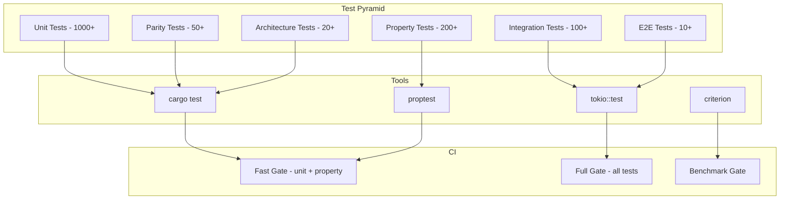

# 17 — Testing

**Version:** 1.0  
**Status:** Draft  
**Last Updated:** 2026-07-22  
**Related:** [12-Zero-Parity Engine](./12-zero-parity-engine.md), [16-Performance](./16-performance.md), [18-CI/CD](./18-ci-cd.md)

---

## 1. Overview

### Purpose

The testing strategy ensures **correctness, determinism, and architectural integrity** through a multi-layered test pyramid. Every layer tests different properties: units test logic, integration tests wiring, parity tests determinism, and architecture tests enforce boundaries.

### Test Pyramid

| Layer | Count | Speed | Purpose |
|-------|-------|-------|---------|
| **Unit** | ~1000+ | < 1ms each | Pure logic, no I/O |
| **Property** | ~200+ | < 10ms each | Invariants hold for all inputs |
| **Integration** | ~100+ | < 100ms each | Component wiring |
| **Parity** | ~50+ | < 1s each | Backtest = Live (same inputs) |
| **Architecture** | ~20+ | < 1s each | Dependency rules enforced |
| **E2E** | ~10+ | < 10s each | Full system behavior |
| **Benchmark** | ~20+ | < 30s each | Performance regression |

### Key Principles

| Principle | Implementation |
|-----------|----------------|
| **Deterministic** | No random, no time-dependent tests (use BacktestClock) |
| **Fast** | Unit tests < 1ms, full suite < 60s |
| **Isolated** | No shared state between tests |
| **Architecture guards** | Compile-time + test-time dependency checks |
| **Property-based** | proptest for invariants |

---

## 2. Requirements

### Functional

| ID | Requirement |
|----|-------------|
| FR-01 | Unit tests for all public functions |
| FR-02 | Property-based tests for core primitives |
| FR-03 | Integration tests for component wiring |
| FR-04 | Parity tests for zero-parity guarantee |
| FR-05 | Architecture tests for dependency rules |
| FR-06 | Contract tests for adapter plugins |
| FR-07 | Benchmark regression tests |
| FR-08 | Test utilities (fixtures, builders, mocks) |

### Non-Functional

| ID | Requirement | Target |
|----|-------------|--------|
| NFR-01 | Code coverage | ≥ 90% (line) |
| NFR-02 | Mutation score | ≥ 80% kill rate |
| NFR-03 | Full test suite time | < 60 seconds |
| NFR-04 | Flaky test rate | 0% |

---

## 3. Unit Tests

### Conventions

```rust
/// Unit test conventions:
/// 1. Located in same file as code (#[cfg(test)] module)
/// 2. Named: test_{function}_{scenario}_{expected}
/// 3. Pattern: Arrange → Act → Assert
/// 4. No I/O, no async, no external dependencies

#[cfg(test)]
mod tests {
    use super::*;

    #[test]
    fn test_position_apply_fill_increases_long() {
        // Arrange
        let mut pos = Position::new(
            Symbol::new("RELIANCE"),
            Side::Buy,
            Quantity(10),
            Price(100_0000),
        );

        let fill = Fill {
            side: Side::Buy,
            quantity: Quantity(5),
            price: Price(110_0000),
            ..Default::default()
        };

        // Act
        let realized = pos.apply_fill(&fill);

        // Assert
        assert_eq!(pos.quantity, Quantity(15));
        assert_eq!(realized, Money(0)); // No realized P&L (same direction)
        // Average price: (100*10 + 110*5) / 15 = 103.33
        assert!(pos.avg_price > Price(103_0000));
        assert!(pos.avg_price < Price(104_0000));
    }

    #[test]
    fn test_risk_check_rejects_oversized_order() {
        // Arrange
        let engine = RiskEngine::new(RiskConfig {
            max_order_quantity: Quantity(100),
            ..Default::default()
        });

        let order = Order {
            quantity: Quantity(200), // Exceeds limit
            ..Default::default()
        };

        // Act
        let result = engine.check_order(&order);

        // Assert
        assert!(!result.approved);
        assert_eq!(result.code, Some(RiskCode::OrderSizeExceeded));
    }
}
```

### Test Builders

```rust
/// Test builders for common types (in vendeta-core/src/testutil.rs)

/// Builder for test orders
pub struct OrderBuilder {
    order: Order,
}

impl OrderBuilder {
    pub fn new() -> Self {
        OrderBuilder {
            order: Order {
                id: OrderId::new("TEST-001"),
                symbol: Symbol::new("RELIANCE"),
                side: Side::Buy,
                quantity: Quantity(10),
                price: Some(Price(100_0000)),
                order_type: OrderType::Limit,
                status: OrderStatus::New,
                created_at: Timestamp::from_nanos(0),
                updated_at: Timestamp::from_nanos(0),
            },
        }
    }

    pub fn symbol(mut self, s: &str) -> Self {
        self.order.symbol = Symbol::new(s);
        self
    }

    pub fn side(mut self, s: Side) -> Self {
        self.order.side = s;
        self
    }

    pub fn quantity(mut self, q: u64) -> Self {
        self.order.quantity = Quantity(q);
        self
    }

    pub fn price(mut self, p: i64) -> Self {
        self.order.price = Some(Price(p));
        self
    }

    pub fn market_order(mut self) -> Self {
        self.order.order_type = OrderType::Market;
        self.order.price = None;
        self
    }

    pub fn build(self) -> Order {
        self.order
    }
}

/// Builder for test bars
pub fn test_bar(symbol: &str, close: i64, ts: i64) -> Bar {
    Bar {
        symbol: Symbol::new(symbol),
        timestamp: Timestamp::from_nanos(ts),
        open: Price(close - 1_0000),
        high: Price(close + 2_0000),
        low: Price(close - 2_0000),
        close: Price(close),
        volume: 1000,
    }
}
```

---

## 4. Property-Based Tests

### Using proptest

```rust
use proptest::prelude::*;

/// Arbitrary implementations for domain types
fn arb_price() -> impl Strategy<Value = Price> {
    (1i64..1_000_000_00).prop_map(Price)
}

fn arb_quantity() -> impl Strategy<Value = Quantity> {
    (1u64..100_000).prop_map(Quantity)
}

fn arb_side() -> impl Strategy<Value = Side> {
    prop_oneof![Just(Side::Buy), Just(Side::Sell)]
}

proptest! {
    /// Position P&L invariant:
    /// For a long position, if price goes up, unrealized P&L increases
    #[test]
    fn position_pnl_direction(
        entry in arb_price(),
        qty in arb_quantity(),
        delta in 1i64..100_000,
    ) {
        let mut pos = Position::new(Symbol::new("TEST"), Side::Buy, qty, entry);

        let price_up = Price(entry.0 + delta);
        let price_down = Price(entry.0 - delta);

        pos.mark_to_market(price_up);
        let pnl_up = pos.unrealized_pnl;

        pos.mark_to_market(price_down);
        let pnl_down = pos.unrealized_pnl;

        prop_assert!(pnl_up > pnl_down);
    }

    /// Risk engine invariant:
    /// If an order is approved with quantity Q, then Q-1 is also approved
    #[test]
    fn risk_monotonic_quantity(
        max_qty in 10u64..10000,
        order_qty in 1u64..10000,
    ) {
        let engine = RiskEngine::new(RiskConfig {
            max_order_quantity: Quantity(max_qty),
            ..Default::default()
        });

        let order_large = OrderBuilder::new().quantity(order_qty).build();
        let order_small = OrderBuilder::new().quantity(order_qty.saturating_sub(1)).build();

        let result_large = engine.check_order(&order_large);
        let result_small = engine.check_order(&order_small);

        // If large is approved, small must also be approved
        if result_large.approved {
            prop_assert!(result_small.approved);
        }
    }

    /// Bar aggregator invariant:
    /// high >= max(open, close) and low <= min(open, close)
    #[test]
    fn bar_ohlc_invariant(
        prices in prop::collection::vec(1000i64..100000, 2..50),
    ) {
        let mut agg = BarAggregator::new(Timeframe::Minute);
        let base = Timestamp::from_nanos(0);

        for (i, p) in prices.iter().enumerate() {
            let ts = base + (i as i64 * 1_000_000_000);
            if let Some(bar) = agg.process_tick(Price(*p), 1, ts) {
                prop_assert!(bar.high >= bar.open);
                prop_assert!(bar.high >= bar.close);
                prop_assert!(bar.low <= bar.open);
                prop_assert!(bar.low <= bar.close);
                prop_assert!(bar.high >= bar.low);
            }
        }
    }

    /// Fixed-point arithmetic invariant:
    /// Price multiplication is commutative with quantity
    #[test]
    fn price_mul_commutative(
        p in arb_price(),
        q in arb_quantity(),
    ) {
        let result = p.mul_qty(q);
        prop_assert_eq!(result, Money(p.0 * q.0 as i64));
    }
}
```

---

## 5. Integration Tests

### Component Wiring

```rust
/// Integration tests verify components work together.
/// Located in tests/ directory of each crate.

/// tests/execution_integration.rs
#[tokio::test]
async fn test_order_flow_end_to_end() {
    // Arrange: build full pipeline with paper adapter
    let config = TradingNodeConfig {
        node: NodeConfig {
            name: "test".into(),
            mode: TradingMode::Paper,
            initial_capital: 1_000_000_00,
        },
        adapter: AdapterSection {
            name: "paper".into(),
            ..Default::default()
        },
        ..Default::default()
    };

    let registry = build_test_registry();
    let factory = ComponentFactory::new(registry);
    let mut node = factory.build_node(&config).unwrap();

    // Act: submit an order
    node.start().await.unwrap();
    let order = OrderBuilder::new()
        .symbol("RELIANCE")
        .quantity(10)
        .market_order()
        .build();
    node.submit_order(order).await.unwrap();

    // Wait for fill
    tokio::time::sleep(Duration::from_millis(100)).await;

    // Assert: position updated
    let portfolio = node.portfolio_state();
    let position = portfolio.get_position(&Symbol::new("RELIANCE"));
    assert!(position.is_some());
    assert_eq!(position.unwrap().quantity, Quantity(10));

    node.stop().await.unwrap();
}
```

### Message Bus Integration

```rust
/// tests/bus_integration.rs
#[test]
fn test_pub_sub_delivery() {
    let bus = MessageBus::new(1024);
    let mut received = Vec::new();

    // Subscribe
    let rx = bus.subscribe_market_events();

    // Publish
    let quote = Quote::default();
    bus.publish_market_event(MarketEvent::Quote(quote));

    // Receive
    if let Ok(event) = rx.try_recv() {
        received.push(event);
    }

    assert_eq!(received.len(), 1);
}
```

---

## 6. Parity Tests

### Structure

```rust
/// Parity tests verify the zero-parity guarantee.
/// Located in tests/parity/ directory.

/// tests/parity/golden_replay.rs
#[test]
fn test_golden_replay_sma_crossover() {
    // Load golden dataset
    let golden: GoldenDataset = serde_json::from_str(
        &std::fs::read_to_string("tests/golden/sma_crossover_reliance_1h.json").unwrap()
    ).unwrap();

    // Run backtest
    let config = BacktestConfig {
        symbols: vec![Symbol::new("RELIANCE")],
        timeframe: Timeframe::Hour,
        start: golden.start,
        end: golden.end,
        initial_capital: Money(1_000_000_00),
        slippage: SlippageConfig::None,
        commission: CommissionConfig::Zero,
        risk: RiskConfig::default(),
    };

    let bars: Vec<Bar> = golden.events.iter()
        .filter_map(|e| e.as_bar())
        .collect();

    let mut engine = BacktestEngine::new(&config);
    let result = engine.run(&mut SmaCrossover::from_config(&golden.strategy_config), bars);

    // Assert: exact match with golden expected results
    assert_eq!(result.trades.len(), golden.expected_fills.len());
    for (actual, expected) in result.trades.iter().zip(&golden.expected_fills) {
        assert_eq!(actual.price, expected.price, "Price mismatch");
        assert_eq!(actual.quantity, expected.quantity, "Quantity mismatch");
        assert_eq!(actual.side, expected.side, "Side mismatch");
    }
}

/// Determinism test: run twice, compare bit-exact
#[test]
fn test_determinism_multiple_runs() {
    let bars = generate_deterministic_bars(10_000);
    let config = BacktestConfig::default();

    let results: Vec<BacktestResult> = (0..3).map(|_| {
        let mut engine = BacktestEngine::new(&config);
        engine.run(&mut TestStrategy::default(), bars.clone())
    }).collect();

    // All runs must produce identical equity curves
    for i in 1..results.len() {
        assert_eq!(
            results[0].equity_curve.len(),
            results[i].equity_curve.len(),
            "Run {} produced different number of equity points", i
        );
        for (j, (a, b)) in results[0].equity_curve.iter()
            .zip(results[i].equity_curve.iter())
            .enumerate()
        {
            assert_eq!(a.1, b.1, "Equity mismatch at bar {} in run {}", j, i);
        }
    }
}
```

---

## 7. Architecture Tests

### Dependency Rules

```rust
/// Architecture tests enforce crate dependency rules.
/// Located in vendeta-arch/tests/.

/// tests/dependency_rules.rs

/// Rule: vendeta-core must not depend on any other vendeta crate
#[test]
fn core_has_no_internal_deps() {
    let cargo_toml = std::fs::read_to_string("crates/vendeta-core/Cargo.toml").unwrap();
    assert!(!cargo_toml.contains("vendeta-bus"));
    assert!(!cargo_toml.contains("vendeta-engine"));
    assert!(!cargo_toml.contains("vendeta-gateway"));
}

/// Rule: strategies must not depend on adapters
#[test]
fn strategies_dont_depend_on_adapters() {
    let cargo_toml = std::fs::read_to_string("crates/vendeta-engine/Cargo.toml").unwrap();
    assert!(!cargo_toml.contains("vendeta-adapters"));
}

/// Rule: no circular dependencies
#[test]
fn no_circular_dependencies() {
    // Parse all Cargo.toml files and build dependency graph
    let graph = build_crate_dependency_graph();
    let cycles = find_cycles(&graph);
    assert!(cycles.is_empty(), "Circular dependencies found: {:?}", cycles);
}

/// Rule: no SystemTime in strategy code
#[test]
fn no_system_time_in_strategies() {
    let entries = glob::glob("crates/vendeta-engine/src/**/*.rs").unwrap();
    for entry in entries {
        let path = entry.unwrap();
        let content = std::fs::read_to_string(&path).unwrap();
        assert!(
            !content.contains("SystemTime::now()"),
            "Found SystemTime::now() in {:?}. Use Clock trait instead.",
            path
        );
    }
}

/// Rule: no unwrap() in hot path (production code)
#[test]
fn no_unwrap_in_hot_path() {
    let hot_path_files = [
        "crates/vendeta-bus/src/lib.rs",
        "crates/vendeta-core/src/primitives.rs",
    ];

    for file in &hot_path_files {
        let content = std::fs::read_to_string(file).unwrap();
        // Allow unwrap in tests
        let non_test_content = content.split("#[cfg(test)]").next().unwrap();
        assert!(
            !non_test_content.contains(".unwrap()"),
            "Found .unwrap() in hot path file: {}", file
        );
    }
}
```

---

## 8. Contract Tests

### Adapter Contracts

```rust
/// Contract tests verify adapter implementations satisfy the BrokerGateway trait.
/// Run against paper adapter (always) and real brokers (with credentials).

/// tests/contract/gateway_contract.rs
pub fn gateway_contract_suite(gateway: Arc<dyn BrokerGateway>) {
    // Contract 1: broker_id is non-empty
    assert!(!gateway.broker_id().is_empty());

    // Contract 2: capabilities are valid
    let caps = gateway.capabilities();
    assert!(!caps.supported_exchanges.is_empty());
    assert!(!caps.supported_order_types.is_empty());
    assert!(caps.rate_limit_per_second > 0);
    assert!(caps.max_order_size > 0);

    // Contract 3: connection_status returns valid state
    let status = gateway.connection_status();
    assert!(matches!(status,
        ConnectionStatus::Disconnected |
        ConnectionStatus::Connecting |
        ConnectionStatus::Connected |
        ConnectionStatus::Reconnecting |
        ConnectionStatus::Error
    ));
}

/// Contract test for paper adapter (always runs)
#[test]
fn paper_gateway_satisfies_contract() {
    let gateway = Arc::new(PaperGateway::new(PaperConfig::default()));
    gateway_contract_suite(gateway);
}

/// Contract test for Dhan adapter (requires credentials)
#[test]
#[ignore = "requires DHAN_CLIENT_ID and DHAN_ACCESS_TOKEN"]
fn dhan_gateway_satisfies_contract() {
    let gateway = Arc::new(DhanGateway::new(DhanConfig::from_env()));
    gateway_contract_suite(gateway);
}
```

---

## 9. Test Utilities

### Fixtures

```rust
/// tests/fixtures/mod.rs

/// Generate deterministic bars for testing
pub fn generate_deterministic_bars(count: usize) -> Vec<Bar> {
    let mut bars = Vec::with_capacity(count);
    let mut price = 100_0000i64; // ₹100.00

    for i in 0..count {
        // Deterministic pseudo-random walk (seeded)
        let delta = ((i * 7 + 13) % 20) as i64 - 10; // -10 to +9
        price += delta * 100; // Move by delta paise

        bars.push(Bar {
            symbol: Symbol::new("TEST"),
            timestamp: Timestamp::from_nanos(i as i64 * 60_000_000_000),
            open: Price(price),
            high: Price(price + 5_0000),
            low: Price(price - 5_0000),
            close: Price(price + delta * 50),
            volume: 1000 + (i % 100) as u64,
        });
    }

    bars
}

/// Create a test TradingNodeConfig
pub fn test_config() -> TradingNodeConfig {
    TradingNodeConfig {
        node: NodeConfig {
            name: "test-node".into(),
            mode: TradingMode::Paper,
            initial_capital: 1_000_000_00,
        },
        adapter: AdapterSection {
            name: "paper".into(),
            config: HashMap::new(),
            reconnect: ReconnectConfig::default(),
        },
        strategies: vec![],
        risk: RiskSection::default(),
        data: DataSection::default(),
        observability: ObservabilitySection::default(),
        backtest: None,
        plugins: PluginsSection::default(),
    }
}
```

---

## 10. Data Flow



---

## 11. Configuration

```toml
# Cargo.toml — test configuration

[dev-dependencies]
proptest = "1"
criterion = "0.5"
tempfile = "3"
tokio = { version = "1", features = ["full", "test-util"] }

[[bench]]
name = "hot_path"
harness = false

[[test]]
name = "parity"
path = "tests/parity/mod.rs"

[[test]]
name = "architecture"
path = "tests/architecture/mod.rs"
```

### Test Execution Commands

```bash
# Run all unit tests
cargo test --workspace

# Run only fast tests (unit + property)
cargo test --workspace --lib

# Run integration tests
cargo test --workspace --test '*'

# Run parity tests
cargo test --test parity

# Run architecture tests
cargo test --test architecture

# Run benchmarks
cargo bench

# Run with coverage
cargo llvm-cov --workspace

# Run contract tests (requires credentials)
cargo test --test contract -- --ignored
```

---

## 12. Error Handling in Tests

```rust
/// Tests should panic with clear messages on failure.
/// Use assert! with custom messages for domain-specific assertions.

/// Helper: assert money equality with tolerance message
fn assert_money_eq(actual: Money, expected: Money, context: &str) {
    assert_eq!(
        actual, expected,
        "{}: expected ₹{:.2}, got ₹{:.2}",
        context,
        expected.to_f64(),
        actual.to_f64()
    );
}

/// Helper: assert order status transition is valid
fn assert_valid_transition(from: OrderStatus, to: OrderStatus) {
    assert!(
        from.can_transition_to(to),
        "Invalid order status transition: {:?} → {:?}",
        from, to
    );
}
```

---

## 13. Testing Requirements Summary

### Coverage Targets

| Crate | Line Coverage | Branch Coverage |
|-------|--------------|-----------------|
| vendeta-core | ≥ 95% | ≥ 90% |
| vendeta-bus | ≥ 95% | ≥ 90% |
| vendeta-engine | ≥ 90% | ≥ 85% |
| vendeta-gateway | ≥ 85% | ≥ 80% |
| vendeta-adapters/* | ≥ 80% | ≥ 75% |
| vendeta-config | ≥ 90% | ≥ 85% |

### Mutation Testing

```bash
# Run cargo-mutants for mutation testing
cargo mutants --workspace -- --lib

# Target: ≥ 80% mutation kill rate
# Focus on: vendeta-core, vendeta-engine (critical logic)
```

---

## 14. Implementation Notes

### Patterns

1. **Test data builders**: Fluent builders for complex types (Order, Position, Bar).
2. **Deterministic seeds**: All "random" test data uses fixed seeds.
3. **Golden files**: Expected outputs stored as JSON in `tests/golden/`.
4. **Parallel-safe**: Tests don't share files, ports, or global state.
5. **Fast feedback**: `cargo test --lib` runs in < 10s for developer iteration.

### Gotchas

- **No `tokio::time::sleep` in unit tests**: Use `tokio::time::pause()` for time-dependent tests.
- **No network in tests**: All adapter tests use PaperGateway or mocked HTTP.
- **Temp directories**: Use `tempfile::tempdir()` for file-based tests. Auto-cleaned.
- **Test isolation**: Each test creates its own MessageBus, Portfolio, etc. No shared state.
- **Proptest shrinking**: When proptest fails, it shrinks to minimal failing case. Save these as regression tests.

---

## 15. Cross-References

| Document | Relevance |
|----------|-----------|
| [12-Zero-Parity Engine](./12-zero-parity-engine.md) | Parity test design |
| [16-Performance](./16-performance.md) | Benchmark tests |
| [18-CI/CD](./18-ci-cd.md) | Test gates in pipeline |
| [08-Adapter System](./08-adapter-system.md) | Contract tests |
| [02-Architecture](./02-architecture-overview.md) | Architecture test rules |
| [03-Project Structure](./03-project-structure.md) | Test file locations |
