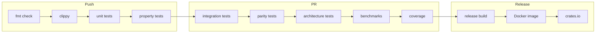
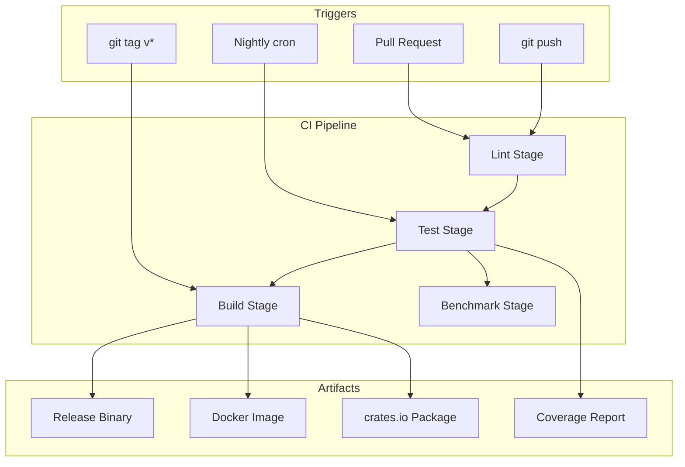

# 18 — CI/CD

**Version:** 1.0  
**Status:** Draft  
**Last Updated:** 2026-07-22  
**Related:** [17-Testing](./17-testing.md), [16-Performance](./16-performance.md), [21-Versioning](./21-versioning.md)

---

## 1. Overview

### Purpose

The CI/CD pipeline automates **quality gates, testing, building, and releasing**. Every push triggers lint + test. Every PR triggers the full suite. Every tag triggers a release build.

### Pipeline Philosophy

| Principle | Implementation |
|-----------|----------------|
| **Fail fast** | Lint and unit tests run first (< 2 min) |
| **Gate everything** | No merge without green CI |
| **Reproducible builds** | Pinned toolchain, locked dependencies |
| **Automated releases** | Tag → build → publish (no manual steps) |
| **Nightly checks** | Extended tests, benchmarks, dependency audit |

---

## 2. Requirements

### Functional

| ID | Requirement |
|----|-------------|
| FR-01 | Run clippy + fmt on every push |
| FR-02 | Run unit + property tests on every push |
| FR-03 | Run integration + parity tests on PRs |
| FR-04 | Run architecture tests on PRs |
| FR-05 | Run benchmarks on PRs (regression check) |
| FR-06 | Build release binary on tags |
| FR-07 | Publish to crates.io on release tags |
| FR-08 | Nightly: full test suite + dependency audit |
| FR-09 | Generate coverage report |
| FR-10 | Build Docker image on release |

### Non-Functional

| ID | Requirement | Target |
|----|-------------|--------|
| NFR-01 | Fast feedback (lint + unit) | < 3 minutes |
| NFR-02 | Full PR pipeline | < 10 minutes |
| NFR-03 | Release pipeline | < 15 minutes |
| NFR-04 | Zero flaky tests | Deterministic CI |

---

## 3. Pipeline Stages

### Stage Overview



---

## 4. GitHub Actions Workflow

### Main CI (ci.yml)

```yaml
# .github/workflows/ci.yml
name: CI

on:
  push:
    branches: [main, develop]
  pull_request:
    branches: [main]

env:
  CARGO_TERM_COLOR: always
  RUSTFLAGS: "-Dwarnings"

jobs:
  # === Stage 1: Fast Checks (< 2 min) ===
  lint:
    name: Lint
    runs-on: ubuntu-latest
    steps:
      - uses: actions/checkout@v4
      - uses: dtolnay/rust-toolchain@stable
        with:
          components: rustfmt, clippy
      - uses: Swatinem/rust-cache@v2

      - name: Check formatting
        run: cargo fmt --all -- --check

      - name: Clippy
        run: cargo clippy --workspace --all-targets -- -D warnings

  # === Stage 2: Unit Tests (< 3 min) ===
  test-fast:
    name: Unit + Property Tests
    runs-on: ubuntu-latest
    needs: lint
    steps:
      - uses: actions/checkout@v4
      - uses: dtolnay/rust-toolchain@stable
      - uses: Swatinem/rust-cache@v2

      - name: Run unit tests
        run: cargo test --workspace --lib -- --nocapture

      - name: Run property tests
        run: cargo test --workspace --lib -- proptest --nocapture

  # === Stage 3: Integration Tests (PR only) ===
  test-integration:
    name: Integration Tests
    runs-on: ubuntu-latest
    needs: test-fast
    if: github.event_name == 'pull_request'
    steps:
      - uses: actions/checkout@v4
      - uses: dtolnay/rust-toolchain@stable
      - uses: Swatinem/rust-cache@v2

      - name: Run integration tests
        run: cargo test --workspace --test '*'

      - name: Run parity tests
        run: cargo test --test parity

      - name: Run architecture tests
        run: cargo test --test architecture

  # === Stage 4: Coverage ===
  coverage:
    name: Coverage
    runs-on: ubuntu-latest
    needs: test-fast
    if: github.event_name == 'pull_request'
    steps:
      - uses: actions/checkout@v4
      - uses: dtolnay/rust-toolchain@stable
        with:
          components: llvm-tools-preview
      - uses: Swatinem/rust-cache@v2
      - uses: taiki-e/install-action@cargo-llvm-cov

      - name: Generate coverage
        run: cargo llvm-cov --workspace --lcov --output-path lcov.info

      - name: Upload to Codecov
        uses: codecov/codecov-action@v4
        with:
          files: lcov.info
          fail_ci_if_error: false

  # === Stage 5: Benchmarks (PR only) ===
  benchmark:
    name: Benchmarks
    runs-on: ubuntu-latest
    needs: test-integration
    if: github.event_name == 'pull_request'
    steps:
      - uses: actions/checkout@v4
      - uses: dtolnay/rust-toolchain@stable
      - uses: Swatinem/rust-cache@v2

      - name: Run benchmarks
        run: cargo bench -- --output-format bencher | tee bench_output.txt

      - name: Check regression
        run: |
          # Compare against baseline (stored in repo)
          python scripts/check_benchmark_regression.py bench_output.txt benches/baseline.txt

  # === Stage 6: Build check ===
  build:
    name: Build
    runs-on: ubuntu-latest
    needs: test-fast
    steps:
      - uses: actions/checkout@v4
      - uses: dtolnay/rust-toolchain@stable
      - uses: Swatinem/rust-cache@v2

      - name: Build release
        run: cargo build --release --workspace

      - name: Check binary size
        run: |
          SIZE=$(stat -f%z target/release/vendeta 2>/dev/null || stat -c%s target/release/vendeta)
          echo "Binary size: $SIZE bytes"
          if [ "$SIZE" -gt 52428800 ]; then
            echo "ERROR: Binary exceeds 50MB limit"
            exit 1
          fi
```

### Release Workflow (release.yml)

```yaml
# .github/workflows/release.yml
name: Release

on:
  push:
    tags:
      - 'v*'

jobs:
  release:
    name: Release Build
    runs-on: ubuntu-latest
    steps:
      - uses: actions/checkout@v4
      - uses: dtolnay/rust-toolchain@stable
      - uses: Swatinem/rust-cache@v2

      - name: Verify version matches tag
        run: |
          TAG_VERSION=${GITHUB_REF#refs/tags/v}
          CARGO_VERSION=$(grep '^version' Cargo.toml | head -1 | sed 's/.*"\(.*\)".*/\1/')
          if [ "$TAG_VERSION" != "$CARGO_VERSION" ]; then
            echo "ERROR: Tag v$TAG_VERSION != Cargo.toml version $CARGO_VERSION"
            exit 1
          fi

      - name: Run full test suite
        run: cargo test --workspace

      - name: Build release binary
        run: cargo build --release --workspace

      - name: Create GitHub Release
        uses: softprops/action-gh-release@v2
        with:
          generate_release_notes: true
          files: |
            target/release/vendeta

      - name: Publish to crates.io
        run: |
          cargo publish -p vendeta-core --token ${CRATES_TOKEN}
          cargo publish -p vendeta-bus --token ${CRATES_TOKEN}
          cargo publish -p vendeta-engine --token ${CRATES_TOKEN}
          # ... publish in dependency order
        env:
          CRATES_TOKEN: ${{ secrets.CRATES_IO_TOKEN }}

  docker:
    name: Docker Image
    runs-on: ubuntu-latest
    needs: release
    steps:
      - uses: actions/checkout@v4

      - name: Build Docker image
        run: |
          VERSION=${GITHUB_REF#refs/tags/v}
          docker build -t vendeta:latest -t vendeta:$VERSION .

      - name: Push to registry
        run: |
          echo "${{ secrets.DOCKER_PASSWORD }}" | docker login -u "${{ secrets.DOCKER_USERNAME }}" --password-stdin
          docker push vendeta:latest
          docker push vendeta:${GITHUB_REF#refs/tags/v}
```

### Nightly Workflow (nightly.yml)

```yaml
# .github/workflows/nightly.yml
name: Nightly

on:
  schedule:
    - cron: '0 2 * * *'  # 2 AM UTC daily

jobs:
  full-suite:
    name: Full Test Suite
    runs-on: ubuntu-latest
    steps:
      - uses: actions/checkout@v4
      - uses: dtolnay/rust-toolchain@stable
      - uses: Swatinem/rust-cache@v2

      - name: Full test suite
        run: cargo test --workspace --all-targets

      - name: Dependency audit
        run: |
          cargo install cargo-audit
          cargo audit

      - name: Outdated dependencies
        run: |
          cargo install cargo-outdated
          cargo outdated --exit-code 1 || true

      - name: Full benchmarks
        run: cargo bench -- --save-baseline nightly

      - name: Doc build
        run: cargo doc --workspace --no-deps

  msrv:
    name: MSRV Check
    runs-on: ubuntu-latest
    steps:
      - uses: actions/checkout@v4
      - uses: dtolnay/rust-toolchain@1.75.0  # MSRV
      - name: Build with MSRV
        run: cargo build --workspace
```

---

## 5. Quality Gates

### Merge Requirements

| Gate | Required | Blocks Merge |
|------|----------|--------------|
| `cargo fmt --check` | Yes | Yes |
| `cargo clippy -D warnings` | Yes | Yes |
| Unit tests pass | Yes | Yes |
| Property tests pass | Yes | Yes |
| Integration tests pass | Yes (PR) | Yes |
| Parity tests pass | Yes (PR) | Yes |
| Architecture tests pass | Yes (PR) | Yes |
| Coverage ≥ 90% | Yes (PR) | Yes |
| Benchmark regression < 20% | Yes (PR) | Warning |
| Binary size < 50MB | Yes | Yes |

### Branch Protection

```
main:
  - Require PR before merge
  - Require CI pass
  - Require 1 approval
  - No force push
  - No deletion
```

---

## 6. Docker Build

### Multi-Stage Dockerfile

```dockerfile
# Dockerfile
FROM rust:1.78-slim AS builder
WORKDIR /build
COPY Cargo.toml Cargo.lock ./
COPY crates/ crates/
RUN cargo build --release --bin vendeta

FROM debian:bookworm-slim AS runtime
RUN apt-get update && apt-get install -y ca-certificates && rm -rf /var/lib/apt/lists/*
COPY --from=builder /build/target/release/vendeta /usr/local/bin/vendeta
COPY config/ /etc/vendeta/

# Non-root user
RUN useradd -m -r trader
USER trader

ENTRYPOINT ["vendeta"]
CMD ["run", "--config", "/etc/vendeta/vendeta.yaml"]
```

---

## 7. Data Flow



---

## 8. Configuration

### rust-toolchain.toml

```toml
# rust-toolchain.toml — pin Rust version for reproducibility
[toolchain]
channel = "1.78"
components = ["rustfmt", "clippy", "llvm-tools-preview"]
```

### deny.toml (cargo-deny)

```toml
# deny.toml — dependency policy
[bans]
multiple-versions = "warn"
wildcards = "deny"

[licenses]
unlicensed = "deny"
allow = ["MIT", "Apache-2.0", "BSD-2-Clause", "BSD-3-Clause", "ISC", "Unicode-DFS-2016"]

[advisories]
vulnerability = "deny"
unmaintained = "warn"
```

---

## 9. Error Handling

### CI Failure Recovery

| Failure | Action |
|---------|--------|
| Lint failure | Developer fixes locally, pushes again |
| Test failure | Developer fixes, CI re-runs |
| Flaky test | Investigate root cause (no retries) |
| Benchmark regression | Review required, can override with label |
| Build failure | Block release, investigate |
| Publish failure | Retry once, then manual intervention |

---

## 10. Testing Requirements

### CI Self-Tests

| Test | Description |
|------|-------------|
| `test_workflow_syntax` | Validate YAML syntax of all workflows |
| `test_dockerfile_builds` | Docker build succeeds |
| `test_release_version_match` | Tag matches Cargo.toml version |
| `test_msrv_compiles` | Minimum supported Rust version builds |

---

## 11. Implementation Notes

### Patterns

1. **Cache aggressively**: `Swatinem/rust-cache` caches target/ and registry.
2. **Parallel jobs**: Lint, test, build run as separate jobs (parallel on GitHub).
3. **Fail fast**: `needs:` ensures later stages only run if earlier ones pass.
4. **Pinned toolchain**: `rust-toolchain.toml` ensures all developers and CI use same Rust.
5. **No secrets in code**: All credentials via GitHub Secrets.

### Gotchas

- **Cargo.lock must be committed**: Ensures reproducible builds.
- **Feature unification**: Test with `--workspace` to catch feature conflicts.
- **Cross-compilation**: Future: build for aarch64 (ARM) for Raspberry Pi traders.
- **Benchmark noise**: GitHub runners have variable performance. Use 20% threshold.
- **Docker layer caching**: Copy Cargo.toml first for better layer caching.

---

## 12. Cross-References

| Document | Relevance |
|----------|-----------|
| [17-Testing](./17-testing.md) | Tests run in CI |
| [16-Performance](./16-performance.md) | Benchmark regression gate |
| [21-Versioning](./21-versioning.md) | Release tags trigger pipeline |
| [19-Developer Experience](./19-developer-experience.md) | Local CI commands |
| [03-Project Structure](./03-project-structure.md) | Workspace build |
| [13-Observability](./13-observability.md) | CI metrics |
