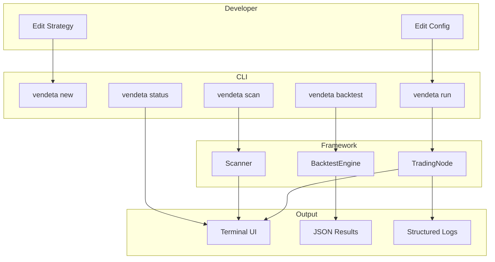

# 19 — Developer Experience

**Version:** 1.0  
**Status:** Draft  
**Last Updated:** 2026-07-22  
**Related:** [15-Configuration](./15-configuration.md), [18-CI/CD](./18-ci-cd.md), [07-Strategy System](./07-strategy-system.md)

---

## 1. Overview

### Purpose

Developer Experience (DX) ensures that **writing strategies, running backtests, and deploying live trading** is intuitive, fast, and well-supported. The CLI is the primary interface. Error messages are actionable. Onboarding takes minutes, not hours.

### DX Principles

| Principle | Implementation |
|-----------|----------------|
| **One command to start** | `vendeta run` starts everything |
| **Actionable errors** | Every error says what to do next |
| **Fast iteration** | Hot-reload config, quick backtest |
| **Discoverable** | `vendeta --help` at every level |
| **Zero config start** | Sensible defaults, paper mode |

---

## 2. Requirements

### Functional

| ID | Requirement |
|----|-------------|
| FR-01 | CLI with subcommands (run, backtest, scan, configure) |
| FR-02 | Interactive configuration wizard |
| FR-03 | Clear error messages with suggestions |
| FR-04 | Makefile for common development tasks |
| FR-05 | Template strategy generator |
| FR-06 | Live status display (TUI) |
| FR-07 | Backtest result visualization |
| FR-08 | Log tailing with filtering |

### Non-Functional

| ID | Requirement | Target |
|----|-------------|--------|
| NFR-01 | Time to first backtest | < 5 minutes |
| NFR-02 | CLI startup time | < 100ms |
| NFR-03 | Error message quality | Actionable, with fix suggestion |

---

## 3. CLI Commands

### Command Tree

```
vendeta
├── run              # Start trading (live/paper)
│   ├── --config     # Config file path
│   ├── --mode       # live | paper
│   └── --strategy   # Override strategy
├── backtest         # Run backtest
│   ├── --config     # Config file path
│   ├── --start      # Start date
│   ├── --end        # End date
│   ├── --symbol     # Symbol(s)
│   └── --output     # Results output path
├── scan             # Run market scanner
│   ├── --scanner    # Scanner name
│   ├── --universe   # Symbol universe
│   └── --limit      # Max results
├── configure        # Interactive configuration
│   ├── --adapter    # Configure adapter
│   ├── --risk       # Configure risk limits
│   └── --strategy   # Configure strategy
├── status           # Show node status
├── logs             # Tail logs
│   ├── --level      # Filter by level
│   ├── --component  # Filter by component
│   └── --follow     # Follow mode
├── new              # Generate new strategy/adapter
│   ├── strategy     # New strategy template
│   └── adapter      # New adapter template
├── data             # Data management
│   ├── sync         # Sync historical data
│   ├── check        # Check data quality
│   └── export       # Export data
└── version          # Show version info
```

### CLI Implementation

```rust
/// CLI entry point using clap
use clap::{Parser, Subcommand};

#[derive(Parser)]
#[command(name = "vendeta", version, about = "Vendeta Trading Framework")]
pub struct Cli {
    #[command(subcommand)]
    pub command: Commands,

    /// Verbose output
    #[arg(short, long, global = true)]
    pub verbose: bool,

    /// Config file path
    #[arg(short, long, global = true, default_value = "config/vendeta.yaml")]
    pub config: PathBuf,
}

#[derive(Subcommand)]
pub enum Commands {
    /// Start trading (live or paper)
    Run {
        /// Trading mode
        #[arg(short, long, default_value = "paper")]
        mode: String,

        /// Strategy to run (overrides config)
        #[arg(short, long)]
        strategy: Option<String>,
    },

    /// Run a backtest
    Backtest {
        /// Start date (YYYY-MM-DD)
        #[arg(short, long)]
        start: Option<String>,

        /// End date (YYYY-MM-DD)
        #[arg(short, long)]
        end: Option<String>,

        /// Symbols to trade
        #[arg(short, long)]
        symbol: Vec<String>,

        /// Output file for results
        #[arg(short, long, default_value = "backtest_result.json")]
        output: PathBuf,
    },

    /// Run market scanner
    Scan {
        /// Scanner name
        #[arg(short, long, default_value = "high_volume_breakout")]
        scanner: String,

        /// Maximum results
        #[arg(short, long, default_value = "20")]
        limit: usize,
    },

    /// Interactive configuration wizard
    Configure {
        /// What to configure
        #[arg(subcommand)]
        target: Option<ConfigureTarget>,
    },

    /// Show node status
    Status,

    /// Tail logs
    Logs {
        /// Log level filter
        #[arg(short, long, default_value = "info")]
        level: String,

        /// Component filter
        #[arg(short, long)]
        component: Option<String>,

        /// Follow mode
        #[arg(short, long)]
        follow: bool,
    },

    /// Generate new strategy or adapter
    New {
        #[arg(subcommand)]
        kind: NewKind,
    },

    /// Data management
    Data {
        #[arg(subcommand)]
        action: DataAction,
    },

    /// Show version information
    Version,
}

#[derive(Subcommand)]
pub enum ConfigureTarget {
    Adapter,
    Risk,
    Strategy,
}

#[derive(Subcommand)]
pub enum NewKind {
    /// Generate a new strategy
    Strategy {
        /// Strategy name
        name: String,
    },
    /// Generate a new adapter
    Adapter {
        /// Adapter name
        name: String,
    },
}

#[derive(Subcommand)]
pub enum DataAction {
    /// Sync historical data from broker
    Sync {
        #[arg(short, long)]
        symbol: Vec<String>,
        #[arg(short, long)]
        timeframe: Option<String>,
    },
    /// Check data quality
    Check,
    /// Export data
    Export {
        #[arg(short, long)]
        symbol: String,
        #[arg(short, long)]
        format: Option<String>,
    },
}
```

---

## 4. Error Messages

### Design Principles

```
ERROR FORMAT:
  {what went wrong}
  {why it matters}
  {what to do about it}
```

### Examples

```rust
/// Error message examples:

// Missing config file
"ERROR: Config file not found: config/vendeta.yaml

  The configuration file is required to start the trading node.

  To fix:
    1. Run 'vendeta configure' to create a config interactively
    2. Or copy the example: cp config/example.yaml config/vendeta.yaml
    3. Or specify a path: vendeta run --config /path/to/config.yaml"

// Missing environment variable
"ERROR: Missing environment variable: DHAN_CLIENT_ID

  The Dhan adapter requires authentication credentials.

  To fix:
    1. Get your client ID from https://dhan.co → API section
    2. Set the environment variable:
       export DHAN_CLIENT_ID=your_client_id
    3. Or add to .env file:
       echo 'DHAN_CLIENT_ID=your_client_id' >> .env"

// Risk limit exceeded
"ERROR: Order rejected by risk engine: position limit exceeded

  Order for 200 RELIANCE would create position of 250 shares,
  exceeding the configured maximum of 200 shares.

  Current position: 50 RELIANCE (long)
  Order quantity: 200
  Projected: 250 > max 200

  To fix:
    - Reduce order quantity to 150 or less
    - Or increase limit in config: risk.max_position_quantity"

// Backtest no data
"ERROR: No historical data for RELIANCE from 2024-01-01 to 2024-06-30

  The backtest requires historical bar data, but none was found
  in the data directory (./data/parquet/RELIANCE/).

  To fix:
    1. Sync data first: vendeta data sync --symbol RELIANCE --timeframe 5m
    2. Or specify a different date range where data exists
    3. Check data availability: vendeta data check"
```

---

## 5. Makefile

```makefile
# Makefile — common development tasks

.PHONY: build test lint fmt clippy bench run backtest clean doc

## Build
build:
	cargo build --workspace

build-release:
	cargo build --release --workspace

## Testing
test:
	cargo test --workspace

test-fast:
	cargo test --workspace --lib

test-integration:
	cargo test --workspace --test '*'

test-parity:
	cargo test --test parity

test-arch:
	cargo test --test architecture

## Quality
lint: fmt-check clippy

fmt:
	cargo fmt --all

fmt-check:
	cargo fmt --all -- --check

clippy:
	cargo clippy --workspace --all-targets -- -D warnings

## Benchmarks
bench:
	cargo bench

bench-save:
	cargo bench -- --save-baseline current

bench-compare:
	cargo bench -- --baseline current

## Running
run:
	cargo run -- run --config config/vendeta.yaml

run-paper:
	cargo run -- run --config config/vendeta.yaml --mode paper

backtest:
	cargo run -- backtest --config config/backtest.yaml

scan:
	cargo run -- scan

## Data
data-sync:
	cargo run -- data sync

data-check:
	cargo run -- data check

## Documentation
doc:
	cargo doc --workspace --no-deps --open

## Development
clean:
	cargo clean

coverage:
	cargo llvm-cov --workspace --html

## Setup
setup:
	rustup component add rustfmt clippy llvm-tools-preview
	cargo install cargo-llvm-cov cargo-audit cargo-outdated
	@echo "Development environment ready!"

## Help
help:
	@echo "Available targets:"
	@grep -E '^## ' Makefile | sed 's/## /  /'
```

---

## 6. Strategy Template Generator

### `vendeta new strategy`

```rust
/// Generate a new strategy from template
pub fn generate_strategy(name: &str) -> Result<(), CliError> {
    let dir = PathBuf::from(format!("strategies/{}", name));
    std::fs::create_dir_all(&dir)?;

    let strategy_code = format!(r#"//! {name} strategy
//!
//! Generated by `vendeta new strategy {name}`

use vendeta_engine::{{Strategy, StrategyContext, Signal, SignalAction}};
use vendeta_core::{{Bar, Symbol, Quantity}};

pub struct {pascal_name} {{
    symbol: Symbol,
    quantity: Quantity,
}}

impl {pascal_name} {{
    pub fn new(symbol: &str, quantity: u64) -> Self {{
        {pascal_name} {{
            symbol: Symbol::new(symbol),
            quantity: Quantity(quantity),
        }}
    }}
}}

impl Strategy for {pascal_name} {{
    fn name(&self) -> &str {{
        "{name}"
    }}

    fn init(&mut self, ctx: &mut StrategyContext) {{
        ctx.log().info("Initializing {name} strategy");
        // TODO: Subscribe to symbols, load indicators
    }}

    fn on_bar(&mut self, bar: &Bar, ctx: &mut StrategyContext) {{
        if bar.symbol != self.symbol {{
            return;
        }}

        // TODO: Implement your strategy logic here
        // Example:
        // if should_buy {{
        //     ctx.signal(Signal::new(
        //         self.symbol.clone(),
        //         SignalAction::EnterLong,
        //         self.quantity,
        //         "buy reason",
        //     ));
        // }}
    }}

    fn shutdown(&mut self, ctx: &mut StrategyContext) {{
        ctx.log().info("{name} strategy shutting down");
    }}
}}
"#, name = name, pascal_name = to_pascal_case(name));

    std::fs::write(dir.join("mod.rs"), strategy_code)?;

    println!("Created strategy: {}", dir.display());
    println!("\nNext steps:");
    println!("  1. Edit {}/mod.rs to implement your logic", dir.display());
    println!("  2. Register in config/vendeta.yaml under strategies:");
    println!("     - name: \"{}\"", name);
    println!("  3. Run: vendeta backtest --strategy {}", name);

    Ok(())
}
```

---

## 7. Status Display

### `vendeta status`

```
┌─────────────────────────────────────────────────────────┐
│  VENDETA NODE: my-trading-node                          │
│  Mode: PAPER | Uptime: 2h 15m | Status: RUNNING        │
├─────────────────────────────────────────────────────────┤
│  ADAPTER: dhan (Connected)                              │
│  STRATEGIES: sma_crossover (running)                    │
├─────────────────────────────────────────────────────────┤
│  PORTFOLIO                                              │
│    Equity:      ₹10,45,230.50                           │
│    Cash:        ₹8,20,000.00                            │
│    Unrealized:  ₹25,230.50                              │
│    Positions:   2                                       │
│                                                         │
│    RELIANCE  LONG   10 @ ₹2,456.30  P&L: +₹12,300     │
│    TCS       LONG    5 @ ₹3,890.00  P&L: +₹12,930     │
├─────────────────────────────────────────────────────────┤
│  TODAY                                                  │
│    Orders: 12 | Fills: 10 | Rejected: 2                │
│    Realized P&L: +₹8,450.00                            │
│    Risk: OK (no limits breached)                        │
├─────────────────────────────────────────────────────────┤
│  DATA FEED: 1,234 quotes/min | Last tick: 2s ago       │
│  LATENCY: avg 45μs | p99 120μs                         │
└─────────────────────────────────────────────────────────┘
```

---

## 8. Onboarding Flow

### Quick Start (< 5 minutes)

```bash
# 1. Install
cargo install vendeta

# 2. Create config (interactive)
vendeta configure
# → Prompts for adapter (paper), risk limits, strategy

# 3. Run paper trading
vendeta run --mode paper

# 4. Or run a backtest
vendeta backtest --symbol RELIANCE --start 2024-01-01 --end 2024-06-30
```

### First Strategy (< 10 minutes)

```bash
# 1. Generate template
vendeta new strategy my_first_strategy

# 2. Edit the generated file
$EDITOR strategies/my_first_strategy/mod.rs

# 3. Add to config
echo '  - name: "my_first_strategy"
    enabled: true
    symbols: ["RELIANCE"]
    timeframe: "5m"' >> config/vendeta.yaml

# 4. Backtest it
vendeta backtest --strategy my_first_strategy

# 5. Paper trade it
vendeta run --mode paper --strategy my_first_strategy
```

---

## 9. Data Flow



---

## 10. Configuration

```yaml
# CLI defaults (in config/vendeta.yaml)
cli:
  # Default output format
  output_format: "table"  # table | json | csv

  # TUI refresh interval
  status_refresh_secs: 5

  # Log display
  log_lines: 50           # Default lines for 'vendeta logs'

  # Backtest defaults
  backtest:
    default_timeframe: "5m"
    default_lookback_days: 180
```

---

## 11. Error Handling

```rust
/// CLI error type with user-friendly display
#[derive(Debug, thiserror::Error)]
pub enum CliError {
    #[error("{0}")]
    Config(#[from] ConfigError),

    #[error("{0}")]
    Engine(#[from] EngineError),

    #[error("IO error: {0}")]
    Io(#[from] std::io::Error),

    #[error("{what}\n\nTo fix:\n{fix}")]
    Actionable { what: String, fix: String },
}

impl CliError {
    /// Create an actionable error with fix suggestion
    pub fn actionable(what: impl Into<String>, fix: impl Into<String>) -> Self {
        CliError::Actionable {
            what: what.into(),
            fix: fix.into(),
        }
    }
}
```

---

## 12. Testing Requirements

| Test | Description |
|------|-------------|
| `test_cli_help` | All commands have help text |
| `test_cli_version` | Version command outputs correct version |
| `test_new_strategy_generates` | Template compiles |
| `test_error_messages_actionable` | Errors contain "To fix:" |
| `test_configure_wizard` | Interactive config produces valid YAML |

---

## 13. Implementation Notes

### Patterns

1. **clap derive**: Use clap's derive API for type-safe CLI parsing.
2. **colored output**: Use `colored` crate for terminal colors (respect NO_COLOR env).
3. **Progress bars**: Use `indicatif` for long operations (data sync, backtest).
4. **Table output**: Use `comfy-table` for status displays.
5. **JSON mode**: Every command supports `--output json` for scripting.

### Gotchas

- **Respect terminal width**: Wrap output to terminal width.
- **NO_COLOR**: Respect the NO_COLOR environment variable.
- **Pipe detection**: If stdout is not a TTY, disable colors and spinners.
- **Exit codes**: 0 = success, 1 = error, 2 = usage error.
- **Ctrl+C handling**: Graceful shutdown on SIGINT (stop strategies, flush logs).

---

## 14. Cross-References

| Document | Relevance |
|----------|-----------|
| [15-Configuration](./15-configuration.md) | Config wizard |
| [07-Strategy System](./07-strategy-system.md) | Strategy template |
| [18-CI/CD](./18-ci-cd.md) | Makefile targets mirror CI |
| [12-Zero-Parity Engine](./12-zero-parity-engine.md) | Backtest command |
| [11-Data Infrastructure](./11-data-infrastructure.md) | Data sync command |
| [13-Observability](./13-observability.md) | Status display, log tailing |
