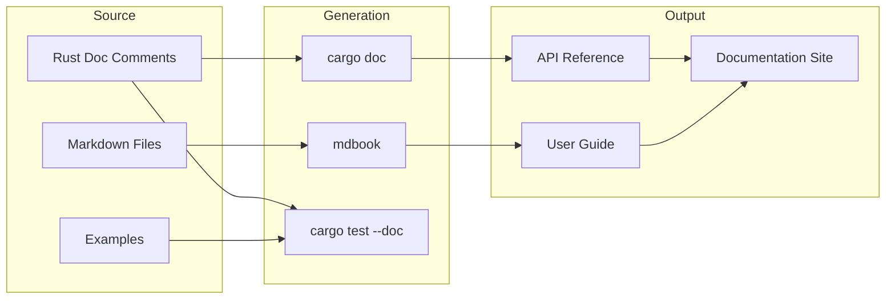

# 20 — Documentation Strategy

**Version:** 1.0  
**Status:** Draft  
**Last Updated:** 2026-07-22  
**Related:** [19-Developer Experience](./19-developer-experience.md), [07-Strategy System](./07-strategy-system.md), [22-Community](./22-community.md)

---

## 1. Overview

### Purpose

Documentation is **living, layered, and auto-generated where possible**. It serves three audiences: strategy developers (user guide), framework contributors (architecture docs), and operators (deployment guide).

### Documentation Layers

| Layer | Audience | Format | Location |
|-------|----------|--------|----------|
| **API Reference** | All developers | rustdoc (auto) | `cargo doc` |
| **User Guide** | Strategy developers | Markdown | `docs/guide/` |
| **Architecture** | Contributors | Markdown + Mermaid | `docs/architecture/` |
| **Spec** | Implementers | Markdown + Mermaid | `spec/` |
| **Examples** | Learners | Rust (runnable) | `examples/` |
| **CHANGELOG** | Users | Markdown | `CHANGELOG.md` |

### Principles

| Principle | Implementation |
|-----------|----------------|
| **Docs as code** | Version-controlled, reviewed like code |
| **Auto-generated** | API docs from rustdoc, not manual |
| **Runnable examples** | Every example compiles and runs |
| **Progressive disclosure** | Quick start → deep dive → internals |
| **Always current** | CI validates docs build, examples compile |

---

## 2. Requirements

### Functional

| ID | Requirement |
|----|-------------|
| FR-01 | rustdoc for all public APIs |
| FR-02 | User guide with progressive tutorials |
| FR-03 | Runnable examples in `examples/` |
| FR-04 | Architecture decision records (ADRs) |
| FR-05 | CHANGELOG maintained per release |
| FR-06 | Doc tests for code snippets |
| FR-07 | Search-enabled documentation site |

### Non-Functional

| ID | Requirement | Target |
|----|-------------|--------|
| NFR-01 | Doc coverage (public items) | 100% |
| NFR-02 | Example compilation | 100% (CI enforced) |
| NFR-03 | Doc build time | < 30 seconds |

---

## 3. API Documentation (rustdoc)

### Conventions

```rust
/// Every public item must have a doc comment.
///
/// # Structure
///
/// 1. One-line summary (first line)
/// 2. Blank line
/// 3. Detailed description (if needed)
/// 4. # Examples (for functions/methods)
/// 5. # Panics (if applicable)
/// 6. # Errors (if returns Result)
///
/// # Example
///
/// ```
/// use vendeta_core::Price;
///
/// let price = Price::from_f64(1234.56);
/// assert_eq!(price.0, 12_345_600);
/// ```

/// A financial price in fixed-point representation.
///
/// Prices are stored as i64 with 4 decimal places of precision.
/// ₹1234.56 is stored as `Price(12_345_600)`.
///
/// # Examples
///
/// ```
/// use vendeta_core::Price;
///
/// let price = Price::from_f64(100.50);
/// assert_eq!(price.to_f64(), 100.50);
///
/// let total = price.mul_qty(Quantity(10));
/// assert_eq!(total.to_f64(), 1005.00);
/// ```
///
/// # Precision
///
/// Maximum precision is 4 decimal places (0.0001 rupees = 0.01 paise).
/// This is sufficient for all Indian market instruments.
#[derive(Clone, Copy, Debug, PartialEq, Eq, PartialOrd, Ord)]
pub struct Price(pub i64);
```

### Doc Test Enforcement

```rust
/// CI runs `cargo test --doc` to verify all code examples compile and pass.
///
/// ```rust
/// // This is tested by CI:
/// use vendeta_core::{Price, Quantity, Money};
///
/// let price = Price(100_0000); // ₹100.00
/// let qty = Quantity(10);
/// let total: Money = price.mul_qty(qty);
/// assert_eq!(total, Money(1000_0000)); // ₹1000.00
/// ```
```

---

## 4. User Guide Structure

```
docs/
├── guide/
│   ├── 01-getting-started.md      # Install, first run
│   ├── 02-your-first-strategy.md  # Strategy tutorial
│   ├── 03-backtesting.md          # Backtest workflow
│   ├── 04-paper-trading.md        # Paper trading setup
│   ├── 05-live-trading.md         # Going live
│   ├── 06-configuration.md        # Config reference
│   ├── 07-risk-management.md      # Risk setup
│   ├── 08-data-management.md      # Data sync, storage
│   ├── 09-observability.md        # Logs, metrics, monitoring
│   └── 10-advanced-topics.md      # Custom adapters, plugins
├── architecture/
│   ├── target-architecture.md     # System design
│   └── adr/                       # Architecture Decision Records
│       ├── 001-message-bus.md
│       ├── 002-fixed-point.md
│       └── 003-zero-parity.md
└── api/                           # Generated (mdbook + rustdoc)
```

---

## 5. Examples

### Runnable Examples

```rust
// examples/sma_crossover.rs
//! SMA Crossover Strategy Example
//!
//! Run with: cargo run --example sma_crossover

use vendeta_engine::{Strategy, StrategyContext, Signal, SignalAction};
use vendeta_core::{Bar, Symbol, Quantity, Price};
use vendeta_indicators::Sma;

struct SmaCrossover {
    fast: Sma,
    slow: Sma,
    symbol: Symbol,
    qty: Quantity,
}

impl Strategy for SmaCrossover {
    fn name(&self) -> &str { "SMA Crossover Example" }

    fn on_bar(&mut self, bar: &Bar, ctx: &mut StrategyContext) {
        if bar.symbol != self.symbol { return; }

        self.fast.update(bar.close);
        self.slow.update(bar.close);

        if !self.fast.is_ready() || !self.slow.is_ready() { return; }

        if self.fast.value() > self.slow.value() {
            ctx.signal(Signal::new(
                self.symbol.clone(),
                SignalAction::EnterLong,
                self.qty,
                "Golden cross",
            ));
        }
    }
}

fn main() {
    println!("SMA Crossover Example");
    println!("Run with: vendeta backtest --strategy sma_crossover");
}
```

### Example Validation

```yaml
# CI validates all examples compile:
# .github/workflows/ci.yml
- name: Check examples compile
  run: cargo build --examples --workspace
```

---

## 6. Architecture Decision Records

### ADR Template

```markdown
# ADR-001: Message Bus Architecture

## Status
Accepted

## Context
The framework needs inter-component communication. Options considered:
1. Direct function calls (tight coupling)
2. Event bus with dynamic dispatch
3. Typed message channels (chosen)

## Decision
Use typed message channels (tokio broadcast + mpsc) with a central MessageBus.

## Consequences
- Components are decoupled (publish/subscribe)
- Message ordering is guaranteed within a channel
- Replay is possible via event log
- Slight overhead vs direct calls (~200ns per message)
```

---

## 7. Documentation Site

### mdbook Configuration

```toml
# docs/book.toml
[book]
title = "Vendeta Trading Framework"
authors = ["Vendeta Team"]
description = "High-performance algorithmic trading framework for Indian markets"

[output.html]
default-theme = "rust"
git-repository-url = "https://github.com/vendeta/vendeta"

[output.html.search]
enable = true
```

---

## 8. Data Flow



---

## 9. Configuration

```yaml
# Documentation build config
docs:
  # mdbook output
  output_dir: "./target/docs"

  # rustdoc settings
  rustdoc:
    private: false        # Only public items
    document-private-items: false

  # Example validation
  examples:
    compile_check: true   # CI compiles all examples
    run_check: false      # Don't run in CI (may need credentials)
```

---

## 10. Error Handling

Documentation build errors are CI-blocking:

| Error | Impact |
|-------|--------|
| Doc test fails | CI fails (code example is wrong) |
| Missing doc on public item | Clippy warning (`missing_docs`) |
| Broken internal link | mdbook warning |
| Example doesn't compile | CI fails |

---

## 11. Testing Requirements

| Test | Description |
|------|-------------|
| `cargo test --doc` | All doc examples pass |
| `cargo build --examples` | All examples compile |
| `cargo doc --no-deps` | Docs build without errors |
| `mdbook build` | Book builds without errors |
| Link checker | No broken internal links |

---

## 12. Implementation Notes

### Patterns

1. **Doc tests as tutorials**: Code examples in rustdoc ARE the tutorial.
2. **ADRs for decisions**: Every significant design choice gets an ADR.
3. **Living docs**: Docs updated in same PR as code change.
4. **Progressive disclosure**: Quick start (5 min) → Guide (30 min) → Architecture (deep).

### Gotchas

- **Keep examples minimal**: Doc tests should be < 10 lines.
- **No network in doc tests**: Examples must work offline.
- **Version-specific docs**: Tag docs with version (docs.rs handles this).
- **Don't document internals**: Only public API gets rustdoc.

---

## 13. Cross-References

| Document | Relevance |
|----------|-----------|
| [19-Developer Experience](./19-developer-experience.md) | CLI help is documentation |
| [07-Strategy System](./07-strategy-system.md) | Strategy writing guide |
| [22-Community](./22-community.md) | Community documentation |
| [18-CI/CD](./18-ci-cd.md) | Doc build in CI |
| [01-Introduction](./01-introduction-vision.md) | Vision documentation |
