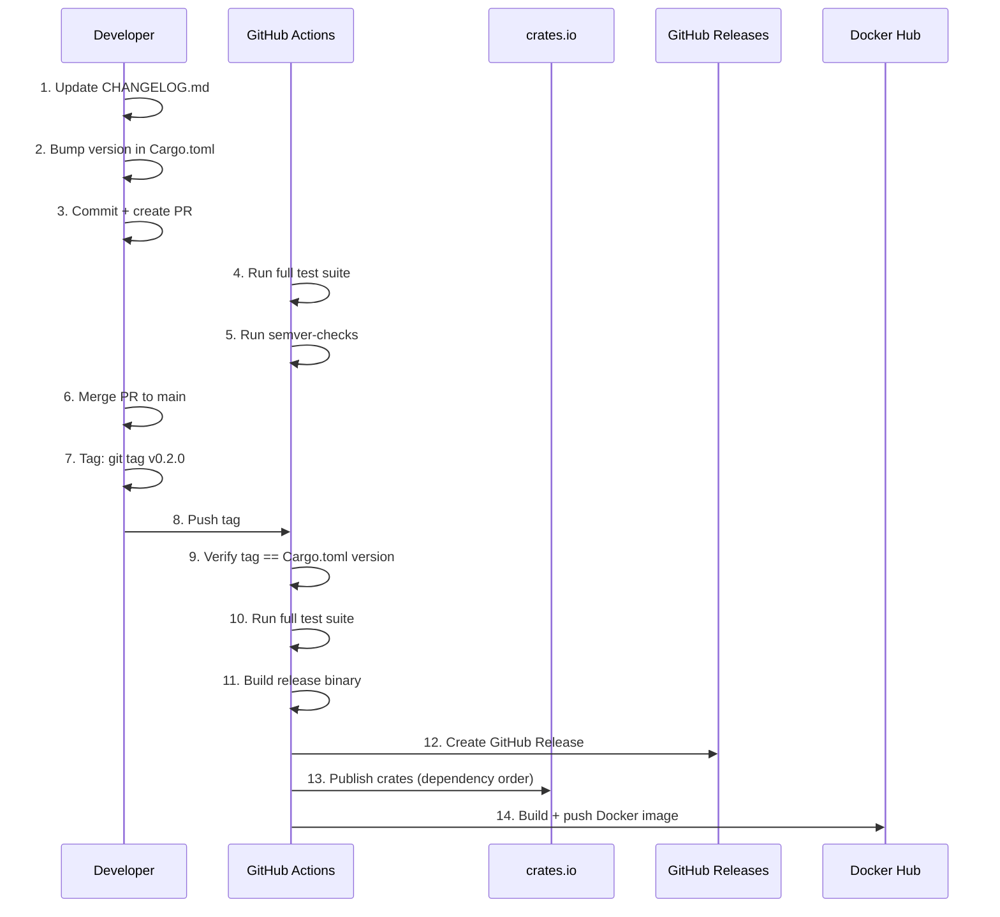
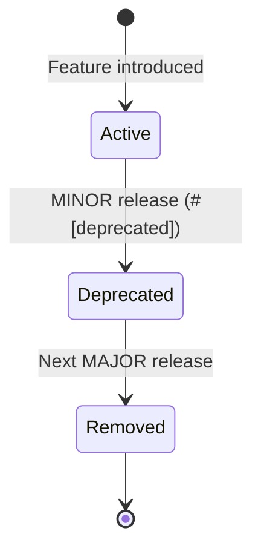

# 21 — Versioning & Release Strategy

**Version:** 1.0  
**Status:** Draft  
**Last Updated:** 2026-07-22  
**Related:** [18-CI/CD](./18-ci-cd.md), [03-Project Structure](./03-project-structure.md), [22-Community](./22-community.md)

---

## 1. Overview

### Purpose

Vendeta follows **strict Semantic Versioning (SemVer 2.0)** with pre-release tags for early access. All 17 crates in the workspace are versioned in lockstep — a single release bumps all crates simultaneously.

### Versioning Principles

| Principle | Implementation |
|-----------|----------------|
| **SemVer strict** | MAJOR.MINOR.PATCH with pre-release tags |
| **Lockstep versioning** | All crates share the same version number |
| **No surprise breaks** | Breaking changes only in MAJOR releases |
| **Automated releases** | Tag triggers CI → build → publish |
| **Changelog discipline** | Every user-facing change documented |

---

## 2. Requirements

### Functional

| ID | Requirement |
|----|-------------|
| FR-01 | SemVer 2.0 compliance |
| FR-02 | Pre-release tags (alpha, beta, rc) |
| FR-03 | Automated release via git tag |
| FR-04 | CHANGELOG.md maintained per release |
| FR-05 | Breaking change detection in CI |
| FR-06 | Crate publishing to crates.io |
| FR-07 | Version consistency check across workspace |
| FR-08 | Release notes auto-generated from commits |

### Non-Functional

| ID | Requirement | Target |
|----|-------------|--------|
| NFR-01 | Release pipeline duration | < 15 minutes |
| NFR-02 | Zero manual release steps | Fully automated |
| NFR-03 | Rollback capability | < 5 minutes (yank + re-tag) |

---

## 3. Semantic Versioning

### Version Format

```
MAJOR.MINOR.PATCH[-PRERELEASE]

Examples:
  0.1.0-alpha.1   # First alpha (API unstable)
  0.1.0-alpha.2   # Bug fixes during alpha
  0.1.0-beta.1    # Feature complete, testing phase
  0.1.0-rc.1      # Release candidate (no new features)
  0.1.0           # First stable release
  0.1.1           # Patch (bug fix only)
  0.2.0           # Minor (new features, backward compatible)
  1.0.0           # Major (breaking changes allowed)
```

### Version Bump Rules

| Change Type | Bump | Examples |
|-------------|------|----------|
| Bug fix (no API change) | PATCH | Fix fill calculation, fix reconnection |
| New feature (backward compatible) | MINOR | Add VWAP algorithm, new indicator |
| Breaking API change | MAJOR | Rename trait method, remove deprecated |
| Pre-release iteration | PRERELEASE | alpha.1 → alpha.2, rc.1 → rc.2 |

### Pre-1.0 Policy

Before `1.0.0`:
- MINOR bumps may include breaking changes (SemVer allows this for 0.x)
- Breaking changes are still documented in CHANGELOG
- `0.x.y` signals "API not yet stable"
- Target: reach `1.0.0` when core APIs stabilize

---

## 4. Workspace Version Management

### Lockstep Versioning

All crates in the workspace share a single version:

```toml
# Cargo.toml (workspace root)
[workspace]
members = [
    "crates/vendeta-core",
    "crates/vendeta-bus",
    "crates/vendeta-engine",
    "crates/vendeta-gateway",
    "crates/vendeta-adapters/vendeta-dhan",
    "crates/vendeta-adapters/vendeta-upstox",
    "crates/vendeta-paper",
    "crates/vendeta-config",
    "crates/vendeta-cli",
    "crates/vendeta-py",
    "crates/vendeta-arch",
    "crates/vendeta-store",
    "crates/vendeta-data",
    "crates/vendeta-backtest",
    "crates/vendeta-api",
    "crates/vendeta-scanner",
    "crates/vendeta-indicators",
]

[workspace.package]
version = "0.1.0"
edition = "2021"
license = "MIT"
repository = "https://github.com/vendeta/vendeta"
```

```toml
# crates/vendeta-core/Cargo.toml
[package]
name = "vendeta-core"
version.workspace = true
edition.workspace = true
license.workspace = true
```

### Version Consistency Check

```rust
// tests/version_consistency.rs
//! Ensures all crates share the same version.

#[test]
fn all_crates_same_version() {
    let workspace_version = env!("CARGO_PKG_VERSION");
    
    // In a workspace with `version.workspace = true`,
    // all crates inherit the same version automatically.
    // This test validates the workspace config is correct.
    
    let crates = [
        "vendeta-core",
        "vendeta-bus",
        "vendeta-engine",
        "vendeta-gateway",
        "vendeta-config",
        "vendeta-store",
        "vendeta-data",
        "vendeta-backtest",
        "vendeta-indicators",
    ];
    
    for crate_name in &crates {
        // Verify via cargo metadata that versions match
        let output = std::process::Command::new("cargo")
            .args(["metadata", "--format-version", "1", "--no-deps"])
            .output()
            .expect("cargo metadata failed");
        
        let metadata: serde_json::Value = serde_json::from_slice(&output.stdout)
            .expect("invalid metadata JSON");
        
        for pkg in metadata["packages"].as_array().unwrap() {
            if pkg["name"] == *crate_name {
                assert_eq!(
                    pkg["version"].as_str().unwrap(),
                    workspace_version,
                    "Crate {} version mismatch",
                    crate_name
                );
            }
        }
    }
}
```

---

## 5. Breaking Change Detection

### CI Integration

```yaml
# .github/workflows/ci.yml (breaking change check)
  semver-check:
    name: SemVer Check
    runs-on: ubuntu-latest
    if: github.event_name == 'pull_request'
    steps:
      - uses: actions/checkout@v4
        with:
          fetch-depth: 0
      - uses: dtolnay/rust-toolchain@stable
      - uses: Swatinem/rust-cache@v2

      - name: Install cargo-semver-checks
        run: cargo install cargo-semver-checks

      - name: Check for breaking changes
        run: |
          cargo semver-checks check-release \
            --baseline-rev origin/main \
            --release-type minor
```

### Breaking Change Classification

| Change | Classification | Action |
|--------|---------------|--------|
| Remove public function | Breaking | MAJOR bump |
| Add required trait method | Breaking | MAJOR bump |
| Change function signature | Breaking | MAJOR bump |
| Add optional trait method (with default) | Non-breaking | MINOR bump |
| Add new public function | Non-breaking | MINOR bump |
| Add new enum variant | Non-breaking* | MINOR bump |
| Deprecate function (`#[deprecated]`) | Non-breaking | MINOR bump |
| Remove deprecated function | Breaking | MAJOR bump |

*Note: Adding enum variants is technically breaking for exhaustive matches. Vendeta uses `#[non_exhaustive]` on public enums to make this non-breaking.

### `#[non_exhaustive]` Policy

```rust
/// All public enums use #[non_exhaustive] to allow
/// adding variants without a MAJOR bump.
#[non_exhaustive]
pub enum OrderStatus {
    Pending,
    Submitted,
    PartiallyFilled,
    Filled,
    Cancelled,
    Rejected,
    // New variants can be added in MINOR releases
}

/// Users must handle the wildcard:
fn handle_status(status: &OrderStatus) {
    match status {
        OrderStatus::Filled => { /* ... */ }
        OrderStatus::Rejected => { /* ... */ }
        _ => { /* handle unknown future variants */ }
    }
}
```

---

## 6. Release Process

### Release Flow



### Release Checklist

```markdown
## Release Checklist (v{VERSION})

### Pre-Release
- [ ] All CI checks green on main
- [ ] Coverage ≥ 90%
- [ ] `cargo semver-checks` passes (or MAJOR bump justified)
- [ ] CHANGELOG.md updated with all changes
- [ ] Version bumped in workspace Cargo.toml
- [ ] Documentation updated (rustdoc, user guide)
- [ ] Examples still compile (`cargo build --examples`)
- [ ] Benchmarks show no regression > 20%

### Release
- [ ] Create tag: `git tag -a v{VERSION} -m "Release v{VERSION}"`
- [ ] Push tag: `git push origin v{VERSION}`
- [ ] CI release pipeline triggered automatically
- [ ] Verify crates.io publish succeeded
- [ ] Verify Docker image pushed
- [ ] Verify GitHub Release created with notes

### Post-Release
- [ ] Announce in community channels
- [ ] Update documentation site
- [ ] Close milestone on GitHub
- [ ] Start next version in CHANGELOG (Unreleased section)
```

### Crate Publish Order

Crates must be published in dependency order:

```bash
# Publish order (respects dependency graph)
cargo publish -p vendeta-core        # 1. No internal deps
cargo publish -p vendeta-bus         # 2. Depends on core
cargo publish -p vendeta-store       # 3. Depends on core
cargo publish -p vendeta-data        # 4. Depends on core, store
cargo publish -p vendeta-indicators  # 5. Depends on core
cargo publish -p vendeta-config      # 6. Depends on core
cargo publish -p vendeta-gateway     # 7. Depends on core, bus
cargo publish -p vendeta-engine      # 8. Depends on core, bus, gateway
cargo publish -p vendeta-backtest    # 9. Depends on core, engine, data
cargo publish -p vendeta-arch        # 10. Depends on core
cargo publish -p vendeta-scanner     # 11. Depends on core, data
cargo publish -p vendeta-api         # 12. Depends on core, engine
cargo publish -p vendeta-dhan        # 13. Depends on gateway
cargo publish -p vendeta-upstox      # 14. Depends on gateway
cargo publish -p vendeta-paper       # 15. Depends on gateway, engine
cargo publish -p vendeta-py          # 16. Depends on engine (PyO3)
cargo publish -p vendeta-cli         # 17. Depends on everything
```

---

## 7. CHANGELOG Format

### Keep a Changelog Convention

```markdown
# Changelog

All notable changes to Vendeta are documented in this file.

The format is based on [Keep a Changelog](https://keepachangelog.com/),
and this project adheres to [Semantic Versioning](https://semver.org/).

## [Unreleased]

### Added
- New VWAP execution algorithm (#142)

### Changed
- Improved reconnection backoff for Dhan adapter (#138)

## [0.2.0] - 2026-08-15

### Added
- `BarAggregator` for tick-to-OHLCV conversion (#120)
- Volume-weighted slippage model (#125)
- `vendeta scan` CLI command (#130)

### Changed
- `Strategy::on_bar` now receives `&Bar` instead of `Bar` (#118)
- Improved error messages for config validation (#122)

### Fixed
- Fill simulation for limit orders at exact price (#115)
- Memory leak in BarAggregator on symbol change (#128)

### Deprecated
- `OrderManager::submit()` — use `ExecutionEngine::place_order()` (#119)

## [0.1.0] - 2026-07-01

### Added
- Initial release
- Core message bus with typed channels
- Component lifecycle management
- Dhan and Upstox adapters
- Paper trading engine
- Backtest engine with zero-parity guarantee
- Risk engine with pre-trade checks
- CLI with run, backtest, scan commands
```

### Changelog Categories

| Category | Meaning |
|----------|---------|
| **Added** | New features |
| **Changed** | Modifications to existing functionality |
| **Deprecated** | Soon-to-be removed features |
| **Removed** | Removed features |
| **Fixed** | Bug fixes |
| **Security** | Security fixes |

### Automation

```yaml
# Changelog is generated from conventional commits:
# feat: → Added
# fix: → Fixed
# perf: → Changed
# refactor: → Changed
# docs: → (not in changelog)
# chore: → (not in changelog)
# BREAKING CHANGE: → noted in Changed with ⚠️ prefix
```

---

## 8. Deprecation Policy

### Deprecation Lifecycle



### Rules

1. **Minimum 1 MINOR release** of deprecation before removal
2. **Deprecation notice** includes migration path
3. **Compiler warnings** guide users to replacement

```rust
/// Submit an order for execution.
#[deprecated(
    since = "0.3.0",
    note = "Use `ExecutionEngine::place_order()` instead. \
            See migration guide: docs/guide/migration-0.3.md"
)]
pub fn submit_order(&mut self, order: Order) -> OrderId {
    self.execution_engine.place_order(order)
}
```

### Deprecation in CHANGELOG

```markdown
### Deprecated
- `OrderManager::submit_order()` — use `ExecutionEngine::place_order()` instead.
  Will be removed in v1.0.0. Migration: docs/guide/migration-0.3.md (#145)
```

---

## 9. Configuration

```yaml
# Release configuration
release:
  # Version source of truth
  version_source: "workspace"  # Cargo.toml [workspace.package].version

  # Publish targets
  publish:
    crates_io: true
    docker: true
    github_release: true

  # Pre-release validation
  validation:
    semver_check: true         # cargo-semver-checks
    coverage_minimum: 90       # percent
    benchmark_regression: 20   # max allowed regression percent
    doc_build: true            # cargo doc must succeed
    examples_compile: true     # cargo build --examples

  # Changelog
  changelog:
    format: "keepachangelog"
    auto_generate: true        # from conventional commits
    path: "CHANGELOG.md"

  # Docker
  docker:
    registry: "docker.io"
    repository: "vendeta/vendeta"
    tags: ["latest", "${version}"]
```

---

## 10. Error Handling

### Release Failure Recovery

| Failure | Recovery |
|---------|----------|
| crates.io publish fails (network) | Retry publish (idempotent for same version) |
| Version already published | Cannot re-publish; bump PATCH and re-release |
| Docker push fails | Retry; Docker layers are cached |
| Tag doesn't match Cargo.toml | Delete tag, fix version, re-tag |
| Breaking change in MINOR | Yank crate, release PATCH with fix |

### Yanking Policy

```bash
# If a broken version is published:
cargo yank vendeta-core@0.2.0

# Yanked versions:
# - Still available for existing Cargo.lock users
# - Not available for new `cargo add` or fresh resolves
# - Should be followed immediately by a PATCH release
```

---

## 11. Testing Requirements

| Test | Description |
|------|-------------|
| Version consistency | All workspace crates have same version |
| Semver check | `cargo semver-checks` detects breaking changes |
| Changelog format | Validate CHANGELOG.md structure |
| Tag-version match | CI verifies git tag == Cargo.toml version |
| Publish dry-run | `cargo publish --dry-run` in CI |

```rust
#[test]
fn changelog_has_unreleased_section() {
    let changelog = std::fs::read_to_string("CHANGELOG.md").unwrap();
    assert!(
        changelog.contains("## [Unreleased]"),
        "CHANGELOG.md must have an [Unreleased] section"
    );
}

#[test]
fn changelog_entries_have_pr_references() {
    let changelog = std::fs::read_to_string("CHANGELOG.md").unwrap();
    // Every entry should reference a PR number
    for line in changelog.lines() {
        if line.starts_with("- ") && !line.contains("[Unreleased]") {
            assert!(
                line.contains("(#"),
                "Changelog entry missing PR reference: {}",
                line
            );
        }
    }
}
```

---

## 12. Implementation Notes

### Patterns

1. **Conventional commits**: `feat:`, `fix:`, `perf:`, `refactor:`, `docs:`, `chore:`
2. **PR-per-change**: Every change gets a PR with a squash merge
3. **Milestone tracking**: GitHub milestones map to versions
4. **Release branch**: For PATCH releases off a stable tag (if needed)

### Gotchas

- **Never re-publish**: crates.io doesn't allow re-publishing the same version. Always bump.
- **Publish order matters**: Dependents must be published after dependencies.
- **`#[non_exhaustive]` early**: Add it to all public enums from day one.
- **Pre-1.0 freedom**: Use 0.x to iterate fast; don't fear breaking changes.
- **Cargo.lock for binaries**: The CLI binary commits Cargo.lock; library crates do not.

---

## 13. Cross-References

| Document | Relevance |
|----------|-----------|
| [18-CI/CD](./18-ci-cd.md) | Release pipeline automation |
| [03-Project Structure](./03-project-structure.md) | Workspace crate layout |
| [22-Community](./22-community.md) | Publishing for community use |
| [20-Documentation](./20-documentation-strategy.md) | CHANGELOG as documentation |
| [17-Testing](./17-testing.md) | Quality gates before release |
