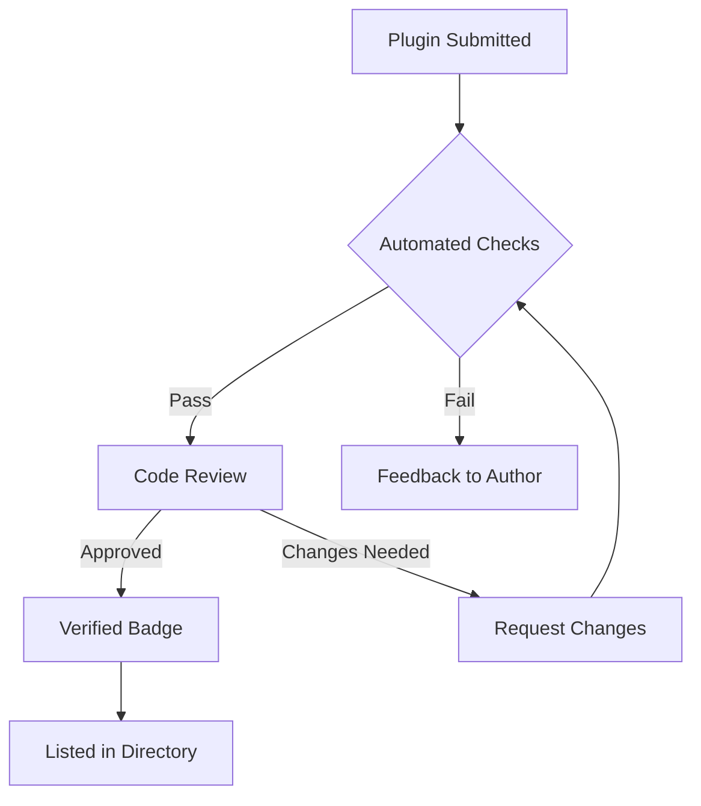
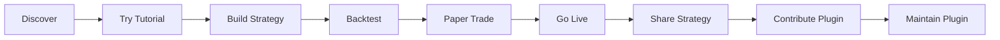
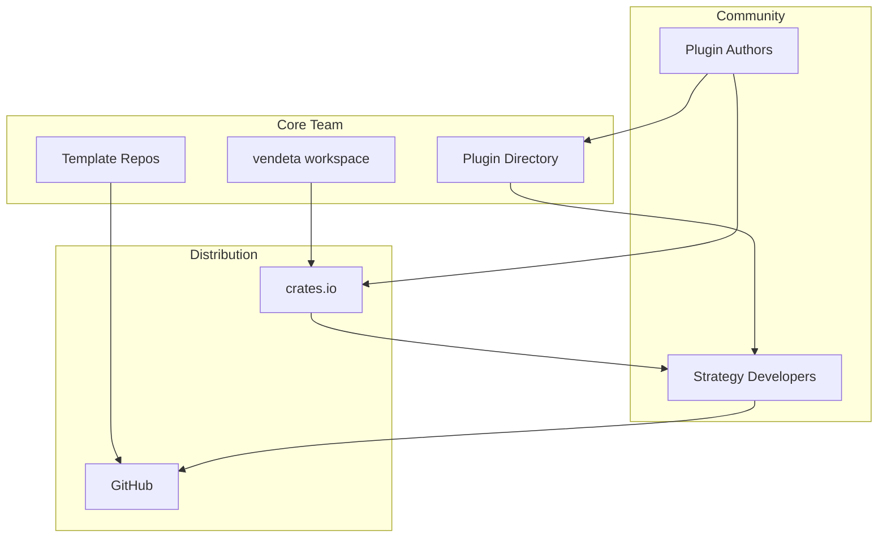

# 22 — Community & Ecosystem

**Version:** 1.0  
**Status:** Draft  
**Last Updated:** 2026-07-22  
**Related:** [14-Plugin System](./14-plugin-system.md), [21-Versioning](./21-versioning.md), [19-Developer Experience](./19-developer-experience.md)

---

## 1. Overview

### Purpose

Vendeta is designed for **community extension**. Third-party developers can publish adapter plugins, strategy plugins, and indicator libraries. The ecosystem is supported by template repositories, a plugin directory, and clear contribution guidelines.

### Ecosystem Principles

| Principle | Implementation |
|-----------|----------------|
| **Open extension** | Anyone can publish a Vendeta plugin |
| **Template-driven** | GitHub templates for strategies and adapters |
| **Curated quality** | Plugin directory with verification badges |
| **Low barrier** | `vendeta new strategy` scaffolds in seconds |
| **Community-first** | Discord, forum, office hours, showcase |

---

## 2. Requirements

### Functional

| ID | Requirement |
|----|-------------|
| FR-01 | GitHub template repos for strategies and adapters |
| FR-02 | Plugin directory (curated list) |
| FR-03 | Contribution guidelines (CONTRIBUTING.md) |
| FR-04 | Example strategy collection |
| FR-05 | Community adapter verification process |
| FR-06 | crates.io publishing for third-party plugins |
| FR-07 | Strategy showcase (community submissions) |

### Non-Functional

| ID | Requirement | Target |
|----|-------------|--------|
| NFR-01 | Time to first plugin | < 30 minutes |
| NFR-02 | Template completeness | Compiles out of the box |
| NFR-03 | Documentation for plugin authors | Complete guide |

---

## 3. Template Repositories

### Strategy Template

```
vendeta-strategy-template/
├── Cargo.toml
├── src/
│   └── lib.rs          # Strategy implementation
├── tests/
│   └── strategy_test.rs
├── config/
│   └── example.yaml    # Example configuration
├── README.md
├── LICENSE
└── .github/
    └── workflows/
        └── ci.yml      # Template CI
```

```toml
# vendeta-strategy-template/Cargo.toml
[package]
name = "vendeta-strategy-my-strategy"
version = "0.1.0"
edition = "2021"

[dependencies]
vendeta-core = "0.2"
vendeta-engine = "0.2"
vendeta-indicators = "0.2"

[dev-dependencies]
vendeta-backtest = "0.2"
proptest = "1"
```

```rust
// vendeta-strategy-template/src/lib.rs
//! My Strategy — a Vendeta strategy plugin.
//!
//! ## Usage
//!
//! Add to your `vendeta.yaml`:
//! ```yaml
//! strategies:
//!   - name: my_strategy
//!     crate: vendeta-strategy-my-strategy
//! ```

use vendeta_core::{Bar, Symbol, Quantity, Price};
use vendeta_engine::{Strategy, StrategyContext, Signal, SignalAction};

/// Configuration for MyStrategy.
#[derive(Debug, Clone, serde::Deserialize)]
pub struct MyStrategyConfig {
    /// Symbol to trade
    pub symbol: String,
    /// Order quantity
    pub quantity: u32,
    /// Fast SMA period
    pub fast_period: usize,
    /// Slow SMA period
    pub slow_period: usize,
}

/// A simple SMA crossover strategy.
pub struct MyStrategy {
    symbol: Symbol,
    quantity: Quantity,
    // Add indicators, state, etc.
}

impl MyStrategy {
    pub fn new(config: &MyStrategyConfig) -> Self {
        Self {
            symbol: Symbol::new(&config.symbol),
            quantity: Quantity(config.quantity as i64),
        }
    }
}

impl Strategy for MyStrategy {
    fn name(&self) -> &str {
        "MyStrategy"
    }

    fn on_bar(&mut self, bar: &Bar, ctx: &mut StrategyContext) {
        if bar.symbol != self.symbol {
            return;
        }
        // Strategy logic here
    }
}
```

### Adapter Template

```
vendeta-adapter-template/
├── Cargo.toml
├── src/
│   ├── lib.rs          # Plugin registration
│   ├── gateway.rs      # BrokerGateway implementation
│   ├── feed.rs         # FeedBridge implementation
│   ├── auth.rs         # Authentication
│   └── types.rs        # Broker-specific types
├── tests/
│   ├── contract_test.rs
│   └── integration_test.rs
├── config/
│   └── example.yaml
├── README.md
├── LICENSE
└── .github/
    └── workflows/
        └── ci.yml
```

```rust
// vendeta-adapter-template/src/lib.rs
//! MyBroker adapter for Vendeta.

use vendeta_gateway::{BrokerGateway, AdapterFactory, AdapterCapabilities};
use vendeta_plugin::{Plugin, PluginMetadata};

/// Plugin entry point.
pub struct MyBrokerPlugin;

impl Plugin for MyBrokerPlugin {
    fn metadata(&self) -> PluginMetadata {
        PluginMetadata {
            name: "vendeta-adapter-mybroker",
            version: env!("CARGO_PKG_VERSION"),
            description: "MyBroker adapter for Vendeta",
            author: "Your Name",
        }
    }

    fn register(&self, registry: &mut PluginRegistry) {
        registry.register_adapter("mybroker", Box::new(MyBrokerFactory));
    }
}

/// Factory for creating MyBroker gateway instances.
pub struct MyBrokerFactory;

impl AdapterFactory for MyBrokerFactory {
    fn create(&self, config: &AdapterConfig) -> Result<Box<dyn BrokerGateway>, AdapterError> {
        let gateway = MyBrokerGateway::new(config)?;
        Ok(Box::new(gateway))
    }

    fn capabilities(&self) -> AdapterCapabilities {
        AdapterCapabilities {
            supports_market_orders: true,
            supports_limit_orders: true,
            supports_stop_orders: false,
            supports_bracket_orders: false,
            supports_streaming: true,
            supported_exchanges: vec!["NSE".into(), "BSE".into()],
            supported_asset_classes: vec!["Equity".into()],
        }
    }
}
```

---

## 4. Plugin Directory

### Directory Structure

The plugin directory is a curated list maintained in the main repository:

```yaml
# plugins/directory.yaml
plugins:
  adapters:
    - name: vendeta-dhan
      repository: "https://github.com/vendeta/vendeta-dhan"
      version: "0.2.0"
      verified: true
      exchanges: [NSE, BSE, MCX]
      features: [streaming, historical, options]

    - name: vendeta-upstox
      repository: "https://github.com/vendeta/vendeta-upstox"
      version: "0.2.0"
      verified: true
      exchanges: [NSE, BSE]
      features: [streaming, historical]

    - name: vendeta-adapter-alpaca
      repository: "https://github.com/community/vendeta-alpaca"
      version: "0.1.3"
      verified: false
      exchanges: [NYSE, NASDAQ]
      features: [streaming, paper]

  strategies:
    - name: vendeta-strategy-sma-cross
      repository: "https://github.com/vendeta/vendeta-example-strategies"
      description: "SMA crossover with risk management"
      verified: true

    - name: vendeta-strategy-momentum
      repository: "https://github.com/community/vendeta-momentum"
      description: "Cross-sectional momentum"
      verified: false

  indicators:
    - name: vendeta-indicators-ta
      repository: "https://github.com/community/vendeta-ta"
      description: "50+ technical analysis indicators"
      verified: true
```

### Verification Process



**Verification criteria:**
1. Compiles against latest Vendeta version
2. Passes contract tests (adapter) or parity tests (strategy)
3. No `unsafe` code without justification
4. Documentation complete (README, rustdoc)
5. License compatible (MIT, Apache-2.0)
6. No network calls in tests (mocked)

---

## 5. Contribution Guidelines

### CONTRIBUTING.md

```markdown
# Contributing to Vendeta

Thank you for your interest in contributing!

## Getting Started

1. Fork the repository
2. Clone your fork: `git clone https://github.com/YOU/vendeta`
3. Create a branch: `git checkout -b feat/my-feature`
4. Make changes
5. Run checks: `make lint test`
6. Commit with conventional format: `feat: add my feature`
7. Push and open a PR

## Development Setup

```bash
make setup  # Install toolchain components
make test   # Run all tests
make lint   # Run fmt + clippy
```

## Code Standards

- All public items must have rustdoc comments
- All new code must have tests
- Follow existing patterns (see architecture docs)
- No `unwrap()` in library code (use `?` or `expect` with message)
- Use `thiserror` for error types

## Commit Convention

- `feat:` — new feature
- `fix:` — bug fix
- `perf:` — performance improvement
- `refactor:` — code restructure (no behavior change)
- `docs:` — documentation only
- `test:` — test additions/changes
- `chore:` — build/tooling changes

## PR Requirements

- [ ] CI passes (all gates green)
- [ ] Tests added for new functionality
- [ ] Documentation updated
- [ ] CHANGELOG entry added
- [ ] No clippy warnings
- [ ] Squash-merge (one commit per PR)

## Reporting Issues

Use GitHub Issues with the appropriate template:
- Bug report
- Feature request
- Adapter request
- Question
```

---

## 6. Package Publishing

### crates.io Naming Convention

```
vendeta                     # Core framework (meta-crate)
vendeta-core                # Core types
vendeta-bus                 # Message bus
vendeta-engine              # Execution + strategy engine
vendeta-gateway             # Broker gateway trait
vendeta-dhan                # Dhan adapter (official)
vendeta-upstox              # Upstox adapter (official)
vendeta-paper               # Paper trading
vendeta-backtest            # Backtest engine
vendeta-indicators          # Built-in indicators
vendeta-config              # Configuration
vendeta-store               # Storage
vendeta-data                # Data engine
vendeta-cli                 # CLI binary
vendeta-py                  # Python bindings

# Community packages follow: vendeta-{category}-{name}
vendeta-adapter-alpaca      # Community adapter
vendeta-strategy-momentum   # Community strategy
vendeta-indicators-ta       # Community indicators
```

### Publishing Checklist for Plugin Authors

```markdown
## Publishing Your Plugin

1. Ensure your crate name follows convention: `vendeta-{type}-{name}`
2. Add to your Cargo.toml:
   ```toml
   [package]
   name = "vendeta-strategy-my-strategy"
   version = "0.1.0"
   edition = "2021"
   license = "MIT"
   description = "My strategy for Vendeta"
   repository = "https://github.com/you/vendeta-strategy-my-strategy"
   keywords = ["vendeta", "trading", "strategy"]
   categories = ["finance"]
   ```
3. Run `cargo publish --dry-run` to verify
4. Publish: `cargo publish`
5. Submit PR to add to plugin directory
```

---

## 7. Community Resources

### Resource Map

| Resource | Purpose | Platform |
|----------|---------|----------|
| **Discord** | Real-time chat, quick questions | Discord |
| **GitHub Discussions** | Long-form discussions, RFCs | GitHub |
| **Monthly Office Hours** | Live Q&A with core team | Zoom/YouTube |
| **Strategy Showcase** | Community strategy demos | GitHub + Discord |
| **Plugin Directory** | Curated plugin list | Repository |
| **Issue Tracker** | Bug reports, features | GitHub Issues |

### Community Lifecycle



---

## 8. Data Flow



---

## 9. Configuration

```yaml
# Community configuration
community:
  # Plugin directory
  directory:
    path: "plugins/directory.yaml"
    auto_verify: false  # Manual review required

  # Templates
  templates:
    strategy: "https://github.com/vendeta/vendeta-strategy-template"
    adapter: "https://github.com/vendeta/vendeta-adapter-template"

  # Verification
  verification:
    required_checks:
      - "cargo build"
      - "cargo test"
      - "cargo clippy -- -D warnings"
      - "cargo doc --no-deps"
    license_whitelist:
      - MIT
      - Apache-2.0
      - BSD-3-Clause
```

---

## 10. Error Handling

Community-specific error scenarios:

| Scenario | Handling |
|----------|----------|
| Plugin incompatible with Vendeta version | Clear error: "Plugin requires vendeta-core ^0.3, found 0.2" |
| Plugin panics at runtime | Caught by component lifecycle; logged + disabled |
| Malicious plugin | Verification process; no `unsafe` without review |
| Plugin dependency conflict | Cargo resolver handles; clear error message |

```rust
/// Version compatibility check for plugins.
pub fn check_compatibility(
    plugin_vendeta_dep: &semver::VersionReq,
    current_version: &semver::Version,
) -> Result<(), PluginError> {
    if !plugin_vendeta_dep.matches(current_version) {
        return Err(PluginError::IncompatibleVersion {
            plugin_requires: plugin_vendeta_dep.clone(),
            current: current_version.clone(),
            suggestion: format!(
                "Update vendeta to a version matching {}, or use an older plugin version",
                plugin_vendeta_dep
            ),
        });
    }
    Ok(())
}
```

---

## 11. Testing Requirements

| Test | Description |
|------|-------------|
| Template compilation | Templates compile with latest vendeta |
| Plugin contract tests | Adapters pass BrokerGateway contract |
| Directory validation | directory.yaml is valid YAML, links resolve |
| Example strategies | All examples compile and backtest succeeds |

---

## 12. Implementation Notes

### Patterns

1. **Template-first**: Every new plugin type gets a template repo.
2. **Verify early**: Automated checks before human review.
3. **Semantic versioning**: Plugins declare vendeta dependency with caret (`^0.2`).
4. **Isolation**: Plugins run in the component lifecycle; panics are contained.

### Gotchas

- **Template drift**: Templates must be updated with every MINOR release.
- **Naming squatting**: Reserve `vendeta-*` namespace on crates.io early.
- **Breaking changes**: When Vendeta has a MAJOR bump, community plugins break. Provide migration guide.
- **Security**: Never auto-execute community code. Plugins are compiled Rust — safe by default.

---

## 13. Cross-References

| Document | Relevance |
|----------|-----------|
| [14-Plugin System](./14-plugin-system.md) | Plugin architecture and registration |
| [21-Versioning](./21-versioning.md) | Version compatibility for plugins |
| [19-Developer Experience](./19-developer-experience.md) | CLI for plugin scaffolding |
| [08-Adapter System](./08-adapter-system.md) | Adapter contract for community adapters |
| [07-Strategy System](./07-strategy-system.md) | Strategy contract for community strategies |
