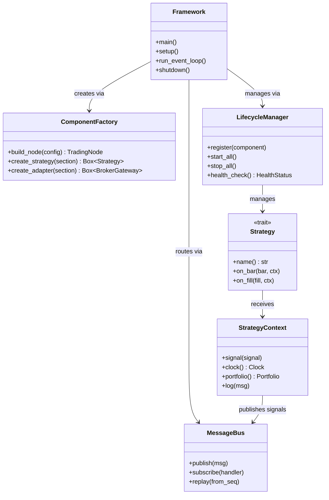
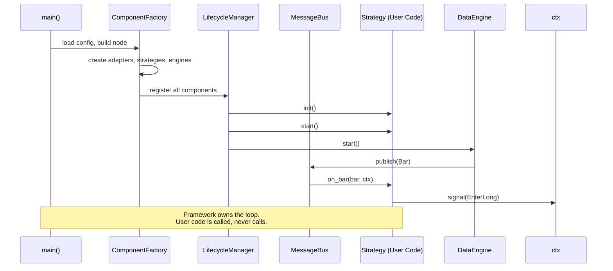
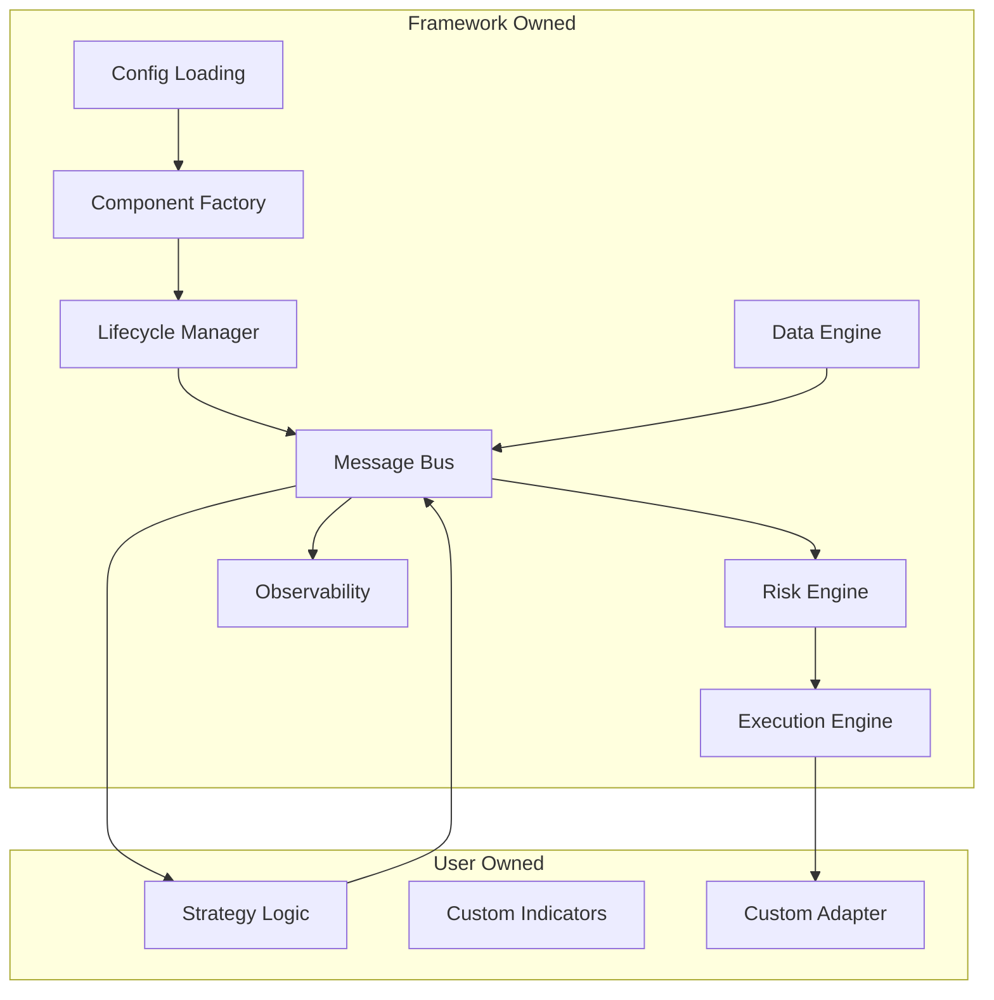

# 23 — Framework vs Application

**Version:** 1.0  
**Status:** Draft  
**Last Updated:** 2026-07-22  
**Related:** [01-Introduction & Vision](./01-introduction-vision.md), [05-Component Lifecycle](./05-component-lifecycle.md), [14-Plugin System](./14-plugin-system.md)

---

## 1. Overview

### Purpose

Vendeta is a **framework**, not an application. The distinction is fundamental: in an application, you call the code; in a framework, the code calls you (Inversion of Control). This document defines the framework contract — the guarantees Vendeta makes to strategy developers — and the extensibility model that enables third-party extension.

### Framework vs Application Comparison

| Aspect | Application | Framework (Vendeta) |
|--------|-------------|---------------------|
| **Control flow** | You call the library | Framework calls your strategy |
| **Extensibility** | Limited hooks | Plugin system with registration |
| **Configuration** | Code-based | Declarative (YAML) |
| **Lifecycle** | Manual start/stop | Managed lifecycle with hooks |
| **Testing** | Integration tests only | Unit + integration + parity |
| **Distribution** | Monolithic binary | Modular crates |
| **Community** | Internal only | Public plugin ecosystem |
| **Observability** | Optional add-on | Built-in and mandatory |
| **Ownership** | You own main() | Framework owns main(), you own strategy |

### The Hollywood Principle

> "Don't call us, we'll call you."

Strategy developers implement the `Strategy` trait. The framework:
1. Creates the strategy instance
2. Manages its lifecycle (init → start → stop)
3. Feeds it market data (`on_bar`, `on_quote`)
4. Collects its signals
5. Executes orders on its behalf
6. Handles risk, logging, metrics automatically

---

## 2. Requirements

### Functional

| ID | Requirement |
|----|-------------|
| FR-01 | Inversion of Control: framework calls user code |
| FR-02 | 7 framework guarantees (contract) |
| FR-03 | Every component replaceable via configuration |
| FR-04 | Extension points documented and stable |
| FR-05 | User code never manages infrastructure |
| FR-06 | Framework owns the event loop |
| FR-07 | Strategy code is mode-agnostic (backtest/live) |

### Non-Functional

| ID | Requirement | Target |
|----|-------------|--------|
| NFR-01 | Strategy code has zero infrastructure dependencies | Pure logic only |
| NFR-02 | Framework overhead per bar dispatch | < 1μs |
| NFR-03 | Extension point stability | No breaking changes in MINOR |

---

## 3. The Framework Contract

### Seven Guarantees

The framework makes these promises to strategy developers:

```rust
/// The Vendeta Framework Contract.
///
/// These are the guarantees that strategy developers can rely on.
/// They are tested by architecture tests and parity tests.
pub struct FrameworkContract;

impl FrameworkContract {
    /// 1. ZERO-PARITY
    /// Same strategy code runs identically in backtest and live.
    /// The only difference is the data source and clock.
    ///
    /// Tested by: parity tests (spec/12-zero-parity-engine.md)
    pub const ZERO_PARITY: &str = "Same code, same results, any mode";

    /// 2. MESSAGE ORDERING
    /// Messages are processed in timestamp order.
    /// A strategy never sees a later bar before an earlier one.
    ///
    /// Tested by: ordering property tests
    pub const MESSAGE_ORDERING: &str = "Messages arrive in timestamp order";

    /// 3. IDEMPOTENCY
    /// Duplicate messages are handled safely.
    /// Processing the same message twice has no additional effect.
    ///
    /// Tested by: idempotency tests in execution engine
    pub const IDEMPOTENCY: &str = "Duplicate messages are safe";

    /// 4. OBSERVABILITY
    /// Every message is traced and logged.
    /// Every order has a full audit trail.
    /// Strategy developers get logging for free.
    ///
    /// Tested by: observability integration tests
    pub const OBSERVABILITY: &str = "Everything is traced and logged";

    /// 5. EXTENSIBILITY
    /// Any component can be replaced via configuration.
    /// Adapters, risk models, fill models — all swappable.
    ///
    /// Tested by: component factory tests
    pub const EXTENSIBILITY: &str = "Any component replaceable via config";

    /// 6. PERFORMANCE
    /// Sub-millisecond latency for order processing.
    /// Hot path is allocation-free.
    ///
    /// Tested by: benchmarks (spec/16-performance.md)
    pub const PERFORMANCE: &str = "Sub-millisecond order processing";

    /// 7. SAFETY
    /// Pre-trade risk checks ALWAYS run before order submission.
    /// No code path can bypass the risk engine.
    ///
    /// Tested by: architecture tests (no direct broker calls)
    pub const SAFETY: &str = "Risk checks always run, no bypass";
}
```

### Contract Enforcement

| Guarantee | Enforcement Mechanism |
|-----------|----------------------|
| Zero-parity | Parity tests run same strategy in both modes |
| Message ordering | Property test: timestamps always non-decreasing |
| Idempotency | Deduplication by message sequence number |
| Observability | `tracing` spans on every dispatch (compile-time) |
| Extensibility | ComponentFactory builds from config (no hardcoding) |
| Performance | Benchmark regression gate in CI |
| Safety | Architecture test: no path from Strategy → BrokerGateway |

---

## 4. Inversion of Control

### Control Flow: Application vs Framework

```mermaid
sequenceDiagram
    participant User as User Code
    participant FW as Framework

    Note over User,FW: Application Pattern (WRONG)
    User->>User: main() { loop { get_data(); process(); send_order(); } }
    User->>FW: call library functions

    Note over User,FW: Framework Pattern (CORRECT)
    FW->>FW: main() { setup(); run_event_loop(); }
    FW->>User: on_bar(bar, ctx)
    User->>FW: ctx.signal(signal)
    FW->>FW: risk_check(); execute(); log();
    FW->>User: on_fill(fill, ctx)
```

### What the Framework Owns

| Responsibility | Owner |
|----------------|-------|
| Event loop / main() | Framework |
| Component creation | Framework (ComponentFactory) |
| Lifecycle management | Framework (LifecycleManager) |
| Message routing | Framework (MessageBus) |
| Risk checking | Framework (RiskEngine) |
| Order execution | Framework (ExecutionEngine) |
| Logging / metrics | Framework (Observability) |
| Clock management | Framework (Clock trait) |
| Data ingestion | Framework (DataEngine) |
| Shutdown / cleanup | Framework (graceful shutdown) |

### What the User Owns

| Responsibility | Owner |
|----------------|-------|
| Strategy logic | User (Strategy trait impl) |
| Signal generation | User |
| Position sizing logic | User (or framework default) |
| Custom indicators | User (or vendeta-indicators) |
| Configuration values | User (YAML) |
| Custom adapters | User (BrokerGateway impl) |

---

## 5. Extension Points

### Stable Extension Points

These are the **public contracts** that will not break in MINOR releases:

```rust
/// EXTENSION POINT 1: Strategy
/// Implement this trait to create a trading strategy.
pub trait Strategy: Send {
    fn name(&self) -> &str;
    fn on_bar(&mut self, bar: &Bar, ctx: &mut StrategyContext);
    fn on_quote(&mut self, _quote: &Quote, _ctx: &mut StrategyContext) {}
    fn on_fill(&mut self, _fill: &Fill, _ctx: &mut StrategyContext) {}
    fn on_start(&mut self, _ctx: &mut StrategyContext) {}
    fn on_stop(&mut self, _ctx: &mut StrategyContext) {}
}

/// EXTENSION POINT 2: BrokerGateway
/// Implement this trait to add a new broker.
#[async_trait]
pub trait BrokerGateway: Send + Sync {
    async fn connect(&mut self) -> Result<(), GatewayError>;
    async fn disconnect(&mut self) -> Result<(), GatewayError>;
    async fn place_order(&self, order: &Order) -> Result<OrderId, GatewayError>;
    async fn cancel_order(&self, id: OrderId) -> Result<(), GatewayError>;
    async fn modify_order(&self, id: OrderId, mods: OrderMods) -> Result<(), GatewayError>;
    async fn subscribe(&self, symbols: &[Symbol]) -> Result<(), GatewayError>;
    fn capabilities(&self) -> AdapterCapabilities;
}

/// EXTENSION POINT 3: SlippageModel
/// Implement to customize fill simulation.
pub trait SlippageModel: Send + Sync {
    fn apply(&self, price: Price, side: OrderSide, volume: Quantity) -> Price;
}

/// EXTENSION POINT 4: CommissionModel
/// Implement to customize commission calculation.
pub trait CommissionModel: Send + Sync {
    fn calculate(&self, price: Price, qty: Quantity, side: OrderSide) -> Money;
}

/// EXTENSION POINT 5: RiskCheck
/// Implement to add custom pre-trade risk checks.
pub trait RiskCheck: Send + Sync {
    fn check(&self, order: &Order, ctx: &RiskContext) -> RiskVerdict;
}

/// EXTENSION POINT 6: Indicator
/// Implement to create custom indicators.
pub trait Indicator: Send {
    fn name(&self) -> &str;
    fn update(&mut self, price: Price);
    fn value(&self) -> f64;
    fn is_ready(&self) -> bool;
    fn reset(&mut self);
}

/// EXTENSION POINT 7: Plugin
/// Implement to create installable plugins.
pub trait Plugin: Send + Sync {
    fn metadata(&self) -> PluginMetadata;
    fn register(&self, registry: &mut PluginRegistry);
}
```

### Extension Point Stability Policy

| Extension Point | Stability | Notes |
|-----------------|-----------|-------|
| `Strategy` | Stable (1.0+) | Core contract, never breaks |
| `BrokerGateway` | Stable (1.0+) | May add default methods |
| `SlippageModel` | Stable (1.0+) | Simple, unlikely to change |
| `CommissionModel` | Stable (1.0+) | Simple, unlikely to change |
| `RiskCheck` | Stable (1.0+) | May add context fields |
| `Indicator` | Stable (1.0+) | Simple, unlikely to change |
| `Plugin` | Evolving (0.x) | May change during 0.x |

---

## 6. Framework Guarantees — Detailed

### Guarantee 1: Zero-Parity

```rust
/// The strategy doesn't know or care whether it's running
/// in backtest or live mode. The framework injects different
/// implementations of Clock and FillSource.
///
/// Backtest: BacktestClock + SimulatedFillSource
/// Live:     LiveClock + BrokerFillSource
///
/// The strategy only sees: Bar, Quote, Fill, StrategyContext.
/// It never touches the network, filesystem, or system clock.
```

### Guarantee 2: Message Ordering

```rust
/// The MessageBus guarantees timestamp ordering:
/// - Bars arrive in chronological order per symbol
/// - Fills arrive after their corresponding orders
/// - No message from time T+1 arrives before time T
///
/// This is enforced by:
/// - Backtest: sequential replay from sorted data
/// - Live: sequence numbers on all messages
```

### Guarantee 3: Idempotency

```rust
/// If a message is delivered twice (e.g., reconnection replay),
/// the system handles it safely:
/// - Orders: deduplicated by client_order_id
/// - Fills: deduplicated by fill_id
/// - Bars: duplicate bars (same timestamp) are dropped
```

### Guarantee 7: Safety (No Risk Bypass)

```rust
/// Architecture test ensures no code path exists from
/// Strategy directly to BrokerGateway:
///
/// Strategy → Signal → ExecutionEngine → RiskEngine → BrokerGateway
///                                         ↑
///                              ALWAYS passes through here
///
/// The RiskEngine is not optional. It cannot be disabled.
/// It can be configured to be permissive, but it always runs.
```

---

## 7. Class Diagram



---

## 8. Sequence Diagrams

### Framework Startup (IoC)



---

## 9. Data Flow



---

## 10. Configuration

```yaml
# Framework configuration demonstrates IoC:
# User declares WHAT, framework decides HOW.

node:
  name: "my-trading-node"

adapters:
  - name: dhan
    type: dhan           # Framework resolves to DhanGateway
    config:
      client_id: ${DHAN_CLIENT_ID}

strategies:
  - name: sma_cross
    type: sma_crossover  # Framework resolves to SmaCrossoverStrategy
    config:
      symbol: RELIANCE
      fast_period: 10
      slow_period: 30

risk:
  max_position_value: 500000
  max_daily_loss: 10000
  circuit_breaker:
    enabled: true
    threshold: 5000

# The user never writes:
# - Event loop code
# - WebSocket connection code
# - Risk check invocation
# - Order routing logic
# - Logging setup
# All of this is framework-owned.
```

---

## 11. Error Handling

### Framework Error Boundaries

| Boundary | Behavior |
|----------|----------|
| Strategy panics | Caught by lifecycle manager; strategy disabled; alert logged |
| Adapter disconnects | Auto-reconnect with backoff; strategy unaffected |
| Risk check fails | Order rejected; strategy notified via `on_reject` |
| Config invalid | Startup fails with actionable error |
| Clock skew detected | Warning logged; messages reordered by sequence |

### Strategy Isolation

```rust
/// The framework wraps strategy calls in a panic boundary:
fn dispatch_bar(strategy: &mut dyn Strategy, bar: &Bar, ctx: &mut StrategyContext) {
    let result = std::panic::catch_unwind(AssertUnwindSafe(|| {
        strategy.on_bar(bar, ctx);
    }));

    if let Err(panic_info) = result {
        tracing::error!(
            strategy = strategy.name(),
            "Strategy panicked — disabling component"
        );
        // Disable strategy, notify operator, continue system
    }
}
```

---

## 12. Testing Requirements

| Test | Description |
|------|-------------|
| Contract tests | Verify all 7 guarantees hold |
| IoC test | Strategy never calls framework internals directly |
| Extension point tests | Each trait can be implemented by third party |
| Architecture tests | No dependency from user code → infrastructure |
| Parity tests | Same strategy, same results, both modes |

```rust
/// Architecture test: Strategy crate must not depend on adapter crates.
#[test]
fn strategy_cannot_bypass_risk() {
    // Verify no import path from vendeta-engine (strategy)
    // to vendeta-gateway (broker) exists.
    let engine_deps = cargo_metadata_deps("vendeta-engine");
    assert!(
        !engine_deps.contains(&"vendeta-gateway".to_string()),
        "Strategy engine must NOT depend on gateway (risk bypass possible)"
    );
}
```

---

## 13. Implementation Notes

### Patterns

1. **Trait objects for extension**: `Box<dyn Strategy>`, `Box<dyn BrokerGateway>` — allows runtime polymorphism.
2. **Config-driven composition**: ComponentFactory reads YAML and assembles the node.
3. **Context object**: StrategyContext provides controlled access to framework services (no direct access to bus, engine, etc.).
4. **Default implementations**: Optional trait methods have sensible defaults (e.g., `on_quote` is no-op).

### Gotchas

- **Don't leak infrastructure**: StrategyContext must NOT expose MessageBus, RiskEngine, or BrokerGateway directly.
- **Stable trait methods**: Once 1.0, never add required methods to public traits (use default methods).
- **`#[non_exhaustive]` on enums**: Allows adding variants without breaking match arms.
- **Object safety**: All extension traits must be object-safe (no generics, no `Self` in return position).

---

## 14. Cross-References

| Document | Relevance |
|----------|-----------|
| [01-Introduction & Vision](./01-introduction-vision.md) | Framework philosophy |
| [05-Component Lifecycle](./05-component-lifecycle.md) | Lifecycle management (framework-owned) |
| [07-Strategy System](./07-strategy-system.md) | Strategy trait (primary extension point) |
| [08-Adapter System](./08-adapter-system.md) | BrokerGateway (adapter extension point) |
| [09-Risk Management](./09-risk-management.md) | Safety guarantee enforcement |
| [12-Zero-Parity Engine](./12-zero-parity-engine.md) | Zero-parity guarantee |
| [14-Plugin System](./14-plugin-system.md) | Plugin extension mechanism |
| [15-Configuration](./15-configuration.md) | Declarative configuration (IoC) |
