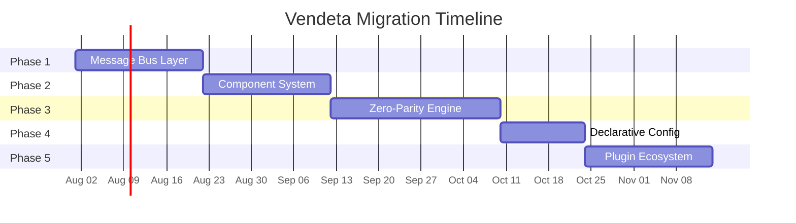
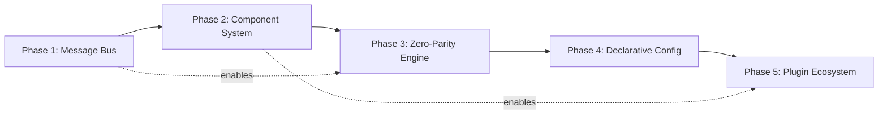
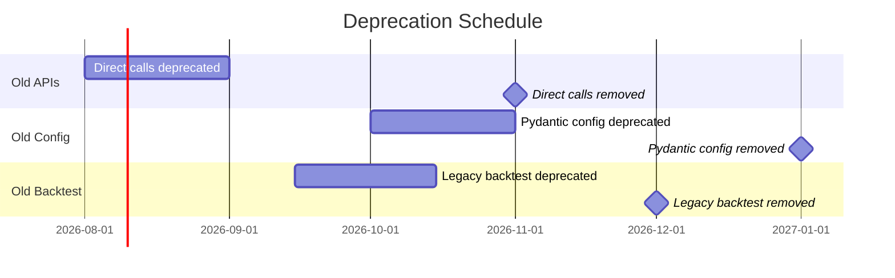

# 24 — Migration Path

**Version:** 1.0  
**Status:** Draft  
**Last Updated:** 2026-07-22  
**Related:** [02-Architecture Overview](./02-architecture-overview.md), [04-Message-Driven Architecture](./04-message-driven-architecture.md), [05-Component Lifecycle](./05-component-lifecycle.md)

---

## 1. Overview

### Purpose

This document defines the **phased migration path** from the current TradeXV2 Python codebase to the target Vendeta Rust framework. Migration is incremental — each phase delivers working software while progressively adopting the new architecture.

### Migration Philosophy

| Principle | Implementation |
|-----------|----------------|
| **Incremental** | 5 phases, each independently deployable |
| **Non-breaking** | Compatibility layer bridges old ↔ new |
| **Testable** | Each phase has exit criteria |
| **Reversible** | Can roll back to previous phase |
| **Parallel** | Old and new systems run side-by-side during transition |

### Current State → Target State

| Aspect | Current (TradeXV2) | Target (Vendeta) |
|--------|--------------------|--------------------|
| Language | Python | Rust |
| Communication | Direct function calls | Message bus (typed channels) |
| Components | Monolithic classes | Trait-based components |
| Backtest/Live | Separate code paths | Zero-parity (same code) |
| Configuration | Pydantic models | YAML + env vars |
| Brokers | Tightly coupled | Adapter plugins |
| Testing | Integration only | Full pyramid + parity |

---

## 2. Requirements

### Functional

| ID | Requirement |
|----|-------------|
| FR-01 | 5-phase migration with clear boundaries |
| FR-02 | Compatibility layer for gradual transition |
| FR-03 | Each phase independently deployable |
| FR-04 | No data loss during migration |
| FR-05 | Rollback capability at each phase |
| FR-06 | Deprecation warnings for old APIs |
| FR-07 | Migration validation tests |

### Non-Functional

| ID | Requirement | Target |
|----|-------------|--------|
| NFR-01 | Zero downtime during migration | No service interruption |
| NFR-02 | Phase duration | 2-4 weeks per phase |
| NFR-03 | Rollback time | < 5 minutes |

---

## 3. Migration Phases

### Phase Overview



### Phase Dependencies



---

## 4. Phase 1: Message Bus Layer

### Objective

Introduce the `MessageBus` as the central communication channel. Replace direct function calls between components with publish/subscribe messaging.

### Tasks

| # | Task | Effort |
|---|------|--------|
| 1.1 | Implement `vendeta-bus` crate (broadcast + mpsc) | 3 days |
| 1.2 | Define message types (MarketEvent, OrderEvent) | 2 days |
| 1.3 | Create `BusBridge` — wraps old direct calls as messages | 2 days |
| 1.4 | Migrate data feed to publish via bus | 2 days |
| 1.5 | Migrate execution to subscribe from bus | 2 days |
| 1.6 | Add sequence numbering | 1 day |
| 1.7 | Integration tests (message ordering) | 2 days |

### Compatibility Layer

```rust
/// BusBridge allows old code to work with the new message bus
/// without modification. Old components call BusBridge methods
/// which internally publish/subscribe on the bus.
pub struct BusBridge {
    bus: MessageBus,
}

impl BusBridge {
    /// Old code calls this instead of direct function call.
    /// Internally publishes to the message bus.
    pub fn notify_bar(&self, bar: Bar) {
        self.bus.publish(Message::Market(MarketEvent::Bar(bar)));
    }

    /// Old code registers a callback.
    /// Internally subscribes to the message bus.
    pub fn on_bar<F: Fn(&Bar) + Send + 'static>(&self, handler: F) {
        self.bus.subscribe(move |msg| {
            if let Message::Market(MarketEvent::Bar(bar)) = msg {
                handler(bar);
            }
        });
    }
}
```

### Exit Criteria

- [ ] All inter-component communication goes through MessageBus
- [ ] Message ordering verified (property tests)
- [ ] Old system still works via BusBridge
- [ ] No performance regression > 10%
- [ ] Sequence numbers assigned to all messages

---

## 5. Phase 2: Component System

### Objective

Extract `Strategy`, `BrokerGateway`, and `Component` traits. Build `ComponentFactory` for plugin registration. Migrate existing brokers to adapter pattern.

### Tasks

| # | Task | Effort |
|---|------|--------|
| 2.1 | Define `Component` trait with lifecycle | 2 days |
| 2.2 | Define `Strategy` trait | 2 days |
| 2.3 | Define `BrokerGateway` trait | 2 days |
| 2.4 | Implement `LifecycleManager` | 3 days |
| 2.5 | Implement `ComponentFactory` | 2 days |
| 2.6 | Migrate Dhan broker to `BrokerGateway` impl | 3 days |
| 2.7 | Migrate Upstox broker to `BrokerGateway` impl | 2 days |
| 2.8 | Extract existing strategies to `Strategy` trait | 3 days |
| 2.9 | Integration tests (lifecycle, adapters) | 2 days |

### Compatibility Layer

```rust
/// AdapterCompat wraps old broker code in the new BrokerGateway trait.
/// Allows gradual migration of broker implementations.
pub struct AdapterCompat {
    old_broker: Box<dyn OldBrokerInterface>,
}

#[async_trait]
impl BrokerGateway for AdapterCompat {
    async fn connect(&mut self) -> Result<(), GatewayError> {
        self.old_broker.initialize().await
            .map_err(|e| GatewayError::Connection(e.to_string()))
    }

    async fn place_order(&self, order: &Order) -> Result<OrderId, GatewayError> {
        // Convert new Order type to old format
        let old_order = convert_to_old_order(order);
        let old_id = self.old_broker.submit_order(old_order).await
            .map_err(|e| GatewayError::OrderRejected(e.to_string()))?;
        Ok(convert_order_id(old_id))
    }

    // ... other methods delegate to old implementation
}
```

### Exit Criteria

- [ ] All brokers implement `BrokerGateway` trait
- [ ] All strategies implement `Strategy` trait
- [ ] LifecycleManager controls all component startup/shutdown
- [ ] ComponentFactory can build a node from code
- [ ] Old broker code removed or behind compat layer

---

## 6. Phase 3: Zero-Parity Engine

### Objective

Consolidate backtest and live execution into a single `ExecutionEngine`. Ensure the same strategy code runs identically in both modes. Add parity tests.

### Tasks

| # | Task | Effort |
|---|------|--------|
| 3.1 | Implement `Clock` trait (LiveClock, BacktestClock) | 2 days |
| 3.2 | Implement `FillSource` trait | 2 days |
| 3.3 | Implement `SimulatedFillSource` | 3 days |
| 3.4 | Implement `BrokerFillSource` | 2 days |
| 3.5 | Consolidate OMS + ExecutionEngine | 3 days |
| 3.6 | Implement `BacktestEngine` (replay loop) | 3 days |
| 3.7 | Implement slippage models | 2 days |
| 3.8 | Implement commission models (IndianBrokerage) | 1 day |
| 3.9 | Write parity tests (golden datasets) | 3 days |
| 3.10 | Remove old separate backtest code | 2 days |

### Compatibility Layer

```rust
/// During migration, the old backtest engine can still be used.
/// The new BacktestEngine runs alongside for comparison.
pub enum EngineMode {
    /// New unified engine (target)
    Unified,
    /// Old separate backtest (deprecated)
    #[deprecated(note = "Use EngineMode::Unified")]
    LegacyBacktest,
}

/// Parity validation during migration:
/// Run both engines on same data, compare results.
pub fn validate_parity(
    strategy: &dyn Strategy,
    data: &[Bar],
) -> ParityReport {
    let new_result = run_unified_backtest(strategy, data);
    let old_result = run_legacy_backtest(strategy, data);

    ParityReport {
        trades_match: new_result.trades == old_result.trades,
        pnl_match: (new_result.total_pnl - old_result.total_pnl).abs() < Money(1),
        discrepancies: find_discrepancies(&new_result, &old_result),
    }
}
```

### Exit Criteria

- [ ] Single ExecutionEngine for both modes
- [ ] Parity tests pass (same strategy → same results)
- [ ] Old separate backtest code removed
- [ ] Clock abstraction in place (no `SystemTime` in strategy)
- [ ] Fill simulation matches expected behavior
- [ ] Golden dataset tests established

---

## 7. Phase 4: Declarative Configuration

### Objective

Replace code-based configuration with YAML. Implement `ComponentFactory` that builds a complete `TradingNode` from a config file. Add env var substitution.

### Tasks

| # | Task | Effort |
|---|------|--------|
| 4.1 | Define YAML schema (`TradingNodeConfig`) | 2 days |
| 4.2 | Implement env var substitution (`${VAR}`) | 1 day |
| 4.3 | Implement config validation (serde) | 2 days |
| 4.4 | Implement `ComponentFactory` (config → node) | 3 days |
| 4.5 | Migrate existing config to YAML | 2 days |
| 4.6 | Implement `vendeta configure` wizard | 2 days |
| 4.7 | Deprecate old config system | 1 day |

### Compatibility Layer

```rust
/// ConfigCompat reads old Pydantic-style config and converts
/// to new YAML-based TradingNodeConfig.
pub struct ConfigCompat;

impl ConfigCompat {
    /// Load from old format, convert to new.
    pub fn from_legacy(legacy: &LegacyConfig) -> TradingNodeConfig {
        TradingNodeConfig {
            node: NodeConfig {
                name: legacy.instance_name.clone(),
                mode: legacy.mode.into(),
                ..Default::default()
            },
            adapters: legacy.brokers.iter().map(|b| AdapterSection {
                name: b.name.clone(),
                adapter_type: b.broker_type.clone(),
                config: convert_broker_config(b),
            }).collect(),
            strategies: legacy.strategies.iter().map(|s| StrategySection {
                name: s.name.clone(),
                strategy_type: s.strategy_type.clone(),
                config: convert_strategy_config(s),
            }).collect(),
            ..Default::default()
        }
    }
}
```

### Exit Criteria

- [ ] Full node configurable via YAML
- [ ] Env var substitution working
- [ ] Config validation catches errors at startup
- [ ] `vendeta configure` wizard works
- [ ] Old config format deprecated with warnings
- [ ] Example configs in `config/` directory

---

## 8. Phase 5: Plugin Ecosystem

### Objective

Publish core framework to crates.io. Publish broker adapters as separate packages. Open plugin registration to community.

### Tasks

| # | Task | Effort |
|---|------|--------|
| 5.1 | Finalize public API (mark `pub` vs `pub(crate)`) | 3 days |
| 5.2 | Add rustdoc to all public items | 3 days |
| 5.3 | Publish core crates to crates.io | 1 day |
| 5.4 | Publish adapter crates separately | 1 day |
| 5.5 | Create template repositories | 2 days |
| 5.6 | Write plugin development guide | 2 days |
| 5.7 | Set up plugin directory | 1 day |
| 5.8 | Community announcement | 1 day |

### Exit Criteria

- [ ] All crates published to crates.io
- [ ] Template repos created and tested
- [ ] Plugin guide complete
- [ ] At least one community plugin exists
- [ ] API docs generated (docs.rs)
- [ ] Migration complete — old codebase archived

---

## 9. Deprecation Policy

### Deprecation Timeline



### Deprecation Rules

1. **Minimum 4 weeks** between deprecation and removal
2. **Compiler warnings** (`#[deprecated]`) on all old APIs
3. **Migration guide** for each deprecated feature
4. **Runtime warnings** for deprecated config keys
5. **Never remove in PATCH** — only in MAJOR or MINOR (pre-1.0)

```rust
/// Old direct-call interface.
#[deprecated(
    since = "0.2.0",
    note = "Use MessageBus publish/subscribe instead. \
            See: docs/guide/migration-message-bus.md"
)]
pub fn process_bar_direct(bar: &Bar, strategy: &mut dyn Strategy) {
    // Delegate to new bus-based dispatch
    let msg = Message::Market(MarketEvent::Bar(bar.clone()));
    BUS.publish(msg);
}
```

---

## 10. Data Migration

### Storage Migration

| Data Type | Old Format | New Format | Migration |
|-----------|-----------|------------|-----------|
| Historical bars | CSV files | Parquet (Hive-partitioned) | Script: CSV → Parquet |
| Orders | SQLite (old schema) | SQLite (new schema) | Schema migration |
| Event log | None | Append-only binary log | New (no migration needed) |
| Config | Python dict / Pydantic | YAML | Script: export → YAML |

### Migration Script

```rust
/// Migrate historical data from CSV to Parquet.
pub fn migrate_csv_to_parquet(
    csv_dir: &Path,
    parquet_dir: &Path,
) -> Result<MigrationReport, MigrationError> {
    let mut report = MigrationReport::default();

    for csv_file in fs::read_dir(csv_dir)? {
        let path = csv_file?.path();
        if path.extension().map_or(false, |e| e == "csv") {
            let symbol = extract_symbol(&path);
            let bars = read_csv_bars(&path)?;
            let parquet_path = parquet_dir
                .join(&symbol)
                .join("1d")
                .join("data.parquet");

            write_parquet(&parquet_path, &bars)?;
            report.migrated += 1;
            report.total_bars += bars.len();
        }
    }

    Ok(report)
}
```

---

## 11. Rollback Strategy

### Per-Phase Rollback

| Phase | Rollback Action | Time |
|-------|-----------------|------|
| Phase 1 | Revert to direct calls (BusBridge removed) | < 5 min |
| Phase 2 | Revert to old broker classes | < 5 min |
| Phase 3 | Re-enable legacy backtest engine | < 5 min |
| Phase 4 | Revert to old config loading | < 5 min |
| Phase 5 | Unpublish crates (yank), revert to monorepo | < 15 min |

### Rollback Triggers

- Critical bug in new system affecting live trading
- Performance regression > 50%
- Data integrity issue
- Inability to fix within 1 hour

### Rollback Procedure

```bash
# 1. Stop new system
vendeta stop

# 2. Switch to old system (kept running in parallel during migration)
python -m tradex.main --config config/legacy.yaml &

# 3. Verify old system operational
curl http://localhost:8080/health

# 4. Investigate issue
# 5. Fix and re-deploy new system when ready
```

---

## 12. Validation Tests

### Migration Validation

```rust
/// Run after each phase to validate migration correctness.
#[cfg(test)]
mod migration_tests {
    /// Phase 1: Messages flow through bus correctly.
    #[test]
    fn phase1_message_bus_operational() {
        let bus = MessageBus::new(1024);
        let (tx, mut rx) = tokio::sync::mpsc::channel(100);

        bus.subscribe(move |msg| { tx.try_send(msg.clone()).ok(); });
        bus.publish(Message::Market(MarketEvent::Bar(test_bar())));

        let received = rx.try_recv().unwrap();
        assert!(matches!(received, Message::Market(MarketEvent::Bar(_))));
    }

    /// Phase 2: Components have proper lifecycle.
    #[test]
    fn phase2_lifecycle_management() {
        let mut lm = LifecycleManager::new();
        let component = TestComponent::new();
        lm.register(Box::new(component));

        lm.start_all();
        assert!(lm.all_running());

        lm.stop_all();
        assert!(lm.all_stopped());
    }

    /// Phase 3: Parity between backtest and live simulation.
    #[test]
    fn phase3_parity_holds() {
        let strategy = TestStrategy::new();
        let data = load_golden_dataset("reliance_1d_100bars");

        let backtest_result = run_backtest(&strategy, &data);
        let simulated_live = run_simulated_live(&strategy, &data);

        assert_eq!(backtest_result.trades, simulated_live.trades);
        assert_eq!(backtest_result.total_pnl, simulated_live.total_pnl);
    }

    /// Phase 4: Config produces correct node.
    #[test]
    fn phase4_config_builds_node() {
        let config = load_config("config/test-node.yaml");
        let node = ComponentFactory::build(config).unwrap();
        assert_eq!(node.name(), "test-node");
        assert_eq!(node.strategy_count(), 1);
        assert_eq!(node.adapter_count(), 1);
    }

    /// Phase 5: Plugin registration works.
    #[test]
    fn phase5_plugin_registration() {
        let mut registry = PluginRegistry::new();
        let plugin = TestPlugin::new();
        plugin.register(&mut registry);

        assert!(registry.has_adapter("test-broker"));
        assert!(registry.has_strategy("test-strategy"));
    }
}
```

---

## 13. Error Handling

### Migration-Specific Errors

| Error | Cause | Recovery |
|-------|-------|----------|
| `MigrationError::SchemaMismatch` | Old data doesn't fit new schema | Run schema migration script |
| `MigrationError::DataLoss` | Rows lost during conversion | Restore from backup, re-run |
| `MigrationError::CompatFailure` | Compat layer can't translate | Fall back to old system |
| `MigrationError::ParityFailure` | Results differ between engines | Debug with golden dataset |
| `MigrationError::ConfigInvalid` | Old config can't convert | Manual config migration |

```rust
#[derive(Debug, thiserror::Error)]
pub enum MigrationError {
    #[error("Schema mismatch: {old_schema} → {new_schema}: {details}")]
    SchemaMismatch {
        old_schema: String,
        new_schema: String,
        details: String,
    },

    #[error("Data loss detected: expected {expected} rows, got {actual}")]
    DataLoss { expected: usize, actual: usize },

    #[error("Compatibility layer failure: {0}")]
    CompatFailure(String),

    #[error("Parity check failed: {discrepancies} discrepancies found")]
    ParityFailure { discrepancies: usize },

    #[error("Config migration failed: {0}")]
    ConfigInvalid(String),
}
```

---

## 14. Implementation Notes

### Patterns

1. **Strangler fig**: New system wraps old system, gradually replacing it.
2. **Parallel running**: Both systems run during transition; compare outputs.
3. **Feature flags**: `#[cfg(feature = "legacy")]` gates old code paths.
4. **Migration scripts**: Idempotent, resumable, with progress reporting.

### Gotchas

- **Don't migrate everything at once**: Each phase is independently valuable.
- **Keep old system running**: Until new system is proven in production.
- **Test with real data**: Golden datasets from production, not synthetic.
- **Monitor during migration**: Extra logging, metrics comparison.
- **Communicate**: Users need to know about config format changes.
- **Python → Rust**: Some migration is a language rewrite, not just refactoring.

---

## 15. Cross-References

| Document | Relevance |
|----------|-----------|
| [02-Architecture Overview](./02-architecture-overview.md) | Target architecture |
| [04-Message-Driven Architecture](./04-message-driven-architecture.md) | Phase 1 target |
| [05-Component Lifecycle](./05-component-lifecycle.md) | Phase 2 target |
| [12-Zero-Parity Engine](./12-zero-parity-engine.md) | Phase 3 target |
| [15-Configuration](./15-configuration.md) | Phase 4 target |
| [14-Plugin System](./14-plugin-system.md) | Phase 5 target |
| [21-Versioning](./21-versioning.md) | Deprecation policy alignment |
| [17-Testing](./17-testing.md) | Migration validation tests |
