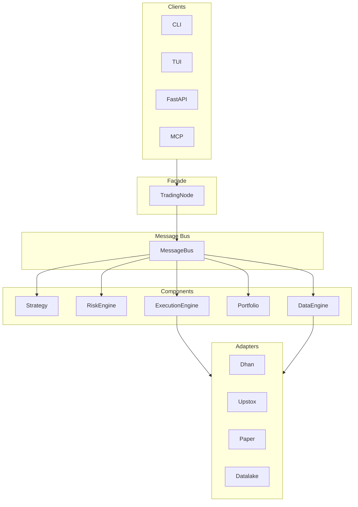

# 01 — Architecture (High-Level Design)

## 1. System Overview

TradeX is an event-driven, broker-agnostic quantitative trading platform reimplemented under NautilusTrader engine patterns: MessageBus spine, Clock + Cache, venue adapters, deterministic replay, and research-to-live parity across four execution modes.

```
┌─────────────────────────────────────────────────────────────────┐
│  INTERFACE LAYER  (Presentation — no broker imports)            │
│  CLI · TUI · FastAPI · WebSocket · MCP                          │
└──────────────────────────────┬──────────────────────────────────┘
                               │
┌──────────────────────────────▼──────────────────────────────────┐
│  RUNTIME LAYER  (Composition Root — ONLY layer touching         │
│  concrete brokers/plugins)                                       │
│  TradingNode · ComponentRegistry · ComponentFactory ·           │
│  LifecycleManager · ConfigManager · MessageBus                  │
└──────────────────────────────┬──────────────────────────────────┘
                               │
┌──────────────────────────────▼──────────────────────────────────┐
│  APPLICATION LAYER  (Use-cases — NO infra/runtime/broker imports)│
│  OMS · ExecutionEngine · StrategyEngine · DataEngine · Analytics│
│  TradingContext · TradingOrchestrator                           │
└──────────────────────────────┬──────────────────────────────────┘
                               │
┌──────────────────────────────▼──────────────────────────────────┐
│  INFRASTRUCTURE LAYER  (Adapters — implements domain ports)     │
│  MessageBus impl · Idempotency · Auth · IO · Resilience ·         │
│  Observability · Broker plugins · Datalake                      │
└──────────────────────────────┬──────────────────────────────────┘
                               │
┌──────────────────────────────▼──────────────────────────────────┐
│  DOMAIN LAYER  (Entities, ports, events — imports NOTHING inward)│
│  entities/ · value_objects/ · events/ · commands/ · ports/ ·      │
│  services/ · policies/                                          │
└──────────────────────────────┬──────────────────────────────────┘
                               │
┌──────────────────────────────▼──────────────────────────────────┐
│  SHARED LAYER  (Cross-cutting utilities — no business logic)    │
│  logging/ · config/ · types/ · errors/ · messaging/             │
└─────────────────────────────────────────────────────────────────┘
```

## 2. Stack Table

| Layer | Technology | Role |
|-------|------------|------|
| Interface | Click, Textual, FastAPI, WebSocket, MCP | User interaction surfaces |
| Runtime | Python composition root | Wire components, discover plugins |
| Application | Pure Python use-cases | OMS, execution, strategy, analytics, TradingContext |
| Infrastructure | Python adapters + plugins | Message bus, auth, IO, brokers, datalake |
| Domain | Python dataclasses, Protocols | Entities, ports, events, policies |
| Shared | structlog, Pydantic helpers | Logging, config, types, errors |
| Storage | Parquet, DuckDB | Historical data, analytics |
| Observability | OpenTelemetry, Prometheus | Tracing, metrics export |

## 3. System Boundaries

| Boundary | Responsibility |
|----------|----------------|
| `interface/` | CLI, TUI, API, WebSocket, MCP — presentation only |
| `runtime/` | Composition root, plugin discovery, mode resolution, ComponentFactory |
| `application/` | Use-cases: OMS, execution, trading, analytics, TradingContext |
| `infrastructure/` | Cross-cutting adapters + broker/datalake plugins |
| `domain/` | Pure business logic — entities, ports, events, policies |
| `shared/` | Logging, config helpers, types, errors — no business logic |
| `plugins/brokers/` | Gateway → Connection → Sub-Adapters per venue |
| `plugins/exchanges/` | Exchange adapters and trading calendars |
| `datalake/` | Storage, ingestion, quality, analytics views |
| `config/` | AppConfig schema and profiles |

## 4. Dependency Rule

```
interface/      ──▶  runtime/       (composition root ONLY touches concretes)
runtime/         ──▶  infrastructure/ + application/ + plugins/
infrastructure/  ──▶  domain/ + shared/ + application ports
application/     ──▶  domain/ + shared/
shared/          ──▶  stdlib only
domain/          ──▶  (NOTHING inward — stdlib + itself only)
plugins/         ──▶  domain/ + shared/  (discovered by runtime)
```

### Import-Linter Contracts (CI-Enforced)

| Contract | Rule |
|----------|------|
| Domain purity | domain may not import application, infrastructure, runtime, interface |
| Application isolation | application may not import infrastructure, runtime, interface |
| Infrastructure scope | infrastructure may not import runtime or interface |
| Interface routing | interface may not import infrastructure directly — via runtime |
| Broker independence | dhan, upstox, paper plugins are mutually independent |

### Enforced Invariants

1. **Domain purity** — domain may not import application, infrastructure, runtime, brokers, or interface
2. **Application isolation** — application may not import infrastructure, runtime, brokers, or interface
3. **Runtime exclusivity** — runtime is the ONLY layer permitted concrete broker/plugin imports
4. **Strategy isolation** — strategies/scanners must not reach into OMS/execution directly
5. **Trading without strategies** — OMS + execution must be usable with zero strategies loaded
6. **Broker selection once** — active broker resolved at startup via enum, never string branching

## 5. Component Layers

| Layer | Components | Responsibility |
|-------|------------|----------------|
| Interface | CLI, TUI, API, MCP | User interaction surfaces |
| Composition | ComponentRegistry, LifecycleManager, MessageBus, ConfigManager | Framework assembly and lifecycle |
| Execution | OrderManager, PositionManager, RiskManager, PortfolioManager, ExecutionEngine, StrategyEngine | Trading logic |
| Data | MarketDataEngine, HistoricalDataEngine, InstrumentEngine | Data management |
| Adapters | DhanAdapter, UpstoxAdapter, PaperAdapter, DataLakeAdapter | External system integration |
| Domain | Entities, ValueObjects, Events, Ports | Business model |

## 6. High-Level Architecture (Message-Driven)



## 7. Storage Model

| Store | Format | Owner | Purpose |
|-------|--------|-------|---------|
| Historical bars | Parquet | Datalake | Canonical OHLCV |
| Analytics | DuckDB | Datalake | SQL views, aggregations |
| Instrument master | Parquet + resolver | Broker plugin + domain ports | Symbol resolution |
| Token persistence | JSON/state file | Per-broker auth | OAuth/TOTP tokens |
| Idempotency ledger | In-memory + optional persistence | Infrastructure | Order deduplication |
| Quote snapshots | TradingCache (in-memory) | Application | Live market state |
| Message log | Durable event store | MessageBus | Deterministic ReplayEngine |
| Corporate actions | Parquet | Datalake | Adjustment for backtest/replay |

## 8. Auth and Access Model

| Concern | Model |
|---------|-------|
| Broker auth | Per-broker: OAuth (Upstox), TOTP + token store (Dhan) |
| API auth | Environment-based credentials; no secrets in config files |
| Token refresh | Automatic with cooldown; auth modules own persistence |
| Live safety | LIVE environment requires explicit enablement and parity gate pass |

## 9. Plugin Model

Brokers and exchanges are discovered via Python entry-point groups:

```
tradex.brokers  →  dhan, upstox, paper
tradex.exchanges  →  nse
```

- Runtime resolves active broker **once at startup** via broker_id enum
- Each broker plugin self-registers at import time
- Exchange plugins expose ADAPTER (ExchangeAdapter) and CALENDAR (TradingCalendar)
- No central switch statements for broker selection

## 10. Core Invariants

| ID | Invariant | Enforcement |
|----|-----------|-------------|
| I1 | Zero-parity: same ExecutionEngine/RiskEngine/FSM in all environments | Parity gate tests |
| I2 | RiskGate bound before accepting traffic | Structural boot check |
| I3 | Clock injected; no bare datetime.now() in mappers | Boot check + code review |
| I4 | Cache-then-publish for quotes | Flow contract |
| I5 | Idempotency before venue I/O | Order flow contract |
| I6 | Reconciliation before accepting risk after reconnect | Reconciliation contract |
| I7 | Environment frozen at boot | Mode contract |
| I8 | Domain stays pure (no I/O, no broker imports) | Import linter |
| I9 | Strategies cannot import OMS/execution | Import linter |
| I10 | Instrument wire identifiers never leak to gateway callers | Adapter contract |
| I11 | Single ExecutionEngine spine — no bypass order paths | Architecture test |
| I12 | Four-mode parity — Replay/Backtest/Paper/Live share FSM | Parity gate |
| I13 | FeaturePipeline precedes strategy callbacks | Flow contract |
| I14 | Durable event log enables deterministic replay | Replay contract |
| I15 | No god classes — max dependency degree ≤ 50 | Architecture graph test |
| I16 | Event completeness — every OMS state change emits one domain event | FSM audit test |
| I17 | Lifecycle safety — no messages before initialize() or after stop() | Lifecycle test |

## 11. Data Flow Architecture

```
Data Source → Strategy Engine → Risk Manager → Execution Engine
                    │                │                │
                    ▼                ▼                ▼
              Order Manager ◀──▶ Position Manager ◀──▶ Fill Source
                    │                │                │
                    └────────────────┴────────────────┘
                                     │
                                     ▼
                              MESSAGE BUS
                    (OrderCommand, OrderFilled, PositionUpdated)
```

## 12. Four-Mode Environment Matrix

| Mode | Data Source | FillSource | Clock | Purpose |
|------|-------------|------------|-------|---------|
| REPLAY | Event log / recorded session | Engine replay (same FSM) | FakeClock | Audit, debug, regression |
| BACKTEST | Datalake / Parquet / DuckDB | SimulatedFillSource | FakeClock | Historical research |
| PAPER | Live DataProvider | PaperFillSource | SystemClock | Live-data simulation |
| LIVE | Live DataProvider | BrokerFillSource | SystemClock | Real venue execution |

Strategy, RiskEngine, ExecutionEngine (minus FillSource), position projection, FeaturePipeline, and event types are identical across all four modes. Environment frozen at boot.

## 12a. Nautilus Concept Map

| NautilusTrader Pattern | TradeX Component | Layer |
|------------------------|------------------|-------|
| TradingNode | TradingNode | Public SDK |
| MessageBus | MessageBus / EventBus | Infrastructure |
| Clock | SystemClock / FakeClock | Infrastructure |
| Cache | TradingCache | Application (OMS) |
| Actors | Strategy + Scanner | Application |
| Portfolio | PositionManager + PortfolioModel | Application |
| Execution engine | ExecutionEngine | Application |
| Venue adapters | BrokerAdapter plugins | Plugins |
| Event store | MessageLog (durable) | Infrastructure |
| Data catalog | Datalake + InstrumentMaster | Datalake |

## 12b. Immutable Research Pipeline

```
VenueAdapter / Datalake
  → MarketDataEngine
  → FeaturePipeline
  → Indicators
  → StrategyEngine / Scanners
  → Signals
  → PortfolioModel
  → RiskGate
  → ExecutionEngine (OMS)
  → FillSource (Replay / Simulated / Paper / Broker)
```

Every stage publishes/consumes via MessageBus. No stage bypasses another.

## 13. Performance Architecture

### Design Targets

| Target | Specification |
|--------|---------------|
| Order processing latency | Sub-millisecond for local risk + routing (excludes venue RTT) |
| Message dispatch | Zero-copy: immutable frozen dataclasses passed by reference |
| Market data throughput | Batch publishing to reduce bus traffic |
| Historical data | Columnar storage (Parquet/Arrow); vectorized reads |
| I/O model | Async for WebSocket, HTTP, and file operations |

### Zero-Copy Data Pipeline

```
Market Data Source → MessageBus → Strategy → ExecutionEngine → Adapter
                           │
                           ├── Immutable messages (frozen dataclasses)
                           ├── Batch publishing (coalesce quote updates)
                           └── Backpressure (queue size limits)
```

### Key Performance Patterns

1. **Immutable messages** — No defensive copying; handlers must not mutate
2. **Batch processing** — QuoteBatch, BarBatch messages reduce dispatch overhead
3. **Async I/O** — WebSocket and HTTP in async tasks; CPU-bound work in thread pool
4. **Object pooling** — Optional pool for high-frequency message types in hot path
5. **Columnar data** — Parquet/Arrow for historical; avoid row-by-row Python loops
6. **Priority queues** — Order commands prioritized over market data in MessageBus

### Scalability Tiers

| Tier | Components | Scaling Model |
|------|------------|---------------|
| Strategy layer | Strategies, scanners | Multiple strategies per instance |
| Framework core | OMS, execution, risk | Single instance per trading account |
| Data layer | Market data, datalake | Horizontal ingestion; shared storage |
| Connectivity | Broker adapters | One adapter per broker connection |
